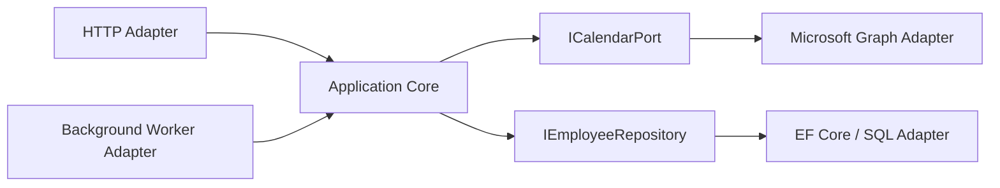
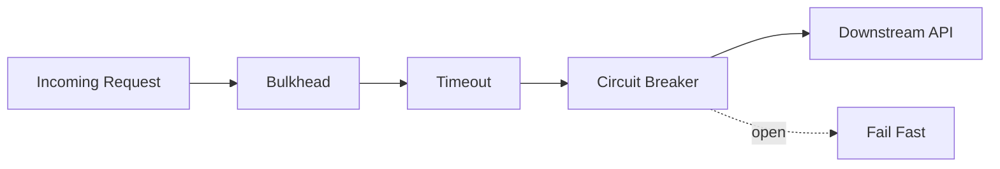
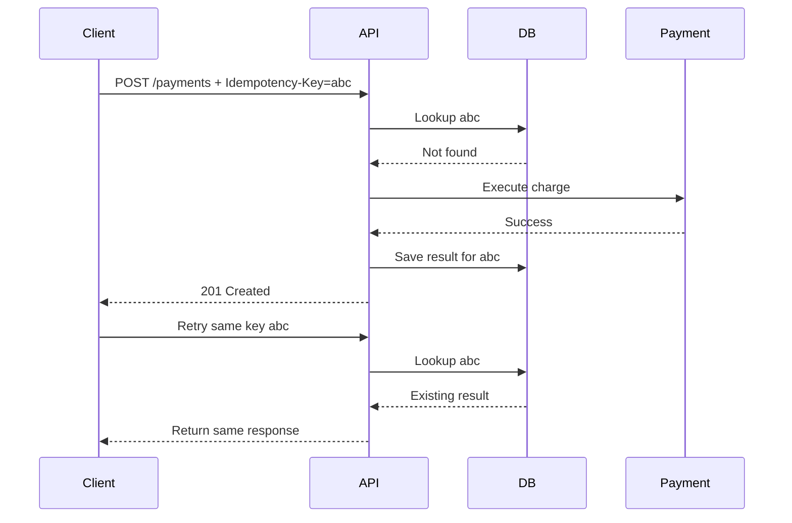
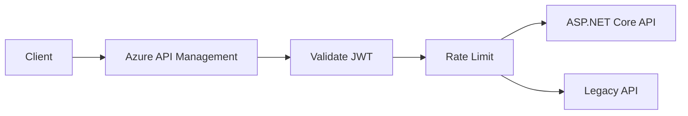
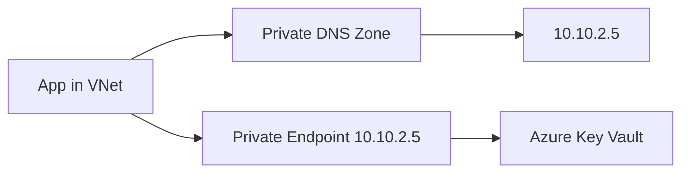
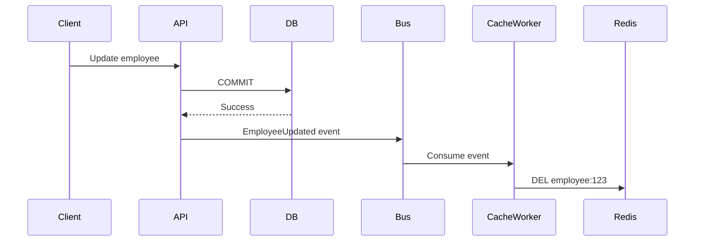
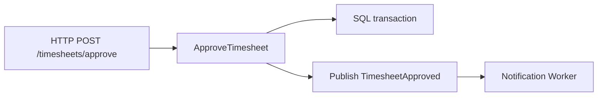
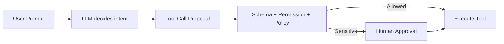
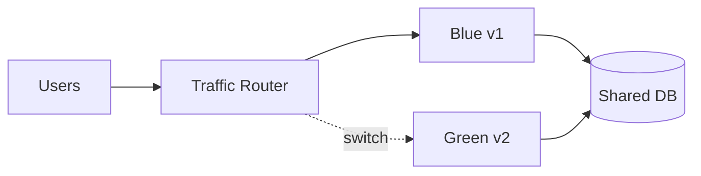

# Daily Knowledge Sharing — 17/08/2026

## Today’s Topics

1. Hexagonal Architecture — Ports & Adapters để bảo vệ business core khỏi framework và SDK ngoài
2. Resilience — Circuit Breaker + Bulkhead + Timeout phối hợp như một hệ thống thay vì từng policy rời rạc
3. API Idempotency Key — chống duplicate command trong payment và write API
4. EF Core N+1 Query — nhận diện bằng telemetry và sửa bằng projection thay vì Include vô điều kiện
5. Azure API Management — policy boundary cho auth, throttling, transform và observability
6. Azure Private DNS + Private Endpoint — vì sao private networking hỏng thường do DNS chứ không phải firewall
7. Cache Consistency — stale data, TTL, event invalidation và cách chọn mức nhất quán phù hợp
8. OpenTelemetry Span Design — trace hữu ích cần semantic span, attribute và error status đúng
9. AI Tool Calling Guardrails — model đề xuất hành động, deterministic code quyết định quyền thực thi
10. Blue-Green Rollback Design — rollback không chỉ là đổi traffic mà còn phải tương thích database và message schema

---

# 1. Hexagonal Architecture — Ports & Adapters để bảo vệ business core khỏi framework và SDK ngoài

### 1. What is it?

Hexagonal Architecture, còn gọi là Ports & Adapters, tổ chức hệ thống quanh **business capability** thay vì quanh framework hay database. Core application định nghĩa các port — tức interface mô tả điều hệ thống cần làm — còn adapter là implementation kết nối port đó với HTTP, SQL, Azure, Microsoft Graph, Redis hoặc message broker.

Điểm cốt lõi không phải hình lục giác hay folder structure. Mục tiêu là để business rule có thể tồn tại độc lập với hạ tầng.

### 2. Why does it exist?

Một codebase tăng trưởng tự nhiên thường để controller gọi trực tiếp EF Core, Graph SDK, Redis và Service Bus. Ban đầu nhanh, nhưng dần xuất hiện ba vấn đề: test khó vì business logic dính external dependency; thay SDK làm lan thay đổi; và business rule bị phân tán qua controller/service/repository.

Hexagonal Architecture tạo một dependency boundary: core biết interface, adapter biết core, nhưng core không biết adapter.

### 3. How does it work?



Inbound adapter kích hoạt use case. Application core xử lý orchestration và domain rule. Outbound port mô tả dependency mà core cần. Infrastructure adapter hiện thực port đó.

### 4. Practical example

```csharp
public interface ICalendarGateway
{
    Task MoveEventAsync(Guid userId, string eventId, DateTimeOffset start, DateTimeOffset end, CancellationToken ct);
}

public sealed class RescheduleMeetingHandler
{
    private readonly ICalendarGateway _calendar;

    public RescheduleMeetingHandler(ICalendarGateway calendar) => _calendar = calendar;

    public Task HandleAsync(RescheduleMeeting command, CancellationToken ct)
        => _calendar.MoveEventAsync(command.UserId, command.EventId, command.Start, command.End, ct);
}
```

`GraphCalendarGateway` có thể dùng Microsoft Graph SDK nhưng application layer không cần biết SDK đó tồn tại.

### 5. Real production scenario

Trong employee-management system, cùng một use case “offboard employee” có thể được gọi từ API, scheduled job hoặc admin console. Business flow không nên nhân ba. Ba inbound adapter cùng gọi application core; các outbound adapter xử lý Exchange Online, Graph, database và audit logging.

### 6. Common mistakes

- Tạo hàng trăm interface chỉ để “đúng kiến trúc”.
- Để DTO/exception của SDK ngoài rò vào application core.
- Biến port thành generic repository không còn ngôn ngữ business.
- Nghĩ kiến trúc là cách chia project thay vì dependency direction.

### 7. Trade-offs

**Advantages**
- Business core test dễ hơn.
- Thay đổi hạ tầng ít lan rộng.
- Boundary rõ cho integration và ownership.

**Costs / Risks**
- Nhiều abstraction hơn.
- Mapping model tăng.
- Với CRUD nhỏ, lợi ích có thể không đủ bù ceremony.

### 8. Junior → Middle → Senior understanding

**Junior**: hiểu interface dùng để đảo dependency, không phải để “trông đẹp”.

**Middle**: biết tách adapter, mapping exception và viết integration test ở boundary.

**Senior / Technical Lead**: biết port nào đáng tồn tại, tránh abstraction leakage và cân bằng simplicity với isolation.

### 9. Key takeaway

- Core định nghĩa capability; infrastructure chỉ là adapter.
- Đừng để SDK ngoài quyết định model của domain.
- Hexagonal Architecture là dependency design, không phải folder convention.

---

# 2. Resilience — Circuit Breaker + Bulkhead + Timeout phối hợp như một hệ thống thay vì từng policy rời rạc

### 1. What is it?

Resilience không phải “thêm retry”. Một production call chain cần phối hợp timeout, circuit breaker, bulkhead và retry sao cho một dependency lỗi không kéo sập toàn bộ service.

### 2. Why does it exist?

Khi downstream chậm, thread/request phía trên bị giữ lâu. Nếu mọi request tiếp tục gọi dependency đang lỗi, connection pool cạn, ThreadPool nghẽn và hệ thống khỏe cũng chết theo. Retry sai còn khuếch đại traffic.

### 3. How does it work?



Bulkhead giới hạn concurrent work. Timeout chặn call kéo dài vô hạn. Circuit breaker mở khi failure rate vượt threshold để fail fast. Retry chỉ nên áp dụng cho transient lỗi và còn nằm trong timeout budget tổng.

### 4. Practical example

```csharp
services.AddHttpClient<GraphClient>()
    .AddStandardResilienceHandler(options =>
    {
        options.AttemptTimeout.Timeout = TimeSpan.FromSeconds(3);
        options.TotalRequestTimeout.Timeout = TimeSpan.FromSeconds(8);
        options.Retry.MaxRetryAttempts = 2;
        options.CircuitBreaker.SamplingDuration = TimeSpan.FromSeconds(30);
    });
```

Production cần điều chỉnh threshold dựa trên latency distribution và business SLA, không copy mặc định.

### 5. Real production scenario

Notification service gọi Microsoft Graph. Graph bắt đầu trả 429 và tăng latency. Nếu retry 5 lần không jitter, service tự tạo retry storm. Thiết kế tốt sẽ giới hạn concurrent outbound call, honor `Retry-After`, breaker tạm dừng call mới và queue giữ workload chờ hồi phục.

### 6. Common mistakes

- Retry mọi exception.
- Timeout từng hop nhưng tổng timeout vượt deadline của caller.
- Circuit breaker global cho nhiều tenant khiến một tenant lỗi ảnh hưởng tất cả.
- Bulkhead quá nhỏ gây self-throttling; quá lớn thì không còn bảo vệ.

### 7. Trade-offs

**Advantages**: giảm cascading failure, bảo vệ tài nguyên, recovery nhanh hơn.

**Costs / Risks**: tuning khó, fail-fast có thể giảm success rate ngắn hạn, policy stacking sai gây hành vi khó đoán.

### 8. Junior → Middle → Senior understanding

**Junior**: biết retry không đồng nghĩa resilience.

**Middle**: biết cấu hình timeout/retry/breaker và log telemetry theo từng policy.

**Senior / Technical Lead**: thiết kế timeout budget, concurrency isolation, degradation path và threshold dựa trên SLO.

### 9. Key takeaway

- Resilience là bảo vệ cả caller lẫn dependency.
- Timeout phải có trước retry.
- Fail fast đôi khi tốt hơn “cố gắng thêm”.

---

# 3. API Idempotency Key — chống duplicate command trong payment và write API

### 1. What is it?

Idempotency Key là token do client gửi cùng một command để server nhận biết nhiều request thực ra là cùng một intent. Nó đặc biệt quan trọng với `POST` tạo payment, order, booking hoặc job.

### 2. Why does it exist?

Network có thể timeout sau khi server đã commit nhưng trước khi client nhận response. Client không biết request thành công hay chưa nên retry. Nếu server xử lý lại, có thể charge hai lần hoặc tạo hai order.

### 3. How does it work?



Key thường đi kèm fingerprint của request để ngăn cùng key nhưng payload khác.

### 4. Practical example

```csharp
public sealed record IdempotencyRecord(
    string Key,
    string RequestHash,
    int StatusCode,
    string ResponseBody,
    DateTimeOffset ExpiresAt);
```

Server có thể unique-index `Key`, bắt conflict và trả lại cached result nếu payload hash khớp.

### 5. Real production scenario

Mobile app tạo expense claim ở mạng yếu. User bấm Submit, request timeout rồi app retry. Idempotency key giúp backend chỉ tạo một claim dù client gửi ba lần.

### 6. Common mistakes

- Chỉ cache key trong memory nên multi-instance không đồng nhất.
- Không lưu request fingerprint.
- Xóa key quá sớm khiến retry muộn bị duplicate.
- Giữ key mãi làm storage tăng vô hạn.

### 7. Trade-offs

**Advantages**: an toàn với retry, giảm duplicate side effect.

**Costs / Risks**: thêm storage, cleanup, race handling và security concern nếu key đoán được.

### 8. Junior → Middle → Senior understanding

**Junior**: hiểu idempotency khác retry.

**Middle**: biết unique constraint, TTL và replay response.

**Senior / Technical Lead**: thiết kế semantics cho in-progress, failed, completed command và cross-region consistency.

### 9. Key takeaway

- Duplicate request là normal condition trong distributed systems.
- Idempotency cần persistent storage và atomicity.
- Cùng key nhưng khác payload phải bị từ chối.

---

# 4. EF Core N+1 Query — nhận diện bằng telemetry và sửa bằng projection thay vì Include vô điều kiện

### 1. What is it?

N+1 xảy ra khi hệ thống chạy một query lấy N parent rồi thêm N query con, thường do lazy loading hoặc vòng lặp gọi repository cho từng item.

### 2. Why does it exist?

Code trông đơn giản nhưng round-trip database tăng tuyến tính. 100 rows có thể thành 101 query; ở production với network latency 3–10 ms mỗi query, API dễ tăng lên hàng giây.

### 3. How does it work?

Bad flow:

```text
SELECT Timesheets
  -> for each timesheet
     SELECT Entries WHERE TimesheetId = ...
```

Better flow thường là projection đúng shape cần trả.

### 4. Practical example

Bad:

```csharp
var timesheets = await db.Timesheets.ToListAsync();
foreach (var t in timesheets)
    t.EntryCount = await db.TimesheetEntries.CountAsync(x => x.TimesheetId == t.Id);
```

Better:

```csharp
var result = await db.Timesheets
    .Select(t => new TimesheetDto(
        t.Id,
        t.EmployeeId,
        t.Entries.Count))
    .ToListAsync();
```

### 5. Real production scenario

Dashboard hiển thị 200 employees và số timesheet pending. Dev fix N+1 bằng `Include` toàn bộ entries, nhưng payload SQL trở nên cực lớn. Projection count trực tiếp mới là shape đúng.

### 6. Common mistakes

- Dùng `Include` như thuốc chữa mọi N+1.
- Không bật SQL logging/APM nên không thấy query count.
- Load entity graph lớn chỉ để trả vài field.
- Query trong loop qua service/repository khiến N+1 bị che giấu.

### 7. Trade-offs

**Advantages của projection**: SQL nhỏ, ít memory, rõ data contract.

**Costs / Risks**: projection phức tạp hơn, mapping logic nhiều hơn; split query hoặc multiple optimized queries đôi khi hợp lý hơn một mega query.

### 8. Junior → Middle → Senior understanding

**Junior**: biết loop + DB call là dấu hiệu nguy hiểm.

**Middle**: đọc generated SQL, dùng projection, split query và đo query count.

**Senior / Technical Lead**: chọn data shape theo use case, cân bằng round-trip, row explosion và memory allocation.

### 9. Key takeaway

- Đừng chỉ nhìn số dòng C#; hãy nhìn số query thực chạy.
- Projection thường tốt hơn eager-load toàn graph.
- Fix N+1 phải đo cả latency lẫn result size.

---

# 5. Azure API Management — policy boundary cho auth, throttling, transform và observability

### 1. What is it?

Azure API Management (APIM) là gateway đứng trước backend APIs. Nó cung cấp một boundary chung cho authentication, rate limiting, routing, header manipulation, transformation, versioning và telemetry.

### 2. Why does it exist?

Nếu mỗi service tự implement throttling, JWT validation, correlation ID và partner-specific transform, logic hạ tầng bị copy khắp nơi và khó quản trị thống nhất.

### 3. How does it work?



APIM xử lý policy trước/sau backend call. Backend vẫn phải chịu trách nhiệm business authorization; gateway không thay thế domain permission.

### 4. Practical example

```xml
<inbound>
  <base />
  <validate-jwt header-name="Authorization" require-scheme="Bearer" />
  <rate-limit-by-key calls="60" renewal-period="60"
      counter-key="@(context.Subscription.Id)" />
  <set-header name="x-correlation-id" exists-action="skip">
    <value>@(Guid.NewGuid().ToString())</value>
  </set-header>
</inbound>
```

### 5. Real production scenario

Một SaaS expose API cho mobile app và partner. Mobile dùng Entra auth, partner dùng subscription key và quota khác. APIM cho phép policy khác nhau nhưng backend vẫn giữ chung business contract.

### 6. Common mistakes

- Nhét business logic vào policy XML.
- Tin rằng APIM auth xong thì backend không cần authorization.
- Không version-control policy.
- Không tính latency/cost của gateway tier.

### 7. Trade-offs

**Advantages**: centralized governance, security, throttling, observability.

**Costs / Risks**: thêm hop, chi phí, policy complexity và khả năng gateway trở thành bottleneck nếu design sai.

### 8. Junior → Middle → Senior understanding

**Junior**: hiểu gateway khác backend API.

**Middle**: biết cấu hình JWT, quota, rewrite và correlation.

**Senior / Technical Lead**: quyết định capability nào ở gateway, capability nào ở app; thiết kế multi-region, failure mode và cost.

### 9. Key takeaway

- APIM nên giữ cross-cutting concern, không giữ business rule.
- Gateway auth không thay thế resource authorization.
- Policy cũng là code: phải review, test và version-control.

---

# 6. Azure Private DNS + Private Endpoint — vì sao private networking hỏng thường do DNS chứ không phải firewall

### 1. What is it?

Private Endpoint tạo network interface riêng trong VNet để truy cập Azure PaaS như Storage, SQL, Key Vault qua private IP. Nhưng để application thực sự dùng private IP, DNS phải resolve hostname public service về private endpoint address.

### 2. Why does it exist?

Nhiều team tạo Private Endpoint rồi đóng public access nhưng app vẫn fail. Nguyên nhân phổ biến là DNS vẫn trả public IP, khiến traffic đi sai đường.

### 3. How does it work?



Private DNS Zone như `privatelink.vaultcore.azure.net` được link vào VNet. Public hostname CNAME sang `privatelink` hostname; resolver trong VNet trả private IP.

### 4. Practical example

Khi debug từ App Service integrated VNet:

```bash
nslookup myvault.vault.azure.net
```

Nếu kết quả vẫn là public IP trong khi public access bị disable, hãy kiểm tra VNet link, DNS forwarding và private zone record trước khi sửa firewall.

### 5. Real production scenario

App Service gọi Azure SQL qua Private Endpoint. Sau migration networking, health check fail chỉ ở production slot. Root cause: slot dùng VNet integration khác, không link đúng Private DNS Zone.

### 6. Common mistakes

- Tạo Private Endpoint nhưng quên Private DNS Zone.
- Custom DNS server không forward Azure private zones.
- Kiểm tra firewall quá lâu mà không `nslookup`.
- Có nhiều VNet nhưng chỉ link DNS với một VNet.

### 7. Trade-offs

**Advantages**: private traffic path, giảm public exposure, hỗ trợ compliance.

**Costs / Risks**: DNS complexity, VNet dependency, troubleshooting khó hơn và thêm chi phí endpoint.

### 8. Junior → Middle → Senior understanding

**Junior**: hiểu hostname phải resolve đúng IP.

**Middle**: biết kiểm tra DNS zone, VNet link, forwarding và route.

**Senior / Technical Lead**: thiết kế hub-spoke DNS, hybrid resolver, multi-region và blast radius khi DNS cấu hình sai.

### 9. Key takeaway

- Private Endpoint mà DNS sai thì gần như chưa private.
- Debug network luôn kiểm tra name resolution trước.
- DNS là một phần của architecture, không phải chi tiết vận hành nhỏ.

---

# 7. Cache Consistency — stale data, TTL, event invalidation và cách chọn mức nhất quán phù hợp

### 1. What is it?

Cache consistency là mức độ dữ liệu trong cache đồng bộ với source of truth. Không có cache strategy nào vừa nhanh, rẻ, đơn giản và luôn strongly consistent.

### 2. Why does it exist?

Khi database update nhưng cache chưa update, user đọc stale data. Nếu xóa cache đồng bộ trong cùng request, failure ở cache có thể làm write path phức tạp hơn. Nếu chỉ dùng TTL, stale window có thể quá dài.

### 3. How does it work?

Một strategy phổ biến:



Write path commit source of truth trước. Event invalidation giúp giảm stale window; TTL vẫn đóng vai trò safety net.

### 4. Practical example

```csharp
var cacheKey = $"employee:v3:{employeeId}";
var json = await cache.GetStringAsync(cacheKey, ct);
if (json is not null)
    return JsonSerializer.Deserialize<EmployeeDto>(json)!;

var dto = await db.Employees
    .Where(x => x.Id == employeeId)
    .Select(x => new EmployeeDto(x.Id, x.Name, x.Status))
    .SingleAsync(ct);

await cache.SetStringAsync(cacheKey, JsonSerializer.Serialize(dto),
    new DistributedCacheEntryOptions
    {
        AbsoluteExpirationRelativeToNow = TimeSpan.FromMinutes(5)
    }, ct);
```

### 5. Real production scenario

Employee status đổi từ Active sang Inactive. Nếu cache profile TTL 30 phút, portal có thể vẫn cho thao tác trong 30 phút. Đây không còn là vấn đề performance mà là business correctness. Với dữ liệu authorization-sensitive, invalidation cần nhanh hơn nhiều.

### 6. Common mistakes

- Dùng một TTL cho mọi loại dữ liệu.
- Cache authorization/financial state quá lâu.
- Tin rằng event invalidation là exactly-once.
- Không có fallback TTL khi invalidation event bị mất.

### 7. Trade-offs

**Advantages**: giảm DB load, latency thấp.

**Costs / Risks**: stale data, invalidation complexity, Redis dependency và consistency model khó reasoning.

### 8. Junior → Middle → Senior understanding

**Junior**: hiểu cache có thể cũ.

**Middle**: biết TTL, versioned key, event invalidation và cache miss path.

**Senior / Technical Lead**: phân loại dữ liệu theo tolerance to staleness, thiết kế fallback khi Redis/event bus lỗi và quyết định cái gì không nên cache.

### 9. Key takeaway

- Cache strategy phải xuất phát từ business tolerance to staleness.
- Event invalidation + TTL thường an toàn hơn chỉ một cơ chế.
- Dữ liệu security-sensitive cần consistency chặt hơn dữ liệu catalog.

---

# 8. OpenTelemetry Span Design — trace hữu ích cần semantic span, attribute và error status đúng

### 1. What is it?

Distributed tracing chỉ hữu ích khi span phản ánh đúng operation quan trọng. Span design là cách đặt tên, scope, attribute, event và error status để trace có thể giúp trả lời “request chậm ở đâu?” thay vì chỉ tạo một cây span đầy noise.

### 2. Why does it exist?

Auto-instrumentation có thể tạo HTTP/SQL spans, nhưng business workflow như `ApproveTimesheet`, `SyncMailbox`, `GenerateInvoice` vẫn vô hình. Ngược lại, tạo span cho từng method làm telemetry quá lớn mà không tăng insight.

### 3. How does it work?



Một trace tốt giữ parent-child relation, business attributes có cardinality kiểm soát và error status rõ ràng.

### 4. Practical example

```csharp
private static readonly ActivitySource Source = new("Timesheet.Application");

using var activity = Source.StartActivity("ApproveTimesheet");
activity?.SetTag("timesheet.status.from", currentStatus);
activity?.SetTag("timesheet.status.to", "Approved");

try
{
    await service.ApproveAsync(id, ct);
}
catch (Exception ex)
{
    activity?.SetStatus(ActivityStatusCode.Error, ex.Message);
    throw;
}
```

Không nên tag raw email, full payload hoặc user-generated text có cardinality cao.

### 5. Real production scenario

API latency p95 tăng nhưng DB metric bình thường. Trace cho thấy 70% thời gian nằm ở outbound Graph call sau business transaction. Không có custom span, team có thể tối ưu DB sai chỗ.

### 6. Common mistakes

- Span cho mọi method.
- Tag user ID/order ID vào metrics-style attribute không kiểm soát cardinality.
- Mark error chỉ khi HTTP 500, bỏ qua domain failure quan trọng.
- Log và trace không chia sẻ correlation context.

### 7. Trade-offs

**Advantages**: root-cause nhanh, dependency latency rõ, incident investigation tốt.

**Costs / Risks**: telemetry cost, sampling có thể mất trace hiếm, PII leakage nếu tag sai.

### 8. Junior → Middle → Senior understanding

**Junior**: đọc trace tree và biết parent/child span.

**Middle**: instrument use case quan trọng, set status/attribute phù hợp.

**Senior / Technical Lead**: thiết kế telemetry schema, sampling, retention và cardinality policy theo SLO/cost.

### 9. Key takeaway

- Trace không cần nhiều span; cần đúng span.
- Business operation đáng instrument hơn helper method.
- Attribute phải hữu ích nhưng an toàn về cardinality và PII.

---

# 9. AI Tool Calling Guardrails — model đề xuất hành động, deterministic code quyết định quyền thực thi

### 1. What is it?

Trong AI agent/tool calling, model có thể chọn tool và arguments, nhưng model không nên là security boundary. Guardrail là lớp deterministic kiểm tra quyền, schema, business rule và risk trước khi action thật được thực thi.

### 2. Why does it exist?

LLM có thể bị prompt injection, hiểu sai context hoặc hallucinate arguments. Nếu model có quyền trực tiếp gửi email, xóa file hay cập nhật database, một output sai có thể thành side effect thật.

### 3. How does it work?



LLM quyết định “nên làm gì”; deterministic layer quyết định “có được phép làm không”.

### 4. Practical example

```csharp
public async Task<ToolResult> ExecuteAsync(ToolCall call, UserContext user, CancellationToken ct)
{
    ToolSchemaValidator.Validate(call);

    if (!authorization.CanInvoke(user, call.ToolName))
        return ToolResult.Denied("Not authorized");

    if (riskClassifier.RequiresApproval(call))
        return ToolResult.PendingApproval(call);

    return await registry.ExecuteAsync(call, ct);
}
```

### 5. Real production scenario

AI assistant đọc support ticket và đề xuất disable user account. Model có thể xác định action phù hợp, nhưng backend phải kiểm tra requester role, target scope và yêu cầu approval nếu là privileged action.

### 6. Common mistakes

- Cho LLM tự quyết permission.
- Chỉ validate JSON schema, không validate business constraints.
- Tool quá rộng như `RunSql(string sql)` hoặc `ExecuteShell(string command)`.
- Không log proposed call, approved call và final result.

### 7. Trade-offs

**Advantages**: giảm blast radius, audit tốt, vẫn giữ flexibility của LLM.

**Costs / Risks**: thêm latency, approval step, policy engine phức tạp và nhiều code deterministic hơn.

### 8. Junior → Middle → Senior understanding

**Junior**: hiểu tool call không tự động nghĩa là an toàn.

**Middle**: implement schema validation, allowlist, timeout, idempotency và audit.

**Senior / Technical Lead**: thiết kế capability-based tools, approval boundary, tenant isolation và recovery khi tool execution fail giữa chừng.

### 9. Key takeaway

- Model không phải authorization engine.
- Tool càng hẹp càng dễ kiểm soát.
- Side effect quan trọng cần deterministic validation và audit trail.

---

# 10. Blue-Green Rollback Design — rollback không chỉ là đổi traffic mà còn phải tương thích database và message schema

### 1. What is it?

Blue-Green Deployment duy trì hai environment: Blue đang phục vụ production, Green chứa version mới. Sau validation, traffic chuyển sang Green; rollback lý tưởng là chuyển lại Blue.

Nhưng rollback chỉ thật sự khả thi nếu database schema, cache format và message contract vẫn tương thích ngược.

### 2. Why does it exist?

Deploy in-place có thể để hệ thống ở trạng thái nửa cũ nửa mới. Blue-Green giảm downtime nhưng nếu Green đã chạy migration destructive, Blue có thể không khởi động được nữa — lúc đó “switch back” không còn là rollback.

### 3. How does it work?



Vì cả hai version có thể cùng tồn tại ngắn hạn, schema và contracts nên support overlap window.

### 4. Practical example

Thay vì migration:

```sql
ALTER TABLE Employee DROP COLUMN FullName;
```

hãy dùng expand-contract:

```sql
ALTER TABLE Employee ADD FirstName nvarchar(100) NULL;
ALTER TABLE Employee ADD LastName nvarchar(100) NULL;
```

Version mới dual-read/dual-write trong giai đoạn chuyển tiếp. Sau khi Blue không còn cần schema cũ mới contract.

### 5. Real production scenario

Green version thay đổi Service Bus message từ `EmployeeUpdatedV1` sang shape mới. Nếu rollback về Blue nhưng queue đang chứa V2 message, Blue consumer sẽ fail. Do đó message schema cũng phải backward compatible hoặc versioned.

### 6. Common mistakes

- Nghĩ rollback chỉ là load balancer switch.
- Chạy destructive migration trước khi traffic switch.
- Thay cache serialization format không version key.
- Không test rollback trong staging.

### 7. Trade-offs

**Advantages**: deploy nhanh, rollback traffic nhanh, giảm downtime.

**Costs / Risks**: cần duplicate environment, schema compatibility, data migration discipline và operational complexity.

### 8. Junior → Middle → Senior understanding

**Junior**: hiểu Blue/Green là hai environment khác nhau.

**Middle**: biết smoke test, slot warm-up, traffic switch và backward-compatible migration.

**Senior / Technical Lead**: thiết kế rollback contract xuyên DB, cache, queue, API và external integrations; xác định point-of-no-return rõ ràng.

### 9. Key takeaway

- Rollback phải được thiết kế trước deploy.
- Shared database là phần khó nhất của Blue-Green.
- API/message/cache schema cũng cần compatibility, không chỉ code binary.
