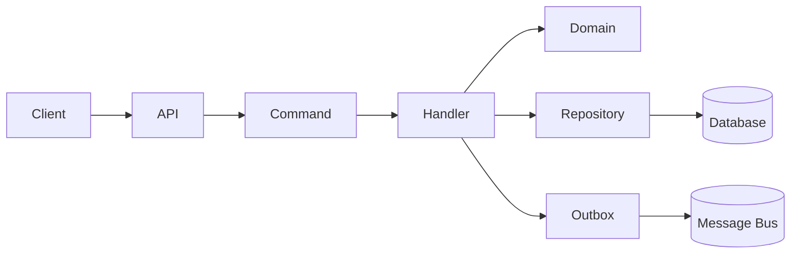
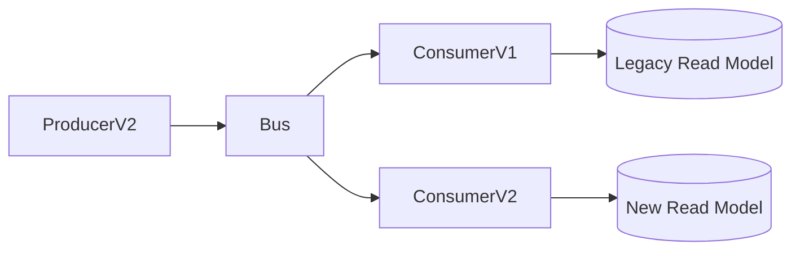
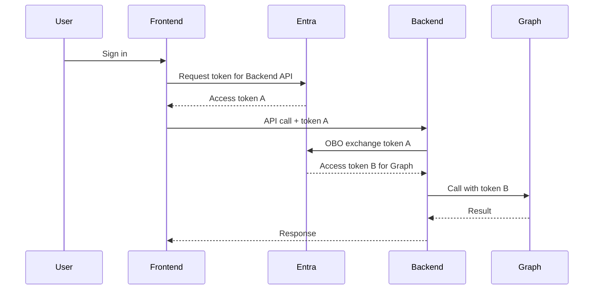
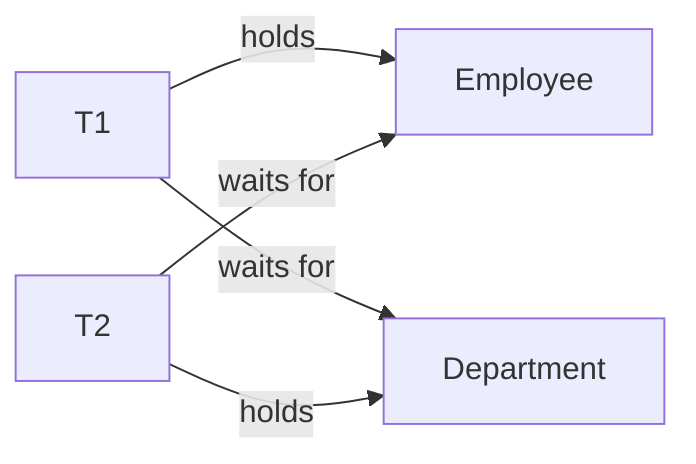
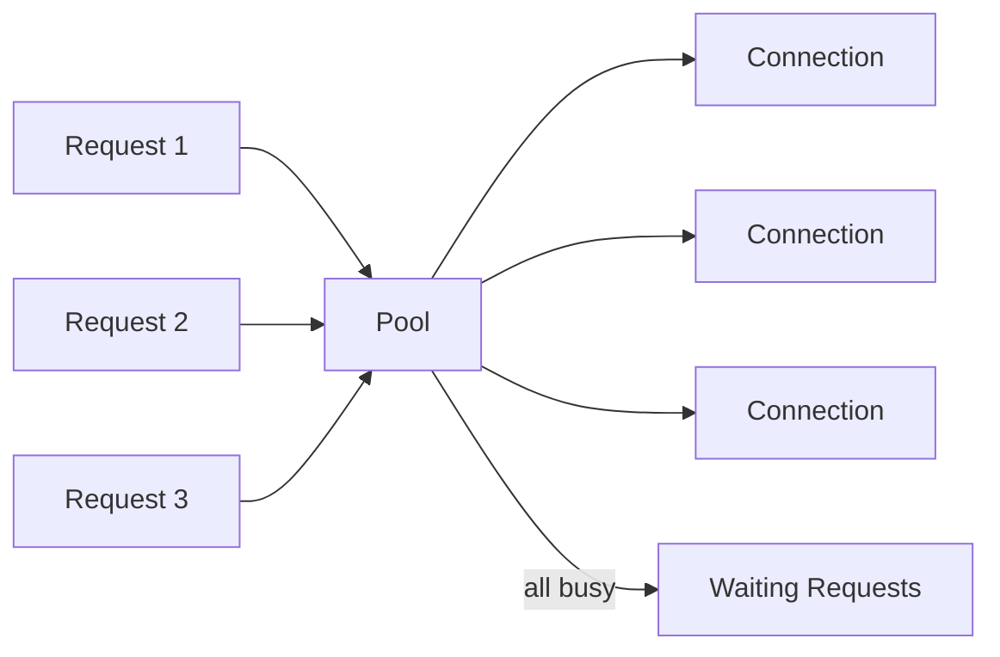
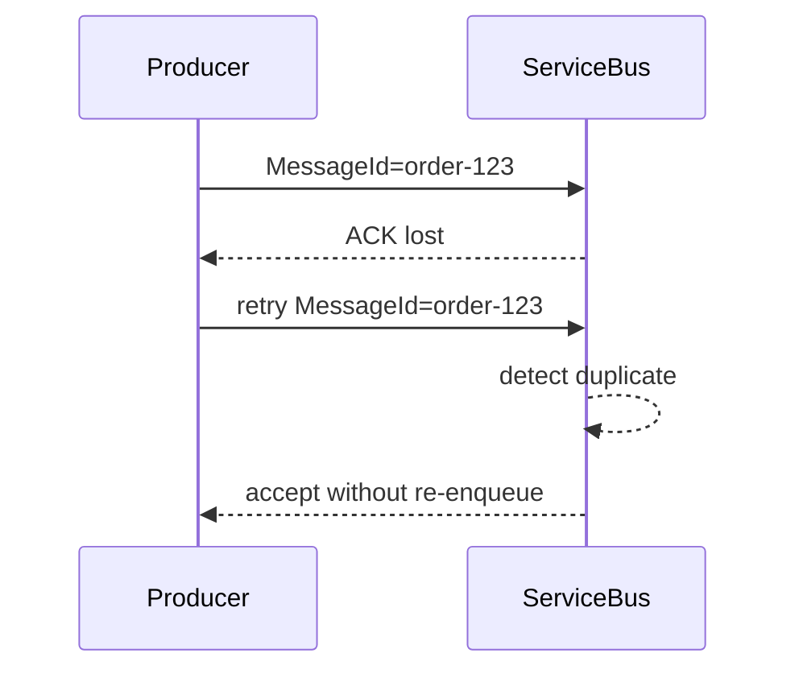
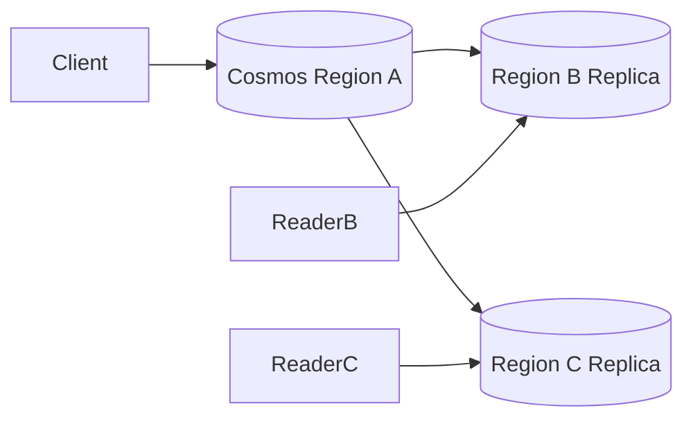
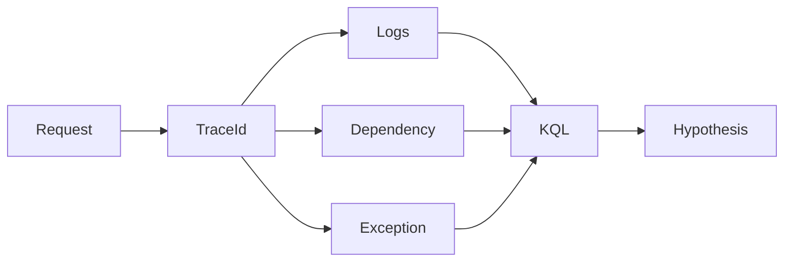
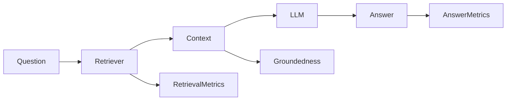

# Daily Knowledge Sharing — 17/08/2026

## Today’s Topics

1. Command Pattern — đóng gói hành động business, tách request khỏi execution và hỗ trợ audit/retry có kiểm soát
2. Event Schema Evolution — thay đổi message contract mà không phá consumer đang chạy
3. OAuth 2.0 On-Behalf-Of Flow — backend gọi downstream API thay mặt người dùng một cách an toàn
4. SQL Server Deadlock Graph — đọc wait-for cycle và sửa nguyên nhân thay vì chỉ retry
5. ADO.NET Connection Pool Exhaustion — vì sao API treo dù database CPU vẫn thấp
6. Azure Service Bus Duplicate Detection — giảm xử lý message trùng nhưng không thay thế idempotency
7. Azure Cosmos DB Consistency Levels — chọn consistency theo business semantics, latency và cost
8. API Serialization Performance — System.Text.Json, payload shape và allocation trên hot path
9. Application Insights + KQL Incident Investigation — từ symptom đến correlation và root-cause hypothesis
10. RAG Evaluation — đo retrieval quality, groundedness và answer quality trước khi tối ưu prompt

---

# 1. Command Pattern — đóng gói hành động business, tách request khỏi execution và hỗ trợ audit/retry có kiểm soát

### 1. What is it?

Command Pattern biến một hành động thành một object có dữ liệu đầu vào rõ ràng và một handler chịu trách nhiệm thực thi hành động đó.

Ví dụ thay vì controller chứa toàn bộ logic:

```csharp
await _employeeService.DisableAsync(id);
await _mailService.ConfigureForwardingAsync(id);
await _audit.LogAsync(...);
```

ta có thể mô hình hóa:

```csharp
public sealed record OffboardEmployeeCommand(
    Guid EmployeeId,
    string EmailAction,
    string? TargetEmail,
    DateTimeOffset? EndTime);
```

và một handler:

```csharp
public sealed class OffboardEmployeeHandler
{
    public async Task HandleAsync(
        OffboardEmployeeCommand command,
        CancellationToken ct)
    {
        // validate business state
        // persist changes
        // publish domain/integration event
    }
}
```

Điểm quan trọng là Command Pattern không đồng nghĩa với MediatR. MediatR chỉ là một cơ chế dispatch; Command Pattern là cách mô hình hóa hành động business.

### 2. Why does it exist?

Khi action logic bị rải ở controller, service, background job và integration handler, hệ thống rất khó trả lời những câu hỏi như:

- Ai được phép thực hiện hành động này?
- Hành động có retry được không?
- Transaction boundary nằm ở đâu?
- Log/audit cho một operation bắt đầu và kết thúc ở đâu?
- Cùng một hành động được gọi từ API và background job thì có dùng chung rule không?

Naive solution thường tạo một `EmployeeService` rất lớn với hàng chục method và state transition khó kiểm soát.

### 3. How does it work?

Luồng điển hình:



Command nên mang **intent**, không phải chỉ là DTO copy từ HTTP request.

Ví dụ:

- `ApproveTimesheetCommand`
- `CancelPaymentCommand`
- `ResetExpiredMailConfigurationCommand`

Tên command nói rõ business operation đang xảy ra.

### 4. Practical example

```csharp
public sealed record ApproveTimesheetCommand(
    Guid TimesheetId,
    Guid ApproverId,
    string ExpectedVersion);

public sealed class ApproveTimesheetHandler
{
    private readonly AppDbContext _db;

    public ApproveTimesheetHandler(AppDbContext db) => _db = db;

    public async Task HandleAsync(
        ApproveTimesheetCommand command,
        CancellationToken ct)
    {
        var timesheet = await _db.Timesheets
            .SingleAsync(x => x.Id == command.TimesheetId, ct);

        timesheet.Approve(command.ApproverId);

        await _db.SaveChangesAsync(ct);
    }
}
```

Business rule nên nằm trong aggregate/domain method như `Approve()` nếu rule thuộc domain invariant, thay vì nhét mọi thứ vào handler.

### 5. Real production scenario

Trong hệ thống employee offboarding, cùng operation có thể được gọi từ:

- Admin portal
- Scheduled cleanup job
- Retry worker sau khi Microsoft Graph lỗi

Nếu cả ba nơi đều gọi một command/handler có cùng rule, hệ thống tránh được việc portal xử lý một kiểu còn background job xử lý kiểu khác.

### 6. Common mistakes

- Command chỉ là DTO đổi tên nhưng business logic vẫn nằm rải rác.
- Handler quá lớn, chứa cả business rule, SQL, HTTP integration và mapping.
- Retry command không idempotent dẫn đến side effect chạy lại.
- Dùng command cho cả read operation rồi biến mọi thứ thành CQRS ceremony.
- Command handler commit nhiều transaction độc lập mà không có chiến lược consistency.

### 7. Trade-offs

**Advantages**

- Rõ business intent.
- Tạo boundary tốt cho validation, authorization, logging và transaction.
- Dễ audit và test theo use case.

**Costs / Risks**

- Nhiều class hơn.
- Dễ overengineering với CRUD đơn giản.
- Nếu handler chỉ forward sang service khác thì abstraction có thể không tạo giá trị.

### 8. Junior → Middle → Senior understanding

**Junior**

Hiểu command đại diện cho một action thay đổi state.

**Middle**

Biết thiết kế handler, validation, transaction và cancellation đúng boundary.

**Senior / Technical Lead**

Phải quyết định command nào cần idempotency, audit, retry, outbox và cách giữ domain invariant khi cùng operation được gọi từ nhiều entry point.

### 9. Key takeaway

- Command mô hình hóa **intent**, không chỉ dữ liệu.
- Handler nên orchestration; domain giữ invariant.
- Retry command chỉ an toàn khi side effect có idempotency strategy.

---

# 2. Event Schema Evolution — thay đổi message contract mà không phá consumer đang chạy

### 1. What is it?

Event Schema Evolution là cách thay đổi cấu trúc integration event theo thời gian mà vẫn giữ các producer/consumer phiên bản khác nhau có thể chạy đồng thời.

Ví dụ event ban đầu:

```json
{
  "employeeId": "123",
  "status": "Inactive"
}
```

Sau đó muốn thêm:

```json
{
  "employeeId": "123",
  "status": "Inactive",
  "offboardingReason": "Resigned"
}
```

Thêm field optional thường backward compatible; đổi tên hoặc thay semantic của field thường không compatible.

### 2. Why does it exist?

Trong hệ thống event-driven, deploy producer và consumer cùng một thời điểm là assumption nguy hiểm.

Một producer mới có thể publish event trước khi consumer cũ được nâng cấp. Nếu message contract thay đổi không tương thích, queue vẫn nhận message nhưng consumer bắt đầu fail hàng loạt.

### 3. How does it work?

Một event nên có version hoặc ít nhất có contract evolution rule rõ ràng.



Các thay đổi thường an toàn hơn:

- Thêm field optional.
- Thêm enum value nếu consumer xử lý unknown value an toàn.
- Thêm event type mới song song.

Các thay đổi nguy hiểm:

- Rename field.
- Đổi type `string -> object`.
- Đổi nghĩa field nhưng giữ tên cũ.
- Xóa field ngay lập tức.

### 4. Practical example

```csharp
public sealed record EmployeeDeactivatedV2(
    Guid EmployeeId,
    string Status,
    string? Reason,
    DateTimeOffset OccurredAt,
    int SchemaVersion = 2);
```

Consumer cũ nên deserialize tolerant với unknown fields. Consumer mới có thể hỗ trợ cả V1 và V2 trong giai đoạn migration.

### 5. Real production scenario

Một system publish `TimesheetApproved` cho Billing và Notification.

Nếu team Timesheet đổi `approvedHours` thành object `billingSummary` trong một deploy, Billing consumer cũ có thể fail toàn bộ queue.

Cách an toàn hơn:

1. Publish thêm field mới.
2. Consumer chuyển sang field mới.
3. Quan sát toàn bộ consumer đã migrate.
4. Chỉ xóa field cũ sau một compatibility window.

### 6. Common mistakes

- Xem event như internal DTO rồi refactor tùy ý.
- Reuse database entity làm message contract.
- Không có schema version hoặc contract test.
- Enum consumer dùng `switch` không có fallback.
- Deploy producer trước rồi mới kiểm tra consumer compatibility.

### 7. Trade-offs

**Advantages**

- Giảm deployment coupling.
- Cho phép rolling upgrade và multi-version runtime.
- Hạn chế production outage do contract mismatch.

**Costs / Risks**

- Có thời gian phải support nhiều version.
- Message schema phức tạp hơn.
- Cần governance và contract testing.

### 8. Junior → Middle → Senior understanding

**Junior**

Hiểu message đã publish là contract, không refactor tự do.

**Middle**

Biết phân biệt backward-compatible và breaking change.

**Senior / Technical Lead**

Thiết kế compatibility window, consumer migration order, replay strategy và version retirement.

### 9. Key takeaway

- Event contract sống lâu hơn code producer.
- Additive change an toàn hơn destructive change.
- Schema evolution phải được thiết kế cùng deployment strategy.

---

# 3. OAuth 2.0 On-Behalf-Of Flow — backend gọi downstream API thay mặt người dùng một cách an toàn

### 1. What is it?

On-Behalf-Of (OBO) flow là OAuth 2.0 pattern dùng khi một backend API nhận access token của người dùng và cần lấy một token khác để gọi downstream API **với user context được giữ lại**.

Ví dụ:

User → Web App → Backend API → Microsoft Graph.

Backend không nên lấy token Graph bằng client credentials nếu business cần biết chính user nào đang thực hiện operation.

### 2. Why does it exist?

Hai naive solution thường sai:

1. Forward access token nhận từ frontend sang downstream API.
2. Dùng app-only token cho mọi downstream call.

Forward token sai vì token có audience cụ thể. Token issued cho `api://backend` không nên được Graph chấp nhận.

App-only token lại mất user context và có thể cấp quyền rộng hơn cần thiết.

### 3. How does it work?



Token A chứng minh user đã authenticate cho backend. Backend dùng token A như user assertion để yêu cầu token B cho downstream resource.

### 4. Practical example

Trong .NET, Microsoft Identity Web có thể hỗ trợ flow này:

```csharp
builder.Services
    .AddMicrosoftIdentityWebApiAuthentication(builder.Configuration)
    .EnableTokenAcquisitionToCallDownstreamApi()
    .AddMicrosoftGraph(builder.Configuration.GetSection("MicrosoftGraph"))
    .AddInMemoryTokenCaches();
```

Service gọi Graph thông qua token acquisition thay vì tự parse token rồi forward.

### 5. Real production scenario

Một event portal cho phép user bấm “Add to my calendar”. Backend cần gọi Microsoft Graph để ghi event vào calendar của chính user.

Nếu dùng delegated permission + OBO, downstream action gắn với identity user.

Nếu dùng application permission, app có thể có quyền org-wide rất rộng — rủi ro bảo mật lớn hơn nhiều.

### 6. Common mistakes

- Forward token có audience sai.
- Cache token sai key khiến token của user A bị dùng cho user B.
- Không phân biệt delegated permission với application permission.
- Không handle consent/conditional access failure.
- Log raw access token.

### 7. Trade-offs

**Advantages**

- Giữ user identity xuyên service chain.
- Least privilege tốt hơn app-only trong nhiều use case.
- Audit downstream phản ánh user context.

**Costs / Risks**

- Token flow phức tạp hơn.
- Phụ thuộc consent và policy của tenant.
- Cần token cache đúng semantics.

### 8. Junior → Middle → Senior understanding

**Junior**

Authentication là “ai”, authorization là “được làm gì”; token có audience.

**Middle**

Biết cấu hình OBO, scopes, consent và handle token acquisition error.

**Senior / Technical Lead**

Chọn delegated vs application permission dựa trên business authority, blast radius, tenant policy và audit requirement.

### 9. Key takeaway

- Không forward access token sang resource khác chỉ vì đều là JWT.
- OBO dùng khi downstream action cần user context.
- Application permission chỉ nên dùng khi operation thực sự là app-level.

---

# 4. SQL Server Deadlock Graph — đọc wait-for cycle và sửa nguyên nhân thay vì chỉ retry

### 1. What is it?

Deadlock xảy ra khi hai hoặc nhiều transaction giữ resource mà transaction khác cần, tạo thành vòng chờ không thể tự giải phóng.

SQL Server phát hiện cycle và chọn một transaction làm deadlock victim để rollback.

### 2. Why does it exist?

Locking giúp bảo vệ consistency. Nhưng nếu transaction acquire lock theo thứ tự khác nhau, hệ thống có thể tạo cycle.

Ví dụ:

- T1 lock `Employee`, sau đó cần `Department`.
- T2 lock `Department`, sau đó cần `Employee`.

Cả hai chờ nhau.

### 3. How does it work?



Deadlock graph cho biết:

- Process/transaction nào tham gia.
- Resource nào bị lock.
- Lock mode (`S`, `X`, `U`, key/page/object).
- Statement nào đang chạy.
- Transaction nào bị chọn làm victim.

### 4. Practical example

Bad pattern:

```sql
-- Transaction A
UPDATE Employees SET Status = 'Inactive' WHERE Id = 10;
UPDATE Departments SET UpdatedAt = SYSUTCDATETIME() WHERE Id = 3;

-- Transaction B
UPDATE Departments SET UpdatedAt = SYSUTCDATETIME() WHERE Id = 3;
UPDATE Employees SET Status = 'Active' WHERE Id = 10;
```

Một fix là luôn acquire resource theo cùng thứ tự.

Ngoài ra có thể giảm transaction duration và đảm bảo query dùng index phù hợp để tránh lock quá rộng.

### 5. Real production scenario

Một approval flow update `Timesheet`, `ApprovalHistory`, `EmployeeSummary` trong transaction. Một background aggregation job update cùng bảng nhưng thứ tự khác.

Deadlock chỉ xuất hiện ở peak load, khiến API trả 500 ngẫu nhiên dù mỗi query riêng lẻ chạy rất nhanh.

### 6. Common mistakes

- Chỉ thêm retry và coi đã “fix”.
- Tăng isolation level không cần thiết.
- Transaction chứa external HTTP call.
- Query thiếu index làm scan nhiều row và giữ lock rộng.
- Không capture deadlock graph nên debug dựa trên đoán.

### 7. Trade-offs

**Advantages của retry**

- Xử lý transient victim tốt.

**Costs / Risks**

- Retry che giấu deadlock frequency cao.
- Retry làm tăng load khi contention đã cao.

Structural fix như consistent access order và transaction ngắn thường quan trọng hơn.

### 8. Junior → Middle → Senior understanding

**Junior**

Hiểu transaction giữ lock và deadlock là vòng chờ.

**Middle**

Biết đọc deadlock graph, index và transaction scope.

**Senior / Technical Lead**

Phải phân biệt deadlock symptom với root cause, đánh giá transaction design và contention model ở peak load.

### 9. Key takeaway

- Deadlock không đồng nghĩa database “bị lỗi”.
- Capture graph trước khi sửa.
- Retry là safety net, không phải structural solution.

---

# 5. ADO.NET Connection Pool Exhaustion — vì sao API treo dù database CPU vẫn thấp

### 1. What is it?

ADO.NET connection pooling tái sử dụng physical database connections thay vì mở TCP/TLS/login mới cho mỗi request.

Pool exhaustion xảy ra khi mọi connection trong pool đều đang bận và request mới phải chờ connection được trả lại.

### 2. Why does it exist?

Database connection là tài nguyên đắt và hữu hạn. Pool tăng performance nhưng biến connection thành một shared resource cần quản lý.

Một application có 1000 concurrent request không có nghĩa database nên có 1000 concurrent connection.

### 3. How does it work?



Khi code dispose `SqlConnection` hoặc DbContext, physical connection thường được trả về pool, không đóng hoàn toàn.

### 4. Practical example

Bad:

```csharp
var connection = new SqlConnection(cs);
await connection.OpenAsync();
var result = await ExecuteAsync(connection);
// missing Dispose/await using
```

Better:

```csharp
await using var connection = new SqlConnection(cs);
await connection.OpenAsync(ct);
return await ExecuteAsync(connection, ct);
```

Với EF Core, tránh giữ DbContext quá lâu hoặc dùng scoped DbContext trong singleton/background lifetime sai cách.

### 5. Real production scenario

API bắt đầu chậm 30 giây. SQL Server CPU chỉ 20%, query duration bình thường.

Metric cho thấy request chờ `OpenAsync()` thay vì chờ SQL execution.

Root cause: một background worker mở connection rồi giữ xuyên suốt network call tới third-party API.

### 6. Common mistakes

- Tăng `Max Pool Size` ngay mà không tìm leak.
- Giữ connection mở trong lúc gọi HTTP.
- Singleton service giữ DbContext scoped.
- Parallel fan-out quá nhiều query cùng lúc.
- Không truyền cancellation token làm request canceled nhưng DB operation vẫn sống.

### 7. Trade-offs

**Advantages của pool lớn hơn**

- Có thể hỗ trợ concurrency cao hơn nếu DB chịu được.

**Costs / Risks**

- Tăng connection pressure lên database.
- Có thể đẩy bottleneck từ app sang DB.

Pool size phải gắn với workload, query duration và capacity của DB.

### 8. Junior → Middle → Senior understanding

**Junior**

Biết dispose connection/DbContext đúng cách.

**Middle**

Biết đo pool wait, query latency, concurrent request và lifetime.

**Senior / Technical Lead**

Thiết kế concurrency budget giữa app instance, pool size, autoscaling và database max capacity.

### 9. Key takeaway

- Pool exhaustion có thể xảy ra khi DB chưa hề high CPU.
- Giữ connection càng ngắn càng tốt.
- Tăng pool size không sửa được connection leak.

---

# 6. Azure Service Bus Duplicate Detection — giảm xử lý message trùng nhưng không thay thế idempotency

### 1. What is it?

Azure Service Bus Duplicate Detection cho phép broker ghi nhớ `MessageId` trong một cửa sổ thời gian và bỏ message có cùng ID được gửi lại trong window đó.

### 2. Why does it exist?

Trong distributed system, sender có thể gặp tình huống:

1. Gửi message thành công.
2. Network timeout trước khi nhận ACK.
3. Sender không biết broker đã nhận chưa.
4. Sender retry.

Nếu retry tạo message mới không có deduplication, consumer có thể xử lý hai lần.

### 3. How does it work?



Deduplication chỉ hoạt động trong configured history window và dựa trên identifier đúng cách.

### 4. Practical example

```csharp
var message = new ServiceBusMessage(payload)
{
    MessageId = $"offboarding:{employeeId}:{operationVersion}"
};

await sender.SendMessageAsync(message, ct);
```

Message ID nên deterministic theo business operation nếu mục tiêu là deduplicate cùng operation.

### 5. Real production scenario

Scheduled job publish lệnh reset forwarding cho mailbox đã hết hạn. Network timeout làm job retry publish.

Broker duplicate detection giúp giảm duplicate delivery, nhưng consumer vẫn nên idempotent vì duplicate có thể xuất hiện ngoài detection window hoặc từ upstream khác.

### 6. Common mistakes

- Dùng random GUID làm MessageId rồi kỳ vọng duplicate detection có tác dụng.
- Nghĩ duplicate detection tạo exactly-once processing.
- Window quá lớn làm tăng broker resource/cost.
- Consumer không có business idempotency.

### 7. Trade-offs

**Advantages**

- Giảm duplicate do producer retry.
- Đơn giản hóa một số failure mode.

**Costs / Risks**

- Chỉ dedupe trong time window.
- Không bảo vệ side effect ở consumer.
- MessageId design trở thành contract quan trọng.

### 8. Junior → Middle → Senior understanding

**Junior**

At-least-once delivery nghĩa message có thể đến nhiều lần.

**Middle**

Biết thiết kế deterministic MessageId và idempotent consumer.

**Senior / Technical Lead**

Phân biệt broker-level dedupe với business exactly-once illusion; quyết định nơi lưu idempotency key và retention bao lâu.

### 9. Key takeaway

- Duplicate detection giảm duplicate, không loại bỏ nhu cầu idempotency.
- MessageId phải có business meaning phù hợp.
- Exactly-once side effect cần deterministic control ở consumer/data layer.

---

# 7. Azure Cosmos DB Consistency Levels — chọn consistency theo business semantics, latency và cost

### 1. What is it?

Cosmos DB hỗ trợ nhiều consistency level để cân bằng việc reader nhìn thấy dữ liệu mới đến mức nào so với latency, availability và RU cost.

Các mức quen thuộc gồm:

- Strong
- Bounded staleness
- Session
- Consistent prefix
- Eventual

### 2. Why does it exist?

Trong distributed database multi-region, không thể giả định mọi replica luôn nhìn thấy write mới cùng thời điểm mà không trả giá về latency và availability.

Business khác nhau có nhu cầu khác nhau:

- Payment balance có thể cần consistency mạnh hơn.
- Activity feed có thể chấp nhận vài giây stale.

### 3. How does it work?



Consistency level quyết định guarantee khi ReaderB/ReaderC đọc sau write tại RegionA.

Session consistency thường là lựa chọn thực tế tốt cho user-centric app: trong cùng session, user có read-your-own-writes.

### 4. Practical example

```csharp
var options = new CosmosClientOptions
{
    ConsistencyLevel = ConsistencyLevel.Session
};

var client = new CosmosClient(connectionString, options);
```

Không nên chọn Strong chỉ vì “an toàn hơn” mà không đánh giá latency, region topology và workload.

### 5. Real production scenario

Một SaaS dashboard ghi preference của user rồi reload ngay. Session consistency giúp user thấy thay đổi của mình ngay mà không cần strong consistency toàn hệ thống.

Ngược lại, analytics background job đọc aggregate cross-user có thể chấp nhận eventual consistency.

### 6. Common mistakes

- Chọn consistency level theo cảm giác thay vì business invariant.
- Không hiểu read-your-own-write requirement.
- Dùng eventual consistency rồi assume query ngay sau write luôn thấy dữ liệu.
- Không test multi-region failover behavior.

### 7. Trade-offs

**Stronger consistency**

- Dễ reasoning hơn cho business state.

**Costs / Risks**

- Có thể tăng latency và giảm availability flexibility.

**Weaker consistency**

- Scale và latency tốt hơn.

**Costs / Risks**

- Application phải chịu stale read và design UX/business flow phù hợp.

### 8. Junior → Middle → Senior understanding

**Junior**

Hiểu distributed replica có thể chưa đồng bộ ngay.

**Middle**

Biết chọn session/eventual theo use case và test stale read.

**Senior / Technical Lead**

Map consistency guarantee vào business invariant, multi-region topology, failover và cost model.

### 9. Key takeaway

- Consistency là business decision, không chỉ database setting.
- Session consistency phù hợp nhiều user-facing workload.
- Strong consistency có giá; chỉ dùng khi semantics thực sự cần.

---

# 8. API Serialization Performance — System.Text.Json, payload shape và allocation trên hot path

### 1. What is it?

Serialization performance là chi phí CPU, memory allocation và network khi chuyển object .NET thành JSON và ngược lại.

Trong API traffic cao, serialization có thể trở thành hot path dù database đã tối ưu tốt.

### 2. Why does it exist?

Một endpoint trả 10,000 objects với 30 fields có thể tốn nhiều thời gian ở:

- Materialize object.
- Allocate string/list.
- Serialize JSON.
- Copy buffer.
- Compress response.
- Transfer network.

Nếu chỉ nhìn SQL duration, ta có thể bỏ lỡ phần lớn latency.

### 3. How does it work?

Performance investigation nên đi theo flow:

```text
Symptom
→ measure endpoint duration
→ split DB / app / serialization / network
→ inspect allocation + CPU
→ reduce payload / optimize serializer
→ measure again
```

### 4. Practical example

Bad:

```csharp
var employees = await db.Employees
    .Include(x => x.Department)
    .Include(x => x.Manager)
    .ToListAsync(ct);

return Results.Ok(employees);
```

Better:

```csharp
var employees = await db.Employees
    .AsNoTracking()
    .Select(x => new EmployeeListItem(
        x.Id,
        x.DisplayName,
        x.Department.Name))
    .Take(100)
    .ToListAsync(ct);

return Results.Ok(employees);
```

Projection giảm DB payload, object graph và JSON size cùng lúc.

### 5. Real production scenario

Một location search API có DB query 40 ms nhưng end-to-end latency 700 ms. Profiling cho thấy response trả hàng nghìn office objects và serialization + transfer chiếm phần lớn thời gian.

Fix đúng có thể là pagination/projection, không phải thêm database index.

### 6. Common mistakes

- Optimize serializer trước khi giảm payload.
- Return EF entity trực tiếp gây object graph lớn/cycle.
- Dùng indentation trong production API không cần thiết.
- Không phân biệt response generation với network latency.
- Bật compression cho payload rất nhỏ rồi tăng CPU vô ích.

### 7. Trade-offs

**Smaller DTO**

- Giảm CPU, memory và bandwidth.

**Costs / Risks**

- Có thêm mapping/model.

**Source-generated JSON metadata** có thể giảm reflection overhead ở hot path nhưng tăng setup/build complexity.

### 8. Junior → Middle → Senior understanding

**Junior**

Không return cả entity graph khi client chỉ cần vài field.

**Middle**

Biết profile allocation, projection và payload size.

**Senior / Technical Lead**

Đặt response budget, pagination contract, compression policy và capacity model theo p95/p99 traffic.

### 9. Key takeaway

- API performance không chỉ là SQL.
- Giảm payload thường hiệu quả hơn micro-optimize serializer.
- Đo CPU, allocation và network trước/sau thay đổi.

---

# 9. Application Insights + KQL Incident Investigation — từ symptom đến correlation và root-cause hypothesis

### 1. What is it?

Application Insights thu thập request, dependency, exception, trace và metric. Kusto Query Language (KQL) cho phép truy vấn telemetry để điều tra incident theo thời gian, operation và dependency.

Mục tiêu không phải “search log”, mà là kết nối symptom thành timeline có bằng chứng.

### 2. Why does it exist?

Production incident thường có dấu hiệu như:

- p95 latency tăng.
- Error rate tăng ở một endpoint.
- Một dependency timeout nhiều hơn.
- Một region hoặc instance bất thường.

Nếu log rời rạc và không correlation, việc debug trở thành đoán.

### 3. How does it work?



Một quy trình điều tra tốt:

1. Xác định impact window.
2. Tìm endpoint/service bị ảnh hưởng.
3. Split success vs failure.
4. Correlate dependency latency/error.
5. Drill xuống operation/trace.
6. Tạo hypothesis và verify bằng metric/log khác.

### 4. Practical example

```kusto
requests
| where timestamp > ago(30m)
| summarize
    Count = count(),
    Failures = countif(success == false),
    P95 = percentile(duration, 95)
  by operation_Name
| order by Failures desc
```

Tiếp tục tìm dependency:

```kusto
dependencies
| where timestamp > ago(30m)
| summarize
    Calls = count(),
    Failures = countif(success == false),
    P95 = percentile(duration, 95)
  by target, type
| order by P95 desc
```

### 5. Real production scenario

API offboarding bắt đầu timeout. Request telemetry cho thấy endpoint chậm, nhưng SQL dependency bình thường. Dependency table lại cho thấy Microsoft Graph p95 tăng mạnh và 429 tăng.

Điều này chuyển hướng investigation từ database sang downstream throttling/rate limit policy.

### 6. Common mistakes

- Query toàn bộ log không giới hạn time range.
- Chỉ xem average.
- Không có correlation ID/trace context.
- Log exception nhưng mất dependency metadata.
- Alert trực tiếp từ log message text dễ thay đổi.

### 7. Trade-offs

**Rich telemetry**

- Debug tốt hơn.

**Costs / Risks**

- Ingestion cost, storage cost, cardinality và PII risk.

Sampling và retention cần thiết, nhưng phải đảm bảo vẫn giữ đủ telemetry cho incident quan trọng.

### 8. Junior → Middle → Senior understanding

**Junior**

Biết tìm request lỗi theo thời gian và trace ID.

**Middle**

Biết dùng KQL để correlate request/dependency/exception.

**Senior / Technical Lead**

Thiết kế telemetry schema, sampling, cardinality, alert signal và incident workflow để observability thực sự operational.

### 9. Key takeaway

- Bắt đầu từ symptom và impact window.
- Correlation quan trọng hơn số lượng log.
- KQL nên hỗ trợ hypothesis-driven debugging, không phải search ngẫu nhiên.

---

# 10. RAG Evaluation — đo retrieval quality, groundedness và answer quality trước khi tối ưu prompt

### 1. What is it?

RAG Evaluation là quá trình đo riêng từng phần của Retrieval-Augmented Generation thay vì chỉ hỏi “câu trả lời nghe có hay không”.

Một RAG pipeline có ít nhất hai failure domain lớn:

1. Retrieval không lấy đúng evidence.
2. LLM có evidence đúng nhưng vẫn trả lời sai hoặc không grounded.

### 2. Why does it exist?

Nếu câu trả lời sai, đổi prompt ngay có thể là hành động sai.

Ví dụ document đúng chưa từng được retrieve thì prompt generation tốt đến đâu cũng không cứu được.

### 3. How does it work?



Các nhóm metric hữu ích:

- Retrieval hit rate / recall@k.
- Precision@k.
- MRR/nDCG nếu ranking quan trọng.
- Groundedness / citation correctness.
- Answer correctness.
- Refusal correctness khi evidence không đủ.
- Latency và token cost.

### 4. Practical example

Tạo golden dataset:

```json
{
  "question": "Billable Hours có được lớn hơn Actual Hours không?",
  "expectedEvidenceIds": ["timesheet-spec-42"],
  "expectedAnswer": "Không. Billable Hours phải nhỏ hơn hoặc bằng Actual Hours."
}
```

Evaluation code deterministic trước:

```csharp
var retrievalHit = retrievedChunks
    .Any(x => expectedEvidenceIds.Contains(x.DocumentId));

if (!retrievalHit)
{
    return EvalResult.RetrievalFailed;
}
```

Sau đó mới dùng model-as-judge có schema rõ ràng để đánh giá groundedness/semantic correctness, nhưng không để judge thay thế toàn bộ deterministic checks.

### 5. Real production scenario

Một internal knowledge assistant trả lời sai policy nghỉ phép.

Team ban đầu chỉnh prompt. Sau investigation, nguyên nhân thật là chunking tách table header khỏi row và vector search không retrieve đúng policy version.

Fix retrieval/indexing tạo cải thiện lớn hơn prompt tuning.

### 6. Common mistakes

- Chỉ test vài câu bằng mắt.
- Không version golden dataset.
- Dùng cùng một LLM làm generator và judge mà không kiểm soát bias.
- Không tách retrieval failure khỏi generation failure.
- Không test “không có đủ evidence thì phải từ chối”.

### 7. Trade-offs

**Detailed evaluation**

- Giúp biết chính xác layer nào regress.
- Cho phép CI regression test AI workflow.

**Costs / Risks**

- Tốn thời gian tạo dataset.
- Model-as-judge có variance và cost.
- Business truth thay đổi thì expected answer cũng phải version.

### 8. Junior → Middle → Senior understanding

**Junior**

Hiểu RAG gồm retrieval + generation, hai phần có thể fail độc lập.

**Middle**

Biết xây golden dataset và metric retrieval cơ bản.

**Senior / Technical Lead**

Thiết kế evaluation architecture, failure taxonomy, acceptance threshold, cost budget và production feedback loop.

### 9. Key takeaway

- Đừng tối ưu prompt khi retrieval đang sai.
- Tách metric retrieval, groundedness và answer quality.
- Deterministic checks nên kiểm soát những gì có thể kiểm soát deterministically.
