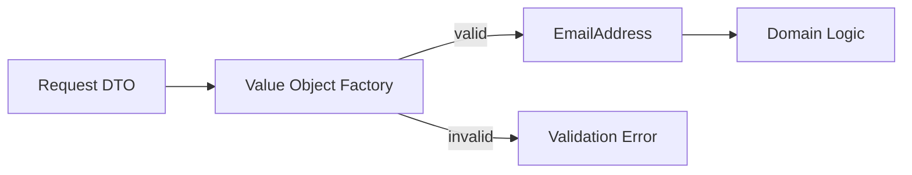
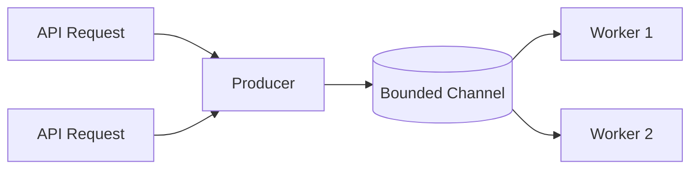
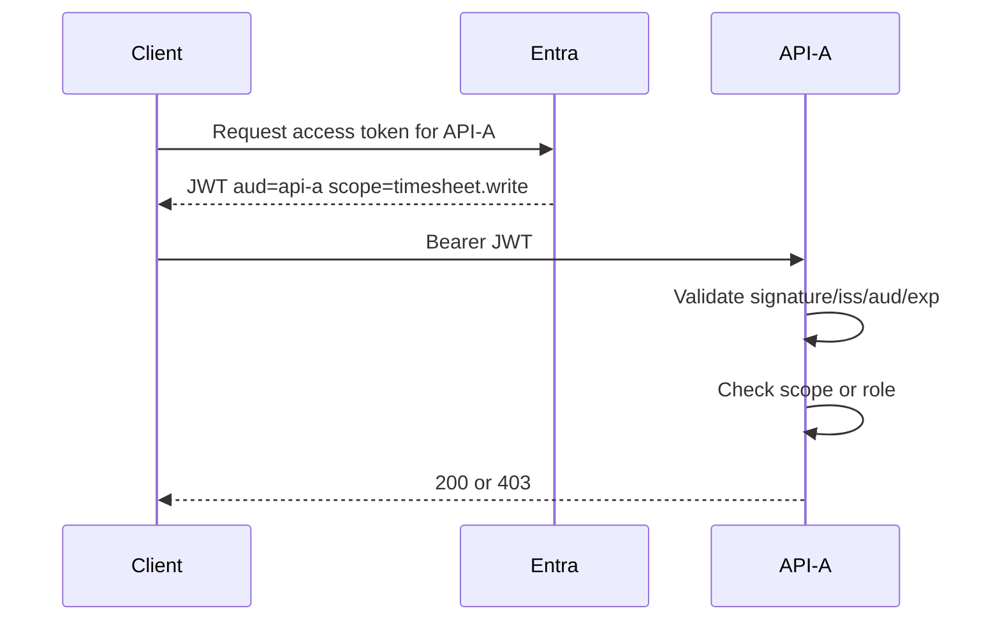
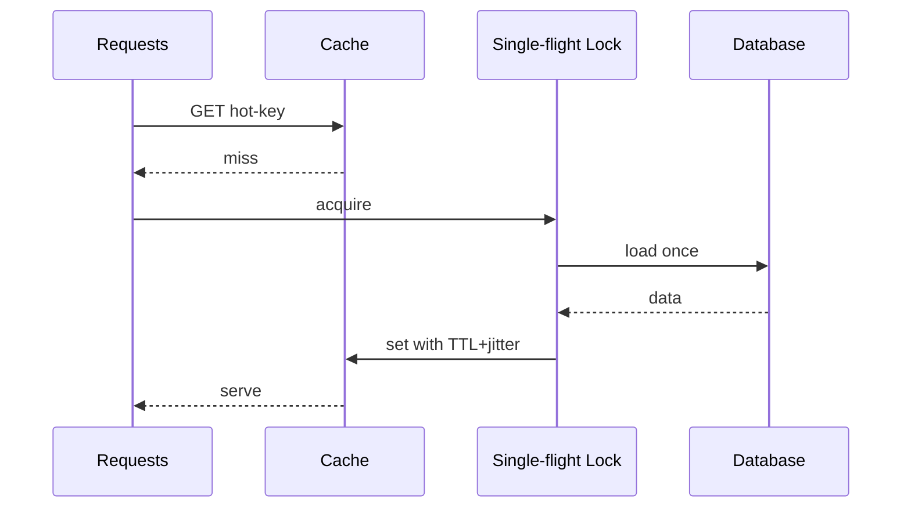
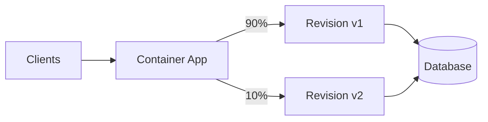
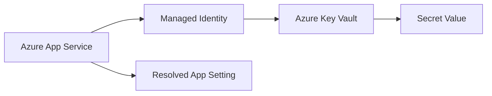
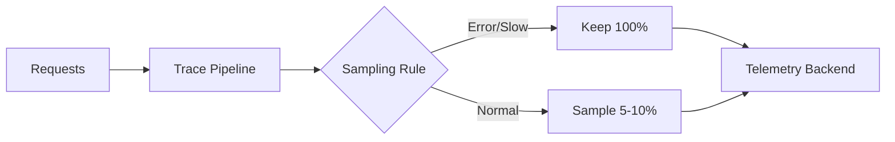
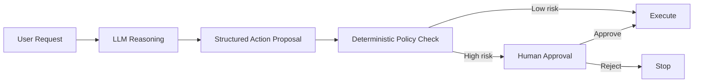
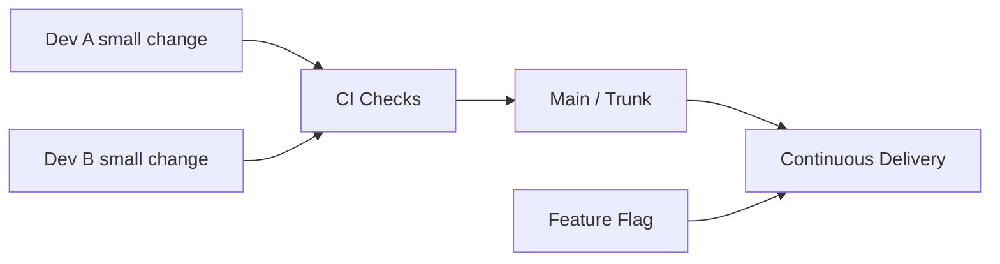

# Daily Knowledge Sharing — 17/08/2026

## Today’s Topics

1. DDD Value Object — đưa business meaning vào type thay vì truyền primitive khắp hệ thống
2. Async Concurrency với `Channel<T>` — xây producer/consumer pipeline có backpressure trong .NET
3. JWT Audience & Scope Validation — token hợp lệ về chữ ký chưa chắc hợp lệ cho API hiện tại
4. PostgreSQL `EXPLAIN (ANALYZE, BUFFERS)` — đọc execution plan để tìm bottleneck thật
5. Cache Stampede Prevention — single-flight, jitter TTL và stale-while-revalidate cho hot key
6. Azure Container Apps Revision & Traffic Splitting — rollout version mới có kiểm soát trên container workload
7. Azure Key Vault References trong App Service — giảm secret exposure nhưng vẫn phải quản lý rotation và fallback
8. Observability Sampling Strategy — giữ trace đủ để điều tra mà không làm telemetry cost mất kiểm soát
9. AI Human-in-the-Loop Approval — tách recommendation của model khỏi hành động có side effect
10. Trunk-Based Development — giảm merge debt nhưng đòi hỏi CI mạnh, feature flag và discipline cao

---

# 1. DDD Value Object — đưa business meaning vào type thay vì truyền primitive khắp hệ thống

### 1. What is it?

Value Object là object được xác định bởi **giá trị**, không phải identity. Hai Value Object có cùng dữ liệu được xem là tương đương.

Ví dụ `Money`, `EmailAddress`, `DateRange`, `EmployeeCode`, `Percentage` thường phù hợp làm Value Object hơn là để `decimal`, `string`, `DateTime` rời rạc khắp codebase.

Điểm quan trọng không phải là “bọc primitive vào class”, mà là đưa **invariant** và business meaning vào chính type.

### 2. Why does it exist?

Primitive obsession làm business rule bị phân tán:

```csharp
if (string.IsNullOrWhiteSpace(email) || !email.Contains('@')) ...
if (amount < 0) ...
```

Nếu mỗi nơi validate một kiểu, hệ thống dần có nhiều định nghĩa khác nhau cho cùng một khái niệm.

Value Object gom rule lại một nơi, giúp API và domain trao đổi bằng type có ý nghĩa thay vì “chuỗi bất kỳ”.

### 3. How does it work?



Value Object thường:

- immutable,
- validate ngay lúc tạo,
- so sánh theo giá trị,
- không chứa persistence concern.

### 4. Practical example

```csharp
public sealed record EmailAddress
{
    public string Value { get; }

    private EmailAddress(string value) => Value = value;

    public static EmailAddress Create(string value)
    {
        var normalized = value.Trim().ToLowerInvariant();

        if (!System.Net.Mail.MailAddress.TryCreate(normalized, out _))
            throw new ArgumentException("Invalid email address");

        return new EmailAddress(normalized);
    }
}
```

EF Core có thể map qua owned type hoặc value converter tùy thiết kế.

### 5. Real production scenario

Trong hệ thống employee management, `EmployeeCode` có format và uniqueness rule riêng. Nếu để plain `string`, code import Excel, REST API và background job có thể xử lý khác nhau. Value Object giúp mọi luồng đều tạo qua cùng rule.

### 6. Common mistakes

- Tạo Value Object nhưng vẫn cho setter public.
- Cho Value Object gọi database để validate uniqueness.
- Bọc mọi primitive dù không có domain meaning.
- Nhét logic application hoặc infrastructure vào Value Object.

### 7. Trade-offs

**Advantages**

- Domain rõ nghĩa hơn.
- Validation tập trung.
- Giảm invalid state.
- Test business rule dễ hơn.

**Costs / Risks**

- Mapping EF Core phức tạp hơn.
- DTO/domain mapping tăng.
- Overengineering nếu khái niệm quá đơn giản.

### 8. Junior → Middle → Senior understanding

**Junior**

Hiểu Value Object khác Entity ở identity và immutability.

**Middle**

Biết implement equality, validation, EF Core mapping và serialization.

**Senior / Technical Lead**

Biết chọn khái niệm nào xứng đáng trở thành Value Object, tránh primitive obsession nhưng cũng tránh domain model quá ceremony.

### 9. Key takeaway

- Value Object mang business meaning vào type.
- Invariant nên được enforce ngay lúc tạo.
- Không phải primitive nào cũng cần được “nâng cấp”.

---

# 2. Async Concurrency với `Channel<T>` — xây producer/consumer pipeline có backpressure trong .NET

### 1. What is it?

`System.Threading.Channels` cung cấp queue bất đồng bộ in-process cho mô hình producer/consumer.

Khác với `ConcurrentQueue<T>`, `Channel<T>` hỗ trợ await khi đọc/ghi và có thể giới hạn capacity để tạo backpressure.

### 2. Why does it exist?

Một background worker đơn giản thường làm:

```csharp
_queue.Enqueue(job);
```

Nếu producer tạo việc nhanh hơn consumer xử lý, memory tăng vô hạn.

Bounded channel giúp hệ thống chậm producer lại thay vì cho queue phình không kiểm soát.

### 3. How does it work?



Producer dùng `WriteAsync`; consumer dùng `ReadAllAsync`.

### 4. Practical example

```csharp
var channel = Channel.CreateBounded<EmailJob>(new BoundedChannelOptions(1000)
{
    FullMode = BoundedChannelFullMode.Wait
});

await channel.Writer.WriteAsync(job, cancellationToken);

await foreach (var item in channel.Reader.ReadAllAsync(stoppingToken))
{
    await ProcessAsync(item, stoppingToken);
}
```

Nếu cần parallel consumer, chạy nhiều worker đọc cùng channel.

### 5. Real production scenario

Một API nhận request tạo notification. Thay vì spawn `Task.Run` cho mỗi request, API ghi vào bounded channel; background service xử lý theo concurrency cố định để tránh overload SMTP/Graph API.

### 6. Common mistakes

- Dùng unbounded channel cho workload không kiểm soát.
- Không propagate cancellation.
- Dùng channel như durable queue dù process restart sẽ mất dữ liệu.
- Consumer mở concurrency quá lớn làm downstream nghẽn.

### 7. Trade-offs

**Advantages**

- Nhẹ, nhanh, không cần broker ngoài.
- Backpressure tốt.
- Phù hợp pipeline in-process.

**Costs / Risks**

- Không durable.
- Không phù hợp multi-instance coordination.
- Sai concurrency vẫn có thể overload dependency.

### 8. Junior → Middle → Senior understanding

**Junior**

Hiểu producer/consumer và bounded queue.

**Middle**

Biết chọn capacity, worker count, cancellation và error handling.

**Senior / Technical Lead**

Biết khi nào phải chuyển từ Channel sang Azure Service Bus/RabbitMQ do durability, scale-out hoặc retry semantics.

### 9. Key takeaway

- `Channel<T>` rất mạnh cho async pipeline in-process.
- Bounded capacity là cơ chế bảo vệ hệ thống.
- Channel không thay message broker khi cần durability.

---

# 3. JWT Audience & Scope Validation — token hợp lệ về chữ ký chưa chắc hợp lệ cho API hiện tại

### 1. What is it?

JWT validation không chỉ kiểm tra chữ ký. API còn phải kiểm tra issuer, audience, expiry và quyền như scope/role.

Authentication trả lời “token này là của ai?”, còn authorization trả lời “identity này được phép làm gì?”.

### 2. Why does it exist?

Một access token có thể hợp lệ cryptographically nhưng được cấp cho API khác.

Nếu API chỉ check signature mà bỏ audience, token dành cho Service A có thể bị replay sang Service B.

### 3. How does it work?



### 4. Practical example

```csharp
builder.Services
    .AddAuthentication(JwtBearerDefaults.AuthenticationScheme)
    .AddJwtBearer(options =>
    {
        options.Authority = "https://login.microsoftonline.com/<tenant>/v2.0";
        options.Audience = "api://timesheet-api";
    });

builder.Services.AddAuthorization(options =>
{
    options.AddPolicy("TimesheetWrite", policy =>
        policy.RequireClaim("scp", "timesheet.write"));
});
```

### 5. Real production scenario

Portal đăng nhập qua Microsoft Entra ID rồi gọi backend. Backend phải chắc token được cấp cho backend đó, không phải token Microsoft Graph hoặc token của một API nội bộ khác.

### 6. Common mistakes

- Chỉ decode JWT mà không verify chữ ký.
- Bỏ audience validation.
- Dùng role và scope lẫn lộn.
- Log raw access token.
- Accept token đã hết hạn vì clock skew cấu hình quá rộng.

### 7. Trade-offs

**Advantages**

- Stateless authorization.
- Tích hợp tốt với identity provider.
- Fine-grained permission qua scope/policy.

**Costs / Risks**

- Token revocation không tức thời.
- Claim design dễ sai.
- Multi-tenant validation phức tạp hơn.

### 8. Junior → Middle → Senior understanding

**Junior**

Biết JWT có signature, expiry, issuer, audience.

**Middle**

Biết cấu hình `JwtBearer`, policy, scope/role và debug 401 vs 403.

**Senior / Technical Lead**

Biết trust boundary, token forwarding, OBO flow, multi-tenant issuer validation và risk của token replay.

### 9. Key takeaway

- Signature valid chưa đủ.
- `aud` xác định token dành cho API nào.
- Scope/role là authorization, không phải authentication.

---

# 4. PostgreSQL `EXPLAIN (ANALYZE, BUFFERS)` — đọc execution plan để tìm bottleneck thật

### 1. What is it?

`EXPLAIN` cho biết PostgreSQL dự định chạy query như thế nào. `ANALYZE` thực thi query và đưa actual timing/rows. `BUFFERS` cho biết mức độ đọc page từ cache/disk.

### 2. Why does it exist?

Query chậm có thể do nhiều nguyên nhân: scan quá rộng, join order, estimate sai, missing index, sort spill, data skew.

Tối ưu bằng cảm giác thường dẫn đến tạo index không giúp gì hoặc còn làm write chậm hơn.

### 3. How does it work?

```sql
EXPLAIN (ANALYZE, BUFFERS)
SELECT id, employee_id, work_date
FROM timesheets
WHERE employee_id = 1205
  AND work_date >= DATE '2026-08-01';
```

Bạn nên so sánh:

- estimated rows vs actual rows,
- sequential scan vs index scan,
- loops,
- shared hit/read,
- sort/hash memory.

### 4. Practical example

Nếu plan có:

```text
Seq Scan on timesheets
Rows Removed by Filter: 850000
```

thì index phù hợp có thể là:

```sql
CREATE INDEX ix_timesheets_employee_date
ON timesheets(employee_id, work_date);
```

Nhưng chỉ tạo sau khi xác nhận query pattern thực sự phổ biến.

### 5. Real production scenario

Timesheet report chậm từ 200ms lên 5s khi dữ liệu tăng. CPU DB không cao, nhưng plan cho thấy sequential scan hàng triệu row do statistics cũ hoặc index không phù hợp.

### 6. Common mistakes

- Chỉ nhìn total execution time.
- Dùng `ANALYZE` trên query destructive mà không hiểu hậu quả.
- Thấy Seq Scan là lập tức kết luận “xấu”.
- Không để ý estimated rows sai nhiều lần.

### 7. Trade-offs

**Advantages**

- Tối ưu dựa trên bằng chứng.
- Tìm được root cause thật.

**Costs / Risks**

- Cần kỹ năng đọc plan.
- `ANALYZE` thực thi query thật.
- Index mới làm tăng write/storage cost.

### 8. Junior → Middle → Senior understanding

**Junior**

Biết scan, index, rows và cost cơ bản.

**Middle**

Biết đọc actual vs estimated, join, loops và buffers.

**Senior / Technical Lead**

Biết liên hệ statistics, data distribution, index strategy, workload mix và operational cost.

### 9. Key takeaway

- Đừng tối ưu query khi chưa nhìn execution plan.
- Actual rows lệch estimate là tín hiệu quan trọng.
- Index là trade-off giữa read và write.

---

# 5. Cache Stampede Prevention — single-flight, jitter TTL và stale-while-revalidate cho hot key

### 1. What is it?

Cache stampede xảy ra khi một hot key hết hạn và hàng trăm request cùng lúc đều cache miss, rồi đồng loạt đánh vào database hoặc downstream API.

### 2. Why does it exist?

Cache giảm load bình thường nhưng tạo spike lớn tại thời điểm expiry.

Nếu backend data source yếu hơn nhiều so với Redis, spike vài giây cũng đủ gây timeout dây chuyền.

### 3. How does it work?



Ba kỹ thuật phổ biến:

- single-flight/request coalescing,
- TTL jitter,
- stale-while-revalidate.

### 4. Practical example

Pseudo-C# tập trung vào ý tưởng:

```csharp
var value = await cache.GetAsync(key);
if (value is not null) return value;

await keyedLock.WaitAsync(key, ct);
try
{
    value = await cache.GetAsync(key);
    if (value is not null) return value;

    value = await db.LoadAsync(ct);
    await cache.SetAsync(key, value, TimeSpan.FromMinutes(5) + RandomJitter());
    return value;
}
finally
{
    keyedLock.Release(key);
}
```

### 5. Real production scenario

Dashboard company-wide có một key aggregate lớn, mỗi sáng hàng nghìn user mở gần cùng lúc. Nếu cache expire đúng 08:00, SQL bị spike đột ngột.

### 6. Common mistakes

- Dùng một global lock cho mọi key.
- TTL của tất cả key giống nhau.
- Không re-check cache sau khi lấy lock.
- Giữ stale data quá lâu cho dữ liệu nhạy consistency.

### 7. Trade-offs

**Advantages**

- Giảm spike downstream.
- Ổn định tail latency.

**Costs / Risks**

- Lock coordination tăng complexity.
- Stale-while-revalidate đánh đổi freshness.
- Distributed single-flight khó hơn local lock.

### 8. Junior → Middle → Senior understanding

**Junior**

Hiểu cache miss đồng loạt có thể nguy hiểm.

**Middle**

Biết implement jitter, keyed lock và double-check.

**Senior / Technical Lead**

Biết chọn chiến lược theo consistency, hotspot, multi-instance và failure mode khi Redis/database unavailable.

### 9. Key takeaway

- Cache không chỉ có hit/miss; expiry pattern rất quan trọng.
- Hot key cần chống herd effect.
- Freshness và resilience luôn có trade-off.

---

# 6. Azure Container Apps Revision & Traffic Splitting — rollout version mới có kiểm soát trên container workload

### 1. What is it?

Azure Container Apps dùng revision để đại diện các phiên bản deployment. Có thể giữ nhiều revision active và chia traffic theo tỷ lệ.

### 2. Why does it exist?

Deploy “replace toàn bộ” khiến version lỗi ảnh hưởng 100% user ngay lập tức.

Revision và traffic splitting giúp rollout dần, quan sát metrics rồi tăng traffic.

### 3. How does it work?



### 4. Practical example

Quy trình rollout:

1. Deploy image `v2` tạo revision mới.
2. Route 5–10% traffic sang `v2`.
3. Theo dõi error rate, p95 latency, business metric.
4. Tăng dần lên 100% hoặc rollback về `v1`.

### 5. Real production scenario

Một worker/API container xử lý timesheet calculation. Version mới đổi logic tính billable hours. Chia 10% traffic giúp phát hiện error contract hoặc latency regression trước full rollout.

### 6. Common mistakes

- Database migration không backward compatible.
- Hai revision dùng message schema không tương thích.
- Chỉ nhìn HTTP 5xx mà bỏ business metric.
- Không warm container trước tăng traffic.

### 7. Trade-offs

**Advantages**

- Canary rollout native.
- Rollback traffic nhanh.
- Phù hợp container workload mà không vận hành Kubernetes đầy đủ.

**Costs / Risks**

- Nhiều revision cùng chạy tăng cost.
- Shared DB/schema yêu cầu backward compatibility.
- Stateful session cần cân nhắc kỹ.

### 8. Junior → Middle → Senior understanding

**Junior**

Hiểu revision là phiên bản deployment độc lập.

**Middle**

Biết traffic splitting, scaling rule và monitoring.

**Senior / Technical Lead**

Biết thiết kế rollout, database compatibility, observability gate, rollback criteria và cost.

### 9. Key takeaway

- Revision cho phép rollout theo phần trăm traffic.
- Rollback app dễ hơn rollback database.
- Canary chỉ hữu ích khi có metrics đủ tốt để quyết định.

---

# 7. Azure Key Vault References trong App Service — giảm secret exposure nhưng vẫn phải quản lý rotation và fallback

### 1. What is it?

Key Vault Reference cho phép App Service configuration tham chiếu trực tiếp secret trong Azure Key Vault thay vì lưu secret value trong app settings.

### 2. Why does it exist?

Nếu secret nằm trực tiếp trong configuration, nhiều người hoặc deployment system có thể vô tình đọc được.

Key Vault Reference kết hợp Managed Identity giúp application lấy secret mà không cần nhúng credential để truy cập vault.

### 3. How does it work?



App setting có thể chứa reference đến Key Vault; platform resolve secret dựa trên identity của App Service.

### 4. Practical example

Thay vì:

```text
ConnectionStrings__LegacyApi=super-secret-value
```

configuration giữ Key Vault reference. Application vẫn đọc bằng `IConfiguration` như app setting bình thường.

### 5. Real production scenario

Legacy third-party API chưa hỗ trợ Managed Identity nên vẫn cần client secret. Secret đặt trong Key Vault, App Service lấy qua identity riêng; rotation không cần rebuild image.

### 6. Common mistakes

- Cho identity quyền quá rộng trên vault.
- Không hiểu secret reference có caching/refresh delay.
- Rotate secret nhưng downstream chưa chấp nhận secret mới.
- Không có alert khi secret sắp hết hạn.

### 7. Trade-offs

**Advantages**

- Giảm exposure secret.
- Tách secret lifecycle khỏi code/deployment package.
- Tận dụng Managed Identity.

**Costs / Risks**

- Thêm dependency vào Key Vault/platform resolution.
- Rotation có thể không tức thời.
- Troubleshooting permission/DNS phức tạp hơn.

### 8. Junior → Middle → Senior understanding

**Junior**

Hiểu secret không nên hard-code.

**Middle**

Biết cấu hình Managed Identity, quyền access và reference.

**Senior / Technical Lead**

Biết rotation strategy, least privilege, private networking, outage behavior và secret inventory.

### 9. Key takeaway

- Key Vault Reference giảm việc app trực tiếp quản secret.
- Managed Identity là nền tảng tốt hơn credential tĩnh.
- Rotation phải được thiết kế end-to-end.

---

# 8. Observability Sampling Strategy — giữ trace đủ để điều tra mà không làm telemetry cost mất kiểm soát

### 1. What is it?

Sampling quyết định phần nào request/trace được thu thập đầy đủ.

Khi traffic lớn, giữ 100% traces có thể cực tốn storage và ingest cost.

### 2. Why does it exist?

Observability không miễn phí. Hệ thống vài nghìn request/giây có thể tạo hàng triệu span/ngày.

Nếu giảm sampling ngẫu nhiên quá mạnh, có thể bỏ mất trace hiếm nhưng quan trọng như timeout hoặc 500.

### 3. How does it work?

Có nhiều chiến lược:

- head sampling: quyết định ở đầu trace,
- tail sampling: quyết định sau khi thấy kết quả trace,
- rules ưu tiên error/high latency/specific route.



### 4. Practical example

OpenTelemetry Collector có thể áp dụng tail sampling để giữ:

- 100% trace lỗi,
- 100% trace > 2s,
- 5% trace thành công bình thường.

### 5. Real production scenario

API có 50 triệu request/ngày. Sampling 100% làm Application Insights bill tăng mạnh. Sau khi áp dụng adaptive/tail sampling, cost giảm nhưng vẫn giữ đầy đủ trace cho incident quan trọng.

### 6. Common mistakes

- Sample log, metric và trace giống nhau mà không hiểu khác biệt.
- Sampling bỏ mất error.
- Correlation bị gãy giữa service vì quyết định sampling không nhất quán.
- Đưa high-cardinality attribute không cần thiết.

### 7. Trade-offs

**Advantages**

- Giảm telemetry cost.
- Giảm storage/processing load.

**Costs / Risks**

- Có thể mất trace cần điều tra.
- Tail sampling cần collector state/resource.
- Sampling rule cần cập nhật theo system behavior.

### 8. Junior → Middle → Senior understanding

**Junior**

Hiểu không phải mọi request đều cần lưu trace đầy đủ.

**Middle**

Biết head vs tail sampling và correlation.

**Senior / Technical Lead**

Biết cân đối observability fidelity, incident risk, retention, compliance và cost.

### 9. Key takeaway

- Sampling là quyết định reliability + cost, không chỉ là setting kỹ thuật.
- Error và slow trace thường đáng giữ hơn normal traffic.
- Metrics thường cần coverage rộng hơn trace.

---

# 9. AI Human-in-the-Loop Approval — tách recommendation của model khỏi hành động có side effect

### 1. What is it?

Human-in-the-Loop là pattern trong AI workflow nơi model có thể phân tích, đề xuất hoặc chuẩn bị hành động, nhưng một số bước nhạy cảm cần deterministic check hoặc con người phê duyệt trước khi thực thi.

### 2. Why does it exist?

LLM có thể hallucinate, hiểu sai context hoặc bị prompt injection.

Cho model tự gửi email, xóa dữ liệu, approve payment hay chạy production command trực tiếp tạo blast radius lớn.

### 3. How does it work?



### 4. Practical example

Model trả structured output:

```json
{
  "action": "disable_employee_account",
  "employeeId": 1025,
  "reason": "offboarding request"
}
```

Backend không execute ngay. Nó kiểm tra quyền user, trạng thái employee, approval ticket và yêu cầu human confirmation.

### 5. Real production scenario

AI assistant cho IT operations có thể đọc incident, đề xuất restart service hoặc disable account. Restart dev environment có thể auto-approved; production disable account bắt buộc human approval.

### 6. Common mistakes

- Cho model quyết định luôn authorization.
- Prompt nói “do not do dangerous action” rồi xem như security boundary.
- Không lưu audit trail action proposal/approval.
- Không chống replay một approval cũ.

### 7. Trade-offs

**Advantages**

- Giảm blast radius.
- Tăng trust và auditability.
- Phù hợp high-risk workflow.

**Costs / Risks**

- Tăng latency.
- Human approval có thể thành bottleneck.
- Cần risk classification tốt.

### 8. Junior → Middle → Senior understanding

**Junior**

Hiểu model không nên tự làm mọi hành động có side effect.

**Middle**

Biết structured output, policy check, approval state và idempotency.

**Senior / Technical Lead**

Biết xây risk tier, approval boundary, audit, replay protection, timeout và fallback khi reviewer không phản hồi.

### 9. Key takeaway

- AI nên đề xuất; deterministic controls quyết định quyền thực thi.
- Human approval dành cho action có blast radius cao.
- Security boundary phải nằm ngoài prompt.

---

# 10. Trunk-Based Development — giảm merge debt nhưng đòi hỏi CI mạnh, feature flag và discipline cao

### 1. What is it?

Trunk-Based Development khuyến khích developer tích hợp code thường xuyên vào một main/trunk branch thay vì giữ long-lived feature branch nhiều ngày hoặc nhiều tuần.

### 2. Why does it exist?

Long-lived branch tạo merge debt: càng tách lâu, divergence càng lớn, conflict càng khó và feedback integration càng muộn.

Trunk-based ép team tích hợp sớm, phát hiện conflict và regression sớm.

### 3. How does it work?



Feature chưa hoàn thiện có thể merge nhưng ẩn sau feature flag.

### 4. Practical example

Một feature kéo dài 2 tuần được chia thành các commit nhỏ:

- thêm schema backward compatible,
- thêm API code nhưng flag off,
- thêm UI hidden,
- bật flag cho internal user,
- rollout dần.

### 5. Real production scenario

Team 10 developer cùng sửa một modular monolith. Khi trước mỗi người giữ branch 1–2 tuần, merge cuối sprint liên tục conflict. Chuyển sang branch sống vài giờ/ngày + CI bắt buộc giúp integration ổn định hơn.

### 6. Common mistakes

- Hiểu trunk-based là commit code chưa chạy được lên main.
- Không có CI đủ nhanh.
- Không có feature flag strategy.
- Merge quá lớn dù branch ngắn hạn.
- Không bảo vệ main branch.

### 7. Trade-offs

**Advantages**

- Feedback integration sớm.
- Giảm merge conflict lớn.
- Hợp với continuous delivery.

**Costs / Risks**

- Đòi hỏi test automation tốt.
- Feature flag debt nếu không cleanup.
- Team thiếu discipline dễ làm main không ổn định.

### 8. Junior → Middle → Senior understanding

**Junior**

Hiểu commit nhỏ, rebase/merge thường xuyên và giữ main xanh.

**Middle**

Biết chia feature thành slice nhỏ, dùng flag và viết test bảo vệ.

**Senior / Technical Lead**

Biết thiết kế CI gate, branch protection, release model, feature-flag lifecycle và rollback strategy để trunk-based thực sự an toàn.

### 9. Key takeaway

- Trunk-based giảm integration debt, không loại bỏ engineering discipline.
- CI nhanh và đáng tin là điều kiện bắt buộc.
- Feature flag giúp tách deployment khỏi release nhưng phải được dọn sạch.