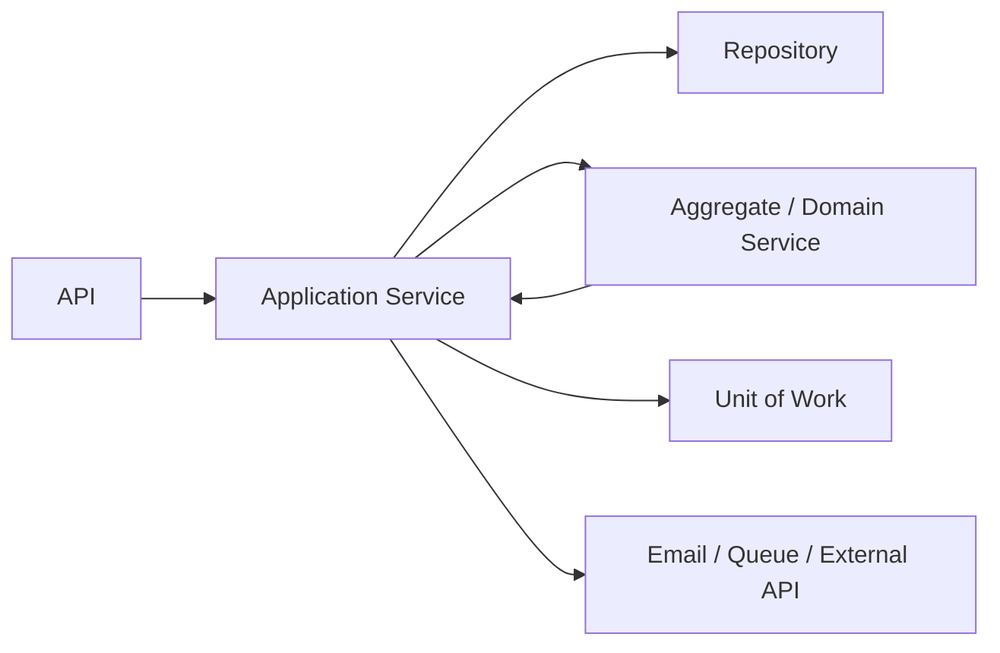
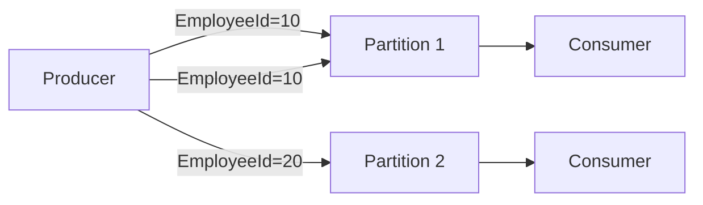
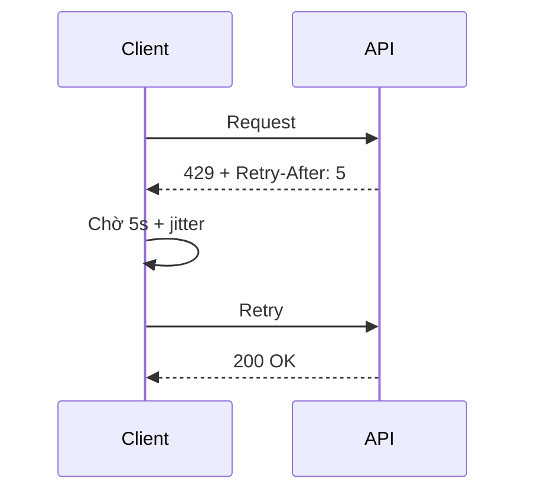
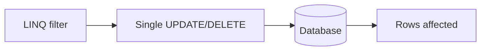
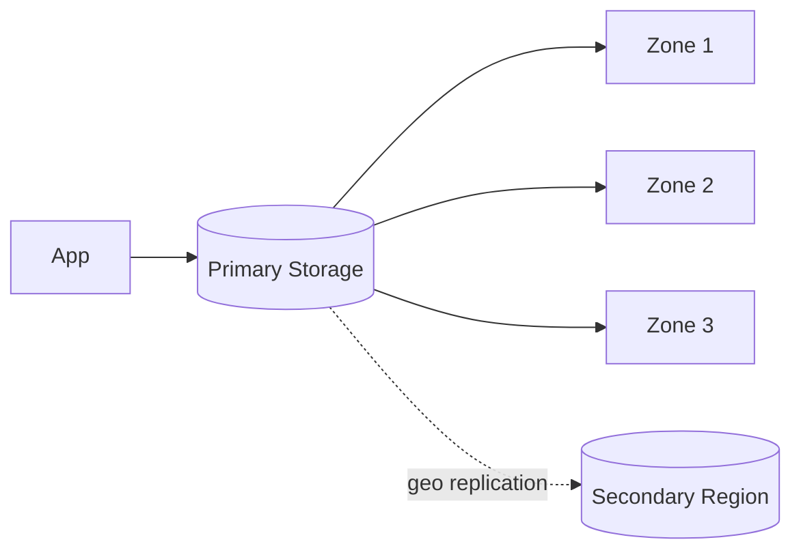
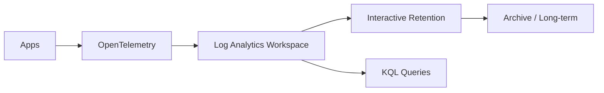
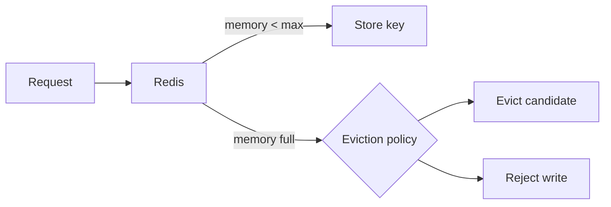
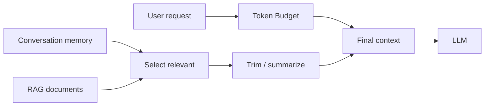
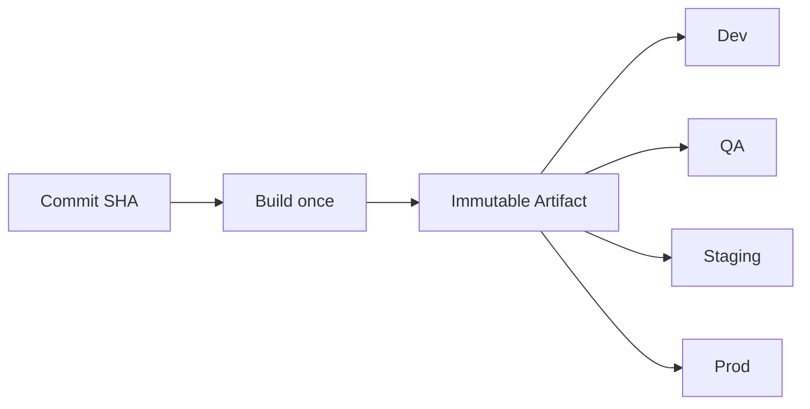

# Daily Knowledge Sharing — 17/08/2026

## Today’s Topics

1. DDD Domain Service vs Application Service — đặt business rule đúng boundary thay vì nhồi mọi logic vào service chung
2. Event-Driven Ordering Semantics — partition key, per-key ordering và vì sao “global ordering” thường là mục tiêu sai
3. HTTP 429 & Retry-After — client resilience khi API downstream rate-limit
4. SQL Server Snapshot Isolation — row versioning để giảm blocking nhưng không miễn phí
5. EF Core `ExecuteUpdate` / `ExecuteDelete` — bulk mutation nhanh nhưng dễ lệch với Change Tracker
6. Azure Storage Redundancy — LRS, ZRS, GRS và cách chọn theo RPO/RTO thay vì theo tên tier
7. Azure Monitor Log Analytics Retention — observability có giá và retention phải gắn với nhu cầu điều tra
8. Redis Eviction Policies — hệ thống làm gì khi memory đầy và vì sao cache có thể tự phá production
9. LLM Context Window Management — token budget, context trimming và giữ thông tin quan trọng cho AI workflow
10. Artifact Promotion trong CI/CD — build once, promote same artifact để giảm release drift

---

# 1. DDD Domain Service vs Application Service — đặt business rule đúng boundary thay vì nhồi mọi logic vào service chung

### 1. What is it?

Trong DDD, **Domain Service** chứa business logic thuộc domain nhưng không tự nhiên thuộc về một Entity hay Value Object cụ thể. **Application Service** điều phối use case: nhận input, load aggregate, gọi domain logic, commit transaction, phát event, gọi infrastructure.

Điểm khác biệt quan trọng là: Domain Service trả lời câu hỏi **“business rule này hoạt động thế nào?”**, còn Application Service trả lời **“use case này cần phối hợp những bước nào?”**.

### 2. Why does it exist?

Nếu không phân biệt hai loại service, code thường biến thành `EmployeeService`, `OrderService`, `TimesheetService` rất lớn, vừa chứa rule nghiệp vụ, vừa gọi database, gửi email, đọc config và xử lý HTTP.

Hậu quả:

- Domain rule khó test độc lập.
- Transaction boundary không rõ.
- Business code phụ thuộc framework hoặc SDK ngoài.
- Một thay đổi hạ tầng có thể kéo theo thay đổi business code.

### 3. How does it work?



Một flow tốt thường là:

1. Application Service nhận command.
2. Load aggregate từ repository.
3. Gọi aggregate hoặc Domain Service để áp dụng rule.
4. Domain trả về state mới hoặc domain event.
5. Application Service commit transaction.
6. Sau đó mới thực hiện side effect phù hợp.

### 4. Practical example

```csharp
public sealed class OffboardingPolicy
{
    public void Validate(Employee employee, MailAction action, DateTimeOffset? endTime)
    {
        if (action is MailAction.Delegate or MailAction.Forward && endTime is null)
            throw new DomainException("EndTime is required for delegate or forward.");

        if (!employee.IsActive)
            throw new DomainException("Employee is already inactive.");
    }
}

public sealed class OffboardEmployeeHandler
{
    private readonly IEmployeeRepository _repository;
    private readonly OffboardingPolicy _policy;
    private readonly IUnitOfWork _uow;

    public async Task Handle(OffboardEmployeeCommand cmd, CancellationToken ct)
    {
        var employee = await _repository.GetAsync(cmd.EmployeeId, ct)
            ?? throw new NotFoundException();

        _policy.Validate(employee, cmd.MailAction, cmd.EndTime);
        employee.Deactivate(cmd.MailAction, cmd.EndTime);

        await _uow.SaveChangesAsync(ct);
    }
}
```

`OffboardingPolicy` không biết HTTP, EF Core hay Exchange Online. Handler chịu trách nhiệm use case và transaction.

### 5. Real production scenario

Trong hệ thống employee offboarding, rule như “Forward phải có TargetEmail và EndTime” là domain rule. Việc load employee, lưu cấu hình, phát message sang background worker và ghi audit là orchestration của application layer.

Nếu tất cả nằm trong một `EmployeeService`, rất khó quyết định phần nào phải chạy trong transaction và phần nào có thể retry độc lập.

### 6. Common mistakes

- Gọi mọi class có hậu tố `Service` mà không có boundary rõ ràng.
- Đưa `DbContext` vào Domain Service.
- Đưa orchestration dài vào Entity.
- Dùng Domain Service chỉ để wrap một repository method.
- Đặt side effect không deterministic như gửi email trực tiếp bên trong domain logic.

### 7. Trade-offs

**Advantages**

- Business rule độc lập framework.
- Test dễ hơn.
- Transaction boundary rõ hơn.
- Application orchestration dễ đọc.

**Costs / Risks**

- Thêm abstraction.
- Có thể overengineer với domain rất đơn giản.
- Cần discipline để không biến Application Service thành “God orchestrator”.

### 8. Junior → Middle → Senior understanding

**Junior**: hiểu Entity chứa rule nội tại, Application Service điều phối use case.

**Middle**: biết tách rule nào thuộc Domain Service và viết unit test độc lập persistence.

**Senior / Technical Lead**: quyết định transaction boundary, side effect boundary và mức độ DDD cần thiết; tránh cả hai cực đoan “fat service” và “abstraction everywhere”.

### 9. Key takeaway

- Domain Service chứa business behavior; Application Service điều phối use case.
- Domain không nên phụ thuộc infrastructure.
- Boundary tốt giúp transaction, retry và testing rõ ràng hơn.

---

# 2. Event-Driven Ordering Semantics — partition key, per-key ordering và vì sao “global ordering” thường là mục tiêu sai

### 1. What is it?

Ordering semantics là quy tắc xác định message nào bắt buộc được xử lý trước message nào. Trong distributed system, giữ thứ tự **toàn cục** rất đắt; đa số business chỉ cần thứ tự theo một key như `OrderId`, `EmployeeId`, `AccountId`.

### 2. Why does it exist?

Ví dụ hai event:

- `EmployeeDeactivated`
- `EmployeeReactivated`

Nếu consumer xử lý ngược thứ tự, final state có thể sai. Nhưng ép mọi employee trong toàn hệ thống chạy qua một queue tuần tự sẽ làm throughput giảm mạnh.

### 3. How does it work?



Nguyên tắc thường dùng:

- Cùng business key → cùng partition/session.
- Trong partition/session → xử lý tuần tự hoặc có sequence validation.
- Khác key → xử lý song song.

### 4. Practical example

```csharp
var message = new ServiceBusMessage(BinaryData.FromObjectAsJson(evt))
{
    SessionId = evt.EmployeeId.ToString(),
    MessageId = evt.EventId.ToString()
};
```

Consumer có thể thêm version:

```csharp
if (evt.Version <= employee.LastProcessedVersion)
    return;

employee.Apply(evt);
employee.LastProcessedVersion = evt.Version;
```

### 5. Real production scenario

Một hệ thống billing có `InvoiceCreated`, `InvoiceAdjusted`, `InvoiceCancelled`. Chỉ cần bảo toàn thứ tự theo `InvoiceId`; không cần mọi invoice toàn công ty cùng thứ tự.

### 6. Common mistakes

- Giả định queue luôn global FIFO.
- Scale consumer ngang nhưng quên ordering constraint.
- Retry một message cũ khiến nó quay lại sau message mới hơn.
- Không có idempotency hoặc sequence/version check.
- Chọn partition key quá thô làm hot partition.

### 7. Trade-offs

**Advantages**

- Per-key ordering giữ đúng business semantics.
- Cho phép parallelism giữa các key.

**Costs / Risks**

- Hot key có thể thành bottleneck.
- Partition/session làm routing phức tạp hơn.
- Reprocessing cần version-aware logic.

### 8. Junior → Middle → Senior understanding

**Junior**: FIFO không đồng nghĩa “mọi message toàn hệ thống luôn đúng thứ tự”.

**Middle**: biết dùng session/partition key, idempotency và sequence number.

**Senior / Technical Lead**: xác định business scope thật sự cần ordering, cân bằng throughput, partition distribution và recovery semantics.

### 9. Key takeaway

- Hãy yêu cầu ordering theo business key, không theo toàn hệ thống nếu không thật sự cần.
- Ordering phải đi cùng idempotency và versioning.
- Partition key là quyết định kiến trúc, không phải chi tiết implementation nhỏ.

---

# 3. HTTP 429 & Retry-After — client resilience khi API downstream rate-limit

### 1. What is it?

HTTP `429 Too Many Requests` báo rằng client đã vượt giới hạn request của server. Header `Retry-After` cho biết khi nào nên thử lại.

### 2. Why does it exist?

Nếu client thấy 429 rồi retry ngay lập tức, nó tạo retry storm và làm downstream càng quá tải. Với API như Microsoft Graph, payment gateway hoặc AI API, hành vi retry sai có thể biến throttling nhỏ thành outage lớn.

### 3. How does it work?



Client nên:

1. Respect `Retry-After` nếu có.
2. Nếu không có, dùng exponential backoff + jitter.
3. Có max attempts và total timeout budget.
4. Chỉ retry operation an toàn hoặc idempotent.

### 4. Practical example

```csharp
static async Task<HttpResponseMessage> SendWithRetryAsync(
    HttpClient client,
    HttpRequestMessage request,
    CancellationToken ct)
{
    for (var attempt = 1; attempt <= 4; attempt++)
    {
        using var clone = await request.CloneAsync(ct);
        var response = await client.SendAsync(clone, ct);

        if ((int)response.StatusCode != 429)
            return response;

        var delay = response.Headers.RetryAfter?.Delta
            ?? TimeSpan.FromSeconds(Math.Pow(2, attempt));

        delay += TimeSpan.FromMilliseconds(Random.Shared.Next(100, 500));
        await Task.Delay(delay, ct);
    }

    throw new TimeoutException("Rate limit retry budget exhausted.");
}
```

### 5. Real production scenario

Một service sync Microsoft Graph đọc hàng nghìn user. Nếu chạy song song 100 request và mỗi request tự retry tức thì khi gặp 429, tổng load sẽ tăng thay vì giảm. Cách tốt hơn là giới hạn concurrency và retry theo `Retry-After`.

### 6. Common mistakes

- Retry ngay lập tức.
- Retry vô hạn.
- Không phân biệt 429 với 400/401/403.
- Retry POST không idempotent.
- Mỗi instance retry riêng mà không có concurrency control chung.

### 7. Trade-offs

**Advantages**

- Tăng khả năng phục hồi transient throttling.
- Giảm áp lực downstream.

**Costs / Risks**

- Tăng latency.
- Có thể vượt request timeout nếu không có deadline.
- Retry sai operation gây duplicate side effect.

### 8. Junior → Middle → Senior understanding

**Junior**: 429 là server yêu cầu giảm tốc, không phải lỗi để spam retry.

**Middle**: biết backoff, jitter, timeout, idempotency.

**Senior / Technical Lead**: thiết kế client-wide concurrency limit, retry budget, queueing và backpressure thay vì chỉ thêm Polly policy.

### 9. Key takeaway

- Respect `Retry-After`.
- Retry phải có budget và deadline.
- Rate limiting nên được xử lý cùng concurrency control, không riêng lẻ.

---

# 4. SQL Server Snapshot Isolation — row versioning để giảm blocking nhưng không miễn phí

### 1. What is it?

Snapshot Isolation cho phép transaction đọc một snapshot nhất quán của dữ liệu tại thời điểm transaction bắt đầu, thay vì chờ lock của writer. SQL Server giữ version cũ của row để reader có thể đọc mà không block writer.

### 2. Why does it exist?

Với `READ COMMITTED` truyền thống, reader có thể bị block bởi writer và ngược lại. Trong workload đọc nhiều, blocking dài có thể làm API latency tăng dù query không nặng.

### 3. How does it work?

```text
T1 cập nhật Row A
 ├─ tạo row version cũ
 └─ chưa commit

T2 đọc Row A
 └─ đọc version phù hợp với snapshot của T2
```

Snapshot giảm read/write blocking nhưng không loại bỏ write/write conflict.

### 4. Practical example

Bật database option:

```sql
ALTER DATABASE TimesheetDb
SET ALLOW_SNAPSHOT_ISOLATION ON;
```

Trong transaction:

```sql
SET TRANSACTION ISOLATION LEVEL SNAPSHOT;
BEGIN TRANSACTION;

SELECT Status, TotalHours
FROM Timesheets
WHERE Id = 1001;

COMMIT;
```

### 5. Real production scenario

Dashboard timesheet chạy report dài trong khi người dùng vẫn submit entry. Snapshot giúp report đọc dữ liệu nhất quán mà không giữ shared lock lâu, giảm blocking với write path.

### 6. Common mistakes

- Nghĩ rằng Snapshot loại bỏ mọi deadlock.
- Bật mà không theo dõi version store.
- Dùng transaction quá dài làm giữ version lâu.
- Không hiểu update conflict.
- Dùng isolation mạnh hơn mà không đo workload.

### 7. Trade-offs

**Advantages**

- Giảm read/write blocking.
- Reader thấy snapshot nhất quán.

**Costs / Risks**

- Tăng usage của version store.
- Transaction dài gây pressure.
- Write conflict vẫn có thể xảy ra.
- Cần hiểu semantics khác với lock-based read.

### 8. Junior → Middle → Senior understanding

**Junior**: hiểu isolation ảnh hưởng việc transaction nhìn thấy dữ liệu nào.

**Middle**: biết khi nào snapshot giảm blocking và cách test conflict.

**Senior / Technical Lead**: đánh giá workload, tempdb/version store pressure, long-running transaction và consistency requirement trước khi đổi isolation model.

### 9. Key takeaway

- Snapshot đổi blocking thành row-versioning cost.
- Không có isolation level “miễn phí”.
- Chọn isolation theo workload và business consistency.

---

# 5. EF Core `ExecuteUpdate` / `ExecuteDelete` — bulk mutation nhanh nhưng dễ lệch với Change Tracker

### 1. What is it?

`ExecuteUpdateAsync` và `ExecuteDeleteAsync` cho phép EF Core gửi câu `UPDATE`/`DELETE` trực tiếp xuống database mà không load từng entity và không đi qua Change Tracker.

### 2. Why does it exist?

Cách ngây thơ để update 100.000 row là load 100.000 entity, sửa property rồi `SaveChangesAsync()`. Điều này tốn memory, tracking overhead và nhiều round-trip hơn cần thiết.

### 3. How does it work?



Không có entity materialization và không update state của entity đã được track trong memory.

### 4. Practical example

```csharp
await db.Employees
    .Where(x => x.Status == EmployeeStatus.Inactive && x.LastLogin < cutoff)
    .ExecuteUpdateAsync(setters => setters
        .SetProperty(x => x.IsArchived, true)
        .SetProperty(x => x.UpdatedAt, DateTimeOffset.UtcNow), ct);
```

Delete:

```csharp
await db.AuditLogs
    .Where(x => x.CreatedAt < retentionCutoff)
    .ExecuteDeleteAsync(ct);
```

### 5. Real production scenario

Một retention job xóa hàng triệu audit log cũ. Load từng row qua EF Core sẽ không cần thiết và dễ gây memory pressure. Bulk delete trực tiếp hợp lý hơn.

### 6. Common mistakes

- Quên rằng tracked entity cũ không tự refresh.
- Mong `SaveChanges` interceptor chạy như update thông thường.
- Dùng bulk mutation khi cần domain invariant cho từng entity.
- Không kiểm tra affected row count.
- Chạy update lớn trong transaction gây lock escalation hoặc log growth.

### 7. Trade-offs

**Advantages**

- Nhanh và ít memory.
- Ít round-trip.

**Costs / Risks**

- Bypass Change Tracker và entity behavior.
- Có thể bypass audit/domain event logic.
- Bulk statement lớn có blast radius cao.

### 8. Junior → Middle → Senior understanding

**Junior**: biết bulk API không giống load entity rồi save.

**Middle**: biết dùng cho maintenance job và tránh tracked-state mismatch.

**Senior / Technical Lead**: quyết định mutation nào được phép bypass domain model, cách batch operation và kiểm soát lock/log impact.

### 9. Key takeaway

- Bulk mutation tối ưu cho set-based operation.
- Không dùng khi mỗi row cần domain behavior riêng.
- Hiểu rõ những gì bị bypass trước khi dùng trong production.

---

# 6. Azure Storage Redundancy — LRS, ZRS, GRS và cách chọn theo RPO/RTO thay vì theo tên tier

### 1. What is it?

Azure Storage redundancy xác định dữ liệu được nhân bản ở đâu: trong một datacenter, nhiều availability zone hoặc sang region khác.

### 2. Why does it exist?

Không phải mọi dữ liệu đều cần chống mất region. Nhưng nếu chọn redundancy quá thấp cho dữ liệu quan trọng, một sự cố lớn có thể vượt recovery requirement. Chọn quá cao lại tăng cost mà không tạo giá trị tương ứng.

### 3. How does it work?



Khái niệm cần hiểu:

- **LRS**: nhiều copy trong một region/location scope.
- **ZRS**: copy qua nhiều availability zone.
- **GRS/GZRS**: thêm geo replication sang region khác.

### 4. Practical example

File upload tạm có thể dùng mức redundancy thấp hơn. Tài liệu pháp lý hoặc backup quan trọng cần cân nhắc geo redundancy.

Application vẫn nên dùng retry và Managed Identity:

```csharp
var client = new BlobServiceClient(
    new Uri(storageUri),
    new DefaultAzureCredential());
```

### 5. Real production scenario

Hệ thống SaaS lưu user-generated documents. Business yêu cầu mất tối đa 15 phút dữ liệu và phải có DR khi primary region mất. Khi đó chỉ nhìn durability marketing number là chưa đủ; cần map lựa chọn storage vào RPO/RTO và failover process.

### 6. Common mistakes

- Chọn GRS rồi nghĩ app tự failover hoàn toàn.
- Không test DR.
- Không hiểu read access secondary khác active-active write.
- Dùng redundancy cao cho transient data không cần thiết.
- Bỏ qua data residency requirement.

### 7. Trade-offs

**Advantages**

- Tăng durability và khả năng chịu failure.
- Có option bảo vệ zone/region.

**Costs / Risks**

- Tăng chi phí.
- Geo replication không có nghĩa zero-RPO.
- Recovery operationally vẫn cần runbook.

### 8. Junior → Middle → Senior understanding

**Junior**: hiểu redundancy là số/location của bản sao dữ liệu.

**Middle**: biết LRS/ZRS/GRS khác nhau ở failure domain.

**Senior / Technical Lead**: chọn tier theo RPO/RTO, compliance, failover architecture và cost; yêu cầu DR test thay vì chỉ cấu hình checkbox.

### 9. Key takeaway

- Redundancy phải map vào failure scenario cụ thể.
- Geo replication không thay thế DR plan.
- RPO/RTO quan trọng hơn tên tier.

---

# 7. Azure Monitor Log Analytics Retention — observability có giá và retention phải gắn với nhu cầu điều tra

### 1. What is it?

Log Analytics lưu log/telemetry để query bằng KQL. Retention xác định giữ dữ liệu trong bao lâu trước khi archive hoặc xóa.

### 2. Why does it exist?

Log quá ít thì không điều tra được incident cũ. Log quá nhiều và giữ quá lâu làm chi phí ingestion/storage tăng, đồng thời tăng rủi ro giữ PII không cần thiết.

### 3. How does it work?



Retention nên khác nhau theo loại dữ liệu: security audit có thể cần lâu hơn debug logs.

### 4. Practical example

KQL tìm lỗi theo operation:

```kusto
AppRequests
| where TimeGenerated > ago(24h)
| where Success == false
| summarize Failures=count() by OperationName, bin(TimeGenerated, 5m)
| order by Failures desc
```

### 5. Real production scenario

Một lỗi payroll chỉ xảy ra cuối tháng. Nếu app log chỉ giữ 7 ngày, team không thể so sánh với kỳ trước. Ngược lại, giữ verbose request body 1 năm vừa đắt vừa nguy hiểm về privacy.

### 6. Common mistakes

- Retain mọi log cùng thời gian.
- Log PII rồi lưu dài hạn.
- Chỉ nhìn ingestion cost, không nhìn query/retention pattern.
- Không có sampling hoặc severity policy.
- Không test KQL/runbook trước incident.

### 7. Trade-offs

**Advantages**

- Điều tra incident và trend tốt hơn.
- Có lịch sử phục vụ audit.

**Costs / Risks**

- Chi phí tăng theo volume và retention.
- Privacy/compliance risk.
- Quá nhiều noise làm query khó.

### 8. Junior → Middle → Senior understanding

**Junior**: hiểu log phải searchable và có lifecycle.

**Middle**: biết viết KQL, chọn severity và tránh log sensitive data.

**Senior / Technical Lead**: thiết kế telemetry budget, retention theo data class, archive strategy và compliance requirement.

### 9. Key takeaway

- Retention là design decision, không phải setting mặc định.
- Giữ dữ liệu theo mục đích điều tra và compliance.
- Observability tốt cần cả signal quality lẫn cost control.

---

# 8. Redis Eviction Policies — hệ thống làm gì khi memory đầy và vì sao cache có thể tự phá production

### 1. What is it?

Eviction policy quyết định Redis xóa key nào khi memory đạt giới hạn. Ví dụ theo LRU, LFU, TTL hoặc không evict.

### 2. Why does it exist?

Redis chạy trong memory hữu hạn. Nếu không có strategy phù hợp, khi memory đầy cache có thể bắt đầu reject write, evict dữ liệu quan trọng hoặc gây hit ratio tụt mạnh.

### 3. How does it work?



Policy phải phù hợp loại dữ liệu. Cache thuần có thể chấp nhận eviction; Redis dùng như durable coordination store thì khác hoàn toàn.

### 4. Practical example

Một cache key nên có TTL:

```csharp
await cache.SetStringAsync(
    $"employee:{id}",
    json,
    new DistributedCacheEntryOptions
    {
        AbsoluteExpirationRelativeToNow = TimeSpan.FromMinutes(10)
    },
    ct);
```

Theo dõi hit/miss và memory, không chỉ latency.

### 5. Real production scenario

Product catalog cache tăng từ 5 GB lên 20 GB sau một release vì cache key chứa version timestamp sai. Redis bắt đầu evict hot key liên tục, database load tăng, API chậm, rồi database quá tải. Đây là feedback loop rất thường gặp.

### 6. Common mistakes

- Không set `maxmemory`/policy phù hợp.
- Cache key không TTL.
- Dùng Redis cho cache và critical lock/state trong cùng eviction domain.
- Chỉ scale memory mà không sửa key cardinality.
- Không monitor evicted keys và hit ratio.

### 7. Trade-offs

**Advantages**

- Eviction giúp hệ thống tự giới hạn memory.
- Policy tốt duy trì cache value dưới pressure.

**Costs / Risks**

- Sai policy làm mất dữ liệu không nên mất.
- Eviction quá mức gây cache churn và database overload.

### 8. Junior → Middle → Senior understanding

**Junior**: cache memory không vô hạn và key có thể bị xóa.

**Middle**: biết TTL, LRU/LFU, hit ratio và key cardinality.

**Senior / Technical Lead**: phân tách workload Redis, capacity planning, eviction telemetry và failure fallback để tránh thundering herd xuống database.

### 9. Key takeaway

- Eviction policy là một phần của production architecture.
- Theo dõi memory, evictions và hit ratio cùng nhau.
- Cache failure phải không được kéo database xuống theo.

---

# 9. LLM Context Window Management — token budget, context trimming và giữ thông tin quan trọng cho AI workflow

### 1. What is it?

Context window là lượng token model có thể xem trong một request. Context management là cách chọn nội dung nào được đưa vào, nội dung nào được tóm tắt, loại bỏ hoặc truy xuất lại.

### 2. Why does it exist?

Nhét toàn bộ lịch sử chat, log, tài liệu và code vào prompt làm:

- Tăng cost.
- Tăng latency.
- Dễ làm model mất tập trung.
- Có thể vượt context limit.
- Tăng surface cho prompt injection.

### 3. How does it work?



Một strategy thực tế:

1. Reserve token cho output.
2. Giữ system/developer policy bắt buộc.
3. Giữ user intent hiện tại.
4. Chọn history liên quan.
5. Retrieval theo nhu cầu.
6. Compress phần dài nhưng ít quan trọng.

### 4. Practical example

```csharp
public sealed record ContextBudget(
    int MaxTokens,
    int ReservedOutput,
    int ReservedSystem);

public int AvailableInput(ContextBudget b)
    => b.MaxTokens - b.ReservedOutput - b.ReservedSystem;
```

Trong AI app, metadata nên giúp ưu tiên context:

```json
{
  "type": "architecture-decision",
  "priority": 90,
  "source": "ADR-014",
  "tokens": 640
}
```

### 5. Real production scenario

Một coding agent làm việc trên repository lớn. Nếu mỗi turn gửi toàn repo, chi phí và latency tăng mạnh. Tốt hơn là gửi task, repo instructions, relevant files, test output và chỉ retrieval thêm khi cần.

### 6. Common mistakes

- “More context is always better”.
- Không reserve token cho output.
- Tóm tắt mất constraint quan trọng.
- Giữ stale context sau khi code thay đổi.
- Không phân biệt trusted instruction với retrieved text.

### 7. Trade-offs

**Advantages**

- Giảm cost và latency.
- Tăng signal-to-noise.
- Giảm nguy cơ vượt context window.

**Costs / Risks**

- Trim quá mạnh làm mất thông tin.
- Summary có thể làm sai nuance.
- Retrieval cần evaluation riêng.

### 8. Junior → Middle → Senior understanding

**Junior**: hiểu model chỉ biết những gì nằm trong context hiện tại.

**Middle**: biết budget token, retrieval và summary.

**Senior / Technical Lead**: thiết kế context policy, trust boundary, stale-context handling, evaluation và cost/quality trade-off.

### 9. Key takeaway

- Context là tài nguyên hữu hạn.
- Chất lượng context quan trọng hơn số lượng token.
- Context selection cần deterministic policy bên ngoài model.

---

# 10. Artifact Promotion trong CI/CD — build once, promote same artifact để giảm release drift

### 1. What is it?

Artifact Promotion là chiến lược **build một lần** rồi đẩy đúng artifact đó qua Dev → QA → Staging → Production, thay vì build lại ở mỗi môi trường.

### 2. Why does it exist?

Nếu mỗi environment build source lại, production artifact có thể khác QA do:

- dependency version khác,
- build image khác,
- timestamp/generated file khác,
- toolchain thay đổi,
- branch head đã di chuyển.

Khi đó câu “QA đã test version này” không còn chắc chắn đúng.

### 3. How does it work?



Config môi trường nên inject lúc deploy/runtime, không bake thành binary khác.

### 4. Practical example

GitHub Actions có thể build container theo commit SHA:

```yaml
- name: Build image
  run: docker build -t ghcr.io/acme/api:${{ github.sha }} .

- name: Push image
  run: docker push ghcr.io/acme/api:${{ github.sha }}
```

Production deploy đúng digest/tag đã qua QA, không chạy `docker build` lại.

### 5. Real production scenario

Một API đã pass regression trên staging. Nếu production pipeline build lại và dependency restore lấy package mới, production có thể lỗi dù staging xanh. Build-once loại bỏ một class release drift này.

### 6. Common mistakes

- Dùng mutable tag như `latest`.
- Build lại ở production.
- Bake secret/config vào artifact.
- Không lưu SBOM/provenance/commit SHA.
- Promote code branch thay vì artifact identity.

### 7. Trade-offs

**Advantages**

- Reproducibility tốt hơn.
- QA và production dùng cùng binary.
- Rollback rõ ràng.

**Costs / Risks**

- Cần artifact registry và retention policy.
- Runtime config phải thiết kế sạch.
- Promotion pipeline phức tạp hơn build-per-env lúc ban đầu.

### 8. Junior → Middle → Senior understanding

**Junior**: hiểu artifact là output immutable của build.

**Middle**: biết tag theo commit SHA/digest, tách config khỏi artifact.

**Senior / Technical Lead**: thiết kế provenance, security scanning, approval gate, rollback và artifact retention để release chain có thể audit.

### 9. Key takeaway

- Build once, promote same artifact.
- Production release phải định danh bằng immutable artifact.
- Tách environment config khỏi binary để tránh rebuild drift.
