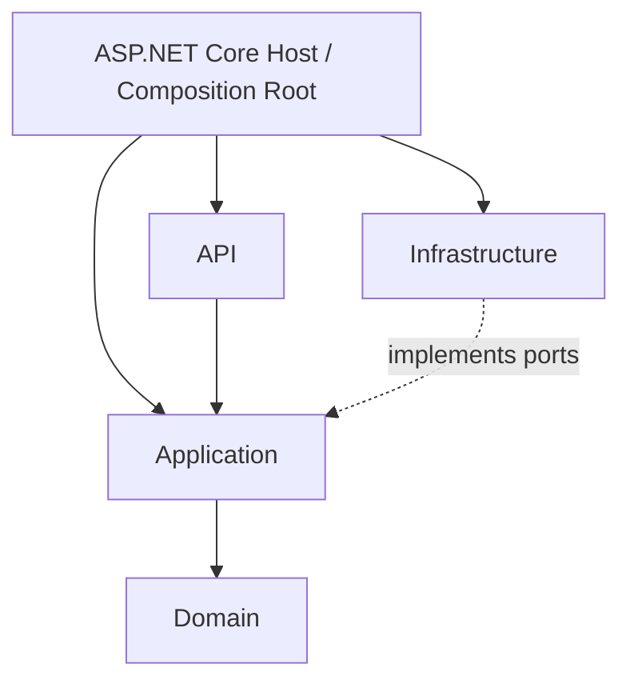
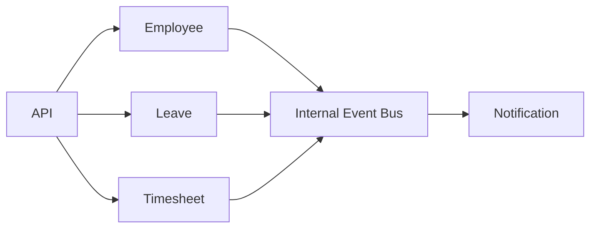
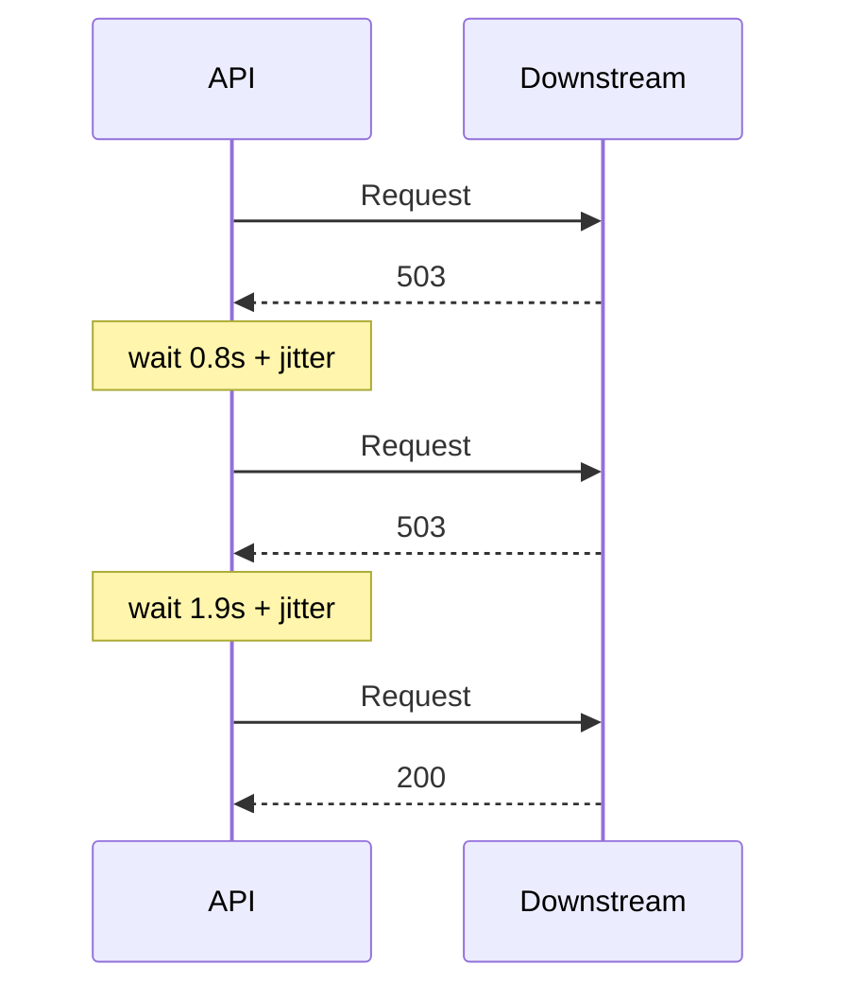
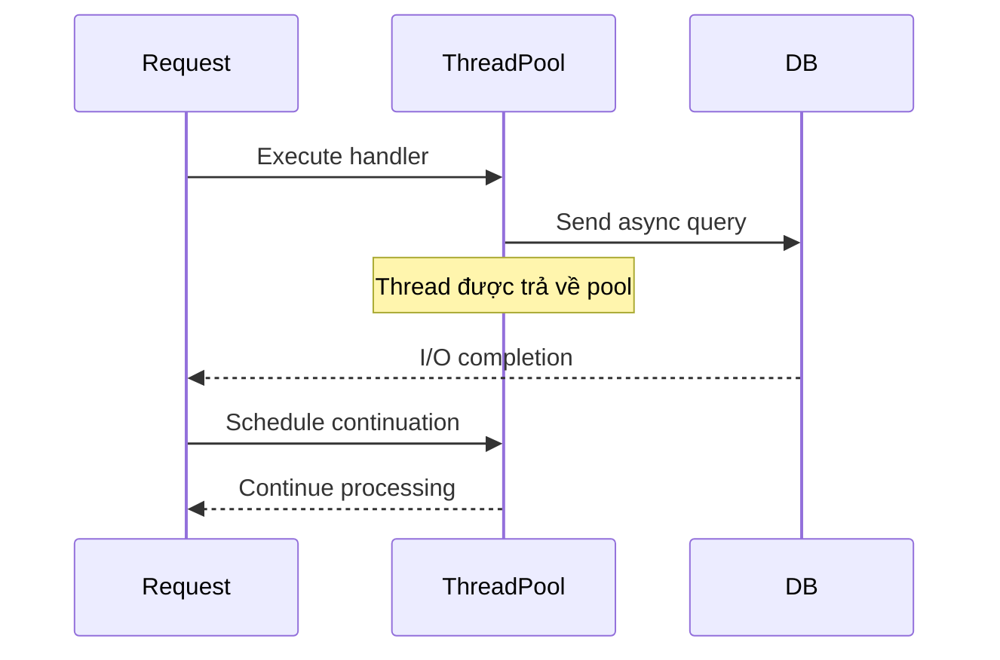
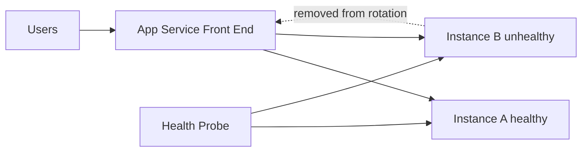
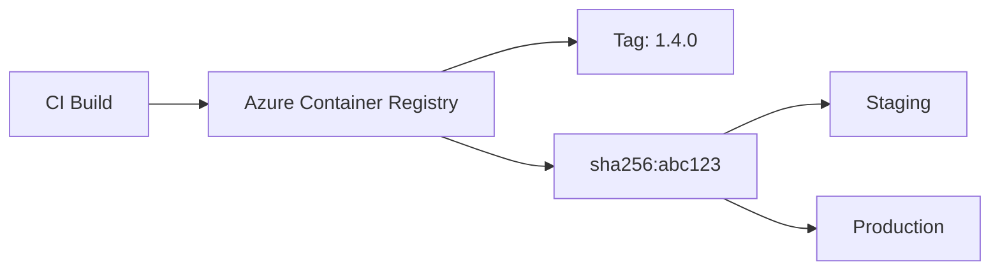
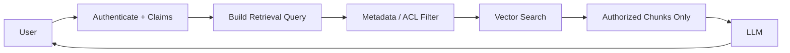
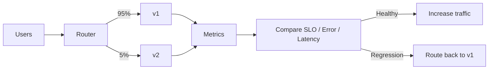

# Daily Knowledge Sharing — 17/08/2026

## Today’s Topics

1. Composition Root trong Clean Architecture — gom việc wiring dependency về đúng một nơi
2. Modular Monolith Internal Contracts — module ownership, integration event và tránh coupling ngầm
3. Retry với Exponential Backoff + Jitter — resilience đúng cách khi downstream lỗi tạm thời
4. SQL Server Keyset Pagination — phân trang ổn định khi dữ liệu lớn và thay đổi liên tục
5. Async I/O trong .NET — tăng throughput bằng cách không block thread khi chờ network/database
6. Azure App Service Health Check & Auto-Heal — tự loại instance lỗi khỏi traffic và phục hồi có kiểm soát
7. Azure Container Registry Image Digest — deploy đúng artifact, tránh tag drift và supply-chain ambiguity
8. Four Golden Signals — Latency, Traffic, Errors, Saturation cho production monitoring
9. RAG Authorization-Aware Retrieval — lọc dữ liệu theo quyền trước khi đưa context vào LLM
10. Canary Analysis & Automated Rollback — release dựa trên telemetry thay vì cảm giác

---

# 1. Composition Root trong Clean Architecture — gom việc wiring dependency về đúng một nơi

### 1. What is it?

**Composition Root** là nơi duy nhất hoặc gần như duy nhất trong application chịu trách nhiệm tạo object graph và nối các abstraction với implementation cụ thể.

Trong ASP.NET Core, Composition Root thường nằm ở `Program.cs`, extension methods được gọi từ `Program.cs`, hoặc một project host riêng.

Ví dụ:

```csharp
builder.Services.AddScoped<IEmployeeRepository, EmployeeRepository>();
builder.Services.AddScoped<IExchangeService, ExchangeOnlineService>();
builder.Services.AddScoped<OffboardEmployeeHandler>();
```

Điểm cốt lõi không phải là “đăng ký DI ở đâu cho đẹp”, mà là **business code không tự quyết định infrastructure implementation nào sẽ được dùng**.

### 2. Why does it exist?

Nếu application layer tự tạo dependency:

```csharp
var db = new AppDbContext(...);
var graph = new GraphServiceClient(...);
var service = new ExchangeOnlineService(...);
```

thì business workflow bị gắn chặt vào:

- EF Core.
- Microsoft Graph SDK.
- credential mechanism.
- logging implementation.
- concrete configuration.

Hậu quả là test khó, thay implementation khó và dependency direction của Clean Architecture bị đảo ngược.

Composition Root giải quyết vấn đề này bằng cách để **outermost layer quyết định concrete implementation**, còn inner layers chỉ biết abstraction.

### 3. How does it work?



Application có thể định nghĩa:

```csharp
public interface IEmployeeRepository
{
    Task<Employee?> GetByIdAsync(Guid id, CancellationToken ct);
}
```

Infrastructure implement:

```csharp
public sealed class EmployeeRepository(AppDbContext db)
    : IEmployeeRepository
{
    public Task<Employee?> GetByIdAsync(Guid id, CancellationToken ct)
        => db.Employees.SingleOrDefaultAsync(x => x.Id == id, ct);
}
```

Composition Root nối hai phía:

```csharp
builder.Services.AddScoped<IEmployeeRepository, EmployeeRepository>();
```

### 4. Practical example

Giả sử một hệ thống đồng bộ employee cần đọc user từ Microsoft Graph.

Application chỉ phụ thuộc:

```csharp
public interface IDirectoryGateway
{
    Task<DirectoryUser?> FindByEmailAsync(string email, CancellationToken ct);
}
```

Production dùng:

```csharp
builder.Services.AddScoped<IDirectoryGateway, MicrosoftGraphDirectoryGateway>();
```

Integration test có thể thay bằng fake:

```csharp
services.AddSingleton<IDirectoryGateway>(new FakeDirectoryGateway(...));
```

Business handler không phải đổi code.

### 5. Real production scenario

Một hệ thống employee offboarding có thể cần:

Client → API → `OffboardEmployeeHandler` → Repository → Exchange Online → Audit log.

Nếu handler biết trực tiếp PowerShell runner, EF Core và Key Vault SDK, sau vài tháng nó trở thành một “integration god object”.

Composition Root cho phép handler chỉ phụ thuộc vào capability:

- `IEmployeeRepository`
- `IMailboxService`
- `IAuditWriter`

còn production host quyết định capability đó được implement bằng EF Core, Exchange Online PowerShell hay service khác.

### 6. Common mistakes

- Dùng service locator: inject `IServiceProvider` khắp application rồi gọi `GetRequiredService()`.
- Đăng ký mọi thứ thành `Singleton` để “đỡ tạo object”.
- Cho domain project reference trực tiếp Infrastructure.
- Chia DI registration ra hàng chục file đến mức không còn nhìn thấy object graph.
- Đưa business branching vào Composition Root, ví dụ tenant A chạy rule khác tenant B bằng hàng loạt `if` thay vì strategy/policy rõ ràng.

### 7. Trade-offs

**Advantages**

- Dependency direction rõ.
- Test dễ hơn.
- Thay infrastructure implementation ít ảnh hưởng business code.
- Lifetime được quản lý tập trung.

**Costs / Risks**

- Startup configuration có thể lớn.
- Sai lifetime gây captive dependency hoặc scope leak.
- Quá nhiều abstraction không cần thiết tạo ceremony.

### 8. Junior → Middle → Senior understanding

**Junior**

Hiểu rằng DI container tạo dependency thay vì class tự `new` service bên ngoài.

**Middle**

Biết chọn `Singleton`, `Scoped`, `Transient`, tổ chức registration và test override dependency.

**Senior / Technical Lead**

Phải nhìn được toàn bộ dependency graph, boundary giữa application/infrastructure, lifetime risk và tránh biến DI container thành service locator.

### 9. Key takeaway

- Composition Root là nơi concrete implementation được ghép với abstraction.
- Inner layer không nên tự tạo infrastructure dependency.
- DI tốt là công cụ bảo vệ dependency direction, không phải chỉ để giảm số lần dùng `new`.

---

# 2. Modular Monolith Internal Contracts — module ownership, integration event và tránh coupling ngầm

### 1. What is it?

Modular Monolith là một ứng dụng deploy chung nhưng bên trong được chia thành các module có ownership và boundary rõ ràng.

Một module tốt không chỉ có folder riêng. Nó phải có:

- model riêng,
- use case riêng,
- data ownership rõ,
- public contract rõ,
- hạn chế truy cập trực tiếp nội bộ module khác.

Ví dụ:

```text
Employee
Timesheet
Leave
Approval
Notification
```

### 2. Why does it exist?

Monolith thường xuống cấp không phải vì “một process quá lớn”, mà vì mọi phần đều truy cập mọi phần:

```text
LeaveService -> TimesheetDbContext
TimesheetService -> EmployeeRepository
ApprovalService -> Leave internal table
Notification -> trực tiếp update Employee
```

Khi đó một thay đổi nhỏ có blast radius toàn hệ thống.

Microservices có thể giải coupling bằng network boundary nhưng đổi lại là distributed-system complexity. Modular Monolith cho phép giữ deployment đơn giản nhưng vẫn ép team suy nghĩ theo module boundary.

### 3. How does it work?



Một module không nên query table của module khác trực tiếp nếu dữ liệu đó thuộc ownership của module kia.

Thay vào đó có thể dùng:

- public application contract,
- internal command/query,
- integration event,
- replicated read model nếu cần decouple mạnh hơn.

### 4. Practical example

Khi employee chuyển `Inactive`, module Employee phát:

```csharp
public sealed record EmployeeDeactivated(
    Guid EmployeeId,
    string Email,
    DateTimeOffset OccurredAt);
```

Module Timesheet có handler riêng:

```csharp
public sealed class EmployeeDeactivatedHandler
{
    public Task Handle(EmployeeDeactivated evt, CancellationToken ct)
    {
        // Close future timesheet permissions owned by Timesheet module.
        return Task.CompletedTask;
    }
}
```

Employee module không trực tiếp update bảng Timesheet.

### 5. Real production scenario

Trong hệ thống HR, thao tác deactivation có thể ảnh hưởng:

- mailbox,
- timesheet,
- leave,
- access control,
- notification.

Naive implementation thường tạo một service dài hàng trăm dòng gọi trực tiếp mọi repository.

Modular Monolith tốt sẽ để Employee module sở hữu state transition, sau đó phát event nội bộ để module khác phản ứng theo ownership của mình.

### 6. Common mistakes

- Chia folder nhưng dùng chung toàn bộ entity/repository.
- Một `Shared` project chứa gần như toàn bộ domain object.
- Dùng event để che synchronous dependency bắt buộc.
- Cho module A join trực tiếp table module B vì “cùng database mà”.
- Mỗi module có DbContext riêng nhưng vẫn expose `IQueryable` ra ngoài.

### 7. Trade-offs

**Advantages**

- Deployment đơn giản hơn microservices.
- Transaction local dễ hơn.
- Boundary rõ giúp giảm coupling.
- Có đường tiến hóa sang service riêng nếu cần.

**Costs / Risks**

- Boundary mang tính discipline nhiều hơn physical isolation.
- Developer có thể phá luật bằng direct database access.
- Internal events vẫn cần xử lý ordering, failure và duplicate nếu async.

### 8. Junior → Middle → Senior understanding

**Junior**

Hiểu module là business boundary, không chỉ là folder.

**Middle**

Biết thiết kế public contracts và tránh query/update dữ liệu module khác trực tiếp.

**Senior / Technical Lead**

Quyết định ownership, synchronous vs asynchronous integration, transaction boundary và khi nào một module thực sự nên tách thành microservice.

### 9. Key takeaway

- Modular Monolith thành công nhờ boundary, không phải nhờ cấu trúc thư mục.
- Mỗi module cần ownership dữ liệu và contract rõ.
- Shared database không có nghĩa là shared ownership.

---

# 3. Retry với Exponential Backoff + Jitter — resilience đúng cách khi downstream lỗi tạm thời

### 1. What is it?

Retry là thử lại operation thất bại khi lỗi có khả năng chỉ là tạm thời.

**Exponential backoff** tăng khoảng chờ sau mỗi lần thử:

```text
1s → 2s → 4s → 8s
```

**Jitter** thêm một khoảng ngẫu nhiên để nhiều client không retry cùng lúc.

### 2. Why does it exist?

Nếu 1.000 request cùng thất bại vì downstream quá tải và tất cả retry đúng sau 1 giây, ta tạo một spike mới đúng 1 giây sau.

Đó là **retry storm / thundering herd**.

Retry fixed interval có thể làm dependency đang yếu trở nên yếu hơn.

### 3. How does it work?



Retry chỉ hợp lý khi:

- lỗi transient,
- operation idempotent hoặc có idempotency protection,
- còn đủ timeout budget.

### 4. Practical example

Với resilience pipeline trong .NET:

```csharp
builder.Services.AddHttpClient<GraphGateway>()
    .AddStandardResilienceHandler(options =>
    {
        options.Retry.MaxRetryAttempts = 3;
        options.Retry.Delay = TimeSpan.FromMilliseconds(500);
        options.TotalRequestTimeout.Timeout = TimeSpan.FromSeconds(10);
    });
```

Với API trả `429 Retry-After`, client nên ưu tiên server hint thay vì tự đoán delay.

### 5. Real production scenario

Một background job gọi Microsoft Graph để cập nhật 2.000 employee.

Graph trả 429 trong giờ cao điểm.

Nếu worker retry ngay không delay:

- request tiếp tục bị throttle,
- throughput thực tế giảm,
- log nổ lớn,
- token/network bị lãng phí.

Thiết kế tốt sẽ:

1. đọc `Retry-After`,
2. delay có jitter,
3. giới hạn số lần retry,
4. ghi metric retry,
5. đưa item lỗi lâu dài sang retry queue hoặc manual investigation.

### 6. Common mistakes

- Retry mọi exception.
- Retry `400`, `401`, validation error.
- Retry POST không idempotent khiến tạo duplicate payment/order.
- Không có timeout tổng.
- Retry ở nhiều layer cùng lúc: SDK retry + HTTP retry + job retry.
- Không jitter.

### 7. Trade-offs

**Advantages**

- Tăng khả năng chịu transient failure.
- Giảm failure do network hiccup/throttling ngắn hạn.

**Costs / Risks**

- Tăng latency.
- Có thể tăng tải đúng lúc dependency yếu nhất.
- Dễ tạo duplicate side effect.
- Retry nhiều tầng làm số request tăng theo cấp số nhân.

### 8. Junior → Middle → Senior understanding

**Junior**

Biết retry không phải `catch { try again; }` vô hạn.

**Middle**

Biết phân loại transient/non-transient, exponential backoff, jitter, idempotency và timeout.

**Senior / Technical Lead**

Phải thiết kế retry budget end-to-end, tránh retry amplification và kết hợp circuit breaker/load shedding khi downstream thực sự unhealthy.

### 9. Key takeaway

- Retry chỉ dành cho lỗi có khả năng hồi phục.
- Exponential backoff + jitter giúp tránh retry storm.
- Luôn xét idempotency và timeout budget trước khi retry.

---

# 4. SQL Server Keyset Pagination — phân trang ổn định khi dữ liệu lớn và thay đổi liên tục

### 1. What is it?

Keyset Pagination, còn gọi là seek pagination, dùng giá trị của record cuối trang trước làm cursor cho trang tiếp theo.

Thay vì:

```sql
ORDER BY CreatedAt DESC
OFFSET 500000 ROWS FETCH NEXT 50 ROWS ONLY;
```

Ta dùng:

```sql
WHERE (CreatedAt < @LastCreatedAt)
   OR (CreatedAt = @LastCreatedAt AND Id < @LastId)
ORDER BY CreatedAt DESC, Id DESC
OFFSET 0 ROWS FETCH NEXT 50 ROWS ONLY;
```

### 2. Why does it exist?

Offset pagination phải “đi qua” số lượng row ngày càng lớn khi page number tăng.

Ngoài performance, dữ liệu thay đổi giữa hai lần request còn gây:

- duplicate record,
- bỏ sót record,
- page không ổn định.

Keyset pagination bám vào sort key nên ít bị các vấn đề đó hơn.

### 3. How does it work?

Giả sử sort:

```text
CreatedAt DESC, Id DESC
```

Trang đầu trả record cuối:

```text
CreatedAt = 2026-08-17T12:00:00Z
Id = 8912
```

Trang sau query những row “nhỏ hơn” key này theo cùng thứ tự.

Index nên support đúng sort:

```sql
CREATE INDEX IX_Events_CreatedAt_Id
ON Events (CreatedAt DESC, Id DESC)
INCLUDE (EmployeeId, EventType);
```

### 4. Practical example

ASP.NET Core có thể trả cursor opaque:

```json
{
  "items": [...],
  "nextCursor": "eyJjcmVhdGVkQXQiOiIyMDI2LTA4LTE3VDEyOjAwOjAwWiIsImlkIjo4OTEyfQ=="
}
```

Client không cần biết page number.

### 5. Real production scenario

Audit log có hàng chục triệu bản ghi.

Dashboard thường chỉ cần “load more”. Offset pagination page 10.000 sẽ chậm dần, trong khi keyset pagination vẫn có thể seek trực tiếp vào index gần vị trí cần đọc.

### 6. Common mistakes

- Dùng sort key không unique, ví dụ chỉ `CreatedAt`.
- Cursor không chứa tie-breaker như `Id`.
- Query order khác logic cursor.
- Không có index phù hợp.
- Encode cursor nhưng không validate hoặc ký khi cursor chứa dữ liệu nhạy cảm.
- Dùng keyset cho UI yêu cầu jump trực tiếp page 257 mà không có chiến lược khác.

### 7. Trade-offs

**Advantages**

- Performance ổn định hơn ở dataset lớn.
- Ít duplicate/missing row khi dữ liệu biến động.
- Tận dụng index seek tốt.

**Costs / Risks**

- Không phù hợp với random page jump.
- Cursor phức tạp hơn page number.
- Multi-column sorting cần logic cursor cẩn thận.

### 8. Junior → Middle → Senior understanding

**Junior**

Hiểu khác biệt giữa page number và cursor.

**Middle**

Biết viết predicate đúng cho sort key nhiều cột và tạo index phù hợp.

**Senior / Technical Lead**

Biết chọn pagination strategy theo UX, volume, consistency requirement và query plan thực tế.

### 9. Key takeaway

- Dataset càng lớn, `OFFSET` càng dễ trở thành bottleneck.
- Keyset pagination cần stable unique sort key.
- Cursor design và index design phải đi cùng nhau.

---

# 5. Async I/O trong .NET — tăng throughput bằng cách không block thread khi chờ network/database

### 1. What is it?

Async I/O cho phép thread trả về ThreadPool trong lúc operation đang chờ database, HTTP, file hoặc network.

`await` không làm network nhanh hơn. Nó giúp server **không giữ thread vô ích trong thời gian chờ**.

### 2. Why does it exist?

Web server có lượng thread hữu hạn.

Nếu mỗi request block một thread trong 2 giây chỉ để chờ downstream:

```text
500 concurrent requests ≈ hàng trăm thread bị giữ
```

ThreadPool starvation có thể xuất hiện trước cả khi CPU đạt 100%.

### 3. How does it work?



I/O completion được OS/runtime báo lại; continuation được schedule khi dữ liệu sẵn sàng.

### 4. Practical example

Tốt:

```csharp
public async Task<Employee?> GetAsync(Guid id, CancellationToken ct)
{
    return await db.Employees
        .AsNoTracking()
        .SingleOrDefaultAsync(x => x.Id == id, ct);
}
```

Xấu:

```csharp
var employee = db.Employees
    .SingleAsync(x => x.Id == id)
    .Result;
```

`.Result` / `.Wait()` biến async call thành blocking call.

### 5. Real production scenario

API timesheet gọi:

- SQL Server 150 ms,
- Redis 20 ms,
- Graph API 500 ms.

Nếu code async end-to-end, request thread được giải phóng trong phần lớn thời gian chờ I/O.

Nếu code sync-over-async, traffic tăng có thể khiến ThreadPool queue dài, latency p95/p99 tăng mạnh dù CPU chỉ ở mức trung bình.

### 6. Common mistakes

- Dùng `.Result`, `.Wait()` trong request path.
- `Task.Run` để bọc database call rồi gọi đó là async I/O.
- Fire-and-forget task dùng scoped service đã dispose.
- Parallelize hàng trăm I/O request mà không giới hạn concurrency.
- Không truyền `CancellationToken`.

### 7. Trade-offs

**Advantages**

- Throughput web/backend tốt hơn cho I/O-heavy workload.
- Giảm số thread bị block.
- Scale concurrent request hiệu quả hơn.

**Costs / Risks**

- Debug call stack phức tạp hơn.
- Unbounded concurrency vẫn có thể phá downstream.
- Async không giúp CPU-bound work tự nhanh hơn.

### 8. Junior → Middle → Senior understanding

**Junior**

Hiểu `await` dành cho tác vụ phải chờ, không phải “chạy background”.

**Middle**

Biết async end-to-end, cancellation, exception propagation và concurrency limits.

**Senior / Technical Lead**

Phải phân biệt I/O bottleneck, ThreadPool starvation và downstream saturation; thiết kế backpressure thay vì chỉ thêm `Task.WhenAll`.

### 9. Key takeaway

- Async I/O tối ưu thread utilization, không giảm thời gian network vật lý.
- Tránh sync-over-async trên request path.
- Async phải đi cùng cancellation và concurrency control.

---

# 6. Azure App Service Health Check & Auto-Heal — tự loại instance lỗi khỏi traffic và phục hồi có kiểm soát

### 1. What is it?

Azure App Service Health Check định kỳ gọi một endpoint của application để xác định instance còn healthy hay không.

Auto-Heal có thể recycle process/instance khi phát hiện condition như:

- request chậm kéo dài,
- HTTP 5xx tăng,
- memory cao,
- process behavior bất thường.

### 2. Why does it exist?

Một process còn chạy không có nghĩa là application còn phục vụ tốt.

Ví dụ:

- connection pool cạn,
- downstream DNS lỗi,
- deadlock logic,
- memory leak,
- startup dependency chưa sẵn sàng.

Nếu load balancer vẫn gửi traffic vào instance đó, user tiếp tục nhận lỗi.

### 3. How does it work?



Health endpoint nên trả trạng thái dựa trên capability thực sự cần thiết để phục vụ traffic.

### 4. Practical example

ASP.NET Core:

```csharp
builder.Services.AddHealthChecks()
    .AddSqlServer(connectionString, name: "sql");

app.MapHealthChecks("/health/ready");
```

Nhưng không nên nhét mọi third-party dependency vào readiness check. Nếu một optional email provider down mà API chính vẫn hoạt động, health check không nên làm cả app mất traffic.

### 5. Real production scenario

App Service chạy 4 instances.

Một instance có outbound socket issue nên Graph call timeout liên tục. Health endpoint phát hiện core dependency không hoạt động, Azure loại instance khỏi routing. Auto-Heal recycle instance đó trong khi 3 instance còn lại tiếp tục phục vụ.

### 6. Common mistakes

- Health endpoint chỉ trả `200 OK` cố định.
- Check quá nhiều downstream và gây cascading outage.
- Dùng query database nặng trong mỗi health probe.
- Không phân biệt liveness và readiness.
- Auto-Heal quá aggressive gây restart loop và che mất root cause.
- Không log/metric lý do instance bị unhealthy.

### 7. Trade-offs

**Advantages**

- Giảm thời gian user bị route vào instance hỏng.
- Tự phục hồi một số failure mode.
- Hữu ích trong scale-out environment.

**Costs / Risks**

- Health check sai có thể tự loại toàn bộ fleet.
- Restart có thể chỉ che triệu chứng.
- Dependency checks làm tăng load nếu thiết kế kém.

### 8. Junior → Middle → Senior understanding

**Junior**

Biết health endpoint phản ánh trạng thái phục vụ, không chỉ process sống.

**Middle**

Biết cấu hình health checks, readiness/liveness và logging.

**Senior / Technical Lead**

Phải quyết định dependency nào là critical, threshold nào hợp lý, cách tránh restart storm và cách kết hợp autoscale/alerting.

### 9. Key takeaway

- Healthy process chưa chắc là healthy service.
- Health check cần phản ánh capability phục vụ traffic.
- Auto-Heal là safety net, không phải thay thế root-cause investigation.

---

# 7. Azure Container Registry Image Digest — deploy đúng artifact, tránh tag drift và supply-chain ambiguity

### 1. What is it?

Container image tag như:

```text
myapp:latest
myapp:prod
myapp:1.4
```

là tên có thể được trỏ lại sang image khác.

Image digest như:

```text
myapp@sha256:abc123...
```

xác định chính xác content immutable của image.

### 2. Why does it exist?

Nếu production deploy bằng mutable tag `latest`, cùng một manifest deployment hôm nay và ngày mai có thể kéo hai image khác nhau.

Khi incident xảy ra, team khó trả lời:

> “Production thực sự đang chạy image bytes nào?”

Digest giải quyết artifact identity.

### 3. How does it work?



CI build image một lần, push ACR, lấy digest rồi promote chính digest đó qua environment.

### 4. Practical example

Thay vì deployment reference:

```yaml
image: myregistry.azurecr.io/api:latest
```

ưu tiên:

```yaml
image: myregistry.azurecr.io/api@sha256:abc123...
```

Pipeline vẫn có thể giữ semantic tag để con người đọc, nhưng deployment pin theo digest.

### 5. Real production scenario

CI chạy hai lần cùng ngày và cùng push `api:staging`.

Nếu release pipeline dùng tag, production có thể lấy image từ build thứ hai dù approval dựa trên build thứ nhất.

Pin digest loại bỏ ambiguity này.

### 6. Common mistakes

- Dùng `latest` trong production.
- Rebuild lại source cho từng environment.
- Cho phép overwrite release tag mà không audit.
- Không scan image vulnerability.
- Dùng admin credential ACR thay vì Managed Identity/workload identity khi có thể.
- Không lưu mapping commit SHA ↔ image digest ↔ release.

### 7. Trade-offs

**Advantages**

- Artifact identity rõ ràng.
- Rollback chính xác.
- Hỗ trợ build-once-promote-many.
- Tốt cho audit/supply-chain traceability.

**Costs / Risks**

- Digest khó đọc hơn tag.
- Pipeline cần quản lý metadata tốt hơn.
- Pin digest không tự giải quyết image vulnerability hay secret leak.

### 8. Junior → Middle → Senior understanding

**Junior**

Hiểu tag là alias, digest là identity của content.

**Middle**

Biết lấy digest từ CI, pin deployment và giữ metadata release.

**Senior / Technical Lead**

Thiết kế supply-chain từ source commit → build → scan → signed artifact → promotion → rollback, không chỉ dừng ở Docker tag.

### 9. Key takeaway

- Production nên biết chính xác image nào đang chạy.
- Tag giúp con người đọc; digest giúp máy xác định artifact bất biến.
- Build once, promote same digest giảm release drift.

---

# 8. Four Golden Signals — Latency, Traffic, Errors, Saturation cho production monitoring

### 1. What is it?

Four Golden Signals là bốn nhóm tín hiệu giúp hiểu nhanh health của một service:

- **Latency** — request mất bao lâu.
- **Traffic** — có bao nhiêu request/workload.
- **Errors** — tỷ lệ lỗi.
- **Saturation** — tài nguyên đang gần giới hạn đến đâu.

### 2. Why does it exist?

Dashboard production thường chứa rất nhiều metric nhưng vẫn khó trả lời:

> “User đang bị ảnh hưởng không?”

CPU 70% tự nó không nói hệ thống tốt hay xấu.

Golden Signals đưa monitoring về service behavior và user impact.

### 3. How does it work?

```text
Traffic tăng
   ↓
Saturation tăng
   ↓
Latency p95 tăng
   ↓
Timeout/Error tăng
```

Bốn signal thường liên hệ với nhau và giúp tạo hypothesis nhanh trong incident.

### 4. Practical example

ASP.NET Core + OpenTelemetry có thể ghi:

```text
http.server.request.duration
http.server.request.count
http.server.request.errors
process.cpu.utilization
connection_pool.pending_requests
```

Dashboard nên ưu tiên percentile:

```text
p50 latency
p95 latency
p99 latency
```

thay vì chỉ average.

### 5. Real production scenario

10:00 AM:

- traffic tăng 2x,
- error rate vẫn thấp,
- CPU 55%,
- DB connection pool 95%,
- p99 latency tăng từ 800 ms lên 7 s.

Nếu chỉ nhìn CPU, team có thể bỏ lỡ bottleneck thật: saturation ở connection pool.

### 6. Common mistakes

- Alert CPU mà không gắn user impact.
- Chỉ nhìn average latency.
- Không tách latency success vs failed request.
- Traffic metric không tách endpoint/operation quan trọng.
- Saturation chỉ theo CPU, bỏ qua thread pool, DB pool, queue depth, memory, socket.
- Dashboard quá nhiều chart nhưng không có troubleshooting path.

### 7. Trade-offs

**Advantages**

- Mental model đơn giản.
- Hữu ích cho triage nhanh.
- Tập trung vào symptom quan trọng.

**Costs / Risks**

- Không thay thế domain-specific metrics.
- Saturation phụ thuộc architecture cụ thể.
- Aggregation sai vẫn có thể che vấn đề.

### 8. Junior → Middle → Senior understanding

**Junior**

Biết bốn signal và ý nghĩa cơ bản.

**Middle**

Biết instrument service, dashboard percentile và correlation với logs/traces.

**Senior / Technical Lead**

Thiết kế SLI/alert dựa trên user impact, xác định saturation resource thực sự và liên kết Golden Signals với capacity planning.

### 9. Key takeaway

- Đừng bắt đầu incident bằng 100 metric rời rạc.
- Latency, Traffic, Errors, Saturation tạo khung triage hiệu quả.
- Saturation không chỉ là CPU.

---

# 9. RAG Authorization-Aware Retrieval — lọc dữ liệu theo quyền trước khi đưa context vào LLM

### 1. What is it?

Authorization-aware retrieval là thiết kế RAG sao cho chỉ những document/chunk mà caller được phép xem mới được retrieval và đưa vào context của LLM.

LLM không phải security boundary.

### 2. Why does it exist?

Một vector database có thể chứa dữ liệu của:

- nhiều tenant,
- nhiều phòng ban,
- HR private documents,
- finance documents,
- internal policies.

Nếu retrieval chỉ dựa trên semantic similarity, user có thể nhận context từ document không thuộc quyền của mình.

Prompt kiểu:

> “Chỉ trả lời tài liệu user được phép xem”

không đủ an toàn vì model đã nhận dữ liệu nhạy cảm rồi.

### 3. How does it work?



Security filter phải chạy **trước LLM**.

### 4. Practical example

Chunk metadata:

```json
{
  "documentId": "hr-policy-23",
  "tenantId": "tenant-a",
  "department": "HR",
  "classification": "Internal"
}
```

Backend tạo filter từ claims:

```csharp
var filter = new SearchFilter
{
    TenantId = user.TenantId,
    AllowedDepartments = user.Departments
};
```

Không cho model tự tạo ACL filter dựa trên prompt của user.

### 5. Real production scenario

AI assistant nội bộ cho nhân viên hỏi policy.

Một manager Finance hỏi:

> “Cho tôi policy salary review của HR.”

Vector similarity có thể tìm đúng tài liệu nhưng authorization layer phải chặn nếu user không có quyền.

Nếu document được phép, chunk mới được đưa vào prompt.

### 6. Common mistakes

- Retrieve trước, filter sau khi LLM đã thấy context.
- Tin vào prompt để model tự tôn trọng ACL.
- Không gắn tenant metadata vào chunk.
- Re-index document nhưng quên cập nhật ACL.
- Cache RAG answer nhưng key không chứa authorization scope.
- Log prompt/context nguyên văn chứa confidential data.

### 7. Trade-offs

**Advantages**

- Giảm nguy cơ cross-tenant/data leakage.
- Security model deterministic.
- Audit dễ hơn.

**Costs / Risks**

- Filter làm retrieval phức tạp hơn.
- ACL granularity quá nhỏ có thể ảnh hưởng index/query performance.
- Permission change cần đồng bộ với search index.

### 8. Junior → Middle → Senior understanding

**Junior**

Hiểu LLM không được dùng để quyết định quyền truy cập dữ liệu nhạy cảm.

**Middle**

Biết metadata filtering, tenant isolation, claim-to-filter mapping và cache safety.

**Senior / Technical Lead**

Thiết kế end-to-end authorization: source ACL → ingestion → index metadata → retrieval filter → logging/redaction → audit; cân nhắc stale permission và re-index strategy.

### 9. Key takeaway

- Authorization phải xảy ra trước khi context vào model.
- LLM là consumer của dữ liệu đã được authorize, không phải policy engine.
- Multi-tenant RAG cần coi metadata/ACL là security-critical data.

---

# 10. Canary Analysis & Automated Rollback — release dựa trên telemetry thay vì cảm giác

### 1. What is it?

Canary deployment gửi một phần nhỏ traffic vào version mới, theo dõi telemetry rồi mới tăng traffic dần.

**Canary analysis** là bước so sánh phiên bản mới với baseline dựa trên metric cụ thể thay vì chỉ “deploy 5% rồi chờ xem”.

### 2. Why does it exist?

Một release có thể:

- pass unit/integration test,
- pass staging,
- nhưng fail với production traffic pattern.

Ví dụ regression chỉ xuất hiện khi:

- volume lớn,
- query plan production khác,
- tenant đặc biệt,
- payload hiếm,
- cache behavior khác.

Canary giảm blast radius của lỗi này.

### 3. How does it work?



Metric thường xem:

- error rate,
- p95/p99 latency,
- saturation,
- business KPI,
- dependency failure,
- queue lag.

### 4. Practical example

Release policy:

```text
5% traffic for 10 min
→ 25% for 15 min
→ 50% for 15 min
→ 100%
```

Rollback tự động nếu:

```text
5xx > baseline + 1%
p95 latency > baseline * 1.5
critical business failure > 0.2%
```

Threshold phải dựa trên baseline và SLO, không chọn tùy ý.

### 5. Real production scenario

Version mới của timesheet API thêm EF query mới.

Ở staging data nhỏ nên rất nhanh. Production canary 5% cho thấy:

- p95 từ 600 ms → 2.8 s,
- DB logical reads tăng 8x,
- error chưa tăng.

Nếu chỉ xem error rate, release có thể được promote sai. Canary analysis phát hiện latency regression và rollback trước khi ảnh hưởng toàn bộ user.

### 6. Common mistakes

- Canary traffic quá nhỏ nên không đủ sample.
- Chỉ monitor HTTP 5xx.
- Không so với baseline cùng thời điểm.
- Rollback app nhưng database migration đã breaking.
- Message schema mới không backward-compatible.
- Không tách metric canary và stable.
- Promote thủ công dựa trên “dashboard nhìn có vẻ ổn”.

### 7. Trade-offs

**Advantages**

- Giảm blast radius.
- Phát hiện production-only regression.
- Rollout dựa trên evidence.

**Costs / Risks**

- Pipeline và routing phức tạp hơn.
- Cần telemetry tốt.
- Stateful/session workload khó chia traffic hơn.
- Database/message compatibility vẫn phải được thiết kế riêng.

### 8. Junior → Middle → Senior understanding

**Junior**

Hiểu canary là phát hành cho một phần traffic trước.

**Middle**

Biết cấu hình traffic split, metrics, threshold và rollback path.

**Senior / Technical Lead**

Phải thiết kế release contract toàn hệ thống: app, database, queue schema, cache, feature flag, SLO, sample size và automated stop condition.

### 9. Key takeaway

- Canary không chỉ là traffic splitting; phần quan trọng là analysis.
- Rollback cần xét database và message compatibility.
- Promotion nên dựa trên telemetry và SLO, không dựa trên cảm giác.