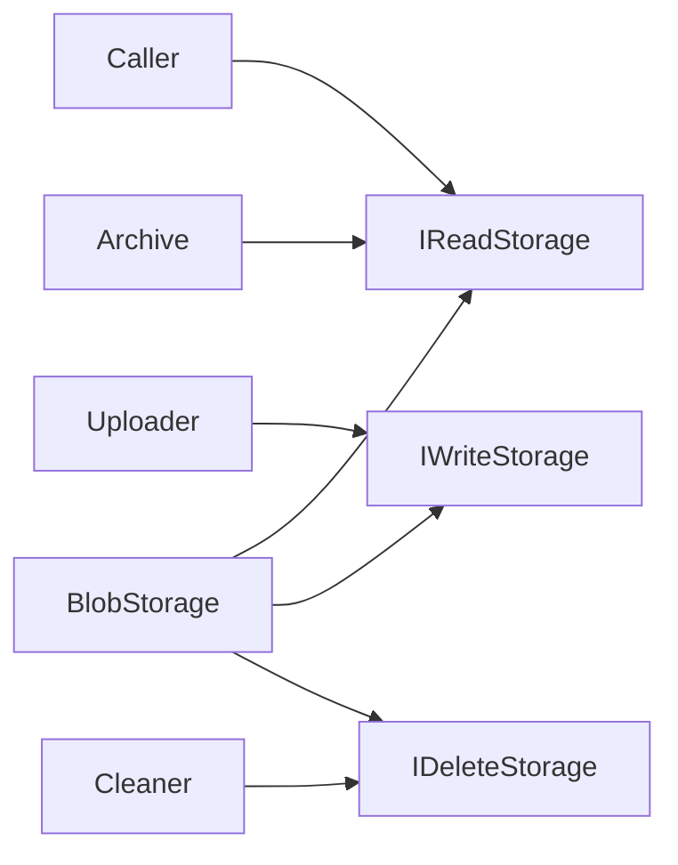
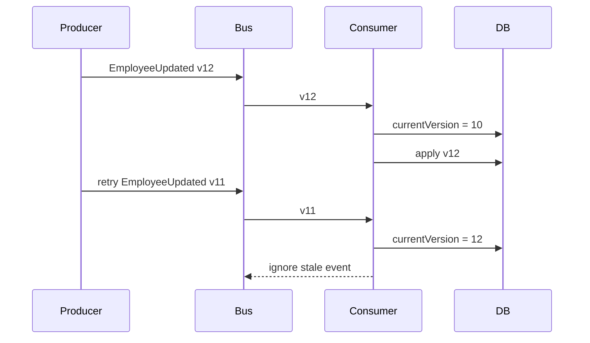
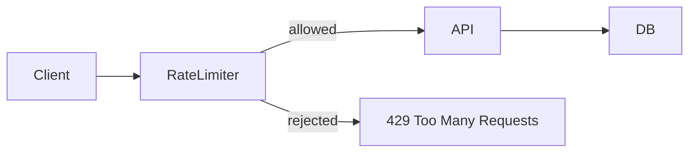
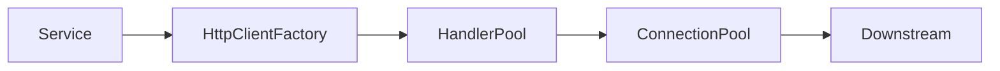
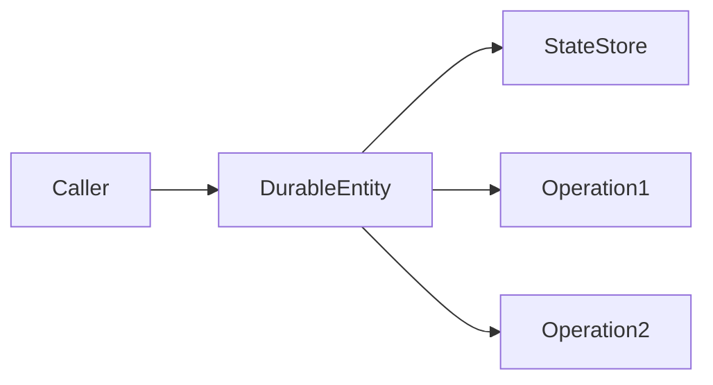
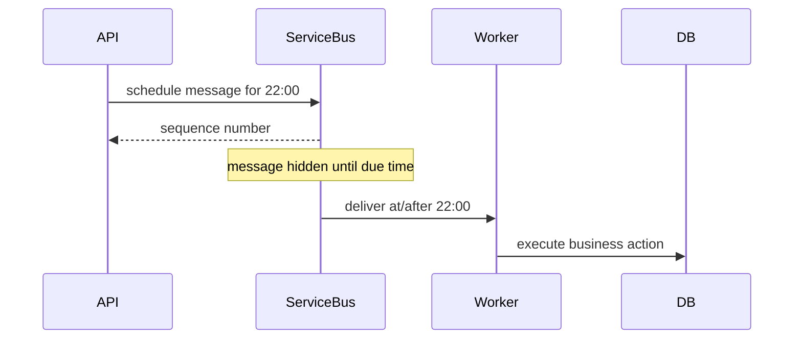
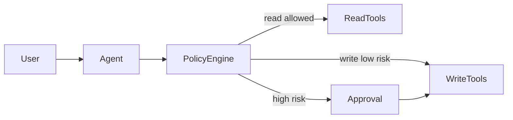
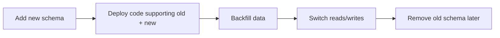

# Daily Knowledge Sharing — 17/08/2026

## Today’s Topics

1. SOLID — Liskov Substitution Principle trong service và inheritance thực tế
2. Event-Driven Architecture — Out-of-Order Event Handling bằng version và monotonic state
3. ASP.NET Core Rate Limiting — fixed window, token bucket và partition theo client
4. PostgreSQL Autovacuum Tuning — ngăn table bloat và transaction ID risk trong production
5. HTTP Connection Reuse — `HttpClientFactory`, DNS refresh và tránh socket exhaustion
6. Azure Functions Durable Entity — stateful coordination nhỏ nhưng bền vững trong serverless
7. Azure Service Bus Scheduled Delivery — delay processing mà không dùng `Task.Delay` hay cron polling
8. Observability — High-Cardinality Log/Metric Control để giữ telemetry hữu dụng và kiểm soát chi phí
9. AI Agent Permission Model — least privilege, scoped tools và approval trước side effect
10. Deployment Strategy — Database Backward Compatibility trước khi rolling deploy

---

# 1. SOLID — Liskov Substitution Principle trong service và inheritance thực tế

### 1. What is it?

Liskov Substitution Principle (LSP) nói đơn giản rằng: nếu `B` là subtype của `A`, code đang dùng `A` phải có thể dùng `B` mà không làm sai contract kỳ vọng.

Điểm quan trọng không phải là “class con compile được”, mà là **behavior phải tương thích**. Nếu base type hứa một operation luôn có thể thực hiện nhưng subtype lại ném `NotSupportedException`, subtype đó thường đã phá LSP.

Ví dụ nguy hiểm:

```csharp
public abstract class StorageProvider
{
    public abstract Task UploadAsync(Stream stream, CancellationToken ct);
    public abstract Task DeleteAsync(string path, CancellationToken ct);
}

public sealed class ReadOnlyArchiveStorage : StorageProvider
{
    public override Task UploadAsync(Stream stream, CancellationToken ct)
        => throw new NotSupportedException();

    public override Task DeleteAsync(string path, CancellationToken ct)
        => throw new NotSupportedException();
}
```

`ReadOnlyArchiveStorage` “đúng kiểu” nhưng không đúng contract.

### 2. Why does it exist?

Inheritance rất dễ tạo coupling ngầm. Developer nhìn type hierarchy và tưởng mọi subtype đều dùng được giống nhau, nhưng behavior thực tế khác.

Không có LSP, caller sẽ phải viết:

```csharp
if (provider is ReadOnlyArchiveStorage)
{
    // special case
}
```

Khi special case lan rộng, abstraction mất ý nghĩa.

### 3. How does it work?

LSP thường được kiểm tra bằng ba nhóm contract:

- **Precondition**: subtype không được yêu cầu điều kiện đầu vào khắt khe hơn base type.
- **Postcondition**: subtype không được trả kết quả yếu hơn điều base type cam kết.
- **Invariant**: subtype không được phá invariant mà caller dựa vào.

Thiết kế tốt hơn là tách capability:



### 4. Practical example

```csharp
public interface IReadStorage
{
    Task<Stream> OpenReadAsync(string path, CancellationToken ct);
}

public interface IWriteStorage
{
    Task UploadAsync(string path, Stream stream, CancellationToken ct);
}

public sealed class BlobStorageClient : IReadStorage, IWriteStorage
{
    // implementation
}

public sealed class ArchiveStorageClient : IReadStorage
{
    // read only by design
}
```

Caller phụ thuộc capability thực sự cần thay vì base class quá rộng.

### 5. Real production scenario

Một hệ thống file processing có Blob Storage, SFTP và immutable archive. Nếu tất cả implement cùng một `IFileStorage` gồm upload/delete/move/list, archive provider thường phải “fake” hoặc throw cho operation không hỗ trợ.

Khi production workflow gọi generic cleanup job trên mọi provider, một subtype bất ngờ throw có thể làm cả batch fail.

### 6. Common mistakes

- Dùng inheritance chỉ để reuse code.
- Base interface quá lớn, bắt implementation support operation không hợp nghĩa.
- Return `null` hoặc throw exception cho behavior mà caller nghĩ luôn tồn tại.
- Viết hàng loạt `if (x is SomeSubtype)` quanh abstraction.

### 7. Trade-offs

**Advantages**

- Contract rõ và đáng tin cậy hơn.
- Giảm runtime surprise.
- Tăng khả năng test và thay thế implementation.

**Costs / Risks**

- Có thể cần nhiều interface nhỏ hơn.
- Composition nhiều hơn inheritance.
- API public phải thiết kế kỹ hơn ngay từ đầu.

### 8. Junior → Middle → Senior understanding

**Junior**: hiểu subtype không chỉ cần compile mà còn phải giữ behavior contract.

**Middle**: biết nhận ra interface/base class đang ép implementation làm việc không hợp nghĩa và biết tách capability.

**Senior / Technical Lead**: đánh giá contract ở mức semantic, không lạm dụng inheritance, thiết kế public abstraction theo capability và failure behavior.

### 9. Key takeaway

- LSP là về **behavioral compatibility**, không chỉ type compatibility.
- Nếu subtype thường xuyên throw `NotSupportedException`, abstraction có thể đang sai.
- Prefer capability-based interfaces khi domain có behavior không đồng nhất.

---

# 2. Event-Driven Architecture — Out-of-Order Event Handling bằng version và monotonic state

### 1. What is it?

Trong hệ thống event-driven, event không phải lúc nào cũng đến đúng thứ tự. Event `EmployeeUpdated v12` có thể đến trước `EmployeeUpdated v11` vì retry, partition, network hoặc consumer restart.

Out-of-order handling là cách consumer bảo vệ state khỏi việc một event cũ ghi đè event mới.

### 2. Why does it exist?

Naive consumer thường làm:

```text
Receive event
→ UPDATE row
→ commit
```

Nếu event cũ đến sau, state bị “quay ngược thời gian”. Đây là lỗi rất khó phát hiện vì hệ thống vẫn chạy bình thường nhưng dữ liệu sai.

### 3. How does it work?

Một kỹ thuật phổ biến là gắn version tăng đơn điệu theo aggregate/business key.



Consumer chỉ apply event khi `event.Version > currentVersion`.

### 4. Practical example

```csharp
var state = await db.EmployeeProjections
    .SingleOrDefaultAsync(x => x.EmployeeId == message.EmployeeId, ct);

if (state is not null && message.Version <= state.Version)
    return;

if (state is null)
{
    db.EmployeeProjections.Add(new EmployeeProjection
    {
        EmployeeId = message.EmployeeId,
        Name = message.Name,
        Version = message.Version
    });
}
else
{
    state.Name = message.Name;
    state.Version = message.Version;
}

await db.SaveChangesAsync(ct);
```

### 5. Real production scenario

Một hệ thống sync employee sang search index hoặc cache nhận event update từ HR service. Retry ở message broker khiến version 101 đến sau version 102.

Nếu không check version, tên/phòng ban cũ có thể overwrite dữ liệu mới trong projection.

### 6. Common mistakes

- Giả định queue “có ordering” nghĩa là toàn hệ thống luôn ordered.
- Không gắn version theo business entity.
- Dùng timestamp từ nhiều máy để so thứ tự dù clock skew.
- Check version nhưng update không atomic.

### 7. Trade-offs

**Advantages**

- Bảo vệ projection khỏi stale event.
- Dễ reason hơn timestamp.
- Hữu ích cho replay và recovery.

**Costs / Risks**

- Producer phải quản lý version đáng tin cậy.
- Một số domain event độc lập không nên bị drop chỉ vì version thấp.
- Consumer cần state để so sánh.

### 8. Junior → Middle → Senior understanding

**Junior**: hiểu message có thể trùng hoặc sai thứ tự.

**Middle**: biết dùng sequence/version và atomic compare-update.

**Senior / Technical Lead**: phân biệt command ordering, event ordering, per-key ordering và chọn semantics phù hợp thay vì yêu cầu global order quá đắt.

### 9. Key takeaway

- Event-driven không đồng nghĩa event luôn đến đúng thứ tự.
- Version per aggregate là cách thực dụng để chặn stale update.
- Ordering guarantee phải được thiết kế theo business key.

---

# 3. ASP.NET Core Rate Limiting — fixed window, token bucket và partition theo client

### 1. What is it?

Rate limiting giới hạn số request mà một client, user, API key hoặc tenant được phép gửi trong một khoảng thời gian.

Mục tiêu không chỉ là security; nó còn bảo vệ capacity, downstream dependency và fairness giữa tenant.

### 2. Why does it exist?

Không rate limit, một client lỗi loop có thể bắn hàng nghìn request/giây và làm cạn:

- thread/connection pool;
- database connection;
- quota của Microsoft Graph/OpenAI/third-party API;
- compute budget của toàn hệ thống.

### 3. How does it work?

Một số thuật toán phổ biến:

- **Fixed Window**: N request mỗi cửa sổ thời gian.
- **Sliding Window**: mượt hơn fixed window ở boundary.
- **Token Bucket**: cho phép burst có kiểm soát.
- **Concurrency Limiter**: giới hạn số request đang chạy đồng thời.



### 4. Practical example

```csharp
builder.Services.AddRateLimiter(options =>
{
    options.AddPolicy("per-user", context =>
    {
        var userId = context.User.FindFirst("sub")?.Value
                     ?? context.Connection.RemoteIpAddress?.ToString()
                     ?? "anonymous";

        return RateLimitPartition.GetTokenBucketLimiter(
            userId,
            _ => new TokenBucketRateLimiterOptions
            {
                TokenLimit = 100,
                TokensPerPeriod = 50,
                ReplenishmentPeriod = TimeSpan.FromSeconds(10),
                QueueLimit = 0,
                AutoReplenishment = true
            });
    });
});
```

### 5. Real production scenario

Một SaaS timesheet có API export report rất nặng. Nếu một tenant spam export, database CPU tăng và tenant khác bị chậm.

Partition rate limiter theo tenant ID giúp giữ fairness tốt hơn limiter global.

### 6. Common mistakes

- Limit theo IP duy nhất trong hệ thống phía sau proxy/NAT.
- Trả 429 nhưng không cung cấp retry guidance.
- Rate-limit mọi endpoint giống nhau.
- Chỉ limit ingress nhưng bỏ qua downstream quota.
- Dùng distributed rate limit nhưng storage của limiter lại thành bottleneck.

### 7. Trade-offs

**Advantages**

- Bảo vệ capacity.
- Fairness giữa client/tenant.
- Giảm blast radius khi client lỗi.

**Costs / Risks**

- Có thể reject legitimate burst.
- Distributed limit tăng complexity.
- Cần quan sát 429 rate và tune threshold.

### 8. Junior → Middle → Senior understanding

**Junior**: hiểu 429 và rate limit khác timeout.

**Middle**: biết chọn policy, partition key và trả response phù hợp.

**Senior / Technical Lead**: thiết kế limiter theo capacity model, tenant tier, downstream quota và fail-open/fail-closed semantics.

### 9. Key takeaway

- Rate limiting là capacity control, không chỉ chống abuse.
- Partition key quan trọng ngang thuật toán.
- Token bucket phù hợp khi muốn cho burst nhưng vẫn kiểm soát tốc độ dài hạn.

---

# 4. PostgreSQL Autovacuum Tuning — ngăn table bloat và transaction ID risk trong production

### 1. What is it?

PostgreSQL dùng MVCC, nên `UPDATE`/`DELETE` không luôn xóa row vật lý ngay. Row cũ trở thành dead tuple và được VACUUM thu dọn.

Autovacuum là cơ chế background tự động vacuum/analyze table.

### 2. Why does it exist?

Nếu dead tuple tích tụ:

- table/index phình lớn;
- query phải đọc nhiều page hơn;
- cache hit giảm;
- vacuum sau đó nặng hơn;
- transaction ID wraparound có thể trở thành rủi ro nghiêm trọng.

### 3. How does it work?

Autovacuum quyết định chạy dựa trên threshold như số dead tuple tương đối với kích thước table.

```text
UPDATE/DELETE
→ dead tuples tăng
→ autovacuum threshold đạt
→ vacuum worker chạy
→ reclaim visibility + update statistics
```

Một bảng rất lớn nhưng chỉ có một vùng hot nhỏ có thể cần threshold nhỏ hơn default.

### 4. Practical example

Kiểm tra dead tuple:

```sql
SELECT
    relname,
    n_live_tup,
    n_dead_tup,
    last_autovacuum,
    autovacuum_count
FROM pg_stat_user_tables
ORDER BY n_dead_tup DESC;
```

Tune theo table:

```sql
ALTER TABLE job_events SET (
    autovacuum_vacuum_scale_factor = 0.02,
    autovacuum_analyze_scale_factor = 0.01
);
```

### 5. Real production scenario

Bảng `JobExecution` có 50 triệu row, nhưng mỗi phút hàng nghìn row trạng thái `Running → Completed`. Nếu threshold dựa trên 20% toàn table, autovacuum chạy quá muộn.

Kết quả là table bloat tăng đều dù lượng dữ liệu business không tăng nhiều.

### 6. Common mistakes

- Tắt autovacuum vì thấy nó dùng CPU/IO.
- Chỉ nhìn database size mà không xem dead tuple.
- Dùng `VACUUM FULL` như routine fix dù nó lock mạnh.
- Không theo dõi long-running transaction vì chúng ngăn reclaim tuple.

### 7. Trade-offs

**Advantages**

- Giữ query performance ổn định.
- Tránh bloat dài hạn.
- Bảo vệ transaction ID lifecycle.

**Costs / Risks**

- Vacuum dùng IO/CPU.
- Tune quá aggressive có thể cạnh tranh workload chính.
- Cần workload-specific tuning.

### 8. Junior → Middle → Senior understanding

**Junior**: hiểu UPDATE/DELETE không đồng nghĩa row cũ biến mất ngay.

**Middle**: biết dùng `pg_stat_user_tables`, tìm dead tuple và long transaction.

**Senior / Technical Lead**: tune theo hot table, storage/IO budget, autovacuum workers, freeze age và maintenance window.

### 9. Key takeaway

- Autovacuum là core maintenance của PostgreSQL, không phải optional cleanup.
- Bảng lớn/hot thường cần setting riêng.
- Khi performance giảm dần theo thời gian, hãy nghĩ đến bloat và long transaction.

---

# 5. HTTP Connection Reuse — `HttpClientFactory`, DNS refresh và tránh socket exhaustion

### 1. What is it?

HTTP connection reuse cho phép nhiều request dùng lại TCP/TLS connection thay vì mở connection mới mỗi lần.

Trong .NET, `IHttpClientFactory` giúp quản lý `HttpMessageHandler` lifecycle để vừa reuse connection vừa refresh DNS hợp lý.

### 2. Why does it exist?

Tạo `new HttpClient()` liên tục và dispose ngay có thể dẫn đến rất nhiều socket ở `TIME_WAIT`.

Ngược lại, giữ một `HttpClient` với handler sống mãi có thể giữ DNS cũ quá lâu trong môi trường IP thay đổi.

### 3. How does it work?



`HttpClient` object có thể ngắn hạn; handler/connection được pool và reuse phía dưới.

### 4. Practical example

```csharp
builder.Services.AddHttpClient<GraphClientAdapter>(client =>
{
    client.BaseAddress = new Uri("https://graph.microsoft.com/");
    client.Timeout = TimeSpan.FromSeconds(15);
})
.ConfigurePrimaryHttpMessageHandler(() => new SocketsHttpHandler
{
    PooledConnectionLifetime = TimeSpan.FromMinutes(5),
    MaxConnectionsPerServer = 100
});
```

### 5. Real production scenario

Một background worker đồng bộ hàng chục nghìn mailbox với Microsoft Graph. Nếu mỗi item tạo `HttpClient` mới, outbound socket churn tăng mạnh. Nếu connection pool quá nhỏ, throughput giảm vì request xếp hàng.

### 6. Common mistakes

- `using var httpClient = new HttpClient()` cho mọi request.
- Set timeout quá lớn khiến connection bị giữ lâu.
- Không đặt `MaxConnectionsPerServer` phù hợp workload.
- Retry mà không reuse connection.
- Không propagate cancellation token.

### 7. Trade-offs

**Advantages**

- Giảm TCP/TLS handshake.
- Tránh socket exhaustion.
- Tăng throughput outbound.

**Costs / Risks**

- Pool sizing sai có thể tạo queue hoặc quá tải downstream.
- Reuse lâu quá có thể giữ endpoint cũ.
- Cần quan sát DNS, timeout, connection errors.

### 8. Junior → Middle → Senior understanding

**Junior**: không tạo/dispose `HttpClient` bừa bãi.

**Middle**: biết `IHttpClientFactory`, timeout và cancellation.

**Senior / Technical Lead**: quản lý connection pool theo concurrency, SNAT limits, DNS change, retry policy và downstream capacity.

### 9. Key takeaway

- HTTP performance phụ thuộc connection lifecycle nhiều hơn nhiều developer tưởng.
- `IHttpClientFactory` giải quyết cả reuse lẫn handler rotation.
- Pool size phải dựa trên concurrency thực tế.

---

# 6. Azure Functions Durable Entity — stateful coordination nhỏ nhưng bền vững trong serverless

### 1. What is it?

Durable Entity là primitive trong Durable Functions để lưu và cập nhật một state nhỏ, có identity, thông qua các operation tuần tự.

Nó phù hợp cho counter, lock logic cấp application, throttle state, device state hoặc trạng thái coordination nhỏ.

### 2. Why does it exist?

Function truyền thống stateless. Nếu workflow cần state bền vững giữa nhiều invocation, developer thường phải tự viết database + concurrency handling.

Durable Entity cung cấp abstraction stateful có persistence và serialization theo key.

### 3. How does it work?



Các signal đến cùng entity key được xử lý theo thứ tự logic, giảm race condition trên state của entity đó.

### 4. Practical example

```csharp
[FunctionName("Counter")]
public static void Counter([EntityTrigger] IDurableEntityContext ctx)
{
    var current = ctx.GetState<int>();

    switch (ctx.OperationName)
    {
        case "add":
            current += ctx.GetInput<int>();
            ctx.SetState(current);
            break;
        case "get":
            ctx.Return(current);
            break;
    }
}
```

### 5. Real production scenario

Một hệ thống file import muốn giới hạn số file đang xử lý đồng thời theo tenant. Durable Entity theo `tenantId` có thể giữ counter hiện tại và coordination state mà không cần thêm service DB chuyên biệt.

### 6. Common mistakes

- Dùng entity cho state lớn hoặc query-heavy.
- Xem entity như relational database.
- Đưa external HTTP call dài vào operation.
- Tạo một hot entity global cho toàn hệ thống, gây serialization bottleneck.

### 7. Trade-offs

**Advantages**

- Stateful coordination đơn giản.
- Persistence/replay được platform hỗ trợ.
- Code ít hơn tự xây locking table.

**Costs / Risks**

- Throughput bị giới hạn theo hot key.
- Debug/replay model cần hiểu kỹ.
- Không phù hợp analytics/query linh hoạt.

### 8. Junior → Middle → Senior understanding

**Junior**: hiểu Function mặc định stateless và Durable Entity giữ state nhỏ theo key.

**Middle**: biết signal/call operation, state lifecycle và idempotency.

**Senior / Technical Lead**: quyết định khi nào dùng Durable Entity, Cosmos/SQL/Redis; phát hiện hot key và thiết kế partition phù hợp.

### 9. Key takeaway

- Durable Entity phù hợp state nhỏ + coordination, không phải database thay thế.
- Entity key quyết định concurrency boundary.
- Tránh global hot entity.

---

# 7. Azure Service Bus Scheduled Delivery — delay processing mà không dùng `Task.Delay` hay cron polling

### 1. What is it?

Scheduled Delivery cho phép gửi message vào Azure Service Bus nhưng yêu cầu broker chỉ làm message khả dụng sau một thời điểm cụ thể.

### 2. Why does it exist?

Naive design thường dùng:

```csharp
await Task.Delay(TimeSpan.FromHours(4));
```

trong worker, hoặc polling database mỗi phút để tìm job đến hạn.

Cả hai đều tốn resource và khó scale/recover.

### 3. How does it work?



Broker giữ scheduling metadata và deliver khi đến thời gian.

### 4. Practical example

```csharp
var message = new ServiceBusMessage(BinaryData.FromObjectAsJson(payload))
{
    MessageId = payload.CommandId
};

var scheduledTime = DateTimeOffset.UtcNow.AddMinutes(30);
await sender.ScheduleMessageAsync(message, scheduledTime, ct);
```

### 5. Real production scenario

Employee offboarding được cấu hình `EndTime`. Thay vì job scan toàn bộ bảng liên tục, application có thể schedule command “reset forwarding” gần thời điểm hết hạn.

Vẫn nên có reconciliation job định kỳ để tự chữa nếu message mất hoặc business rule thay đổi.

### 6. Common mistakes

- Xem scheduled message như exact-time scheduler tuyệt đối.
- Không có idempotency khi worker xử lý.
- Không lưu sequence number nếu cần cancel schedule.
- Schedule hàng triệu message rất xa trong tương lai mà không đánh giá operational model.

### 7. Trade-offs

**Advantages**

- Không giữ worker sống chỉ để chờ.
- Không cần polling tần suất cao.
- Scale tự nhiên theo queue.

**Costs / Risks**

- Delivery không phải hard real-time.
- Cần idempotency và reconciliation.
- Thay đổi lịch sau khi schedule cần quản lý cancel/reschedule.

### 8. Junior → Middle → Senior understanding

**Junior**: hiểu broker có thể trì hoãn visibility của message.

**Middle**: biết schedule/cancel và idempotent consumer.

**Senior / Technical Lead**: chọn giữa scheduled message, recurring scheduler, Durable Functions và database polling dựa trên SLA, volume và recovery strategy.

### 9. Key takeaway

- Đừng dùng thread sleep/`Task.Delay` cho delay dài trong distributed worker.
- Scheduled Delivery phù hợp delayed command.
- Luôn thiết kế recovery/reconciliation cho workflow quan trọng.

---

# 8. Observability — High-Cardinality Log/Metric Control để giữ telemetry hữu dụng và kiểm soát chi phí

### 1. What is it?

Cardinality là số lượng giá trị khác nhau của một dimension/tag.

Ví dụ `status_code` cardinality thấp; `user_id`, `request_id`, `email`, `trace_id` cardinality rất cao.

High cardinality không phải luôn xấu trong logs/traces, nhưng cực kỳ nguy hiểm với metrics vì mỗi combination có thể tạo time series mới.

### 2. Why does it exist?

Nếu metric gắn tag `user_id` cho 1 triệu user, backend metrics có thể phải giữ 1 triệu series cho chỉ một metric.

Hậu quả:

- chi phí tăng mạnh;
- query chậm;
- ingestion throttling;
- dashboard khó dùng.

### 3. How does it work?

Một thiết kế telemetry tốt thường phân lớp:

```text
Metrics: low-cardinality aggregation
Logs: searchable structured detail
Traces: request-level correlation
```

Ví dụ:

- metric: `api_requests_total{route,status}`
- log: `{tenantId,userId,requestId,errorCode}`
- trace: `traceId/spanId`

### 4. Practical example

Không nên:

```csharp
meter.CreateCounter<long>("requests")
     .Add(1, new("user.id", userId));
```

Tốt hơn:

```csharp
requestCounter.Add(1,
    new KeyValuePair<string, object?>("route", route),
    new KeyValuePair<string, object?>("status", statusCode));
```

Chi tiết user để trong structured log khi cần.

### 5. Real production scenario

Một API multi-tenant thêm `tenant_id` và `employee_id` vào mọi metric. Sau vài tuần, Azure Monitor/Prometheus chi phí tăng mạnh và dashboard timeout.

Giải pháp là giữ tenant-level metric chỉ cho một số tenant tier quan trọng hoặc dùng logs để drill-down.

### 6. Common mistakes

- Tag metric bằng request ID, email, URL raw, SQL text.
- Dùng raw exception message làm metric dimension.
- Không chuẩn hóa route (`/users/123` thay vì `/users/{id}`).
- Log mọi thứ ở Information không có retention strategy.

### 7. Trade-offs

**Advantages**

- Telemetry rẻ và query nhanh hơn.
- Dashboard ổn định.
- Alert đáng tin cậy hơn.

**Costs / Risks**

- Mất drill-down nếu aggregate quá mạnh.
- Cần thiết kế logs/traces bổ sung.
- Có thể khó debug nếu sampling quá tay.

### 8. Junior → Middle → Senior understanding

**Junior**: biết tag/dimension khác message text.

**Middle**: phân biệt dữ liệu nào nên vào metric, log hay trace.

**Senior / Technical Lead**: thiết kế telemetry schema theo cardinality budget, retention, sampling và incident workflow.

### 9. Key takeaway

- Metrics nên low-cardinality.
- Request/user-level detail phù hợp logs/traces hơn.
- Observability tốt phải cân bằng khả năng điều tra và cost.

---

# 9. AI Agent Permission Model — least privilege, scoped tools và approval trước side effect

### 1. What is it?

AI Agent Permission Model là cách giới hạn model được phép dùng tool nào, với dữ liệu nào, trong phạm vi nào và hành động nào cần human approval.

Model không nên có quyền ngang với application owner chỉ vì nó có khả năng “reason”.

### 2. Why does it exist?

LLM có thể:

- hiểu sai intent;
- bị prompt injection;
- chọn tool sai;
- tạo argument nguy hiểm;
- lặp hành động do retry.

Nếu tool có quyền quá rộng, lỗi reasoning trở thành side effect thật.

### 3. How does it work?

Thiết kế nên tách:



Policy layer deterministic quyết định quyền; model chỉ đề xuất hành động.

### 4. Practical example

```csharp
public async Task<ToolResult> ExecuteAsync(ToolCall call, UserContext user, CancellationToken ct)
{
    var decision = _policy.Evaluate(user, call.ToolName, call.Arguments);

    if (decision == PermissionDecision.Deny)
        return ToolResult.Denied();

    if (decision == PermissionDecision.RequireApproval)
        return ToolResult.PendingApproval(call);

    return await _toolRegistry.ExecuteAsync(call, ct);
}
```

### 5. Real production scenario

Một AI assistant cho IT support được phép đọc employee profile, tạo draft email và đề xuất disable account.

Nhưng `DisableUser`, `ResetMfa`, `DeleteMailbox` phải cần approval và authorization theo user thật đang đăng nhập.

### 6. Common mistakes

- Một API key cấp cho agent toàn quyền production.
- Tool schema expose operation nguy hiểm không cần thiết.
- Tin model tự quyết định “hành động này an toàn”.
- Không audit tool call.
- Retry tool mutation mà không idempotency.

### 7. Trade-offs

**Advantages**

- Giảm blast radius.
- Dễ audit và compliance.
- Cho phép agent tự động hóa an toàn hơn.

**Costs / Risks**

- Workflow có thêm approval friction.
- Policy engine tăng implementation complexity.
- Quyền quá chặt có thể làm agent kém hữu ích.

### 8. Junior → Middle → Senior understanding

**Junior**: model không được coi là trusted principal.

**Middle**: biết tách read/write tool, validate arguments và audit execution.

**Senior / Technical Lead**: thiết kế permission boundary, approval matrix, credential isolation, tenant isolation và recovery cho side effect.

### 9. Key takeaway

- AI quyết định **đề xuất**, deterministic code quyết định **quyền thực thi**.
- Least privilege áp dụng cho agent giống service account.
- High-risk side effect cần approval và audit trail.

---

# 10. Deployment Strategy — Database Backward Compatibility trước khi rolling deploy

### 1. What is it?

Database backward compatibility nghĩa là schema/database contract phải cho phép **version cũ và version mới của application cùng chạy trong một khoảng thời gian**.

Điều này rất quan trọng với rolling deployment, blue-green và canary vì hai version thường coexist.

### 2. Why does it exist?

Migration kiểu “rename column rồi deploy code mới” có thể phá instance cũ ngay lập tức.

Ví dụ:

```sql
EXEC sp_rename 'Employee.Name', 'FullName', 'COLUMN';
```

Trong vài phút rollout, instance cũ vẫn query `Name` và fail.

### 3. How does it work?

Dùng expand-contract:



### 4. Practical example

Phase 1:

```sql
ALTER TABLE Employee ADD FullName nvarchar(200) NULL;
```

Phase 2 application ghi cả hai field hoặc dùng compatibility layer.

Phase 3 backfill:

```sql
UPDATE Employee
SET FullName = Name
WHERE FullName IS NULL;
```

Phase 4 sau khi mọi version cũ biến mất mới drop `Name`.

### 5. Real production scenario

Một SaaS deploy 10 instance ASP.NET Core theo rolling update. Mỗi instance mất vài phút để drain connection và restart.

Nếu migration destructive chạy trước, request đang vào instance cũ có thể lỗi ngay trong rollout dù code mới hoàn toàn đúng.

### 6. Common mistakes

- Rename/drop column cùng release với code change.
- Migration lock table lớn trong giờ cao điểm.
- Assume deploy là atomic.
- Backfill hàng triệu row trong một transaction.
- Không kiểm tra background worker version cũ vẫn đang chạy.

### 7. Trade-offs

**Advantages**

- Rollout ít downtime.
- Rollback dễ hơn.
- Giảm deployment coupling.

**Costs / Risks**

- Schema tạm thời phức tạp hơn.
- Có giai đoạn dual-read/dual-write.
- Cần cleanup migration sau đó.

### 8. Junior → Middle → Senior understanding

**Junior**: hiểu production deploy không diễn ra tức thời trên mọi instance.

**Middle**: biết viết migration additive trước destructive change.

**Senior / Technical Lead**: thiết kế schema evolution theo rollout topology, rollback, background jobs, data backfill, lock duration và message compatibility.

### 9. Key takeaway

- Database migration phải tương thích với nhiều app version cùng lúc.
- Expand trước, contract sau.
- Rollback strategy cần được thiết kế trước khi deploy, không phải sau khi có sự cố.