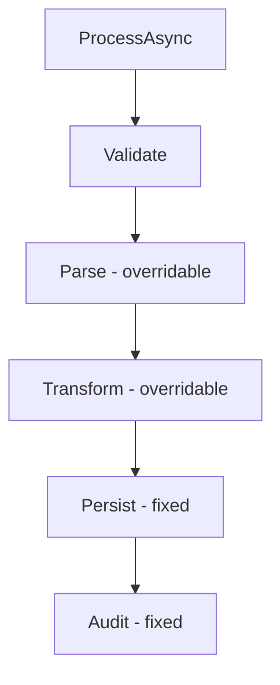
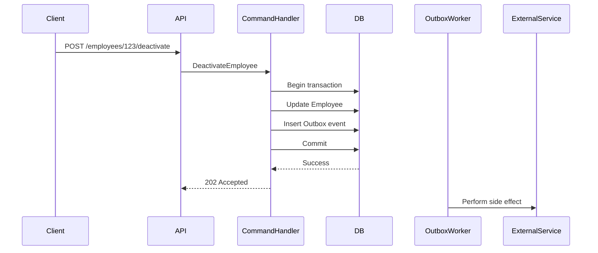
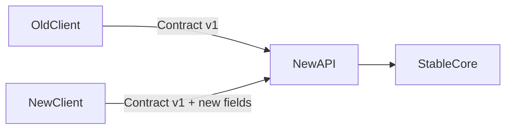
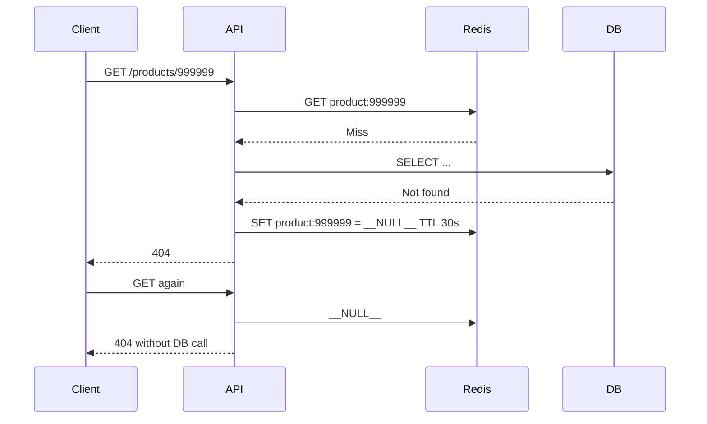
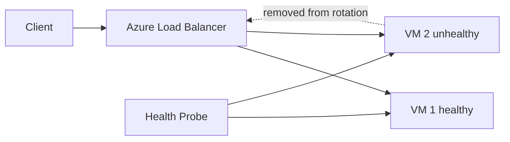
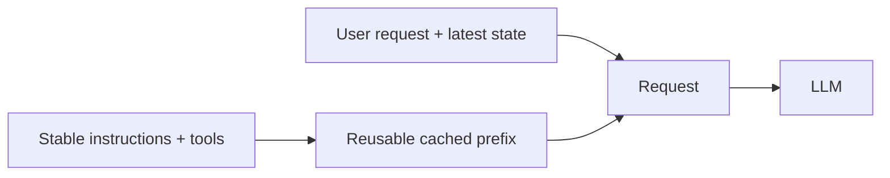
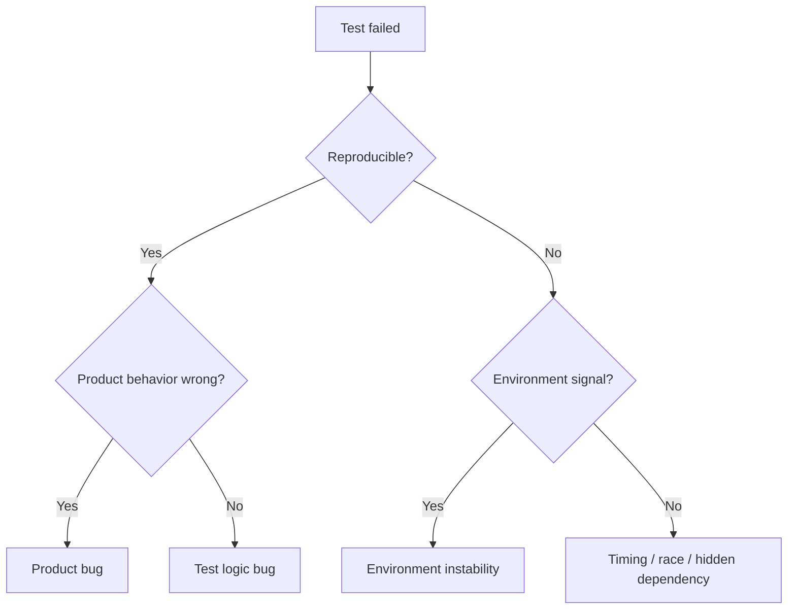

# Daily Knowledge Sharing — 17/08/2026

## Today’s Topics

1. Template Method Pattern — cố định workflow nhưng vẫn cho phép thay đổi từng bước có kiểm soát
2. CQRS Command Transaction Boundary — xác định đúng phạm vi transaction cho write-side
3. API Backward Compatibility — additive change, tolerant reader và cách tránh phá client cũ
4. SQL Server Statistics & Cardinality Estimation — vì sao optimizer chọn plan sai dù có index
5. Negative Caching — chặn cache penetration nhưng không biến “not found” thành dữ liệu stale dài hạn
6. Azure Load Balancer Health Probe — health, zone và failover cho workload TCP/HTTP nội bộ
7. Azure Blob Versioning + Soft Delete — bảo vệ file khỏi overwrite/delete nhầm trong production
8. SLI Histogram Buckets — đo latency distribution đúng để p95/p99 có ý nghĩa
9. AI Prompt Caching & Reusable Context — giảm token cost mà không làm context trở nên stale
10. End-to-End Test Flakiness — phân biệt product bug, test bug và environment instability

---

# 1. Template Method Pattern — cố định workflow nhưng vẫn cho phép thay đổi từng bước có kiểm soát

### 1. What is it?

Template Method là pattern định nghĩa **khung thuật toán cố định** trong một base abstraction, còn một số bước cụ thể được cho phép override ở subclass.

Junior có thể hiểu đơn giản: thay vì mỗi implementation tự viết lại toàn bộ workflow, ta giữ một quy trình chuẩn và chỉ cho phép thay đổi những điểm đã định trước.

Ví dụ một luồng import file có các bước ổn định:

1. Validate input.
2. Parse file.
3. Transform data.
4. Persist.
5. Emit audit/metrics.

CSV và Excel có thể khác bước parse, nhưng không nên tự ý bỏ qua validation hoặc audit.

### 2. Why does it exist?

Nếu mỗi loại processor tự cài toàn bộ workflow, hệ thống nhanh chóng gặp ba vấn đề:

- Logic chung bị copy-paste.
- Một implementation quên một bước quan trọng như audit hoặc transaction.
- Việc thay đổi cross-cutting behavior phải sửa nhiều nơi.

Naive solution thường là một `switch` rất lớn hoặc nhiều service có code giống nhau 80%.

Template Method giải quyết bằng cách tách **invariant workflow** khỏi **variation points**.

### 3. How does it work?



Base class kiểm soát thứ tự. Subclass chỉ thay đổi các hook được phép.

Điểm thiết kế quan trọng: càng nhiều step `virtual`, base class càng mất ý nghĩa. Variation point phải ít và có chủ đích.

### 4. Practical example

```csharp
public abstract class ImportProcessor<T>
{
    public async Task ProcessAsync(Stream input, CancellationToken ct)
    {
        Validate(input);
        var rows = await ParseAsync(input, ct);
        var entities = Transform(rows);
        await SaveAsync(entities, ct);
        await AuditAsync(entities.Count, ct);
    }

    protected virtual void Validate(Stream input)
    {
        if (!input.CanRead)
            throw new InvalidOperationException("Input stream is not readable.");
    }

    protected abstract Task<IReadOnlyList<T>> ParseAsync(
        Stream input,
        CancellationToken ct);

    protected virtual IReadOnlyList<T> Transform(IReadOnlyList<T> rows) => rows;

    protected abstract Task SaveAsync(
        IReadOnlyList<T> entities,
        CancellationToken ct);

    protected virtual Task AuditAsync(int count, CancellationToken ct)
        => Task.CompletedTask;
}
```

CSV processor chỉ cần định nghĩa `ParseAsync`, còn workflow tổng thể vẫn thống nhất.

### 5. Real production scenario

Một SaaS HR có nhiều loại import:

- Employee CSV.
- Leave balance Excel.
- Payroll integration export.

Mọi import đều bắt buộc validate, audit và ghi metrics. Nếu từng team tự triển khai pipeline riêng, chỉ cần một processor quên audit là việc điều tra incident sau đó rất khó.

Template Method phù hợp khi workflow ổn định nhưng có một vài bước biến thể.

### 6. Common mistakes

- Dùng inheritance chỉ để tái sử dụng code, không có quan hệ behavior rõ ràng.
- Base class có quá nhiều `protected virtual`, biến thành framework nội bộ khó hiểu.
- Subclass override step và phá invariant mà caller không biết.
- Nhét I/O, domain rule và orchestration vào cùng base class.
- Dùng Template Method khi Strategy hoặc composition đơn giản hơn.

### 7. Trade-offs

**Advantages**

- Workflow nhất quán.
- Giảm duplication.
- Bảo vệ các bước bắt buộc.
- Dễ centralize audit/telemetry.

**Costs / Risks**

- Coupling qua inheritance.
- Khó thay đổi runtime hơn Strategy.
- Base class dễ trở thành abstraction cứng nhắc.
- Override sâu nhiều tầng gây khó debug.

### 8. Junior → Middle → Senior understanding

**Junior**

Hiểu rằng base class giữ workflow, subclass thay đổi một số bước.

**Middle**

Biết phân biệt Template Method với Strategy; biết giới hạn variation point và viết test cho workflow invariant.

**Senior / Technical Lead**

Phải quyết định khi nào inheritance thực sự phù hợp, tránh framework nội bộ phức tạp, và cân nhắc chuyển sang composition nếu requirement biến động nhiều.

### 9. Key takeaway

- Template Method tốt khi **workflow ổn định, bước con thay đổi**.
- Đừng mở mọi step cho override.
- Nếu cần thay đổi behavior động ở runtime, Strategy thường phù hợp hơn.

---

# 2. CQRS Command Transaction Boundary — xác định đúng phạm vi transaction cho write-side

### 1. What is it?

Trong CQRS, Command đại diện cho ý định thay đổi trạng thái: `ApproveLeave`, `SubmitTimesheet`, `DeactivateEmployee`.

Transaction boundary là phạm vi dữ liệu cần được commit nguyên tử cho một command.

Điểm quan trọng: một command không đồng nghĩa với “một transaction bao trùm tất cả downstream service”. Transaction nên bảo vệ **business invariant trong data store mà service sở hữu**.

### 2. Why does it exist?

Một lỗi phổ biến là handler vừa update database, vừa gọi external API, gửi message, gửi email trong cùng một luồng và tưởng đó là một transaction duy nhất.

Ví dụ:

1. Update employee = inactive.
2. Call Microsoft Graph.
3. Send email.
4. Publish event.

Nếu bước 3 fail sau khi DB commit thì sao? Nếu giữ transaction DB mở trong lúc gọi Graph thì lock kéo dài, connection bị chiếm và retry trở nên nguy hiểm.

### 3. How does it work?



Transaction chứa:

- Aggregate state change.
- Những record bắt buộc để đảm bảo side effect có thể tiếp tục sau commit, ví dụ Outbox.

External call diễn ra ngoài transaction database.

### 4. Practical example

```csharp
public sealed class DeactivateEmployeeHandler(AppDbContext db)
{
    public async Task Handle(Guid employeeId, CancellationToken ct)
    {
        var employee = await db.Employees
            .SingleAsync(x => x.Id == employeeId, ct);

        employee.Deactivate();

        db.OutboxMessages.Add(new OutboxMessage
        {
            Id = Guid.NewGuid(),
            Type = "EmployeeDeactivated",
            Payload = JsonSerializer.Serialize(new { employee.Id }),
            CreatedUtc = DateTime.UtcNow
        });

        await db.SaveChangesAsync(ct);
    }
}
```

Nếu `SaveChangesAsync` chạy trong một transaction local, employee state và outbox record commit cùng nhau.

### 5. Real production scenario

Trong employee offboarding:

- Local HR database phải ghi nhân viên inactive và mail action cần thực hiện.
- Exchange Online có thể temporary unavailable.

Nếu gọi Exchange trước rồi DB fail, external state thay đổi nhưng business database chưa biết. Nếu DB trước rồi Exchange fail mà không có durable task/outbox, trạng thái external có thể không bao giờ được đồng bộ.

Transaction boundary đúng giúp local state đáng tin, còn side effect được retry độc lập.

### 6. Common mistakes

- Mở transaction DB rồi gọi HTTP/Graph bên trong.
- Cho rằng distributed transaction là mặc định cần thiết.
- Command handler commit nhiều lần mà không hiểu partial state.
- Publish event trước khi DB commit.
- Retry toàn command mà không có idempotency.
- Một command thao tác quá nhiều aggregate không liên quan.

### 7. Trade-offs

**Advantages**

- Invariant rõ ràng.
- Giảm lock duration.
- Side effect có thể retry.
- Phù hợp distributed system.

**Costs / Risks**

- Chấp nhận eventual consistency.
- Cần outbox/worker/monitoring.
- Debug flow phức tạp hơn synchronous transaction.

### 8. Junior → Middle → Senior understanding

**Junior**

Hiểu transaction bảo vệ một nhóm thay đổi database nguyên tử.

**Middle**

Biết không gọi external service trong transaction dài; biết dùng outbox hoặc durable job.

**Senior / Technical Lead**

Phải định nghĩa aggregate boundary, failure recovery, idempotency, retry semantics và SLA của eventual consistency.

### 9. Key takeaway

- Transaction boundary nên theo **business consistency boundary**, không theo toàn bộ request flow.
- External side effect thường nên tách khỏi DB transaction.
- Outbox biến “đã commit nhưng chưa publish” thành trạng thái có thể phục hồi.

---

# 3. API Backward Compatibility — additive change, tolerant reader và cách tránh phá client cũ

### 1. What is it?

Backward compatibility nghĩa là phiên bản server mới vẫn phục vụ được client cũ theo contract mà client đang kỳ vọng.

Một API có thể deploy thành công nhưng vẫn phá production nếu thay đổi schema, status code hoặc semantic behavior mà consumer chưa cập nhật.

### 2. Why does it exist?

Trong hệ thống thật, server và client hiếm khi deploy đồng thời:

- Mobile app cũ vẫn tồn tại nhiều tháng.
- Third-party integration cập nhật chậm.
- Một service downstream có lịch release khác.

Naive assumption “chúng ta đổi cả hai cùng lúc” chỉ đúng trong hệ thống rất nhỏ.

### 3. How does it work?

Các thay đổi thường được chia thành:

**Additive**

- Thêm optional field.
- Thêm endpoint mới.
- Thêm enum value nếu client tolerant.

**Breaking**

- Rename/remove field.
- Đổi type `string` → object.
- Đổi semantic của status code.
- Biến field optional thành required.



Tolerant reader nghĩa là client đọc những field mình cần và bỏ qua field lạ thay vì fail khi response có thêm dữ liệu.

### 4. Practical example

Response cũ:

```json
{
  "id": 10,
  "status": "Approved"
}
```

Thay đổi an toàn hơn:

```json
{
  "id": 10,
  "status": "Approved",
  "approvedAt": "2026-08-17T12:00:00Z"
}
```

Thay đổi nguy hiểm:

```json
{
  "id": 10,
  "status": {
    "code": "Approved",
    "displayName": "Approved"
  }
}
```

Nếu client cũ deserialize `status` thành `string`, request sẽ fail.

### 5. Real production scenario

Một mobile app timesheet có nhiều version ngoài store. Backend muốn đổi `officeId` thành `officeCode`.

Thay vì rename trực tiếp:

1. Server trả cả `officeId` và `officeCode` trong giai đoạn chuyển đổi.
2. Client mới chuyển sang `officeCode`.
3. Theo dõi adoption.
4. Chỉ remove field cũ ở major version hoặc sau migration window rõ ràng.

### 6. Common mistakes

- Cho rằng thêm enum value luôn non-breaking.
- Đổi 200 thành 204 làm client cũ parse body bị lỗi.
- Rename JSON property chỉ vì refactor C# property.
- Không contract-test consumer quan trọng.
- Reuse field cũ với semantic mới.
- Versioning URL nhưng vẫn thay đổi behavior bất ngờ trong cùng version.

### 7. Trade-offs

**Advantages**

- Giảm coordinated deployment.
- Rollout an toàn hơn.
- Third-party integration ổn định.

**Costs / Risks**

- Phải duy trì field cũ một thời gian.
- Schema có thể phình.
- Cần deprecation policy và telemetry adoption.

### 8. Junior → Middle → Senior understanding

**Junior**

Biết rename/remove field có thể phá client.

**Middle**

Biết thiết kế additive change, optional field, contract test và deprecation.

**Senior / Technical Lead**

Phải quản lý API lifecycle, consumer inventory, rollout window, compatibility matrix và migration strategy.

### 9. Key takeaway

- “Compile được” không đồng nghĩa “compatible”.
- Ưu tiên additive change.
- API contract gồm cả **schema và behavior**.

---

# 4. SQL Server Statistics & Cardinality Estimation — vì sao optimizer chọn plan sai dù có index

### 1. What is it?

Statistics là metadata SQL Server dùng để ước lượng phân bố dữ liệu trong column hoặc index.

Cardinality estimation là quá trình optimizer dự đoán số row sẽ đi qua từng operator trước khi query thực thi.

Optimizer không “biết” dữ liệu thật ở runtime. Nó quyết định plan dựa trên estimate.

### 2. Why does it exist?

SQL Server phải chọn giữa nhiều plan:

- Index seek hay table scan.
- Nested loops hay hash join.
- Join order nào trước.
- Memory grant bao nhiêu.

Nếu estimate sai 100 lần, plan tối ưu về lý thuyết có thể rất tệ ngoài production.

### 3. How does it work?

```text
Query
  ↓
Statistics / histogram
  ↓
Estimated row counts
  ↓
Cost model
  ↓
Execution plan
  ↓
Actual rows
```

Khi estimated rows và actual rows lệch lớn, cần nghi ngờ statistics, data skew, parameter sensitivity hoặc predicate khó estimate.

### 4. Practical example

```sql
SELECT Id, EmployeeId, Status
FROM TimesheetEntries
WHERE EmployeeId = @EmployeeId
  AND Status = 'Pending';
```

Nếu phần lớn employee có vài row `Pending` nhưng một employee đặc biệt có 500.000 row, một plan compile từ user nhỏ có thể dùng nested loops không phù hợp cho user lớn.

Kiểm tra:

```sql
SET STATISTICS IO ON;
SET STATISTICS TIME ON;
```

Và so `Estimated Number of Rows` với `Actual Number of Rows` trong actual execution plan.

### 5. Real production scenario

Sau batch import lớn, data distribution thay đổi mạnh nhưng statistics chưa cập nhật đủ. Query từng chạy 50 ms tăng lên vài giây.

Team chỉ nhìn index và kết luận “index đã có”. Vấn đề thật là optimizer tin rằng query trả 100 rows trong khi thực tế 2 triệu rows.

### 6. Common mistakes

- Chỉ thêm index mà không đọc estimate vs actual.
- Update statistics toàn database vô điều kiện mỗi giờ.
- Dùng `WITH RECOMPILE` khắp nơi để chữa symptom.
- Không xét data skew.
- Không quan sát memory grant và spill.
- Đánh đồng parameter sniffing với mọi plan regression.

### 7. Trade-offs

**Advantages**

- Statistics tốt giúp optimizer tự chọn plan hiệu quả.
- Không cần hand-tune từng query.

**Costs / Risks**

- Statistics update có CPU/I/O cost.
- Sampled stats đôi lúc không đủ cho skewed data.
- Estimate vẫn chỉ là mô hình, không phải sự thật.

### 8. Junior → Middle → Senior understanding

**Junior**

Biết SQL Server dùng statistics để ước lượng số row.

**Middle**

Biết đọc actual plan, estimated vs actual rows, spill và scan/seek.

**Senior / Technical Lead**

Hiểu workload skew, plan cache, stats maintenance, CE behavior và khi nào cần query/index/schema redesign thay vì hint.

### 9. Key takeaway

- Có index nhưng estimate sai vẫn có thể chọn plan tệ.
- Luôn so **estimated rows vs actual rows**.
- Tuning tốt bắt đầu từ evidence, không từ việc thêm index theo cảm giác.

---

# 5. Negative Caching — chặn cache penetration nhưng không biến “not found” thành dữ liệu stale dài hạn

### 1. What is it?

Negative caching là cache cả kết quả “không tồn tại” hoặc “không tìm thấy” trong thời gian ngắn.

Ví dụ request liên tục hỏi `product:999999` không tồn tại. Nếu mỗi request đều cache miss rồi xuống database, cache không bảo vệ database được.

### 2. Why does it exist?

Cache-aside cổ điển:

```text
Cache miss → DB → cache result
```

Nhưng nếu DB trả không có dữ liệu, ta thường không ghi gì vào cache. Mọi request tiếp theo lại đi DB.

Đây là cache penetration.

### 3. How does it work?



Negative entry phải có TTL ngắn hơn normal cache vì object có thể được tạo sau đó.

### 4. Practical example

```csharp
private const string NullMarker = "__NULL__";

public async Task<Product?> GetProductAsync(long id, CancellationToken ct)
{
    var key = $"product:{id}";
    var cached = await cache.GetStringAsync(key, ct);

    if (cached == NullMarker)
        return null;

    if (cached is not null)
        return JsonSerializer.Deserialize<Product>(cached);

    var product = await db.Products
        .AsNoTracking()
        .SingleOrDefaultAsync(x => x.Id == id, ct);

    if (product is null)
    {
        await cache.SetStringAsync(
            key,
            NullMarker,
            new DistributedCacheEntryOptions
            {
                AbsoluteExpirationRelativeToNow = TimeSpan.FromSeconds(30)
            },
            ct);

        return null;
    }

    return product;
}
```

### 5. Real production scenario

Bot hoặc client bug liên tục gọi ID không tồn tại. Redis hit ratio nhìn thấp và database QPS tăng mạnh dù dữ liệu thực không đổi.

Negative cache giúp hấp thụ traffic sai hoặc repeated lookup vào missing entity.

### 6. Common mistakes

- Negative TTL quá dài.
- Không invalidate khi entity vừa được tạo.
- Dùng cùng marker với dữ liệu hợp lệ.
- Cache lỗi 500 như “not found”.
- Không phân biệt unauthorized với not found.

### 7. Trade-offs

**Advantages**

- Giảm DB load cho repeated missing key.
- Chống cache penetration.
- Hữu ích với lookup endpoint hot.

**Costs / Risks**

- Newly created data có thể tạm thời bị 404.
- Cần invalidation.
- Cache thêm nhiều key rác nếu attacker scan ID lớn.

### 8. Junior → Middle → Senior understanding

**Junior**

Hiểu rằng “không có dữ liệu” cũng có thể cache ngắn hạn.

**Middle**

Biết TTL, marker và invalidation.

**Senior / Technical Lead**

Phải cân nhắc attack pattern, key cardinality, memory pressure, stale tolerance và authorization semantics.

### 9. Key takeaway

- Cache miss lặp lại cho missing key vẫn có thể phá database.
- Negative cache nên TTL ngắn.
- Không cache lỗi hệ thống như một business “not found”.

---

# 6. Azure Load Balancer Health Probe — health, zone và failover cho workload TCP/HTTP nội bộ

### 1. What is it?

Azure Load Balancer là Layer 4 load balancer phân phối TCP/UDP traffic đến backend pool.

Health Probe quyết định backend instance nào đủ khỏe để nhận traffic.

Đây không phải chỉ là “ping server”. Probe là phần trực tiếp ảnh hưởng availability.

### 2. Why does it exist?

Nếu load balancer tiếp tục gửi request vào VM chết hoặc process không phục vụ được, client sẽ gặp timeout dù cluster còn nhiều instance khỏe.

Naive health check như chỉ kiểm port mở cũng có thể sai: process vẫn listen nhưng database dependency hoặc internal state đã hỏng.

### 3. How does it work?



Probe có thể dùng TCP hoặc HTTP/HTTPS. Nếu probe fail đủ ngưỡng, backend bị loại khỏi rotation.

### 4. Practical example

Một ASP.NET Core app trên VM Scale Set expose:

```csharp
app.MapGet("/health/ready", async (AppDbContext db) =>
{
    var canConnect = await db.Database.CanConnectAsync();
    return canConnect ? Results.Ok() : Results.StatusCode(503);
});
```

Load Balancer HTTP probe gọi `/health/ready`.

Tuy nhiên phải cân nhắc: nếu database outage toàn region, mọi node cùng trả 503 và toàn backend bị loại. Khi đó readiness design phải phù hợp kiến trúc failover.

### 5. Real production scenario

VM vẫn chạy nhưng app pool bị deadlock hoặc service phụ thuộc local agent không hoạt động. TCP port có thể vẫn mở nhưng request thật thất bại.

Health endpoint tốt cần phản ánh khả năng phục vụ request, nhưng không nên phụ thuộc quá nhiều downstream khiến transient issue nhỏ loại toàn bộ fleet.

### 6. Common mistakes

- Probe endpoint yêu cầu authentication.
- Probe quá nặng, query DB phức tạp mỗi vài giây.
- Dùng liveness như readiness.
- Health endpoint luôn trả 200 dù app không sẵn sàng.
- Tất cả node phụ thuộc cùng một external service và đồng loạt fail probe.

### 7. Trade-offs

**Advantages**

- Tự loại backend lỗi.
- Giảm client timeout.
- Hỗ trợ HA với nhiều instance/zone.

**Costs / Risks**

- Health design sai có thể gây self-inflicted outage.
- Layer 4 không có capability routing HTTP nâng cao như Application Gateway/Front Door.

### 8. Junior → Middle → Senior understanding

**Junior**

Hiểu probe xác định backend có nhận traffic hay không.

**Middle**

Biết phân biệt liveness/readiness và thiết kế endpoint nhẹ.

**Senior / Technical Lead**

Phải thiết kế failover dependency, zone redundancy, probe threshold, draining behavior và lựa chọn LB vs Application Gateway vs Front Door.

### 9. Key takeaway

- Health probe là một phần của availability design.
- Probe phải phản ánh “can serve traffic”, không chỉ “process exists”.
- Health check quá nhạy cũng nguy hiểm như health check quá lỏng.

---

# 7. Azure Blob Versioning + Soft Delete — bảo vệ file khỏi overwrite/delete nhầm trong production

### 1. What is it?

Blob Versioning giữ lại các version cũ khi blob bị ghi đè.

Soft Delete giữ blob hoặc version đã xóa trong retention window để có thể recover.

Hai cơ chế cùng hướng đến protection khỏi lỗi vận hành, bug application hoặc accidental delete.

### 2. Why does it exist?

File storage thường bị xem như “ghi xong là xong”, nhưng production có nhiều failure mode:

- Job overwrite nhầm file.
- Người dùng xóa nhầm.
- Code migration ghi nội dung lỗi.
- Ransomware/application bug delete hàng loạt.

Backup định kỳ có thể không đủ nếu cần khôi phục một object cụ thể nhanh chóng.

### 3. How does it work?

```text
report.pdf (current v3)
├── v3 current
├── v2 previous
└── v1 previous

Delete current
↓
Soft-deleted state retained N days
↓
Recover before retention expires
```

Versioning bảo vệ overwrite; soft delete bảo vệ delete.

### 4. Practical example

Ứng dụng .NET vẫn upload như bình thường:

```csharp
var blob = container.GetBlobClient("exports/monthly-report.pdf");

await blob.UploadAsync(
    BinaryData.FromBytes(bytes),
    overwrite: true,
    cancellationToken: ct);
```

Nếu versioning bật ở storage account, version trước vẫn tồn tại.

Khi cần restore, app/admin có thể chọn version ID cũ và copy lại thành current version.

### 5. Real production scenario

Một background job generate monthly invoice chạy bug và overwrite 20.000 PDF bằng file rỗng.

Không có versioning: phải restore backup hoặc regenerate toàn bộ.

Có versioning: có thể script chọn version trước thời điểm incident và restore nhanh hơn.

### 6. Common mistakes

- Bật versioning nhưng không có lifecycle policy, cost tăng mãi.
- Nghĩ soft delete = immutable backup.
- Không giới hạn quyền delete bằng RBAC.
- Không test restore procedure.
- Chỉ giám sát upload success, không theo dõi abnormal delete/overwrite volume.

### 7. Trade-offs

**Advantages**

- Recovery nhanh cho accidental overwrite/delete.
- Giảm RPO cho object storage.
- Hữu ích cho audit và file critical.

**Costs / Risks**

- Storage cost tăng.
- Retention/lifecycle phải quản lý.
- Không thay thế backup độc lập trong mọi threat model.

### 8. Junior → Middle → Senior understanding

**Junior**

Hiểu versioning giữ version cũ, soft delete giữ object bị xóa tạm thời.

**Middle**

Biết lifecycle, restore và RBAC.

**Senior / Technical Lead**

Phải gắn retention với RPO/RTO, compliance, cost, ransomware scenario và backup architecture tổng thể.

### 9. Key takeaway

- Versioning bảo vệ overwrite; soft delete bảo vệ delete.
- Protection chỉ có giá trị nếu restore đã được test.
- Luôn đi kèm lifecycle policy để kiểm soát cost.

---

# 8. SLI Histogram Buckets — đo latency distribution đúng để p95/p99 có ý nghĩa

### 1. What is it?

Histogram là metric chia observation vào các bucket theo khoảng giá trị.

Với latency, histogram cho phép theo dõi distribution thay vì chỉ average.

Ví dụ bucket:

- ≤ 100 ms
- ≤ 250 ms
- ≤ 500 ms
- ≤ 1 s
- ≤ 2 s
- > 2 s

### 2. Why does it exist?

Average latency có thể che giấu tail latency.

Nếu 99 request mất 100 ms và 1 request mất 10 giây, average khoảng 199 ms — nhìn vẫn “không quá tệ”, trong khi 1% user có trải nghiệm cực xấu.

p95/p99 chỉ có ý nghĩa nếu metric pipeline giữ đủ thông tin distribution.

### 3. How does it work?

```text
100 requests
│
├── 80 <= 100ms
├── 15 <= 250ms
├── 4  <= 1s
└── 1  > 5s

p95 ≈ 250ms
p99 ≈ tail bucket
```

Bucket boundary phải phản ánh SLO và latency shape thật.

### 4. Practical example

Với OpenTelemetry metrics trong .NET, có thể record request duration:

```csharp
private static readonly Meter Meter = new("MyApp.Api");
private static readonly Histogram<double> RequestDuration =
    Meter.CreateHistogram<double>("api.request.duration", "ms");

var sw = Stopwatch.StartNew();
try
{
    await next(context);
}
finally
{
    RequestDuration.Record(
        sw.Elapsed.TotalMilliseconds,
        new KeyValuePair<string, object?>("route", routeName));
}
```

Backend metrics cần cấu hình bucket hợp lý, tránh label cardinality quá cao.

### 5. Real production scenario

Dashboard báo average API latency 180 ms, nhưng khách hàng phản ánh “thỉnh thoảng treo”.

Khi xem p99 thấy 4.8 s. Trace cho các request tail cho thấy connection pool wait.

Không có histogram/tail metric, team dễ tối ưu sai chỗ.

### 6. Common mistakes

- Chỉ theo dõi average.
- Bucket quá thô.
- Bucket không bao phủ SLO boundary.
- Gắn userId/requestId làm metric label.
- So p99 từ hai hệ thống có sampling/bucket khác nhau như cùng một metric.

### 7. Trade-offs

**Advantages**

- Thấy tail latency.
- Gắn trực tiếp với SLO.
- Hữu ích cho alert và capacity analysis.

**Costs / Risks**

- Nhiều bucket + nhiều label làm metric cost tăng.
- Bucket thiết kế sai làm percentile kém chính xác.

### 8. Junior → Middle → Senior understanding

**Junior**

Hiểu p95/p99 phản ánh phần request chậm hơn average.

**Middle**

Biết record histogram và chọn label ít cardinality.

**Senior / Technical Lead**

Phải chọn SLI, bucket boundary, aggregation window, sampling và alert threshold gắn với user impact.

### 9. Key takeaway

- Average latency không đủ cho production.
- Histogram giúp nhìn distribution và tail.
- Bucket phải phục vụ SLO, không chọn tùy ý.

---

# 9. AI Prompt Caching & Reusable Context — giảm token cost mà không làm context trở nên stale

### 1. What is it?

Trong LLM integration, nhiều request có phần context cố định lớn:

- System instructions.
- Tool definitions.
- Product policy.
- Repository guidelines.
- Large reference prefix.

Prompt caching hoặc reusable context là kỹ thuật tránh xử lý lại toàn bộ phần prefix giống nhau cho mọi request khi provider/runtime hỗ trợ cơ chế tương ứng, hoặc application tự tách context ổn định khỏi context động.

### 2. Why does it exist?

Một AI workflow có thể gửi 30.000 token, nhưng 25.000 token giống hệt giữa các request.

Nếu mỗi call trả chi phí và latency cho cùng dữ liệu, hệ thống lãng phí tài nguyên.

Naive approach “nhét tất cả context vào mọi request” hoạt động lúc demo nhưng khó scale về cost.

### 3. How does it work?



Cần phân loại context:

**Stable**

- System policy.
- Tool schema version cố định.
- Coding guideline ít đổi.

**Dynamic**

- Current user message.
- Latest database state.
- Current authorization.
- Time-sensitive content.

### 4. Practical example

Một coding assistant có context:

```text
20k tokens repository guidelines
5k tokens tool schemas
2k tokens current task
```

Nếu repository guideline chỉ đổi khi commit SHA thay đổi, application có thể dùng key:

```text
context:{repo}:{commitSha}:{policyVersion}
```

Chỉ rebuild reusable context khi key thay đổi.

Pseudo-code ở application boundary:

```csharp
var contextKey = $"{repo}:{commitSha}:{policyVersion}";
var stableContext = await contextCache.GetOrCreateAsync(
    contextKey,
    () => BuildRepositoryContextAsync(repo, commitSha, ct));

var request = BuildLlmRequest(stableContext, currentTask);
```

### 5. Real production scenario

AI QA agent chạy hàng trăm test case trong cùng repository. Mỗi test gửi lại toàn bộ coding rules, test conventions và tool descriptions.

Sau khi tách stable prefix và dynamic task, token processing giảm đáng kể. Tuy nhiên khi repo rules thay đổi, cache phải invalidate theo commit/policy version.

### 6. Common mistakes

- Cache authorization-sensitive context giữa user khác nhau.
- Cache dữ liệu “latest” quá lâu.
- Không version tool schema.
- Giữ context lớn chỉ vì “đã cache” dù model không cần.
- Không đo quality sau khi trimming.

### 7. Trade-offs

**Advantages**

- Giảm token processing/cost.
- Có thể giảm latency.
- Tốt cho repeated workflow.

**Costs / Risks**

- Invalidation phức tạp.
- Stale context gây quyết định sai.
- Provider capability khác nhau.
- Cần thêm observability về cache hit/miss và quality.

### 8. Junior → Middle → Senior understanding

**Junior**

Hiểu context lớn lặp lại gây cost.

**Middle**

Biết tách stable vs dynamic context và version cache key.

**Senior / Technical Lead**

Phải thiết kế privacy boundary, invalidation, model compatibility, token economics và quality evaluation.

### 9. Key takeaway

- Không phải context nào cũng cần gửi lại từ đầu.
- Cache chỉ phần **stable và permission-safe**.
- Cost optimization không được đánh đổi bằng stale context không kiểm soát.

---

# 10. End-to-End Test Flakiness — phân biệt product bug, test bug và environment instability

### 1. What is it?

E2E test flaky là test có thể pass hoặc fail với cùng code và cùng expected behavior mà không có thay đổi có chủ đích.

Flaky test nguy hiểm vì làm CI mất độ tin cậy: khi test fail, team không biết đó là bug thật hay noise.

### 2. Why does it exist?

E2E test chạm nhiều layer:

- Browser.
- API.
- Database.
- Network.
- External service.
- Shared environment.
- Async background jobs.

Mỗi dependency thêm một nguồn nondeterminism.

### 3. How does it work?



Điều quan trọng là classify failure, không chỉ rerun đến khi pass.

### 4. Practical example

Bad Playwright code:

```csharp
await page.ClickAsync("#save");
await Task.Delay(3000);
await Expect(page.Locator(".toast")).ToContainTextAsync("Saved");
```

Tốt hơn:

```csharp
await page.GetByRole(AriaRole.Button, new() { Name = "Save" }).ClickAsync();

await Expect(page.GetByText("Saved successfully"))
    .ToBeVisibleAsync(new() { Timeout = 10_000 });
```

Nếu save trigger background processing, nên chờ observable state thực thay vì fixed sleep.

### 5. Real production scenario

CI có 200 E2E tests. Mỗi run ngẫu nhiên 3–5 test fail, rerun lại pass.

Sau vài tuần, team quen với việc “rerun pipeline”. Đến khi bug thật xuất hiện, signal bị lẫn trong noise và merge vẫn tiếp tục.

Flaky test là reliability debt của delivery pipeline.

### 6. Common mistakes

- Dùng `Thread.Sleep`/`Task.Delay` để chữa timing.
- Shared test data giữa parallel tests.
- Phụ thuộc ordering giữa test cases.
- Không cleanup dữ liệu.
- Retry vô hạn làm ẩn defect.
- Assert UI trước khi async backend state hoàn tất.
- Không lưu trace/video/network logs khi fail.

### 7. Trade-offs

**Advantages của E2E**

- Kiểm tra hệ thống gần trải nghiệm người dùng.
- Bắt lỗi integration mà unit test không thấy.

**Costs / Risks**

- Chậm.
- Dễ flaky.
- Debug tốn công.
- Environment dependency cao.

### 8. Junior → Middle → Senior understanding

**Junior**

Biết không dùng fixed delay tùy tiện và test cần deterministic data.

**Middle**

Biết wait theo state, isolate test data, thu trace và phân loại failure.

**Senior / Technical Lead**

Phải quản lý test pyramid, flaky budget, quarantine policy, retry strategy, ownership và CI signal quality.

### 9. Key takeaway

- Flaky test không chỉ là “test khó chịu”; nó làm mất niềm tin vào CI.
- Rerun chỉ là diagnostic aid, không phải fix.
- Chờ observable condition, cô lập dữ liệu và thu artifact khi fail.