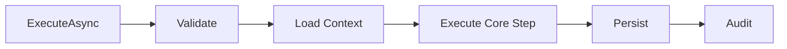
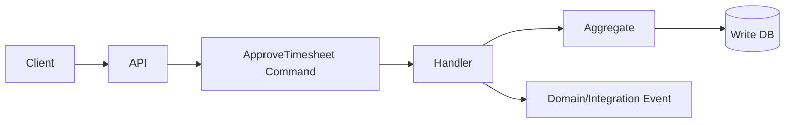
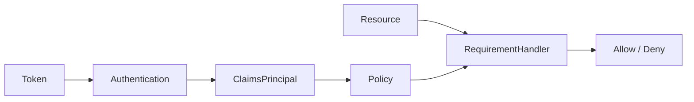
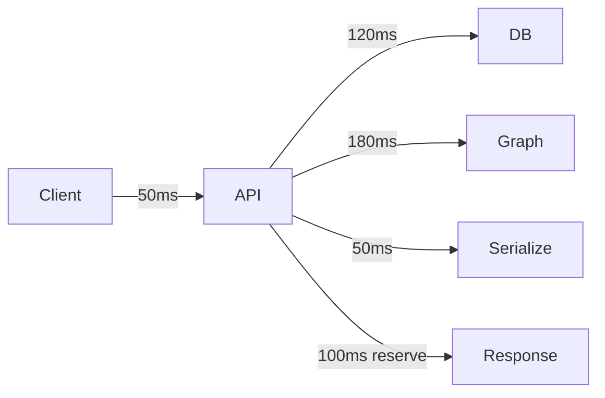
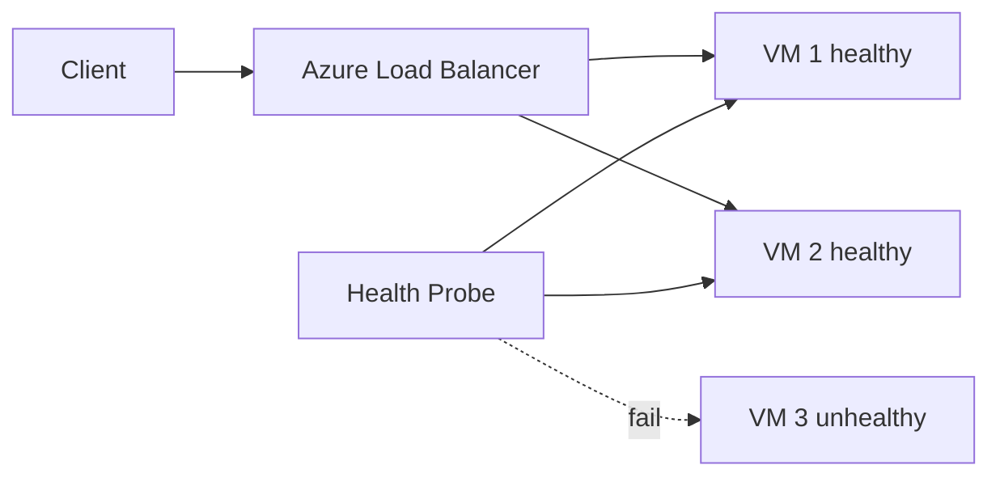
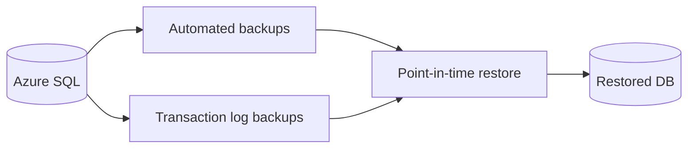
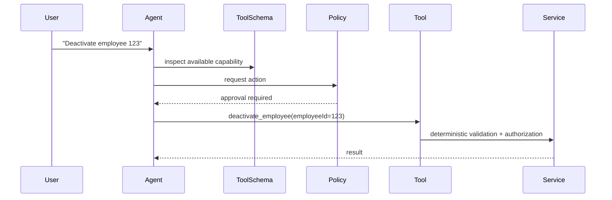
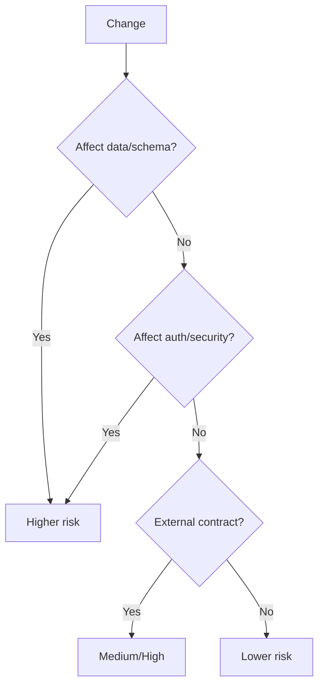

# Daily Knowledge Sharing — 17/08/2026

## Today’s Topics

1. Template Method Pattern — giữ workflow ổn định nhưng cho phép thay đổi từng bước có kiểm soát
2. CQRS Command Boundary — thiết kế write model theo business intent thay vì CRUD endpoint
3. Authorization Policy Composition trong ASP.NET Core — ghép claim, role và requirement mà không hard-code quyền trong controller
4. SQL Server Statistics & Cardinality Estimation — vì sao execution plan sai dù index vẫn tồn tại
5. API Performance Budget — kiểm soát latency theo từng hop thay vì tối ưu mù quáng một service
6. Azure Load Balancer Health Probe — chỉ gửi traffic tới instance thực sự sẵn sàng phục vụ
7. Azure SQL Point-in-Time Restore — backup tốt chỉ có giá trị khi restore được và đáp ứng RPO/RTO
8. Production Monitoring với Dependency Saturation — phát hiện queue, pool và downstream đang gần cạn capacity
9. MCP Tool Schema Design — contract rõ ràng để AI agent gọi tool an toàn, kiểm soát được và dễ quan sát
10. SDLC Change Risk Classification — thay đổi nhỏ về code chưa chắc là thay đổi nhỏ về production risk

---

# 1. Template Method Pattern — giữ workflow ổn định nhưng cho phép thay đổi từng bước có kiểm soát

### 1. What is it?

Template Method là pattern định nghĩa một workflow tổng thể ở lớp hoặc abstraction gốc, trong khi một số bước cụ thể được cho phép override. Điểm cốt lõi là **trình tự xử lý được giữ ổn định**, nhưng chi tiết từng bước có thể thay đổi theo loại nghiệp vụ.

Pattern này phù hợp khi nhiều use case có cùng skeleton: validate → load data → execute → persist → audit, nhưng một vài bước khác nhau theo loại request.

### 2. Why does it exist?

Nếu copy toàn bộ workflow cho từng trường hợp, code sẽ lặp logic transaction, logging, audit và error handling. Khi thay đổi một bước chung, developer phải sửa ở nhiều nơi và dễ tạo behavior không nhất quán.

Ngược lại, nếu ép mọi variation vào `if/else` trong một method lớn, abstraction mất rõ ràng và rất khó test.

### 3. How does it work?



Lớp base quyết định flow; subclass chỉ override các extension point hợp lệ.

### 4. Practical example

```csharp
public abstract class ImportJob
{
    public async Task RunAsync(CancellationToken ct)
    {
        await ValidateAsync(ct);
        var data = await LoadAsync(ct);
        await ProcessAsync(data, ct);
        await SaveAsync(ct);
    }

    protected abstract Task ValidateAsync(CancellationToken ct);
    protected abstract Task<object> LoadAsync(CancellationToken ct);
    protected abstract Task ProcessAsync(object data, CancellationToken ct);
    protected virtual Task SaveAsync(CancellationToken ct) => Task.CompletedTask;
}
```

Một `EmployeeImportJob` và `TimesheetImportJob` có thể dùng cùng skeleton nhưng khác validate và process.

### 5. Real production scenario

Trong hệ thống import file, mọi job đều cần download file, validate schema, parse, persist và ghi audit. Chỉ rule validate và mapping khác nhau. Template Method giữ pipeline nhất quán mà vẫn cho từng domain tùy biến.

### 6. Common mistakes

- Tạo base class khổng lồ chứa quá nhiều hook.
- Cho subclass override những bước đáng lẽ phải cố định như transaction hoặc security check.
- Dùng inheritance chỉ để tái sử dụng vài dòng code.
- Không cân nhắc composition khi variation tăng nhanh.

### 7. Trade-offs

**Advantages**
- Giảm duplication.
- Workflow nhất quán.
- Dễ enforce các bước bắt buộc.

**Costs / Risks**
- Coupling qua inheritance.
- Base class dễ trở thành abstraction cứng.
- Thay đổi flow có thể ảnh hưởng toàn bộ subclass.

### 8. Junior → Middle → Senior understanding

**Junior**: hiểu base class giữ flow, subclass chỉ thay một số bước.

**Middle**: biết chọn đúng extension point và test behavior chung/rieng.

**Senior / Technical Lead**: biết khi nào Template Method tốt hơn Strategy/composition, và nhận ra inheritance hierarchy đang trở thành bottleneck thiết kế.

### 9. Key takeaway

- Cố định workflow, chỉ mở đúng điểm cần tùy biến.
- Không dùng inheritance chỉ để reuse code.
- Khi variation phức tạp, composition thường linh hoạt hơn.

---

# 2. CQRS Command Boundary — thiết kế write model theo business intent thay vì CRUD endpoint

### 1. What is it?

Trong CQRS, command thể hiện **ý định thay đổi hệ thống** như `ApproveTimesheet`, `DeactivateEmployee`, `ChangeInvoiceDueDate`, thay vì chỉ nói `UpdateEntity`.

Điểm mạnh không nằm ở việc dùng MediatR hay tách folder `Commands`, mà ở việc write model phản ánh business decision và invariant rõ ràng.

### 2. Why does it exist?

CRUD API thường gom nhiều hành vi khác nhau vào một endpoint `PUT /employees/{id}`. Điều này khiến authorization, validation, audit và side effect bị trộn vào một operation chung.

Business system thực tế lại cần biết **ai đã làm gì, vì sao, và rule nào phải áp dụng**.

### 3. How does it work?



Mỗi command có input tối thiểu cần thiết, authorization riêng, transaction boundary riêng và expected outcome rõ ràng.

### 4. Practical example

```csharp
public sealed record ApproveTimesheetCommand(
    Guid TimesheetId,
    Guid ApproverId,
    string Comment);

public sealed class ApproveTimesheetHandler
{
    public async Task Handle(ApproveTimesheetCommand cmd, CancellationToken ct)
    {
        var timesheet = await repository.GetAsync(cmd.TimesheetId, ct);
        timesheet.Approve(cmd.ApproverId, cmd.Comment);
        await unitOfWork.SaveChangesAsync(ct);
    }
}
```

### 5. Real production scenario

Một timesheet có thể có `Submit`, `Approve`, `Reject`, `Reopen`. Nếu chỉ dùng `UpdateTimesheet`, hệ thống khó audit đúng business action và rất dễ cho phép state transition sai.

### 6. Common mistakes

- Tạo command 1:1 với entity property update.
- Đưa toàn bộ business rule vào handler thay vì aggregate/domain service.
- Tạo hàng trăm command nhưng không có business meaning.
- Dùng CQRS để biện minh cho complexity không cần thiết.

### 7. Trade-offs

**Advantages**
- Intent rõ ràng.
- Audit và authorization chính xác.
- Transaction boundary dễ kiểm soát.

**Costs / Risks**
- Nhiều class hơn CRUD.
- Cần naming và domain modeling tốt.
- Overkill cho module rất đơn giản.

### 8. Junior → Middle → Senior understanding

**Junior**: phân biệt command với DTO update chung.

**Middle**: biết đặt validation, authorization và domain rule đúng boundary.

**Senior / Technical Lead**: quyết định mức CQRS phù hợp, tránh ceremony và xác định command granularity theo business capability.

### 9. Key takeaway

- Command nên diễn đạt business intent.
- CQRS là boundary và modeling, không phải folder convention.
- Một command tốt giúp transaction, audit và authorization rõ hơn.

---

# 3. Authorization Policy Composition trong ASP.NET Core — ghép claim, role và requirement mà không hard-code quyền trong controller

### 1. What is it?

ASP.NET Core authorization policy cho phép định nghĩa quyền dưới dạng requirement có thể ghép lại: user phải có scope phù hợp, thuộc tenant đúng, sở hữu resource hoặc có quyền quản trị.

Authentication trả lời **“Who are you?”**. Authorization trả lời **“What are you allowed to do?”**.

### 2. Why does it exist?

Nếu controller chứa các đoạn như `if (user.Role == "Admin" || user.Id == employee.ManagerId)`, quyền bị rải khắp codebase, khó audit và rất dễ sai khi rule thay đổi.

### 3. How does it work?



Policy xác định requirement. Handler dùng principal và resource để quyết định.

### 4. Practical example

```csharp
builder.Services.AddAuthorization(options =>
{
    options.AddPolicy("Timesheet.Approve", p =>
        p.RequireClaim("scope", "timesheet.approve")
         .AddRequirements(new SameDepartmentRequirement()));
});
```

Resource-based handler có thể kiểm tra department của approver với timesheet hiện tại.

### 5. Real production scenario

Trong employee management, HR được xem hồ sơ toàn công ty, manager chỉ được xem nhân viên thuộc reporting line, nhân viên chỉ xem chính mình. Một policy composed tốt giữ các rule này tập trung và test được.

### 6. Common mistakes

- Chỉ kiểm tra role mà bỏ qua resource ownership.
- Tin claim do client tự gửi thay vì token issuer đáng tin cậy.
- Hard-code quyền trong controller/service.
- Trộn authorization với business validation.

### 7. Trade-offs

**Advantages**
- Quyền tập trung và testable.
- Tái sử dụng giữa endpoint.
- Hỗ trợ rule động theo resource.

**Costs / Risks**
- Policy phức tạp có thể khó trace.
- Handler có thể vô tình gọi DB quá nhiều.
- Cần naming và permission model nhất quán.

### 8. Junior → Middle → Senior understanding

**Junior**: phân biệt authentication với authorization.

**Middle**: implement policy, requirement và resource handler.

**Senior / Technical Lead**: thiết kế permission model, tenant isolation, least privilege và hiệu năng của authorization path.

### 9. Key takeaway

- Role chỉ là một tín hiệu, không phải toàn bộ authorization.
- Quyền nên được mô hình hóa thành policy/requirement rõ ràng.
- Resource-based authorization là bắt buộc khi quyền phụ thuộc dữ liệu cụ thể.

---

# 4. SQL Server Statistics & Cardinality Estimation — vì sao execution plan sai dù index vẫn tồn tại

### 1. What is it?

Statistics mô tả phân bố dữ liệu mà SQL Server dùng để ước lượng số row sẽ đi qua từng operator. Cardinality estimate ảnh hưởng trực tiếp tới lựa chọn join, memory grant, parallelism và index access path.

Có index nhưng estimate sai vẫn có thể tạo execution plan rất tệ.

### 2. Why does it exist?

Optimizer không chạy mọi plan để thử. Nó cần dự đoán chi phí dựa trên metadata và statistics. Khi statistics stale hoặc data bị skew mạnh, estimate lệch xa actual row count.

### 3. How does it work?

```text
Query
  ↓
Statistics / Histogram
  ↓
Estimated rows
  ↓
Cost model
  ↓
Execution plan
  ↓
Actual rows
```

So sánh Estimated Rows và Actual Rows là một clue quan trọng khi phân tích plan.

### 4. Practical example

```sql
SELECT *
FROM Timesheets
WHERE Status = 'Pending'
  AND DepartmentId = 42;
```

Nếu `Pending` chỉ chiếm 1% tổng dữ liệu nhưng statistics cũ nghĩ là 40%, optimizer có thể chọn scan thay vì seek hoặc memory grant quá lớn.

Có thể kiểm tra cập nhật statistics:

```sql
UPDATE STATISTICS dbo.Timesheets IX_Timesheets_Status_Department;
```

### 5. Real production scenario

Sau import hàng triệu record, distribution thay đổi lớn. Query approval trước đây 50 ms tăng lên vài giây dù schema và index không đổi. Root cause có thể là statistics không còn phản ánh dữ liệu mới.

### 6. Common mistakes

- Thấy query chậm là thêm index ngay.
- Chỉ nhìn Estimated Plan, không xem Actual Plan.
- Update statistics vô tội vạ trong peak hour.
- Bỏ qua parameter-sensitive distribution.

### 7. Trade-offs

**Advantages**
- Statistics tốt giúp optimizer chọn plan hợp lý.
- Không cần hard-code query hint trong nhiều trường hợp.

**Costs / Risks**
- Update stats tốn I/O/CPU.
- Sampling có thể chưa đủ với distribution đặc biệt.
- Fullscan statistics có thể đắt trên bảng lớn.

### 8. Junior → Middle → Senior understanding

**Junior**: biết optimizer dùng statistics để ước lượng row.

**Middle**: so sánh estimated vs actual rows và kiểm tra stale stats.

**Senior / Technical Lead**: hiểu data skew, parameter sensitivity, maintenance window và tác động tới plan stability.

### 9. Key takeaway

- Index tốt chưa đủ; optimizer cần estimate đúng.
- Luôn xem actual row count khi điều tra plan regression.
- Statistics maintenance phải cân bằng accuracy và operational cost.

---

# 5. API Performance Budget — kiểm soát latency theo từng hop thay vì tối ưu mù quáng một service

### 1. What is it?

Performance budget là giới hạn latency được phân bổ cho từng phần trong request path. Ví dụ API cần p95 dưới 500 ms thì database, downstream API, serialization và network không thể mỗi nơi tự dùng hàng trăm millisecond mà không có ngân sách.

### 2. Why does it exist?

Một request tổng thường đi qua nhiều hop. Nếu mỗi service đặt timeout 30 giây và không có target latency cụ thể, tail latency tích lũy nhanh và incident rất khó khoanh vùng.

### 3. How does it work?



Budget phải được đo bằng p95/p99 chứ không chỉ average.

### 4. Practical example

Một endpoint target p95 600 ms có thể phân bổ:

```text
Ingress/network: 80 ms
Database:        150 ms
Microsoft Graph: 220 ms
Application:      50 ms
Reserve:         100 ms
```

Nếu Graph thường xuyên dùng 400 ms, đội cần cache, parallelize hợp lý, giảm call hoặc thay đổi UX thay vì chỉ micro-optimize LINQ.

### 5. Real production scenario

Employee profile API gọi DB + Graph + permission service. Khi p95 tăng, tracing cho thấy Graph chiếm 70% latency. Performance budget giúp team ưu tiên đúng bottleneck.

### 6. Common mistakes

- Tối ưu CPU khi bottleneck là downstream.
- Dùng average latency.
- Đặt timeout dài hơn SLO tổng.
- Không chừa reserve cho retry, network variance và GC pause.

### 7. Trade-offs

**Advantages**
- Ưu tiên tối ưu có dữ liệu.
- Timeout hợp lý hơn.
- Dễ phân trách nhiệm giữa service.

**Costs / Risks**
- Cần tracing/metrics tốt.
- Budget quá cứng có thể không phù hợp workload biến động.
- Có thể phải redesign workflow thay vì chỉ tune code.

### 8. Junior → Middle → Senior understanding

**Junior**: hiểu latency tổng là tổng của nhiều thành phần.

**Middle**: biết đo từng hop và đặt timeout dựa trên budget.

**Senior / Technical Lead**: gắn p95/p99 với SLO, capacity và architecture decision.

### 9. Key takeaway

- Tối ưu nơi chiếm latency thật.
- Budget phải gắn với percentile, không chỉ average.
- Timeout của downstream phải nằm trong deadline tổng.

---

# 6. Azure Load Balancer Health Probe — chỉ gửi traffic tới instance thực sự sẵn sàng phục vụ

### 1. What is it?

Azure Load Balancer phân phối L4 traffic giữa backend instances. Health Probe dùng TCP/HTTP/HTTPS probe để xác định instance nào đủ khỏe để tiếp tục nhận traffic.

### 2. Why does it exist?

Một VM hoặc instance còn chạy không có nghĩa application còn phục vụ được. Process có thể deadlock, port không listen, dependency critical bị hỏng hoặc startup chưa hoàn tất.

### 3. How does it work?



Backend không đạt probe sẽ bị loại khỏi new traffic cho tới khi khỏe lại.

### 4. Practical example

ASP.NET Core có thể expose endpoint riêng:

```csharp
builder.Services.AddHealthChecks()
    .AddSqlServer(connectionString, name: "sql");

app.MapHealthChecks("/health/ready");
```

Nhưng probe nên kiểm tra dependency thật sự cần cho việc phục vụ request, không phải mọi dependency phụ.

### 5. Real production scenario

Một VM scale set chạy API. Một instance startup thành công nhưng không kết nối được DB vì DNS/network issue. Health probe fail giúp load balancer tránh gửi request tới instance đó.

### 6. Common mistakes

- Probe endpoint luôn trả 200.
- Probe phụ thuộc quá nhiều external service, gây flapping.
- Dùng cùng endpoint cho liveness và readiness mà không phân biệt mục đích.
- Không monitor số backend unhealthy.

### 7. Trade-offs

**Advantages**
- Tự động loại instance lỗi.
- Cải thiện availability.

**Costs / Risks**
- Probe sai có thể loại toàn bộ backend.
- Health check quá nặng làm tăng load.
- L4 Load Balancer không thay thế WAF/L7 routing.

### 8. Junior → Middle → Senior understanding

**Junior**: hiểu load balancer chỉ gửi traffic tới backend healthy.

**Middle**: cấu hình readiness endpoint và probe interval hợp lý.

**Senior / Technical Lead**: thiết kế health semantics, failure domain và tránh cascading failure do probe dependency.

### 9. Key takeaway

- “Process sống” khác với “service sẵn sàng”.
- Health probe phải phản ánh khả năng phục vụ traffic.
- Probe càng phức tạp càng dễ tạo false negative.

---

# 7. Azure SQL Point-in-Time Restore — backup tốt chỉ có giá trị khi restore được và đáp ứng RPO/RTO

### 1. What is it?

Point-in-Time Restore cho phép tạo database mới từ trạng thái tại một thời điểm trước đó trong retention window. Nó dùng automated backups và transaction log để khôi phục dữ liệu gần thời điểm sự cố.

### 2. Why does it exist?

High availability không bảo vệ bạn khỏi `DELETE` nhầm, migration lỗi hoặc application bug ghi dữ liệu sai. Replica có thể đồng bộ chính lỗi đó rất nhanh.

### 3. How does it work?



Restore thường tạo database mới; team sau đó validate rồi cut over hoặc copy dữ liệu cần thiết.

### 4. Practical example

Nếu migration lúc 14:05 làm mất dữ liệu, team có thể restore database về 14:03, chạy validation, rồi dùng script reconcile các thay đổi hợp lệ phát sinh sau 14:03.

### 5. Real production scenario

Một background job update sai trạng thái hàng trăm nghìn timesheet. Failover không giúp vì dữ liệu sai đã được replicate. PITR trở thành recovery path thực tế.

### 6. Common mistakes

- Có backup nhưng chưa từng test restore.
- Không biết retention window.
- Nhầm HA với backup.
- Không có runbook reconcile dữ liệu sau restore.

### 7. Trade-offs

**Advantages**
- Recovery từ logical corruption.
- Không cần tự viết full backup pipeline cho use case cơ bản.

**Costs / Risks**
- Restore mất thời gian.
- Có data gap sau restore point.
- Database lớn có thể làm RTO dài hơn mong đợi.

### 8. Junior → Middle → Senior understanding

**Junior**: hiểu backup khác với replica.

**Middle**: biết quy trình restore và validation.

**Senior / Technical Lead**: định nghĩa RPO/RTO, test recovery định kỳ và thiết kế reconciliation/cutover plan.

### 9. Key takeaway

- HA không thay thế backup.
- Backup chỉ đáng tin khi restore đã được kiểm thử.
- Recovery plan phải tính cả data reconciliation.

---

# 8. Production Monitoring với Dependency Saturation — phát hiện queue, pool và downstream đang gần cạn capacity

### 1. What is it?

Saturation thể hiện mức tài nguyên hoặc dependency đang tiến gần giới hạn: connection pool gần đầy, queue backlog tăng, thread pool thiếu worker, CPU cao, Service Bus active messages tích tụ.

Monitoring tốt không chỉ hỏi “service có lỗi chưa?” mà còn hỏi “service còn bao nhiêu headroom?”.

### 2. Why does it exist?

Nhiều incident bắt đầu bằng saturation trước khi error rate tăng. Nếu chỉ alert 5xx, team thường phát hiện khi người dùng đã bị ảnh hưởng mạnh.

### 3. How does it work?

```text
Traffic tăng
  ↓
Dependency capacity gần đầy
  ↓
Queue / wait time tăng
  ↓
Latency tăng
  ↓
Timeout
  ↓
Error rate tăng
```

Metrics nên theo chuỗi cause-effect này.

### 4. Practical example

Với SQL connection pool, theo dõi:

- request concurrency,
- DB connection wait time,
- timeout count,
- DB CPU,
- active connections.

Nếu API latency tăng trong khi DB CPU thấp nhưng connection wait cao, vấn đề có thể là pool exhaustion chứ không phải query CPU.

### 5. Real production scenario

Background jobs tăng đột biến, queue backlog phình ra, worker concurrency đã đạt trần. User-facing API chưa lỗi nhưng notification delay bắt đầu tăng. Alert theo backlog age giúp phát hiện sớm.

### 6. Common mistakes

- Chỉ alert CPU và memory.
- Không theo dõi queue age.
- Không biết hard limit của connection/thread/worker pool.
- Scale consumer vô hạn mà không xét downstream capacity.

### 7. Trade-offs

**Advantages**
- Phát hiện incident sớm.
- Capacity planning tốt hơn.
- Phân biệt symptom với bottleneck.

**Costs / Risks**
- Nhiều metric hơn cần quản trị.
- Threshold tĩnh có thể gây alert noise.
- Cần hiểu capacity thực của từng dependency.

### 8. Junior → Middle → Senior understanding

**Junior**: hiểu saturation là gần cạn capacity.

**Middle**: correlate backlog, pool wait, latency và error.

**Senior / Technical Lead**: xác định headroom, autoscaling signal và downstream protection strategy.

### 9. Key takeaway

- Saturation thường xuất hiện trước error.
- Theo dõi queue/pool/wait time, không chỉ CPU.
- Capacity phải được nhìn end-to-end qua dependency chain.

---

# 9. MCP Tool Schema Design — contract rõ ràng để AI agent gọi tool an toàn, kiểm soát được và dễ quan sát

### 1. What is it?

Trong MCP hoặc hệ thống tool-calling tương tự, tool schema mô tả tên tool, input contract và semantics mà model có thể sử dụng. Schema tốt giúp model chọn đúng tool và truyền argument hợp lệ, nhưng deterministic code vẫn phải kiểm tra quyền, validation và side effect.

### 2. Why does it exist?

Nếu tool tên mơ hồ như `execute`, input là object tự do và description không rõ, model dễ gọi sai hoặc tạo argument nguy hiểm. AI không nên được trao quyền hành động chỉ vì output “có vẻ hợp lý”.

### 3. How does it work?



### 4. Practical example

Schema tốt nên hẹp:

```json
{
  "name": "get_employee_timesheet",
  "parameters": {
    "type": "object",
    "properties": {
      "employeeId": { "type": "string" },
      "weekStart": { "type": "string", "format": "date" }
    },
    "required": ["employeeId", "weekStart"],
    "additionalProperties": false
  }
}
```

Không nên cho model truyền raw SQL hay arbitrary URL nếu business task không cần.

### 5. Real production scenario

AI assistant hỗ trợ HR có tool đọc employee, tạo draft email và cập nhật offboarding. Read tool có thể tự chạy; update mailbox hoặc disable account phải qua approval và authorization deterministic.

### 6. Common mistakes

- Tool quá quyền lực.
- Description mơ hồ.
- Tin argument do model tạo mà không validate.
- Không log tool input/output và actor.
- Cho phép side effect retry không idempotent.

### 7. Trade-offs

**Advantages**
- Agent behavior dự đoán được hơn.
- Giảm hallucinated action.
- Dễ audit và quan sát.

**Costs / Risks**
- Nhiều tool nhỏ tăng schema complexity.
- Tool quá hẹp có thể làm workflow dài.
- Cần versioning contract khi backend thay đổi.

### 8. Junior → Middle → Senior understanding

**Junior**: hiểu model chỉ đề xuất tool call; code vẫn phải validate.

**Middle**: thiết kế JSON schema hẹp, typed và retry-safe.

**Senior / Technical Lead**: xây permission boundary, approval policy, audit, versioning và least-privilege tool surface.

### 9. Key takeaway

- Tool schema là security boundary, không chỉ là prompt metadata.
- Input phải hẹp, typed và validate lại ở server.
- Side effect cần authorization, idempotency và audit deterministic.

---

# 10. SDLC Change Risk Classification — thay đổi nhỏ về code chưa chắc là thay đổi nhỏ về production risk

### 1. What is it?

Change Risk Classification là cách phân loại thay đổi theo blast radius, reversibility, data impact, dependency impact và observability thay vì chỉ dựa trên số dòng code.

Một migration 5 dòng có thể nguy hiểm hơn refactor 2.000 dòng không đổi behavior.

### 2. Why does it exist?

Nếu mọi PR đều dùng cùng quy trình review/test/release, team hoặc lãng phí thời gian cho thay đổi nhỏ, hoặc kiểm soát quá lỏng với thay đổi rủi ro cao.

### 3. How does it work?



Risk score có thể quyết định review depth, test suite, rollout strategy và rollback requirement.

### 4. Practical example

Một PR đổi index có thể cần:

- production-like performance test,
- deployment window,
- rollback SQL,
- monitoring query latency.

Trong khi rename internal method không đổi behavior có thể chỉ cần unit test và normal review.

### 5. Real production scenario

Thay đổi Microsoft Graph permission scope chỉ vài dòng config nhưng blast radius lớn: token acquisition, tenant consent và integration đều có thể lỗi. Nó phải được xếp risk cao hơn code change thông thường.

### 6. Common mistakes

- Dùng line count làm proxy cho risk.
- Không xem data migration là production change.
- Không đánh giá reversibility.
- Không yêu cầu monitoring plan cho release rủi ro cao.

### 7. Trade-offs

**Advantages**
- Review effort đúng nơi cần thiết.
- Release safer mà không làm chậm mọi thay đổi.
- Tạo common language về risk.

**Costs / Risks**
- Cần discipline và tiêu chí rõ.
- Risk scoring có thể bị game nếu gắn quá nhiều bureaucracy.
- Không thể thay thế engineering judgment.

### 8. Junior → Middle → Senior understanding

**Junior**: hiểu thay đổi nhỏ không đồng nghĩa rủi ro thấp.

**Middle**: biết đánh giá data, security, dependency và rollback impact.

**Senior / Technical Lead**: thiết kế risk-based review/release policy và cân bằng velocity với safety.

### 9. Key takeaway

- Đánh giá blast radius, không đánh giá số dòng code.
- Data/security/external contract thường làm risk tăng mạnh.
- Risk classification nên dẫn tới test, rollout và rollback strategy tương ứng.
