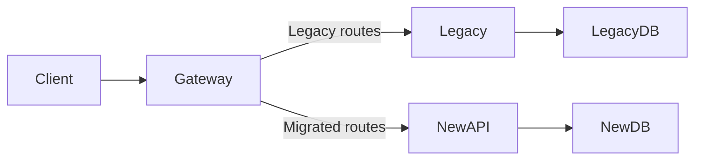
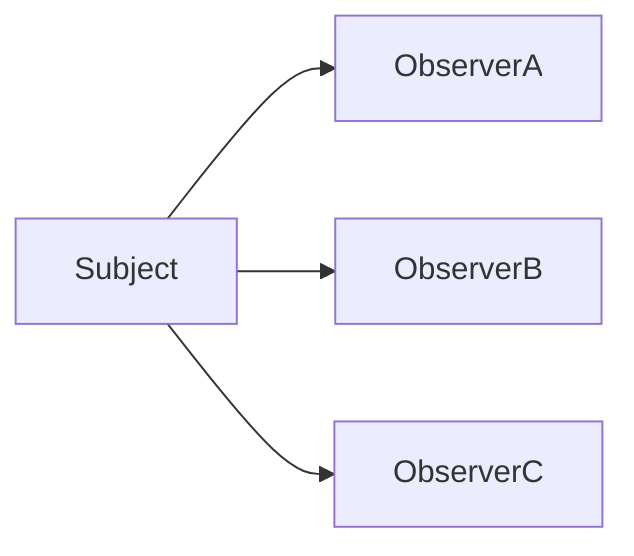
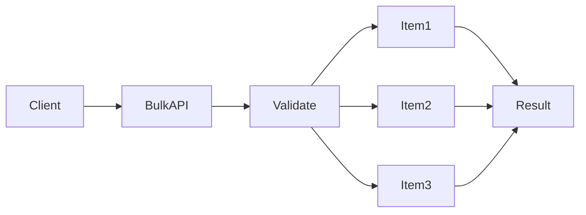
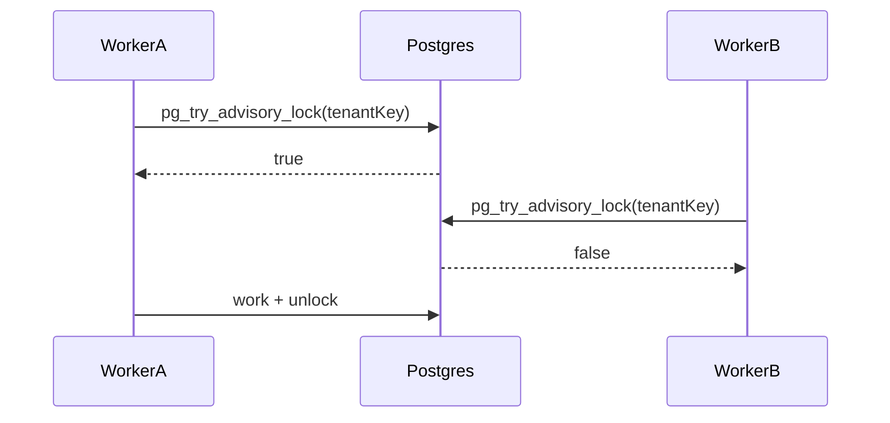
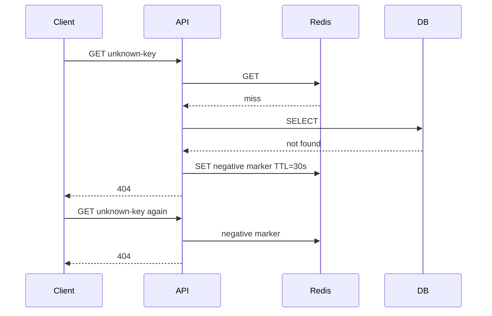
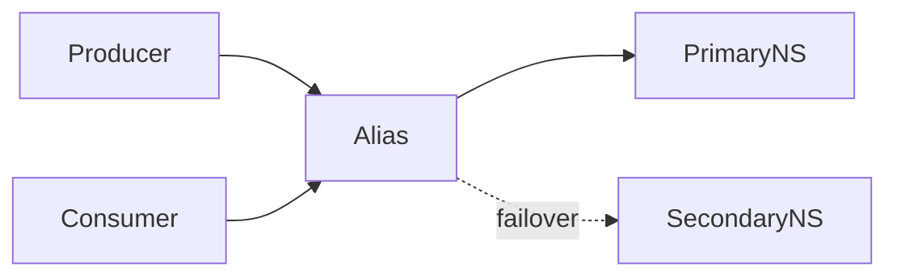
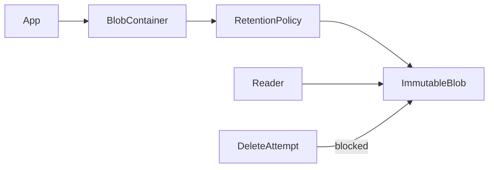
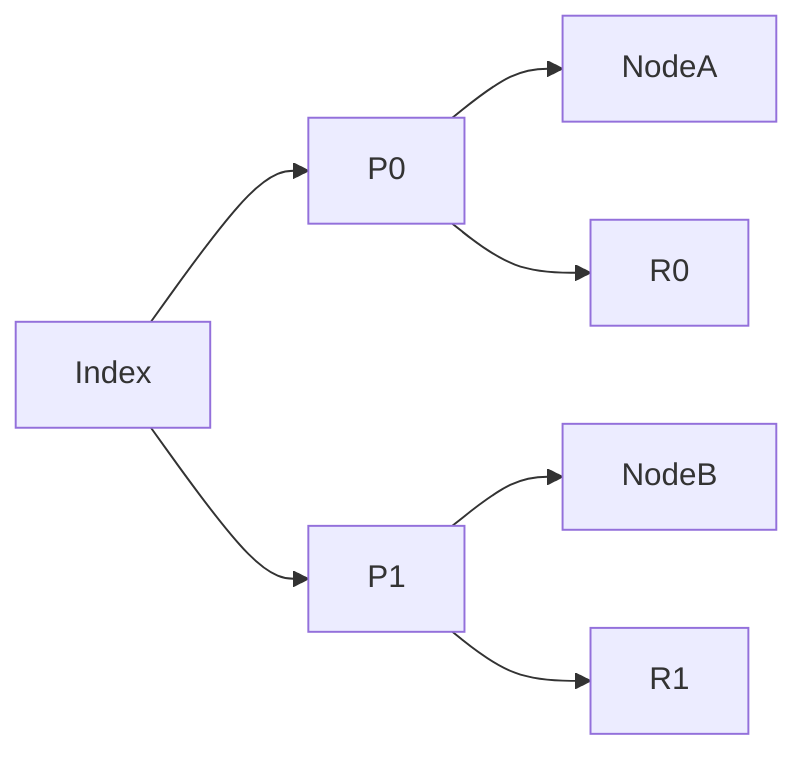
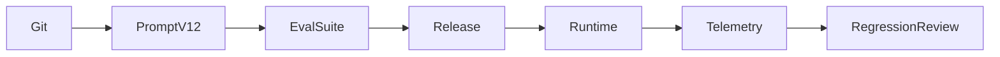
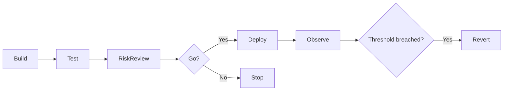

# Daily Knowledge Sharing — 17/08/2026

## Today’s Topics

1. Strangler Fig Pattern — hiện đại hóa hệ thống lớn từng phần thay vì rewrite toàn bộ
2. Observer Pattern — phát tán thay đổi trạng thái mà không làm publisher phụ thuộc subscriber
3. REST Bulk API & Partial Failure — thiết kế batch endpoint mà không biến một lỗi thành thất bại toàn bộ
4. PostgreSQL Advisory Locks — khóa theo business key khi row lock không diễn tả đúng tài nguyên cần bảo vệ
5. Cache Penetration & Negative Caching — bảo vệ database khỏi request lặp lại cho dữ liệu không tồn tại
6. Azure Service Bus Geo-Disaster Recovery — failover namespace nhưng vẫn phải tự thiết kế data-plane recovery
7. Azure Blob Immutable Storage — retention, legal hold và bảo vệ dữ liệu khỏi sửa/xóa ngoài ý muốn
8. Elasticsearch Shard Design — chọn shard theo workload thay vì “mỗi index nhiều shard cho chắc”
9. AI Prompt & Context Versioning — quản lý thay đổi LLM workflow như một phần của software delivery
10. Release Go/No-Go Decision — quyết định phát hành dựa trên risk, telemetry và rollback readiness

---

# 1. Strangler Fig Pattern — hiện đại hóa hệ thống lớn từng phần thay vì rewrite toàn bộ

### 1. What is it?

Strangler Fig Pattern là chiến lược thay thế dần một hệ thống cũ bằng các capability mới. Thay vì dừng mọi thứ để viết lại từ đầu, ta đặt một routing boundary ở phía trước, chuyển từng nhóm request sang implementation mới, rồi xóa dần phần cũ khi đã hết traffic.

Điểm quan trọng: đây không phải pattern “microservices hóa”. Nó là **migration strategy** để giảm rủi ro khi thay đổi hệ thống đang sống.

### 2. Why does it exist?

Rewrite toàn bộ thường thất bại vì ba lý do: business vẫn thay đổi trong lúc rewrite, behavior cũ có nhiều rule ẩn không được document, và team phải duy trì hai thế giới quá lâu.

Nếu chuyển từng capability, ta có thể xác nhận behavior, đo production, rollback nhanh và giữ business tiếp tục chạy.

### 3. How does it work?



Luồng thường là:

1. Xác định một bounded capability nhỏ.
2. Đặt reverse proxy/API gateway phía trước.
3. Route capability đó sang implementation mới.
4. Đồng bộ hoặc migrate dữ liệu theo chiến lược rõ ràng.
5. Theo dõi telemetry và rollback nếu cần.
6. Khi traffic cũ về 0, xóa module legacy tương ứng.

### 4. Practical example

Giả sử hệ thống employee management cũ có `/employees`, `/leave`, `/timesheet` trong một monolith .NET Framework.

Ta có thể migrate `/timesheet/*` trước sang ASP.NET Core:

```csharp
app.MapWhen(
    context => context.Request.Path.StartsWithSegments("/timesheet"),
    branch => branch.RunProxy(proxyOptions));
```

Trong production thường dùng Azure Front Door, Application Gateway, YARP hoặc API Management thay vì tự viết proxy thủ công.

### 5. Real production scenario

Một SaaS HR có legacy monolith xử lý employee, leave, payroll và timesheet. Team muốn nâng .NET, tách release cadence và giảm coupling.

Thay vì rewrite tất cả, team migrate timesheet trước vì domain boundary rõ, ít phụ thuộc payroll. Gateway route traffic timesheet sang service mới, còn leave/payroll vẫn vào monolith. Sau vài tuần ổn định, team tiếp tục module khác.

### 6. Common mistakes

- Migrate theo table hoặc folder thay vì business capability.
- Để service mới gọi ngược legacy cho hầu hết logic, tạo distributed monolith.
- Không có ownership rõ cho dữ liệu.
- Không có observability để so behavior old/new.
- Duy trì dual-write quá lâu mà không có reconciliation.
- Không có tiêu chí “khi nào legacy module được xóa”.

### 7. Trade-offs

**Advantages**

- Giảm blast radius.
- Có thể rollback từng capability.
- Business vẫn tiếp tục delivery trong quá trình migration.
- Cho phép học kiến trúc mới dần dần.

**Costs / Risks**

- Tạm thời tăng complexity routing và data synchronization.
- Phải vận hành old + new song song.
- Nếu boundary chọn sai, coupling sẽ lan sang hệ thống mới.

### 8. Junior → Middle → Senior understanding

**Junior**

Hiểu rằng modernize không đồng nghĩa rewrite toàn bộ; traffic có thể được chuyển từng phần.

**Middle**

Biết triển khai routing, compatibility contract, migration path, telemetry và rollback cho một capability cụ thể.

**Senior / Technical Lead**

Phải quyết định migration boundary, data ownership, coexistence period, dependency direction và exit criteria. Câu hỏi chính không phải “service mới dùng framework gì?” mà là “làm sao giảm rủi ro business trong từng bước chuyển đổi?”.

### 9. Key takeaway

- Rewrite toàn bộ là một bet rất lớn.
- Migrate theo business capability, không theo cấu trúc code.
- Routing, data ownership và rollback là ba phần cốt lõi của Strangler Fig.

---

# 2. Observer Pattern — phát tán thay đổi trạng thái mà không làm publisher phụ thuộc subscriber

### 1. What is it?

Observer Pattern định nghĩa quan hệ một-nhiều: khi một subject thay đổi, nhiều observer được thông báo mà subject không cần biết chi tiết implementation của từng observer.

Trong .NET, pattern này xuất hiện qua events, delegates, `IObservable<T>`, domain notification hoặc các callback interface.

### 2. Why does it exist?

Nếu một object phải gọi trực tiếp mọi side effect:

```text
OrderService
 ├─ SendEmail()
 ├─ UpdateDashboard()
 ├─ WriteAudit()
 └─ PublishMetric()
```

thì publisher bị coupling mạnh với mọi subscriber. Mỗi yêu cầu mới lại sửa publisher.

Observer tách “đã có sự kiện” khỏi “ai quan tâm sự kiện đó”.

### 3. How does it work?



Publisher chỉ phát notification. Subscriber đăng ký và tự chịu trách nhiệm phản ứng.

Điểm cần phân biệt: Observer trong process không tự biến thành distributed event system. Khi qua process boundary, ta phải xử lý durability, retry, ordering, duplicate và delivery semantics.

### 4. Practical example

```csharp
public sealed class Timesheet
{
    public event EventHandler<TimesheetSubmittedEventArgs>? Submitted;

    public void Submit()
    {
        // validate + change state
        Submitted?.Invoke(this, new TimesheetSubmittedEventArgs(Id));
    }
}
```

Subscriber:

```csharp
timesheet.Submitted += (_, e) => audit.Write("Submitted", e.TimesheetId);
```

Trong domain-heavy application, thường ưu tiên domain events hơn việc rải .NET event tùy tiện vì domain events dễ gom, persist và xử lý theo transaction boundary hơn.

### 5. Real production scenario

Khi employee submit timesheet, hệ thống có thể cần audit, gửi notification, invalidate dashboard cache và cập nhật metric. Không nên nhồi tất cả vào `SubmitAsync()`.

Một phần có thể xử lý đồng bộ trong process; side effect không cần tức thời có thể chuyển sang integration event qua queue.

### 6. Common mistakes

- Observer handler có side effect lớn nhưng chạy đồng bộ trong request thread.
- Handler ném exception làm hỏng publisher mà không có policy rõ ràng.
- Quên unsubscribe với object sống lâu, gây memory leak.
- Dùng observer để che coupling thay vì thiết kế boundary.
- Nhầm in-process event với durable message broker.

### 7. Trade-offs

**Advantages**

- Giảm coupling trực tiếp.
- Dễ mở rộng subscriber.
- Phù hợp cho notification-oriented behavior.

**Costs / Risks**

- Control flow khó thấy hơn call trực tiếp.
- Debugging phức tạp nếu có nhiều observer.
- Thứ tự handler có thể trở thành hidden dependency.

### 8. Junior → Middle → Senior understanding

**Junior**

Biết publisher phát event, subscriber lắng nghe.

**Middle**

Biết xử lý lifetime, exception, subscription và async behavior.

**Senior / Technical Lead**

Phải quyết định khi nào in-process observer đủ, khi nào cần domain event, khi nào phải chuyển sang durable integration event. Quan trọng nhất là semantics chứ không phải syntax `event`.

### 9. Key takeaway

- Observer giảm dependency giữa publisher và subscriber.
- Không dùng nó để che giấu workflow business quan trọng.
- In-process notification và distributed messaging là hai bài toán khác nhau.

---

# 3. REST Bulk API & Partial Failure — thiết kế batch endpoint mà không biến một lỗi thành thất bại toàn bộ

### 1. What is it?

Bulk API cho phép client gửi nhiều operation trong một request, ví dụ cập nhật 100 employee hoặc import 500 timesheet entries.

Thách thức lớn không phải nhận array JSON, mà là **semantics khi chỉ một số item thành công**.

### 2. Why does it exist?

Nếu client gọi 500 request riêng:

- tăng network overhead,
- tăng TLS/HTTP overhead,
- dễ hit rate limit,
- khó quản lý retry.

Nhưng gom tất cả vào một transaction khổng lồ lại tạo lock lâu, rollback đắt và dễ vượt timeout.

### 3. How does it work?

Một thiết kế phổ biến là xử lý từng item độc lập và trả kết quả per-item:

```json
{
  "results": [
    { "id": "E001", "status": 200 },
    { "id": "E002", "status": 409, "code": "VersionConflict" },
    { "id": "E003", "status": 422, "code": "InvalidManager" }
  ]
}
```



Không nên mặc định dùng một DB transaction cho toàn batch trừ khi business thật sự yêu cầu atomicity toàn bộ.

### 4. Practical example

ASP.NET Core:

```csharp
public record BulkUpdateEmployeeRequest(IReadOnlyList<EmployeePatch> Items);
public record BulkItemResult(string Id, int Status, string? ErrorCode);
```

Handler có thể giới hạn concurrency:

```csharp
await Parallel.ForEachAsync(
    request.Items,
    new ParallelOptions { MaxDegreeOfParallelism = 8 },
    async (item, ct) => await ProcessOneAsync(item, ct));
```

Nhưng chỉ parallel khi downstream/database chịu được tải.

### 5. Real production scenario

Admin upload file cập nhật 2.000 employee. 1.950 hợp lệ, 30 employee code không tồn tại, 20 record conflict do version thay đổi.

Nếu API rollback toàn bộ, admin phải sửa rồi chạy lại 2.000 item. Nếu API hỗ trợ partial result, UI chỉ hiển thị 50 item lỗi và cho retry chọn lọc.

### 6. Common mistakes

- Không giới hạn batch size.
- Chạy `Task.WhenAll` hàng nghìn operation cùng lúc.
- Dùng transaction toàn batch không cần thiết.
- Trả HTTP 200 nhưng không có per-item error contract.
- Retry cả batch khi chỉ vài item lỗi, gây duplicate side effect.
- Không có idempotency key khi bulk operation có side effect.

### 7. Trade-offs

**Advantages**

- Giảm round trip.
- Tăng throughput client-server.
- Dễ hỗ trợ import và batch processing.

**Costs / Risks**

- Error model phức tạp hơn.
- Partial success khó xử lý ở UX.
- Có nguy cơ tạo burst load vào database/downstream.

### 8. Junior → Middle → Senior understanding

**Junior**

Hiểu bulk endpoint xử lý nhiều item và mỗi item có thể có kết quả khác nhau.

**Middle**

Biết thiết kế validation, concurrency limit, idempotency và result contract.

**Senior / Technical Lead**

Phải quyết định transaction semantics, batch size, throughput budget, retry granularity và backpressure. “Batch nhanh hơn” chỉ đúng nếu downstream capacity được bảo vệ.

### 9. Key takeaway

- Bulk API là bài toán semantics và capacity, không chỉ là `List<T>`.
- Partial failure nên được thiết kế từ đầu.
- Retry phải theo item hoặc idempotent operation, không retry mù toàn batch.

---

# 4. PostgreSQL Advisory Locks — khóa theo business key khi row lock không diễn tả đúng tài nguyên cần bảo vệ

### 1. What is it?

PostgreSQL advisory lock là cơ chế lock do application đặt theo một numeric key. Database không tự gắn lock này với một row cụ thể; application tự định nghĩa ý nghĩa của key.

Ví dụ key có thể biểu diễn “employee 123 đang chạy payroll recalculation”.

### 2. Why does it exist?

Row lock chỉ hoạt động khi tài nguyên cần bảo vệ tồn tại dưới dạng row phù hợp.

Nhưng có nhiều critical section mang tính logical:

- chỉ cho một job recalculation chạy theo tenant,
- chỉ một worker tạo monthly report cho một period,
- serialize thao tác trên aggregate trước khi row tồn tại.

### 3. How does it work?



Có session-level và transaction-level advisory lock. Với transaction-level, lock tự release khi transaction kết thúc.

### 4. Practical example

```sql
SELECT pg_try_advisory_xact_lock(hashtext('tenant:42:monthly-close'));
```

Trong Npgsql:

```csharp
var acquired = await db.Database
    .SqlQueryRaw<bool>("SELECT pg_try_advisory_xact_lock({0})", lockKey)
    .SingleAsync(ct);

if (!acquired)
    throw new ConflictException("Monthly close is already running.");
```

### 5. Real production scenario

Một SaaS timesheet có nightly process tính billable summary cho từng customer. Hai worker nhận duplicate schedule cùng tenant. Nếu cùng chạy, cả hai có thể cập nhật summary và gửi notification trùng.

Advisory lock theo `tenantId + period` đảm bảo tại một thời điểm chỉ một worker chạy critical section cho business key đó.

### 6. Common mistakes

- Dùng session-level lock nhưng quên unlock.
- Dùng hash key có collision mà không đánh giá rủi ro.
- Giữ transaction quá lâu chỉ để giữ lock.
- Xem advisory lock như distributed lock hoàn hảo cho mọi hệ thống.
- Không có timeout hoặc fallback khi không acquire được.

### 7. Trade-offs

**Advantages**

- Không cần tạo table lock riêng.
- Hữu ích cho logical resource.
- Transaction-level lock tự release an toàn.

**Costs / Risks**

- Semantics nằm trong application, database không hiểu business meaning.
- Có thể gây contention khó thấy.
- Không phù hợp nếu coordination cần vượt khỏi PostgreSQL boundary.

### 8. Junior → Middle → Senior understanding

**Junior**

Hiểu advisory lock là application-defined lock trong PostgreSQL.

**Middle**

Biết chọn transaction-level/session-level, timeout và lock key.

**Senior / Technical Lead**

Phải cân nhắc advisory lock so với unique constraint, row lock, idempotency, queue partitioning hoặc distributed coordination. Lock không nên là giải pháp đầu tiên nếu constraint hoặc data model có thể đảm bảo correctness đơn giản hơn.

### 9. Key takeaway

- Advisory lock bảo vệ logical resource, không nhất thiết là row.
- Ưu tiên transaction-scoped lock khi có thể.
- Luôn đánh giá contention và failure behavior.

---

# 5. Cache Penetration & Negative Caching — bảo vệ database khỏi request lặp lại cho dữ liệu không tồn tại

### 1. What is it?

Cache penetration xảy ra khi request liên tục hỏi một key không tồn tại. Vì cache không có key đó, mọi request đều xuyên xuống database.

Negative caching là kỹ thuật cache cả kết quả “không tồn tại” trong một TTL ngắn.

### 2. Why does it exist?

Cache-aside chỉ giúp khi dữ liệu tồn tại hoặc đã được cache. Với request như `GET /employees/INVALID-ID` lặp lại hàng nghìn lần, cache miss liên tục và database vẫn chịu full load.

Trường hợp này có thể đến từ bot, bug client hoặc attack có chủ đích.

### 3. How does it work?



Negative entry phải có TTL ngắn vì dữ liệu có thể được tạo sau đó.

### 4. Practical example

```csharp
const string NotFoundMarker = "__NF__";

var cached = await cache.GetStringAsync(key, ct);
if (cached == NotFoundMarker)
    return null;

var entity = await db.Employees.FindAsync([id], ct);
if (entity is null)
{
    await cache.SetStringAsync(
        key,
        NotFoundMarker,
        new DistributedCacheEntryOptions
        {
            AbsoluteExpirationRelativeToNow = TimeSpan.FromSeconds(30)
        },
        ct);
}
```

### 5. Real production scenario

Một public API bị bot scan hàng triệu random product IDs. Product hợp lệ có cache hit tốt, nhưng random ID luôn miss và đánh thẳng database.

Negative caching kết hợp rate limiting giúp giảm read load đáng kể.

### 6. Common mistakes

- Cache 404 quá lâu, làm dữ liệu vừa tạo vẫn bị báo không tồn tại.
- Không phân biệt “not found” với “database timeout”.
- Cache exception như một negative result.
- Không namespace key theo tenant/version.
- Chỉ dùng negative caching mà bỏ rate limiting cho abuse traffic.

### 7. Trade-offs

**Advantages**

- Giảm database load cho invalid/missing key lặp lại.
- Implementation đơn giản.

**Costs / Risks**

- Có window stale khi dữ liệu vừa được tạo.
- Tăng số key cache.
- Nếu TTL quá dài, correctness bị ảnh hưởng.

### 8. Junior → Middle → Senior understanding

**Junior**

Hiểu rằng “không có dữ liệu” cũng có thể được cache tạm thời.

**Middle**

Biết chọn TTL, invalidation và phân biệt not-found với failure.

**Senior / Technical Lead**

Phải nhìn nó trong tổng thể rate limiting, abuse protection, cache memory budget và data freshness. Negative caching là giảm amplification chứ không phải security control.

### 9. Key takeaway

- Cache miss lặp lại cũng có thể trở thành bottleneck.
- Negative cache chỉ nên tồn tại ngắn.
- Không cache transient error như “not found”.

---

# 6. Azure Service Bus Geo-Disaster Recovery — failover namespace nhưng vẫn phải tự thiết kế data-plane recovery

### 1. What is it?

Geo-Disaster Recovery của Azure Service Bus giúp ghép primary và secondary namespace dưới một alias để có thể failover metadata sang region khác.

Điểm cực kỳ quan trọng: nó không đồng nghĩa toàn bộ message payload được replicate tự động theo cách nhiều developer tưởng.

### 2. Why does it exist?

Nếu region chứa Service Bus namespace gặp sự cố dài, application cần một endpoint thay thế mà không đổi toàn bộ configuration.

Nhưng queue/messaging là stateful system. Recovery không chỉ là DNS switch; phải biết message nào đã gửi, message nào chưa xử lý, và business chấp nhận mất/duplicate đến mức nào.

### 3. How does it work?



Geo-DR tập trung vào namespace metadata/alias. Để bảo vệ data plane, thường cần thiết kế bổ sung như dual-write, replay từ outbox, event log hoặc business reconciliation tùy yêu cầu RPO.

### 4. Practical example

Producer không nên dùng direct namespace hostname hard-code trong nhiều service. Dùng alias endpoint trong configuration.

Ngoài ra, với critical event:

```text
DB transaction
→ Outbox row
→ Publisher
→ Service Bus
```

Nếu region fail trước khi publish thành công, outbox cho phép replay sau khi failover.

### 5. Real production scenario

Một notification platform dùng Service Bus để phát lệnh gửi email. Primary region unavailable 45 phút.

Nếu application chỉ switch namespace nhưng không có outbox, các command chưa publish có thể mất. Nếu có outbox và idempotent consumer, publisher có thể replay sang secondary sau failover.

### 6. Common mistakes

- Nghĩ Geo-DR = zero message loss.
- Không test failover thật.
- Không có idempotency khi replay.
- Hard-code namespace endpoint thay vì alias.
- Không xác định RPO/RTO cho messaging.
- Không có runbook failover/failback.

### 7. Trade-offs

**Advantages**

- Giảm effort đổi endpoint khi region failure.
- Hỗ trợ continuity cho namespace metadata.

**Costs / Risks**

- Data-plane recovery vẫn cần architecture riêng.
- Dual-write hoặc replay tăng complexity.
- Failover/failback cần operational discipline.

### 8. Junior → Middle → Senior understanding

**Junior**

Hiểu Service Bus có thể failover namespace sang region khác.

**Middle**

Biết alias, configuration, retry và idempotent consumer.

**Senior / Technical Lead**

Phải thiết kế recovery semantics dựa trên RPO/RTO và business criticality. Nếu không xác định rõ message loss/duplicate tolerance, “multi-region” chỉ là checkbox kiến trúc.

### 9. Key takeaway

- Geo-DR namespace không tự giải quyết toàn bộ message durability.
- Outbox, replay và idempotency thường là phần quan trọng hơn failover switch.
- Phải test disaster recovery như một production capability.

---

# 7. Azure Blob Immutable Storage — retention, legal hold và bảo vệ dữ liệu khỏi sửa/xóa ngoài ý muốn

### 1. What is it?

Immutable storage cho Azure Blob cho phép đặt policy khiến blob không thể bị sửa hoặc xóa trong thời gian retention, hoặc cho tới khi legal hold được gỡ.

Đây là dạng WORM: Write Once, Read Many.

### 2. Why does it exist?

Có dữ liệu mà “admin có quyền delete” vẫn chưa đủ an toàn, ví dụ audit archive, financial record, compliance export hoặc evidence file.

Nếu credential bị compromise hoặc automation bug chạy delete hàng loạt, soft delete vẫn có giới hạn. Immutable policy tạo protection ở storage layer.

### 3. How does it work?



Policy có thể theo time-based retention hoặc legal hold. Governance cần quyết định ai được tạo/khóa policy và retention bao lâu.

### 4. Practical example

Một background worker upload audit export:

```csharp
var blob = container.GetBlobClient(fileName);
await blob.UploadAsync(stream, overwrite: false, cancellationToken: ct);
```

Sau đó container-level immutable policy đảm bảo application code bình thường không thể sửa/xóa blob trong retention period.

### 5. Real production scenario

Một hệ thống payroll xuất monthly audit package. Business yêu cầu lưu 7 năm và không được thay đổi sau khi phát hành.

Blob immutable storage phù hợp hơn việc chỉ dựa vào convention “không ai gọi DeleteAsync”.

### 6. Common mistakes

- Bật immutable policy mà không test lifecycle/cost.
- Chọn retention quá dài rồi phát hiện dữ liệu sai không thể xóa.
- Dùng cùng container cho file tạm và immutable archive.
- Không tách quyền quản trị policy khỏi application identity.
- Nghĩ immutability thay thế encryption/access control.

### 7. Trade-offs

**Advantages**

- Bảo vệ mạnh trước accidental/malicious deletion.
- Hữu ích cho compliance và audit evidence.

**Costs / Risks**

- Retention sai rất khó sửa.
- Storage cost kéo dài.
- Operational process phức tạp hơn.

### 8. Junior → Middle → Senior understanding

**Junior**

Hiểu immutable blob là dữ liệu đã ghi thì không thể sửa/xóa trong policy period.

**Middle**

Biết tách archive container, quyền, upload flow và monitoring.

**Senior / Technical Lead**

Phải thiết kế retention governance, legal requirements, recovery và cost. Immutability là business/compliance decision, không chỉ Azure setting.

### 9. Key takeaway

- Immutable storage bảo vệ dữ liệu ở storage layer.
- Tách immutable archive khỏi dữ liệu operational thông thường.
- Retention policy cần được review như một business rule quan trọng.

---

# 8. Elasticsearch Shard Design — chọn shard theo workload thay vì “mỗi index nhiều shard cho chắc”

### 1. What is it?

Shard là đơn vị phân mảnh dữ liệu và execution trong Elasticsearch. Một index có thể có nhiều primary shard và replica shard.

Nhiều shard hơn không đồng nghĩa nhanh hơn. Mỗi shard có metadata, heap overhead, file handles và scheduling cost.

### 2. Why does it exist?

Elasticsearch cần phân phối data và query qua nhiều node. Sharding giúp scale ngang và tăng fault tolerance.

Nhưng over-sharding làm cluster tốn tài nguyên cho rất nhiều shard nhỏ; under-sharding lại khiến shard quá lớn và recovery chậm.

### 3. How does it work?



Query thường fan-out đến các shard liên quan rồi coordinator merge kết quả. Càng nhiều shard, fan-out overhead càng lớn.

### 4. Practical example

Với log index theo ngày, thay vì mặc định 5 primary shard cho mọi index, team đo data volume thực tế.

Nếu mỗi ngày chỉ 3–5 GB logs, một primary shard có thể hợp lý hơn nhiều so với 5 shard ~1 GB.

ILM có thể rollover khi index đạt ngưỡng size/doc count thay vì theo lịch cứng.

### 5. Real production scenario

Một hệ thống logging có 200 service, mỗi service tạo index riêng mỗi ngày, mỗi index 5 shard. Sau vài tháng cluster có hàng chục nghìn shard nhỏ, JVM heap cao và cluster-state update chậm dù tổng data không quá lớn.

Giải pháp là consolidate index pattern, giảm shard count và dùng ILM/rollover hợp lý.

### 6. Common mistakes

- Giữ default shard count cho mọi workload.
- Tạo index per customer khi customer rất nhỏ.
- Chỉ nhìn storage size, không nhìn query pattern và recovery time.
- Không tính replica overhead.
- Không theo dõi heap pressure và cluster-state size.

### 7. Trade-offs

**Advantages của nhiều shard**

- Có thể phân phối workload rộng hơn.
- Hỗ trợ parallelism và scale-out.

**Costs / Risks**

- Tăng heap/metadata overhead.
- Query fan-out nhiều hơn.
- Recovery/rebalance phức tạp hơn.

### 8. Junior → Middle → Senior understanding

**Junior**

Hiểu shard là phần dữ liệu của index được đặt trên node.

**Middle**

Biết xem shard size, replica, rollover và query fan-out.

**Senior / Technical Lead**

Phải thiết kế index/shard strategy theo ingestion rate, retention, recovery objectives, query latency và cluster cost. Shard count là capacity decision, không phải config mặc định.

### 9. Key takeaway

- Nhiều shard không tự động nhanh hơn.
- Theo dõi shard size, shard count và recovery behavior.
- Thiết kế lifecycle cùng lúc với shard strategy.

---

# 9. AI Prompt & Context Versioning — quản lý thay đổi LLM workflow như một phần của software delivery

### 1. What is it?

Prompt/context versioning là việc coi system prompt, tool instruction, retrieval template, output schema và context assembly rule như versioned software artifacts.

Thay đổi một câu trong system prompt có thể làm behavior production thay đổi giống như sửa code.

### 2. Why does it exist?

Nếu prompt được sửa trực tiếp trong portal hoặc database mà không version:

- khó biết version nào tạo ra output lỗi,
- không reproduce được incident,
- rollback khó,
- evaluation không gắn với release.

### 3. How does it work?



Mỗi request AI nên có metadata như `prompt_version`, `model`, `tool_schema_version`, `retrieval_version` và correlation ID.

### 4. Practical example

```csharp
public sealed record AiRuntimeMetadata(
    string PromptVersion,
    string ToolSchemaVersion,
    string Model);
```

Log:

```csharp
logger.LogInformation(
    "AI request prompt={PromptVersion} tools={ToolSchemaVersion} model={Model}",
    meta.PromptVersion,
    meta.ToolSchemaVersion,
    meta.Model);
```

Prompt files có thể nằm trong repo:

```text
/prompts/support-agent/v12/system.md
/prompts/support-agent/v12/output-schema.json
```

### 5. Real production scenario

Một AI support assistant đột nhiên bắt đầu gọi refund tool thường xuyên hơn sau khi prompt được “tối ưu wording”. Không có version metadata, team không biết output xấu bắt đầu từ lúc nào.

Nếu version hóa, dashboard có thể so error/tool-call rate giữa v11 và v12 rồi rollback nhanh.

### 6. Common mistakes

- Chỉ version prompt, không version tool schema/context builder.
- Thay prompt production trực tiếp không qua evaluation.
- Không log prompt version ở runtime.
- So prompt bằng vài ví dụ thủ công.
- Gắn output lỗi hoàn toàn cho model mà không kiểm tra context assembly.

### 7. Trade-offs

**Advantages**

- Reproduce và rollback tốt hơn.
- A/B test/evaluation rõ ràng.
- AI change trở thành auditable software change.

**Costs / Risks**

- Tăng release discipline và artifact management.
- Evaluation suite cần được duy trì.
- Có thể sinh nhiều version nếu không có lifecycle.

### 8. Junior → Middle → Senior understanding

**Junior**

Hiểu prompt cũng là cấu hình có thể làm thay đổi behavior.

**Middle**

Biết version prompt, schema, context builder và gắn metadata vào telemetry.

**Senior / Technical Lead**

Phải thiết kế AI delivery pipeline: evaluation gate, rollout, rollback, compatibility với tool schema, cost/quality monitoring. AI workflow không nên được vận hành như “chỉnh prompt rồi hy vọng”.

### 9. Key takeaway

- Prompt là production artifact.
- Version cả prompt, tool schema và context assembly.
- Mọi AI regression phải có khả năng trace về version cụ thể.

---

# 10. Release Go/No-Go Decision — quyết định phát hành dựa trên risk, telemetry và rollback readiness

### 1. What is it?

Go/No-Go là decision point trước release hoặc traffic promotion để xác nhận hệ thống đủ điều kiện tiếp tục hay phải dừng.

Không phải checklist hình thức. Nó là cơ chế biến risk assessment thành quyết định có tiêu chí rõ ràng.

### 2. Why does it exist?

Nhiều release thất bại không phải vì code chưa test, mà vì:

- database migration không rollback được,
- alert chưa cấu hình,
- downstream dependency chưa ready,
- feature flag sai default,
- không ai biết tiêu chí rollback.

### 3. How does it work?



Một decision template tốt tập trung vào measurable conditions, không phải cảm giác.

### 4. Practical example

Trước release API mới:

```text
GO khi:
- migration backward-compatible
- error rate baseline ổn
- rollback artifact đã sẵn sàng
- dashboard + alert đã có
- dependency owners xác nhận readiness

NO-GO khi:
- schema change destructive chưa có fallback
- p95 staging tăng > 30%
- queue consumer lag chưa giải thích được
```

### 5. Real production scenario

Team chuẩn bị release thay đổi billing calculation. Unit/integration test đều pass, nhưng migration xóa column cũ ngay trong lần deploy đầu.

Go/No-Go review phát hiện rolling deployment sẽ có old instance vẫn đọc column cũ. Release bị dừng, migration được đổi sang expand-contract.

### 6. Common mistakes

- Checklist dài nhưng không có owner.
- “All tests passed” được coi là đủ.
- Không định nghĩa rollback threshold trước deploy.
- Không xem dependency readiness.
- Go/No-Go chỉ áp dụng cho release lớn, bỏ qua risky config/data change.

### 7. Trade-offs

**Advantages**

- Giảm release risk.
- Làm rõ ownership và rollback criteria.
- Tạo shared operational awareness.

**Costs / Risks**

- Có thể trở thành bureaucracy nếu mọi change đều review giống nhau.
- Cần risk classification để scale process.

### 8. Junior → Middle → Senior understanding

**Junior**

Hiểu release readiness không chỉ là code compile và test pass.

**Middle**

Biết chuẩn bị telemetry, rollback plan, migration compatibility và dependency checks.

**Senior / Technical Lead**

Phải thiết kế risk-based release gate: thay đổi low-risk tự động hóa nhiều hơn, high-risk cần evidence và approval mạnh hơn. Mục tiêu là giảm blast radius mà không làm delivery tê liệt.

### 9. Key takeaway

- Go/No-Go phải dựa trên evidence và measurable threshold.
- Rollback readiness là một phần của release readiness.
- Process nên tỷ lệ thuận với risk, không phải giống nhau cho mọi change.
