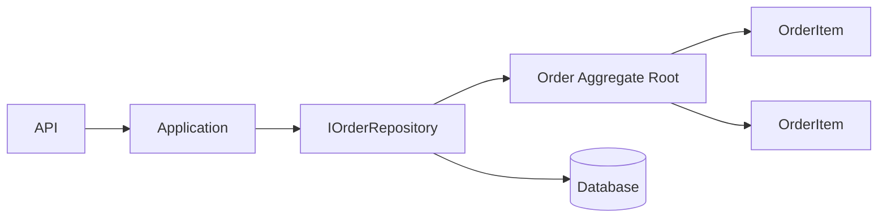
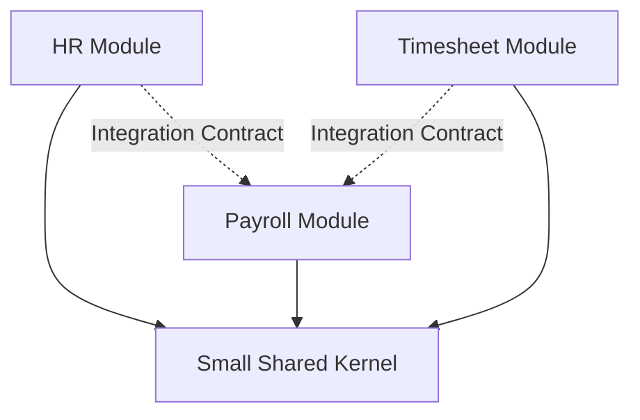
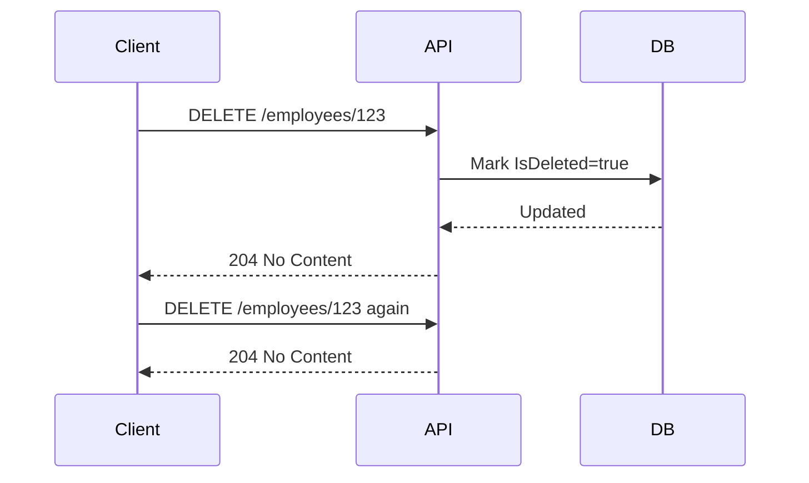
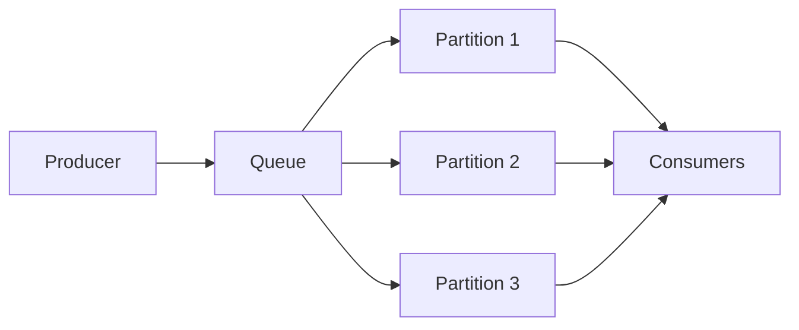
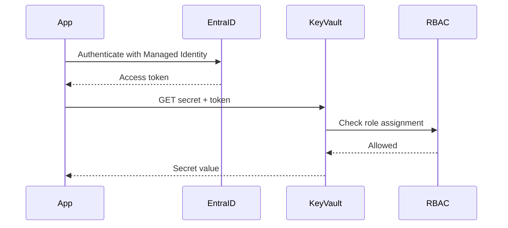
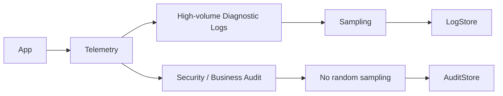
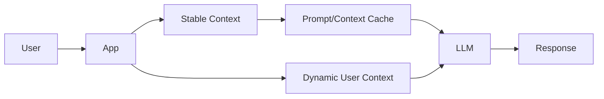
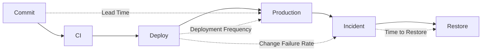

# Daily Knowledge Sharing — 17/08/2026

## Today’s Topics

1. DDD Aggregate Repository Boundary — Repository nên thao tác aggregate root, không phải mọi entity
2. Modular Monolith Shared Kernel — khi nào dùng chung model và khi nào nên duplicate có chủ đích
3. REST DELETE Semantics — hard delete, soft delete, idempotency và status code trong production API
4. PostgreSQL Composite Index Ordering — thứ tự cột quyết định index có thực sự giúp query hay không
5. Azure Service Bus Partitioning — scale throughput mà vẫn giữ ordering theo business key
6. Azure Key Vault RBAC vs Access Policy — quản lý quyền secret theo identity thay vì credential tĩnh
7. .NET GC Allocation Rate — vì sao nhiều allocation nhỏ có thể tạo latency spike dù memory chưa đầy
8. Observability Log Sampling vs Audit Logging — giảm chi phí telemetry mà không làm mất bằng chứng quan trọng
9. LLM Prompt Caching & Context Reuse — giảm token cost nhưng không được làm stale security context
10. DORA Metrics — đo delivery system để tìm bottleneck, không biến metric thành KPI ép đội ngũ

---

# 1. DDD Aggregate Repository Boundary — Repository nên thao tác aggregate root, không phải mọi entity

### 1. What is it?

Trong Domain-Driven Design, một **Aggregate** là một nhóm entity/value object có boundary nhất quán và được truy cập thông qua **Aggregate Root**. Repository thường nên được thiết kế theo Aggregate Root thay vì tạo repository cho mọi bảng hoặc mọi entity.

Ví dụ `Order` là aggregate root, còn `OrderItem` nằm bên trong aggregate. Application layer nên load `Order`, gọi `order.AddItem(...)`, rồi lưu lại `Order`; không nên có `IOrderItemRepository` cho phép sửa `OrderItem` độc lập nếu business invariant thuộc về `Order`.

### 2. Why does it exist?

Nếu mỗi entity có một repository riêng, code có vẻ linh hoạt nhưng rất dễ phá business invariant.

Ví dụ rule:

- tổng số lượng item không vượt giới hạn;
- order đã `Submitted` thì không được sửa item;
- total amount phải luôn khớp với item hiện có.

Nếu caller sửa trực tiếp `OrderItem`, các rule này có thể bị bypass.

Repository theo aggregate boundary giúp transaction boundary và consistency boundary khớp với business model.

### 3. How does it work?



Flow điển hình:

1. Application load `Order` bằng `IOrderRepository`.
2. Business change xảy ra thông qua method của aggregate root.
3. Aggregate tự bảo vệ invariant.
4. Unit of Work commit thay đổi trong một transaction.

### 4. Practical example

```csharp
public sealed class Order
{
    private readonly List<OrderItem> _items = [];
    public IReadOnlyCollection<OrderItem> Items => _items;

    public OrderStatus Status { get; private set; }

    public void AddItem(Guid productId, int quantity, decimal unitPrice)
    {
        if (Status != OrderStatus.Draft)
            throw new InvalidOperationException("Only draft orders can be changed.");

        if (quantity <= 0)
            throw new ArgumentOutOfRangeException(nameof(quantity));

        _items.Add(new OrderItem(productId, quantity, unitPrice));
    }
}

public interface IOrderRepository
{
    Task<Order?> GetAsync(Guid id, CancellationToken ct);
    Task AddAsync(Order order, CancellationToken ct);
}
```

Không cần `IOrderItemRepository` nếu `OrderItem` không có lifecycle độc lập.

### 5. Real production scenario

Trong hệ thống timesheet, `Timesheet` có thể là aggregate root chứa các `TimesheetEntry`. Khi employee submit timesheet, hệ thống cần bảo đảm toàn bộ entry hợp lệ trước khi đổi trạng thái.

Nếu mỗi entry bị sửa riêng sau khi timesheet đã approved, trạng thái business sẽ sai dù từng row database vẫn hợp lệ về mặt kỹ thuật.

### 6. Common mistakes

- Tạo repository cho mọi entity chỉ vì có table tương ứng.
- Aggregate quá lớn, load hàng nghìn child entity cho mọi request.
- Nhét logic query/reporting vào aggregate repository dù đó là read concern.
- Dùng aggregate boundary như transaction toàn hệ thống.
- Cho infrastructure update child entity trực tiếp để “tối ưu nhanh” nhưng phá invariant.

### 7. Trade-offs

**Advantages**

- Business invariant được bảo vệ tốt hơn.
- Transaction boundary rõ.
- Domain model ít bị thao tác tùy tiện.

**Costs / Risks**

- Aggregate quá lớn gây performance issue.
- Một số read query không phù hợp đi qua repository kiểu aggregate.
- Cần thiết kế boundary cẩn thận; không thể suy ra chỉ từ foreign key.

### 8. Junior → Middle → Senior understanding

**Junior**

Hiểu rằng repository không nhất thiết tương ứng 1:1 với table.

**Middle**

Biết load aggregate, thực thi behavior qua root và commit bằng EF Core transaction/Unit of Work.

**Senior / Technical Lead**

Biết chọn aggregate boundary dựa trên invariant, transaction frequency, contention và scalability; phân biệt write model với reporting query.

### 9. Key takeaway

- Repository nên bảo vệ aggregate boundary, không phải phản chiếu database schema.
- Child entity không nên có lifecycle độc lập nếu business không cho phép.
- Aggregate boundary quá lớn cũng nguy hiểm như boundary quá nhỏ.

---

# 2. Modular Monolith Shared Kernel — khi nào dùng chung model và khi nào nên duplicate có chủ đích

### 1. What is it?

Trong Modular Monolith, mỗi module nên sở hữu model, behavior và data của mình. Tuy nhiên đôi khi nhiều module cần dùng chung một số khái niệm rất ổn định như `Money`, `CountryCode`, `TenantId` hoặc contract kỹ thuật nhỏ. Phần dùng chung tối thiểu đó thường được gọi là **Shared Kernel**.

Shared Kernel không phải nơi để đặt mọi DTO, utility, entity và enum “dùng chung”. Nếu nó phình to, module boundary gần như biến mất.

### 2. Why does it exist?

Có hai cực đoan:

- Duplicate mọi thứ khiến cùng một primitive rule được implement khác nhau.
- Share mọi thứ khiến một thay đổi ở module A phá module B.

Shared Kernel tồn tại để dùng chung **những khái niệm thực sự ổn định**, còn những model mang meaning khác nhau giữa module nên được duplicate hoặc map qua contract.

### 3. How does it work?



Nguyên tắc tốt:

- Shared Kernel nhỏ.
- Không chứa entity persistence của module.
- Không chứa orchestration logic.
- Module giao tiếp bằng explicit contract/event/API.

### 4. Practical example

```csharp
// Shared Kernel
public readonly record struct TenantId(Guid Value);

public sealed record Money(decimal Amount, string Currency);
```

Nhưng không nên share:

```csharp
public class Employee
{
    public string Department { get; set; }
    public decimal Salary { get; set; }
    public decimal BillableRate { get; set; }
}
```

`Employee` trong HR, Payroll và Timesheet thường có meaning khác nhau.

### 5. Real production scenario

HR module sở hữu employee profile; Timesheet module chỉ cần `EmployeeId`, display name và employment status; Payroll cần compensation profile.

Nếu cả ba dùng chung một `Employee` entity, thay đổi salary field hoặc navigation property có thể lan xuyên toàn hệ thống.

Một design tốt hơn là từng module có model riêng, đồng bộ dữ liệu cần thiết bằng integration event.

### 6. Common mistakes

- Tạo project `Common` chứa hàng trăm class.
- Share EF Core entity giữa modules.
- Module A query thẳng DbContext của module B.
- Dùng shared enum cho business state khác meaning.
- Cho Shared Kernel phụ thuộc infrastructure framework.

### 7. Trade-offs

**Advantages**

- Giảm duplication cho primitive concept ổn định.
- Giữ code nhất quán với identity/value type nền tảng.

**Costs / Risks**

- Shared Kernel trở thành coupling hub.
- Release coordination tăng nếu thay đổi shared contract liên tục.
- Duplicate có chủ đích đôi khi an toàn hơn reuse.

### 8. Junior → Middle → Senior understanding

**Junior**

Hiểu “reuse code” không phải lúc nào cũng là tốt nhất.

**Middle**

Biết tách DTO/domain model theo module và map giữa integration contracts.

**Senior / Technical Lead**

Đánh giá coupling cost, ownership, change frequency và quyết định share hay duplicate theo business semantics.

### 9. Key takeaway

- Shared Kernel phải nhỏ và ổn định.
- Model giống tên chưa chắc giống meaning.
- Duplicate có chủ đích thường rẻ hơn coupling lâu dài.

---

# 3. REST DELETE Semantics — hard delete, soft delete, idempotency và status code trong production API

### 1. What is it?

`DELETE` trong REST thể hiện yêu cầu loại bỏ resource khỏi trạng thái mà client có thể truy cập theo URI hiện tại. Điều đó không bắt buộc database phải `DELETE FROM` thật sự.

Backend có thể hard delete, soft delete, archive hoặc enqueue deletion workflow, miễn API contract rõ ràng.

### 2. Why does it exist?

Một implementation ngây thơ thường làm:

```http
DELETE /users/123
```

→ xóa row ngay.

Nhưng production thường có audit, foreign key, retention, GDPR workflow, background cleanup hoặc dependency tới downstream systems.

Do đó cần tách **HTTP semantics** khỏi **physical persistence action**.

### 3. How does it work?

Một flow soft delete điển hình:



Tính idempotent nghĩa là gọi DELETE nhiều lần dẫn đến cùng final state.

### 4. Practical example

```csharp
app.MapDelete("/employees/{id:guid}", async (
    Guid id,
    AppDbContext db,
    CancellationToken ct) =>
{
    var employee = await db.Employees
        .SingleOrDefaultAsync(x => x.Id == id, ct);

    if (employee is null)
        return Results.NoContent();

    employee.IsDeleted = true;
    employee.DeletedAtUtc = DateTimeOffset.UtcNow;

    await db.SaveChangesAsync(ct);
    return Results.NoContent();
});
```

### 5. Real production scenario

Một SaaS cho phép customer delete project. API trả `202 Accepted` vì deletion cần:

- revoke access;
- delete files;
- remove search index;
- purge cache;
- schedule data deletion theo retention policy.

Client nhận operation ID để theo dõi tiến trình.

### 6. Common mistakes

- DELETE lần hai trả `500` vì row không còn tồn tại.
- Soft delete nhưng mọi query quên filter `IsDeleted`.
- Xóa hard ngay dữ liệu có audit/legal retention requirement.
- Trả `200` với body không có contract rõ.
- Delete synchronous dù cần gọi nhiều downstream chậm.

### 7. Trade-offs

**Advantages**

- HTTP contract rõ và có thể giữ idempotency.
- Soft delete hỗ trợ audit/restore.

**Costs / Risks**

- Soft delete làm query/index phức tạp hơn.
- Hard delete đơn giản nhưng recovery khó.
- Async deletion cần trạng thái workflow và observability.

### 8. Junior → Middle → Senior understanding

**Junior**

Hiểu DELETE là HTTP intent, không đồng nghĩa bắt buộc xóa row ngay.

**Middle**

Biết chọn `204`, `202`, xử lý idempotency và global query filter.

**Senior / Technical Lead**

Phải quyết định retention, audit, downstream cleanup, eventual consistency và deletion SLA.

### 9. Key takeaway

- DELETE nên idempotent về final state.
- HTTP semantics và persistence strategy là hai việc khác nhau.
- Chọn hard/soft/async delete theo business và compliance requirement.

---

# 4. PostgreSQL Composite Index Ordering — thứ tự cột quyết định index có thực sự giúp query hay không

### 1. What is it?

Composite index là index chứa nhiều cột, ví dụ:

```sql
CREATE INDEX ix_timesheet_employee_date
ON timesheet_entries(employee_id, work_date);
```

Trong B-tree, thứ tự cột rất quan trọng. Index `(employee_id, work_date)` không hoàn toàn tương đương `(work_date, employee_id)`.

### 2. Why does it exist?

Một lỗi phổ biến là thấy query filter hai cột rồi tạo index chứa cả hai mà không xét selectivity, sort order và predicate pattern.

Index sai thứ tự có thể vẫn tồn tại nhưng optimizer không dùng hiệu quả, dẫn tới scan nhiều page.

### 3. How does it work?

Với index:

```text
(employee_id, work_date)
```

query sau phù hợp:

```sql
WHERE employee_id = 42
  AND work_date >= DATE '2026-08-01'
```

vì database có thể seek theo `employee_id`, sau đó range scan theo `work_date`.

Nhưng query chỉ filter:

```sql
WHERE work_date >= DATE '2026-08-01'
```

thì leading column `employee_id` không được constrain, index có thể kém hữu ích.

### 4. Practical example

Bad assumption:

```sql
CREATE INDEX ix_entries_date_employee
ON timesheet_entries(work_date, employee_id);
```

Nếu workload chính là:

```sql
SELECT id, hours
FROM timesheet_entries
WHERE employee_id = $1
  AND work_date BETWEEN $2 AND $3
ORDER BY work_date;
```

thì thường hợp lý hơn:

```sql
CREATE INDEX ix_entries_employee_date
ON timesheet_entries(employee_id, work_date)
INCLUDE (hours);
```

Sau đó kiểm tra bằng:

```sql
EXPLAIN (ANALYZE, BUFFERS)
SELECT ...;
```

### 5. Real production scenario

Một timesheet table có hàng chục triệu row. API lấy dữ liệu theo employee + date range.

Nếu index leading column là `work_date`, database có thể scan rất nhiều employee trong cùng khoảng thời gian. Đổi thứ tự thành `(employee_id, work_date)` giảm đáng kể page đọc.

### 6. Common mistakes

- Tạo index theo thứ tự cột trong WHERE thay vì access pattern.
- Không xem `ORDER BY`.
- Đưa quá nhiều cột vào key thay vì `INCLUDE`.
- Tạo duplicate index với prefix giống nhau.
- Không đo write overhead sau khi thêm index.

### 7. Trade-offs

**Advantages**

- Đúng ordering giúp query seek/range scan hiệu quả.
- Có thể hỗ trợ sort và covering query.

**Costs / Risks**

- Index lớn làm INSERT/UPDATE chậm hơn.
- Một index khó tối ưu cho mọi access pattern.
- Data distribution thay đổi có thể làm plan thay đổi.

### 8. Junior → Middle → Senior understanding

**Junior**

Biết composite index có thứ tự, không phải tập hợp cột vô thứ tự.

**Middle**

Biết dùng `EXPLAIN ANALYZE`, đo buffers và match index với predicate.

**Senior / Technical Lead**

Cân bằng read/write workload, selectivity, index size, maintenance cost và competing query patterns.

### 9. Key takeaway

- Leading column rất quan trọng với B-tree composite index.
- Thiết kế index dựa trên query pattern, không dựa trên cảm giác.
- Luôn đo execution plan trước và sau thay đổi.

---

# 5. Azure Service Bus Partitioning — scale throughput mà vẫn giữ ordering theo business key

### 1. What is it?

Partitioning cho phép Azure Service Bus phân phối message qua nhiều broker fragment để tăng availability và throughput. Tuy nhiên ordering không tự nhiên được bảo đảm toàn cục.

Nếu business cần ordering theo một key như `OrderId`, cần kết hợp partition/session strategy phù hợp.

### 2. Why does it exist?

Một queue đơn logic vẫn cần scale backend storage/broker. Nếu mọi message phải đi qua một physical partition, throughput và fault domain bị giới hạn.

Nhưng scale bằng nhiều partition tạo bài toán ordering: message A và B có thể được xử lý trên các partition khác nhau.

### 3. How does it work?



Nếu cần ordering theo business key, có thể dùng session ID:

```text
SessionId = OrderId
```

Messages cùng session được xử lý tuần tự bởi một session receiver tại một thời điểm.

### 4. Practical example

```csharp
var message = new ServiceBusMessage(BinaryData.FromObjectAsJson(@event))
{
    SessionId = orderId.ToString(),
    MessageId = eventId.ToString()
};

await sender.SendMessageAsync(message, cancellationToken);
```

Consumer bật session-aware processor.

### 5. Real production scenario

Order workflow phát các event:

1. `OrderCreated`
2. `PaymentConfirmed`
3. `OrderCancelled`

Nếu `OrderCancelled` xử lý trước `PaymentConfirmed`, state có thể sai. Ordering theo `OrderId` hữu ích, nhưng không cần ép toàn bộ hệ thống có global order.

### 6. Common mistakes

- Giả định queue luôn global FIFO.
- Dùng session ID quá ít giá trị, tạo hot session.
- Xử lý session quá lâu làm throughput giảm.
- Không thiết kế idempotency dù có ordering.
- Dùng partitioning như thay thế cho retry/DLQ.

### 7. Trade-offs

**Advantages**

- Scale broker tốt hơn.
- Có thể giữ ordering theo business key khi dùng sessions.

**Costs / Risks**

- Ordering làm giảm parallelism theo key.
- Hot key tạo bottleneck.
- Thiết kế message contract và consumer phức tạp hơn.

### 8. Junior → Middle → Senior understanding

**Junior**

Hiểu queue có thể được xử lý song song và không nên giả định mọi message theo thứ tự toàn cục.

**Middle**

Biết dùng `SessionId`, `MessageId`, duplicate protection và DLQ.

**Senior / Technical Lead**

Phải quyết định ordering scope, throughput, hot partition, retry semantics và failure recovery.

### 9. Key takeaway

- Global ordering thường không cần thiết và rất đắt.
- Nếu cần ordering, hãy giữ theo business key.
- Ordering không thay thế idempotency.

---

# 6. Azure Key Vault RBAC vs Access Policy — quản lý quyền secret theo identity thay vì credential tĩnh

### 1. What is it?

Azure Key Vault hỗ trợ hai mô hình permission phổ biến: legacy **Access Policy** và **Azure RBAC**. Với RBAC, quyền truy cập secret/key/certificate được cấp cho identity thông qua role assignment.

Trong workload hiện đại, Managed Identity + RBAC thường giúp governance thống nhất hơn.

### 2. Why does it exist?

Hard-code secret hoặc lưu credential trong app settings tạo rủi ro lớn:

- secret bị leak trong source/config/log;
- rotation khó;
- audit yếu;
- một credential bị lộ có thể dùng ngoài workload dự kiến.

Identity-based access giúp app chứng minh “tôi là ai” thay vì mang secret dài hạn.

### 3. How does it work?



### 4. Practical example

```csharp
var client = new SecretClient(
    new Uri(configuration["KeyVaultUri"]!),
    new DefaultAzureCredential());

KeyVaultSecret secret = await client.GetSecretAsync("GraphClientSecret");
```

Production workload dùng Managed Identity; local development có thể dùng Azure CLI/Visual Studio credential chain.

### 5. Real production scenario

Một App Service gọi Exchange Online automation cần secret hoặc certificate. App Service Managed Identity được cấp đúng role chỉ trên Key Vault cần thiết.

Developer không cần biết secret value, và secret có thể rotate mà không commit code.

### 6. Common mistakes

- Cấp role quá rộng như Owner/Contributor.
- Confuse management-plane role với data-plane role.
- Dùng Access Policy và RBAC lẫn lộn không có governance rõ.
- Cho app đọc toàn bộ secret thay vì chỉ vault/workload cần thiết.
- Không cấu hình private networking khi security requirement cần.

### 7. Trade-offs

**Advantages**

- Không cần credential tĩnh trong app.
- Audit/role management thống nhất.
- Rotation dễ hơn.

**Costs / Risks**

- RBAC propagation có độ trễ ngắn.
- Dependency vào Entra ID/Key Vault availability.
- Network/private endpoint/DNS có thể làm troubleshooting khó.

### 8. Junior → Middle → Senior understanding

**Junior**

Hiểu secret không nên hard-code và app nên dùng identity.

**Middle**

Biết cấu hình Managed Identity, RBAC và `DefaultAzureCredential`.

**Senior / Technical Lead**

Thiết kế least privilege, network boundary, break-glass access, audit và rotation workflow.

### 9. Key takeaway

- Ưu tiên identity-based access thay vì secret tĩnh.
- Phân biệt data-plane và management-plane permissions.
- Least privilege + audit quan trọng hơn việc “app truy cập được”.

---

# 7. .NET GC Allocation Rate — vì sao nhiều allocation nhỏ có thể tạo latency spike dù memory chưa đầy

### 1. What is it?

Allocation rate là tốc độ application tạo object mới trên managed heap. Một service có thể chỉ dùng vài trăm MB memory nhưng vẫn có performance kém nếu tạo object với tốc độ rất cao khiến GC chạy liên tục.

Vấn đề không chỉ là “memory leak”; **allocation pressure** cũng quan trọng.

### 2. Why does it exist?

Trong .NET, allocation thường rất nhanh, nên developer dễ bỏ qua chi phí. Nhưng mỗi object cuối cùng phải được GC xem xét.

Hot path có hàng nghìn request/second, mỗi request tạo nhiều array/string/DTO tạm thời, có thể gây Gen0/Gen1 collection liên tục và làm p99 latency tăng.

### 3. How does it work?

Flow điều tra đúng:

```text
Latency spike
→ inspect GC metrics
→ measure allocation/sec
→ profile hot allocations
→ reduce avoidable objects
→ benchmark
→ measure again
```

Không nên bắt đầu bằng object pooling mọi thứ.

### 4. Practical example

Bad:

```csharp
var csv = string.Join(",", items.Select(x => x.Name.Trim().ToLowerInvariant()));
```

Nếu hot path, đoạn này có thể tạo nhiều intermediate string/enumerator.

Một hướng tối ưu có thể là giảm transform không cần thiết, cache normalized value, hoặc dùng streaming writer thay vì build toàn bộ string lớn trong memory.

Theo dõi bằng:

```bash
dotnet-counters monitor System.Runtime
```

Quan sát `alloc-rate`, `gc-heap-size`, `gen-0-gc-count`, `time-in-gc`.

### 5. Real production scenario

API export 20k timesheet rows sang JSON. CPU chỉ 50%, memory 700 MB nhưng p99 tăng mạnh.

Profiler cho thấy serialization tạo nhiều temporary string và large byte arrays. Giảm payload shape, stream response và tránh duplicate projection giúp giảm allocation/sec đáng kể.

### 6. Common mistakes

- Chỉ nhìn total memory mà bỏ qua allocation rate.
- Dùng `GC.Collect()` thủ công.
- Pool object nhỏ không đáng pool.
- Tối ưu micro-allocation trước khi profile.
- Không phân biệt Gen0 pressure và LOH issue.

### 7. Trade-offs

**Advantages**

- Giảm GC frequency và tail latency.
- Có thể giảm CPU cost.

**Costs / Risks**

- Code tối ưu allocation có thể khó đọc hơn.
- Pooling sai tạo memory retention và concurrency bug.
- Không phải allocation nào cũng đáng tối ưu.

### 8. Junior → Middle → Senior understanding

**Junior**

Hiểu managed memory vẫn có cost và object ngắn hạn vẫn ảnh hưởng GC.

**Middle**

Biết dùng counters/profiler để tìm allocation hot path.

**Senior / Technical Lead**

Biết cân bằng readability, throughput, p99 latency, pooling strategy và GC behavior theo workload.

### 9. Key takeaway

- Memory chưa đầy không có nghĩa GC không phải bottleneck.
- Đo allocation/sec và time-in-GC.
- Profile trước, tối ưu sau.

---

# 8. Observability Log Sampling vs Audit Logging — giảm chi phí telemetry mà không làm mất bằng chứng quan trọng

### 1. What is it?

**Log sampling** giảm số lượng log telemetry được lưu, thường áp dụng với event có volume cao. **Audit logging** lại có mục tiêu khác: lưu lại bằng chứng về hành động security/business quan trọng và thường không được sample ngẫu nhiên.

Hai loại log không nên bị trộn chung lifecycle.

### 2. Why does it exist?

Production có thể tạo hàng trăm triệu log/day. Lưu tất cả rất đắt và làm search chậm.

Nhưng nếu sample cả audit event, ta có thể mất bằng chứng ai đã thay đổi role, xóa dữ liệu hoặc reset credential.

### 3. How does it work?



### 4. Practical example

Diagnostic log:

```csharp
logger.LogInformation(
    "Loaded {Count} timesheet rows for employee {EmployeeId}",
    rows.Count,
    employeeId);
```

Audit log:

```csharp
logger.LogWarning(
    "RoleChanged UserId={UserId} ActorId={ActorId} OldRole={OldRole} NewRole={NewRole}",
    userId, actorId, oldRole, newRole);
```

Audit event nên có schema ổn định và retention riêng.

### 5. Real production scenario

Một SaaS bật 10% sampling cho request diagnostics để giảm Application Insights cost. Tuy nhiên các event như `PermissionChanged`, `InvoiceApproved`, `EmployeeOffboarded` được gửi sang audit sink riêng và giữ 100%.

### 6. Common mistakes

- Sample mọi log bằng cùng rule.
- Dùng application log thường như audit log.
- Log PII/secret vào audit event.
- Không có immutable/retention requirement cho audit.
- Không thêm correlation ID/user identity cần thiết.

### 7. Trade-offs

**Advantages**

- Sampling giảm telemetry cost đáng kể.
- Audit riêng giúp compliance và incident investigation đáng tin cậy.

**Costs / Risks**

- Nhiều pipeline/log sink hơn.
- Sampling có thể làm mất low-frequency diagnostic pattern.
- Audit retention dài tăng storage cost.

### 8. Junior → Middle → Senior understanding

**Junior**

Hiểu không phải log nào cũng có cùng mục đích.

**Middle**

Biết structured log, sampling rule và correlation.

**Senior / Technical Lead**

Thiết kế telemetry retention, compliance boundary, cost model và data classification.

### 9. Key takeaway

- Diagnostic log có thể sample; audit evidence thường không.
- Tách mục đích, schema và retention của hai loại log.
- Sampling là cost-control tool, không phải excuse để mất observability quan trọng.

---

# 9. LLM Prompt Caching & Context Reuse — giảm token cost nhưng không được làm stale security context

### 1. What is it?

Prompt caching/context reuse là kỹ thuật tái sử dụng phần prompt/context ổn định giữa nhiều request để giảm token processing, latency hoặc cost.

Ví dụ system instruction dài, policy text hoặc document context ít thay đổi có thể được cache theo cơ chế của provider hoặc application layer.

### 2. Why does it exist?

AI workflow production thường gửi lặp lại hàng nghìn token giống nhau ở mỗi request. Điều này:

- tăng cost;
- tăng latency;
- làm throughput giảm.

Nhưng cache context sai có thể gây vấn đề nghiêm trọng nếu quyền người dùng hoặc dữ liệu thay đổi.

### 3. How does it work?



Tách context thành:

- stable: system policy, static knowledge;
- dynamic: user identity, authorization, recent state;
- sensitive: phải validate lại trước tool execution.

### 4. Practical example

```csharp
var stableContextKey = $"policy:{policyVersion}";
var stableContext = await cache.GetStringAsync(stableContextKey, ct);

var request = new AiRequest
{
    StableContext = stableContext,
    UserContext = new
    {
        UserId = user.Id,
        AllowedProjectIds = allowedProjectIds
    },
    Question = question
};
```

Không cache `AllowedProjectIds` lâu dài nếu permission có thể thay đổi.

### 5. Real production scenario

AI assistant cho tài liệu nội bộ có system prompt 8k token và policy guide 12k token. Phần ổn định được cache/reuse, nhưng authorization filter cho document retrieval luôn được tính lại theo request hiện tại.

Kết quả: cost giảm mà không dùng stale permission data.

### 6. Common mistakes

- Cache toàn bộ prompt bao gồm user-specific permission.
- Không version cache khi prompt thay đổi.
- Không invalidate khi document/policy đổi.
- Dùng cache output của LLM cho câu hỏi security-sensitive không có key đúng context.
- Chỉ tối ưu token mà bỏ qua correctness.

### 7. Trade-offs

**Advantages**

- Giảm latency và cost.
- Tăng throughput.

**Costs / Risks**

- Cache invalidation phức tạp.
- Stale context có thể tạo security bug.
- Provider-specific caching behavior có thể gây coupling.

### 8. Junior → Middle → Senior understanding

**Junior**

Hiểu token lặp lại có cost và context có thể tách stable/dynamic.

**Middle**

Biết version key, TTL và invalidate cache.

**Senior / Technical Lead**

Thiết kế security boundary, cost model, provider abstraction và correctness strategy cho cached context.

### 9. Key takeaway

- Cache phần ổn định, không cache mù toàn bộ context.
- Permission/security context phải fresh đủ mức business yêu cầu.
- Versioning và invalidation quan trọng như chính caching.

---

# 10. DORA Metrics — đo delivery system để tìm bottleneck, không biến metric thành KPI ép đội ngũ

### 1. What is it?

DORA metrics là nhóm chỉ số giúp quan sát khả năng delivery của engineering system. Các metric thường được dùng gồm deployment frequency, lead time for changes, change failure rate và time to restore service.

Giá trị lớn nhất của chúng là giúp nhìn **hệ thống delivery**, không phải chấm điểm từng developer.

### 2. Why does it exist?

Nếu chỉ đo số story point, số commit hoặc số dòng code, team dễ tối ưu hành vi sai.

DORA metrics tập trung vào câu hỏi thực tế hơn:

- thay đổi đi từ code đến production mất bao lâu?
- deploy có thường xuyên không?
- bao nhiêu deploy gây sự cố?
- khi fail, phục hồi mất bao lâu?

### 3. How does it work?



Metric nên được trend theo thời gian và dùng để tìm bottleneck của flow.

### 4. Practical example

Một team có:

- deploy 1 lần/2 tuần;
- lead time 9 ngày;
- change failure rate 5%;
- restore time 20 phút.

Failure rate thấp, restore tốt, nhưng lead time quá dài. Root cause có thể là manual approval, test environment chậm hoặc release batching, không nhất thiết là developer code chậm.

### 5. Real production scenario

Backend team chuyển từ release lớn mỗi 2 tuần sang deploy nhỏ hàng ngày. Deployment frequency tăng, lead time giảm, nhưng change failure rate tăng mạnh.

Senior/Lead không kết luận “deploy nhiều là xấu”; họ kiểm tra test coverage, feature flag, rollback automation và release guardrails.

### 6. Common mistakes

- Dùng DORA để xếp hạng developer.
- Ép deployment frequency tăng bằng cách chia release giả tạo.
- Không định nghĩa thế nào là failed change.
- Chỉ nhìn một metric riêng lẻ.
- Không phân tích theo loại service/workload.

### 7. Trade-offs

**Advantages**

- Cho góc nhìn end-to-end về delivery.
- Giúp tìm process bottleneck.
- Kết nối engineering với production reliability.

**Costs / Risks**

- Định nghĩa metric không nhất quán tạo dữ liệu sai.
- KPI hóa gây gaming behavior.
- Cross-team comparison thiếu context dễ dẫn đến kết luận sai.

### 8. Junior → Middle → Senior understanding

**Junior**

Hiểu delivery không kết thúc khi code merge; production outcome mới quan trọng.

**Middle**

Biết đọc lead time, failure rate, restore time và liên hệ với CI/CD flow.

**Senior / Technical Lead**

Dùng metric để cải tiến hệ thống, tìm constraint, đánh giá release strategy và tránh tạo incentive méo mó.

### 9. Key takeaway

- DORA metrics đo delivery system, không đo giá trị cá nhân.
- Luôn đọc các metric cùng nhau.
- Mục tiêu là tìm bottleneck và cải thiện feedback loop, không chạy theo con số.