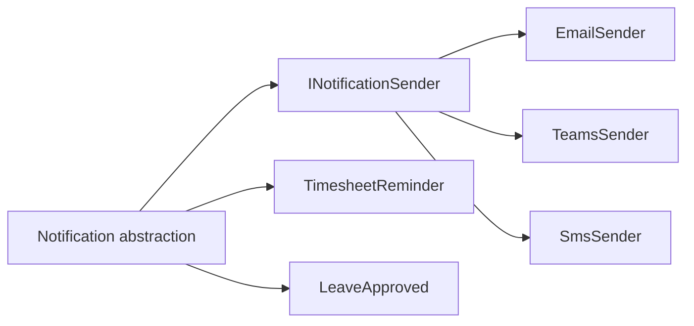
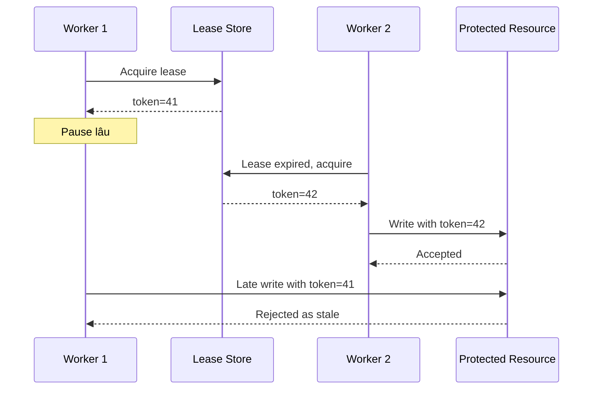
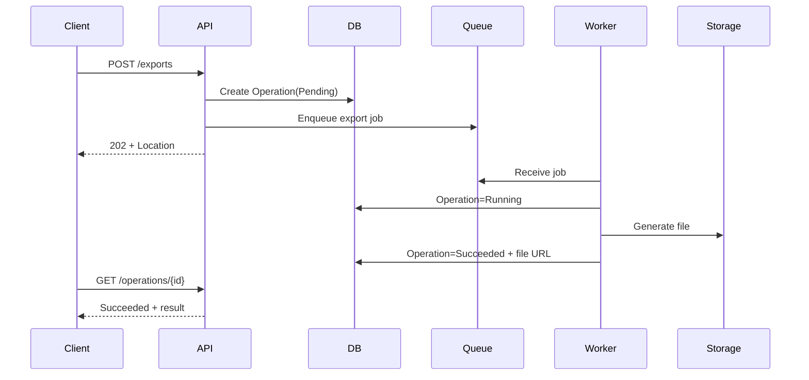
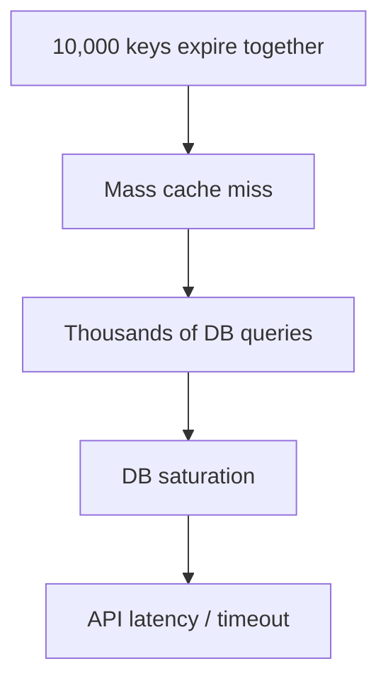
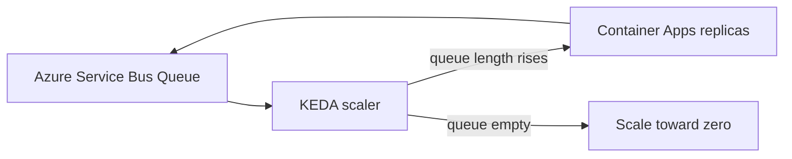
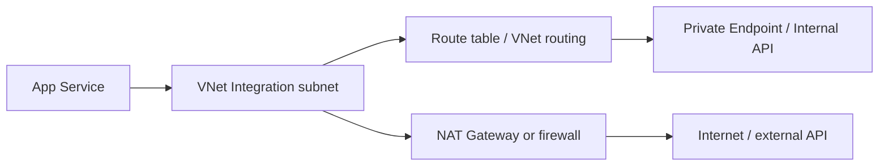
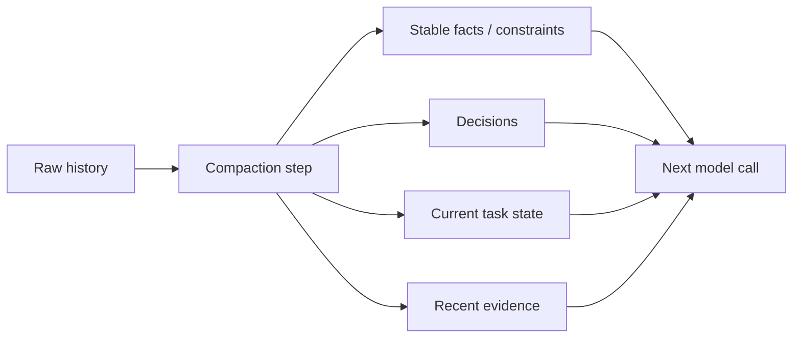
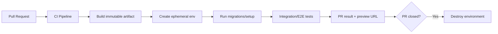

# Daily Knowledge Sharing — 17/08/2026

## Today’s Topics

1. Bridge Pattern — tách abstraction khỏi implementation để tránh bùng nổ class khi có nhiều chiều thay đổi
2. Distributed Lease + Fencing Token — coordination an toàn hơn khi worker có thể mất lock nhưng vẫn tiếp tục chạy
3. HTTP 202 Accepted + Operation Resource — thiết kế API cho tác vụ dài hạn mà không giữ request mở
4. EF Core Transaction Savepoint — rollback một phần trong transaction mà không phải hủy toàn bộ unit of work
5. Cache TTL Jitter — tránh hàng nghìn key hết hạn cùng lúc và tạo “thundering herd” lên database
6. Azure Container Apps Scale-to-Zero với Queue/KEDA — scale theo workload nhưng vẫn kiểm soát cold start và concurrency
7. Azure VNet Integration & Outbound Routing — hiểu đường đi outbound của App Service trước khi đổ lỗi cho firewall
8. USE Method — điều tra CPU, memory, thread pool, connection pool theo Utilization, Saturation, Errors
9. AI Context Compaction — nén hội thoại dài mà không làm mất constraint, state và security boundary
10. Ephemeral Environment trong CI/CD — tạo môi trường tạm theo PR để test integration trước khi merge

---

# 1. Bridge Pattern — tách abstraction khỏi implementation để tránh bùng nổ class khi có nhiều chiều thay đổi

### 1. What is it?

Bridge Pattern tách một abstraction cấp cao khỏi implementation thấp hơn bằng composition. Mục tiêu là để hai phía có thể thay đổi độc lập.

Một dấu hiệu kinh điển là hệ thống có **hai hoặc nhiều chiều biến thiên**. Ví dụ hệ thống notification có các loại message `TimesheetReminder`, `LeaveApproved`, `SecurityAlert`; đồng thời có nhiều channel `Email`, `Teams`, `SMS`, `Push`.

Nếu dùng inheritance theo mọi tổ hợp, rất nhanh sẽ xuất hiện:

```text
EmailTimesheetReminder
TeamsTimesheetReminder
SmsTimesheetReminder
EmailLeaveApproved
TeamsLeaveApproved
SmsLeaveApproved
...
```

Bridge thay thế ma trận class đó bằng hai hierarchy hoặc abstraction độc lập:



### 2. Why does it exist?

Inheritance giải quyết tốt biến thể theo **một trục**, nhưng trở nên khó kiểm soát khi nhiều chiều thay đổi cùng lúc.

Không có Bridge, mỗi lần thêm channel mới có thể phải tạo class cho mọi loại notification. Mỗi lần thêm loại notification mới lại phải nhân với số channel hiện có.

Naive solution thường dẫn đến:

- class explosion;
- duplicated logic;
- `switch` lồng nhau theo type + channel;
- thay đổi một chiều kéo theo sửa chiều còn lại;
- khó test business behavior độc lập khỏi transport.

### 3. How does it work?

Abstraction giữ business intent. Implementation interface giữ technical capability.

```text
Business abstraction
        │
        ▼
Implementation contract
        │
   ┌────┼────┐
   ▼    ▼    ▼
 Email Teams SMS
```

Abstraction không cần biết SDK nào được dùng để gửi message. Nó chỉ cần biết contract như `SendAsync`.

### 4. Practical example

```csharp
public interface INotificationSender
{
    Task SendAsync(string recipient, string subject, string body,
        CancellationToken cancellationToken);
}

public abstract class Notification
{
    protected readonly INotificationSender Sender;

    protected Notification(INotificationSender sender)
    {
        Sender = sender;
    }

    public abstract Task SendAsync(
        string recipient,
        CancellationToken cancellationToken);
}

public sealed class TimesheetReminder : Notification
{
    public TimesheetReminder(INotificationSender sender) : base(sender) { }

    public override Task SendAsync(
        string recipient,
        CancellationToken cancellationToken)
    {
        return Sender.SendAsync(
            recipient,
            "Missing timesheet",
            "Please submit your timesheet before 17:00.",
            cancellationToken);
    }
}
```

`EmailNotificationSender` có thể dùng Microsoft Graph; `TeamsNotificationSender` có thể dùng webhook hoặc Graph API. Business abstraction không đổi.

### 5. Real production scenario

Một hệ thống employee management gửi:

- reminder chấm công;
- leave approval;
- offboarding warning;
- security alert.

Ban đầu chỉ gửi email. Sau đó business muốn Teams cho internal notification, SMS cho security alert.

Bridge cho phép thêm implementation mới mà không duplicate từng business flow.

### 6. Common mistakes

- Dùng Bridge cho trường hợp chỉ có một chiều thay đổi, làm code phức tạp vô ích.
- Để abstraction gọi method đặc thù của implementation, làm mất mục đích tách biệt.
- Interface implementation quá rộng, ví dụ một `INotificationSender` chứa `SendSms`, `SendEmail`, `SendTeams`.
- Nhầm Bridge với Strategy. Strategy chủ yếu thay đổi thuật toán; Bridge nhắm tới tách hai abstraction hierarchy có lifecycle thay đổi độc lập.
- Để SDK exception tràn trực tiếp vào domain/application layer.

### 7. Trade-offs

**Advantages**

- Giảm số lượng class theo tổ hợp.
- Hai chiều thay đổi độc lập.
- Test business logic dễ hơn.
- Thay transport/SDK ít ảnh hưởng business code.

**Costs / Risks**

- Tăng abstraction và DI wiring.
- Có thể overengineering nếu chỉ có 1–2 biến thể cố định.
- Debug flow gián tiếp hơn vì behavior qua nhiều object.

### 8. Junior → Middle → Senior understanding

**Junior**

Hiểu composition thường linh hoạt hơn inheritance khi nhiều behavior cần kết hợp.

**Middle**

Biết nhận diện class explosion, thiết kế interface implementation nhỏ và inject đúng dependency.

**Senior / Technical Lead**

Phải phân biệt khi nào Bridge thực sự giải quyết independent dimensions of change, khi nào Strategy/Adapter đơn giản hơn, và kiểm soát boundary để business layer không phụ thuộc SDK.

### 9. Key takeaway

- Bridge hữu ích khi có nhiều chiều biến thiên độc lập.
- Tách business abstraction khỏi technical implementation.
- Không dùng pattern chỉ để “đẹp architecture”.

---

# 2. Distributed Lease + Fencing Token — coordination an toàn hơn khi worker có thể mất lock nhưng vẫn tiếp tục chạy

### 1. What is it?

Distributed lease là một dạng lock có thời hạn. Worker giữ quyền xử lý resource trong một khoảng thời gian và phải renew nếu muốn tiếp tục.

Nhưng lease một mình chưa đủ an toàn. Một worker có thể bị GC pause, network partition hoặc scheduler freeze; lease hết hạn, worker khác lấy lock mới, trong khi worker cũ tỉnh lại và vẫn tiếp tục ghi dữ liệu.

**Fencing token** giải quyết tình huống đó bằng một số thứ tự tăng dần. Mỗi lần lease được cấp mới, token tăng. Resource downstream chỉ chấp nhận operation có token mới hơn token cuối cùng đã thấy.



### 2. Why does it exist?

Naive distributed lock giả định rằng “mất lock thì process sẽ biết ngay và dừng”. Trong distributed system, giả định đó không luôn đúng.

Các failure mode thực tế:

- process stop-the-world do GC;
- network split;
- thread starvation;
- VM suspend/resume;
- lock renewal request timeout nhưng worker không biết lease đã mất.

Nếu worker cũ vẫn ghi dữ liệu, có thể xuất hiện duplicate payment, file overwrite hoặc state regression.

### 3. How does it work?

Flow điển hình:

1. Worker acquire lease.
2. Lease service cấp token tăng dần, ví dụ `1007`.
3. Worker mang token trong mọi write tới protected resource.
4. Resource lưu `lastAcceptedToken`.
5. Operation có token nhỏ hơn bị reject.

Điểm quan trọng: fencing phải được enforce **ở nơi side effect xảy ra**, không chỉ ở lock service.

### 4. Practical example

Giả sử background worker xử lý một batch payroll:

```csharp
public async Task ApplyPayrollAsync(
    Guid payrollId,
    long fencingToken,
    CancellationToken ct)
{
    var payroll = await db.Payrolls
        .SingleAsync(x => x.Id == payrollId, ct);

    if (fencingToken <= payroll.LastFencingToken)
        throw new InvalidOperationException("Stale worker detected.");

    payroll.Status = PayrollStatus.Processed;
    payroll.LastFencingToken = fencingToken;

    await db.SaveChangesAsync(ct);
}
```

Trong hệ thống thực, update nên atomic, ví dụ conditional SQL:

```sql
UPDATE Payroll
SET Status = 'Processed',
    LastFencingToken = @token
WHERE Id = @id
  AND LastFencingToken < @token;
```

### 5. Real production scenario

Hai instance background worker cùng xử lý một employee offboarding job.

Worker A giữ lease nhưng bị pause 60 giây. Lease 30 giây hết hạn, Worker B nhận token mới và hoàn tất Exchange Online operation. Worker A tỉnh lại.

Nếu chỉ dựa vào distributed lock, A có thể chạy tiếp và ghi trạng thái cũ. Với fencing token, write của A bị từ chối.

### 6. Common mistakes

- Chỉ dùng Redis `SET NX` rồi tin rằng lock tuyệt đối an toàn.
- Không có lease timeout hoặc renewal strategy.
- Có fencing token nhưng downstream resource không validate.
- Dùng timestamp làm token dù clock giữa node không đồng bộ.
- Renew lease bằng task fire-and-forget không quan sát failure.
- Giữ distributed lock quá lâu cho workflow có external API chậm.

### 7. Trade-offs

**Advantages**

- Chống stale owner hiệu quả hơn lock đơn thuần.
- Phù hợp hệ thống multi-instance có side effect quan trọng.
- Có thể reason rõ ràng về ownership version.

**Costs / Risks**

- Resource phải hỗ trợ conditional write/token validation.
- Tăng complexity của state model.
- Không thay thế idempotency cho external API không hỗ trợ fencing.

### 8. Junior → Middle → Senior understanding

**Junior**

Hiểu lock trong distributed system không giống `lock {}` trong một process.

**Middle**

Biết lease có expiry/renewal và hiểu stale worker có thể tiếp tục chạy.

**Senior / Technical Lead**

Phải thiết kế fencing ở side-effect boundary, đánh giá external system có hỗ trợ conditional operation hay không, và kết hợp lease với idempotency, retries, observability.

### 9. Key takeaway

- Lease hết hạn không đồng nghĩa worker cũ đã dừng.
- Fencing token bảo vệ resource khỏi stale owner.
- Enforcement phải nằm ở nơi mutation thật sự xảy ra.

---

# 3. HTTP 202 Accepted + Operation Resource — thiết kế API cho tác vụ dài hạn mà không giữ request mở

### 1. What is it?

`202 Accepted` dùng khi server **đã nhận request nhưng chưa hoàn tất xử lý**.

Thay vì client giữ một HTTP connection vài phút, API tạo một operation resource để client theo dõi trạng thái.

Ví dụ:

```http
POST /exports
202 Accepted
Location: /operations/8f4f...
```

Client sau đó gọi:

```http
GET /operations/8f4f...
```

và nhận `Pending`, `Running`, `Succeeded`, `Failed`.

### 2. Why does it exist?

Một request đồng bộ quá dài gây nhiều vấn đề:

- reverse proxy timeout;
- client retry vì không biết server đã xử lý chưa;
- giữ connection/thread/resource lâu;
- khó scale background work;
- user experience không rõ progress.

Naive approach “tăng timeout lên 10 phút” chỉ đẩy failure boundary ra xa hơn.

### 3. How does it work?



Operation resource là một first-class resource có lifecycle rõ ràng.

### 4. Practical example

ASP.NET Core:

```csharp
app.MapPost("/reports/export", async (
    ExportRequest request,
    AppDbContext db,
    IBackgroundTaskQueue queue,
    CancellationToken ct) =>
{
    var operation = new ExportOperation
    {
        Id = Guid.NewGuid(),
        Status = "Pending",
        CreatedAtUtc = DateTime.UtcNow
    };

    db.ExportOperations.Add(operation);
    await db.SaveChangesAsync(ct);

    await queue.EnqueueAsync(
        new ExportJob(operation.Id, request), ct);

    return Results.Accepted(
        $"/operations/{operation.Id}",
        new { operation.Id, operation.Status });
});
```

### 5. Real production scenario

Một timesheet system cần export 3 triệu record thành Excel/CSV.

Nếu API generate file trực tiếp, request có thể timeout sau 100 giây. Client retry và tạo thêm hai export giống nhau.

Với 202 pattern:

- API nhanh chóng trả operation ID;
- worker xử lý async;
- UI poll hoặc nhận SignalR notification;
- result lưu ở Blob Storage;
- operation có expiry/cleanup.

### 6. Common mistakes

- Trả `202` nhưng không có cách nào kiểm tra trạng thái.
- Dùng `Task.Run` trong request process thay vì durable queue.
- Không lưu operation trước khi enqueue, khiến job tồn tại nhưng client không có state.
- Không có idempotency cho `POST`, client retry tạo nhiều operation.
- Không phân biệt `Failed` có retryable hay terminal.
- Expose internal exception/stack trace trong operation result.

### 7. Trade-offs

**Advantages**

- Không giữ HTTP request lâu.
- Scale worker độc lập API.
- Có progress/status rõ ràng.
- Tăng resilience cho tác vụ dài.

**Costs / Risks**

- Cần operation persistence, queue, cleanup.
- Client phức tạp hơn vì phải poll/callback.
- Cần policy retention cho operation state.

### 8. Junior → Middle → Senior understanding

**Junior**

Hiểu `202` không có nghĩa request đã hoàn thành.

**Middle**

Biết thiết kế operation endpoint, queue worker, trạng thái và error contract.

**Senior / Technical Lead**

Phải quyết định polling vs push, idempotency, cancellation, retry model, retention, auth của operation resource và consistency giữa DB/queue.

### 9. Key takeaway

- Tác vụ dài nên tách acceptance khỏi completion.
- `202 + Location` tạo contract rõ ràng cho asynchronous API.
- Durable queue và operation state quan trọng hơn việc chỉ đổi status code.

---

# 4. EF Core Transaction Savepoint — rollback một phần trong transaction mà không phải hủy toàn bộ unit of work

### 1. What is it?

Savepoint là một mốc bên trong transaction. Ta có thể rollback về mốc đó mà vẫn giữ transaction hiện tại sống.

```text
BEGIN TRANSACTION
  Step A
  SAVEPOINT S1
  Step B
  Step C fails
  ROLLBACK TO S1
  Step D
COMMIT
```

Trong EF Core, savepoint hữu ích khi transaction bao gồm nhiều bước mà một phần có thể retry hoặc bỏ qua có kiểm soát.

### 2. Why does it exist?

Nếu không có savepoint, khi một bước giữa transaction thất bại ta thường có hai lựa chọn:

- rollback toàn bộ;
- commit partial state nguy hiểm.

Savepoint tạo lựa chọn thứ ba: quay lại trạng thái transaction tại một checkpoint đã biết.

### 3. How does it work?

Database giữ transaction context và log đủ để undo các thay đổi sau savepoint.

EF Core hỗ trợ:

```csharp
await transaction.CreateSavepointAsync("BeforeOptionalStep", ct);
await transaction.RollbackToSavepointAsync("BeforeOptionalStep", ct);
```

Điểm quan trọng: savepoint **không phải nested transaction thực sự**. Vẫn chỉ có một outer transaction và lock/resource có thể tiếp tục được giữ.

### 4. Practical example

```csharp
await using var tx = await db.Database.BeginTransactionAsync(ct);

order.Status = OrderStatus.Confirmed;
await db.SaveChangesAsync(ct);

await tx.CreateSavepointAsync("BeforeReward", ct);

try
{
    customer.RewardPoints += CalculatePoints(order);
    await db.SaveChangesAsync(ct);
}
catch (DbUpdateException)
{
    await tx.RollbackToSavepointAsync("BeforeReward", ct);
    db.ChangeTracker.Clear();

    // Có thể ghi compensation/audit theo design cụ thể.
}

await tx.CommitAsync(ct);
```

### 5. Real production scenario

Một payroll import gồm:

1. tạo batch;
2. lưu rows hợp lệ;
3. cập nhật summary;
4. tạo optional audit enrichment.

Nếu enrichment thất bại do dữ liệu phụ, business vẫn muốn giữ batch chính. Savepoint có thể phù hợp nếu mọi thứ nằm cùng database và semantics cho phép partial optional step.

### 6. Common mistakes

- Dùng savepoint để che một transaction quá lớn.
- Tưởng rollback savepoint sẽ release mọi lock ngay lập tức.
- Sau rollback vẫn giữ tracked entity state sai trong EF Core.
- Dùng savepoint quanh external API rồi nghĩ có thể rollback external side effect.
- Lạm dụng savepoint thay vì tách transaction boundary hợp lý.

### 7. Trade-offs

**Advantages**

- Fine-grained rollback.
- Hữu ích cho workflow nhiều bước trong cùng DB.
- Có thể hỗ trợ retry local step.

**Costs / Risks**

- Transaction vẫn dài và giữ resource.
- Change Tracker cần được quản lý cẩn thận sau rollback.
- Không giải quyết side effect ngoài database.

### 8. Junior → Middle → Senior understanding

**Junior**

Hiểu transaction có thể có checkpoint nội bộ.

**Middle**

Biết dùng API savepoint, theo dõi EF state sau rollback và test failure path.

**Senior / Technical Lead**

Phải quyết định savepoint có thực sự đúng business semantics hay chỉ che design transaction boundary sai; đồng thời đánh giá lock duration, retry và external side effects.

### 9. Key takeaway

- Savepoint cho phép rollback một phần trong transaction.
- Nó không phải nested distributed transaction.
- Dùng để tăng control, không phải để kéo dài transaction vô hạn.

---

# 5. Cache TTL Jitter — tránh hàng nghìn key hết hạn cùng lúc và tạo “thundering herd” lên database

### 1. What is it?

TTL jitter là kỹ thuật thêm một khoảng random nhỏ vào thời gian sống của cache key.

Thay vì tất cả key có TTL đúng 10 phút:

```text
600s, 600s, 600s, 600s, ...
```

Ta dùng:

```text
572s, 611s, 638s, 589s, ...
```

Mục tiêu là phân tán thời điểm expiration.

### 2. Why does it exist?

Một hệ thống có thể warm hàng chục nghìn key cùng lúc khi deploy hoặc batch refresh. Nếu tất cả dùng TTL bằng nhau, chúng cũng hết hạn gần như cùng lúc.

Khi đó nhiều request đồng thời miss cache và cùng truy cập database:



Cache vốn dùng để bảo vệ DB nhưng lại tạo load spike định kỳ.

### 3. How does it work?

TTL thực tế:

```text
baseTTL + random(-jitter, +jitter)
```

Ví dụ base 10 phút, jitter ±2 phút.

Kết hợp tốt với:

- single-flight cho hot key;
- stale-while-revalidate;
- request coalescing;
- proactive refresh cho key rất nóng.

### 4. Practical example

```csharp
private static TimeSpan AddJitter(
    TimeSpan baseTtl,
    TimeSpan jitter)
{
    var maxMs = (int)jitter.TotalMilliseconds;
    var delta = Random.Shared.Next(-maxMs, maxMs + 1);
    return baseTtl + TimeSpan.FromMilliseconds(delta);
}

var ttl = AddJitter(
    TimeSpan.FromMinutes(10),
    TimeSpan.FromMinutes(2));

await cache.SetStringAsync(
    key,
    payload,
    new DistributedCacheEntryOptions
    {
        AbsoluteExpirationRelativeToNow = ttl
    },
    ct);
```

### 5. Real production scenario

Employee portal cache organization structure theo department. Một nightly job preload 30.000 key lúc 06:00, mỗi key TTL 30 phút.

Đúng 06:30, DB QPS tăng đột biến 20 lần.

Thêm TTL jitter giúp expiration trải đều, giảm burst. Với vài key cực nóng, thêm single-flight để chỉ một request reload.

### 6. Common mistakes

- Jitter quá nhỏ so với traffic burst.
- Jitter quá lớn làm freshness khó dự đoán.
- Chỉ dùng jitter cho một hot key duy nhất; hot key cần request coalescing.
- Random TTL nhưng không có upper/lower bound phù hợp business freshness.
- Cache dữ liệu nhạy cảm/authorization theo key không đủ context.

### 7. Trade-offs

**Advantages**

- Rất đơn giản nhưng giảm synchronized expiration hiệu quả.
- Không cần coordination phức tạp.
- Bảo vệ downstream khỏi load spike định kỳ.

**Costs / Risks**

- Freshness không còn đồng đều tuyệt đối.
- Không giải quyết stampede trên một key đơn lẻ.
- Cần chọn jitter dựa trên traffic và SLA dữ liệu.

### 8. Junior → Middle → Senior understanding

**Junior**

Hiểu cache miss hàng loạt có thể nguy hiểm hơn cache miss rải rác.

**Middle**

Biết thêm jitter, đo hit rate và DB load trước/sau.

**Senior / Technical Lead**

Phải thiết kế caching theo workload distribution, hot key, freshness SLA, fallback khi Redis lỗi và capacity của origin.

### 9. Key takeaway

- TTL giống nhau có thể tạo synchronized expiration.
- Jitter phân tán load theo thời gian.
- Với hot key, kết hợp jitter với single-flight/stale refresh.

---

# 6. Azure Container Apps Scale-to-Zero với Queue/KEDA — scale theo workload nhưng vẫn kiểm soát cold start và concurrency

### 1. What is it?

Azure Container Apps hỗ trợ autoscaling dựa trên HTTP hoặc event source thông qua KEDA. Với workload background, replica có thể scale về `0` khi không có việc và tăng khi queue có message.

Đây là mô hình hấp dẫn cho worker không cần chạy 24/7.

### 2. Why does it exist?

Background worker truyền thống thường chạy N instance cố định:

```text
24/7 compute cost
```

trong khi workload có thể chỉ cao vào vài khung giờ.

Scale-to-zero giảm chi phí idle nhưng tạo trade-off cold start và burst handling.

### 3. How does it work?



Scaler quan sát metric như queue length. Replica count được tính theo threshold cấu hình.

Nhưng `queue length = 1000` không tự động nghĩa “scale 100 instance”. Cần hiểu processing time, max concurrency, downstream capacity và lock duration.

### 4. Practical example

Một worker xử lý file upload từ Service Bus.

Pseudo configuration intent:

```text
minReplicas: 0
maxReplicas: 20
scale rule:
  type: azure-servicebus
  queueLength: 20 messages / replica
```

Trong code .NET, mỗi replica vẫn nên giới hạn concurrency:

```csharp
var options = new ServiceBusProcessorOptions
{
    MaxConcurrentCalls = 4,
    AutoCompleteMessages = false,
    MaxAutoLockRenewalDuration = TimeSpan.FromMinutes(5)
};
```

### 5. Real production scenario

Một SaaS nhận file import mạnh vào 08:00–09:00 và gần như không có job ban đêm.

Scale-to-zero giúp giảm idle cost. Khi 2.000 message xuất hiện, Container Apps scale worker. Tuy nhiên database chỉ chịu được 60 concurrent import, nên `maxReplicas × MaxConcurrentCalls` phải bị giới hạn theo DB capacity.

### 6. Common mistakes

- Chỉ nhìn queue length, bỏ qua downstream database/API capacity.
- `maxReplicas` quá cao làm Service Bus scale nhanh nhưng DB sập.
- Không tính cold start vào latency SLO.
- Container image quá lớn làm startup chậm.
- Không dùng Managed Identity cho queue access.
- Không monitor active messages, age-of-oldest-message và failure rate.

### 7. Trade-offs

**Advantages**

- Tiết kiệm cost khi idle.
- Scale theo event workload.
- Container hóa linh hoạt hơn Functions ở một số workload.

**Costs / Risks**

- Cold start.
- Scaling rule cần tuning.
- Burst scale có thể overload downstream.
- Debug distributed replica behavior phức tạp hơn worker cố định.

### 8. Junior → Middle → Senior understanding

**Junior**

Hiểu replica có thể tăng/giảm theo workload.

**Middle**

Biết cấu hình scaling rule, concurrency và quan sát queue metrics.

**Senior / Technical Lead**

Phải capacity-plan toàn pipeline: ingress rate, processing time, downstream QPS, queue age SLO, max replica, retry/DLQ và cost.

### 9. Key takeaway

- Autoscaling không chỉ là “queue nhiều thì tăng pod”.
- Scale limit phải dựa trên bottleneck toàn hệ thống.
- Scale-to-zero tiết kiệm cost nhưng phải chấp nhận cold start.

---

# 7. Azure VNet Integration & Outbound Routing — hiểu đường đi outbound của App Service trước khi đổ lỗi cho firewall

### 1. What is it?

VNet Integration cho Azure App Service khả năng gửi **outbound traffic** vào Virtual Network để truy cập private resource hoặc route qua network appliance.

Nó thường bị nhầm với Private Endpoint. Hai thứ giải quyết hai hướng khác nhau:

- **Private Endpoint**: inbound private access vào service.
- **VNet Integration**: outbound từ App Service vào VNet.

### 2. Why does it exist?

Production app thường cần gọi:

- Azure SQL qua private endpoint;
- internal API trong VNet;
- on-prem qua VPN/ExpressRoute;
- storage private endpoint.

Nếu không hiểu outbound routing, app có thể resolve private IP nhưng traffic đi sai route hoặc DNS sai.

### 3. How does it work?



Network path phụ thuộc:

- DNS resolution;
- route table;
- Route All setting;
- NSG;
- NAT/firewall;
- private endpoint DNS zone.

### 4. Practical example

App Service gọi Azure SQL private endpoint.

Checklist điều tra:

```text
1. App resolves dbserver.database.windows.net to private IP?
2. Integration subnet has route to private endpoint subnet?
3. NSG allows traffic?
4. SQL firewall/private access config correct?
5. DNS zone linked to correct VNet?
```

Không nên chỉ ping vì nhiều Azure PaaS endpoint không phản hồi ICMP như kỳ vọng.

### 5. Real production scenario

Một ASP.NET Core API deploy mới, bật VNet Integration rồi bắt đầu timeout khi gọi external Microsoft Graph.

Nguyên nhân có thể không phải Graph mà do bật Route All khiến outbound đi qua firewall/NVA chưa allow `graph.microsoft.com`, hoặc NAT/SNAT capacity bị giới hạn.

### 6. Common mistakes

- Nhầm VNet Integration với inbound private endpoint.
- Chỉ kiểm tra firewall mà không kiểm tra DNS.
- Bật forced tunneling nhưng quên allow external dependency.
- Không quan sát SNAT/NAT capacity.
- Dùng custom DNS nhưng không forward đúng Azure private zones.
- Không ghi lại network dependency map.

### 7. Trade-offs

**Advantages**

- Kết nối private resource.
- Kiểm soát outbound routing/security tốt hơn.
- Hỗ trợ hybrid network.

**Costs / Risks**

- DNS/routing complexity tăng mạnh.
- Misconfiguration dễ tạo timeout khó debug.
- Firewall/NAT trở thành shared dependency và bottleneck.

### 8. Junior → Middle → Senior understanding

**Junior**

Hiểu inbound và outbound networking là hai bài toán khác nhau.

**Middle**

Biết debug DNS → route → NSG/firewall → destination.

**Senior / Technical Lead**

Phải thiết kế network topology, egress control, private DNS, SNAT capacity, observability và failure isolation giữa app/network appliance.

### 9. Key takeaway

- VNet Integration chủ yếu giải quyết outbound từ App Service.
- DNS thường là nguyên nhân của rất nhiều “network issue”.
- Debug theo đường đi packet, không đoán theo tên service.

---

# 8. USE Method — điều tra CPU, memory, thread pool, connection pool theo Utilization, Saturation, Errors

### 1. What is it?

USE Method là một cách có hệ thống để điều tra **resource** bằng ba câu hỏi:

- **Utilization**: resource đang bận bao nhiêu phần trăm?
- **Saturation**: có bao nhiêu work đang chờ vì resource không đủ capacity?
- **Errors**: resource có lỗi không?

Phương pháp đặc biệt hữu ích cho CPU, disk, network, thread pool, DB connection pool, queue worker capacity.

### 2. Why does it exist?

Khi production chậm, team thường nhìn một metric quen thuộc như CPU rồi kết luận.

Nhưng:

- CPU 40% vẫn có thể có một core nóng;
- DB CPU thấp nhưng connection pool cạn;
- memory còn nhiều nhưng GC pause cao;
- network bandwidth thấp nhưng packet error/timeouts cao.

USE giúp tránh tối ưu theo cảm giác.

### 3. How does it work?

```text
Resource
  ├─ Utilization: đang dùng bao nhiêu?
  ├─ Saturation: có hàng đợi không?
  └─ Errors: có failure không?
```

Ví dụ với ThreadPool:

- Utilization: active worker threads.
- Saturation: pending work items / queue length.
- Errors: timeout/cancellation do request không được schedule kịp.

### 4. Practical example

Một API latency tăng từ 200 ms lên 5 s.

Điều tra:

```text
CPU utilization: 35%
ThreadPool queue: tăng mạnh
DB latency: bình thường
Request timeout: tăng
```

Hypothesis: async-over-sync hoặc blocking call gây ThreadPool starvation.

Kiểm tra code:

```csharp
// Bad
var result = httpClient.GetStringAsync(url).Result;

// Better
var result = await httpClient.GetStringAsync(url, ct);
```

Sau fix, đo lại queue length và p95 latency.

### 5. Real production scenario

Một background service gọi Exchange Online hoặc Graph đồng thời quá nhiều. CPU thấp, nhưng outbound HTTP connection/remote throttling bị saturation. Job backlog tăng.

USE Method hướng team nhìn:

- utilization của connection/concurrency;
- saturation qua pending queue;
- 429/timeout errors.

### 6. Common mistakes

- Chỉ nhìn utilization, bỏ qua saturation.
- Không phân biệt resource với service-level symptom.
- Metric không theo dimension instance/pool.
- Fix trước khi có baseline.
- Tối ưu CPU trong khi bottleneck thật là DB connection pool.

### 7. Trade-offs

**Advantages**

- Điều tra có cấu trúc.
- Giảm guesswork.
- Áp dụng rộng cho nhiều loại resource.

**Costs / Risks**

- Cần metrics đúng và đủ.
- Không thay thế domain/service-level methods như RED.
- Có thể khó map một managed service sang resource metric trực tiếp.

### 8. Junior → Middle → Senior understanding

**Junior**

Hiểu “chậm” không đồng nghĩa “CPU cao”.

**Middle**

Biết chọn metric utilization/saturation/error cho thread pool, DB pool, queue.

**Senior / Technical Lead**

Phải kết hợp USE với RED, traces và capacity model để đi từ symptom đến bottleneck thật, sau đó remeasure sau optimization.

### 9. Key takeaway

- Luôn hỏi: resource bận bao nhiêu, có hàng đợi không, có lỗi không.
- Saturation thường phát hiện bottleneck mà utilization che giấu.
- Tối ưu chỉ sau khi đo được bottleneck.

---

# 9. AI Context Compaction — nén hội thoại dài mà không làm mất constraint, state và security boundary

### 1. What is it?

Context compaction là quá trình biến context dài thành representation ngắn hơn để tiếp tục AI workflow mà không vượt context window hoặc chi phí token.

Không nên hiểu đơn giản là “summary hội thoại”. Một compaction tốt phải giữ các phần có tính **operational state**:

- user goal;
- constraints;
- decisions đã chốt;
- tool outputs quan trọng;
- unresolved tasks;
- permissions/security rules;
- identifiers cần cho bước tiếp theo.

### 2. Why does it exist?

Agent dài hạn có thể tích lũy hàng trăm nghìn token từ:

- chat;
- logs;
- files;
- tool results;
- code diffs.

Nếu cứ gửi lại mọi thứ:

- cost tăng;
- latency tăng;
- model chú ý kém;
- có thể vượt context limit.

Naive summarization lại có rủi ro bỏ mất constraint quan trọng, ví dụ “không được gửi email tự động”.

### 3. How does it work?



Nên tách context thành lớp:

```text
Stable instructions
Persistent state
Task-specific working set
Recent raw evidence
```

Compaction không nên overwrite stable policy bằng model-generated summary không kiểm soát.

### 4. Practical example

Một coding agent đã chạy 80 tool calls. Thay vì gửi lại toàn bộ logs, tạo state object:

```json
{
  "goal": "Fix failing payment retry tests",
  "constraints": [
    "Do not change public API",
    "Do not disable flaky tests"
  ],
  "decisions": [
    "Retry must only wrap transient HTTP failures"
  ],
  "current_state": {
    "failing_tests": 2,
    "modified_files": [
      "PaymentClient.cs",
      "PaymentClientTests.cs"
    ]
  }
}
```

Raw log chỉ giữ vài đoạn gần nhất cần reasoning.

### 5. Real production scenario

Một AI support agent làm việc xuyên nhiều step:

1. đọc ticket;
2. query logs;
3. query customer account;
4. đề xuất fix;
5. chờ human approval;
6. thực thi tool.

Nếu compaction làm mất trạng thái “approval chưa được cấp”, agent có thể vượt permission boundary. Vì vậy approval state phải là deterministic state ngoài summary tự do.

### 6. Common mistakes

- Summary tất cả thành prose không có schema.
- Làm mất negative constraint như “không được xóa”.
- Cho model tự quyết permission từ summary.
- Nén quá sớm làm mất evidence cần debug.
- Không version compaction state.
- Không test retrieval/compaction regression.

### 7. Trade-offs

**Advantages**

- Giảm token cost và latency.
- Cho phép workflow dài hơn.
- Giảm distraction từ history cũ.

**Costs / Risks**

- Information loss.
- Summary drift qua nhiều vòng.
- Security risk nếu mất approval/permission state.
- Cần schema và evaluation riêng.

### 8. Junior → Middle → Senior understanding

**Junior**

Hiểu LLM không nên luôn nhận toàn bộ history vô hạn.

**Middle**

Biết tách stable facts, state và recent evidence; dùng structured state khi phù hợp.

**Senior / Technical Lead**

Phải quyết định state nào deterministic, state nào model-generated, compaction checkpoints, security invariants, regression eval và fallback khi summary thiếu dữ liệu.

### 9. Key takeaway

- Context compaction là state management, không chỉ là summarization.
- Constraint và permission quan trọng phải được giữ deterministic.
- Nén context cần evaluation giống một phần của production system.

---

# 10. Ephemeral Environment trong CI/CD — tạo môi trường tạm theo PR để test integration trước khi merge

### 1. What is it?

Ephemeral environment là môi trường tạm thời được tạo cho một branch hoặc pull request, tồn tại trong thời gian ngắn rồi tự hủy.

Ví dụ mỗi PR có:

```text
API riêng
frontend riêng
DB/schema riêng
queue/container riêng hoặc namespace riêng
```

Mục tiêu là test thay đổi trong môi trường gần production hơn local nhưng không chiếm một shared QA environment lâu dài.

### 2. Why does it exist?

Shared QA environment thường gặp:

- team A deploy làm hỏng test team B;
- state/data lẫn nhau;
- khó biết bug do branch nào;
- nhiều PR chờ nhau;
- test integration chỉ diễn ra sau merge.

Ephemeral environment chuyển integration feedback sớm hơn.

### 3. How does it work?



Infrastructure thường được tạo bằng IaC hoặc platform template.

### 4. Practical example

GitHub Actions conceptual workflow:

```yaml
name: pr-environment

on:
  pull_request:
    types: [opened, synchronize, reopened, closed]

jobs:
  deploy-preview:
    if: github.event.action != 'closed'
    runs-on: ubuntu-latest
    steps:
      - uses: actions/checkout@v4
      - run: dotnet test
      - run: ./scripts/deploy-preview.sh pr-${{ github.event.number }}

  cleanup:
    if: github.event.action == 'closed'
    runs-on: ubuntu-latest
    steps:
      - run: ./scripts/delete-preview.sh pr-${{ github.event.number }}
```

Thực tế nên dùng workload identity/OIDC thay cho cloud secret dài hạn.

### 5. Real production scenario

Một SaaS ASP.NET Core có API + PostgreSQL + Redis + background worker.

PR thay đổi migration và event contract. Unit test pass nhưng có nguy cơ migration fail hoặc worker không consume event mới.

Ephemeral env cho phép chạy migration, API integration test và worker flow trước merge.

### 6. Common mistakes

- Tạo full production-size environment cho mọi PR, cost tăng mạnh.
- Không auto-cleanup resource khi PR đóng.
- Dùng shared database giữa preview environments.
- Seed dữ liệu production hoặc PII vào preview.
- Không giới hạn concurrency/quota.
- Build lại artifact khác khi promote thay vì dùng same artifact principle.

### 7. Trade-offs

**Advantages**

- Feedback integration sớm.
- Giảm conflict ở shared QA.
- Demo/review feature dễ hơn.
- Test migration/config/network gần thực tế.

**Costs / Risks**

- Cloud cost.
- Provisioning latency.
- IaC complexity.
- Cleanup/orphan resource risk.
- Preview không thể mô phỏng toàn bộ production scale.

### 8. Junior → Middle → Senior understanding

**Junior**

Hiểu mỗi PR có thể có môi trường test riêng thay vì deploy chung.

**Middle**

Biết cấu hình pipeline, seed test data, run E2E và cleanup.

**Senior / Technical Lead**

Phải thiết kế isolation model, cost guardrail, secret/identity, data privacy, artifact promotion và mức fidelity cần thiết để preview có giá trị mà không biến CI thành production thứ hai.

### 9. Key takeaway

- Ephemeral environment đưa integration testing về trước thời điểm merge.
- Isolation và cleanup là hai yêu cầu bắt buộc.
- Chỉ mô phỏng những production characteristics thực sự cần test.