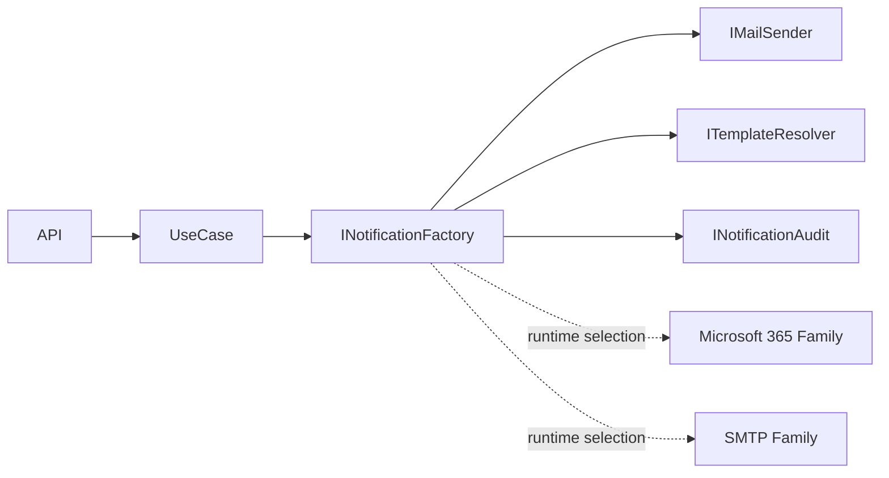
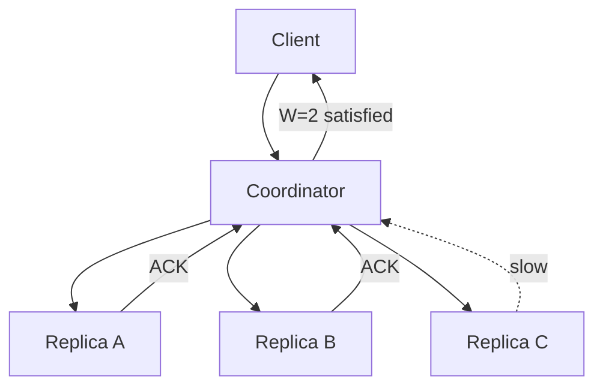
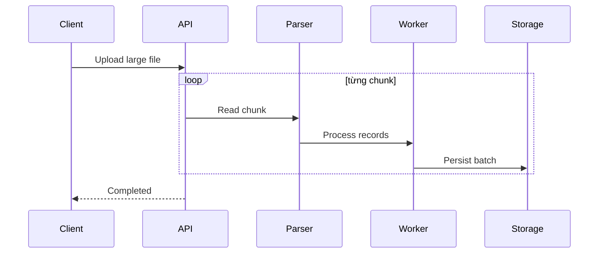
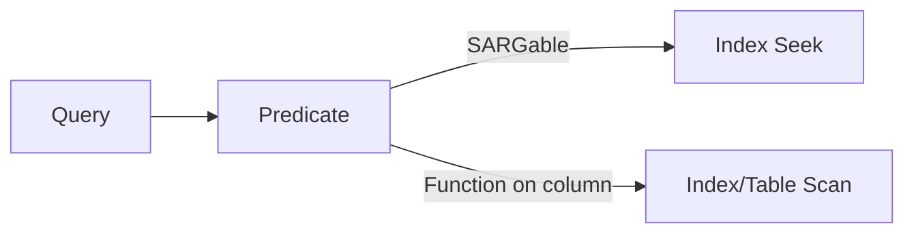
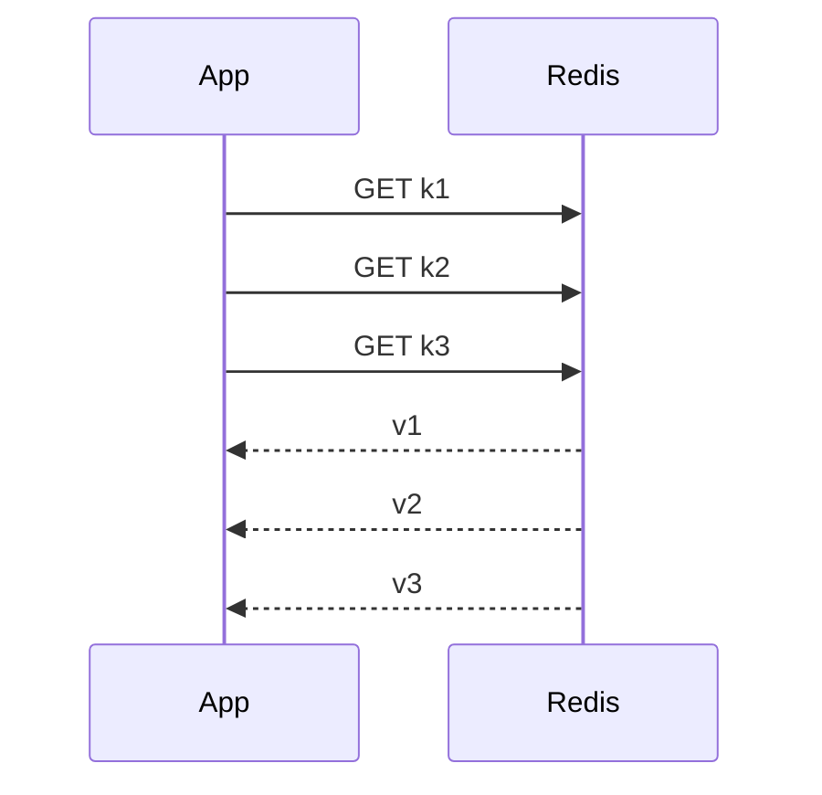
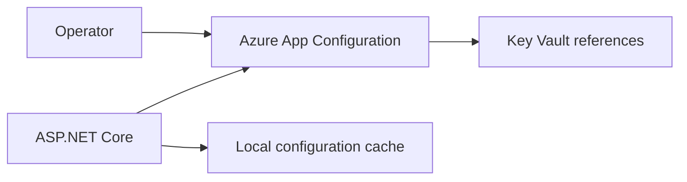
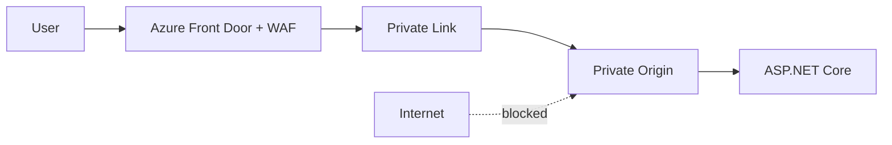
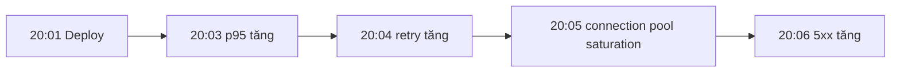
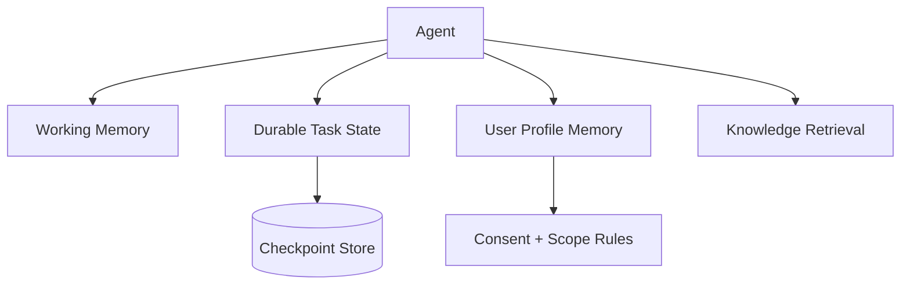
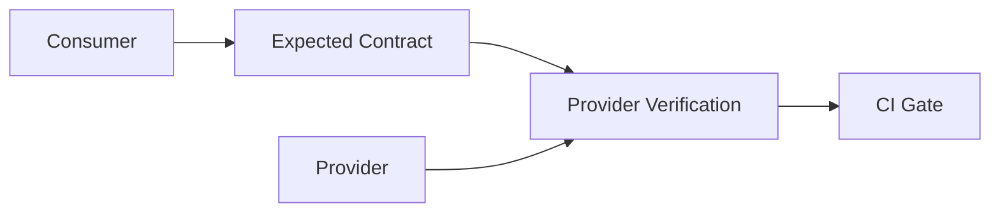

# Daily Knowledge Sharing — 17/08/2026

## Today’s Topics

1. Abstract Factory Pattern — tạo family object theo environment/provider mà không rải conditional khắp codebase
2. Distributed Systems — Quorum Read/Write và cách suy nghĩ về consistency khi có replica
3. ASP.NET Core Streaming API — xử lý file và dữ liệu lớn mà không giữ toàn bộ payload trong memory
4. SQL Server SARGability — viết predicate để optimizer có thể dùng index seek thay vì scan
5. Redis Pipeline & Batch — giảm network round-trip nhưng tránh biến batch lớn thành latency spike
6. Azure App Configuration — tách runtime configuration khỏi deployment nhưng vẫn kiểm soát consistency và rollout
7. Azure Front Door + Private Link Origin — public edge nhưng private origin trong kiến trúc production
8. Incident Investigation với Timeline Reconstruction — ghép logs, metrics, traces và deployment events để tìm nguyên nhân thật
9. AI Agent Memory Design — phân biệt working memory, durable state và user profile để tránh “memory soup”
10. Contract Testing — bảo vệ integration boundary khi nhiều service release độc lập

---

# 1. Abstract Factory Pattern — tạo family object theo environment/provider mà không rải conditional khắp codebase

### 1. What is it?

Abstract Factory là design pattern dùng một abstraction để tạo ra **một nhóm object có liên quan với nhau** mà business code không cần biết implementation cụ thể.

Điểm khác với Factory đơn giản là Abstract Factory thường giải quyết nhiều object thuộc cùng một “family”. Ví dụ một hệ thống notification có hai provider:

- Microsoft 365: `GraphMailSender`, `TeamsNotifier`, `GraphTemplateResolver`
- Internal SMTP: `SmtpMailSender`, `WebhookNotifier`, `FileTemplateResolver`

Application layer chỉ cần làm việc với `INotificationFactory` thay vì hỏi `if (provider == ...)` ở nhiều chỗ.

### 2. Why does it exist?

Khi hệ thống có nhiều provider hoặc deployment mode, cách ngây thơ thường là rải `switch` theo provider khắp service.

Hậu quả:

- thêm provider mới phải sửa nhiều file;
- object không tương thích dễ bị mix sai;
- business flow bị coupling với SDK;
- unit test khó thay implementation.

Abstract Factory gom quyết định chọn family implementation về một boundary rõ ràng.

### 3. How does it work?



Business flow không tự tạo concrete class. Composition root hoặc factory implementation chịu trách nhiệm chọn family.

### 4. Practical example

```csharp
public interface INotificationFactory
{
    IMailSender CreateMailSender();
    ITemplateResolver CreateTemplateResolver();
}

public sealed class Microsoft365NotificationFactory : INotificationFactory
{
    private readonly GraphServiceClient _graph;

    public Microsoft365NotificationFactory(GraphServiceClient graph)
        => _graph = graph;

    public IMailSender CreateMailSender()
        => new GraphMailSender(_graph);

    public ITemplateResolver CreateTemplateResolver()
        => new GraphTemplateResolver();
}
```

Trong hệ thống dùng DI mạnh, đôi khi không cần `new` trực tiếp. Factory có thể trả về implementation đã resolve hoặc typed abstraction.

### 5. Real production scenario

Một SaaS cần chạy ở hai tenant mode: khách hàng A cho phép Microsoft Graph; khách hàng B bắt buộc SMTP relay nội bộ. Use case “send approval reminder” giống nhau, nhưng transport, template source và audit integration khác nhau.

Abstract Factory cho phép cùng một use case dùng family implementation phù hợp tenant mà không nhân đôi business logic.

### 6. Common mistakes

- Dùng Abstract Factory khi chỉ có một object và một implementation.
- Cho factory chứa business rule thay vì chỉ quyết định object graph.
- Trả về concrete type khiến abstraction mất ý nghĩa.
- Tạo object thủ công làm mất DI lifetime hoặc telemetry wrapper.
- Dùng factory như service locator: `Create(string type)` cho mọi thứ trong hệ thống.

### 7. Trade-offs

**Advantages**

- Giảm coupling với provider.
- Family object nhất quán.
- Dễ thay SDK và test.
- Mở rộng provider có boundary rõ ràng.

**Costs / Risks**

- Tăng abstraction và số type.
- Có thể che giấu object graph nếu thiết kế quá generic.
- Không đáng dùng với hệ thống nhỏ, ít biến thiên.

### 8. Junior → Middle → Senior understanding

**Junior**: hiểu factory tạo object thay vì business code tự `new` implementation.

**Middle**: biết phân biệt Simple Factory, Factory Method, Abstract Factory và tích hợp với DI.

**Senior / Technical Lead**: quyết định khi nào provider variability đủ lớn để cần factory; giữ factory ở composition boundary và tránh biến thành service locator.

### 9. Key takeaway

- Dùng Abstract Factory khi cần tạo **family implementation đồng bộ**.
- Factory quyết định object graph, không chứa business rule.
- Nếu chỉ có một implementation, abstraction có thể là ceremony không cần thiết.

---

# 2. Distributed Systems — Quorum Read/Write và cách suy nghĩ về consistency khi có replica

### 1. What is it?

Trong distributed database có nhiều replica, một write không nhất thiết phải ghi xong tất cả replica trước khi trả success. Quorum là cách chọn số replica cần xác nhận read/write để cân bằng availability, latency và consistency.

Giả sử có `N = 3` replica:

- `W = 2`: write cần 2 replica xác nhận;
- `R = 2`: read hỏi 2 replica.

Khi `R + W > N`, về lý thuyết read quorum và write quorum phải giao nhau ít nhất một replica, tăng khả năng đọc được version mới nhất.

### 2. Why does it exist?

Nếu luôn yêu cầu tất cả replica:

- consistency cao hơn;
- nhưng một replica chậm có thể làm cả request fail.

Nếu chỉ cần một replica:

- latency và availability tốt;
- nhưng dễ đọc stale data.

Quorum cho phép thiết kế một điểm cân bằng phù hợp business semantics.

### 3. How does it work?



Quorum không tự giải quyết mọi conflict. Hệ thống vẫn cần version, timestamp, vector clock hoặc conflict resolution rule tùy database.

### 4. Practical example

Không nên tự viết quorum storage bằng C# cho dữ liệu quan trọng. Điều cần thiết ở application level là hiểu consistency setting của database.

Ví dụ khi dùng một distributed store, business code phải biết liệu read sau write có được đảm bảo hay không trước khi viết flow:

```csharp
await orderStore.SaveAsync(order, ct);

// Không nên mặc định rằng mọi replica đọc ngay sau đó đều thấy order mới.
var saved = await orderStore.GetAsync(order.Id, ct);
```

Nếu flow phụ thuộc strongly consistent read, cần chọn consistency mode phù hợp hoặc đọc từ authority phù hợp.

### 5. Real production scenario

Hệ thống timesheet multi-region lưu reporting data ở replica gần người dùng. User vừa submit timesheet tại region A nhưng dashboard read từ replica region B có thể chậm vài giây.

Nếu UI ngay lập tức yêu cầu “submitted” chính xác, có thể đọc từ write authority hoặc giữ trạng thái vừa ghi ở request flow. Với báo cáo tổng hợp, eventual consistency vài giây có thể chấp nhận.

### 6. Common mistakes

- Nghĩ “replicated” đồng nghĩa “strongly consistent”.
- Dùng consistency mạnh cho mọi request dù business không cần.
- Không thiết kế UI cho stale read.
- Dùng timestamp máy local để giải conflict trong môi trường clock skew.
- Không đo p95/p99 latency khi tăng quorum.

### 7. Trade-offs

**Advantages**

- Cho phép cân bằng availability và consistency.
- Có thể chịu lỗi một số replica.
- Phù hợp hệ thống phân tán nhiều vùng.

**Costs / Risks**

- Latency tăng khi `R` hoặc `W` tăng.
- Conflict resolution phức tạp.
- Stronger consistency thường làm giảm availability trong partition.

### 8. Junior → Middle → Senior understanding

**Junior**: hiểu replica có thể không đồng bộ tức thời.

**Middle**: hiểu `N`, `R`, `W`, stale read và read-after-write consistency.

**Senior / Technical Lead**: map consistency requirement từ business invariant sang database consistency mode, RPO/RTO và multi-region topology.

### 9. Key takeaway

- Consistency là business decision, không chỉ database setting.
- Replica giúp availability nhưng tạo stale-read risk.
- Chọn consistency theo invariant và user experience, không theo mặc định mạnh nhất.

---

# 3. ASP.NET Core Streaming API — xử lý file và dữ liệu lớn mà không giữ toàn bộ payload trong memory

### 1. What is it?

Streaming API xử lý dữ liệu theo dòng/chunk thay vì tải toàn bộ request hoặc response vào memory trước khi xử lý.

Với payload nhỏ, `ReadToEndAsync()` hoặc serialize cả collection thường ổn. Với file hàng trăm MB hoặc export hàng triệu record, cách đó tạo allocation lớn, LOH pressure và có thể làm process OOM.

### 2. Why does it exist?

Naive approach:

1. đọc toàn bộ file vào `byte[]`;
2. xử lý;
3. tạo toàn bộ output;
4. gửi response.

Vấn đề là memory usage tăng theo kích thước payload. Trong production, nhiều request đồng thời làm memory tăng theo phép nhân.

Streaming biến memory footprint gần với chunk size thay vì full payload size.

### 3. How does it work?



Response streaming cũng tương tự: database reader → serializer → response body, không cần materialize toàn bộ dataset.

### 4. Practical example

```csharp
app.MapPost("/imports", async (HttpRequest request, ImportService service, CancellationToken ct) =>
{
    await service.ProcessStreamAsync(request.Body, ct);
    return Results.Accepted();
});

public async Task ProcessStreamAsync(Stream input, CancellationToken ct)
{
    using var reader = new StreamReader(input);

    while (!reader.EndOfStream)
    {
        var line = await reader.ReadLineAsync(ct);
        if (line is null) break;

        await ProcessLineAsync(line, ct);
    }
}
```

Production code cần thêm size limit, validation, batch persistence, cancellation và error reporting.

### 5. Real production scenario

Một HR system import file CSV 1 GB. Nếu API dùng `MemoryStream` cho toàn bộ file, vài upload đồng thời có thể làm App Service restart vì memory pressure.

Streaming parser đọc từng dòng, buffer 500 record, bulk insert vào staging table, sau đó background worker validate và promote dữ liệu.

### 6. Common mistakes

- Gọi `ToListAsync()` trước khi stream response.
- Dùng `IFormFile.CopyToAsync(new MemoryStream())` cho file lớn.
- Không giới hạn upload size.
- Không propagate `CancellationToken`.
- Stream trực tiếp từ database transaction rất lâu, giữ connection quá lâu.
- Không nghĩ đến partial failure khi stream đã gửi một phần response.

### 7. Trade-offs

**Advantages**

- Memory ổn định hơn.
- Time-to-first-byte tốt hơn cho response lớn.
- Có thể xử lý file vượt xa RAM process.

**Costs / Risks**

- Error handling phức tạp hơn sau khi response đã bắt đầu.
- Transaction dài và connection lifetime cần quản lý cẩn thận.
- Client cũng phải hỗ trợ streaming semantics.

### 8. Junior → Middle → Senior understanding

**Junior**: phân biệt buffering và streaming.

**Middle**: triển khai stream read/write, cancellation, chunking và batch.

**Senior / Technical Lead**: quyết định boundary giữa sync streaming và async background job, quản lý backpressure, connection lifetime, timeout và capacity.

### 9. Key takeaway

- Payload lớn không nên materialize toàn bộ vào memory.
- Streaming giảm memory nhưng tăng complexity về failure và lifecycle.
- Với job rất dài, thường nên kết hợp upload → storage → background processing.

---

# 4. SQL Server SARGability — viết predicate để optimizer có thể dùng index seek thay vì scan

### 1. What is it?

SARGable nghĩa là predicate có thể được database optimizer biến thành search argument hiệu quả trên index.

Một query có index vẫn có thể scan nếu predicate bọc indexed column trong function hoặc transform khiến optimizer khó seek đúng range.

### 2. Why does it exist?

Ví dụ phổ biến:

```sql
WHERE CONVERT(date, CreatedAt) = '2026-08-17'
```

Nếu `CreatedAt` có index, function trên column có thể làm query kém tận dụng index hơn so với range predicate.

### 3. How does it work?

Predicate tốt cho index range:

```sql
WHERE CreatedAt >= '2026-08-17T00:00:00'
  AND CreatedAt <  '2026-08-18T00:00:00'
```

Optimizer có thể xác định trực tiếp key range để seek.



### 4. Practical example

**Không tốt**:

```sql
SELECT Id, EmployeeId, CreatedAt
FROM Timesheets
WHERE YEAR(CreatedAt) = 2026
  AND MONTH(CreatedAt) = 8;
```

**Tốt hơn**:

```sql
SELECT Id, EmployeeId, CreatedAt
FROM Timesheets
WHERE CreatedAt >= '2026-08-01'
  AND CreatedAt <  '2026-09-01';
```

### 5. Real production scenario

Một report timesheet theo tháng chạy nhanh khi dữ liệu 100k rows nhưng chậm mạnh khi bảng lên 50 triệu rows. Index `IX_Timesheets_CreatedAt` đã tồn tại nên team nghĩ index “không hiệu quả”. Root cause là query dùng `FORMAT(CreatedAt, 'yyyy-MM')` trong `WHERE`.

Đổi thành range predicate giúp optimizer dùng index seek và giảm logical reads đáng kể.

### 6. Common mistakes

- Dùng `LOWER(Column)` trong filter dù có index thường.
- Implicit conversion giữa `nvarchar` và `varchar` hoặc giữa kiểu số.
- Arithmetic trên column: `Price * 1.1 > 100`.
- Dùng wildcard đầu chuỗi: `LIKE '%abc'` rồi kỳ vọng B-tree seek.
- Chỉ nhìn execution time, không xem actual plan và logical reads.

### 7. Trade-offs

**Advantages**

- Tận dụng index tốt hơn.
- Giảm IO và CPU.
- Thường là optimization ít rủi ro.

**Costs / Risks**

- Có thể cần computed persisted column hoặc index đặc biệt cho search phức tạp.
- Rewrite predicate phải giữ đúng semantics timezone/collation/type.

### 8. Junior → Middle → Senior understanding

**Junior**: biết function trên indexed column có thể làm query chậm.

**Middle**: đọc execution plan và rewrite range predicate.

**Senior / Technical Lead**: xem SARGability cùng statistics, cardinality, parameterization và workload pattern thay vì tối ưu từng query cô lập.

### 9. Key takeaway

- Có index chưa đủ; predicate phải cho optimizer cơ hội dùng index.
- Range predicate thường tốt hơn function trên column.
- Luôn xác nhận bằng actual execution plan và IO metrics.

---

# 5. Redis Pipeline & Batch — giảm network round-trip nhưng tránh biến batch lớn thành latency spike

### 1. What is it?

Redis rất nhanh ở server side, nhưng application vẫn phải trả giá cho network round-trip. Pipeline/batch cho phép gửi nhiều command mà không phải chờ từng response tuần tự.

Nếu cần đọc 100 key và mỗi request mất 1 ms round-trip, gọi tuần tự có thể tốn ~100 ms chỉ vì network. Batch có thể giảm đáng kể thời gian chờ.

### 2. Why does it exist?

Naive code:

```text
GET key1 -> wait
GET key2 -> wait
GET key3 -> wait
...
```

Redis execution nhanh nhưng client idle phần lớn thời gian vì chờ network.

### 3. How does it work?



Pipeline không đồng nghĩa transaction. Các command có thể được xử lý nối tiếp nhưng không có atomicity như `MULTI/EXEC`.

### 4. Practical example

Với StackExchange.Redis:

```csharp
var tasks = keys
    .Select(key => db.StringGetAsync(key))
    .ToArray();

await Task.WhenAll(tasks);

var values = tasks.Select(t => t.Result).ToArray();
```

Cần giới hạn batch size nếu keys rất lớn.

### 5. Real production scenario

Dashboard cần load permission summary cho 200 employees. Code cũ gọi Redis tuần tự trong loop nên API latency >300 ms dù Redis CPU rất thấp.

Chuyển sang batch giảm round-trip, nhưng batch 20k key lại tạo response burst lớn và tăng memory/network. Cuối cùng team dùng page 200–500 keys mỗi request.

### 6. Common mistakes

- Nghĩ pipeline là transaction atomic.
- Batch hàng chục nghìn key không giới hạn.
- Dùng `KEYS *` để lấy key trước khi batch.
- Không đặt timeout và không theo dõi Redis connection health.
- Tối ưu network nhưng bỏ qua serialization payload lớn.

### 7. Trade-offs

**Advantages**

- Giảm network latency.
- Tăng throughput.
- Hiệu quả với nhiều operation nhỏ độc lập.

**Costs / Risks**

- Batch lớn gây burst memory/network.
- Error handling từng command phức tạp hơn.
- Không đảm bảo atomicity.

### 8. Junior → Middle → Senior understanding

**Junior**: hiểu Redis latency gồm cả network round-trip.

**Middle**: biết batch/pipeline và giới hạn batch size.

**Senior / Technical Lead**: đo latency distribution, network bandwidth, connection saturation và quyết định khi nào redesign data model tốt hơn việc batch nhiều key.

### 9. Key takeaway

- Redis nhanh không có nghĩa network miễn phí.
- Pipeline giảm round-trip, không tạo transaction.
- Batch size cần được đo và giới hạn.

---

# 6. Azure App Configuration — tách runtime configuration khỏi deployment nhưng vẫn kiểm soát consistency và rollout

### 1. What is it?

Azure App Configuration là dịch vụ quản lý configuration tập trung như feature settings, endpoint, threshold, runtime flags và label theo environment.

Nó khác Key Vault: Key Vault ưu tiên **secret/key/certificate**; App Configuration ưu tiên **non-secret runtime configuration**.

### 2. Why does it exist?

Nếu mọi config nằm trong `appsettings.json` đóng gói cùng artifact, một thay đổi nhỏ có thể yêu cầu rebuild/redeploy.

Nếu config nằm rải trong environment variables hoặc portal từng App Service, drift giữa instances/environment rất dễ xảy ra.

### 3. How does it work?



Application thường cache config local và refresh có kiểm soát thay vì gọi remote service cho mỗi request.

### 4. Practical example

```csharp
builder.Configuration.AddAzureAppConfiguration(options =>
{
    options.Connect(new Uri(endpoint), new DefaultAzureCredential())
           .Select("MyApp:*")
           .ConfigureRefresh(refresh =>
               refresh.Register("MyApp:Sentinel", refreshAll: true));
});
```

`Managed Identity` nên được dùng thay connection string secret khi chạy trên Azure.

### 5. Real production scenario

Một approval service có threshold `MaxAutoApproveHours`. Product cần đổi từ 8 xuống 6 mà không deploy code. Config được đổi trong App Configuration, sentinel update, application refresh trong vài chục giây.

Nếu config ảnh hưởng safety-critical rule, team có thể yêu cầu rollout theo environment và change approval thay vì refresh tức thời toàn fleet.

### 6. Common mistakes

- Đưa secret plain text vào App Configuration thay vì Key Vault reference.
- Refresh config mỗi request.
- Không version/label theo environment.
- Thay config có breaking semantics mà không coordinate deployment.
- Không audit ai đã thay config.

### 7. Trade-offs

**Advantages**

- Tập trung configuration.
- Giảm redeploy chỉ để đổi config.
- Hỗ trợ label, feature management, Key Vault reference.

**Costs / Risks**

- Runtime configuration trở thành dependency ngoài.
- Eventual refresh tạo thời gian config khác nhau giữa instances.
- Thay config sai có thể gây incident nhanh hơn deploy code.

### 8. Junior → Middle → Senior understanding

**Junior**: phân biệt code, config và secret.

**Middle**: tích hợp App Configuration, refresh, labels, Managed Identity.

**Senior / Technical Lead**: thiết kế governance, blast radius, config compatibility, audit và rollback.

### 9. Key takeaway

- App Configuration dành cho runtime config; Key Vault dành cho secret.
- Dynamic config cần governance giống deployment.
- Cache và refresh phải được thiết kế, không gọi remote mỗi request.

---

# 7. Azure Front Door + Private Link Origin — public edge nhưng private origin trong kiến trúc production

### 1. What is it?

Azure Front Door có thể làm global entry point công khai trong khi origin phía sau không mở public internet. Private Link giúp Front Door truy cập origin qua private connectivity được kiểm soát.

Mục tiêu là: **public edge, private backend**.

### 2. Why does it exist?

Nếu App Service hoặc origin public hoàn toàn, attacker có thể bỏ qua WAF/Front Door và gọi trực tiếp origin endpoint nếu không có additional access restriction.

Ta muốn toàn bộ external traffic đi qua edge policy, WAF, TLS và routing layer.

### 3. How does it work?



Front Door vẫn public; backend origin chỉ chấp nhận traffic từ private path được cấu hình.

### 4. Practical example

ASP.NET Core không cần biết Private Link chi tiết, nhưng phải trust forwarded headers đúng cách:

```csharp
app.UseForwardedHeaders();
app.UseHttpsRedirection();
```

Ngoài ra cần health probe endpoint và access restriction ở Azure layer.

### 5. Real production scenario

Một SaaS public API chạy App Service. Trước đây domain chính qua Front Door nhưng `*.azurewebsites.net` vẫn public, khiến bot bypass WAF và đánh trực tiếp origin.

Sau khi khóa public network access và dùng Front Door Private Link, external traffic bắt buộc qua WAF/edge.

### 6. Common mistakes

- Nghĩ dùng Front Door tự động làm origin private.
- Không disable public network access hoặc access restriction.
- Health probe không truy cập được qua private path.
- DNS/config mismatch khiến deployment failover khó debug.
- Trust mọi forwarded header từ internet.

### 7. Trade-offs

**Advantages**

- Giảm khả năng bypass edge security.
- Centralize WAF/TLS/routing.
- Tốt cho multi-region public application.

**Costs / Risks**

- Networking phức tạp hơn.
- Debug connectivity khó hơn.
- Chi phí Front Door/Private Link và data transfer.

### 8. Junior → Middle → Senior understanding

**Junior**: hiểu edge và origin là hai layer khác nhau.

**Middle**: cấu hình health probe, access restriction, forwarded headers, private endpoint path.

**Senior / Technical Lead**: thiết kế zero-trust ingress, multi-region failover, DNS, observability và emergency bypass procedure có kiểm soát.

### 9. Key takeaway

- Front Door public không đồng nghĩa origin phải public.
- Nếu origin còn public, WAF có thể bị bypass.
- Private connectivity cần đi cùng health check, DNS và operational playbook.

---

# 8. Incident Investigation với Timeline Reconstruction — ghép logs, metrics, traces và deployment events để tìm nguyên nhân thật

### 1. What is it?

Timeline reconstruction là kỹ thuật dựng lại chuỗi sự kiện theo thời gian trong incident: khi nào symptom bắt đầu, deployment nào xảy ra, dependency nào degrade, error rate tăng lúc nào, retry storm xuất hiện khi nào.

Nó giúp tránh suy luận kiểu “deploy xong rồi lỗi, vậy chắc deployment là nguyên nhân” mà không có evidence.

### 2. Why does it exist?

Production incident thường có nhiều tín hiệu đồng thời:

- latency tăng;
- database connection tăng;
- queue backlog;
- deployment vừa diễn ra;
- upstream trả 429;
- retry policy tạo thêm traffic.

Nếu xem từng dashboard riêng, team dễ chọn nhầm root cause.

### 3. How does it work?



Timeline phải dùng cùng timezone/correlation IDs và phân biệt **cause**, **amplifier**, **symptom**.

### 4. Practical example

KQL kiểu:

```kusto
requests
| where timestamp between (datetime(2026-08-17 13:00:00) .. datetime(2026-08-17 13:30:00))
| summarize count(), p95=percentile(duration, 95) by bin(timestamp, 1m), resultCode
| order by timestamp asc
```

Sau đó overlay dependency failure và deployment marker.

### 5. Real production scenario

API chậm sau deployment. Ban đầu team rollback nhưng latency không giảm. Timeline cho thấy upstream Graph API bắt đầu throttling trước deployment 2 phút; version mới chỉ làm retry aggressive hơn nên incident nặng thêm.

Root cause: upstream throttling. Amplifier: retry policy mới. Rollback giúp giảm amplifier nhưng không xóa root cause.

### 6. Common mistakes

- Dùng local time khác nhau giữa systems.
- Chỉ nhìn log error, bỏ metrics saturation.
- Không lưu deployment events.
- Kết luận correlation là causation.
- Xóa hoặc sample mất audit/security event quan trọng.

### 7. Trade-offs

**Advantages**

- Investigation có evidence.
- Dễ phân biệt trigger và amplifier.
- Tạo dữ liệu tốt cho postmortem.

**Costs / Risks**

- Cần telemetry timestamp/correlation chuẩn.
- Retention và observability cost tăng.
- Nếu instrumentation nghèo, timeline có khoảng trống.

### 8. Junior → Middle → Senior understanding

**Junior**: biết ghi lại timestamp và symptom chính xác.

**Middle**: query logs, metrics, traces và correlate request/dependency.

**Senior / Technical Lead**: xây incident timeline, phân loại root cause/amplifier, quyết định rollback/mitigation và cải thiện telemetry gaps.

### 9. Key takeaway

- Incident là chuỗi sự kiện, không phải một screenshot dashboard.
- Deployment gần thời điểm lỗi chưa chắc là root cause.
- Timeline tốt phải ghép logs, metrics, traces và change events.

---

# 9. AI Agent Memory Design — phân biệt working memory, durable state và user profile để tránh “memory soup”

### 1. What is it?

AI agent “memory” không nên là một bucket chứa toàn bộ conversation. Production design nên tách ít nhất:

- **Working memory**: thông tin cần cho task hiện tại.
- **Durable task state**: checkpoint, step đã hoàn thành, artifact IDs.
- **User/profile memory**: preference ổn định đã được phép lưu.
- **Knowledge base**: tài liệu/repository retrieval, không phải memory cá nhân.

### 2. Why does it exist?

Nếu mọi thứ được append vào một context dài:

- token cost tăng;
- stale instruction chen vào task mới;
- private data dễ bị reuse sai scope;
- model khó phân biệt fact hiện tại và history cũ;
- agent resume không đáng tin cậy.

### 3. How does it work?



Deterministic code quyết định memory nào được load. Model không nên tự động đọc toàn bộ lịch sử nếu không cần.

### 4. Practical example

```csharp
public sealed record AgentState(
    string TaskId,
    int CurrentStep,
    IReadOnlyList<string> CompletedArtifacts,
    DateTimeOffset UpdatedAt);
```

State này nên được lưu như structured data thay vì chỉ có một đoạn text “đã làm tới bước 4”.

### 5. Real production scenario

Một coding agent sửa repository qua nhiều vòng:

1. plan;
2. edit files;
3. run tests;
4. fix;
5. open PR.

Nếu process restart sau bước 3, durable state cho biết commit SHA, test result và files changed. Agent resume từ state, không cần nhét toàn bộ transcript vào context.

### 6. Common mistakes

- Lưu mọi user utterance thành memory lâu dài.
- Trộn secret/token vào long-term memory.
- Không version schema state.
- Cho model tự quyết định quyền đọc memory nhạy cảm.
- Dùng summary text thay cho deterministic checkpoint khi workflow có side effect.

### 7. Trade-offs

**Advantages**

- Context nhỏ hơn và rẻ hơn.
- Resume workflow đáng tin cậy.
- Security boundary rõ hơn.

**Costs / Risks**

- Cần storage/schema/versioning.
- Memory retrieval sai có thể gây hành vi sai.
- Phải có lifecycle và deletion policy.

### 8. Junior → Middle → Senior understanding

**Junior**: hiểu context window không phải database memory.

**Middle**: thiết kế structured state, checkpoint và selective retrieval.

**Senior / Technical Lead**: phân quyền memory, retention, privacy, multi-tenant isolation, failure recovery và audit side effects.

### 9. Key takeaway

- Agent memory phải có loại và scope rõ ràng.
- Workflow state quan trọng nên deterministic/structured.
- Không biến toàn bộ conversation history thành long-term memory.

---

# 10. Contract Testing — bảo vệ integration boundary khi nhiều service release độc lập

### 1. What is it?

Contract Testing kiểm tra producer và consumer có còn đồng ý về interface hay không: endpoint, schema, required fields, status codes, message format hoặc event contract.

Nó nằm giữa unit test và full end-to-end test: tập trung vào **boundary giữa hai hệ thống**.

### 2. Why does it exist?

Một API có thể pass unit test của chính nó nhưng vẫn phá consumer vì:

- đổi field name;
- đổi optional thành required;
- bỏ status code cũ;
- thay semantic của enum;
- event schema đổi không backward compatible.

E2E test toàn hệ thống có thể phát hiện nhưng thường chậm, brittle và khó chạy trên mọi PR.

### 3. How does it work?



Consumer-driven contract thường để consumer mô tả interaction cần thiết, provider verify contract đó trong CI.

### 4. Practical example

Một consumer mong API trả:

```json
{
  "employeeId": 123,
  "status": "Active"
}
```

Provider test verify endpoint vẫn trả đúng shape/semantics cần thiết. Nếu provider đổi `employeeId` thành `id`, CI fail trước deployment.

Trong .NET có thể dùng schema/OpenAPI validation hoặc framework contract testing tùy hệ thống.

### 5. Real production scenario

Timesheet service publish event `TimesheetSubmitted`. Payroll consumer phụ thuộc `employeeCode` và `period`.

Team Timesheet thêm field không sao, nhưng rename `period` thành `month` sẽ làm Payroll fail. Contract verification chặn thay đổi đó hoặc buộc rollout theo expand-contract.

### 6. Common mistakes

- Test implementation detail thay vì public contract.
- Contract quá lớn, mirror toàn response dù consumer chỉ dùng 2 field.
- Không version event schema.
- Tin contract test thay thế hoàn toàn integration/E2E test.
- Không chạy provider verification trong CI trước release.

### 7. Trade-offs

**Advantages**

- Phát hiện breaking change sớm.
- Phù hợp nhiều service release độc lập.
- Nhanh và ổn định hơn full E2E cho nhiều case.

**Costs / Risks**

- Cần quản lý contract lifecycle.
- Có thể tạo false confidence nếu contract thiếu semantic rule.
- Không kiểm tra toàn bộ networking/auth/data-flow runtime.

### 8. Junior → Middle → Senior understanding

**Junior**: hiểu API compatibility không chỉ là compile.

**Middle**: viết contract test cho field/status/schema consumer thực sự dùng.

**Senior / Technical Lead**: thiết kế backward compatibility policy, schema evolution, provider verification gate và rollout strategy giữa nhiều team/service.

### 9. Key takeaway

- Contract test bảo vệ boundary, không thay thế mọi integration test.
- Test đúng phần consumer phụ thuộc, không snapshot toàn bộ response vô ích.
- Contract testing hiệu quả nhất khi gắn với CI và compatibility policy.
