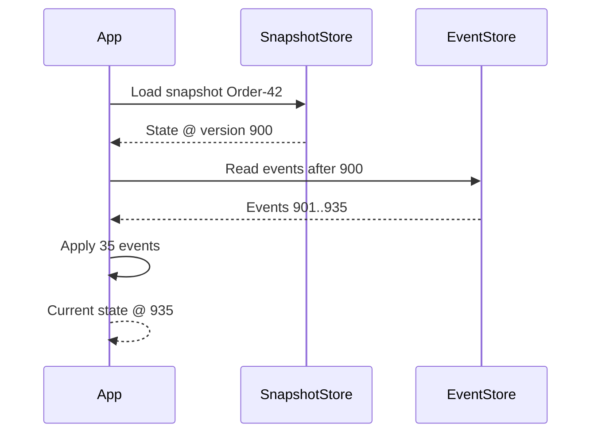
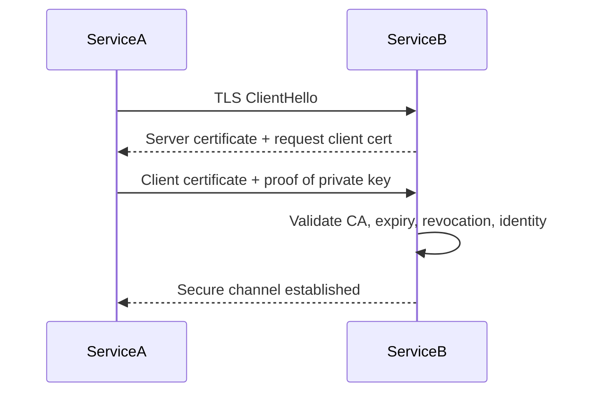
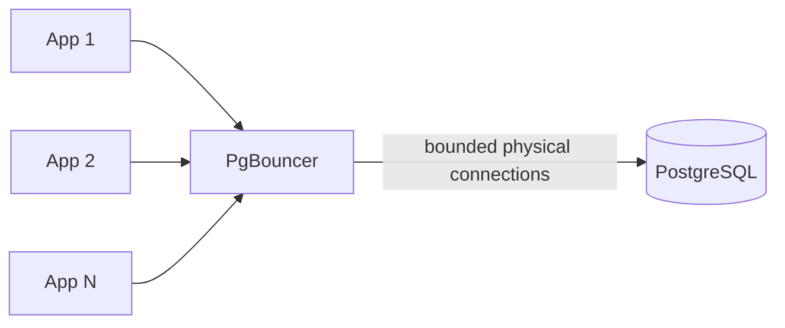
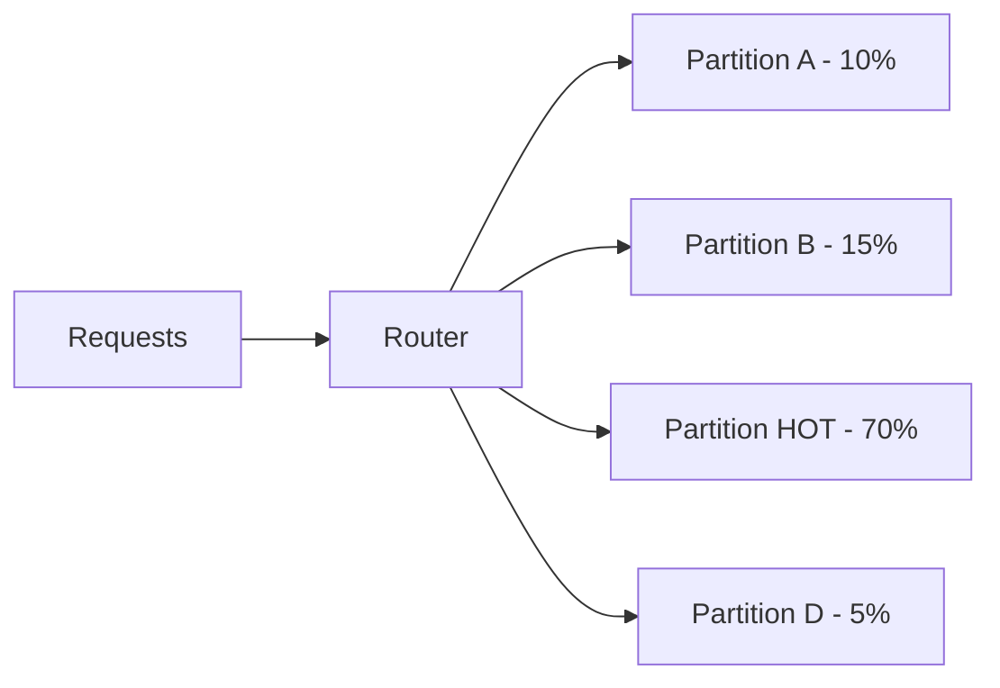
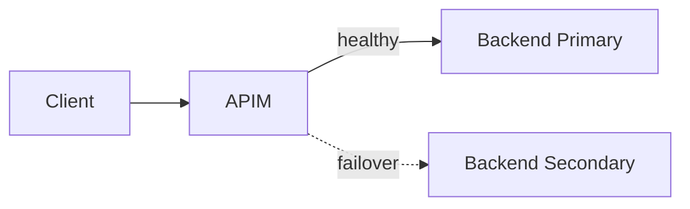
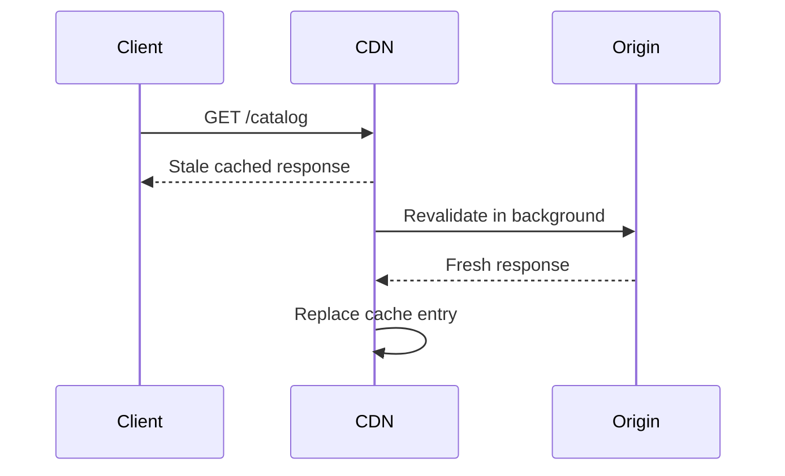
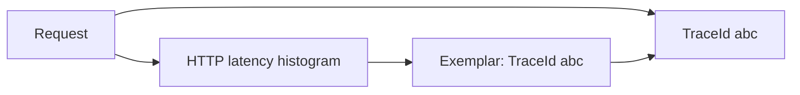

# Daily Knowledge Sharing — 17/08/2026

## Today’s Topics

1. Visitor Pattern — tách operation khỏi object structure khi domain có nhiều loại node ổn định
2. Event Sourcing Snapshotting — rút ngắn thời gian rebuild aggregate mà không phá audit history
3. Mutual TLS (mTLS) cho service-to-service — xác thực hai chiều ngoài token-based authentication
4. SQL Server Memory Grant & TempDB Spill — vì sao query chậm dù execution plan nhìn có vẻ đúng
5. PostgreSQL Connection Pooling với PgBouncer — kiểm soát số connection khi application scale ngang
6. Azure Cosmos DB Hot Partition — nhận diện và xử lý partition key phân phối tải không đều
7. Azure API Management Backend Pool & Failover — route tới nhiều backend nhưng không nhầm lẫn với application-level resilience
8. HTTP `stale-while-revalidate` — giảm tail latency bằng cách phục vụ dữ liệu cũ có kiểm soát
9. OpenTelemetry Exemplars — nối metric spike với trace cụ thể để điều tra production nhanh hơn
10. Flaky Test Management — phân biệt product bug, test bug và environment instability trong CI

---

# 1. Visitor Pattern — tách operation khỏi object structure khi domain có nhiều loại node ổn định

### 1. What is it?

Visitor Pattern cho phép đặt một nhóm operation vào object riêng gọi là visitor, thay vì nhét các operation đó vào từng class domain.

Nó thường hữu ích khi **object structure tương đối ổn định**, nhưng số operation trên structure đó tăng dần. Ví dụ hệ thống payroll có nhiều loại component `Salary`, `Allowance`, `Bonus`, `Deduction`; trong khi operation có thể là calculate tax, export report, validate policy, audit.

### 2. Why does it exist?

Nếu mỗi khi có một operation mới ta sửa tất cả class con, domain model nhanh chóng đầy logic không thuộc trách nhiệm chính của nó.

Naive approach:

```csharp
abstract class PayrollItem
{
    public abstract decimal CalculateTax();
    public abstract string ExportCsv();
    public abstract IEnumerable<string> Validate();
}
```

Mỗi operation mới làm interface phình to.

Visitor chuyển chiều mở rộng từ "sửa từng subtype" sang "thêm visitor mới".

### 3. How does it work?

```mermaid
flowchart LR
    Client --> Element
    Element -->|Accept(visitor)| Visitor
    Visitor --> Salary
    Visitor --> Bonus
    Visitor --> Deduction
```

Mỗi element gọi đúng overload của visitor, đây là double dispatch.

### 4. Practical example

```csharp
public interface IPayrollVisitor<T>
{
    T Visit(Salary item);
    T Visit(Bonus item);
}

public interface IPayrollItem
{
    T Accept<T>(IPayrollVisitor<T> visitor);
}

public sealed record Salary(decimal Amount) : IPayrollItem
{
    public T Accept<T>(IPayrollVisitor<T> visitor) => visitor.Visit(this);
}

public sealed class TaxVisitor : IPayrollVisitor<decimal>
{
    public decimal Visit(Salary item) => item.Amount * 0.1m;
    public decimal Visit(Bonus item) => item.Amount * 0.15m;
}
```

### 5. Real production scenario

Một HR/payroll system có 8 loại compensation item nhưng cần nhiều reporting/export rule theo quốc gia. Loại item ít thay đổi, còn operation tăng thường xuyên. Visitor giúp thêm `VietnamTaxVisitor`, `SwedenTaxVisitor`, `AuditVisitor` mà không sửa từng entity.

### 6. Common mistakes

- Dùng Visitor khi subtype thay đổi liên tục.
- Dùng để né polymorphism đơn giản.
- Visitor truy cập quá sâu vào internal state và biến domain thành data bag.
- Tạo dozens visitor cho use case đơn giản.

### 7. Trade-offs

**Advantages**

- Thêm operation mới dễ.
- Gom logic cross-cutting theo use case.
- Hữu ích cho object graph phức tạp.

**Costs / Risks**

- Thêm subtype mới phải sửa mọi visitor.
- Double dispatch khó hiểu hơn với Junior.
- Có thể làm giảm encapsulation.

### 8. Junior → Middle → Senior understanding

**Junior:** hiểu Visitor tách operation khỏi object structure.

**Middle:** biết khi nào pattern hợp với hierarchy ổn định và operation thay đổi nhiều.

**Senior / Technical Lead:** đánh giá Visitor so với polymorphism, pattern matching và composition; tránh áp dụng chỉ vì muốn "clean code".

### 9. Key takeaway

- Visitor tối ưu cho **stable types, changing operations**.
- Không phải pattern mặc định cho mọi hierarchy.
- Nếu subtype thay đổi thường xuyên, chi phí Visitor có thể lớn hơn lợi ích.

---

# 2. Event Sourcing Snapshotting — rút ngắn thời gian rebuild aggregate mà không phá audit history

### 1. What is it?

Trong Event Sourcing, current state được rebuild bằng cách replay toàn bộ event đã xảy ra. Snapshot là bản chụp state tại một version cụ thể, giúp aggregate không phải replay từ event đầu tiên mỗi lần load.

Snapshot **không thay thế event log**; nó chỉ là optimization layer.

### 2. Why does it exist?

Một aggregate có 20 event thì replay rẻ. Nhưng aggregate tồn tại nhiều năm với hàng chục nghìn event sẽ tăng latency, CPU và I/O.

Nếu xóa event cũ sau khi snapshot thì mất auditability và khả năng rebuild. Vì vậy snapshot nên được coi là disposable cache của state.

### 3. How does it work?



Quy trình thường là:

1. Load snapshot mới nhất.
2. Lấy event sau snapshot version.
3. Replay phần còn lại.
4. Khi vượt threshold, ghi snapshot mới.

### 4. Practical example

```csharp
var snapshot = await snapshotStore.GetAsync<OrderSnapshot>(orderId, ct);
var order = snapshot is null
    ? new Order(orderId)
    : Order.FromSnapshot(snapshot);

var fromVersion = snapshot?.Version + 1 ?? 0;
var events = await eventStore.ReadAsync(orderId, fromVersion, ct);

foreach (var @event in events)
    order.Apply(@event);
```

### 5. Real production scenario

Một subscription billing aggregate phát event cho mỗi invoice, retry, payment, refund và plan change. Sau vài năm, một customer enterprise có hàng chục nghìn event. Snapshot mỗi 500 event giúp command latency ổn định mà vẫn giữ full event history để audit.

### 6. Common mistakes

- Xem snapshot là source of truth.
- Không lưu snapshot version.
- Snapshot schema thay đổi nhưng không version migration.
- Snapshot quá thường xuyên gây write amplification.
- Không kiểm tra snapshot corrupt hoặc stale.

### 7. Trade-offs

**Advantages**

- Giảm replay latency.
- Giảm I/O và CPU.
- Giữ nguyên event history.

**Costs / Risks**

- Thêm storage/model/versioning complexity.
- Có thể stale/corrupt.
- Cần chiến lược rebuild snapshot.

### 8. Junior → Middle → Senior understanding

**Junior:** snapshot là optimization, không phải replacement cho event log.

**Middle:** biết load snapshot + replay tail events và version snapshot.

**Senior / Technical Lead:** quyết định threshold, migration strategy, consistency và recovery khi snapshot lỗi.

### 9. Key takeaway

- Snapshot là cache của event-sourced state.
- Event log vẫn là source of truth.
- Chỉ thêm snapshot khi replay cost thực sự trở thành bottleneck.

---

# 3. Mutual TLS (mTLS) cho service-to-service — xác thực hai chiều ngoài token-based authentication

### 1. What is it?

TLS thông thường xác thực server với client. Mutual TLS yêu cầu cả **client và server đều trình certificate**, nên server cũng xác minh danh tính client ở transport layer.

mTLS trả lời: "connection này đến từ workload có certificate được tin cậy hay không?"

### 2. Why does it exist?

API key hoặc bearer token có thể bị copy và replay từ nơi khác. mTLS gắn quyền truy cập với private key của workload, giúp giảm rủi ro credential bị dùng ngoài môi trường dự kiến.

Nó đặc biệt hữu ích cho internal service, partner integration và zero-trust network.

### 3. How does it work?



mTLS có thể kết hợp OAuth: certificate xác thực workload, token thể hiện authorization context.

### 4. Practical example

ASP.NET Core phía server:

```csharp
builder.Services
    .AddAuthentication(CertificateAuthenticationDefaults.AuthenticationScheme)
    .AddCertificate(options =>
    {
        options.AllowedCertificateTypes = CertificateTypes.Chained;
    });
```

Client:

```csharp
var handler = new HttpClientHandler();
handler.ClientCertificates.Add(clientCertificate);
var client = new HttpClient(handler);
```

Trong production nên lấy certificate từ Key Vault/managed certificate store, không commit `.pfx` vào repo.

### 5. Real production scenario

Một payroll SaaS gửi file settlement sang ngân hàng. Bank endpoint yêu cầu mTLS để chỉ certificate đã đăng ký mới mở được connection; OAuth token sau đó giới hạn operation cụ thể.

### 6. Common mistakes

- Chỉ check certificate tồn tại mà không validate chain/issuer/expiry.
- Không có rotation plan.
- Dùng self-signed certificate thủ công ở hàng trăm service.
- Nghĩ mTLS thay thế authorization.
- Không monitor certificate sắp hết hạn.

### 7. Trade-offs

**Advantages**

- Strong workload identity ở transport layer.
- Hạn chế credential replay.
- Tốt cho partner/internal zero-trust.

**Costs / Risks**

- Certificate lifecycle phức tạp.
- Rotation và revocation cần automation.
- Troubleshooting network/TLS khó hơn token-only.

### 8. Junior → Middle → Senior understanding

**Junior:** hiểu TLS server-auth khác mTLS hai chiều.

**Middle:** cấu hình client/server certificate validation và rotation cơ bản.

**Senior / Technical Lead:** thiết kế PKI, trust boundary, revocation, certificate automation và kết hợp mTLS với OAuth/Managed Identity.

### 9. Key takeaway

- mTLS xác thực workload ở transport layer.
- Nó bổ sung, không thay thế authorization.
- Certificate lifecycle là phần khó nhất trong production.

---

# 4. SQL Server Memory Grant & TempDB Spill — vì sao query chậm dù execution plan nhìn có vẻ đúng

### 1. What is it?

Một số operator như `Sort`, `Hash Match`, hash aggregate cần memory để xử lý. SQL Server ước lượng lượng memory cần và cấp một **memory grant** trước khi query chạy.

Nếu grant quá nhỏ, operator phải ghi intermediate data xuống TempDB — gọi là spill.

### 2. Why does it exist?

Memory hữu hạn và nhiều query chạy đồng thời. SQL Server không thể cho mỗi query toàn bộ RAM nó muốn.

Estimate sai do statistics/cardinality sai có thể dẫn đến:

- grant quá nhỏ → spill, I/O tăng;
- grant quá lớn → query khác phải chờ memory.

### 3. How does it work?

```text
Query compile
   ↓
Cardinality estimate
   ↓
Memory grant request
   ↓
Sort / Hash operator
   ├─ đủ RAM → in-memory
   └─ thiếu RAM → TempDB spill
```

### 4. Practical example

Query:

```sql
SELECT CustomerId, SUM(Amount)
FROM Payments
WHERE CreatedAt >= '2026-01-01'
GROUP BY CustomerId
ORDER BY SUM(Amount) DESC;
```

Khi actual rows lớn hơn estimate rất nhiều, `Hash Aggregate` hoặc `Sort` có thể spill.

Kiểm tra execution plan warnings hoặc DMV/query store thay vì chỉ nhìn CPU.

### 5. Real production scenario

Report tài chính chạy cuối tháng đột nhiên tăng từ 3 giây lên 90 giây. Database CPU chỉ 40%, nhưng TempDB I/O tăng mạnh. Execution plan cho thấy Sort spill nhiều pass do statistics stale sau bulk import.

### 6. Common mistakes

- Chỉ tăng server RAM mà không sửa estimate.
- Bỏ qua plan warning.
- Tạo index ngẫu nhiên.
- Dùng `OPTION (RECOMPILE)` mọi nơi.
- Không xem concurrency: một query grant lớn có thể làm query khác chờ `RESOURCE_SEMAPHORE`.

### 7. Trade-offs

**Advantages của memory grant lớn hơn**

- Giảm spill.
- Tăng tốc sort/hash.

**Costs / Risks**

- Giảm concurrency.
- Có thể gây memory grant queue.
- Tuning sai chỉ chuyển bottleneck sang nơi khác.

### 8. Junior → Middle → Senior understanding

**Junior:** biết Sort/Hash cần memory và có thể spill xuống TempDB.

**Middle:** đọc plan warning, compare estimated/actual rows, kiểm tra statistics.

**Senior / Technical Lead:** cân bằng query-level performance với concurrency, TempDB capacity và workload-wide memory pressure.

### 9. Key takeaway

- Spill thường là symptom của estimate hoặc grant không phù hợp.
- TempDB I/O có thể là nguyên nhân latency dù CPU thấp.
- Luôn nhìn actual plan + workload concurrency.

---

# 5. PostgreSQL Connection Pooling với PgBouncer — kiểm soát số connection khi application scale ngang

### 1. What is it?

PostgreSQL connection tương đối đắt vì mỗi connection thường gắn với backend process. PgBouncer là lightweight connection pooler đứng giữa application và PostgreSQL, cho phép nhiều logical client share ít physical database connection hơn.

### 2. Why does it exist?

Giả sử 30 application instances, mỗi instance pool 100 connection: theoretical maximum là 3.000 connections. Database có thể kiệt tài nguyên trước khi CPU query thực sự cao.

Scale application ngang mà không kiểm soát connection budget là lỗi production phổ biến.

### 3. How does it work?



Pool mode phổ biến:

- session pooling;
- transaction pooling;
- statement pooling.

Transaction pooling tiết kiệm connection tốt nhưng có limitation với session state.

### 4. Practical example

Connection string application trỏ vào PgBouncer thay vì PostgreSQL trực tiếp. Với Npgsql vẫn nên có client-side pooling nhưng phải tính **tổng connection budget end-to-end**.

Ví dụ:

```text
20 app instances × max pool 20 = 400 logical clients
PgBouncer server_pool_size = 80
PostgreSQL max_connections = 150
```

Phần còn lại dành cho admin, migration, monitoring, maintenance.

### 5. Real production scenario

Một SaaS autoscale từ 5 lên 40 pods trong campaign. Latency tăng dù query plan không đổi. PostgreSQL process count chạm giới hạn, connection timeout lan ra API. PgBouncer giúp decouple app concurrency khỏi physical DB connections.

### 6. Common mistakes

- Set `max_connections` cực cao thay vì quản lý pool.
- Không reserve connections cho admin/monitoring.
- Transaction pooling nhưng application phụ thuộc temp table/session variable.
- Pool ở nhiều layer nhưng không tính tổng budget.
- Retry connection storm khi DB đang overload.

### 7. Trade-offs

**Advantages**

- Giảm physical connection count.
- Hỗ trợ app scale ngang tốt hơn.
- Bảo vệ DB khỏi connection storm.

**Costs / Risks**

- Thêm network hop/component.
- Transaction pooling giới hạn session semantics.
- Cần monitor queue/wait time tại pooler.

### 8. Junior → Middle → Senior understanding

**Junior:** connection cũng là resource có giới hạn.

**Middle:** cấu hình pool size, timeout và đọc connection metrics.

**Senior / Technical Lead:** thiết kế global connection budget, autoscaling guardrail và failure behavior khi pool saturated.

### 9. Key takeaway

- Application scale không đồng nghĩa database connection phải scale tuyến tính.
- PgBouncer là capacity-control layer, không phải query optimizer.
- Tính connection budget ở cấp toàn hệ thống.

---

# 6. Azure Cosmos DB Hot Partition — nhận diện và xử lý partition key phân phối tải không đều

### 1. What is it?

Cosmos DB phân phối dữ liệu và throughput theo partition key. Hot partition xảy ra khi một logical partition hoặc một vùng key nhận phần lớn request, làm một partition bị throttling trong khi tổng throughput toàn database vẫn còn dư.

### 2. Why does it exist?

Partitioning cho phép scale horizontally, nhưng chỉ hiệu quả khi workload được phân phối đủ đều.

Nếu chọn `TenantId` làm partition key mà một tenant chiếm 70% traffic, scale RU/s toàn container có thể không giải quyết bottleneck hiệu quả.

### 3. How does it work?



Hot key dẫn tới `429 RequestRateTooLarge` tại partition đó.

### 4. Practical example

Thay vì key chỉ là:

```text
TenantId
```

có thể cân nhắc hierarchical/composite design theo access pattern, ví dụ:

```text
TenantId + Bucket
```

nhưng chỉ khi application vẫn query hiệu quả và business semantics cho phép.

Trong .NET cần log `RequestCharge`, status 429, retry-after và partition key của request.

### 5. Real production scenario

Một multi-tenant notification platform có 10.000 tenant nhưng một enterprise tenant gửi hàng triệu event/giờ. Container RU tổng thể còn dư, nhưng request của tenant đó bị 429 liên tục do partition key skew.

### 6. Common mistakes

- Chọn partition key chỉ dựa trên uniqueness.
- Chỉ tăng RU/s mà không xem key distribution.
- Dùng random GUID làm key khiến query cross-partition đắt.
- Retry 429 quá aggressive.
- Không model access pattern trước khi tạo container.

### 7. Trade-offs

**Advantages của key phân tán tốt**

- Throughput scale tốt.
- Ít throttling localized.

**Costs / Risks**

- Có thể làm query business khó hơn.
- Bucketing/sharding logic tăng complexity.
- Cross-partition query có cost cao hơn.

### 8. Junior → Middle → Senior understanding

**Junior:** partition key quyết định nơi dữ liệu và request được route.

**Middle:** theo dõi 429, RU, request distribution và retry-after.

**Senior / Technical Lead:** model workload skew, tenant growth, query pattern và migration cost trước khi chọn key.

### 9. Key takeaway

- Partition key là architecture decision, không phải field kỹ thuật tùy ý.
- Hot partition có thể xảy ra dù tổng RU còn dư.
- Thiết kế theo traffic distribution + query pattern cùng lúc.

---

# 7. Azure API Management Backend Pool & Failover — route tới nhiều backend nhưng không nhầm lẫn với application-level resilience

### 1. What is it?

Azure API Management có thể route request tới nhiều backend endpoint theo policy hoặc backend pool. Điều này hữu ích khi cần active/standby, regional routing hoặc gradual migration.

APIM là gateway-level routing boundary; nó không tự động hiểu business transaction của backend.

### 2. Why does it exist?

Nếu backend chính lỗi, gateway có thể chuyển request sang backend khác thay vì trả lỗi ngay. Nhưng failover mù quáng có thể nguy hiểm với write API nếu request đã được xử lý một phần.

### 3. How does it work?



Gateway có thể dựa trên health/status/policy, nhưng retry/failover phải phù hợp idempotency của operation.

### 4. Practical example

Với read API `GET /catalog`, failover sang secondary thường an toàn hơn.

Với `POST /payments`, trước khi retry/failover cần idempotency key và backend reconciliation.

Ví dụ policy logic nên phân biệt method/status thay vì retry tất cả request.

### 5. Real production scenario

Một SaaS chạy API ở West Europe và North Europe. APIM route read request sang region healthy khi primary mất. Write request chỉ failover nếu command có idempotency contract và data topology cho phép.

### 6. Common mistakes

- Retry mọi `POST`.
- Xem gateway failover là substitute cho database/data failover.
- Không đồng bộ authentication/config giữa backend.
- Health check chỉ kiểm tra HTTP 200 ở endpoint quá nông.
- Không test failover định kỳ.

### 7. Trade-offs

**Advantages**

- Centralized routing/failover.
- Hỗ trợ migration và regional resilience.

**Costs / Risks**

- Gateway policy phức tạp.
- Data consistency vẫn là trách nhiệm application/system design.
- Retry write sai có thể duplicate side effect.

### 8. Junior → Middle → Senior understanding

**Junior:** APIM có thể route request tới nhiều backend.

**Middle:** cấu hình policy có điều kiện, health và timeout.

**Senior / Technical Lead:** quyết định operation nào failover được, data topology, idempotency và blast radius của gateway policy.

### 9. Key takeaway

- Gateway failover chỉ giải quyết routing, không giải quyết consistency.
- Read và write phải có policy khác nhau.
- Idempotency quyết định retry/failover có an toàn hay không.

---

# 8. HTTP `stale-while-revalidate` — giảm tail latency bằng cách phục vụ dữ liệu cũ có kiểm soát

### 1. What is it?

`stale-while-revalidate` cho phép cache phục vụ response đã hết freshness trong một khoảng ngắn, đồng thời revalidate/update cache ở background.

Thay vì tất cả client phải chờ origin khi cache vừa hết hạn, phần lớn request nhận dữ liệu hơi cũ nhưng rất nhanh.

### 2. Why does it exist?

TTL cứng tạo boundary latency: trước expiry response cực nhanh, ngay sau expiry request đầu tiên phải chờ origin. Với hot resource, nhiều request đồng thời có thể cùng đập vào backend.

`stale-while-revalidate` giảm tail latency và thundering herd.

### 3. How does it work?



### 4. Practical example

HTTP header:

```http
Cache-Control: public, max-age=60, stale-while-revalidate=300
```

Nghĩa là response fresh 60 giây; sau đó có thể phục vụ stale thêm tối đa 300 giây trong lúc revalidate.

### 5. Real production scenario

Homepage product catalog thay đổi vài phút một lần. Business chấp nhận dữ liệu cũ tối đa 5 phút. SWR giúp peak traffic không kéo toàn bộ request về origin khi cache expiry.

Không nên dùng tương tự cho balance ngân hàng hoặc permission state nhạy cảm.

### 6. Common mistakes

- Dùng với dữ liệu cần strong freshness.
- Không hiểu cache key/Vary.
- Cho stale window quá dài.
- Caching response chứa user-specific data nhưng đánh dấu `public`.
- Không monitor age/cache hit ratio.

### 7. Trade-offs

**Advantages**

- Latency thấp hơn.
- Giảm origin load.
- Smooth cache refresh.

**Costs / Risks**

- Data có thể stale.
- Debug cache behavior phức tạp hơn.
- Security risk nếu cache scope sai.

### 8. Junior → Middle → Senior understanding

**Junior:** hiểu fresh vs stale response.

**Middle:** cấu hình `Cache-Control`, cache key và test revalidation.

**Senior / Technical Lead:** quyết định stale tolerance từ business semantics, security và failure mode khi origin down.

### 9. Key takeaway

- SWR đổi một ít freshness lấy latency và resilience.
- Chỉ dùng khi business chấp nhận stale data.
- Cache policy là business decision, không chỉ performance trick.

---

# 9. OpenTelemetry Exemplars — nối metric spike với trace cụ thể để điều tra production nhanh hơn

### 1. What is it?

Metric cho biết **có vấn đề ở đâu**; trace cho biết **request cụ thể đã đi qua hệ thống thế nào**. Exemplar là sample metadata gắn một data point của metric với trace/span cụ thể.

Ví dụ histogram latency p99 tăng, exemplar có thể trỏ trực tiếp tới trace của một request 4.2 giây.

### 2. Why does it exist?

Nếu chỉ có metric, engineer biết latency tăng nhưng phải search trace thủ công theo timestamp/service. Với hệ thống hàng triệu request, correlation này tốn thời gian.

Exemplar tạo cầu nối metrics → traces.

### 3. How does it work?



Telemetry backend cần support exemplar để UI link trực tiếp sang trace.

### 4. Practical example

Trong .NET/OpenTelemetry, histogram được record trong active trace context. Exporter/backend hỗ trợ exemplar có thể lưu trace/span context của sample.

```csharp
private static readonly Histogram<double> Latency =
    Meter.CreateHistogram<double>("http.server.duration", "ms");

Latency.Record(elapsed.TotalMilliseconds);
```

Điểm quan trọng là context propagation phải đúng; nếu trace context mất, exemplar cũng mất giá trị điều tra.

### 5. Real production scenario

Alert báo p99 checkout latency > 3s. Dashboard cho thấy spike ở payment dependency. Click exemplar mở trace cho request chậm, thấy 2.7s nằm ở third-party fraud API.

### 6. Common mistakes

- Nghĩ exemplar thay thế distributed tracing.
- Sampling trace quá mạnh khiến exemplar không trỏ được trace đã giữ.
- Metric labels high-cardinality để cố đạt correlation mà exemplar đã giải quyết tốt hơn.
- Context propagation lỗi giữa queue/service.

### 7. Trade-offs

**Advantages**

- Rút ngắn time-to-root-cause.
- Không cần biến trace ID thành metric label.

**Costs / Risks**

- Backend/exporter support không đồng đều.
- Cần trace sampling strategy phù hợp.
- Thêm telemetry complexity.

### 8. Junior → Middle → Senior understanding

**Junior:** metric và trace phục vụ câu hỏi khác nhau.

**Middle:** giữ propagation đúng và điều tra metric → trace.

**Senior / Technical Lead:** thiết kế sampling, backend capability, cardinality budget và incident workflow.

### 9. Key takeaway

- Exemplar là bridge từ aggregate signal sang request cụ thể.
- Không đưa TraceId vào metric label.
- Giá trị lớn nhất là giảm thời gian điều tra production.

---

# 10. Flaky Test Management — phân biệt product bug, test bug và environment instability trong CI

### 1. What is it?

Flaky test là test có thể pass hoặc fail với cùng code và cùng expected behavior. Nguyên nhân có thể nằm ở test, product race condition, test data, external dependency hoặc CI environment.

Điểm quan trọng: flaky test không đơn giản là "test dở"; đôi khi nó là tín hiệu đầu tiên của concurrency bug thật.

### 2. Why does it exist?

Khi test suite không đáng tin, team bắt đầu rerun pipeline cho tới khi xanh. Khi đó CI mất vai trò quality gate.

Hậu quả:

- bug thật bị bỏ qua;
- developer mất thời gian;
- release chậm;
- test failure bị xem như noise.

### 3. How does it work?

Một workflow xử lý tốt:

```text
Failure
  ↓
Reproduce + collect artifact
  ↓
Classify
  ├─ Product bug
  ├─ Test bug
  ├─ Environment issue
  └─ Unknown
  ↓
Owner + fix/quarantine deadline
```

Quarantine chỉ là biện pháp tạm thời, không phải nơi chôn test vĩnh viễn.

### 4. Practical example

E2E test:

```csharp
await page.GetByRole(AriaRole.Button, new() { Name = "Save" }).ClickAsync();
await page.WaitForTimeoutAsync(3000);
Assert.Contains("Saved", await page.ContentAsync());
```

`WaitForTimeoutAsync` dễ flaky. Tốt hơn:

```csharp
await Expect(page.GetByText("Saved successfully")).ToBeVisibleAsync();
```

Nhưng nếu UI thực sự có race với backend event, chỉ đổi wait không giải quyết product bug.

### 5. Real production scenario

Một Playwright regression test fail 3% run khi submit timesheet. Investigation phát hiện API trả thành công nhưng background event update status đôi khi mất do duplicate consumer race. Flaky test đã phát hiện failure mode production thật.

### 6. Common mistakes

- Blind rerun mọi failed test.
- Tăng timeout vô hạn.
- Quarantine không deadline.
- Không lưu screenshot/video/log/trace.
- Chia sẻ mutable test data giữa test song song.
- Gọi external dependency thật mà không kiểm soát.

### 7. Trade-offs

**Advantages của strict flaky-test management**

- CI đáng tin hơn.
- Phát hiện race/environment issue sớm.

**Costs / Risks**

- Tốn effort phân loại/root cause.
- Quarantine quá chặt có thể block delivery.
- Test isolation tốt đôi khi tăng runtime/cost.

### 8. Junior → Middle → Senior understanding

**Junior:** không coi rerun-until-green là fix.

**Middle:** biết collect artifact, isolation data, deterministic waits và reproduce race.

**Senior / Technical Lead:** đặt policy quarantine, ownership, flakiness SLO và cân bằng pipeline reliability với delivery speed.

### 9. Key takeaway

- Flakiness là reliability problem của engineering system.
- Rerun là diagnostic aid, không phải solution.
- Mọi flaky test cần owner, classification và deadline xử lý.
