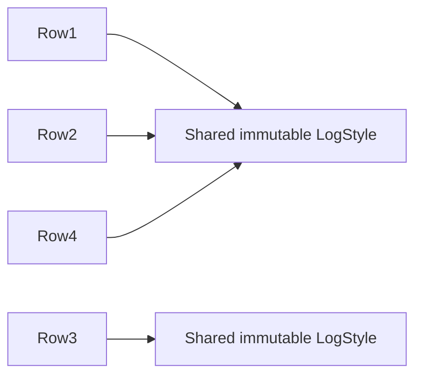
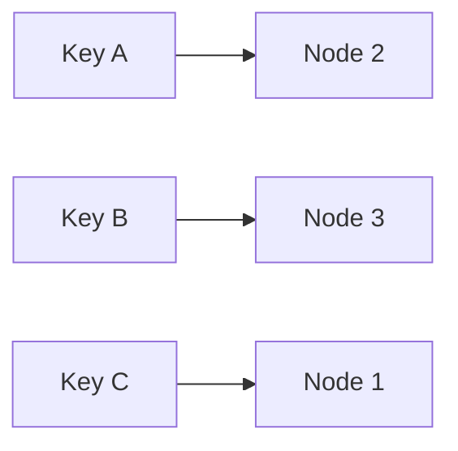
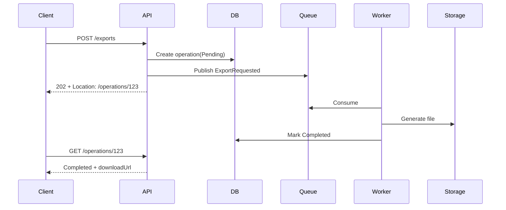
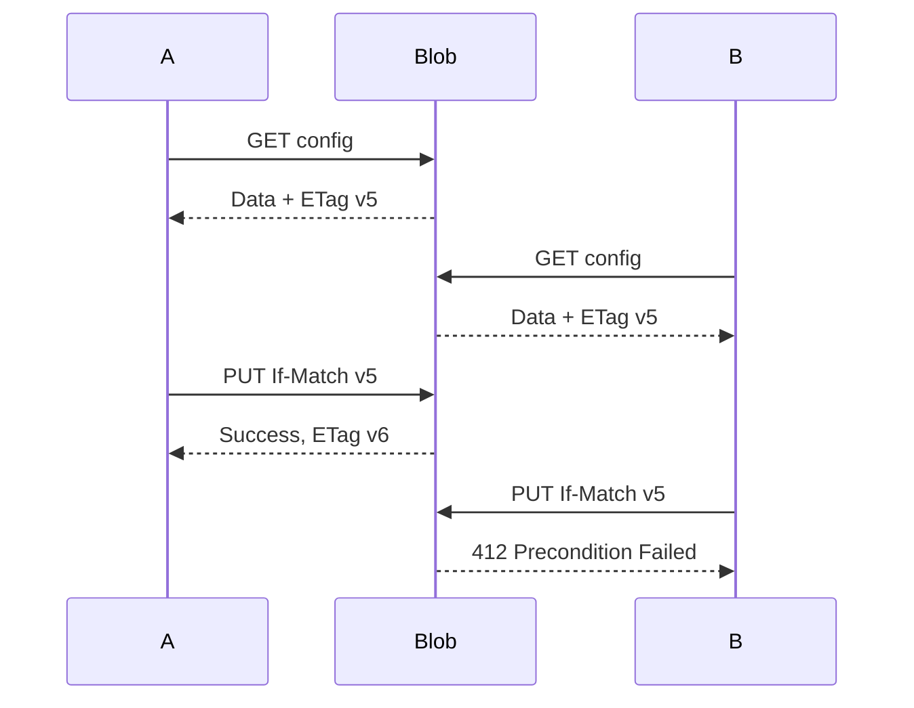
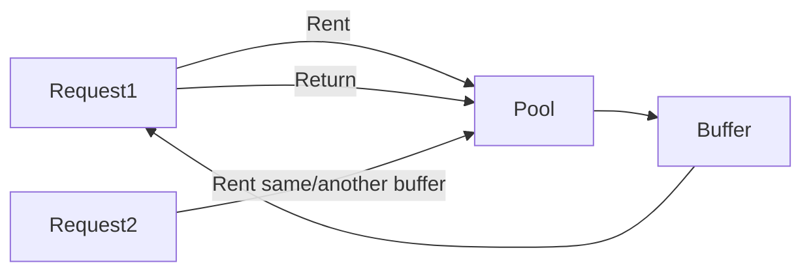
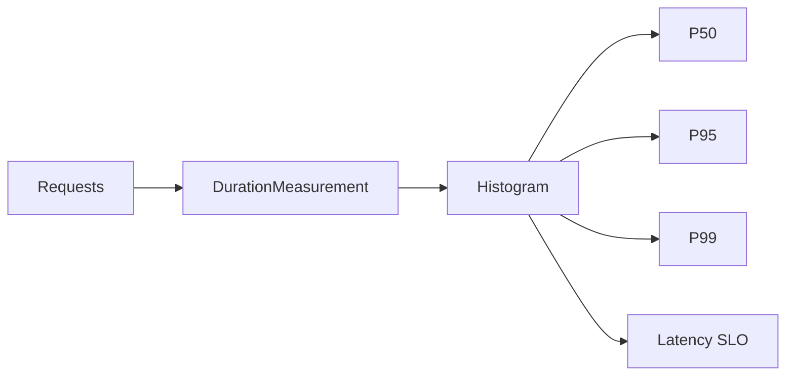
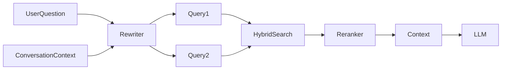
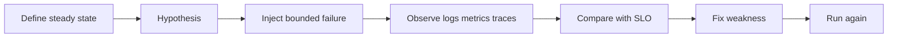

# Daily Knowledge Sharing — 17/08/2026

## Today’s Topics

1. Flyweight Pattern — giảm memory bằng cách chia sẻ immutable state thay vì nhân bản object giống nhau
2. Consistent Hashing — phân phối key trong distributed system mà không phải remap gần như toàn bộ khi node thay đổi
3. REST API Long-Running Workflow với Polling Resource — quản lý trạng thái tác vụ dài hạn sau `202 Accepted`
4. SQL Server Computed Column + Index — biến expression lặp lại thành dữ liệu có thể index và seek hiệu quả
5. EF Core Global Query Filter — áp dụng tenant/soft-delete rule tập trung nhưng tránh hidden query behavior
6. Azure Storage Optimistic Concurrency với ETag — chống lost update trên Blob/Table mà không cần distributed lock
7. .NET `ArrayPool<T>` — giảm allocation trên hot path nhưng phải quản lý ownership và data leakage đúng cách
8. Metrics Histogram — đo latency distribution đúng cách thay vì chỉ nhìn average
9. RAG Query Rewriting — cải thiện retrieval bằng cách tách user intent khỏi câu hỏi nguyên bản
10. Chaos Engineering — kiểm tra giả định về failure trước khi production tự kiểm tra hộ chúng ta

---

# 1. Flyweight Pattern — giảm memory bằng cách chia sẻ immutable state thay vì nhân bản object giống nhau

### 1. What is it?

Flyweight Pattern là một structural design pattern dùng để giảm memory khi hệ thống có rất nhiều object nhỏ nhưng phần lớn dữ liệu của chúng giống nhau.

Ý tưởng cốt lõi là tách state của object thành hai phần:

- **Intrinsic state**: dữ liệu dùng chung, thường immutable, có thể chia sẻ giữa nhiều object.
- **Extrinsic state**: dữ liệu riêng của từng instance, được truyền vào lúc sử dụng hoặc lưu ở nơi khác.

Ví dụ hệ thống hiển thị hàng triệu log row có thể có `LogLevel`, icon, font style, category metadata giống nhau. Thay vì mỗi row giữ một object style riêng, ta dùng chung một `LogStyle` cho tất cả row cùng loại.

### 2. Why does it exist?

Naive implementation thường tạo object theo từng record:

```csharp
var row = new LogRow
{
    Message = message,
    Style = new LogStyle("Error", "red", "alert-icon")
};
```

Nếu có 5 triệu row, ta cũng tạo 5 triệu `LogStyle` gần như giống hệt nhau.

Memory tăng không chỉ vì dữ liệu trực tiếp. Runtime còn phải quản lý:

- object header;
- reference;
- GC metadata;
- allocation pressure;
- Gen 0/Gen 1 collection;
- cache locality kém hơn.

Flyweight tồn tại để tránh nhân bản state không cần thiết.

### 3. How does it work?



Một `FlyweightFactory` hoặc cache giữ các object dùng chung.

```csharp
public sealed record LogStyle(string Name, string Icon, string CssClass);

public sealed class LogStyleFactory
{
    private readonly Dictionary<string, LogStyle> _styles = new()
    {
        ["Error"] = new("Error", "alert", "log-error"),
        ["Warning"] = new("Warning", "warning", "log-warning"),
        ["Info"] = new("Info", "info", "log-info")
    };

    public LogStyle Get(string level) => _styles[level];
}
```

Object nghiệp vụ chỉ giữ reference tới flyweight:

```csharp
public sealed record LogRow(DateTime Timestamp, string Message, LogStyle Style);
```

### 4. Practical example

Một reporting service xử lý 2 triệu transaction và gắn `CurrencyMetadata` vào từng row.

Thay vì:

```csharp
new CurrencyMetadata("VND", 0, "₫")
```

cho từng transaction, dùng registry:

```csharp
public static class CurrencyRegistry
{
    public static readonly CurrencyMetadata Vnd = new("VND", 0, "₫");
    public static readonly CurrencyMetadata Usd = new("USD", 2, "$");
}
```

Transaction chỉ giữ reference:

```csharp
public sealed record Payment(decimal Amount, CurrencyMetadata Currency);
```

### 5. Real production scenario

Trong hệ thống timesheet SaaS có hàng triệu entry. Mỗi entry có `ProjectType`, `BillingRule`, `Office`, `StatusMetadata`.

Nếu các metadata này immutable theo phiên bản hiện tại, application có thể chia sẻ object lookup thay vì materialize cùng một cấu trúc nhiều lần trong in-memory processing hoặc export pipeline.

Flow:

```text
Database rows
   ↓
Mapping
   ↓
Shared metadata registry
   ↓
Export/Calculation objects
```

Flyweight thường hữu ích trong:

- render engine;
- document parser;
- game engine;
- compiler AST metadata;
- high-volume export;
- telemetry processing.

### 6. Common mistakes

- Dùng Flyweight cho object mutable, khiến một consumer thay đổi state và ảnh hưởng tất cả consumer khác.
- Tối ưu trước khi đo allocation thực tế.
- Biến factory thành global cache không giới hạn, cuối cùng memory vẫn tăng.
- Nhầm Flyweight với object pool. Flyweight chia sẻ cùng object; object pool tái sử dụng object theo thời gian.
- Đưa extrinsic state vào flyweight, làm object không còn chia sẻ được.

### 7. Trade-offs

**Advantages**

- Giảm allocation và memory footprint.
- Giảm GC pressure.
- Có thể cải thiện CPU cache locality.
- Hữu ích khi số instance rất lớn.

**Costs / Risks**

- Tăng độ phức tạp về ownership/state separation.
- Debug khó hơn nếu object shared bị mutable ngoài ý muốn.
- Lookup factory/cache có chi phí riêng.
- Không mang lại nhiều giá trị nếu số object nhỏ.

### 8. Junior → Middle → Senior understanding

**Junior**

Hiểu rằng nhiều object giống nhau có thể dùng chung immutable metadata.

**Middle**

Biết phân biệt intrinsic/extrinsic state, đo allocation bằng profiler và triển khai cache/factory an toàn.

**Senior / Technical Lead**

Biết khi nào memory optimization thực sự cần thiết, đánh giá GC profile, concurrency, cache lifecycle và tránh pattern hóa một vấn đề chưa được đo.

### 9. Key takeaway

- Flyweight là optimization pattern cho **rất nhiều object có state lặp lại**.
- Shared state nên immutable.
- Đo allocation trước khi áp dụng.
- Flyweight không phải object pool.

---

# 2. Consistent Hashing — phân phối key trong distributed system mà không phải remap gần như toàn bộ khi node thay đổi

### 1. What is it?

Consistent Hashing là kỹ thuật phân phối key lên nhiều node sao cho khi thêm hoặc xóa node, chỉ một phần nhỏ key phải chuyển sang node khác.

Nó thường xuất hiện trong:

- distributed cache;
- sharding;
- service routing;
- storage cluster;
- distributed worker assignment.

### 2. Why does it exist?

Cách đơn giản nhất để chọn node là:

```text
nodeIndex = hash(key) % nodeCount
```

Vấn đề là `nodeCount` đổi từ 4 thành 5 sẽ khiến phần lớn key map sang node khác.

Ví dụ cache cluster đang có hàng triệu key. Scale từ 4 lên 5 node có thể gây cache miss hàng loạt, database bị đập bởi traffic đột biến.

Consistent Hashing giảm số lượng key phải remap khi topology thay đổi.

### 3. How does it work?

Node và key được hash lên cùng một vòng logic.



Conceptually:

```text
0 ------------------------------------ 2^32
|          |          |          |
N1         N2         N3         N1...
```

Một key được gán cho node kế tiếp theo chiều kim đồng hồ.

Khi thêm `N4`, chỉ các key trong đoạn trước `N4` chuyển sang node mới.

Trong thực tế thường dùng **virtual nodes** để phân phối đều hơn.

### 4. Practical example

Một cache client tự phân phối key:

```csharp
public sealed class HashRing
{
    private readonly SortedDictionary<uint, string> _ring = new();

    public void AddNode(string node, int virtualNodes = 100)
    {
        for (var i = 0; i < virtualNodes; i++)
        {
            var hash = Hash($"{node}#{i}");
            _ring[hash] = node;
        }
    }

    public string GetNode(string key)
    {
        var hash = Hash(key);
        foreach (var pair in _ring)
        {
            if (pair.Key >= hash)
                return pair.Value;
        }

        return _ring.First().Value;
    }

    private static uint Hash(string value)
        => BitConverter.ToUInt32(
            System.Security.Cryptography.SHA256.HashData(
                System.Text.Encoding.UTF8.GetBytes(value)), 0);
}
```

Production code cần hash function nhanh hơn và cấu trúc lookup tối ưu hơn, nhưng nguyên lý là như vậy.

### 5. Real production scenario

Một SaaS có 20 cache node. Key dạng:

```text
tenant:{tenantId}:employee:{employeeId}
```

Nếu scale từ 20 lên 24 node:

- modulo hashing làm phần lớn key đổi node;
- consistent hashing chỉ di chuyển một phần key;
- cache warm state được giữ lại tốt hơn;
- database không chịu cache-miss storm lớn.

### 6. Common mistakes

- Không dùng virtual node, làm load phân phối lệch mạnh.
- Hash theo key không ổn định giữa runtime/process.
- Cho rằng consistent hashing đảm bảo load cân bằng tuyệt đối.
- Không thiết kế replication, nên một node fail làm key tạm thời mất cache/data.
- Nhầm consistent hashing với consensus; nó không giải quyết leader election hay consistency protocol.

### 7. Trade-offs

**Advantages**

- Giảm data movement khi topology thay đổi.
- Scale cluster ít disruptive hơn.
- Phù hợp distributed cache/shard routing.

**Costs / Risks**

- Implementation phức tạp hơn modulo hashing.
- Cần virtual nodes và rebalance logic.
- Hot key vẫn có thể làm một node quá tải.
- Không tự giải quyết replication hay durability.

### 8. Junior → Middle → Senior understanding

**Junior**

Hiểu mục đích: giảm số key phải di chuyển khi thêm/xóa node.

**Middle**

Biết implement hash ring, virtual node và debug key distribution.

**Senior / Technical Lead**

Biết kết hợp consistent hashing với replication, hot-key handling, node weighting, failure domain và rollout/rebalancing strategy.

### 9. Key takeaway

- `hash(key) % nodeCount` rất nhạy với thay đổi node count.
- Consistent Hashing giảm remapping khi cluster scale.
- Virtual nodes giúp cân bằng phân phối.
- Nó không thay thế replication hay consensus.

---

# 3. REST API Long-Running Workflow với Polling Resource — quản lý trạng thái tác vụ dài hạn sau `202 Accepted`

### 1. What is it?

Khi API cần thực hiện tác vụ mất hàng chục giây hoặc nhiều phút, giữ HTTP request mở thường không phải lựa chọn tốt.

Một thiết kế phổ biến là:

1. Client gửi command.
2. API trả `202 Accepted`.
3. Response chứa URL của **operation resource**.
4. Background worker xử lý.
5. Client poll operation resource để xem trạng thái.

### 2. Why does it exist?

Giữ request mở lâu tạo nhiều rủi ro:

- reverse proxy timeout;
- client timeout;
- connection bị giữ lâu;
- retry không rõ request đã thực thi tới đâu;
- scale khó hơn;
- user reload browser làm mất trạng thái.

Naive design:

```http
POST /reports/export
```

và chờ 3 phút để trả file là brittle.

### 3. How does it work?



Operation model có thể gồm:

```json
{
  "id": "123",
  "status": "Running",
  "createdAt": "2026-08-17T21:30:00+07:00",
  "progress": 65,
  "resultUrl": null,
  "error": null
}
```

### 4. Practical example

ASP.NET Core:

```csharp
app.MapPost("/exports", async (
    ExportRequest request,
    AppDbContext db,
    IMessagePublisher publisher) =>
{
    var operation = new ExportOperation
    {
        Id = Guid.NewGuid(),
        Status = "Pending",
        CreatedAt = DateTimeOffset.UtcNow
    };

    db.ExportOperations.Add(operation);
    await db.SaveChangesAsync();

    await publisher.PublishAsync(new ExportRequested(operation.Id, request));

    return Results.Accepted(
        $"/operations/{operation.Id}",
        new { operation.Id, operation.Status });
});
```

Endpoint trạng thái:

```csharp
app.MapGet("/operations/{id:guid}", async (Guid id, AppDbContext db) =>
{
    var op = await db.ExportOperations.FindAsync(id);
    return op is null ? Results.NotFound() : Results.Ok(op);
});
```

### 5. Real production scenario

Trong employee-management system, admin upload file 50.000 nhân viên để đồng bộ Microsoft 365.

API không nên giữ request tới khi Graph/Exchange xử lý xong toàn bộ.

Flow:

```text
Upload
→ create operation
→ queue jobs
→ process batches
→ update progress
→ final report
```

Client có thể đóng browser rồi mở lại operation URL sau.

### 6. Common mistakes

- Trả `202` nhưng không có cách kiểm tra trạng thái.
- Không persist operation state, restart service là mất tiến trình.
- Poll quá nhanh, biến status endpoint thành load source mới.
- Không có terminal states rõ ràng: `Completed`, `Failed`, `Cancelled`.
- Không phân biệt retry của command với retry của background step.
- Operation resource lộ thông tin tenant khác vì authorization check thiếu.

### 7. Trade-offs

**Advantages**

- Tránh long-lived HTTP request.
- Tăng reliability với queue/background worker.
- Client có trạng thái rõ ràng.
- Dễ retry và audit hơn.

**Costs / Risks**

- Cần state machine cho operation.
- Cần cleanup record cũ.
- Polling tạo thêm request.
- Cancellation/progress/error contract cần thiết kế kỹ.

### 8. Junior → Middle → Senior understanding

**Junior**

Hiểu vì sao task dài nên dùng `202 Accepted` thay vì giữ request mở.

**Middle**

Biết thiết kế operation resource, background job, progress và error states.

**Senior / Technical Lead**

Cần quyết định idempotency, retry, cancellation, retention, authz, queue semantics, consistency giữa operation state và actual work.

### 9. Key takeaway

- `202 Accepted` nghĩa là **đã nhận**, không phải **đã hoàn thành**.
- Long-running API nên có operation resource.
- Persist trạng thái và authorization cho operation.
- Polling cần backoff hoặc hint như `Retry-After`.

---

# 4. SQL Server Computed Column + Index — biến expression lặp lại thành dữ liệu có thể index và seek hiệu quả

### 1. What is it?

Computed Column là cột có giá trị được tính từ các cột khác trong cùng row.

Ví dụ:

```sql
ALTER TABLE Employees
ADD NormalizedEmail AS LOWER(LTRIM(RTRIM(Email)));
```

Nếu expression deterministic và phù hợp, SQL Server có thể index computed column để query theo expression nhanh hơn.

### 2. Why does it exist?

Một query phổ biến:

```sql
SELECT Id, Email
FROM Employees
WHERE LOWER(LTRIM(RTRIM(Email))) = @email;
```

Dù `Email` có index, optimizer thường không thể seek hiệu quả trực tiếp vì function được áp dụng lên column.

Khi query này chạy hàng nghìn lần mỗi phút, CPU và logical reads tăng mạnh.

### 3. How does it work?

Ta đưa expression thành computed column:

```sql
ALTER TABLE Employees
ADD NormalizedEmail AS LOWER(LTRIM(RTRIM(Email))) PERSISTED;

CREATE INDEX IX_Employees_NormalizedEmail
ON Employees(NormalizedEmail);
```

Sau đó query:

```sql
SELECT Id, Email
FROM Employees
WHERE NormalizedEmail = @email;
```

```text
Before: Scan many rows → calculate expression → compare
After:  Index seek on computed value → fetch matching rows
```

`PERSISTED` lưu kết quả vật lý; không phải mọi computed column bắt buộc persisted để index, nhưng nhiều scenario thực tế dùng persisted để kiểm soát behavior và predictable cost.

### 4. Practical example

Tra cứu employee theo email normalized:

```sql
SELECT EmployeeId, DisplayName
FROM Employees
WHERE NormalizedEmail = 'ha@example.com';
```

EF Core mapping có thể để property read-only:

```csharp
builder.Property(x => x.NormalizedEmail)
    .HasComputedColumnSql("LOWER(LTRIM(RTRIM([Email])))", stored: true);
```

### 5. Real production scenario

Hệ thống identity integration nhận email từ nhiều nguồn có casing và whitespace khác nhau.

Mỗi login/API request cần map email về employee.

Nếu luôn gọi `LOWER/TRIM` trên 3 triệu row, latency tăng. Computed indexed column giúp lookup thành seek ổn định hơn.

### 6. Common mistakes

- Tạo computed column nhưng query vẫn dùng expression cũ.
- Expression không deterministic hoặc không index được.
- Không tính write cost: insert/update phải tính computed value và maintain index.
- Tạo index với selectivity quá thấp.
- Dùng computed column như cách chữa mọi SARGability issue thay vì sửa data model.

### 7. Trade-offs

**Advantages**

- Query expression có thể dùng index seek.
- Logic normalize nằm ở database, nhất quán hơn.
- Giảm CPU cho expression lặp lại.

**Costs / Risks**

- Tăng storage nếu persisted.
- Tăng write amplification.
- Schema phức tạp hơn.
- Expression thay đổi cần migration.

### 8. Junior → Middle → Senior understanding

**Junior**

Biết computed column là giá trị được tính từ column khác.

**Middle**

Biết đọc execution plan, tạo index và kiểm tra logical reads trước/sau.

**Senior / Technical Lead**

Biết cân bằng read gain với write/storage cost, determinism, migration risk và lựa chọn giữa normalize-at-write versus compute-at-query.

### 9. Key takeaway

- Function trên indexed column thường làm query khó seek.
- Computed column có thể biến expression thành target indexable.
- Luôn đo execution plan và logical reads.
- Tối ưu read có thể làm write đắt hơn.

---

# 5. EF Core Global Query Filter — áp dụng tenant/soft-delete rule tập trung nhưng tránh hidden query behavior

### 1. What is it?

Global Query Filter cho phép EF Core tự động thêm predicate vào mọi query của một entity.

Hai use case phổ biến:

- soft delete;
- multi-tenancy.

Ví dụ:

```csharp
builder.HasQueryFilter(x => !x.IsDeleted);
```

Mọi query tới entity đó sẽ ngầm có điều kiện `IsDeleted = 0`.

### 2. Why does it exist?

Nếu mỗi repository/service phải nhớ viết:

```csharp
.Where(x => !x.IsDeleted && x.TenantId == tenantId)
```

thì chỉ cần một developer quên filter là có thể:

- trả dữ liệu đã xóa;
- leak dữ liệu cross-tenant;
- tạo security incident.

Global filter giúp centralize rule.

### 3. How does it work?

Ví dụ tenant-aware DbContext:

```csharp
public sealed class AppDbContext : DbContext
{
    private readonly Guid _tenantId;

    public AppDbContext(
        DbContextOptions<AppDbContext> options,
        ITenantContext tenant) : base(options)
    {
        _tenantId = tenant.TenantId;
    }

    protected override void OnModelCreating(ModelBuilder modelBuilder)
    {
        modelBuilder.Entity<Employee>()
            .HasQueryFilter(x => x.TenantId == _tenantId && !x.IsDeleted);
    }
}
```

Query:

```csharp
var employees = await db.Employees.ToListAsync();
```

thực tế sẽ tương đương:

```sql
SELECT ...
FROM Employees
WHERE TenantId = @tenantId
  AND IsDeleted = 0;
```

### 4. Practical example

Admin cần xem cả record đã soft-delete:

```csharp
var allEmployees = await db.Employees
    .IgnoreQueryFilters()
    .Where(x => x.TenantId == tenantId)
    .ToListAsync();
```

Điểm quan trọng: khi bỏ filter, developer phải tự thêm tenant boundary nếu filter đó cũng chứa tenant condition.

### 5. Real production scenario

Một SaaS quản lý timesheet cho 500 công ty.

Mọi bảng business đều có `TenantId`.

Global filter giúp application query ngắn hơn, nhưng security review phải kiểm tra các điểm dùng:

```csharp
IgnoreQueryFilters()
```

vì đây có thể là escape hatch phá tenant isolation.

### 6. Common mistakes

- Nghĩ Global Query Filter là security boundary tuyệt đối.
- Dùng `IgnoreQueryFilters()` rồi quên filter `TenantId` thủ công.
- Không tạo composite index phù hợp như `(TenantId, IsDeleted, ...)`.
- Quên filter áp dụng cho navigation/Include và tạo kết quả bất ngờ.
- Capture service có lifetime sai vào DbContext.
- Dùng soft delete mọi nơi dù business cần hard-delete thực sự.

### 7. Trade-offs

**Advantages**

- Giảm repeated predicates.
- Giảm nguy cơ quên soft-delete/tenant filter.
- Centralize behavior.

**Costs / Risks**

- Query behavior trở nên implicit.
- Debug query khó hơn nếu developer không nhớ filter tồn tại.
- Escape hatch có thể gây data leak.
- Index strategy phải tính predicate mặc định.

### 8. Junior → Middle → Senior understanding

**Junior**

Hiểu filter được EF tự thêm vào query.

**Middle**

Biết dùng `IgnoreQueryFilters()` có kiểm soát, xem SQL generated và tối ưu index.

**Senior / Technical Lead**

Đánh giá tenant isolation model, threat surface, DbContext lifetime, index design và xem global filter là guardrail chứ không phải security mechanism duy nhất.

### 9. Key takeaway

- Global Query Filter giảm lỗi lặp lại cho soft delete/multi-tenancy.
- Behavior là implicit, vì vậy phải observability/debug tốt.
- `IgnoreQueryFilters()` là operation nhạy cảm.
- Database authorization và tenant architecture vẫn quan trọng.

---

# 6. Azure Storage Optimistic Concurrency với ETag — chống lost update trên Blob/Table mà không cần distributed lock

### 1. What is it?

Azure Storage resource thường có `ETag`, đại diện cho version hiện tại của resource.

Client có thể đọc resource cùng ETag, sau đó update với điều kiện:

```http
If-Match: <etag>
```

Nếu resource đã thay đổi từ lúc client đọc, Azure Storage từ chối update.

Đây là optimistic concurrency.

### 2. Why does it exist?

Giả sử hai worker cùng đọc config:

```text
Version 5
Worker A reads
Worker B reads
```

A update thành version 6.

B vẫn update dựa trên dữ liệu version 5 và vô tình ghi đè thay đổi của A.

Đó là **lost update**.

Distributed lock có thể giải quyết, nhưng tăng complexity và failure mode. ETag cho phép detect conflict ở storage boundary.

### 3. How does it work?



Client B phải quyết định:

- reload và merge;
- retry business operation;
- báo conflict cho user.

### 4. Practical example

Azure Blob SDK:

```csharp
var download = await blob.DownloadContentAsync();
var etag = download.Value.Details.ETag;

var updated = BinaryData.FromString("new content");

await blob.UploadAsync(
    updated,
    new BlobUploadOptions
    {
        Conditions = new BlobRequestConditions
        {
            IfMatch = etag
        }
    });
```

Nếu ETag không còn khớp, SDK ném exception với status `412`.

### 5. Real production scenario

Một SaaS lưu workflow definition dạng JSON trong Blob Storage.

Hai admin mở cùng một workflow:

- Admin A sửa rule approval.
- Admin B sửa notification.

Nếu save không có ETag, B có thể ghi đè toàn bộ file và xóa thay đổi của A.

Với ETag, API phát hiện conflict và yêu cầu B reload hoặc merge.

### 6. Common mistakes

- Đọc ETag nhưng update không gửi `If-Match`.
- Catch `412` rồi retry blind bằng payload cũ, thực chất vẫn ghi đè dữ liệu mới.
- Dùng `If-Match: *` khi cần concurrency protection.
- Nhầm ETag với business version; ETag là storage version token.
- Không xử lý merge conflict ở application layer.

### 7. Trade-offs

**Advantages**

- Không cần lock coordinator riêng.
- Scale tốt cho read-heavy workloads.
- Storage enforce atomic compare-and-set.

**Costs / Risks**

- Conflict phải xử lý ở application.
- Với contention cao, retry có thể nhiều.
- Không phù hợp nếu workflow bắt buộc serialized access liên tục.

### 8. Junior → Middle → Senior understanding

**Junior**

Hiểu ETag như version marker của resource.

**Middle**

Biết implement `If-Match`, handle `412`, reload và retry có điều kiện.

**Senior / Technical Lead**

Biết quyết định optimistic vs pessimistic concurrency dựa trên contention, merge semantics, user experience và consistency requirement.

### 9. Key takeaway

- ETag giúp detect stale update.
- `If-Match` biến update thành compare-and-set.
- `412` là conflict signal, không phải lỗi để retry blind.
- Optimistic concurrency phù hợp khi conflict tương đối hiếm.

---

# 7. .NET `ArrayPool<T>` — giảm allocation trên hot path nhưng phải quản lý ownership và data leakage đúng cách

### 1. What is it?

`ArrayPool<T>` cho phép thuê (`Rent`) một array đã có sẵn và trả lại (`Return`) sau khi dùng, thay vì liên tục tạo array mới.

Nó hữu ích trên hot path có buffer tạm thời:

- serialization;
- compression;
- network processing;
- file parsing;
- protocol handling.

### 2. Why does it exist?

Code đơn giản:

```csharp
var buffer = new byte[64 * 1024];
```

Nếu chạy hàng nghìn lần mỗi giây, allocation rate lớn làm:

- Gen 0 collection thường xuyên;
- Large Object Heap nếu buffer đủ lớn;
- CPU tăng vì GC;
- latency spike.

Pooling giảm số allocation mới.

### 3. How does it work?



Usage chuẩn:

```csharp
var pool = ArrayPool<byte>.Shared;
var buffer = pool.Rent(64 * 1024);

try
{
    // use buffer
}
finally
{
    pool.Return(buffer, clearArray: false);
}
```

`Rent(64 KB)` không đảm bảo array trả về đúng 64 KB; nó có thể lớn hơn.

### 4. Practical example

Đọc stream và tính hash:

```csharp
var buffer = ArrayPool<byte>.Shared.Rent(32 * 1024);

try
{
    int read;
    while ((read = await stream.ReadAsync(buffer.AsMemory(0, buffer.Length))) > 0)
    {
        hash.AppendData(buffer.AsSpan(0, read));
    }
}
finally
{
    ArrayPool<byte>.Shared.Return(buffer);
}
```

### 5. Real production scenario

Một API upload/download file đồng thời cho hàng trăm user.

Nếu mỗi request tạo nhiều buffer 64–256 KB, allocation pressure có thể cao dù business logic nhẹ.

Sau profiler cho thấy GC time lớn, `ArrayPool<T>` có thể giảm allocation đáng kể.

### 6. Common mistakes

- Quên `Return` khi exception xảy ra.
- Giữ reference tới buffer sau khi đã return.
- Giả định buffer được zero hóa trước khi rent lại.
- Trả buffer chứa secret/PII mà không `clearArray: true` khi threat model yêu cầu.
- Pool mọi thứ dù allocation không phải bottleneck.
- Return buffer đang được async operation khác sử dụng.

### 7. Trade-offs

**Advantages**

- Giảm allocation và GC pressure.
- Hữu ích cho buffer lớn/lặp lại.
- Có sẵn trong BCL.

**Costs / Risks**

- Ownership phức tạp hơn.
- Có nguy cơ use-after-return.
- Dữ liệu cũ có thể còn trong buffer.
- Có thể làm code khó đọc hơn cho lợi ích nhỏ.

### 8. Junior → Middle → Senior understanding

**Junior**

Hiểu pooling là tái sử dụng buffer thay vì luôn tạo mới.

**Middle**

Biết dùng `try/finally`, span/memory và tránh giữ buffer sau khi return.

**Senior / Technical Lead**

Chỉ áp dụng sau khi đo allocation profile; xem xét PII clearing, concurrency, LOH, throughput và maintenance cost.

### 9. Key takeaway

- `ArrayPool<T>` là performance tool, không phải default coding style.
- Luôn quản lý ownership rõ ràng.
- Không dùng buffer sau khi `Return`.
- Đo GC/allocation trước và sau tối ưu.

---

# 8. Metrics Histogram — đo latency distribution đúng cách thay vì chỉ nhìn average

### 1. What is it?

Histogram là metric ghi nhận phân phối của các observation, ví dụ request duration.

Thay vì chỉ biết:

```text
average latency = 120 ms
```

histogram cho phép xem:

- p50;
- p90;
- p95;
- p99;
- tỷ lệ request dưới/ trên các threshold.

### 2. Why does it exist?

Average dễ che giấu tail latency.

Ví dụ 100 request:

- 95 request: 50 ms;
- 5 request: 2.000 ms.

Average khoảng 147 ms nghe không quá xấu, nhưng 5% user đang chờ 2 giây.

Production reliability thường bị quyết định bởi tail latency hơn là average.

### 3. How does it work?

Histogram nhóm observation vào bucket:

```text
<= 50ms    700
<= 100ms   920
<= 250ms   980
<= 500ms   995
<= 1s      998
> 1s         2
```



### 4. Practical example

OpenTelemetry .NET:

```csharp
private static readonly Meter Meter = new("MyApp.Api");
private static readonly Histogram<double> Duration =
    Meter.CreateHistogram<double>("http.server.duration", "ms");

var sw = Stopwatch.StartNew();
try
{
    await next(context);
}
finally
{
    Duration.Record(
        sw.Elapsed.TotalMilliseconds,
        new KeyValuePair<string, object?>("route", route),
        new KeyValuePair<string, object?>("status", context.Response.StatusCode));
}
```

### 5. Real production scenario

API timesheet có average latency 180 ms, dashboard trông ổn.

Nhưng p99 tăng lên 4 giây vào giờ 17:00.

Histogram cho thấy tail latency spike. Trace tương ứng phát hiện connection pool saturation ở database.

Không có histogram, team có thể bỏ qua vấn đề vì average vẫn thấp.

### 6. Common mistakes

- Chỉ monitor average.
- Tạo bucket không phù hợp với latency range thực tế.
- Gắn high-cardinality dimensions như `userId` vào metric.
- So sánh percentile được aggregate sai qua nhiều instance/window.
- Không tách route/status class cần thiết.

### 7. Trade-offs

**Advantages**

- Thấy latency distribution.
- Hữu ích cho SLO và tail latency.
- Cho biết percentage vượt threshold.

**Costs / Risks**

- Bucket design ảnh hưởng độ chính xác/cost.
- Dimension quá nhiều tăng telemetry cost.
- Percentile aggregation cần hiểu backend observability.

### 8. Junior → Middle → Senior understanding

**Junior**

Biết average không phản ánh trải nghiệm user chậm nhất.

**Middle**

Biết instrument histogram, đọc p95/p99 và correlate với traces.

**Senior / Technical Lead**

Thiết kế SLI latency, bucket strategy, aggregation window, cardinality budget và alert theo impact thay vì metric noise.

### 9. Key takeaway

- Average latency thường che tail latency.
- Histogram giúp nhìn p50/p95/p99 và threshold distribution.
- Cardinality phải được kiểm soát.
- Metric cần kết nối với trace/log để điều tra root cause.

---

# 9. RAG Query Rewriting — cải thiện retrieval bằng cách tách user intent khỏi câu hỏi nguyên bản

### 1. What is it?

Query Rewriting là bước biến câu hỏi user thành một hoặc nhiều search query tối ưu hơn trước khi gọi vector search, keyword search hoặc hybrid search.

User thường hỏi theo hội thoại:

```text
"Còn trường hợp đó trên môi trường QA thì sao?"
```

Câu này gần như vô nghĩa nếu đưa thẳng vào vector search vì thiếu context.

Query rewriter có thể biến nó thành:

```text
"Employee offboarding mailbox forwarding behavior in QA environment"
```

### 2. Why does it exist?

Retrieval quality phụ thuộc mạnh vào query.

User language thường có:

- pronoun;
- ellipsis;
- typo;
- business shorthand;
- nhiều intent trong một câu;
- context nằm ở turn trước.

Nếu embedding/search dùng nguyên văn, relevant document có thể không được retrieve.

### 3. How does it work?



Rewriter nên tạo **search representation**, không tự trả lời câu hỏi.

Deterministic application vẫn phải kiểm soát:

- tenant filter;
- ACL;
- document scope;
- result limit;
- tool permissions.

### 4. Practical example

Pseudo-realistic .NET workflow:

```csharp
var rewritten = await queryRewriter.RewriteAsync(new RewriteInput
{
    Question = userQuestion,
    ConversationSummary = conversationSummary
});

var results = await search.SearchAsync(
    rewritten.Queries,
    tenantId,
    userPermissions,
    topK: 20);

var reranked = await reranker.RerankAsync(userQuestion, results);
```

Structured output:

```json
{
  "queries": [
    "Azure Service Bus duplicate message handling",
    "idempotent consumer duplicate delivery"
  ]
}
```

### 5. Real production scenario

AI assistant nội bộ cho engineering docs.

User hỏi:

```text
"Nếu nó retry lần hai thì sao?"
```

Conversation trước nói về `Azure Service Bus` consumer.

Nếu search nguyên câu, retrieval yếu. Rewriter dùng context để tạo query liên quan tới duplicate delivery/idempotent consumer.

### 6. Common mistakes

- Cho model rewrite thành một câu hỏi mang bias hoặc tự thêm assumption không có trong context.
- Dùng rewrite để bypass permission filter.
- Tạo quá nhiều query, tăng latency và token/search cost.
- Không log query rewrite nên khó debug retrieval failure.
- Không evaluate retrieval trước/sau khi rewrite.
- Rewriter vô tình trả lời câu hỏi thay vì tạo query.

### 7. Trade-offs

**Advantages**

- Tăng recall cho conversational query.
- Hỗ trợ acronym, synonym và multi-query retrieval.
- Có thể cải thiện hybrid search đáng kể.

**Costs / Risks**

- Thêm LLM latency/cost.
- Rewrite sai có thể làm retrieval tệ hơn.
- Cần evaluation dataset.
- Tăng pipeline complexity.

### 8. Junior → Middle → Senior understanding

**Junior**

Hiểu rằng câu hỏi user chưa chắc là search query tốt.

**Middle**

Biết xây rewrite step, structured output, hybrid search và logging.

**Senior / Technical Lead**

Đánh giá retrieval metrics, latency budget, security filters, fallback khi rewrite lỗi và phân biệt semantic transformation với authorization boundary.

### 9. Key takeaway

- Query rewriting giúp conversational RAG retrieve tốt hơn.
- Rewriter chỉ nên tối ưu truy vấn, không kiểm soát quyền.
- Đo retrieval quality trước/sau thay vì tin cảm giác.
- Multi-query có ích nhưng làm tăng cost/latency.

---

# 10. Chaos Engineering — kiểm tra giả định về failure trước khi production tự kiểm tra hộ chúng ta

### 1. What is it?

Chaos Engineering là phương pháp chủ động đưa failure có kiểm soát vào hệ thống để kiểm tra xem system có thật sự resilient như thiết kế hay không.

Ví dụ:

- tăng latency database;
- ngắt một instance;
- làm downstream trả `500`;
- revoke network route;
- làm queue backlog tăng;
- kill container;
- giả lập dependency timeout.

Mục tiêu không phải “phá hệ thống cho vui”, mà là validate assumption.

### 2. Why does it exist?

Architecture diagram thường nói:

```text
Service A → retry → circuit breaker → fallback
```

Nhưng production có thể khác:

- retry làm downstream chết nhanh hơn;
- timeout của upstream dài hơn proxy timeout;
- health check vẫn báo healthy dù DB connection pool cạn;
- fallback cũng phụ thuộc cùng database;
- queue worker restart làm duplicate side effect.

Chaos Engineering biến các assumption này thành experiment.

### 3. How does it work?

Một experiment tốt có flow:



Ví dụ steady state:

```text
99.9% checkout requests < 1s
error rate < 0.5%
```

Experiment:

```text
Increase payment API latency to 3s for 10% traffic.
```

Expected:

```text
Timeout triggers, circuit breaker opens, checkout degrades gracefully.
```

### 4. Practical example

Trong integration test environment, bọc HTTP dependency bằng fault injection handler:

```csharp
public sealed class FaultInjectionHandler : DelegatingHandler
{
    protected override async Task<HttpResponseMessage> SendAsync(
        HttpRequestMessage request,
        CancellationToken cancellationToken)
    {
        if (Random.Shared.NextDouble() < 0.1)
            await Task.Delay(TimeSpan.FromSeconds(2), cancellationToken);

        return await base.SendAsync(request, cancellationToken);
    }
}
```

Production experiment nên dùng controlled tooling, scope nhỏ, observability đầy đủ và kill switch.

### 5. Real production scenario

Một SaaS phụ thuộc Microsoft Graph để sync employee.

Team tin rằng Graph timeout sẽ không ảnh hưởng API chính vì work nằm trong background worker.

Chaos test làm Graph latency tăng 10 giây.

Kết quả phát hiện:

- worker concurrency vẫn quá cao;
- connection pool outbound bị saturation;
- retry tạo thêm request;
- queue backlog tăng nhanh;
- alert chỉ dựa trên HTTP 500 nên không báo backlog.

Experiment cho thấy resilience thiếu ở capacity control và observability, không chỉ retry policy.

### 6. Common mistakes

- Chaos test production mà không có blast-radius control.
- Không định nghĩa steady-state metric trước experiment.
- Chạy khi observability chưa đủ.
- Inject failure quá rộng ở lần đầu.
- Không có stop condition/kill switch.
- Dùng chaos để thay thế load test, integration test hoặc DR test.
- Chỉ kill instance mà không test latency, partial failure, saturation và dependency degradation.

### 7. Trade-offs

**Advantages**

- Phát hiện hidden failure modes.
- Validate resilience thực tế.
- Cải thiện incident readiness.
- Buộc architecture assumption trở thành thứ đo được.

**Costs / Risks**

- Có thể tạo incident nếu scope sai.
- Cần observability và operational maturity.
- Tốn thời gian thiết kế experiment.
- Không phù hợp với mọi hệ thống/team ở cùng mức độ.

### 8. Junior → Middle → Senior understanding

**Junior**

Hiểu rằng system resilient cần được kiểm tra bằng failure thực tế, không chỉ bằng code review.

**Middle**

Biết tạo fault injection trong test/staging và đọc telemetry khi failure xảy ra.

**Senior / Technical Lead**

Thiết kế hypothesis, steady state, blast radius, SLO, kill switch, production experiment và ưu tiên failure scenario dựa trên business impact.

### 9. Key takeaway

- Resilience phải được **chứng minh**, không chỉ được thiết kế.
- Mỗi chaos experiment cần hypothesis và steady-state metric.
- Bắt đầu với blast radius nhỏ.
- Failure test chỉ có giá trị khi logs, metrics, traces và alerts đủ tốt.
