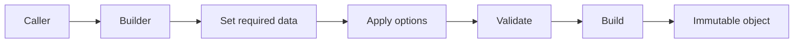
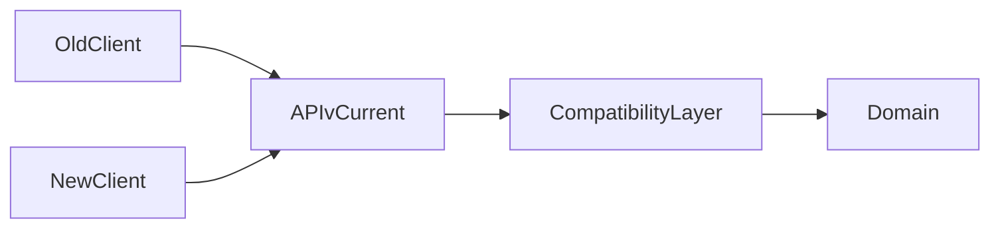
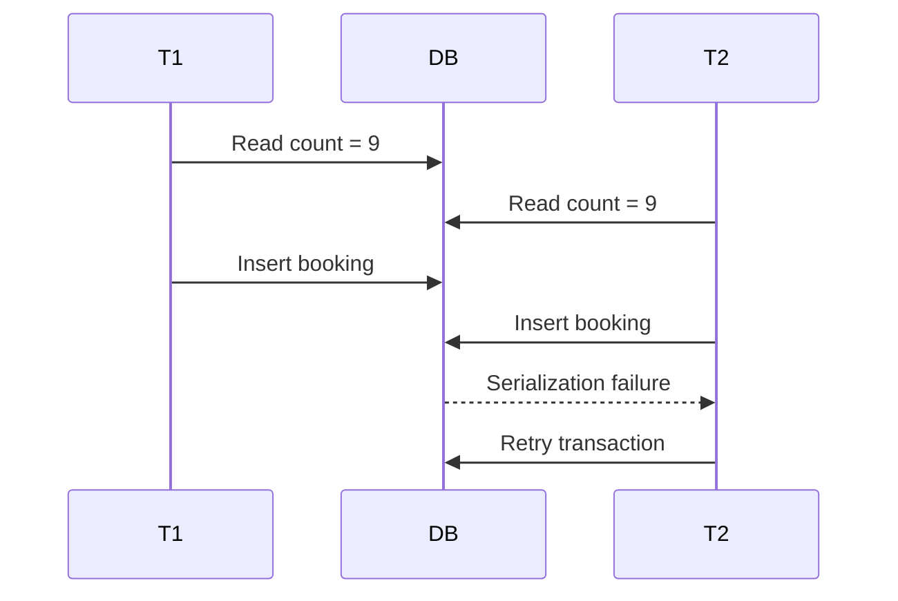
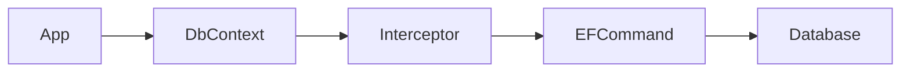
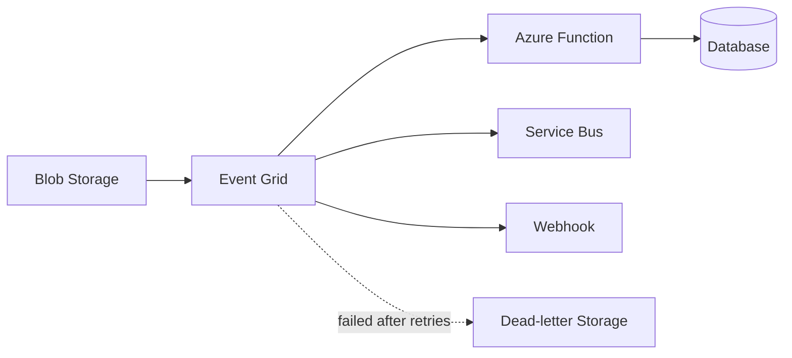
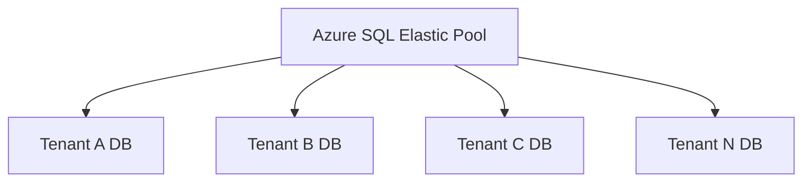
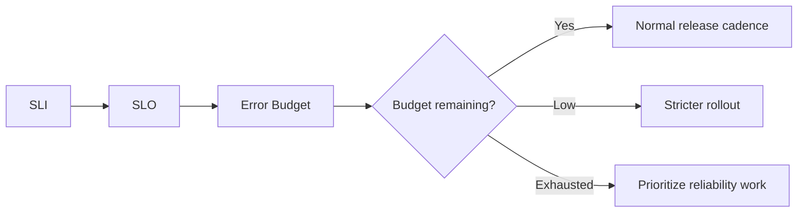
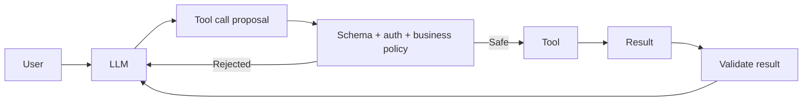
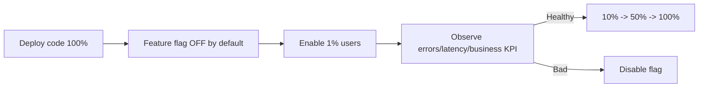

# Daily Knowledge Sharing — 17/08/2026

## Today’s Topics

1. Builder Pattern — tạo object phức tạp theo từng bước mà không biến constructor thành “parameter soup”
2. API Contract Evolution — thay đổi request/response mà vẫn giữ backward compatibility cho client cũ
3. PostgreSQL Serializable Isolation — ngăn anomaly bằng serialization failure thay vì khóa mọi thứ từ đầu
4. EF Core Interceptor — đặt cross-cutting data behavior đúng chỗ nhưng tránh business logic ẩn
5. System.Text.Json Source Generation — giảm reflection và allocation trên hot path serialization
6. Azure Event Grid Delivery Semantics — event routing at-least-once, retry, dead-letter và idempotent consumer
7. Azure SQL Elastic Pool — chia sẻ compute budget giữa nhiều database có tải lệch nhau
8. Observability Error Budget Policy — biến SLO thành quyết định release và reliability cụ thể
9. AI Tool Result Validation — model có thể chọn tool, nhưng deterministic code phải xác thực dữ liệu và side effect
10. Progressive Delivery với Feature Flag + Telemetry Gate — release code trước, bật capability sau theo dữ liệu production

---

# 1. Builder Pattern — tạo object phức tạp theo từng bước mà không biến constructor thành “parameter soup”

### 1. What is it?

Builder Pattern là cách tách quá trình **xây dựng một object phức tạp** khỏi object cuối cùng. Thay vì truyền 10–20 tham số vào constructor hoặc tạo nhiều overload khó đọc, ta dùng một builder để cấu hình dần từng phần rồi gọi `Build()`.

Builder hữu ích nhất khi object có nhiều option, nhiều combination hợp lệ, hoặc quá trình tạo object phải enforce một số invariant trước khi instance được sử dụng.

### 2. Why does it exist?

Một constructor như sau nhanh chóng trở nên khó đọc:

```csharp
var request = new ExportRequest(
    employeeId,
    from,
    to,
    true,
    false,
    null,
    "xlsx",
    "vi-VN",
    true,
    5000);
```

Nhìn vào call site gần như không biết `true`, `false`, `5000` nghĩa là gì. Khi thêm option mới, constructor tiếp tục phình ra và mọi caller có thể bị ảnh hưởng.

Builder giải quyết ba vấn đề: tăng readability, gom validation của quá trình xây dựng, và cho phép reuse một construction workflow.

### 3. How does it work?



Builder thường giữ mutable state tạm thời. `Build()` kiểm tra state rồi tạo ra object cuối cùng, lý tưởng là immutable.

### 4. Practical example

```csharp
public sealed record ExportRequest(
    Guid EmployeeId,
    DateOnly From,
    DateOnly To,
    string Format,
    bool IncludeDetails,
    int MaxRows);

public sealed class ExportRequestBuilder
{
    private Guid _employeeId;
    private DateOnly _from;
    private DateOnly _to;
    private string _format = "xlsx";
    private bool _includeDetails;
    private int _maxRows = 10_000;

    public ExportRequestBuilder ForEmployee(Guid id)
    {
        _employeeId = id;
        return this;
    }

    public ExportRequestBuilder Between(DateOnly from, DateOnly to)
    {
        _from = from;
        _to = to;
        return this;
    }

    public ExportRequestBuilder IncludeDetails()
    {
        _includeDetails = true;
        return this;
    }

    public ExportRequest Build()
    {
        if (_employeeId == Guid.Empty)
            throw new InvalidOperationException("Employee is required.");
        if (_from > _to)
            throw new InvalidOperationException("Invalid date range.");

        return new ExportRequest(
            _employeeId, _from, _to, _format, _includeDetails, _maxRows);
    }
}
```

### 5. Real production scenario

Trong hệ thống report/timesheet, mỗi loại export có nhiều option: khoảng ngày, employee scope, format, locale, include detail, chunk size, masking policy. Builder giúp Application Layer dựng request rõ ràng trước khi gửi sang background worker.

### 6. Common mistakes

- Dùng Builder cho object rất đơn giản chỉ có 2–3 field bắt buộc.
- Cho phép `Build()` tạo object invalid.
- Builder chứa business operation thay vì chỉ construction logic.
- Reuse cùng một builder instance giữa nhiều thread dù builder có mutable state.
- Dùng Builder thay cho named arguments khi bài toán chưa đủ phức tạp.

### 7. Trade-offs

**Advantages**

- Call site dễ đọc.
- Dễ thêm optional configuration.
- Có một nơi validate construction rule.
- Tạo object immutable dễ hơn.

**Costs / Risks**

- Thêm class và boilerplate.
- Có thể overengineer object đơn giản.
- Builder mutable phải quản lý lifetime cẩn thận.

### 8. Junior → Middle → Senior understanding

**Junior**: hiểu Builder giúp tạo object nhiều option dễ đọc hơn.

**Middle**: biết thiết kế fluent API, enforce required fields và tránh shared mutable builder.

**Senior / Technical Lead**: quyết định khi nào Builder thực sự có giá trị, khi nào constructor/named arguments/factory đã đủ; giữ boundary giữa construction logic và domain logic.

### 9. Key takeaway

- Builder giải quyết complexity của **construction**, không phải mọi loại complexity.
- `Build()` nên là checkpoint đảm bảo object hợp lệ.
- Object cuối cùng nên càng immutable càng tốt.

---

# 2. API Contract Evolution — thay đổi request/response mà vẫn giữ backward compatibility cho client cũ

### 1. What is it?

API Contract Evolution là cách thay đổi contract của API theo thời gian mà không làm client đang chạy bị hỏng. Đây là bài toán quan trọng với mobile app, public API, microservices hoặc nhiều frontend release độc lập.

Backward-compatible change nghĩa là server mới vẫn hiểu request cũ và response mới vẫn nằm trong expectation hợp lý của client cũ.

### 2. Why does it exist?

Naive approach là sửa DTO trực tiếp rồi deploy đồng thời mọi consumer. Điều này chỉ hoạt động khi tất cả hệ thống có cùng release cycle.

Trong production, mobile app cũ có thể tồn tại hàng tháng; downstream service có thể deploy chậm hơn; third-party client thậm chí không nằm trong quyền kiểm soát của team.

### 3. How does it work?



Một số nguyên tắc thường an toàn:

- Thêm field optional thường an toàn hơn đổi nghĩa field cũ.
- Không đổi type `string -> int` trên cùng field.
- Không rename/delete field ngay lập tức.
- Enum mới có thể làm client cũ fail nếu client deserialize strict.
- Request mới nên có default behavior hợp lý khi client không gửi field mới.

### 4. Practical example

Contract cũ:

```json
{
  "employeeId": "123",
  "status": "Approved"
}
```

Muốn thêm lý do phê duyệt:

```csharp
public sealed record UpdateStatusRequest(
    string EmployeeId,
    string Status,
    string? Comment = null);
```

Client cũ không gửi `comment` vẫn chạy được.

Nếu cần thay đổi lớn, dùng endpoint/version mới:

```text
POST /api/v1/approvals/{id}/status
POST /api/v2/approvals/{id}/decision
```

### 5. Real production scenario

Một mobile app đang dùng API timesheet. Backend muốn đổi `status` từ string sang object chứa code, display name và reason. Nếu đổi trực tiếp, app cũ crash khi parse response. Cách an toàn hơn là giữ field cũ, thêm field mới hoặc phát hành version mới rồi deprecate có kế hoạch.

### 6. Common mistakes

- Chỉ test với client mới nhất.
- Cho rằng “thêm enum value” luôn backward compatible.
- Xóa field chỉ vì backend không còn dùng.
- Đổi nullability mà không xem dữ liệu cũ.
- Dùng versioning để né mọi quyết định compatibility nhỏ.
- Không có contract/integration tests giữa producer-consumer.

### 7. Trade-offs

**Advantages**

- Giảm release coupling.
- Mobile/third-party client ổn định hơn.
- Rollout và rollback an toàn hơn.

**Costs / Risks**

- Server phải hỗ trợ legacy contract một thời gian.
- DTO và mapping phức tạp hơn.
- Cần deprecation policy và telemetry usage.

### 8. Junior → Middle → Senior understanding

**Junior**: hiểu thay đổi DTO có thể phá client dù code backend compile.

**Middle**: biết phân loại additive/breaking change, viết contract test và giữ default behavior.

**Senior / Technical Lead**: quản lý lifecycle contract, deprecation window, telemetry client version và phối hợp release giữa nhiều hệ thống.

### 9. Key takeaway

- Contract là cam kết với consumer, không chỉ là class C#.
- Additive change thường an toàn hơn semantic change.
- Backward compatibility là một phần của deployment design.

---

# 3. PostgreSQL Serializable Isolation — ngăn anomaly bằng serialization failure thay vì khóa mọi thứ từ đầu

### 1. What is it?

`SERIALIZABLE` là isolation level mạnh nhất của PostgreSQL. Mục tiêu là làm kết quả của các transaction concurrent **tương đương với một thứ tự chạy tuần tự nào đó**.

PostgreSQL không đơn giản khóa toàn bộ dữ liệu. Nó dùng Serializable Snapshot Isolation (SSI), theo dõi dependency giữa transaction và abort một transaction khi phát hiện execution không thể serialize an toàn.

### 2. Why does it exist?

`READ COMMITTED` đủ cho nhiều CRUD, nhưng có các anomaly liên quan business rule nhiều row.

Ví dụ hai transaction cùng kiểm tra “còn ít hơn 10 booking” rồi cả hai cùng insert. Mỗi transaction riêng lẻ đều thấy điều kiện hợp lệ nhưng kết quả cuối có thể vượt giới hạn.

### 3. How does it work?



Khác với pessimistic locking, database có thể cho transaction tiến khá xa rồi abort một transaction khi phát hiện dangerous dependency.

### 4. Practical example

```sql
BEGIN TRANSACTION ISOLATION LEVEL SERIALIZABLE;

SELECT COUNT(*)
FROM bookings
WHERE room_id = 10
  AND booking_date = DATE '2026-08-20';

-- nếu count < 10 thì insert
INSERT INTO bookings(room_id, booking_date, employee_id)
VALUES (10, DATE '2026-08-20', 123);

COMMIT;
```

Ứng dụng phải sẵn sàng retry khi nhận serialization failure (`SQLSTATE 40001`).

### 5. Real production scenario

Trong hệ thống booking hoặc quota, invariant không nằm trên một row đơn lẻ mà phụ thuộc tập dữ liệu. Serializable giúp giữ invariant mà không cần tự thiết kế distributed/business lock quá sớm.

### 6. Common mistakes

- Bật Serializable rồi không retry `40001`.
- Cho transaction quá dài, chứa HTTP call hoặc user interaction.
- Nghĩ Serializable không có cost.
- Dùng nó thay cho unique constraint khi constraint đã diễn tả invariant tốt hơn.
- Retry vô hạn không có backoff/stop condition.

### 7. Trade-offs

**Advantages**

- Reasoning về consistency đơn giản hơn.
- Chặn anomaly khó phát hiện.
- Có thể tránh custom locking phức tạp.

**Costs / Risks**

- Có serialization failure dưới contention.
- Transaction dài làm conflict tăng.
- Throughput có thể giảm ở workload tranh chấp cao.

### 8. Junior → Middle → Senior understanding

**Junior**: biết isolation level ảnh hưởng transaction nhìn thấy dữ liệu concurrent thế nào.

**Middle**: xử lý `40001`, giữ transaction ngắn và test concurrency.

**Senior / Technical Lead**: quyết định invariant nào nên dùng constraint, lock, optimistic concurrency hay Serializable; đo contention trước khi chọn.

### 9. Key takeaway

- Serializable không có nghĩa “không bao giờ conflict”; nó có thể abort để bảo toàn consistency.
- Retry là một phần của design.
- Chỉ nâng isolation khi business invariant thực sự cần.

---

# 4. EF Core Interceptor — đặt cross-cutting data behavior đúng chỗ nhưng tránh business logic ẩn

### 1. What is it?

EF Core Interceptor cho phép can thiệp vào các điểm như command execution, connection, transaction, `SaveChanges` mà không sửa từng repository/service.

Nó phù hợp với cross-cutting concern: audit metadata, diagnostic, query tagging, command timing, hoặc một số policy kỹ thuật liên quan persistence.

### 2. Why does it exist?

Nếu mỗi service đều tự set `CreatedAt`, `UpdatedAt`, log SQL timing hay inject correlation metadata, code bị lặp và dễ thiếu consistency.

Interceptor gom behavior kỹ thuật về một chỗ gần persistence pipeline.

### 3. How does it work?



Interceptor được gọi tại lifecycle hook cụ thể. Ví dụ `SaveChangesInterceptor` có thể inspect `ChangeTracker` trước khi SQL được gửi xuống DB.

### 4. Practical example

```csharp
public sealed class AuditSaveChangesInterceptor : SaveChangesInterceptor
{
    public override InterceptionResult<int> SavingChanges(
        DbContextEventData eventData,
        InterceptionResult<int> result)
    {
        var db = eventData.Context;
        if (db is null) return result;

        foreach (var entry in db.ChangeTracker.Entries<IAuditable>())
        {
            if (entry.State == EntityState.Added)
                entry.Entity.CreatedAtUtc = DateTime.UtcNow;

            if (entry.State == EntityState.Modified)
                entry.Entity.UpdatedAtUtc = DateTime.UtcNow;
        }

        return result;
    }
}
```

### 5. Real production scenario

Một SaaS có hàng chục aggregate cần `CreatedAt`, `UpdatedAt`, actor id và correlation id. Interceptor giúp đảm bảo metadata persistence đồng nhất mà handler không phải nhớ set từng field.

### 6. Common mistakes

- Đưa business rule vào interceptor khiến flow khó nhìn thấy.
- Interceptor gọi external API trong `SavingChanges`.
- Dùng service scoped sai lifetime trong interceptor singleton.
- Thay đổi entity state ngoài dự kiến.
- Không test behavior khi `SaveChanges` fail/retry.

### 7. Trade-offs

**Advantages**

- Giảm boilerplate.
- Centralize technical policy.
- Dễ instrument EF pipeline.

**Costs / Risks**

- Hidden behavior làm debugging khó.
- Lifetime/dependency phức tạp.
- Dễ lạm dụng như “magic hook”.

### 8. Junior → Middle → Senior understanding

**Junior**: hiểu interceptor là hook của persistence pipeline.

**Middle**: biết implement audit/logging và test tác động lên ChangeTracker.

**Senior / Technical Lead**: giữ ranh giới rõ giữa technical concern và business behavior; đánh giá observability và failure semantics.

### 9. Key takeaway

- Interceptor tốt cho cross-cutting persistence concern.
- Đừng giấu business rule quan trọng trong hook khó thấy.
- Mọi interceptor có side effect cần được test như production code thật.

---

# 5. System.Text.Json Source Generation — giảm reflection và allocation trên hot path serialization

### 1. What is it?

System.Text.Json source generation tạo metadata serialization tại compile time thay vì phụ thuộc hoàn toàn vào runtime reflection.

Mục tiêu là giảm startup cost, allocation và overhead trong workload serialize/deserialize lặp lại nhiều lần; đồng thời phù hợp hơn với Native AOT/trimming.

### 2. Why does it exist?

Serialization thường nằm trên hot path của API. Khi traffic lớn, chi phí nhỏ trên mỗi request nhân lên thành CPU và allocation đáng kể.

Tối ưu đúng quy trình phải là:

```text
Symptom → measure → identify serialization cost → benchmark → optimize → measure again
```

Không nên bật source generation chỉ vì “nghe nhanh hơn”.

### 3. How does it work?

Compiler tạo metadata cho các type đã khai báo trước. Runtime không cần discover property contract lặp lại bằng reflection.

### 4. Practical example

```csharp
[JsonSerializable(typeof(EmployeeResponse))]
[JsonSerializable(typeof(List<EmployeeResponse>))]
internal partial class ApiJsonContext : JsonSerializerContext
{
}
```

ASP.NET Core:

```csharp
builder.Services.ConfigureHttpJsonOptions(options =>
{
    options.SerializerOptions.TypeInfoResolverChain.Insert(0, ApiJsonContext.Default);
});
```

Sau đó benchmark bằng BenchmarkDotNet hoặc đo CPU/allocation trong production trace trước và sau thay đổi.

### 5. Real production scenario

API trả danh sách employee hoặc timesheet hàng nghìn lần/phút. DB đã nhanh nhưng profile cho thấy CPU cao ở serialization. Source generation có thể giảm một phần overhead mà không đổi contract.

### 6. Common mistakes

- Tối ưu serialization khi bottleneck thật là SQL/network.
- Quên đăng ký type mới.
- Dùng custom converter không tương thích nhưng không test.
- Benchmark payload quá nhỏ, không giống production.
- Chỉ nhìn average latency thay vì CPU/allocation/p95.

### 7. Trade-offs

**Advantages**

- Giảm reflection runtime.
- Tốt cho AOT/trimming.
- Có thể giảm allocation và startup overhead.

**Costs / Risks**

- Cấu hình thêm.
- Dynamic/unregistered types khó hơn.
- Lợi ích phụ thuộc workload.

### 8. Junior → Middle → Senior understanding

**Junior**: hiểu serialization cũng tiêu tốn CPU/memory.

**Middle**: biết source-gen setup, benchmark và kiểm tra converter compatibility.

**Senior / Technical Lead**: chỉ tối ưu sau profiling; đánh giá lợi ích end-to-end và maintenance cost.

### 9. Key takeaway

- Performance optimization phải dựa trên measurement.
- Source generation hữu ích khi serialization thực sự nằm trên hot path.
- Đừng tối ưu micro-cost khi macro-bottleneck còn nguyên.

---

# 6. Azure Event Grid Delivery Semantics — event routing at-least-once, retry, dead-letter và idempotent consumer

### 1. What is it?

Azure Event Grid là dịch vụ event routing dùng để đẩy event từ publisher tới subscriber như webhook, Azure Function, Service Bus hoặc Event Hub.

Điểm quan trọng về production: subscriber phải thiết kế theo thực tế rằng event có thể được giao lại. Tư duy phù hợp là **at-least-once delivery**, không giả định exactly-once.

### 2. Why does it exist?

Nếu publisher phải gọi trực tiếp từng consumer, publisher bị coupling với endpoint, retry policy và availability của từng downstream.

Event Grid tạo routing boundary giữa producer và consumer, nhưng reliability vẫn cần được xử lý ở consumer.

### 3. How does it work?



Flow điển hình:

1. Publisher phát event.
2. Event Grid match subscription/filter.
3. Event được deliver.
4. Nếu endpoint fail, Event Grid retry theo policy.
5. Nếu vẫn fail và dead-letter được cấu hình, event được lưu để xử lý sau.

### 4. Practical example

Consumer cần idempotent:

```csharp
public async Task HandleAsync(FileUploaded evt, CancellationToken ct)
{
    if (await _processedEvents.ExistsAsync(evt.Id, ct))
        return;

    await _processor.ProcessAsync(evt.BlobUrl, ct);
    await _processedEvents.MarkDoneAsync(evt.Id, ct);
}
```

Trong production, check + mark cần transaction/idempotency design phù hợp để tránh race.

### 5. Real production scenario

Khi file Excel được upload vào Blob Storage, Event Grid kích hoạt Function để parse file. Nếu Function timeout rồi event được retry, cùng file có thể bị xử lý hai lần. Consumer phải nhận diện event/file version để không import duplicate.

### 6. Common mistakes

- Giả định event chỉ đến một lần.
- Không cấu hình dead-letter.
- Xử lý event lâu hơn timeout endpoint.
- Đặt business payload quá lớn vào event thay vì reference.
- Không monitor delivery failure/dead-letter count.
- Dùng Event Grid cho queue command cần strict ordering mà không đánh giá Service Bus.

### 7. Trade-offs

**Advantages**

- Decouple publisher/consumer.
- Push-based, scale tốt cho event notification.
- Filtering và fan-out thuận tiện.

**Costs / Risks**

- Duplicate delivery có thể xảy ra.
- Ordering không nên mặc định kỳ vọng.
- Consumer phải idempotent và observable.

### 8. Junior → Middle → Senior understanding

**Junior**: hiểu Event Grid route event giữa producer-consumer.

**Middle**: biết retry, dead-letter, filtering và idempotent handler.

**Senior / Technical Lead**: phân biệt Event Grid, Service Bus, Event Hub theo semantics; thiết kế recovery path và observability.

### 9. Key takeaway

- Event routing không loại bỏ failure; nó chuyển failure boundary.
- At-least-once yêu cầu idempotent consumer.
- Dead-letter chỉ hữu ích nếu có quy trình monitor và replay.

---

# 7. Azure SQL Elastic Pool — chia sẻ compute budget giữa nhiều database có tải lệch nhau

### 1. What is it?

Azure SQL Elastic Pool cho phép nhiều Azure SQL Database dùng chung một pool tài nguyên compute/storage I/O nhất định thay vì mỗi database phải provision riêng độc lập.

Nó phù hợp khi có nhiều database với traffic biến động và peak không xảy ra đồng thời.

### 2. Why does it exist?

Multi-tenant SaaS thường dùng database-per-tenant. Nếu mỗi tenant database đều provision dư để chịu peak, chi phí cao. Nếu provision thấp, tenant lớn có thể gặp throttling.

Elastic Pool cho phép chia sẻ capacity giữa nhiều DB, nhưng cần giới hạn per-database để tránh noisy neighbor.

### 3. How does it work?



Pool có tổng budget. Mỗi database có thể được cấu hình min/max resource. Khi tenant A nhàn, tenant B có thể dùng nhiều capacity hơn trong giới hạn pool.

### 4. Practical example

Một SaaS có 80 customer database. Thay vì provision 80 database ở mức peak riêng biệt, team gom các tenant có workload tương đồng vào một Elastic Pool, đặt max per DB và alert khi pool utilization hoặc DB throttling tăng.

### 5. Real production scenario

Hệ thống HR SaaS có tenant lớn chạy payroll cuối tháng, còn phần lớn tenant khác traffic thấp. Elastic Pool giúp hấp thụ burst nếu peak không đồng thời. Nhưng nếu tất cả tenant chạy batch 00:00, pool có thể trở thành bottleneck chung.

### 6. Common mistakes

- Nhét mọi tenant vào một pool mà không phân tier.
- Không đặt max per DB, để một tenant chiếm phần lớn capacity.
- Chỉ nhìn average pool usage, bỏ qua peak/throttling.
- Không tách workload batch nặng khỏi transactional workload.
- Không có kế hoạch move tenant lớn ra dedicated DB.

### 7. Trade-offs

**Advantages**

- Tối ưu cost khi workload lệch nhau.
- Quản lý capacity theo nhóm database.
- Scale tenant pool linh hoạt.

**Costs / Risks**

- Noisy neighbor.
- Shared failure/performance domain lớn hơn.
- Capacity planning phức tạp hơn database đơn lẻ.

### 8. Junior → Middle → Senior understanding

**Junior**: hiểu nhiều DB có thể dùng chung compute pool.

**Middle**: theo dõi utilization, throttling và cấu hình per-database limit.

**Senior / Technical Lead**: thiết kế tenant tiering, cost model, noisy-neighbor policy và migration path cho tenant lớn.

### 9. Key takeaway

- Elastic Pool là bài toán **shared capacity**, không phải “database tự động vô hạn”.
- Phân nhóm tenant theo workload quan trọng hơn số lượng tenant.
- Luôn theo dõi throttling và noisy neighbor.

---

# 8. Observability Error Budget Policy — biến SLO thành quyết định release và reliability cụ thể

### 1. What is it?

Error Budget là phần “độ không hoàn hảo” được chấp nhận khi service có SLO nhỏ hơn 100%.

Ví dụ SLO availability 99.9% cho 30 ngày tương ứng một lượng downtime/error budget hữu hạn. Error Budget Policy quy định team sẽ làm gì khi budget còn nhiều, đang cạn hoặc đã bị tiêu hết.

### 2. Why does it exist?

Nếu chỉ nói “reliability quan trọng”, team khó cân bằng giữa feature speed và stability. Nếu yêu cầu 100% uptime, team có thể đóng băng thay đổi vô lý hoặc chi phí tăng mạnh.

Error budget biến reliability thành một cơ chế ra quyết định có dữ liệu.

### 3. How does it work?



Logs giúp điều tra chi tiết, metrics đo SLI, traces tìm downstream root cause, alert báo burn rate vượt ngưỡng.

### 4. Practical example

SLO API success rate:

```text
99.9% successful requests over 30 days
```

Nếu burn rate trong 1 giờ cao gấp nhiều lần mức cho phép, alert cấp cao được bật. Nếu error budget tháng đã gần cạn, release risk cao có thể bị yêu cầu canary + approval thay vì rollout thẳng 100%.

### 5. Real production scenario

Một timesheet API có incident do SQL blocking 25 phút và thêm vài spike nhỏ trong tháng. Thay vì tranh luận cảm tính “có nên release feature lớn cuối tháng không?”, team xem budget còn lại và điều chỉnh deployment strategy.

### 6. Common mistakes

- Dùng error budget làm KPI phạt cá nhân/team.
- SLO không dựa trên user impact.
- Đặt SLO 99.999% theo cảm tính.
- Có budget nhưng không có policy hành động.
- Chỉ alert theo uptime, bỏ qua latency/error semantics.

### 7. Trade-offs

**Advantages**

- Kết nối reliability với release decision.
- Giảm tranh luận cảm tính.
- Tạo incentive cân bằng feature và stability.

**Costs / Risks**

- Cần SLI đúng và telemetry đáng tin.
- Policy quá cứng có thể làm delivery chậm.
- SLO sai dẫn đến quyết định sai.

### 8. Junior → Middle → Senior understanding

**Junior**: hiểu SLO không phải 100% và error budget là phần failure cho phép.

**Middle**: biết đọc burn-rate alert, correlate logs/metrics/traces.

**Senior / Technical Lead**: định nghĩa SLO theo user journey và biến budget thành release/reliability policy thực tế.

### 9. Key takeaway

- Error budget chỉ có giá trị khi dẫn tới hành động.
- SLO phải gắn với user impact.
- Reliability và delivery speed cần được quản lý cùng nhau.

---

# 9. AI Tool Result Validation — model có thể chọn tool, nhưng deterministic code phải xác thực dữ liệu và side effect

### 1. What is it?

Trong AI agent/tool calling, model thường quyết định **tool nào nên gọi** và tạo arguments. Nhưng kết quả tool và request do model sinh ra phải đi qua deterministic validation trước khi hệ thống tin hoặc thực thi side effect quan trọng.

AI nên đề xuất/điều phối. Code truyền thống nên enforce permission, schema, amount limit, tenant boundary, idempotency và policy.

### 2. Why does it exist?

LLM có thể hallucinate argument, hiểu sai context, bị prompt injection hoặc nhận tool result không đầy đủ. Nếu mọi output được tin trực tiếp, một lỗi reasoning có thể trở thành write/delete/payment/action thật.

### 3. How does it work?



Các lớp guardrail nên gồm:

- JSON/schema validation.
- Permission check theo user/tenant.
- Allowlist tool.
- Business limit.
- Human approval với high-impact action.
- Idempotency key cho side effect retryable.
- Audit log.

### 4. Practical example

```csharp
public async Task<ToolResult> ExecuteRefundAsync(
    RefundArgs args,
    UserContext user,
    CancellationToken ct)
{
    if (args.Amount <= 0)
        return ToolResult.Rejected("Invalid amount");

    if (args.Amount > 1_000_000)
        return ToolResult.RequiresApproval("High-value refund");

    if (!await _authorization.CanRefundAsync(user, args.OrderId, ct))
        return ToolResult.Rejected("Not authorized");

    return await _paymentGateway.RefundAsync(args, ct);
}
```

LLM không quyết định “user này có quyền refund hay không”.

### 5. Real production scenario

Một AI support agent tra order và đề xuất refund. Model có thể chọn tool `refund_order`, nhưng backend phải kiểm tra role, order ownership, currency, amount, refund state và approval threshold trước khi gọi payment API.

### 6. Common mistakes

- Tin tool arguments chỉ vì chúng match JSON schema.
- Cho model tự quyết authorization.
- Cho tool trả raw secret/PII vào context.
- Retry write tool mà không idempotency.
- Không phân loại read-only tool và side-effect tool.
- Không log ai/model/tool đã làm gì.

### 7. Trade-offs

**Advantages**

- Giảm blast radius của hallucination/prompt injection.
- Dễ audit và debug.
- Tách probabilistic reasoning khỏi deterministic control.

**Costs / Risks**

- Tăng implementation complexity.
- Một số flow cần approval gây thêm latency.
- Policy phải được duy trì cùng business rule.

### 8. Junior → Middle → Senior understanding

**Junior**: hiểu LLM output không phải trusted input.

**Middle**: implement schema validation, auth check, idempotency và audit.

**Senior / Technical Lead**: thiết kế permission boundary, approval tier, tool capability model và failure recovery cho agent workflow.

### 9. Key takeaway

- Tool calling không biến AI thành trusted backend.
- AI chọn/đề xuất; deterministic code enforce permission và invariant.
- Side effect cần approval/idempotency/audit tương ứng mức rủi ro.

---

# 10. Progressive Delivery với Feature Flag + Telemetry Gate — release code trước, bật capability sau theo dữ liệu production

### 1. What is it?

Progressive Delivery là chiến lược tách **deployment** khỏi **feature exposure**. Code có thể được deploy tới production nhưng capability chỉ bật cho một nhóm nhỏ user/tenant rồi mở rộng dần dựa trên telemetry.

Feature flag là control plane; telemetry gate là evidence để quyết định tiếp tục rollout hay rollback/disable.

### 2. Why does it exist?

Deployment kiểu “deploy xong = 100% user dùng ngay” có blast radius lớn. Dù test tốt, production vẫn có khác biệt về data, traffic, integration và user behavior.

Progressive delivery giảm risk bằng rollout nhỏ và reversible.

### 3. How does it work?



Telemetry gate nên dựa trên metric rõ ràng: error rate, p95 latency, downstream failure, queue growth và business guardrail.

### 4. Practical example

ASP.NET Core:

```csharp
if (await _featureManager.IsEnabledAsync("NewApprovalEngine"))
{
    return await _newEngine.ExecuteAsync(request, ct);
}

return await _legacyEngine.ExecuteAsync(request, ct);
```

Nhưng production implementation nên có targeting theo tenant/user, metrics phân tách old/new path và flag lifecycle rõ ràng.

### 5. Real production scenario

Team thay engine tính overtime. Code mới được deploy nhưng chỉ bật cho 2 tenant nội bộ. Sau 24 giờ, so sánh error rate, calculation mismatch và latency. Nếu ổn mới mở rộng cohort. Nếu sai, disable flag ngay mà không cần redeploy.

### 6. Common mistakes

- Feature flag không có owner/expiry date.
- Rollout nhưng telemetry không phân biệt path cũ/mới.
- Dùng flag để che database migration không backward compatible.
- Quá nhiều nested flag khiến code khó hiểu.
- Không test cả ON và OFF path.
- Nghĩ feature flag thay thế rollback hoàn toàn.

### 7. Trade-offs

**Advantages**

- Giảm blast radius.
- Rollback logic nhanh bằng disable.
- Hỗ trợ experiment và staged rollout.

**Costs / Risks**

- Tăng state/configuration complexity.
- Flag debt nếu không dọn.
- Hai code path cùng tồn tại làm test matrix lớn hơn.

### 8. Junior → Middle → Senior understanding

**Junior**: hiểu deployment và feature exposure có thể tách rời.

**Middle**: implement targeting, metrics và test ON/OFF behavior.

**Senior / Technical Lead**: định nghĩa rollout stages, telemetry gate, database compatibility, rollback plan và flag lifecycle governance.

### 9. Key takeaway

- Progressive delivery giảm blast radius chứ không loại bỏ bug.
- Flag chỉ có giá trị khi gắn với telemetry và rollback rule.
- Mọi flag cần lifecycle: create → rollout → 100% → remove.
