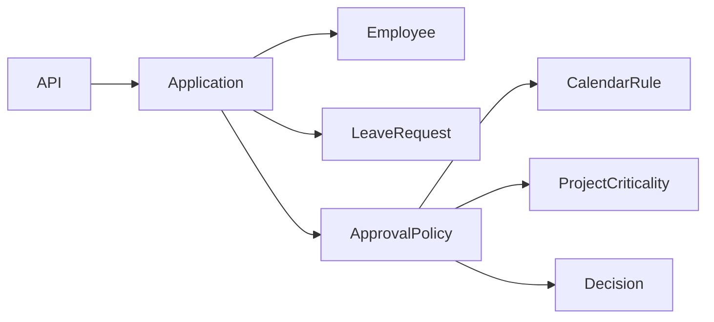
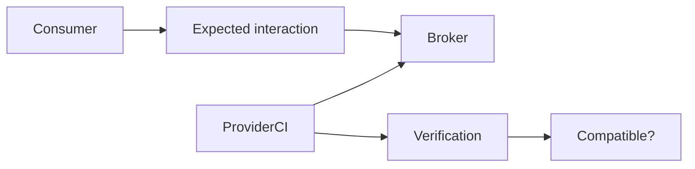
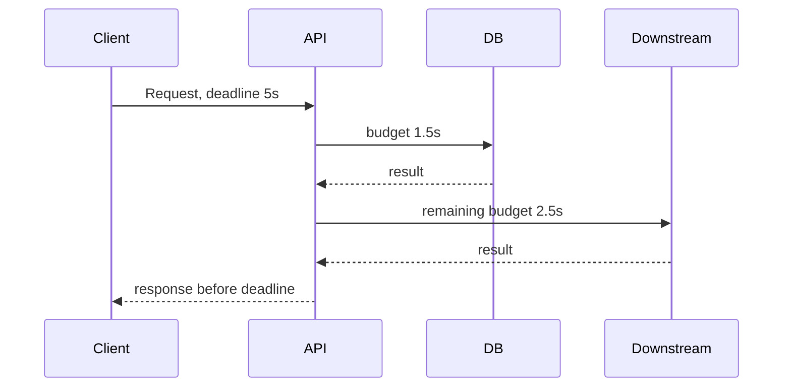
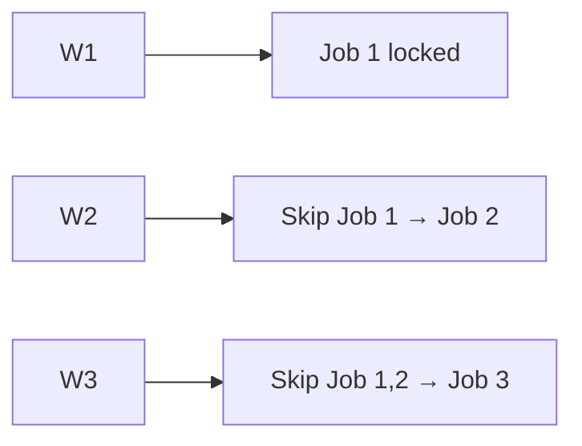
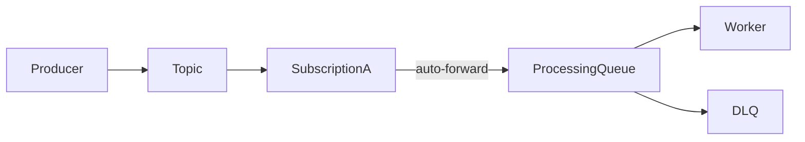
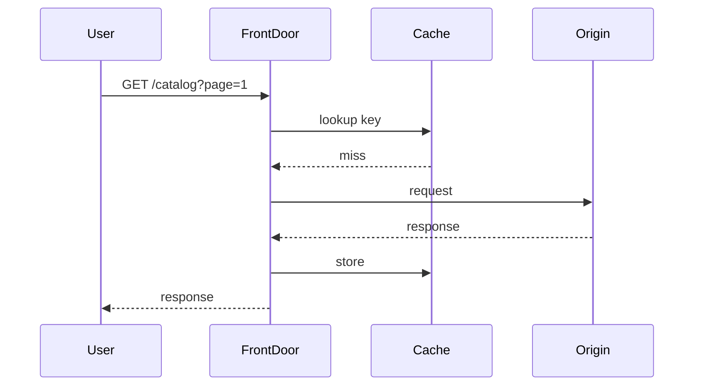
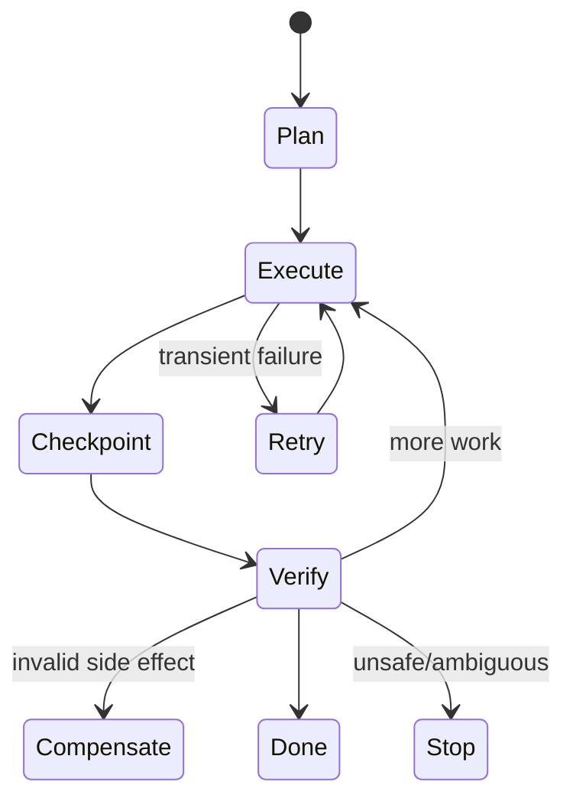

# Daily Knowledge Sharing — 17/08/2026

## Today’s Topics

1. DDD Policy Object — tách business decision thay đổi thường xuyên khỏi Entity và Application Service
2. Microservices Consumer-Driven Contracts — để consumer xác định compatibility thay vì chỉ tin OpenAPI compile được
3. ASP.NET Core Request Timeout Budget — phân bổ deadline xuyên suốt API → DB → downstream thay vì timeout rời rạc
4. SQL Server Index Intersection — khi optimizer ghép nhiều index và vì sao một covering index đôi khi vẫn tốt hơn
5. PostgreSQL `SKIP LOCKED` — xây worker queue bằng database mà không để nhiều worker giẫm lên cùng một row
6. Azure Service Bus Auto-Forwarding — nối queue/topic thành pipeline nhưng phải hiểu failure boundary và DLQ
7. Azure Front Door Caching Rules — cache ở edge theo path/query/header mà không làm rò dữ liệu theo user
8. OpenTelemetry Metric Cardinality Budget — kiểm soát label explosion trước khi telemetry phá cost và backend
9. AI Agent Failure Recovery — checkpoint, replay, compensating action và stop condition cho workflow dài
10. Change Failure Rate + MTTR — dùng dữ liệu incident để cải thiện release system thay vì chỉ đếm deployment

---

# 1. DDD Policy Object — tách business decision thay đổi thường xuyên khỏi Entity và Application Service

### 1. What is it?

**Policy Object** là một object biểu diễn một business decision hoặc rule có nhiều điều kiện, nhiều nguồn dữ liệu, hoặc thay đổi theo policy. Nó không phải là “service chung chung”, mà là một abstraction có tên theo ngôn ngữ nghiệp vụ như `LeaveApprovalPolicy`, `PricingPolicy`, `OffboardingPolicy`.

Nếu Entity chứa mọi rule, Entity dễ phình to. Nếu Application Service chứa rule, business logic bị kéo ra khỏi domain. Policy Object giúp giữ business intent rõ ràng nhưng vẫn cho phép phối hợp nhiều dữ liệu.

### 2. Why does it exist?

Một rule ban đầu thường rất đơn giản:

```text
Leave <= 2 ngày → manager duyệt
```

Sau vài tháng nó thành:

```text
Nếu nhân viên probation → HR duyệt
Nếu > 3 ngày → manager + HR
Nếu thuộc project critical → project lead phải approve
Nếu trùng blackout period → reject
```

Nhồi hết logic này vào controller, handler hoặc Entity sẽ khiến code khó test, khó thay đổi và rất dễ tạo duplicated rule.

### 3. How does it work?



Application layer load dữ liệu cần thiết, sau đó đưa business facts vào Policy. Policy trả về decision có ý nghĩa domain, ví dụ `RequiresHrApproval`, `Rejected`, `ManagerOnly`.

### 4. Practical example

```csharp
public sealed class LeaveApprovalPolicy
{
    public ApprovalDecision Evaluate(
        Employee employee,
        LeaveRequest request,
        bool isProjectCritical,
        bool isBlackoutPeriod)
    {
        if (isBlackoutPeriod)
            return ApprovalDecision.Rejected("Blackout period");

        if (employee.IsProbation)
            return ApprovalDecision.RequiresHr();

        if (request.TotalDays > 3 || isProjectCritical)
            return ApprovalDecision.RequiresManagerAndHr();

        return ApprovalDecision.ManagerOnly();
    }
}
```

### 5. Real production scenario

Trong hệ thống timesheet/leave, cùng một quy trình approval có thể thay đổi theo department, project và employment type. Policy Object giúp thay đổi rule mà không phá orchestration của use case.

### 6. Common mistakes

- Tạo `Policy` nhưng bên trong chỉ proxy tới một service khác, không có domain meaning.
- Cho Policy tự query database, khiến domain logic phụ thuộc infrastructure.
- Trả `bool` cho mọi quyết định; khi rule phức tạp nên trả decision object có reason.
- Dùng Strategy/Policy cho rule rất đơn giản và không có khả năng thay đổi, dẫn tới overengineering.

### 7. Trade-offs

**Advantages**

- Business rule dễ đọc và test.
- Giảm logic trong Entity/Application Service.
- Dễ thay đổi rule theo policy.

**Costs / Risks**

- Thêm abstraction và object.
- Nếu boundary không rõ, Policy có thể trở thành “dumping ground”.
- Phải quyết định dữ liệu nào được chuẩn bị ở Application layer.

### 8. Junior → Middle → Senior understanding

**Junior**: hiểu Policy gom một nhóm business rule có ý nghĩa.

**Middle**: biết tách input facts khỏi infrastructure và viết unit test theo business scenario.

**Senior / Technical Lead**: quyết định khi nào rule thuộc Entity, Value Object, Domain Service hay Policy; tránh tạo abstraction dư thừa.

### 9. Key takeaway

- Policy nên mang tên business, không phải tên kỹ thuật chung chung.
- Application layer chuẩn bị dữ liệu; Policy quyết định business outcome.
- Khi rule thay đổi thường xuyên, explicit policy thường tốt hơn `if/else` rải khắp codebase.

---

# 2. Microservices Consumer-Driven Contracts — để consumer xác định compatibility thay vì chỉ tin OpenAPI compile được

### 1. What is it?

Consumer-Driven Contract Testing là cách consumer mô tả những request/response mà nó thực sự phụ thuộc vào. Provider sau đó phải chạy contract này trong CI để chứng minh thay đổi mới vẫn tương thích.

Khác với integration test end-to-end, contract test tập trung vào **boundary giữa hai service**.

### 2. Why does it exist?

OpenAPI có thể hợp lệ nhưng vẫn phá consumer.

Ví dụ provider đổi:

```json
{ "status": "Approved" }
```

thành:

```json
{ "state": "Approved" }
```

API vẫn trả `200`, schema provider có thể đúng, nhưng consumer cũ sẽ fail ngay production.

### 3. How does it work?



Consumer publish contract. Provider CI lấy contract và verify against implementation hiện tại.

### 4. Practical example

Một consumer có thể yêu cầu:

```json
GET /employees/123

200 OK
{
  "id": 123,
  "status": "Active"
}
```

Provider có thể thêm field mới mà không vấn đề, nhưng không được rename/remove field consumer đang dùng nếu chưa version/migrate.

### 5. Real production scenario

Một hệ thống employee service được dùng bởi payroll, timesheet và notification service. Mỗi consumer có dependency khác nhau. Consumer-driven contract cho biết thay đổi nào thực sự breaking với consumer nào.

### 6. Common mistakes

- Biến contract test thành full E2E test.
- Mock provider quá mức và publish contract không phản ánh traffic thực.
- Chỉ test status code, bỏ qua shape/semantics.
- Cho consumer đòi exact toàn bộ response khiến provider mất khả năng mở rộng.

### 7. Trade-offs

**Advantages**

- Bắt breaking change trước production.
- Cho phép deploy service độc lập an toàn hơn.
- Contract phản ánh dependency thực.

**Costs / Risks**

- Thêm CI workflow và contract lifecycle.
- Nếu có quá nhiều consumer, governance phức tạp.
- Không thay thế integration/E2E hoàn toàn.

### 8. Junior → Middle → Senior understanding

**Junior**: hiểu API compile được chưa đồng nghĩa compatible.

**Middle**: biết viết contract tập trung vào field/behavior thực sự dùng.

**Senior / Technical Lead**: thiết kế versioning, deprecation và contract ownership cho nhiều team/service.

### 9. Key takeaway

- Compatibility là góc nhìn của consumer.
- Contract test bảo vệ integration boundary, không thay thế mọi loại test.
- Provider phải verify contract trước release.

---

# 3. ASP.NET Core Request Timeout Budget — phân bổ deadline xuyên suốt API → DB → downstream thay vì timeout rời rạc

### 1. What is it?

Timeout budget là tổng thời gian request được phép sống, sau đó budget này được chia xuống từng downstream call. Thay vì mỗi dependency tự timeout 30 giây, toàn request có thể chỉ được phép 5 giây.

### 2. Why does it exist?

Naive setup:

```text
Client timeout 5s
API → DB timeout 30s
API → Graph API timeout 100s
```

Client đã bỏ cuộc sau 5 giây nhưng backend vẫn tiếp tục dùng thread, connection và quota trong hàng chục giây.

### 3. How does it work?



ASP.NET Core truyền `RequestAborted` qua các async call. Downstream timeout phải nhỏ hơn remaining request deadline.

### 4. Practical example

```csharp
app.MapGet("/profile/{id}", async (
    int id,
    EmployeeDbContext db,
    IHttpClientFactory clients,
    CancellationToken ct) =>
{
    var employee = await db.Employees
        .AsNoTracking()
        .SingleAsync(x => x.Id == id, ct);

    using var timeout = CancellationTokenSource.CreateLinkedTokenSource(ct);
    timeout.CancelAfter(TimeSpan.FromSeconds(2));

    var client = clients.CreateClient("graph");
    var photo = await client.GetByteArrayAsync($"users/{employee.GraphId}/photo", timeout.Token);

    return Results.Ok(new { employee.Id, photo });
});
```

### 5. Real production scenario

API employee profile gọi DB, Microsoft Graph và blob storage. Nếu một downstream chậm, request budget ngăn toàn request giữ tài nguyên quá lâu và lan saturation sang service khác.

### 6. Common mistakes

- Chỉ timeout `HttpClient`, không propagate cancellation xuống EF Core.
- Retry nhiều lần trong một budget quá ngắn.
- Timeout tất cả dependency cùng một giá trị.
- Log `TaskCanceledException` như lỗi system nghiêm trọng dù client đã disconnect.

### 7. Trade-offs

**Advantages**

- Giảm resource leak khi request đã vô nghĩa.
- Hạn chế cascading latency.
- Dễ kiểm soát SLO latency.

**Costs / Risks**

- Timeout quá thấp tạo false failure.
- Cần đo p95/p99 của từng dependency.
- Retry + timeout cần thiết kế chung.

### 8. Junior → Middle → Senior understanding

**Junior**: hiểu cancellation không chỉ để user bấm Cancel.

**Middle**: propagate `CancellationToken` đúng qua EF Core, HTTP và background work.

**Senior / Technical Lead**: phân bổ timeout theo SLO, dependency latency và retry budget.

### 9. Key takeaway

- Timeout phải thuộc request budget chung.
- Cancellation cần truyền xuyên suốt call chain.
- Retry không được vượt deadline tổng.

---

# 4. SQL Server Index Intersection — khi optimizer ghép nhiều index và vì sao một covering index đôi khi vẫn tốt hơn

### 1. What is it?

Index Intersection xảy ra khi SQL Server dùng nhiều nonclustered index rồi kết hợp kết quả để đáp ứng một query.

Ví dụ có index trên `Status` và index khác trên `EmployeeId`; optimizer có thể seek cả hai rồi intersect row identifiers.

### 2. Why does it exist?

Không phải query nào cũng có composite index hoàn hảo. Intersection cho optimizer lựa chọn tận dụng index sẵn có thay vì scan table.

Nhưng nếu query chạy cực thường xuyên, hai index riêng có thể vẫn kém một covering composite index.

### 3. How does it work?

```text
IX_Status      → rows Status='Pending' -----┐
                                              ├→ intersect → lookup/result
IX_EmployeeId → rows EmployeeId=42 ---------┘
```

Optimizer ước lượng selectivity và cost để quyết định scan, intersection hay single-index seek.

### 4. Practical example

Query:

```sql
SELECT Id, SubmittedAt
FROM Timesheets
WHERE EmployeeId = @employeeId
  AND Status = 'Pending';
```

Hai index rời:

```sql
CREATE INDEX IX_Timesheets_EmployeeId ON Timesheets(EmployeeId);
CREATE INDEX IX_Timesheets_Status ON Timesheets(Status);
```

Nếu query là hot path, composite index có thể hiệu quả hơn:

```sql
CREATE INDEX IX_Timesheets_EmployeeId_Status
ON Timesheets(EmployeeId, Status)
INCLUDE (SubmittedAt);
```

### 5. Real production scenario

Trang manager approval load pending timesheet của một employee/team rất thường xuyên. Intersection có thể “đủ tốt” lúc dữ liệu nhỏ nhưng trở thành CPU/IO overhead khi bảng tăng hàng chục triệu row.

### 6. Common mistakes

- Thấy intersection rồi kết luận luôn là xấu.
- Tạo composite index cho mọi query, gây write amplification.
- Không xem actual execution plan và logical reads.
- Bỏ qua statistics/selectivity.

### 7. Trade-offs

**Advantages**

- Tận dụng index hiện có.
- Giảm số composite index cần tạo.

**Costs / Risks**

- Có thêm operator/hash/merge cost.
- Có thể vẫn cần key lookup.
- Nhiều index tăng storage và write cost.

### 8. Junior → Middle → Senior understanding

**Junior**: hiểu SQL Server có thể dùng hơn một index cho một query.

**Middle**: đọc execution plan và so logical reads giữa intersection/composite index.

**Senior / Technical Lead**: cân bằng workload read/write, index budget và hot-query frequency.

### 9. Key takeaway

- Intersection không tự động là anti-pattern.
- Hot path thường cần đo xem composite covering index có lợi hơn không.
- Tối ưu index phải dựa trên workload, không dựa vào một query cô lập.

---

# 5. PostgreSQL `SKIP LOCKED` — xây worker queue bằng database mà không để nhiều worker giẫm lên cùng một row

### 1. What is it?

`FOR UPDATE SKIP LOCKED` cho phép một transaction bỏ qua row đang bị transaction khác lock thay vì chờ.

Nó rất hữu ích khi nhiều worker cùng claim job từ một bảng queue.

### 2. Why does it exist?

Nếu 20 worker chạy:

```sql
SELECT * FROM jobs
WHERE status = 'Pending'
ORDER BY created_at
LIMIT 1
FOR UPDATE;
```

worker đầu lock row, 19 worker còn lại có thể xếp hàng chờ chính row đó. Throughput giảm nghiêm trọng.

### 3. How does it work?



Mỗi worker claim một row khác nhau trong cùng batch.

### 4. Practical example

```sql
BEGIN;

WITH next_job AS (
    SELECT id
    FROM background_jobs
    WHERE status = 'Pending'
    ORDER BY created_at
    FOR UPDATE SKIP LOCKED
    LIMIT 1
)
UPDATE background_jobs j
SET status = 'Processing',
    started_at = now()
FROM next_job
WHERE j.id = next_job.id
RETURNING j.*;

COMMIT;
```

### 5. Real production scenario

Một hệ thống file-processing nhỏ chưa cần RabbitMQ/Service Bus có thể dùng PostgreSQL queue với 5–10 worker. `SKIP LOCKED` giúp worker claim job song song.

### 6. Common mistakes

- Không có retry/recovery cho job bị worker crash sau khi claim.
- Giữ transaction mở trong suốt quá trình xử lý dài.
- Không có index trên `(status, created_at)`.
- Dùng database queue ở scale rất lớn mà không đo contention/IO.

### 7. Trade-offs

**Advantages**

- Đơn giản, không cần message broker riêng.
- Atomic claim job.
- Phù hợp workload nhỏ/trung bình.

**Costs / Risks**

- Database trở thành queue + business DB cùng lúc.
- Cần recovery cho stuck job.
- Không có sẵn nhiều feature như DLQ, visibility timeout, partitioning.

### 8. Junior → Middle → Senior understanding

**Junior**: hiểu lock có thể làm worker chờ nhau.

**Middle**: implement atomic claim + recovery + index đúng.

**Senior / Technical Lead**: biết điểm mà database queue nên được thay bằng broker chuyên dụng.

### 9. Key takeaway

- `SKIP LOCKED` phù hợp cho competing workers.
- Claim transaction nên ngắn.
- Phải có stuck-job recovery và idempotent processing.

---

# 6. Azure Service Bus Auto-Forwarding — nối queue/topic thành pipeline nhưng phải hiểu failure boundary và DLQ

### 1. What is it?

Auto-forwarding cho phép một queue/subscription tự chuyển message sang queue/topic khác mà không cần application consumer trung gian.

### 2. Why does it exist?

Đôi khi architecture cần fan-in hoặc chain routing đơn giản. Nếu viết một worker chỉ để receive rồi send lại message, ta thêm code, compute và failure point không cần thiết.

### 3. How does it work?



Azure Service Bus chịu trách nhiệm chuyển message trong broker namespace.

### 4. Practical example

Một topic `employee-events` có subscription `offboarding-events` filter `eventType='EmployeeDeactivated'`. Subscription auto-forward sang queue `offboarding-processing` để một worker chuyên dụng xử lý.

### 5. Real production scenario

HR system phát nhiều loại event. Các downstream team muốn route message theo domain nhưng không muốn deploy một router service riêng. Auto-forwarding giảm component.

### 6. Common mistakes

- Tạo chain auto-forward quá dài, khó debug message path.
- Không hiểu message TTL tiếp tục tính trên toàn chain.
- Bỏ qua DLQ ở destination.
- Dùng auto-forward thay thế business routing phức tạp cần code/observability.

### 7. Trade-offs

**Advantages**

- Ít code và compute hơn.
- Broker-native routing.
- Giảm latency do không qua app router.

**Costs / Risks**

- Topology khó hiểu nếu chain phức tạp.
- Debugging phụ thuộc broker metrics/logs.
- Không phù hợp transformation/business decision.

### 8. Junior → Middle → Senior understanding

**Junior**: hiểu message có thể được route trong broker mà không cần worker.

**Middle**: biết filter, DLQ, TTL và topology.

**Senior / Technical Lead**: quyết định lúc nào routing thuộc broker và lúc nào cần application boundary rõ ràng.

### 9. Key takeaway

- Auto-forward tốt cho routing đơn giản, deterministic.
- Không biến Service Bus topology thành business logic ẩn.
- Luôn thiết kế DLQ và observability cho destination.

---

# 7. Azure Front Door Caching Rules — cache ở edge theo path/query/header mà không làm rò dữ liệu theo user

### 1. What is it?

Azure Front Door có thể cache response tại edge POP gần user. Caching rules quyết định response nào được cache và cache key gồm path, query string hoặc các yếu tố khác.

### 2. Why does it exist?

Static hoặc semi-static content không cần đi tới origin mỗi request. Edge cache giảm latency và origin load.

Nhưng nếu cache key sai, response của user A có thể bị phục vụ cho user B.

### 3. How does it work?



Request tiếp theo cùng cache key có thể trả trực tiếp từ edge.

### 4. Practical example

Public API:

```http
GET /api/catalog?page=1&sort=name
```

Có thể cache vài phút.

Nhưng endpoint:

```http
GET /api/me/profile
Authorization: Bearer ...
```

thường không nên shared-cache nếu response theo user.

### 5. Real production scenario

SaaS portal có public product metadata và private employee data. Front Door cache public metadata nhưng bypass cache private API.

### 6. Common mistakes

- Ignore query string quan trọng trong cache key.
- Cache response có `Set-Cookie` hoặc dữ liệu theo user.
- TTL quá dài dẫn tới stale config/data.
- Không có purge/invalidation strategy.

### 7. Trade-offs

**Advantages**

- Giảm latency toàn cầu.
- Giảm request tới App Service/origin.
- Có thể giảm compute cost.

**Costs / Risks**

- Stale data.
- Cache poisoning/data leakage nếu rule sai.
- Debug khó hơn vì response có thể không tới origin.

### 8. Junior → Middle → Senior understanding

**Junior**: hiểu edge cache khác application cache.

**Middle**: cấu hình cache key, TTL và bypass đúng.

**Senior / Technical Lead**: thiết kế data classification, invalidation và security boundary cho CDN/edge caching.

### 9. Key takeaway

- Chỉ cache dữ liệu thực sự shareable.
- Cache key phải phản ánh mọi input ảnh hưởng response.
- Security luôn quan trọng hơn hit ratio.

---

# 8. OpenTelemetry Metric Cardinality Budget — kiểm soát label explosion trước khi telemetry phá cost và backend

### 1. What is it?

Metric cardinality là số lượng unique time series được tạo bởi combinations của labels/attributes.

Ví dụ:

```text
http.server.duration{route=/employees/{id},method=GET,status=200}
```

có cardinality thấp.

Nếu dùng `employeeId` làm label, số series có thể lên hàng triệu.

### 2. Why does it exist?

Metrics backend tối ưu cho số lượng series hữu hạn. High-cardinality labels làm tăng memory, storage, ingestion cost và query latency.

### 3. How does it work?

```text
route: 20 values
method: 5 values
status: 10 values
region: 4 values

Potential series = 20 × 5 × 10 × 4 = 4,000
```

Thêm `userId=100,000 values` có thể đẩy cardinality lên hàng trăm triệu.

### 4. Practical example

Không nên:

```csharp
counter.Add(1,
    new("user.id", userId),
    new("request.path", context.Request.Path));
```

Nên dùng bounded dimensions:

```csharp
counter.Add(1,
    new("http.route", "/employees/{id}"),
    new("http.method", "GET"),
    new("result", "success"));
```

User-specific detail nên để trong logs/traces.

### 5. Real production scenario

Một service thêm `tenantId` vào mọi metric. Khi số tenant tăng từ 100 lên 50,000, Azure Monitor/Prometheus backend tăng ingestion và query cost đột biến.

### 6. Common mistakes

- Dùng raw URL thay vì route template.
- Dùng GUID, email, userId, traceId làm metric label.
- Không có cardinality review trong code review.
- Nhầm metric với log.

### 7. Trade-offs

**Advantages**

- Metric bounded dễ aggregate và alert.
- Cost predictable.
- Query nhanh hơn.

**Costs / Risks**

- Ít dimension chi tiết hơn.
- Cần chuyển forensic detail sang logs/traces.

### 8. Junior → Middle → Senior understanding

**Junior**: hiểu label không phải chỗ nhét mọi metadata.

**Middle**: biết phân biệt metric dimension bounded/unbounded.

**Senior / Technical Lead**: đặt telemetry schema, cardinality budget và governance toàn hệ thống.

### 9. Key takeaway

- Metric labels phải có bounded value set.
- High-cardinality detail thuộc logs/traces.
- Telemetry design là một phần của production architecture.

---

# 9. AI Agent Failure Recovery — checkpoint, replay, compensating action và stop condition cho workflow dài

### 1. What is it?

AI Agent Failure Recovery là thiết kế để một agent workflow có thể tiếp tục hoặc phục hồi sau lỗi mà không phải chạy lại từ đầu và không lặp side effect nguy hiểm.

Một agent dài thường có flow:

```text
Plan → Tool Call → Verify → More Tool Calls → Finalize
```

Failure có thể xảy ra ở bất kỳ bước nào.

### 2. Why does it exist?

Nếu agent chạy 20 bước và fail ở bước 18, chạy lại toàn bộ có thể:

- gửi email hai lần,
- tạo duplicate ticket,
- cập nhật DB lặp,
- tốn token và thời gian,
- mất state đã xác minh.

### 3. How does it work?



Deterministic orchestrator lưu checkpoint. Tool side effects phải có idempotency key hoặc operation ID. Agent có stop condition rõ ràng.

### 4. Practical example

```csharp
public sealed record AgentStepState(
    string WorkflowId,
    int Step,
    string Status,
    string? ToolOperationId,
    JsonDocument Data);
```

Trước side effect:

```text
1. persist intent
2. call tool with operationId
3. persist result
4. verify
5. continue
```

### 5. Real production scenario

AI agent xử lý offboarding: đọc employee, đề xuất actions, tạo approval request, sau khi human approve mới revoke access và cấu hình mailbox. Nếu Graph API fail sau một số action, workflow resume từ checkpoint thay vì chạy lại mọi action.

### 6. Common mistakes

- Chỉ lưu conversation text, không lưu structured state.
- Retry side-effect tool mù quáng.
- Không phân biệt transient, permanent và ambiguous failure.
- Để model tự quyết định retry vô hạn.
- Không có human approval khi impact lớn.

### 7. Trade-offs

**Advantages**

- Agent bền hơn cho workflow dài.
- Giảm duplicate side effect.
- Dễ audit và debug.

**Costs / Risks**

- Orchestrator phức tạp hơn.
- Cần state store và idempotency design.
- Compensation không phải lúc nào cũng khả thi.

### 8. Junior → Middle → Senior understanding

**Junior**: hiểu agent không chỉ là loop gọi LLM liên tục.

**Middle**: implement checkpoint, retry classification và idempotent tool calls.

**Senior / Technical Lead**: thiết kế failure model, approval boundary, compensation và stop conditions theo risk.

### 9. Key takeaway

- Workflow dài phải có structured checkpoint.
- Side effect phải idempotent hoặc có compensation.
- Retry/stop/approval nên do deterministic control quyết định, không giao toàn bộ cho model.

---

# 10. Change Failure Rate + MTTR — dùng dữ liệu incident để cải thiện release system thay vì chỉ đếm deployment

### 1. What is it?

**Change Failure Rate (CFR)** đo tỷ lệ deployment/change gây incident, rollback hoặc hotfix.

**MTTR** trong context delivery thường dùng để hiểu tốc độ phục hồi sau failure.

Hai metric này phản ánh **chất lượng của release system**, không chỉ tốc độ ship code.

### 2. Why does it exist?

Một team deploy 50 lần/tuần có vẻ nhanh, nhưng nếu 15 lần gây production issue thì delivery process chưa khỏe.

Ngược lại, team deploy rất hiếm để giảm incident cũng chưa chắc tốt vì batch change lớn hơn và rollback khó hơn.

### 3. How does it work?

```text
Deployments trong tháng: 100
Deployments gây incident/hotfix/rollback: 8

CFR = 8 / 100 = 8%
```

MTTR cần định nghĩa thống nhất, ví dụ từ lúc impact bắt đầu tới lúc service phục hồi SLO.

### 4. Practical example

CI/CD có thể lưu deployment marker vào telemetry:

```json
{
  "deploymentId": "2026.08.17.42",
  "service": "timesheet-api",
  "commit": "abc123",
  "startedAt": "2026-08-17T14:10:00Z"
}
```

Incident system link incident với deployment gần nhất để tính CFR và recovery time.

### 5. Real production scenario

Một team thấy CFR tăng sau khi áp dụng database migration tự động. Investigation cho thấy phần lớn rollback liên quan migration không backward-compatible. Action không phải “deploy ít lại”, mà là thêm expand-contract migration và pre-deploy verification.

### 6. Common mistakes

- Biến CFR thành KPI cá nhân/team để thưởng phạt.
- Định nghĩa “failure” không nhất quán.
- Chỉ đếm rollback, bỏ hotfix/manual remediation.
- Đo MTTR nhưng không phân tích bottleneck detect → diagnose → mitigate.

### 7. Trade-offs

**Advantages**

- Cho thấy chất lượng release pipeline.
- Giúp tìm systemic bottleneck.
- Tạo feedback loop từ production về engineering process.

**Costs / Risks**

- Metric dễ bị game nếu dùng sai mục đích.
- Cần incident/deployment data đáng tin cậy.
- Không tự nói ra root cause.

### 8. Junior → Middle → Senior understanding

**Junior**: hiểu deploy nhiều chưa đồng nghĩa delivery tốt.

**Middle**: biết link deployment, incident, rollback và telemetry.

**Senior / Technical Lead**: dùng CFR/MTTR để cải thiện architecture, testing, rollout và recovery, không dùng để blame con người.

### 9. Key takeaway

- Tốc độ delivery phải đi cùng stability.
- CFR và MTTR là feedback về hệ thống release, không phải điểm số cá nhân.
- Quan trọng nhất là biến metric thành engineering action cụ thể.