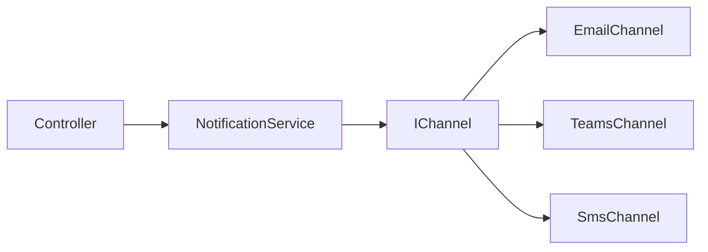
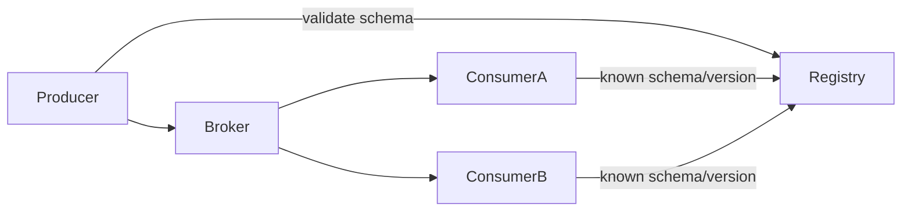
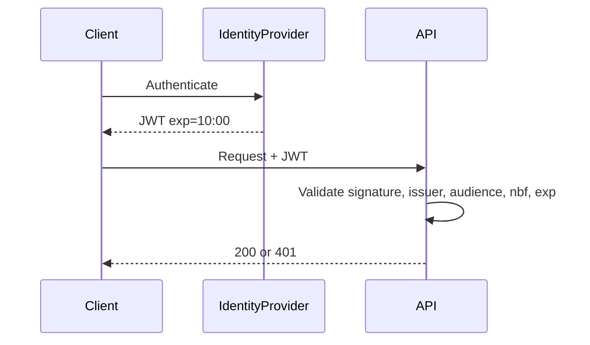
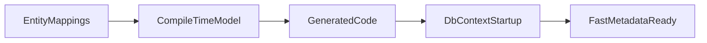
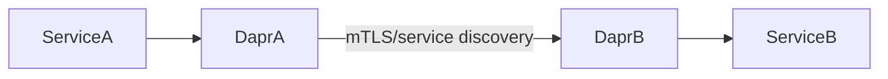
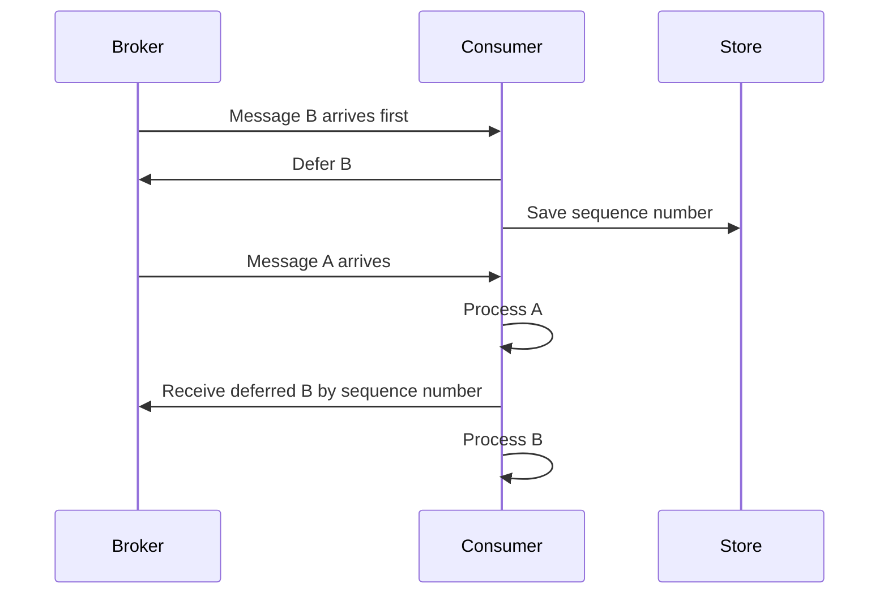
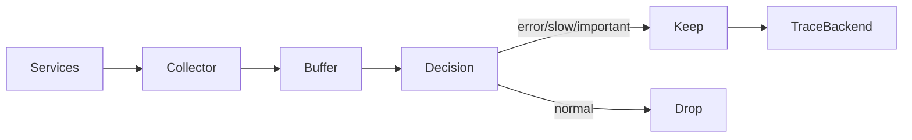
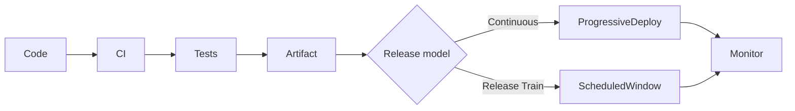

# Daily Knowledge Sharing — 17/08/2026

## Today’s Topics

1. SOLID Open/Closed Principle — mở rộng behavior mà không sửa liên tục core workflow
2. Event-Driven Architecture với Schema Registry — quản lý contract giữa producer và consumer theo version
3. JWT Clock Skew & Token Validation — xử lý lệch thời gian mà không vô tình mở rộng cửa sổ tấn công
4. PostgreSQL BRIN Index — tối ưu bảng cực lớn khi dữ liệu có tính tương quan theo thứ tự vật lý
5. EF Core Compiled Model — giảm startup cost cho model lớn nhưng không phải thuốc chữa query chậm
6. Azure Container Apps + Dapr Service Invocation — gọi service nội bộ với discovery, mTLS và retry boundary rõ ràng
7. Azure Service Bus Message Deferral — hoãn xử lý message có chủ đích mà không phá ordering logic
8. Response Compression Threshold — nén có chọn lọc thay vì nén mọi response và đốt CPU
9. Tail-Based Trace Sampling — giữ trace lỗi/chậm sau khi nhìn thấy kết quả thay vì sample từ đầu
10. Release Train vs Continuous Delivery — chọn nhịp phát hành phù hợp với risk, dependency và khả năng vận hành

---

# 1. SOLID Open/Closed Principle — mở rộng behavior mà không sửa liên tục core workflow

### 1. What is it?

Open/Closed Principle (OCP) nói rằng một module nên **mở cho việc mở rộng** nhưng **đóng với việc sửa đổi không cần thiết**. Ý thực tế không phải là “không bao giờ sửa code cũ”, mà là khi thêm một biến thể nghiệp vụ mới, ta không nên phải chạm vào hàng loạt `if/else` ở core workflow.

Ở level Junior, có thể hiểu đơn giản: khi thêm một loại payment mới, không nên sửa mọi nơi đang kiểm tra `PaymentType`.

Ở level Senior, OCP liên quan đến việc xác định **điểm thay đổi ổn định** và **điểm biến thiên**. Nếu abstraction đặt sai chỗ, ta chỉ chuyển `if/else` từ file này sang file khác chứ chưa thực sự giảm coupling.

### 2. Why does it exist?

Naive implementation thường bắt đầu như sau:

```csharp
if (type == "email") { ... }
else if (type == "teams") { ... }
else if (type == "sms") { ... }
```

Khi có thêm channel mới, ta sửa class cũ. Khi nhiều nơi cùng switch theo `type`, số điểm phải sửa tăng dần và regression risk lớn lên.

OCP tồn tại để cô lập phần thay đổi và giảm blast radius khi business mở rộng.

### 3. How does it work?

Ta đưa behavior biến thiên ra interface hoặc policy riêng, còn workflow chính chỉ phụ thuộc abstraction.



Core workflow không cần biết chi tiết SMTP, Graph API hay SMS gateway.

### 4. Practical example

```csharp
public interface INotificationChannel
{
    string Name { get; }
    Task SendAsync(Notification message, CancellationToken ct);
}

public sealed class EmailChannel : INotificationChannel
{
    public string Name => "email";

    public Task SendAsync(Notification message, CancellationToken ct)
    {
        // SMTP / Graph implementation
        return Task.CompletedTask;
    }
}

public sealed class NotificationService
{
    private readonly IReadOnlyDictionary<string, INotificationChannel> _channels;

    public NotificationService(IEnumerable<INotificationChannel> channels)
    {
        _channels = channels.ToDictionary(x => x.Name, StringComparer.OrdinalIgnoreCase);
    }

    public Task SendAsync(string channel, Notification message, CancellationToken ct)
    {
        if (!_channels.TryGetValue(channel, out var implementation))
            throw new InvalidOperationException($"Unsupported channel: {channel}");

        return implementation.SendAsync(message, ct);
    }
}
```

Thêm `PushChannel` thường chỉ cần implementation mới + DI registration.

### 5. Real production scenario

Hệ thống employee management gửi thông báo leave approval qua Email. Sau đó business muốn thêm Teams. Nếu core workflow đang hard-code Graph/SMTP, mỗi lần thêm channel phải sửa logic phê duyệt. Với OCP, leave workflow chỉ tạo `Notification`; channel-specific behavior nằm ngoài.

### 6. Common mistakes

- Tạo interface cho mọi class dù không có biến thiên thật.
- Dùng reflection/plugin quá sớm, làm hệ thống khó debug.
- Abstraction quá generic như `IHandler<T>` nhưng mất business intent.
- Vẫn giữ một giant switch trong factory trung tâm.
- Cho implementation tự thay đổi transaction hoặc business rule ngoài phạm vi của nó.

### 7. Trade-offs

**Advantages**

- Giảm regression khi thêm biến thể mới.
- Test từng behavior độc lập.
- Core workflow ổn định hơn.

**Costs / Risks**

- Tăng số abstraction/class.
- Debug flow gián tiếp hơn.
- Nếu domain chưa ổn định, abstraction sớm có thể sai và tốn chi phí refactor.

### 8. Junior → Middle → Senior understanding

**Junior**

Hiểu vì sao nhiều `if/else` theo type là dấu hiệu cần xem lại thiết kế.

**Middle**

Biết dùng Strategy/Policy/DI để đưa behavior thay đổi ra khỏi core flow và viết test cho từng implementation.

**Senior / Technical Lead**

Biết chọn đúng extension point, tránh abstraction ceremony, và đánh giá liệu thay đổi có đủ thường xuyên để đáng tạo plugin/policy boundary hay không.

### 9. Key takeaway

- OCP không phải “không sửa code cũ”.
- Mục tiêu là cô lập điểm biến thiên để giảm blast radius.
- Chỉ tạo extension point khi có lý do thay đổi thực tế.

---

# 2. Event-Driven Architecture với Schema Registry — quản lý contract giữa producer và consumer theo version

### 1. What is it?

Schema Registry là nơi lưu và kiểm tra schema của event/message như JSON Schema, Avro hoặc Protobuf. Trong hệ thống event-driven, producer và consumer thường deploy độc lập; vì vậy contract không thể chỉ nằm trong code của một service.

Registry giúp trả lời: event version nào tồn tại, thay đổi mới có backward-compatible không, consumer cũ có còn đọc được không.

### 2. Why does it exist?

Nếu producer đổi field tùy ý, consumer có thể fail sau deployment dù producer build xanh.

Ví dụ producer đổi:

```json
{"employeeId": 10, "status": "Inactive"}
```

thành:

```json
{"employee": {"id": 10}, "state": "Inactive"}
```

Đây không chỉ là refactor nội bộ; nó là breaking contract.

### 3. How does it work?



CI có thể reject schema mới nếu phá compatibility policy.

### 4. Practical example

Một event nên ưu tiên additive change:

```json
{
  "eventType": "EmployeeDeactivated",
  "schemaVersion": 2,
  "employeeId": 123,
  "occurredAt": "2026-08-17T14:00:00Z",
  "reasonCode": "RESIGNED"
}
```

Nếu `reasonCode` là field mới optional, consumer v1 có thể bỏ qua nó. Đây thường an toàn hơn rename hoặc đổi type field cũ.

### 5. Real production scenario

Employee service publish `EmployeeDeactivated`. Consumer khác nhau xử lý Exchange Online, HR reporting và payroll. Nếu producer đổi payload mà không có compatibility check, một consumer cũ có thể ngừng xử lý nhưng queue vẫn tiếp tục tăng.

### 6. Common mistakes

- Nghĩ rằng “JSON flexible” nên không cần schema.
- Rename hoặc reuse field với semantics khác.
- Xóa field ngay khi producer không còn dùng.
- Không version event type nhưng vẫn thay meaning.
- Registry tồn tại nhưng CI không enforce compatibility.

### 7. Trade-offs

**Advantages**

- Contract rõ ràng và audit được.
- Giảm deployment coupling.
- Detect breaking change trước production.

**Costs / Risks**

- Thêm governance và tooling.
- Schema evolution cần discipline.
- Có thể bị lạm dụng thành bureaucracy nếu event ít và hệ thống nhỏ.

### 8. Junior → Middle → Senior understanding

**Junior**

Hiểu event payload là public contract giữa services.

**Middle**

Biết additive vs breaking change, optional field, versioning và compatibility test.

**Senior / Technical Lead**

Thiết kế lifecycle schema, ownership, compatibility mode và migration strategy cho nhiều consumer release độc lập.

### 9. Key takeaway

- Event contract cần được quản trị như API contract.
- Additive evolution an toàn hơn rename/remove.
- Registry chỉ hữu ích khi compatibility được enforce trong delivery pipeline.

---

# 3. JWT Clock Skew & Token Validation — xử lý lệch thời gian mà không vô tình mở rộng cửa sổ tấn công

### 1. What is it?

JWT thường có các claim thời gian như `exp`, `nbf`, `iat`. Clock skew là khoảng dung sai cho chênh lệch đồng hồ giữa issuer và resource server.

Nếu token hết hạn lúc 10:00:00 nhưng server lệch vài giây, validation quá cứng có thể reject token hợp lệ. Ngược lại, skew quá lớn làm token đã hết hạn vẫn được chấp nhận lâu hơn dự kiến.

### 2. Why does it exist?

Distributed systems không có đồng hồ hoàn hảo tuyệt đối. NTP giảm sai lệch nhưng không đảm bảo mọi node giống nhau từng mili-giây.

Naive solution “cho thêm 10 phút cho chắc” làm tăng attack window và phá expectation của security policy.

### 3. How does it work?



Token validation phải kiểm tra đồng thời signature, issuer, audience và lifetime; clock skew chỉ là một phần nhỏ.

### 4. Practical example

```csharp
builder.Services
    .AddAuthentication("Bearer")
    .AddJwtBearer("Bearer", options =>
    {
        options.TokenValidationParameters = new()
        {
            ValidateIssuer = true,
            ValidateAudience = true,
            ValidateLifetime = true,
            ClockSkew = TimeSpan.FromSeconds(30)
        };
    });
```

Con số thực tế phải dựa trên identity provider, infrastructure clock sync và security requirement.

### 5. Real production scenario

Một SaaS API chạy 20 replicas. Một node lệch thời gian 40 giây khiến user thỉnh thoảng nhận `401` ngay trước thời điểm token refresh. Điều tra chỉ ở application log dễ nhầm thành “authentication random failure”. Cần kiểm tra NTP/host clock và validation config.

### 6. Common mistakes

- Chỉ validate signature nhưng bỏ `aud` hoặc `iss`.
- Set clock skew vài phút mà không có lý do.
- Tự parse JWT rồi tin claim thay vì dùng middleware validation chuẩn.
- Dùng local server time sai timezone/clock sync.
- Nhầm access token lifetime với session lifetime.

### 7. Trade-offs

**Advantages của skew nhỏ hợp lý**

- Giảm false rejection do clock drift.
- Hệ thống resilient hơn với sai lệch nhỏ.

**Costs / Risks**

- Token hết hạn vẫn được chấp nhận thêm trong khoảng skew.
- Skew lớn che giấu vấn đề clock synchronization.

### 8. Junior → Middle → Senior understanding

**Junior**

Biết `exp` là thời gian hết hạn và API phải validate JWT đầy đủ.

**Middle**

Biết cấu hình middleware, debug `401`, kiểm tra issuer/audience/lifetime và clock drift.

**Senior / Technical Lead**

Đánh giá token lifetime, refresh strategy, skew, revocation limitation và threat model toàn hệ thống.

### 9. Key takeaway

- Clock skew là tolerance, không phải workaround vô hạn.
- JWT validation phải gồm signature + issuer + audience + lifetime.
- Nếu cần skew lớn, hãy điều tra clock sync trước.

---

# 4. PostgreSQL BRIN Index — tối ưu bảng cực lớn khi dữ liệu có tính tương quan theo thứ tự vật lý

### 1. What is it?

BRIN (Block Range INdex) là index rất nhỏ ghi summary theo nhóm block thay vì entry cho từng row như B-tree.

Nó hiệu quả khi giá trị cột có tương quan với thứ tự vật lý của dữ liệu, ví dụ timestamp tăng dần trong bảng log hàng trăm triệu row.

### 2. Why does it exist?

B-tree trên bảng cực lớn có thể chiếm nhiều disk, RAM cache và maintenance cost. Trong khi query log thường hỏi theo time range và dữ liệu được append theo thời gian.

BRIN chấp nhận precision thấp hơn để giảm index size rất mạnh.

### 3. How does it work?

BRIN lưu min/max cho từng block range.

```text
Block 1-128    created_at: 08:00 → 08:05
Block 129-256  created_at: 08:05 → 08:10
Block 257-384  created_at: 08:10 → 08:15
```

Query 08:06–08:07 có thể bỏ qua phần lớn range không liên quan.

### 4. Practical example

```sql
CREATE INDEX ix_auditlog_createdat_brin
ON audit_log
USING BRIN (created_at);

SELECT id, employee_id, action
FROM audit_log
WHERE created_at >= now() - interval '1 day';
```

Dùng `EXPLAIN (ANALYZE, BUFFERS)` để xác nhận số block đọc thực tế.

### 5. Real production scenario

Audit table chứa 800 triệu records, append theo `created_at`. B-tree timestamp index có kích thước rất lớn nhưng retention query luôn theo time window. BRIN có thể giảm storage/index maintenance đáng kể trong workload phù hợp.

### 6. Common mistakes

- Dùng BRIN cho cột random như GUID hoặc giá trị phân bố không theo physical order.
- Nghĩ BRIN thay thế B-tree cho point lookup.
- Không kiểm tra correlation.
- Không vacuum/analyze đúng mức.
- Dùng query quá rộng rồi kỳ vọng latency cực thấp.

### 7. Trade-offs

**Advantages**

- Index rất nhỏ.
- Build/maintenance rẻ hơn B-tree.
- Hợp append-only/time-series lớn.

**Costs / Risks**

- Precision thấp hơn.
- Có thể đọc nhiều heap block hơn.
- Không phù hợp equality lookup ngẫu nhiên.

### 8. Junior → Middle → Senior understanding

**Junior**

Biết không phải index nào cũng là B-tree.

**Middle**

Biết kiểm tra query plan, data correlation và benchmark BRIN vs B-tree.

**Senior / Technical Lead**

Quyết định index strategy dựa trên data size, physical locality, write amplification, retention và workload thực tế.

### 9. Key takeaway

- BRIN mạnh khi dữ liệu rất lớn và có natural ordering.
- Index nhỏ đổi lấy filtering thô hơn.
- Luôn đo bằng `EXPLAIN ANALYZE`, không chọn theo cảm tính.

---

# 5. EF Core Compiled Model — giảm startup cost cho model lớn nhưng không phải thuốc chữa query chậm

### 1. What is it?

EF Core cần xây metadata model từ entity mapping, relationships, converters và conventions. Với model rất lớn, bước này có thể làm startup hoặc cold start chậm.

Compiled Model tạo sẵn model code ở build time để giảm runtime model-building cost.

### 2. Why does it exist?

Với vài chục entity, startup overhead thường nhỏ. Nhưng hệ thống có hàng trăm entity, nhiều owned type và custom conventions có thể thấy thời gian khởi động đáng kể, đặc biệt trong serverless hoặc scale-out thường xuyên.

### 3. How does it work?

Build pipeline generate model code, application cấu hình `DbContext` dùng compiled model thay vì build metadata từ đầu.



### 4. Practical example

CLI có thể generate model:

```bash
dotnet ef dbcontext optimize
```

Sau đó cấu hình generated model theo code mà EF tạo cho project.

Quan trọng: compiled model không làm `SELECT` thiếu index trở nên nhanh hơn.

### 5. Real production scenario

Một API admin có hơn 400 entity và cold start 2–3 giây trong deployment slot warmup. Profiling cho thấy đáng kể thời gian nằm ở EF model initialization. Compiled model có thể giúp startup, trong khi query latency vẫn phải xử lý bằng index/projection/query plan riêng.

### 6. Common mistakes

- Dùng compiled model trước khi đo startup bottleneck.
- Kỳ vọng nó sửa N+1 hoặc SQL chậm.
- Quên regenerate sau mapping change.
- Làm pipeline phức tạp cho model nhỏ.

### 7. Trade-offs

**Advantages**

- Giảm model initialization cost.
- Hữu ích cho model rất lớn/cold start sensitive.

**Costs / Risks**

- Thêm generated code và build step.
- Mapping change cần regenerate.
- Tăng complexity mà có thể không đáng nếu startup vốn đã nhanh.

### 8. Junior → Middle → Senior understanding

**Junior**

Phân biệt startup performance với query execution performance.

**Middle**

Biết profiling startup và áp dụng compiled model khi có bằng chứng.

**Senior / Technical Lead**

Đánh giá ROI của build-time optimization trong App Service, Functions, Container Apps và deployment architecture thực tế.

### 9. Key takeaway

- Compiled Model tối ưu metadata initialization, không tối ưu SQL.
- Chỉ dùng khi startup profiling cho thấy nó đáng kể.
- Optimization đúng phải bắt đầu từ measurement.

---

# 6. Azure Container Apps + Dapr Service Invocation — gọi service nội bộ với discovery, mTLS và retry boundary rõ ràng

### 1. What is it?

Dapr Service Invocation cho phép một service gọi service khác qua Dapr sidecar bằng app ID thay vì tự quản lý endpoint discovery trực tiếp.

Trong Azure Container Apps, Dapr có thể cung cấp service discovery, mTLS giữa sidecars và một số resiliency capability.

### 2. Why does it exist?

Trong distributed system, service A phải biết endpoint service B, xử lý DNS, retry, telemetry, encryption và versioning. Nếu mỗi team tự viết một kiểu, operational behavior không đồng nhất.

### 3. How does it work?



Application gọi local sidecar; Dapr resolve app ID và route tới target revision/replica.

### 4. Practical example

Service A có thể gọi endpoint thông qua Dapr sidecar:

```http
POST http://localhost:3500/v1.0/invoke/employee-api/method/api/employees/123/deactivate
Content-Type: application/json
```

Trong .NET, vẫn nên áp dụng `CancellationToken`, timeout budget và idempotency cho command quan trọng.

### 5. Real production scenario

Offboarding worker gọi employee API, notification API và audit API. Dapr giảm một phần plumbing discovery/mTLS, nhưng application vẫn phải xác định request nào được retry và side effect nào cần idempotency.

### 6. Common mistakes

- Nghĩ Dapr tự giải quyết mọi vấn đề distributed systems.
- Retry command không idempotent.
- Không đặt timeout ở application boundary.
- Bật Dapr cho mọi service dù không cần.
- Không monitor sidecar resource/latency.

### 7. Trade-offs

**Advantages**

- Standardized service invocation.
- Giảm discovery/mTLS plumbing trong app code.
- Có thể cải thiện consistency giữa teams.

**Costs / Risks**

- Thêm sidecar, CPU/memory và operational layer.
- Debug thêm một hop.
- Vendor/runtime abstraction có learning curve.

### 8. Junior → Middle → Senior understanding

**Junior**

Hiểu request đi qua sidecar chứ không “teleport” giữa services.

**Middle**

Biết cấu hình app ID, timeout, retry, telemetry và debug sidecar.

**Senior / Technical Lead**

Đánh giá Dapr có thực sự giảm platform complexity, xác định reliability boundary và tránh duplicate resiliency giữa app + sidecar + gateway.

### 9. Key takeaway

- Dapr giảm plumbing, không loại bỏ distributed-systems failure.
- Idempotency và timeout vẫn thuộc trách nhiệm application design.
- Chỉ dùng abstraction khi operational benefit lớn hơn complexity thêm vào.

---

# 7. Azure Service Bus Message Deferral — hoãn xử lý message có chủ đích mà không phá ordering logic

### 1. What is it?

Message Deferral cho phép receiver đánh dấu một message là deferred thay vì complete hoặc abandon. Message không được redeliver theo flow bình thường; application phải giữ sequence number để lấy lại sau.

Nó phù hợp khi message hợp lệ nhưng **chưa thể xử lý vì dependency nghiệp vụ chưa xảy ra**.

### 2. Why does it exist?

Giả sử nhận `InvoiceApproved` trước `InvoiceCreated` do event arrival khác thứ tự. Nếu abandon liên tục, message sẽ retry vô ích và có thể vào DLQ. Nếu complete, mất event. Deferral cho phép giữ message lại có chủ đích.

### 3. How does it work?



### 4. Practical example

Pseudo-focused C#:

```csharp
await receiver.DeferMessageAsync(message, cancellationToken: ct);
await stateStore.SaveDeferredSequenceAsync(
    businessKey,
    message.SequenceNumber,
    ct);
```

Sau khi prerequisite hoàn thành, application dùng sequence number để receive deferred message.

### 5. Real production scenario

Employee provisioning nhận event `LicenseAssignmentRequested` trước khi mailbox creation hoàn tất. Thay vì retry mỗi 30 giây, worker có thể defer request và lấy lại khi nhận tín hiệu prerequisite đã sẵn sàng.

### 6. Common mistakes

- Defer nhưng không lưu sequence number.
- Dùng deferral thay cho scheduled delivery mặc dù chỉ cần delay thời gian.
- Tạo deferred message vô thời hạn, không có cleanup/alert.
- Không thiết kế crash recovery cho state store chứa sequence number.
- Không monitor số lượng deferred workflow đang pending.

### 7. Trade-offs

**Advantages**

- Xử lý out-of-order business dependency rõ ràng.
- Tránh retry storm vô nghĩa.

**Costs / Risks**

- Cần state ngoài broker để nhớ sequence number/business key.
- Recovery phức tạp hơn abandon/retry đơn giản.
- Message có thể “mất dấu” về mặt application nếu tracking lỗi.

### 8. Junior → Middle → Senior understanding

**Junior**

Phân biệt complete, abandon, dead-letter và defer.

**Middle**

Biết lưu sequence number, retrieve deferred message và xử lý crash recovery.

**Senior / Technical Lead**

Quyết định deferral vs scheduled message vs saga state machine, đồng thời thiết kế observability cho pending dependency.

### 9. Key takeaway

- Deferral dành cho “chưa đủ điều kiện xử lý”, không phải generic retry.
- Sequence number là phần critical của state.
- Cần timeout/cleanup cho deferred workflow để tránh message bị treo mãi.

---

# 8. Response Compression Threshold — nén có chọn lọc thay vì nén mọi response và đốt CPU

### 1. What is it?

Response compression giảm số byte truyền qua network bằng gzip/Brotli. Nhưng nén cũng tiêu CPU và đôi khi làm response nhỏ chậm hơn vì overhead lớn hơn lợi ích.

Compression threshold là nguyên tắc chỉ nén khi payload đủ lớn và content type phù hợp.

### 2. Why does it exist?

Naive approach “bật Brotli cho mọi response” có thể tốn CPU trên hàng nghìn JSON response chỉ vài trăm byte. Trong hệ thống CPU-bound, throughput thậm chí giảm.

### 3. How does it work?

Performance flow nên là:

```text
Symptom: bandwidth/latency cao
→ đo payload size và CPU
→ xác định response lớn
→ bật compression phù hợp
→ load test
→ đo lại p95/p99 + CPU + bytes sent
```

### 4. Practical example

ASP.NET Core:

```csharp
builder.Services.AddResponseCompression(options =>
{
    options.EnableForHttps = true;
});

app.UseResponseCompression();
```

Sau đó dùng middleware/CDN/reverse proxy policy để tránh nén payload rất nhỏ hoặc media vốn đã compressed như JPEG/ZIP.

### 5. Real production scenario

API trả report JSON 2 MB cho dashboard. Compression giảm đáng kể bandwidth và network transfer time. Ngược lại endpoint `/health` trả 50 byte không đáng nén.

### 6. Common mistakes

- Nén image/video/zip đã compressed.
- Chỉ nhìn response time mà không nhìn CPU saturation.
- Bật compression level quá cao cho dynamic response.
- Quên CDN/Front Door có thể xử lý compression ở edge.
- Không test với TLS và real payload distribution.

### 7. Trade-offs

**Advantages**

- Giảm bandwidth và thời gian truyền payload lớn.
- Hữu ích cho JSON/text qua network chậm.

**Costs / Risks**

- Tăng CPU.
- Compression level cao làm tail latency xấu.
- Có security considerations với một số compression side-channel khi trộn secret + user-controlled input.

### 8. Junior → Middle → Senior understanding

**Junior**

Biết compression giảm size nhưng không miễn phí.

**Middle**

Biết benchmark payload size, compression ratio và CPU cost.

**Senior / Technical Lead**

Quyết định compression ở app, gateway hay CDN; cân bằng network cost, CPU, latency và security.

### 9. Key takeaway

- Không nén mọi thứ theo bản năng.
- Chỉ tối ưu sau khi đo payload + CPU + latency.
- Với edge/CDN, nên tránh duplicate compression work ở nhiều layer.

---

# 9. Tail-Based Trace Sampling — giữ trace lỗi/chậm sau khi nhìn thấy kết quả thay vì sample từ đầu

### 1. What is it?

Head-based sampling quyết định giữ/bỏ trace ngay khi request bắt đầu. Tail-based sampling đợi đến khi trace gần hoàn tất rồi mới quyết định dựa trên outcome như error, latency hoặc attribute quan trọng.

Điểm mạnh: có thể giữ gần như toàn bộ trace lỗi hoặc p99 chậm trong khi bỏ nhiều request bình thường.

### 2. Why does it exist?

Sampling 1% từ đầu có thể bỏ đúng trace chứa incident hiếm. Nhưng giữ 100% trace trong hệ thống lớn rất tốn storage và ingestion cost.

Tail-based sampling cố cân bằng signal quality và cost.

### 3. How does it work?



Collector cần buffer spans đủ lâu để đưa ra quyết định.

### 4. Practical example

Policy logic có thể là:

```text
Keep if status = ERROR
OR duration > 2s
OR tenant = premium-critical
OR random 1% baseline
```

Trong OpenTelemetry architecture, quyết định này thường đặt ở collector layer thay vì từng service.

### 5. Real production scenario

Checkout API có 20 triệu requests/ngày. Chỉ 0.1% request > 3 giây. Tail sampling giữ toàn bộ slow traces để điều tra downstream DB/HTTP span mà không ingest 100% traffic.

### 6. Common mistakes

- Buffer quá nhỏ nên trace chưa complete đã quyết định.
- Chỉ giữ error nhưng bỏ slow success.
- Dùng high-cardinality attribute làm rule vô tổ chức.
- Không tính memory/capacity của collector.
- Không giữ baseline sample của traffic bình thường để so sánh.

### 7. Trade-offs

**Advantages**

- Signal tốt hơn cho incident hiếm.
- Giảm telemetry cost mạnh.

**Costs / Risks**

- Collector stateful hơn và cần buffer.
- Decision delay tăng.
- Collector overload có thể làm mất telemetry quan trọng.

### 8. Junior → Middle → Senior understanding

**Junior**

Biết sampling nghĩa là không phải trace nào cũng được lưu.

**Middle**

Hiểu head vs tail sampling và viết policy theo latency/error.

**Senior / Technical Lead**

Thiết kế collector topology, capacity, failover, sampling policy và cost budget gắn với SLO/incident needs.

### 9. Key takeaway

- Tail sampling hữu ích khi muốn giữ lỗi/chậm nhưng không trả chi phí 100% tracing.
- Collector capacity là một phần của reliability design.
- Luôn giữ một baseline sample của traffic bình thường.

---

# 10. Release Train vs Continuous Delivery — chọn nhịp phát hành phù hợp với risk, dependency và khả năng vận hành

### 1. What is it?

Continuous Delivery hướng tới việc mọi thay đổi đã qua pipeline đều có thể release bất kỳ lúc nào. Release Train gom thay đổi vào các cửa sổ cố định, ví dụ mỗi thứ Ba/Thứ Năm hoặc mỗi hai tuần.

Không có mô hình nào mặc định “trưởng thành hơn”. Sự phù hợp phụ thuộc kiến trúc, dependency, compliance và khả năng rollback.

### 2. Why does it exist?

Nếu nhiều hệ thống phụ thuộc nhau, release tùy ý có thể gây coordination chaos. Nhưng nếu gom quá nhiều change vào release lớn, blast radius và thời gian tìm nguyên nhân incident tăng.

Bài toán là cân bằng flow speed và operational risk.

### 3. How does it work?



Cả hai mô hình đều cần artifact immutable, rollback, telemetry và compatibility discipline.

### 4. Practical example

Một team có thể deploy backend liên tục nhưng bật feature qua flag theo release train của business:

```text
Merge → build immutable artifact → deploy hidden → verify telemetry
→ scheduled business enablement → monitor → rollback flag if needed
```

### 5. Real production scenario

SaaS nội bộ có backend, mobile app và Microsoft 365 integration. Backend có thể deploy daily, nhưng schema hoặc capability liên quan mobile version cần release window có coordination. Hybrid model thường thực tế hơn chọn một cực đoan.

### 6. Common mistakes

- Gọi deploy mỗi ngày là Continuous Delivery dù rollback/test chưa tin cậy.
- Release train chứa quá nhiều change không liên quan.
- Freeze dài ngày làm batch size tăng mạnh.
- Không tách “deploy code” và “release feature”.
- Không đo change failure rate và MTTR theo release model.

### 7. Trade-offs

**Continuous Delivery — Advantages**

- Batch nhỏ, feedback nhanh, dễ isolate change.

**Continuous Delivery — Risks**

- Cần automation, test, observability và rollback rất tốt.

**Release Train — Advantages**

- Dễ coordination với nhiều dependency/compliance window.

**Release Train — Risks**

- Batch lớn hơn, lead time cao hơn, incident khó isolate hơn.

### 8. Junior → Middle → Senior understanding

**Junior**

Phân biệt merge, deploy và release không phải cùng một khái niệm.

**Middle**

Biết pipeline, feature flag, rollback và release checklist.

**Senior / Technical Lead**

Chọn release model dựa trên dependency graph, operational maturity, compliance, change failure rate, MTTR và khả năng progressive delivery.

### 9. Key takeaway

- Release cadence là quyết định hệ thống, không phải thói quen team.
- Batch nhỏ thường giảm blast radius, nhưng cần automation tốt.
- Hybrid model thường phù hợp khi kỹ thuật có thể deploy nhanh nhưng business activation cần coordination.
