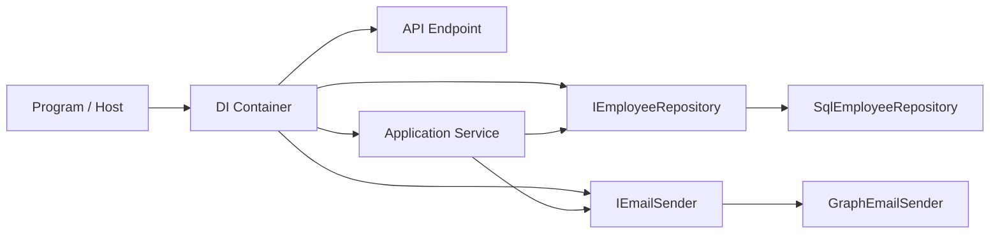
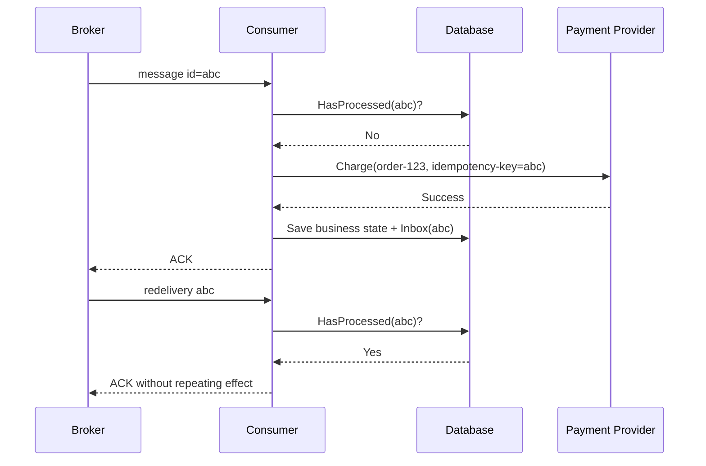
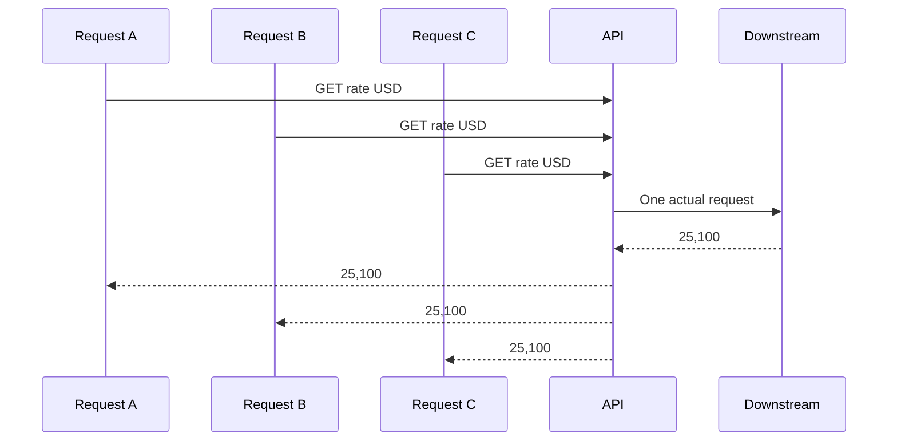
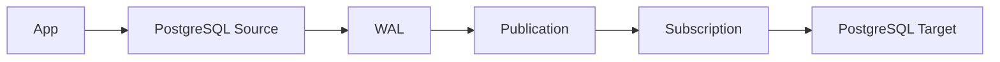
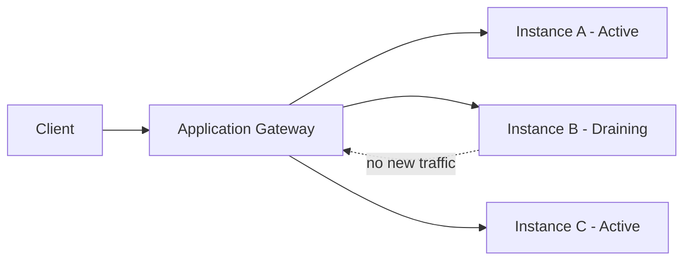
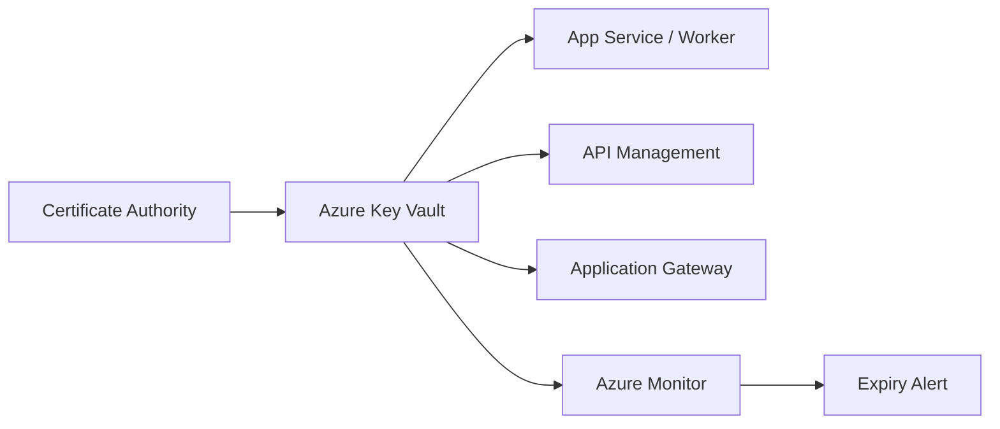
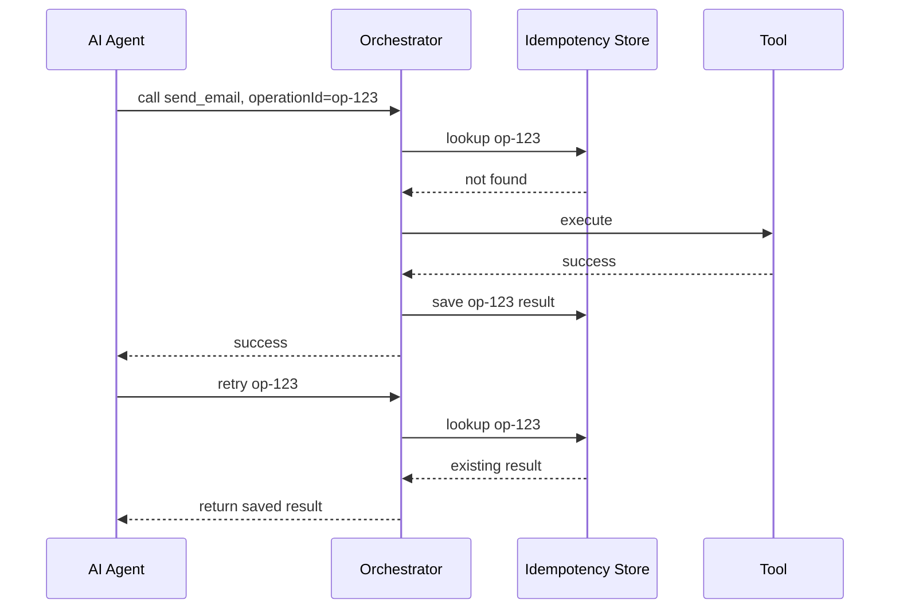
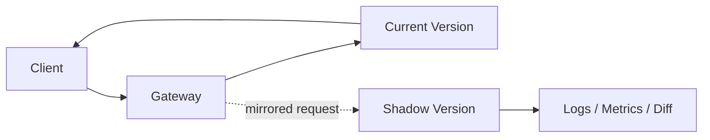

# Daily Knowledge Sharing — 17/08/2026

## Today’s Topics

1. Dependency Injection Composition Root — gom quyết định wiring vào một boundary thay vì để business code tự tạo dependency
2. Event-Driven Processing — “Exactly Once” là mục tiêu nghiệp vụ, không phải lời hứa thần kỳ của message broker
3. REST API Request Coalescing — gộp nhiều request giống nhau để bảo vệ downstream khỏi burst traffic
4. SQL Server Statistics Incremental & Histogram — hiểu dữ liệu mà optimizer dùng để ước lượng cardinality
5. PostgreSQL Logical Replication — sao chép thay đổi theo logical row-level để migration, integration và zero-downtime cutover
6. Azure Application Gateway Connection Draining — đưa instance ra khỏi rotation mà không cắt ngang request đang chạy
7. Azure Key Vault Certificate Lifecycle — quản lý certificate như một lifecycle có rotation, expiry và dependency mapping
8. Alert Design — metric-based alert, log-based alert và symptom-based alert trong production
9. AI Tool Idempotency — để agent có thể retry mà không gửi email, tạo đơn hoặc charge tiền hai lần
10. Shadow Traffic — kiểm tra version mới bằng production traffic sao chép mà chưa ảnh hưởng người dùng

---

# 1. Dependency Injection Composition Root — gom quyết định wiring vào một boundary thay vì để business code tự tạo dependency

### 1. What is it?

**Composition Root** là nơi duy nhất hoặc rất ít nơi trong application chịu trách nhiệm ghép object graph: interface nào dùng implementation nào, lifetime là gì, decorator/pipeline nào được áp dụng và configuration nào được truyền vào.

Trong ASP.NET Core, `Program.cs`, extension như `AddApplication()` và `AddInfrastructure()` thường là Composition Root. Điểm quan trọng không phải tên file, mà là **dependency construction nằm ở outer boundary**, còn application/domain chỉ sử dụng dependency abstraction.

### 2. Why does it exist?

Nếu service tự `new SqlConnection`, `new EmailClient`, đọc environment variable hoặc tự chọn implementation, business code vừa xử lý nghiệp vụ vừa biết infrastructure.

Hậu quả:

- khó test,
- khó thay implementation,
- lifetime bị phân tán,
- configuration không nhất quán,
- hidden dependency xuất hiện khắp codebase.

Composition Root tồn tại để tách **“object được tạo như thế nào”** khỏi **“object làm nghiệp vụ gì”**.

### 3. How does it work?



Application service chỉ phụ thuộc abstraction. Composition Root quyết định `IEmailSender -> GraphEmailSender` và `IEmployeeRepository -> SqlEmployeeRepository`.

### 4. Practical example

```csharp
public static class DependencyInjection
{
    public static IServiceCollection AddInfrastructure(
        this IServiceCollection services,
        IConfiguration configuration)
    {
        services.AddDbContext<AppDbContext>(options =>
            options.UseSqlServer(configuration.GetConnectionString("Default")));

        services.AddScoped<IEmployeeRepository, EmployeeRepository>();
        services.AddScoped<IEmailSender, GraphEmailSender>();

        return services;
    }
}
```

Business service:

```csharp
public sealed class OffboardingService(
    IEmployeeRepository employees,
    IEmailSender emailSender)
{
    public async Task ExecuteAsync(Guid employeeId, CancellationToken ct)
    {
        var employee = await employees.GetAsync(employeeId, ct);
        employee.MarkInactive();
        await emailSender.SendAsync(employee.Email, "Account disabled", ct);
    }
}
```

### 5. Real production scenario

Một employee-management system có SQL Server production nhưng dùng Testcontainers trong integration test. Nếu infrastructure creation nằm ở Composition Root, test host có thể override `DbContext` registration mà không sửa application code.

Request flow:

Client → API → `OffboardingService` → repository abstraction → SQL implementation.

### 6. Common mistakes

- Service locator: inject `IServiceProvider` rồi resolve dependency tùy ý trong business code.
- Singleton giữ `DbContext` scoped gây captive dependency.
- Registration extension chứa business rule.
- Mỗi module tự đăng ký cùng interface theo cách không kiểm soát.
- Constructor có 15 dependency nhưng chỉ “chữa” bằng service locator thay vì xem lại responsibility.

### 7. Trade-offs

**Advantages**

- dependency graph rõ,
- testability tốt,
- thay provider dễ,
- kiểm soát lifetime tập trung.

**Costs / Risks**

- startup configuration có thể lớn,
- registration order/decorator có thể khó debug,
- DI container không sửa được thiết kế domain tệ.

### 8. Junior → Middle → Senior understanding

**Junior**: hiểu constructor injection và scoped/transient/singleton.

**Middle**: biết tách registration theo module, override dependency trong test, phát hiện captive dependency.

**Senior / Technical Lead**: thiết kế composition boundary, module ownership, lifetime policy và tránh để DI framework rò vào domain.

### 9. Key takeaway

- Business code nên dùng dependency, không tự quyết định cách tạo dependency.
- Composition Root là nơi chứa infrastructure wiring, không phải business logic.
- DI lifetime là quyết định kiến trúc có ảnh hưởng production.

---

# 2. Event-Driven Processing — “Exactly Once” là mục tiêu nghiệp vụ, không phải lời hứa thần kỳ của message broker

### 1. What is it?

Trong distributed system, “exactly once” thường được hiểu sai là broker đảm bảo một message chỉ xuất hiện đúng một lần. Thực tế network failure, retry, redelivery và consumer crash khiến **at-least-once delivery** phổ biến hơn.

Mục tiêu thực tế là: dù message được giao nhiều lần, **business effect chỉ xảy ra một lần**.

### 2. Why does it exist?

Giả sử consumer xử lý payment:

1. nhận `ChargeCustomer`,
2. charge thành công,
3. process crash trước khi ACK,
4. broker gửi lại message.

Nếu consumer chỉ dựa vào delivery count, khách có thể bị charge hai lần.

### 3. How does it work?



Kỹ thuật thường dùng:

- Inbox table,
- unique constraint trên message id,
- idempotency key downstream,
- transactional Outbox cho outbound event.

### 4. Practical example

```csharp
public async Task HandleAsync(OrderPaid message, CancellationToken ct)
{
    if (await db.InboxMessages.AnyAsync(x => x.Id == message.MessageId, ct))
        return;

    var order = await db.Orders.SingleAsync(x => x.Id == message.OrderId, ct);
    order.MarkPaid();

    db.InboxMessages.Add(new InboxMessage(message.MessageId));
    await db.SaveChangesAsync(ct);
}
```

Database nên có unique index trên `InboxMessages.Id` để chống race condition.

### 5. Real production scenario

Notification system nhận event `LeaveApproved`. Broker redeliver 3 lần do consumer timeout. Nếu email sender hỗ trợ idempotency key hoặc application lưu delivery record theo `(eventId, channel)`, người dùng vẫn chỉ nhận một email.

### 6. Common mistakes

- Tin rằng broker “exactly once” nghĩa là side effect cũng exactly once.
- ACK trước khi transaction commit.
- Check-then-insert Inbox nhưng không có unique constraint.
- Retry payment API không dùng idempotency key.
- Dedupe theo timestamp thay vì stable event id.

### 7. Trade-offs

**Advantages**

- bảo vệ business effect,
- consumer retry an toàn,
- recovery dễ hơn.

**Costs / Risks**

- cần storage cho Inbox/Outbox,
- cleanup retention,
- thêm latency/transaction overhead,
- side effect ngoài DB vẫn cần downstream idempotency.

### 8. Junior → Middle → Senior understanding

**Junior**: hiểu message có thể được giao lại.

**Middle**: biết implement Inbox, unique key và idempotent handler.

**Senior / Technical Lead**: phân biệt delivery guarantee với business-effect guarantee, thiết kế transaction boundary và recovery across services.

### 9. Key takeaway

- Redelivery là bình thường, không phải exception.
- Exactly-once business effect thường được xây bằng idempotency + deduplication.
- Broker không thể tự bảo vệ side effect ở database, email hay payment provider của bạn.

---

# 3. REST API Request Coalescing — gộp nhiều request giống nhau để bảo vệ downstream khỏi burst traffic

### 1. What is it?

Request coalescing là kỹ thuật khi nhiều request đồng thời cần cùng một dữ liệu, chỉ một request thật sự gọi downstream; các request còn lại chờ cùng result.

Khác cache: cache giữ kết quả sau khi hoàn tất; coalescing chủ yếu xử lý **nhiều cache miss đồng thời**.

### 2. Why does it exist?

Một key cache hết hạn lúc 09:00:00. Có 500 request cùng gọi `/exchange-rate/USD` trong 100 ms. Nếu cả 500 cùng cache miss và gọi external provider, downstream có thể bị rate limit.

### 3. How does it work?



API giữ một “in-flight task” theo key. Request sau reuse task đó.

### 4. Practical example

```csharp
private readonly ConcurrentDictionary<string, Lazy<Task<Rate>>> _inflight = new();

public async Task<Rate> GetRateAsync(string currency, CancellationToken ct)
{
    var lazy = _inflight.GetOrAdd(currency, key =>
        new Lazy<Task<Rate>>(() => provider.GetRateAsync(key, ct)));

    try
    {
        return await lazy.Value;
    }
    finally
    {
        _inflight.TryRemove(currency, out _);
    }
}
```

Production implementation cần cân nhắc cancellation: request đầu hủy không nên luôn hủy shared downstream call cho mọi waiter.

### 5. Real production scenario

Microsoft 365 integration đọc profile user từ Graph API. Một dashboard có nhiều widget cùng cần thông tin user. Nếu request coalescing theo `userId`, burst request không nhân số call Graph.

### 6. Common mistakes

- Dùng request cancellation token của caller đầu cho shared task.
- Không remove task fail khỏi dictionary khiến lỗi bị “cache” vô hạn.
- Key quá rộng khiến request khác nhau bị gộp nhầm.
- Coalescing mọi endpoint kể cả write request.
- Quên distributed scenario: mỗi instance vẫn có in-flight map riêng.

### 7. Trade-offs

**Advantages**

- giảm burst tới downstream,
- giảm rate-limit risk,
- đặc biệt hiệu quả khi cache miss đồng thời.

**Costs / Risks**

- tăng complexity concurrency,
- lỗi của one shared call ảnh hưởng nhiều waiter,
- memory pressure nếu key cardinality cao.

### 8. Junior → Middle → Senior understanding

**Junior**: hiểu cache miss stampede.

**Middle**: biết implement keyed in-flight task và cleanup lỗi.

**Senior / Technical Lead**: thiết kế cancellation semantics, cross-instance behavior, timeout budget và fallback strategy.

### 9. Key takeaway

- Cache và coalescing giải hai phần khác nhau của cùng vấn đề.
- Coalescing phù hợp read-heavy, deterministic request.
- Shared work cần shared timeout/cancellation policy rõ ràng.

---

# 4. SQL Server Statistics Incremental & Histogram — hiểu dữ liệu mà optimizer dùng để ước lượng cardinality

### 1. What is it?

SQL Server statistics chứa metadata về phân phối dữ liệu, đặc biệt histogram, để optimizer ước lượng một predicate sẽ trả về bao nhiêu row.

Index có thể tồn tại nhưng nếu cardinality estimation sai, optimizer vẫn có thể chọn join type, memory grant hoặc access path tệ.

### 2. Why does it exist?

Optimizer phải chọn plan trước khi query chạy. Nó không thể scan toàn bảng mỗi lần chỉ để “đếm thử”. Vì vậy nó dùng statistics như một mô hình gần đúng của dữ liệu.

Khi data skew hoặc statistics stale, estimate 100 rows nhưng actual 2,000,000 rows là hoàn toàn có thể xảy ra.

### 3. How does it work?

```text
Predicate
   │
   ▼
Statistics / Histogram
   │  estimated rows
   ▼
Cardinality Estimator
   │
   ▼
Join choice / Memory grant / Index access
   │
   ▼
Execution Plan
```

Partitioned tables có thể dùng incremental statistics để cập nhật statistics theo partition thay vì toàn bảng trong một số cấu hình.

### 4. Practical example

```sql
SELECT Status, COUNT(*)
FROM dbo.Orders
GROUP BY Status;
```

Giả sử 99.8% order là `Completed`, chỉ 0.2% là `Pending`.

```sql
SELECT *
FROM dbo.Orders
WHERE Status = 'Pending';
```

Nếu statistics phản ánh skew tốt, optimizer có thể chọn seek phù hợp. Nếu stale, nó có thể scan hoặc cấp memory sai.

Kiểm tra:

```sql
DBCC SHOW_STATISTICS ('dbo.Orders', 'IX_Orders_Status');
```

### 5. Real production scenario

Timesheet table tăng hàng triệu row mỗi tháng. Partition mới nhận phần lớn write nhưng partition cũ gần như immutable. Incremental statistics giúp tránh update statistics toàn bộ dataset mỗi lần partition mới thay đổi mạnh.

### 6. Common mistakes

- “Có index rồi nên statistics không quan trọng”.
- `UPDATE STATISTICS` toàn bộ database trong peak hour.
- Không đọc estimated vs actual rows trong execution plan.
- Dùng `FULLSCAN` khắp nơi mà không đo cost.
- Không hiểu auto statistics threshold trên bảng rất lớn.

### 7. Trade-offs

**Advantages**

- estimate tốt hơn,
- plan ổn định hơn,
- incremental strategy giảm maintenance cost trên partition lớn.

**Costs / Risks**

- update statistics dùng CPU/IO,
- histogram vẫn chỉ là approximation,
- parameterized workloads và data skew vẫn có thể gây plan issue.

### 8. Junior → Middle → Senior understanding

**Junior**: biết statistics khác index.

**Middle**: biết đọc estimated rows vs actual rows và `DBCC SHOW_STATISTICS`.

**Senior / Technical Lead**: xây statistics maintenance theo workload, partition strategy và incident pattern thay vì chạy job “update tất cả”.

### 9. Key takeaway

- Optimizer ra quyết định dựa trên estimate.
- Statistics sai có thể làm index tốt trở nên vô dụng.
- Maintenance cần dựa trên workload và data change rate.

---

# 5. PostgreSQL Logical Replication — sao chép thay đổi theo logical row-level để migration, integration và zero-downtime cutover

### 1. What is it?

Logical replication của PostgreSQL truyền thay đổi dữ liệu ở mức logical, ví dụ `INSERT`, `UPDATE`, `DELETE`, thay vì copy block vật lý của database.

Publisher xuất change; subscriber nhận và apply vào table tương ứng.

### 2. Why does it exist?

Physical replication rất tốt cho HA/read replica nhưng thường yêu cầu compatibility chặt về cluster/version và replicate cả instance ở mức storage.

Logical replication hữu ích khi muốn:

- replicate subset table,
- migrate version,
- đồng bộ dữ liệu sang cluster khác,
- cutover dần.

### 3. How does it work?



Source ghi WAL như bình thường. Logical decoding chuyển change thành logical stream cho subscriber.

### 4. Practical example

Source:

```sql
CREATE PUBLICATION app_pub
FOR TABLE employees, timesheets;
```

Target:

```sql
CREATE SUBSCRIPTION app_sub
CONNECTION 'host=old-db dbname=app user=replicator password=***'
PUBLICATION app_pub;
```

Schema compatibility cần được quản lý riêng.

### 5. Real production scenario

Một SaaS cần migrate PostgreSQL 14 sang cluster mới PostgreSQL 17. Team copy initial data, bật logical replication, để source tiếp tục phục vụ write, theo dõi replication lag, rồi cutover application khi lag gần zero.

### 6. Common mistakes

- Nghĩ logical replication tự replicate DDL/schema change.
- Không có replica identity phù hợp cho update/delete.
- Không monitor replication slot → WAL phình lớn nếu subscriber lỗi lâu.
- Cutover mà không freeze/coordinate write.
- Không kiểm tra sequence value sau migration.

### 7. Trade-offs

**Advantages**

- selective replication,
- hữu ích cho migration/cutover,
- linh hoạt hơn physical replication.

**Costs / Risks**

- schema management phức tạp,
- replication lag,
- slot retention có thể làm disk đầy,
- conflict management không tự biến thành multi-master an toàn.

### 8. Junior → Middle → Senior understanding

**Junior**: hiểu publisher/subscriber và replication lag.

**Middle**: biết publication, subscription, slot monitoring, replica identity.

**Senior / Technical Lead**: thiết kế migration cutover, rollback, write freeze, schema compatibility và capacity cho WAL retention.

### 9. Key takeaway

- Logical replication là data-change replication, không phải magic database clone.
- Schema và sequence cần kế hoạch riêng.
- Luôn monitor replication lag và retained WAL.

---

# 6. Azure Application Gateway Connection Draining — đưa instance ra khỏi rotation mà không cắt ngang request đang chạy

### 1. What is it?

Connection draining cho phép backend đang bị remove khỏi pool ngừng nhận connection mới nhưng vẫn có thời gian hoàn thành connection/request hiện có.

Đây là cơ chế quan trọng khi rolling deployment, autoscale hoặc backend maintenance.

### 2. Why does it exist?

Nếu load balancer remove instance ngay lập tức trong lúc request upload file 200 MB hoặc API đang xử lý 40 giây, user có thể nhận connection reset dù instance hoàn toàn khỏe vài mili-giây trước.

### 3. How does it work?



Instance B không nhận request mới, nhưng request đang chạy được phép kết thúc trong drain timeout.

### 4. Practical example

Một ASP.NET Core API được deploy theo rolling strategy. Trước khi terminate instance cũ:

1. backend bị đánh dấu draining,
2. gateway ngừng route traffic mới,
3. request đang chạy hoàn tất,
4. instance mới bị terminate.

Application cũng nên handle `SIGTERM`/host shutdown để stop nhận background work mới.

### 5. Real production scenario

File-processing API có endpoint upload qua Application Gateway. Deployment lúc traffic cao từng gây nhiều `502`. Root cause không phải code mới mà do instance bị recycle trong lúc upload. Connection draining + readiness probe + graceful shutdown giải quyết failure window.

### 6. Common mistakes

- Chỉ bật draining nhưng drain timeout ngắn hơn request max duration.
- Background job vẫn nhận work mới trong giai đoạn shutdown.
- Health probe đánh instance unhealthy quá sớm.
- Dùng sticky session rồi giả định draining sẽ giữ mọi future request của user.

### 7. Trade-offs

**Advantages**

- giảm connection reset,
- rolling deployment mượt hơn,
- phù hợp long-running request.

**Costs / Risks**

- deployment/scale-in chậm hơn,
- instance cũ tồn tại lâu hơn,
- nếu request không có timeout, drain có thể kéo dài không cần thiết.

### 8. Junior → Middle → Senior understanding

**Junior**: hiểu health probe và backend pool.

**Middle**: biết connection draining, graceful shutdown, readiness/liveness.

**Senior / Technical Lead**: phối hợp gateway timeout, app timeout, deployment strategy, autoscale và background workload lifecycle.

### 9. Key takeaway

- “Healthy → terminated” không nên là chuyển trạng thái tức thì.
- Drain timeout phải phù hợp real request duration.
- Network layer và application shutdown lifecycle phải thiết kế cùng nhau.

---

# 7. Azure Key Vault Certificate Lifecycle — quản lý certificate như một lifecycle có rotation, expiry và dependency mapping

### 1. What is it?

Certificate management không chỉ là “lưu `.pfx` trong Key Vault”. Một certificate có lifecycle: issuance → storage → distribution/reference → renewal → activation → expiry → revocation.

Key Vault giúp quản lý secret/key/certificate tập trung, nhưng application vẫn cần thiết kế cách nhận version mới.

### 2. Why does it exist?

Certificate thường fail theo kiểu “mọi thứ chạy 364 ngày rồi production chết lúc 02:00 vì hết hạn”. Nếu không biết service nào đang dùng certificate nào, rotation trở thành incident.

### 3. How does it work?



Consumer nên reference certificate bằng Managed Identity khi có thể và có chiến lược reload/version rollout.

### 4. Practical example

ASP.NET Core đọc certificate bằng Key Vault client:

```csharp
var client = new CertificateClient(
    new Uri(vaultUri),
    new DefaultAzureCredential());

var certificate = await client.GetCertificateAsync("graph-client-cert", ct);
```

Nếu workload cần private key, thực tế thường phải đọc backing secret hoặc dùng key operation tùy loại certificate và use case.

### 5. Real production scenario

Một Microsoft Graph daemon app dùng certificate credential. Certificate được rotate 30 ngày trước expiry. Entra app registration tạm giữ cả certificate cũ và mới trong overlap window; worker deploy/reload certificate mới rồi mới remove certificate cũ.

### 6. Common mistakes

- Chỉ alert khi certificate còn 1 ngày.
- Rotate ở Key Vault nhưng consumer cache certificate đến restart.
- Xóa old certificate ngay, không có overlap.
- Lưu PFX/password trong repo hoặc pipeline variable lâu dài.
- Không inventory dependency sử dụng certificate.

### 7. Trade-offs

**Advantages**

- quản lý tập trung,
- access bằng Managed Identity,
- audit/rotation tốt hơn.

**Costs / Risks**

- rotation orchestration phức tạp,
- app reload behavior phải rõ,
- certificate vẫn có blast radius nếu quyền cấp quá rộng.

### 8. Junior → Middle → Senior understanding

**Junior**: hiểu certificate có expiry và private key cần bảo vệ.

**Middle**: biết Key Vault access, Managed Identity, expiry alert, certificate reload.

**Senior / Technical Lead**: thiết kế overlap rotation, ownership, incident playbook, dependency inventory và least privilege.

### 9. Key takeaway

- Certificate rotation là workflow, không phải một lệnh upload.
- Luôn có overlap window khi credential consumer cần chuyển version.
- Alert trước expiry đủ xa để còn thời gian xử lý.

---

# 8. Alert Design — metric-based alert, log-based alert và symptom-based alert trong production

### 1. What is it?

Alert là cơ chế biến telemetry thành hành động. Nhưng không phải mọi telemetry đều nên tạo alert.

Ba nhóm phổ biến:

- **Metric-based**: CPU, queue depth, error rate, latency.
- **Log-based**: pattern cụ thể trong event/log.
- **Symptom-based**: thứ user thực sự cảm nhận như checkout failure hoặc login failure.

### 2. Why does it exist?

Nếu alert dựa trên mọi exception log, on-call sẽ bị noise. Nếu chỉ alert CPU, hệ thống có thể trả `500` hàng loạt trong khi CPU vẫn 20%.

Alert tốt cần chỉ ra **actionable condition**.

### 3. How does it work?

```text
Telemetry
  ├─ Metrics ──> threshold / anomaly ─┐
  ├─ Logs ─────> query / pattern ─────┼─> Alert rule -> Notification -> Runbook
  └─ Traces ───> SLO / symptom ───────┘
```

Ưu tiên symptom-based alert cho user-impact; resource alert thường hỗ trợ chẩn đoán.

### 4. Practical example

KQL concept cho failed requests:

```kusto
requests
| where timestamp > ago(5m)
| summarize total=count(), failed=countif(success == false)
| extend failureRate = todouble(failed) / total
| where total > 100 and failureRate > 0.05
```

Alert này tốt hơn “có 1 request fail”.

### 5. Real production scenario

Timesheet API có 2 alert:

1. `POST /timesheets` failure rate > 5% trong 10 phút → page on-call.
2. SQL DTU > 80% trong 20 phút → warning để hỗ trợ diagnosis.

User symptom là alert chính; infrastructure saturation là secondary signal.

### 6. Common mistakes

- Alert trên mọi exception.
- Threshold không có minimum traffic nên 1/1 request fail = 100%.
- Không có dedup/suppression.
- Alert không có owner/runbook.
- Dùng average latency, bỏ qua p95/p99.

### 7. Trade-offs

**Advantages**

- phát hiện incident sớm,
- giảm MTTR,
- symptom alert liên kết trực tiếp user impact.

**Costs / Risks**

- tuning mất công,
- log alert có latency/cost cao,
- alert quá nhạy gây fatigue.

### 8. Junior → Middle → Senior understanding

**Junior**: hiểu alert khác dashboard.

**Middle**: biết xây threshold theo rate/window/minimum volume.

**Senior / Technical Lead**: thiết kế paging policy theo SLO, severity, ownership và actionable response.

### 9. Key takeaway

- Alert phải dẫn tới hành động cụ thể.
- User symptom thường quan trọng hơn resource symptom.
- Noise cao làm alert system mất giá trị.

---

# 9. AI Tool Idempotency — để agent có thể retry mà không gửi email, tạo đơn hoặc charge tiền hai lần

### 1. What is it?

Khi AI agent gọi tool có side effect, model/API/network có thể timeout rồi retry. Tool idempotency đảm bảo cùng một intent/retry không tạo side effect lặp lại.

AI có thể quyết định **nên gọi tool nào**, nhưng deterministic application code phải kiểm soát **tool call có được thực thi lại hay không**.

### 2. Why does it exist?

Agent gọi `SendInvoiceEmail`. Tool thực sự gửi mail nhưng response về model bị timeout. Agent nghĩ call thất bại và retry. Người dùng nhận hai email.

Vấn đề tương tự với:

- tạo ticket,
- refund,
- booking,
- payment,
- update account.

### 3. How does it work?



### 4. Practical example

```csharp
public async Task<ToolResult> ExecuteAsync(
    string operationId,
    SendEmailArgs args,
    CancellationToken ct)
{
    var existing = await store.TryGetAsync(operationId, ct);
    if (existing is not null)
        return existing;

    var result = await emailSender.SendAsync(args, ct);
    await store.SaveAsync(operationId, result, ct);
    return result;
}
```

Production cần unique constraint trên `operationId` và xử lý concurrent duplicate.

### 5. Real production scenario

AI helpdesk agent có quyền tạo Jira issue. Agent retry do LLM orchestration timeout. Backend sử dụng `operationId = conversationId + approvedActionId`, nên retry trả lại ticket đã tạo thay vì tạo ticket thứ hai.

### 6. Common mistakes

- Dùng random idempotency key mới cho mỗi retry.
- Để model tự quyết định operation id.
- Chỉ dedupe trong memory của một instance.
- Không lưu result nên retry không biết output cũ.
- Cho tool destructive chạy mà không human approval khi risk cao.

### 7. Trade-offs

**Advantages**

- retry an toàn,
- giảm duplicate side effect,
- audit tốt hơn.

**Costs / Risks**

- cần persistent idempotency store,
- retention/cleanup,
- phải định nghĩa “same operation” chính xác.

### 8. Junior → Middle → Senior understanding

**Junior**: hiểu LLM/tool call có thể retry.

**Middle**: biết operation id, unique constraint, persist result.

**Senior / Technical Lead**: thiết kế permission boundary, approval, idempotency semantics và compensation cho side effect không thể rollback.

### 9. Key takeaway

- AI retry không được phép đồng nghĩa với business action lặp lại.
- Idempotency key phải do deterministic code quản lý.
- Side effect quan trọng cần audit và approval boundary.

---

# 10. Shadow Traffic — kiểm tra version mới bằng production traffic sao chép mà chưa ảnh hưởng người dùng

### 1. What is it?

Shadow traffic, hay traffic mirroring, sao chép request production sang version mới nhưng response của version mới **không được trả cho user**.

Mục tiêu là quan sát behavior/performance của version mới dưới workload thật trước khi route traffic thật.

### 2. Why does it exist?

Staging hiếm khi có:

- traffic distribution thật,
- payload diversity thật,
- concurrency thật,
- data size thật.

Canary vẫn ảnh hưởng một phần user. Shadow traffic giảm risk đó bằng cách “quan sát mà chưa phục vụ”.

### 3. How does it work?



Critical rule: shadow version phải bị chặn side effect hoặc dùng sandbox dependency.

### 4. Practical example

Version mới của pricing API nhận mirror request. Một comparer ghi lại:

```text
requestId
v1.price
v2.price
latency_v1
latency_v2
difference_reason
```

Nếu logic mới dự kiến thay đổi giá có chủ đích, comparison phải dựa business rule chứ không chỉ “response phải giống 100%”.

### 5. Real production scenario

Team rewrite search endpoint từ SQL query sang Elasticsearch. Trong 1 tuần, 100% search request production được mirror sang V2. User vẫn nhận kết quả V1; team đo p95, empty-result rate và top-result overlap của V2 trước khi canary.

### 6. Common mistakes

- Shadow POST request nhưng V2 vẫn gửi email hoặc ghi DB thật.
- Không scrub PII trước khi mirror sang environment khác.
- Mirror 100% traffic ngay lập tức khiến downstream V2 quá tải.
- Chỉ so status code mà không so business correctness.
- Không tag telemetry shadow khiến dashboard lẫn production traffic thật.

### 7. Trade-offs

**Advantages**

- test workload thật,
- không ảnh hưởng response user,
- phát hiện performance/correctness gap trước canary.

**Costs / Risks**

- tăng compute/network cost,
- privacy/security concerns,
- side effect isolation bắt buộc,
- comparison logic có thể phức tạp.

### 8. Junior → Middle → Senior understanding

**Junior**: hiểu shadow traffic khác canary.

**Middle**: biết mirror request, tag telemetry, chặn side effect.

**Senior / Technical Lead**: quyết định sampling rate, privacy boundary, comparison metrics, exit criteria và chuyển từ shadow → canary → full rollout.

### 9. Key takeaway

- Shadow traffic cho phép học từ production workload mà chưa phục vụ production response.
- Side effect phải bị cô lập tuyệt đối.
- Shadow không thay canary; nó là bước giảm risk trước canary.
