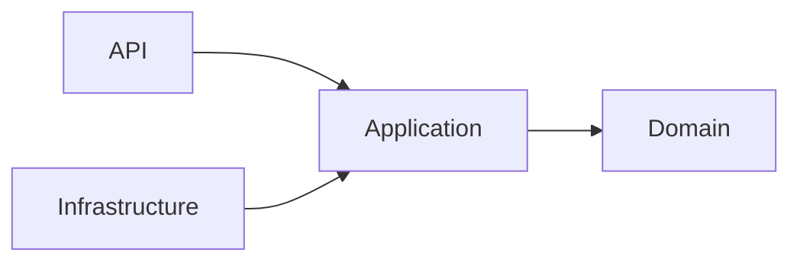

# Daily Knowledge Sharing — 17/08/2026

## Today’s Topics

1. Clean Architecture Dependency Rule
2. CQRS Command và Query Separation
3. API Idempotency
4. SQL Server Query Optimization
5. Redis Cache Aside Pattern
6. Azure Service Bus Dead-Letter Queue
7. Managed Identity trên Azure
8. OpenTelemetry Distributed Tracing
9. RAG Architecture cho AI Application
10. Canary Deployment

---

# 1. Clean Architecture Dependency Rule

### 1. What is it?

Clean Architecture là cách tổ chức hệ thống theo business rules ở trung tâm và các chi tiết kỹ thuật ở bên ngoài.

### 2. Why does it exist?

Mục tiêu là giảm coupling giữa domain với database, framework hoặc external service.

### 3. How does it work?

Dependency chỉ hướng vào trong. Domain không biết Infrastructure tồn tại.

### 4. Practical example

ASP.NET Core API gọi Application Service, Application xử lý use case, Repository interface được inject từ Infrastructure.

### 5. Real production scenario

Hệ thống SaaS có thể thay SQL Server bằng PostgreSQL mà không thay đổi business logic.

### 6. Common mistakes

Tạo quá nhiều layer nhưng business logic vẫn nằm trong Controller.

### 7. Trade-offs

Ưu điểm: dễ test, dễ thay đổi.
Chi phí: nhiều abstraction hơn.

### 8. Junior → Middle → Senior understanding

Junior hiểu trách nhiệm layer.
Middle biết thiết kế dependency.
Senior quyết định boundary phù hợp.

### 9. Key takeaway

Architecture tốt không phải nhiều folder mà là kiểm soát dependency.

---

# 2. CQRS Command và Query Separation

Tách thao tác thay đổi dữ liệu khỏi thao tác đọc dữ liệu.

Ví dụ: Command tạo Order, Query lấy Order detail.

Ưu điểm là tối ưu từng luồng riêng, nhưng tăng độ phức tạp.

---

# 3. API Idempotency

Idempotency giúp request gửi nhiều lần nhưng kết quả chỉ tạo một hiệu ứng.

Ví dụ payment API dùng Idempotency-Key để tránh charge hai lần.

---

# 4. SQL Server Query Optimization

Tối ưu query cần bắt đầu bằng đo lường execution plan, index usage và IO cost.

Không phải mọi index đều tốt vì index tăng tốc đọc nhưng làm chậm ghi.

---

# 5. Redis Cache Aside Pattern

Application kiểm tra cache trước, nếu miss thì đọc database rồi cập nhật cache.

Cần thiết kế TTL và invalidation rõ ràng.

---

# 6. Azure Service Bus Dead-Letter Queue

DLQ lưu message xử lý thất bại để điều tra thay vì mất dữ liệu.

Production system cần monitoring DLQ thường xuyên.

---

# 7. Managed Identity trên Azure

Managed Identity giúp service Azure truy cập resource mà không lưu secret trong code.

Đây là mô hình authentication ưu tiên trong cloud.

---

# 8. OpenTelemetry Distributed Tracing

Tracing giúp theo dõi request xuyên nhiều service.

Khi production lỗi, trace giúp tìm bottleneck nhanh hơn log đơn thuần.

---

# 9. RAG Architecture cho AI Application

RAG kết hợp LLM với dữ liệu riêng thông qua embeddings và vector search.

Cần kiểm soát context, security và cost.

---

# 10. Canary Deployment

Canary release đưa version mới tới một nhóm nhỏ user trước khi rollout toàn bộ.

Giảm rủi ro khi release production.
