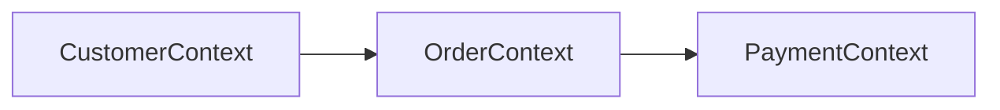
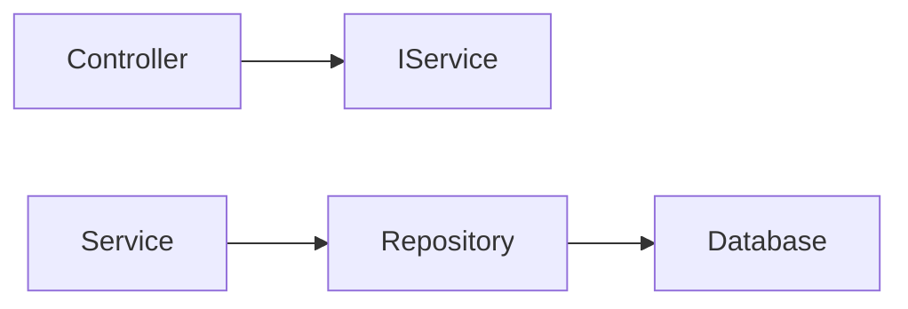
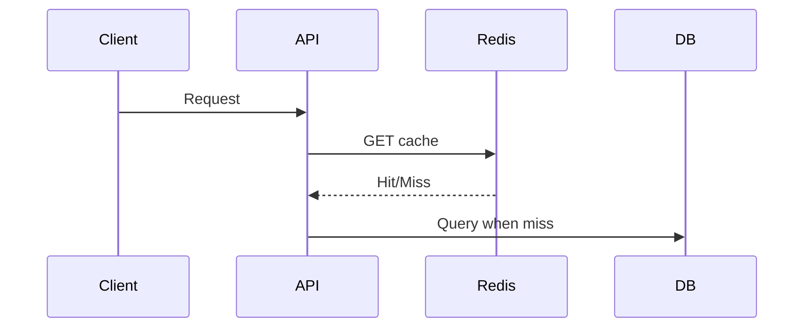
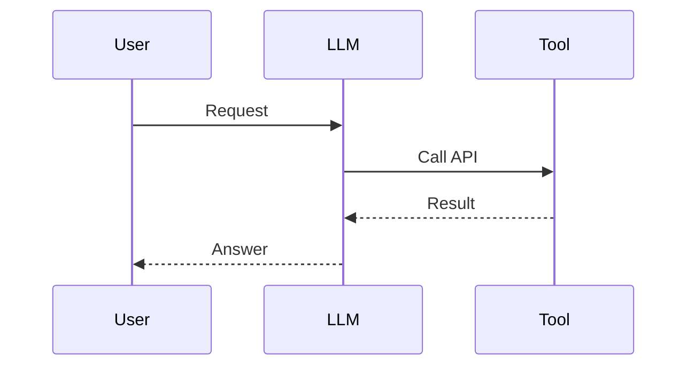

# Daily Knowledge Sharing — 17/08/2026

## Today’s Topics

1. Domain-Driven Design (DDD) Bounded Context
2. Dependency Injection và Lifetime Management trong ASP.NET Core
3. API Versioning và Backward Compatibility
4. Optimistic Concurrency trong EF Core
5. Redis Distributed Cache Strategy
6. Azure App Service Scaling
7. Azure Key Vault và Secret Management
8. Production Incident Investigation với Logs, Metrics, Traces
9. AI Function Calling Architecture
10. Feature Flags trong Continuous Delivery

---

# 1. Domain-Driven Design (DDD) Bounded Context

### 1. What is it?
DDD Bounded Context là ranh giới rõ ràng nơi một domain model có ý nghĩa riêng. Một thuật ngữ có thể có nhiều ý nghĩa ở các context khác nhau.

### 2. Why does it exist?
Khi hệ thống lớn lên, một model dùng chung cho mọi nơi tạo coupling và business rule xung đột.

### 3. How does it work?

Mỗi context sở hữu model, rule và database boundary riêng.

### 4. Practical example
Trong hệ thống thương mại điện tử, Customer trong CRM khác với Customer trong Payment.

### 5. Production scenario
Team Sales thay đổi workflow không nên làm ảnh hưởng Payment service.

### 6. Common mistakes
Tạo context chỉ theo database table thay vì theo business capability.

### 7. Trade-offs
Ưu điểm: giảm coupling, dễ scale team. Chi phí: cần hiểu domain sâu.

### 8. Junior → Middle → Senior
Junior hiểu domain object. Middle thiết kế module boundary. Senior quyết định context và integration strategy.

### 9. Key takeaway
Boundary tốt quan trọng hơn việc chia nhiều project.

---

# 2. Dependency Injection và Lifetime Management trong ASP.NET Core

### 1. What is it?
DI cung cấp dependency từ bên ngoài thay vì class tự tạo object.

### 2. Why does it exist?
Giảm coupling và tăng khả năng test.

### 3. How does it work?


### 4. Practical example
```csharp
builder.Services.AddScoped<IOrderService, OrderService>();
```

### 5. Production scenario
Web API dùng scoped service cho request transaction.

### 6. Common mistakes
Inject DbContext singleton hoặc tạo service bằng new.

### 7. Trade-offs
DI tăng khả năng mở rộng nhưng có thể làm dependency graph phức tạp.

### 8. Junior → Middle → Senior
Junior hiểu constructor injection. Middle quản lý lifetime. Senior thiết kế composition root.

### 9. Key takeaway
Lifetime sai có thể gây memory leak hoặc lỗi concurrency.

---

# 3. API Versioning và Backward Compatibility

API versioning giúp thay đổi contract mà không phá client cũ.

Ví dụ `/api/v1/orders` và `/api/v2/orders`.

Production cần quản lý deprecation, migration và documentation.

Sai lầm phổ biến là đổi response mà không báo trước.

Trade-off: version nhiều giúp an toàn nhưng tăng maintenance.

---

# 4. Optimistic Concurrency trong EF Core

Dùng concurrency token để phát hiện dữ liệu bị thay đổi bởi user khác.

Ví dụ rowversion trong SQL Server.

```csharp
[Timestamp]
public byte[] Version { get; set; }
```

Phù hợp với hệ thống nhiều người cùng chỉnh sửa dữ liệu.

---

# 5. Redis Distributed Cache Strategy

Redis lưu dữ liệu tạm để giảm tải database.

Flow:



Cần thiết kế TTL, invalidation và fallback khi Redis lỗi.

Không nên cache dữ liệu nhạy cảm hoặc thay đổi liên tục.

---

# 6. Azure App Service Scaling

Azure App Service cung cấp hosting cho web application.

Scale có thể theo chiều ngang bằng nhiều instance hoặc autoscale rule.

Cần quan tâm session state, connection pool, logging và cost.

---

# 7. Azure Key Vault và Secret Management

Key Vault lưu secrets, certificates và keys.

Ứng dụng nên dùng Managed Identity thay vì lưu connection string trong config.

Production cần audit access và rotation policy.

---

# 8. Production Incident Investigation

Điều tra production cần kết hợp:

- Logs: chuyện gì xảy ra
- Metrics: hệ thống đang khỏe hay không
- Traces: request đi qua đâu

Ví dụ API chậm cần xác định bottleneck ở code, database hay external service.

---

# 9. AI Function Calling Architecture

Function Calling cho phép LLM gọi deterministic tools thay vì tự trả lời mọi thứ.



AI quyết định intent, code kiểm soát business rule.

Cần bảo vệ permission, validation và cost.

---

# 10. Feature Flags trong Continuous Delivery

Feature Flag tách deployment khỏi release.

Ví dụ bật tính năng mới cho 5% user trước.

Ưu điểm: giảm risk production. Rủi ro: flag tồn tại quá lâu gây complexity.

---

# Final Key Takeaways

- Kiến trúc tốt tập trung vào boundary và dependency.
- Production engineering cần quan tâm failure mode, không chỉ happy path.
- Cloud, AI và distributed system đều yêu cầu kiểm soát trade-off.
- Senior developer khác biệt ở khả năng đưa ra quyết định phù hợp với bối cảnh.
