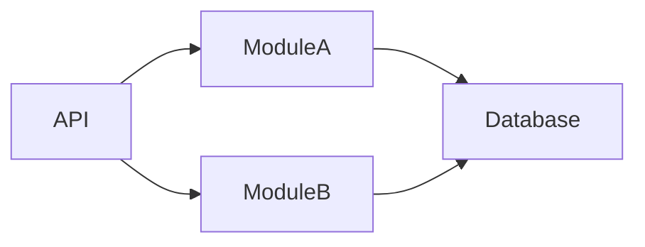

# Daily Knowledge Sharing — 17/08/2026

## Today’s Topics

1. Modular Monolith Architecture
2. Event-Driven Architecture
3. API Resilience với Retry và Circuit Breaker
4. Database Transaction Isolation Levels
5. EF Core Query Performance
6. Azure Service Bus Messaging
7. Azure Application Insights
8. Distributed Tracing với OpenTelemetry
9. RAG Context Engineering cho AI Application
10. Deployment Strategy với Blue-Green Deployment

---

# 1. Modular Monolith Architecture

### 1. What is it?

Modular Monolith là kiến trúc trong đó một ứng dụng được deploy như một đơn vị nhưng được chia thành các module có boundary rõ ràng.

### 2. Why does it exist?

Giải quyết vấn đề monolith lớn dần trở nên khó bảo trì nhưng chưa cần độ phức tạp của microservices.

### 3. How does it work?

Mỗi module sở hữu business logic và contract riêng.

### 4. Practical example

ASP.NET Core chia thành Order, Customer, Payment modules.

### 5. Real production scenario

SaaS có nhiều domain nhưng team nhỏ vẫn cần tốc độ phát triển cao.

### 6. Common mistakes

Chỉ chia folder nhưng các module vẫn gọi trực tiếp database của nhau.

### 7. Trade-offs

Đơn giản hơn microservices nhưng vẫn cần discipline về boundary.

### 8. Junior → Middle → Senior

Junior hiểu module responsibility. Middle thiết kế dependency. Senior quyết định khi nào tách service.

### 9. Key takeaway

Boundary tốt quan trọng hơn số lượng service.

---

# 2. Event-Driven Architecture

Event-driven architecture cho phép các thành phần giao tiếp thông qua event thay vì gọi trực tiếp.

Ví dụ OrderCreated event gửi tới Notification và Billing.

Ưu điểm: giảm coupling. Rủi ro: xử lý eventual consistency và debugging khó hơn.

---

# 3. API Resilience với Retry và Circuit Breaker

Retry xử lý lỗi tạm thời, Circuit Breaker ngăn hệ thống tiếp tục gọi dependency đang lỗi.

Production cần timeout, retry policy và monitoring rõ ràng.

---

# 4. Database Transaction Isolation Levels

Isolation level quyết định mức độ cô lập giữa transaction.

READ COMMITTED, REPEATABLE READ và SERIALIZABLE có trade-off giữa consistency và performance.

---

# 5. EF Core Query Performance

Cần tránh N+1 query, kiểm tra generated SQL và sử dụng projection khi chỉ cần một phần dữ liệu.

Ví dụ dùng Select thay vì load toàn bộ entity graph.

---

# 6. Azure Service Bus Messaging

Azure Service Bus cung cấp queue và topic cho hệ thống bất đồng bộ.

Cần xử lý retry, duplicate message, dead-letter queue và monitoring.

---

# 7. Azure Application Insights

Application Insights giúp theo dõi request, dependency call, exception và performance.

Production troubleshooting cần kết hợp telemetry thay vì chỉ xem log.

---

# 8. Distributed Tracing với OpenTelemetry

Distributed tracing theo dõi một request đi qua nhiều service.

Trace giúp xác định service nào gây latency hoặc failure.

---

# 9. RAG Context Engineering cho AI Application

RAG kết hợp LLM với dữ liệu riêng bằng retrieval và embeddings.

Cần kiểm soát context size, relevance, security và token cost.

---

# 10. Blue-Green Deployment

Blue-Green tạo môi trường mới song song trước khi chuyển traffic.

Giảm downtime nhưng cần quản lý database migration và infrastructure cost.

---

# Final Key Takeaways

- Kiến trúc tốt tập trung vào boundary, dependency và khả năng thay đổi.
- Production system cần thiết kế cho failure, không chỉ happy path.
- Distributed systems yêu cầu quan tâm consistency, observability và resilience.
- Senior engineering là khả năng chọn trade-off phù hợp với bối cảnh.
