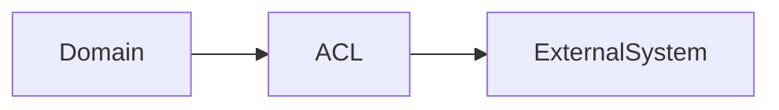

# Daily Knowledge Sharing — 17/08/2026

## Today’s Topics

1. Anti-Corruption Layer
2. Adapter Pattern
3. Background Processing
4. SQL Server Parameter Sniffing
5. EF Core Change Tracking
6. Azure Blob Storage
7. Azure DevOps Pipeline
8. API Performance
9. Incident Investigation
10. AI Evaluation & Observability

---

# 1. Anti-Corruption Layer

### 1. What is it?

Anti-Corruption Layer là boundary bảo vệ domain khỏi model của hệ thống bên ngoài.

### 2. Why does it exist?

Giúp tránh việc business logic phụ thuộc trực tiếp vào SDK, API hoặc terminology của third-party.

### 3. How does it work?

ACL chuyển đổi model, lỗi và semantics giữa hai hệ thống.

### 4. Practical example

Trong .NET, tạo interface nội bộ như `IMailboxGateway` thay vì để domain gọi trực tiếp Microsoft Graph SDK.

### 5. Real production scenario

Hệ thống employee offboarding tích hợp Exchange Online có thể thay provider mà không sửa domain.

### 6. Common mistakes

Leak SDK type ra domain, map DTO nhưng không map semantics, abstraction quá mức.

### 7. Trade-offs

Ưu điểm: giảm coupling. Chi phí: thêm mapping và maintenance.

### 8. Junior → Middle → Senior understanding

Junior hiểu boundary. Middle triển khai adapter/gateway. Senior quyết định abstraction boundary.

### 9. Key takeaway

Boundary tốt bảo vệ business language khỏi external dependency.

---

# 2. Adapter Pattern

Adapter chuyển interface không tương thích thành interface application cần.

Ví dụ wrap Graph SDK thành `INotificationSender`.

Ưu điểm là dễ test và thay provider; rủi ro là tạo abstraction không phù hợp.

---

# 3. Background Processing

Background worker xử lý các tác vụ dài như import file, gửi mail, generate report.

Production cần retry, idempotency, dead-letter queue và monitoring.

---

# 4. SQL Server Parameter Sniffing

Parameter sniffing có thể làm SQL Server chọn execution plan không phù hợp khi dữ liệu phân bố không đồng đều.

Cần phân tích execution plan, index và query pattern trước khi tối ưu.

---

# 5. EF Core Change Tracking

EF Core tracking giúp theo dõi entity state để update database.

Cần hiểu khi nào dùng AsNoTracking để giảm memory và CPU cho read-only query.

---

# 6. Azure Blob Storage

Blob Storage phù hợp cho file, document, backup và object storage.

Production cần chú ý access policy, encryption, lifecycle management và monitoring.

---

# 7. Azure DevOps Pipeline

CI/CD pipeline nên có build, test, security scan, deployment và rollback strategy.

Pipeline tốt giúp giảm lỗi khi release production.

---

# 8. API Performance

Tối ưu API cần đo latency, payload size, serialization, database query và network cost.

Không tối ưu dựa trên cảm giác.

---

# 9. Incident Investigation

Điều tra production cần kết hợp logs, metrics và traces để tạo timeline nguyên nhân.

OpenTelemetry giúp liên kết request xuyên nhiều service.

---

# 10. AI Evaluation & Observability

Ứng dụng AI production cần đo quality, latency, token cost, safety và failure rate.

Không nên đánh giá LLM chỉ bằng việc xem vài câu trả lời thủ công.
