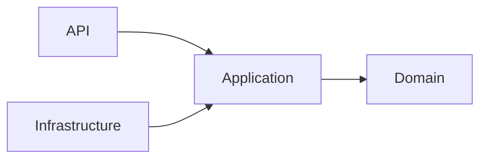
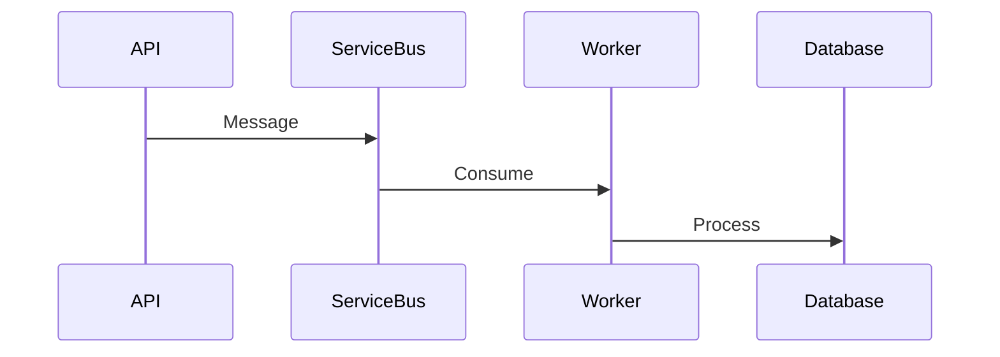

# Daily Knowledge Sharing — 2026-08-17

## Today’s Topics

1. Clean Architecture và Dependency Boundary
2. Domain-Driven Design Aggregate
3. Idempotency trong REST API
4. Optimistic Concurrency EF Core
5. Azure Service Bus
6. Azure Managed Identity
7. Redis Cache Aside Pattern
8. OpenTelemetry Distributed Tracing
9. RAG Architecture cho AI Application
10. Feature Flags trong Continuous Delivery

---

# 1. Clean Architecture và Dependency Boundary

Clean Architecture tổ chức hệ thống để dependency hướng vào business rule. API và Infrastructure là chi tiết bên ngoài.

Ví dụ ASP.NET Core gọi Application layer xử lý Order domain rồi lưu qua EF Core repository.

Production cần tránh leak database model vào domain.

Trade-off: tăng khả năng test và thay đổi nhưng cần nhiều abstraction.

Key takeaway: boundary bảo vệ business logic khỏi framework.

# 2. Domain-Driven Design Aggregate

Aggregate là transaction boundary trong domain. Aggregate Root kiểm soát thay đổi dữ liệu liên quan.

Ví dụ Order quản lý OrderItem thay vì cho phép update trực tiếp.

Sai lầm phổ biến là tạo aggregate quá lớn gây lock và performance issue.

Senior cần chọn boundary dựa trên invariant nghiệp vụ.

# 3. Idempotency trong REST API

Idempotency giúp request chạy lại không tạo kết quả duplicate.

Ví dụ payment API lưu Idempotency-Key trước khi xử lý.

Production cần xử lý retry, timeout và duplicate message.

Trade-off: an toàn hơn nhưng cần storage quản lý trạng thái.

# 4. Optimistic Concurrency EF Core

EF Core dùng concurrency token để phát hiện dữ liệu bị thay đổi trước update.

Ví dụ RowVersion trong SQL Server.

Cần xử lý DbUpdateConcurrencyException thay vì bỏ qua.

# 5. Azure Service Bus

Message broker giúp tách producer và consumer.

Production cần retry, duplicate handling và dead-letter queue.

# 6. Azure Managed Identity

Managed Identity cho phép Azure resource xác thực mà không lưu secret.

Ví dụ App Service truy cập Key Vault bằng token.

Cần thiết kế RBAC tối thiểu.

# 7. Redis Cache Aside Pattern

Application kiểm tra cache trước, nếu miss thì đọc database rồi cập nhật cache.

Cần thiết kế TTL, invalidation và fallback khi Redis lỗi.

Không nên cache dữ liệu nhạy cảm hoặc thay đổi liên tục.

# 8. OpenTelemetry Distributed Tracing

Tracing theo dõi request xuyên nhiều service.

Production kết hợp logs, metrics, traces để điều tra incident.

Senior cần xây observability strategy thay vì chỉ thêm log.

# 9. RAG Architecture cho AI Application

RAG kết hợp vector search với LLM để cung cấp context riêng.

Flow:
Document → Embedding → Vector Search → Context → LLM

Cần chú ý chunking, evaluation, token cost và prompt injection.

# 10. Feature Flags trong Continuous Delivery

Feature flag tách deployment khỏi release.

Ví dụ bật tính năng mới cho nhóm user nhỏ trước khi rollout toàn bộ.

Cần quản lý lifecycle để tránh tạo technical debt.

## Key Takeaways

- Architecture tốt tập trung vào boundary và dependency.
- Production system cần xử lý failure như một điều bình thường.
- Cloud, AI và distributed system đều cần observability và kiểm soát chi phí.
