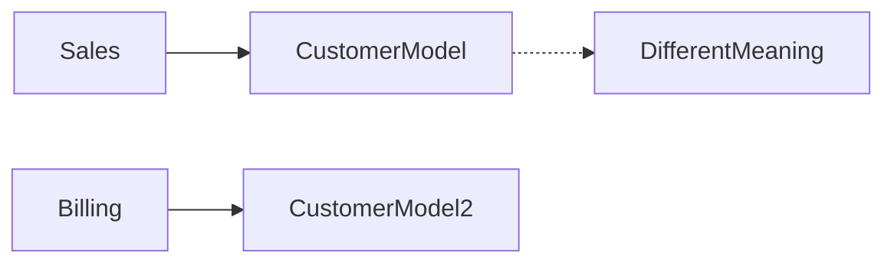
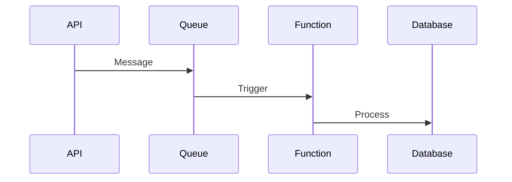

# Daily Knowledge Sharing — 2026-08-18

## Today’s Topics

1. Domain-Driven Design (DDD) và Bounded Context
2. Modular Monolith Architecture
3. OAuth 2.0 và OpenID Connect
4. EF Core Query Performance và N+1 Query
5. Optimistic Concurrency trong Database
6. Azure Functions Production Design
7. Distributed Cache và Cache Invalidation
8. Health Checks và Production Readiness
9. AI Tool Calling trong LLM Application
10. CI/CD Canary Deployment

---

# 1. Domain-Driven Design (DDD) và Bounded Context

## 1. What is it?

DDD là cách thiết kế phần mềm xoay quanh domain nghiệp vụ thay vì xoay quanh database hoặc framework. Bounded Context xác định ranh giới rõ ràng nơi một model có ý nghĩa.

## 2. Why does it exist?

Khi hệ thống lớn, cùng một khái niệm có thể có nhiều ý nghĩa. Ví dụ Customer trong Sales khác Customer trong Billing.

## 3. How does it work?



Mỗi context sở hữu business rule riêng và giao tiếp qua contract.

## 4. Practical example

Trong .NET, Order domain không nên biết trực tiếp bảng SQL mà tập trung vào invariant nghiệp vụ.

## 5. Real production scenario

Hệ thống thương mại điện tử tách Order, Payment, Shipping thành các bounded context.

## 6. Common mistakes

- Chỉ đổi tên folder nhưng không có boundary.
- Tạo entity dùng chung cho toàn hệ thống.

## 7. Trade-offs

Ưu điểm: giảm coupling.

Chi phí: cần hiểu domain sâu hơn.

## 8. Junior → Middle → Senior

Junior hiểu domain model.
Middle thiết kế module.
Senior quyết định boundary chiến lược.

## 9. Key takeaway

DDD không phải là tạo nhiều class, mà là bảo vệ business meaning.

---

# 2. Modular Monolith Architecture

## 1. What is it?

Modular Monolith là ứng dụng chạy chung một deployment nhưng được chia thành các module độc lập.

## 2. Why does it exist?

Microservices giải quyết scale nhưng tạo nhiều vấn đề vận hành. Modular Monolith là bước trung gian.

## 3. How does it work?

```text
Application
 ├── Order Module
 ├── User Module
 └── Payment Module
```

Module giao tiếp qua interface thay vì truy cập database tùy ý.

## 4. Practical example

ASP.NET Core app chia module theo nghiệp vụ thay vì Controller/Service/Repository toàn cục.

## 5. Real production scenario

SaaS startup có thể bắt đầu modular monolith rồi tách service khi cần.

## 6. Common mistakes

- Shared database table giữa mọi module.
- Module phụ thuộc vòng.

## 7. Trade-offs

Đơn giản hơn microservices nhưng vẫn chuẩn bị cho scale.

## 8. Junior → Middle → Senior

Senior cần hiểu module boundary quan trọng hơn deployment boundary.

## 9. Key takeaway

Thiết kế module tốt hôm nay giúp dễ tách service ngày mai.

---

# 3. OAuth 2.0 và OpenID Connect

Authentication trả lời "Bạn là ai?"; Authorization trả lời "Bạn được làm gì?".

OAuth 2.0 cấp quyền truy cập tài nguyên. OpenID Connect thêm lớp xác thực danh tính.

Ví dụ ASP.NET Core sử dụng JWT Bearer token để xác thực API.

Production cần quản lý token lifetime, refresh token, scope và claims.

---

# 4. EF Core Query Performance và N+1 Query

N+1 xảy ra khi lấy danh sách rồi query thêm từng item.

Ví dụ:

```csharp
var orders = await db.Orders.ToListAsync();
foreach(var order in orders)
{
    await db.Entry(order).Collection(x=>x.Items).LoadAsync();
}
```

Giải pháp thường dùng Include, projection và kiểm tra SQL generated.

Trade-off: giảm query nhưng có thể tăng dữ liệu tải.

---

# 5. Optimistic Concurrency

Optimistic concurrency giả định conflict hiếm xảy ra và kiểm tra version trước khi update.

EF Core hỗ trợ concurrency token:

```csharp
[Timestamp]
public byte[] Version {get;set;}
```

Phù hợp cho dữ liệu nhiều người cùng chỉnh sửa.

---

# 6. Azure Functions Production Design

Azure Functions phù hợp cho event-driven workload, background processing và integration.



Cần quan tâm timeout, retry, cold start, monitoring và idempotency.

---

# 7. Distributed Cache và Cache Invalidation

Distributed cache như Redis giúp nhiều instance dùng chung dữ liệu cache.

Flow:

```text
API -> Redis -> Database
```

Production cần TTL, eviction policy, fallback khi Redis unavailable và chiến lược invalidation.

---

# 8. Health Checks và Production Readiness

Health check giúp hệ thống biết service còn hoạt động hay không.

Ví dụ kiểm tra:
- Database connection
- Redis
- External API
- Queue

Cần phân biệt liveness và readiness để tránh restart sai.

---

# 9. AI Tool Calling trong LLM Application

Tool calling cho phép LLM gọi hành động bên ngoài thay vì tự đoán dữ liệu.

```text
User
 ↓
LLM
 ↓
Tool
 ↓
Business API
 ↓
Result
```

AI quyết định intent, code kiểm soát permission và validation.

Production cần chống prompt injection và audit tool execution.

---

# 10. CI/CD Canary Deployment

Canary deployment đưa phiên bản mới tới một phần nhỏ user trước khi rollout toàn bộ.

```text
Users
 ├── 95% Old Version
 └── 5% New Version
```

Cần metrics, rollback strategy và feature isolation.

## Final Takeaways

- Boundary và ownership là nền tảng của hệ thống lớn.
- Production engineering luôn phải nghĩ về failure, monitoring và rollback.
- Cloud và AI cần kết hợp với security, cost và vận hành thực tế.