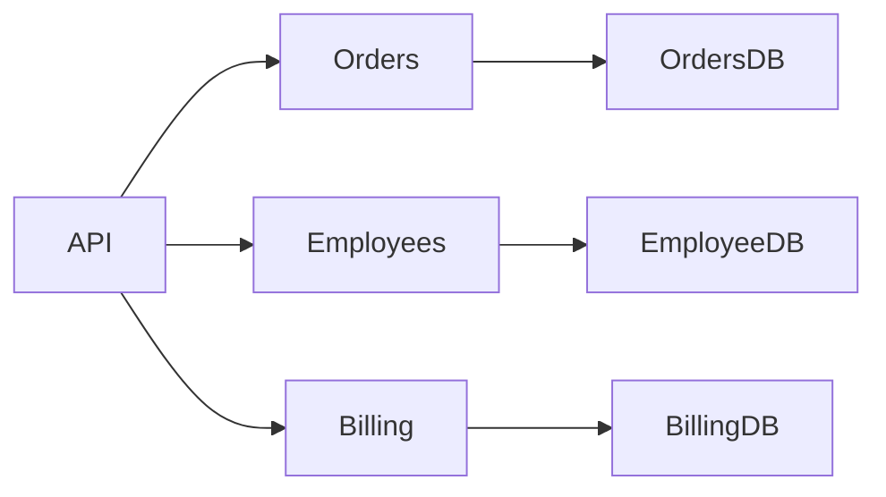
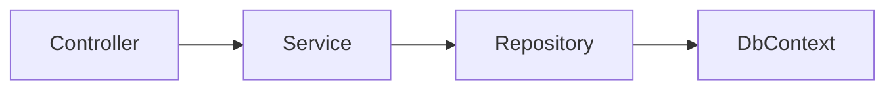
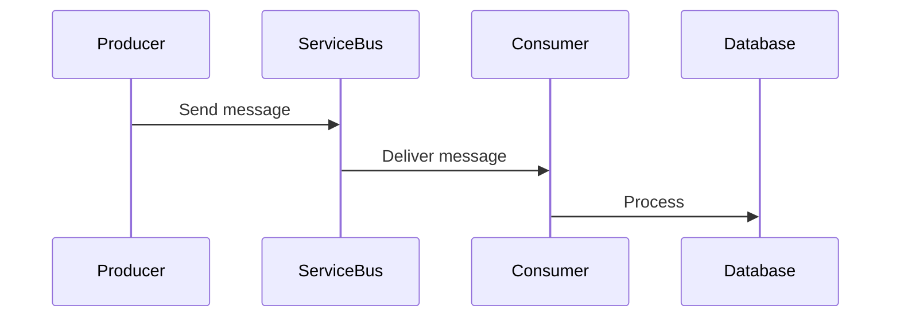
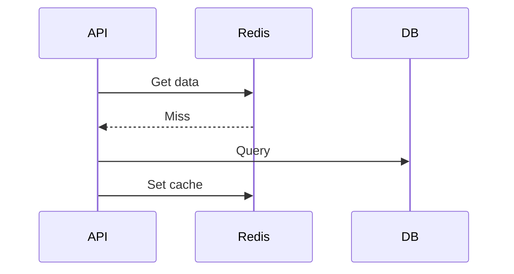
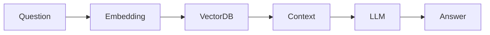

# Daily Knowledge Sharing — 2026-08-18

## Today’s Topics

1. Modular Monolith Architecture
2. Dependency Injection Lifetime Management in ASP.NET Core
3. REST API Idempotency Design
4. SQL Query Optimization with Indexes
5. Azure Service Bus Message Processing
6. Azure Managed Identity
7. Redis Cache Invalidation Strategy
8. OpenTelemetry Distributed Tracing
9. RAG Architecture for AI Applications
10. Feature Flags in Production Release

---

# 1. Modular Monolith Architecture

## 1. What is it?

Modular Monolith là kiến trúc trong đó ứng dụng vẫn được deploy như một hệ thống duy nhất nhưng được chia thành các module có boundary rõ ràng.

Khác với monolith truyền thống, các module không chia sẻ tự do database model, business logic hoặc dependency.

## 2. Why does it exist?

Monolith dễ phát triển ban đầu nhưng thường gặp vấn đề coupling khi hệ thống lớn lên. Microservices giải quyết coupling nhưng tạo thêm distributed complexity.

Modular Monolith nằm giữa hai hướng:

- Giữ đơn giản khi deploy.
- Có boundary giống microservices.
- Cho phép tách module khi cần.

## 3. How does it work?



Mỗi module sở hữu:

- Domain logic.
- Application services.
- Data access.
- Public contract.

## 4. Practical example

Một hệ thống ETM có thể chia:

- Employee module.
- Timesheet module.
- Leave module.
- Approval module.

Timesheet không truy cập trực tiếp bảng Leave.

## 5. Real production scenario

Khi một SaaS tăng từ vài nghìn lên hàng trăm nghìn user, modular boundary giúp team scale theo domain thay vì scale theo codebase.

## 6. Common mistakes

- Chỉ tạo folder nhưng không tạo boundary.
- Shared database model giữa mọi module.
- Dùng module như namespace thay vì architectural boundary.

## 7. Trade-offs

Ưu điểm:
- Đơn giản hơn microservices.
- Dễ refactor.

Rủi ro:
- Cần kỷ luật team.
- Không có isolation như microservices.

## 8. Junior → Middle → Senior

Junior: hiểu module là vùng trách nhiệm.

Middle: thiết kế dependency giữa module.

Senior: quyết định khi nào cần tách service.

## 9. Key takeaway

- Boundary quan trọng hơn số lượng service.
- Modular Monolith là bước đệm tốt trước microservices.

---

# 2. Dependency Injection Lifetime Management

## 1. What is it?

Dependency Injection giúp framework tạo và quản lý dependency thay vì class tự new object.

ASP.NET Core có:

- Transient.
- Scoped.
- Singleton.

## 2. Why does it exist?

Nếu tự tạo dependency, code bị coupling và khó test.

## 3. How does it work?



Scoped thường dùng cho DbContext vì mỗi request có một unit of work.

## 4. Practical example

```csharp
services.AddScoped<IEmployeeService, EmployeeService>();
services.AddSingleton<ICacheService, CacheService>();
```

## 5. Real production scenario

Sai lifetime có thể gây memory leak hoặc DbContext concurrency issue.

## 6. Common mistakes

- Inject Scoped service vào Singleton.
- Singleton chứa state thay đổi.

## 7. Trade-offs

Singleton tiết kiệm tạo object nhưng cần thread-safe.

Scoped an toàn hơn nhưng tạo nhiều instance.

## 8. Junior → Middle → Senior

Junior: biết lifetime.
Middle: debug lifetime issue.
Senior: thiết kế dependency graph.

## 9. Key takeaway

Lifetime là quyết định kiến trúc, không chỉ là syntax.

---

# 3. REST API Idempotency

Idempotency đảm bảo gọi lại cùng một request không tạo ra tác động ngoài ý muốn.

Ví dụ payment API:

```text
POST /payments
Idempotency-Key: abc123
```

Server lưu kết quả của key này và trả lại kết quả cũ khi retry.

Production scenario: payment, order creation, background retry.

Sai lầm:
- Retry POST không có protection.
- Không lưu trạng thái xử lý.

Trade-off:
- Tăng reliability nhưng cần storage và cleanup.

Key takeaway:
- Distributed system luôn cần nghĩ về retry.

---

# 4. SQL Query Optimization with Indexes

Index giúp database tìm dữ liệu nhanh hơn bằng cấu trúc tìm kiếm bổ sung.

Ví dụ:

```sql
CREATE INDEX IX_Employee_Email ON Employee(Email);
```

Cần xem execution plan trước khi thêm index.

Sai lầm:
- Tạo quá nhiều index.
- Không theo dõi write performance.

Senior cần cân bằng read speed và storage cost.

---

# 5. Azure Service Bus Message Processing

Azure Service Bus giúp giao tiếp bất đồng bộ giữa các component.

Flow:



Dùng cho notification, integration, background processing.

Cần xử lý:

- Retry.
- Dead-letter queue.
- Duplicate message.

---

# 6. Azure Managed Identity

Managed Identity cho phép Azure resource authenticate mà không lưu secret.

Ví dụ:

App Service
→ Managed Identity
→ Key Vault
→ Secret

Lợi ích:

- Không hardcode password.
- Rotation tự động.

---

# 7. Redis Cache Invalidation Strategy

Cache giúp giảm tải database nhưng invalidation là phần khó nhất.

Cache Aside:



Không nên cache:

- Permission sensitive data.
- Highly volatile data.

---

# 8. OpenTelemetry Distributed Tracing

OpenTelemetry chuẩn hóa telemetry gồm:

- Logs.
- Metrics.
- Traces.

Ví dụ incident:

API chậm → trace → tìm database call mất 5 giây.

Senior không chỉ xem error log mà xem toàn bộ request lifecycle.

---

# 9. RAG Architecture for AI Applications

RAG kết hợp LLM với knowledge retrieval.

Flow:



Dùng khi AI cần dữ liệu nội bộ.

Cần kiểm soát:

- Prompt injection.
- Data access.
- Token cost.

---

# 10. Feature Flags in Production Release

Feature Flag cho phép bật/tắt tính năng mà không cần deploy lại.

Ứng dụng:

- Canary release.
- A/B testing.
- Gradual rollout.

Sai lầm:

- Không cleanup flag cũ.
- Đưa business rule phức tạp vào flag.

Key takeaway:

Feature flag là công cụ quản lý rủi ro release, không phải thay thế architecture.
