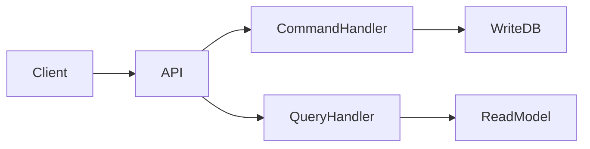
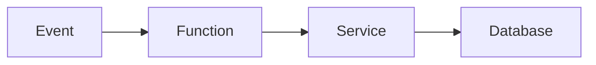
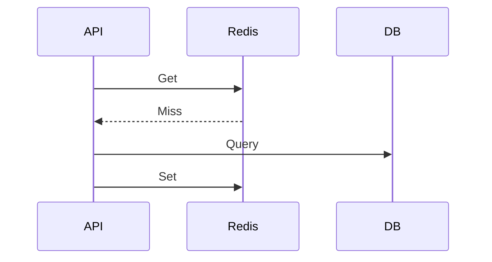
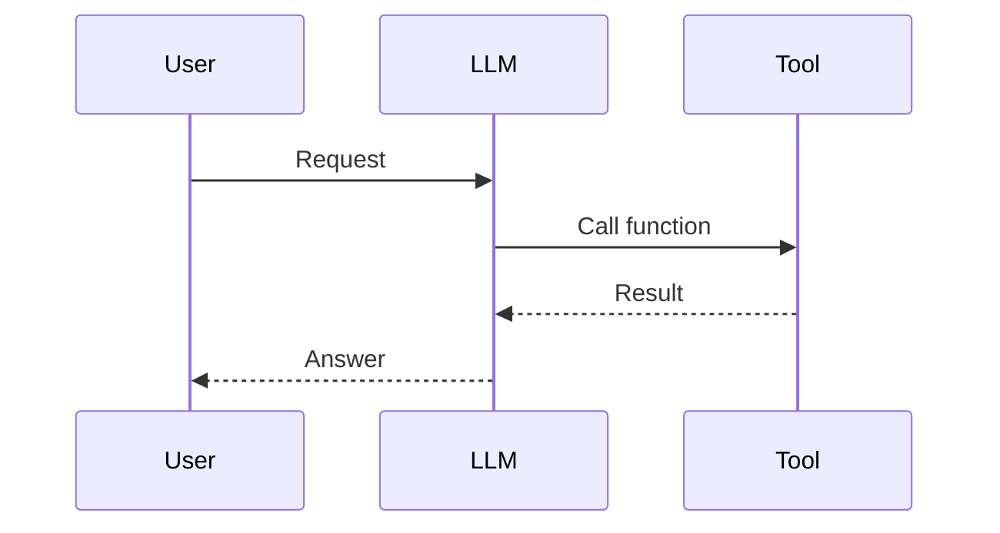

# Daily Knowledge Sharing — 2026-08-18

## Today’s Topics

1. Clean Architecture Dependency Boundaries
2. CQRS trong hệ thống nghiệp vụ
3. API Error Contract Design
4. Optimistic Concurrency với EF Core
5. Azure Functions Production Design
6. Azure Key Vault và Secret Management
7. Redis Cache Aside Pattern
8. Application Insights và Incident Investigation
9. AI Tool Calling Architecture
10. CI/CD Deployment Strategy

---

# 1. Clean Architecture Dependency Boundaries

## 1. What is it?
Clean Architecture tổ chức hệ thống theo dependency hướng vào business rule. Domain không phụ thuộc framework, database hay external service.

## 2. Why does it exist?
Nếu business logic nằm trong controller hoặc database layer, thay đổi công nghệ sẽ ảnh hưởng toàn hệ thống.

## 3. How does it work?

```text
API
 ↓
Application
 ↓
Domain
 ↑
Infrastructure
```

Luồng request đi vào từ ngoài nhưng dependency compile-time hướng vào domain.

## 4. Practical example
ASP.NET Core:

```csharp
public interface IEmployeeRepository
{
    Task<Employee?> GetAsync(int id);
}
```

Domain chỉ biết interface, Infrastructure triển khai EF Core.

## 5. Real production scenario
Hệ thống HR có thể thay SQL Server bằng PostgreSQL mà business rule không đổi.

## 6. Common mistakes
- Chỉ chia folder nhưng dependency vẫn sai.
- Đưa EF Core entity vào Domain.

## 7. Trade-offs
Ưu điểm: dễ test, dễ thay đổi.
Chi phí: nhiều abstraction hơn.

## 8. Junior → Middle → Senior
Junior hiểu layer.
Middle kiểm soát dependency.
Senior quyết định boundary phù hợp.

## 9. Key takeaway
Architecture tốt bảo vệ business rule khỏi thay đổi bên ngoài.

---

# 2. CQRS trong hệ thống nghiệp vụ

## 1. What is it?
CQRS tách Command (thay đổi dữ liệu) và Query (đọc dữ liệu).

## 2. Why does it exist?
Read và write thường có nhu cầu scale khác nhau.

## 3. How does it work?



## 4. Practical example
Order creation dùng command, dashboard dùng query tối ưu riêng.

## 5. Real production scenario
E-commerce có hàng triệu lượt xem sản phẩm nhưng ít thao tác mua hàng.

## 6. Common mistakes
Dùng CQRS cho CRUD đơn giản gây phức tạp.

## 7. Trade-offs
Scale tốt hơn nhưng tăng complexity và eventual consistency.

## 8. Junior → Middle → Senior
Junior hiểu separation.
Middle implement handler.
Senior quyết định có cần CQRS không.

## 9. Key takeaway
CQRS là công cụ giải quyết complexity, không phải mặc định.

---

# 3. API Error Contract Design

API production cần error response ổn định để client xử lý.

Ví dụ:

```json
{"code":"EMPLOYEE_NOT_FOUND","message":"Employee does not exist"}
```

Cần phân biệt validation error, authentication error và system failure.

Sai lầm: trả stack trace ra client.

Trade-off: contract rõ ràng giúp maintain nhưng cần versioning.

Key takeaway: Error là một phần của API design.

---

# 4. Optimistic Concurrency với EF Core

Optimistic concurrency xử lý trường hợp nhiều người cùng sửa một record.

Ví dụ:

```csharp
[Timestamp]
public byte[] RowVersion {get;set;}
```

EF kiểm tra version trước khi update.

Production: chỉnh sửa hồ sơ nhân viên đồng thời.

Sai lầm: bỏ qua conflict handling.

Trade-off: ít lock nhưng cần xử lý retry.

---

# 5. Azure Functions Production Design

Azure Functions phù hợp workload event-driven, scheduled job và integration.

Flow:



Cần quan tâm timeout, retry, idempotency, monitoring.

Không nên dùng cho mọi background job nếu workload chạy liên tục.

---

# 6. Azure Key Vault và Secret Management

Key Vault lưu secret, certificate và key an toàn.

Flow:

```text
App Service
 ↓ Managed Identity
Key Vault
 ↓
Secret
```

Sai lầm: lưu connection string trong source code.

Trade-off: bảo mật cao hơn nhưng cần quản lý access.

---

# 7. Redis Cache Aside Pattern

Cache Aside là pattern phổ biến:



Cần quyết định TTL, invalidation và dữ liệu được cache.

Sai lầm lớn nhất là cache invalidation sai.

---

# 8. Application Insights và Incident Investigation

Observability kết hợp logs, metrics và traces.

Scenario:

API chậm → Trace → Database query 8 giây → tối ưu index.

Sai lầm: chỉ xem exception log.

Senior cần nhìn toàn bộ request lifecycle.

---

# 9. AI Tool Calling Architecture

Tool Calling cho phép LLM gọi chức năng deterministic.



AI quyết định intent, code kiểm soát permission và execution.

Cần bảo vệ prompt injection và dữ liệu nhạy cảm.

---

# 10. CI/CD Deployment Strategy

CI/CD tự động build, test và deploy.

Production nên có:

- Automated test.
- Approval.
- Rollback strategy.
- Monitoring sau release.

Blue-green và canary giúp giảm rủi ro.

Sai lầm: deploy nhanh nhưng không có rollback.

Key takeaway: Deployment là một phần của engineering reliability.
