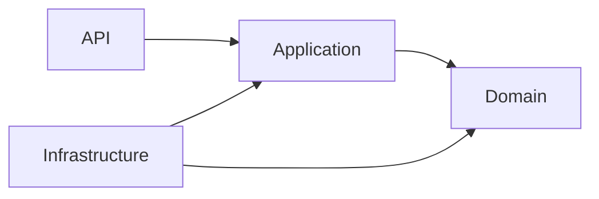
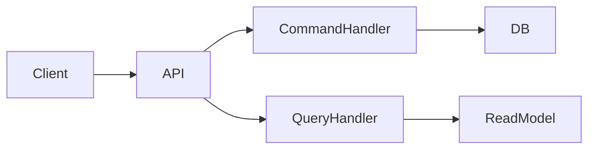
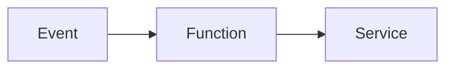
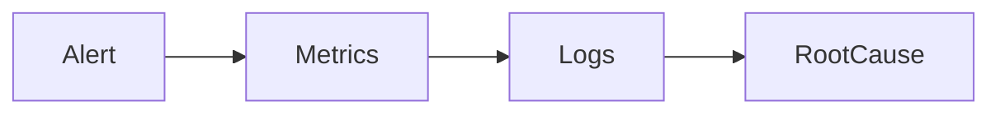
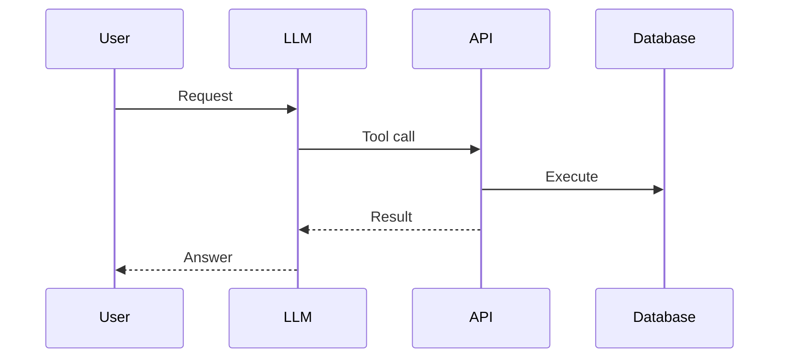

# Daily Knowledge Sharing — 2026-08-18

## Today’s Topics

1. Clean Architecture Dependency Boundaries
2. CQRS Command and Query Separation
3. OAuth 2.0 and OpenID Connect Flow
4. EF Core Optimistic Concurrency
5. Azure Functions Hosting Decisions
6. Azure Key Vault Secret Management
7. HTTP Response Caching Strategy
8. Production Incident Investigation with Metrics and Logs
9. AI Function Calling Architecture
10. CI/CD Canary Deployment Strategy

---

# 1. Clean Architecture Dependency Boundaries

## 1. What is it?
Clean Architecture tổ chức hệ thống theo layer với dependency hướng vào business rules.

## 2. Why does it exist?
Giúp domain logic không bị phụ thuộc framework, database hoặc external service.

## 3. How does it work?



Domain không biết EF Core, SQL hay Azure.

## 4. Practical example
ASP.NET Core API gọi Application service, service xử lý use case và repository lấy dữ liệu.

## 5. Production scenario
Hệ thống SaaS cần thay SQL Server bằng PostgreSQL mà không thay đổi business logic.

## 6. Common mistakes
- Tạo quá nhiều layer nhưng không có boundary.
- Đưa business rule vào controller.

## 7. Trade-offs
Ưu điểm: dễ test, dễ thay đổi.
Rủi ro: nhiều abstraction hơn.

## 8. Junior → Middle → Senior
Junior hiểu trách nhiệm layer. Middle thiết kế dependency. Senior quyết định boundary.

## 9. Key takeaway
Architecture tốt là quản lý dependency, không phải tạo nhiều folder.

---

# 2. CQRS Command and Query Separation

CQRS tách thao tác thay đổi dữ liệu và đọc dữ liệu.

Ví dụ:
- Command: CreateOrder.
- Query: GetOrderDetail.

Flow:



Production: hệ thống có nhiều read request nhưng ít write request.

Sai lầm: dùng CQRS cho CRUD đơn giản.

Trade-off: scalability cao hơn nhưng complexity tăng.

Key takeaway: CQRS giải quyết sự khác biệt giữa read và write workload.

---

# 3. OAuth 2.0 và OpenID Connect

OAuth 2.0 giải quyết authorization, OIDC thêm authentication.

Authentication trả lời: Ai là bạn?
Authorization trả lời: Bạn được làm gì?

Ví dụ ASP.NET Core dùng Microsoft Entra ID để validate token.

Sai lầm:
- Lưu access token không an toàn.
- Không kiểm tra scope/claim.

Trade-off: bảo mật tốt hơn nhưng flow phức tạp hơn.

---

# 4. EF Core Optimistic Concurrency

Optimistic concurrency phát hiện conflict khi nhiều user cập nhật cùng dữ liệu.

Ví dụ dùng RowVersion:

```csharp
[Timestamp]
public byte[] RowVersion { get; set; }
```

Nếu dữ liệu đã thay đổi, EF Core throw concurrency exception.

Production: chỉnh sửa hồ sơ nhân viên đồng thời.

Sai lầm: ghi đè dữ liệu người khác.

Key takeaway: concurrency phải được thiết kế, không xử lý sau khi lỗi xảy ra.

---

# 5. Azure Functions Hosting Decisions

Azure Functions phù hợp cho event-driven workload.

Flow:



Dùng cho queue processing, timer job, file trigger.

So sánh:
- App Service: API luôn chạy.
- Functions: chạy khi có event.
- Container Apps: workload container linh hoạt.

Sai lầm: dùng Functions cho long-running task không phù hợp.

---

# 6. Azure Key Vault Secret Management

Key Vault lưu secret, certificate, key tập trung.

Flow:

App Service → Managed Identity → Key Vault

Không hardcode connection string.

Production: quản lý database password, API key.

Sai lầm: lưu secret trong config repository.

---

# 7. HTTP Response Caching Strategy

HTTP caching giảm request tới backend.

Ví dụ:

```http
Cache-Control: max-age=300
```

Có thể dùng browser cache, CDN hoặc reverse proxy.

Sai lầm: cache dữ liệu thay đổi thường xuyên hoặc dữ liệu riêng tư.

Trade-off: performance cao hơn nhưng cần quản lý invalidation.

---

# 8. Production Incident Investigation

Điều tra production cần kết hợp:

- Logs.
- Metrics.
- Traces.

Flow:



Ví dụ API chậm: metric CPU bình thường nhưng trace cho thấy SQL query mất 8 giây.

Senior cần tìm nguyên nhân thay vì chỉ restart service.

---

# 9. AI Function Calling Architecture

Function calling cho phép LLM gọi tool do hệ thống cung cấp.

Flow:



Deterministic code phải kiểm soát permission và validation.

Sai lầm: cho AI quyền quá rộng.

---

# 10. CI/CD Canary Deployment Strategy

Canary deployment đưa version mới tới một nhóm nhỏ user trước.

Flow:

```text
Users
 |
Gateway
 |---- Version A
 |---- Version B (small traffic)
```

Production cần monitor error rate, latency trước khi mở rộng.

Sai lầm: rollout nhanh mà không có rollback.

Key takeaway: deployment strategy là quản lý rủi ro thay đổi.
