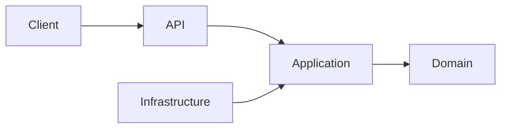
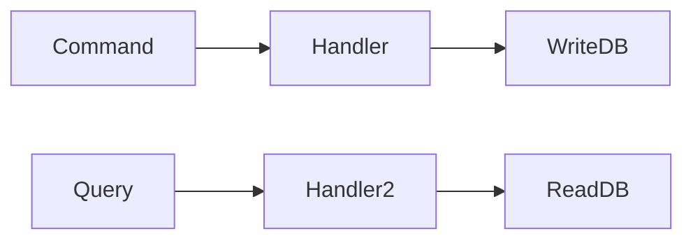
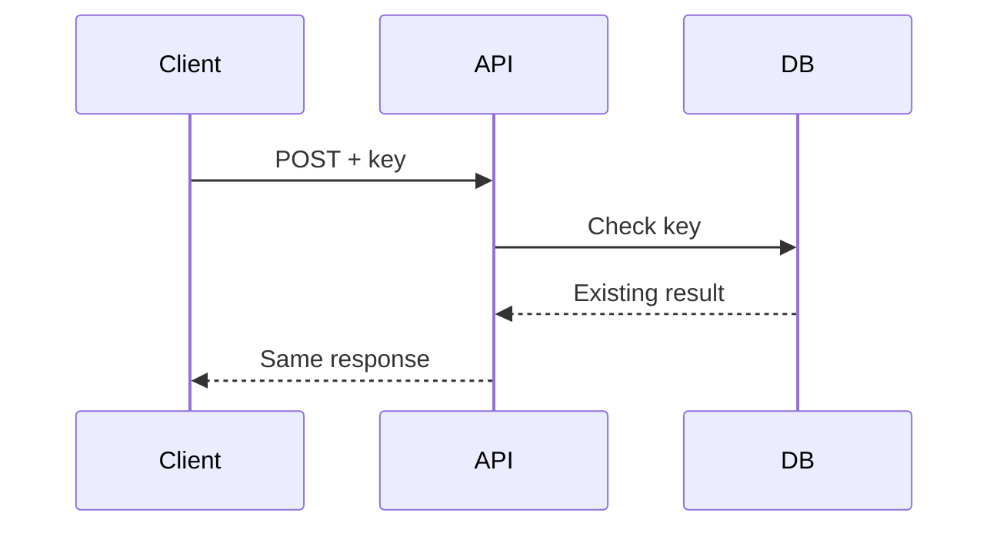
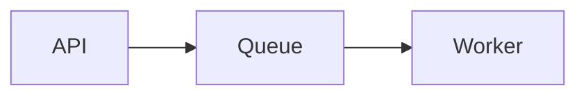
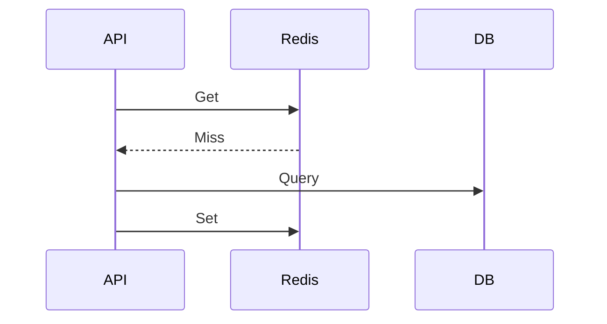
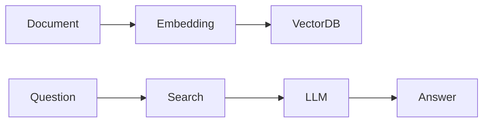

# Daily Knowledge Sharing — 2026-08-18

## Today’s Topics

1. Clean Architecture và ranh giới dependency
2. CQRS trong hệ thống thực tế
3. Idempotency cho REST API
4. Optimistic Concurrency trong EF Core
5. Azure Service Bus và xử lý bất đồng bộ
6. Managed Identity trên Azure
7. Redis Cache Aside Pattern
8. OpenTelemetry và Distributed Tracing
9. RAG Pipeline cho ứng dụng AI
10. Feature Flags trong Continuous Delivery

---

# 1. Clean Architecture và ranh giới dependency

## 1. What is it?
Clean Architecture là cách tổ chức hệ thống dựa trên nguyên tắc dependency chỉ được hướng vào business rule. Domain không phụ thuộc database, framework hay UI.

Cấu trúc thường gặp:

```text
API
 |
Application
 |
Domain
 ^
 |
Infrastructure
```

## 2. Why does it exist?
Nếu business logic nằm chung với Controller, EF Core hoặc external service, thay đổi công nghệ sẽ kéo theo sửa toàn hệ thống.

## 3. How does it work?
Request đi từ API vào Application use case. Application gọi Domain xử lý nghiệp vụ và dùng abstraction để truy cập Infrastructure.



## 4. Practical example
ASP.NET Core:

```csharp
public interface IEmployeeRepository
{
    Task<Employee?> GetAsync(Guid id);
}
```

Domain chỉ biết interface, không biết SQL Server.

## 5. Real production scenario
Trong hệ thống quản lý nhân sự, thay Exchange Online bằng Graph API mới không ảnh hưởng domain.

## 6. Common mistakes
- Tạo folder nhiều nhưng dependency vẫn sai.
- Đưa EF Entity vào Domain.
- Tạo abstraction không có lý do.

## 7. Trade-offs
Ưu điểm: dễ test, dễ thay đổi.

Chi phí: nhiều layer, cần kỷ luật thiết kế.

## 8. Junior → Middle → Senior
Junior hiểu separation.
Middle thiết kế dependency đúng.
Senior quyết định boundary phù hợp.

## 9. Key takeaway
Architecture tốt không phải nhiều folder, mà là kiểm soát dependency.

---

# 2. CQRS trong hệ thống thực tế

## 1. What is it?
CQRS tách thao tác đọc và ghi thành hai mô hình khác nhau.

## 2. Why does it exist?
Một model vừa tối ưu query vừa xử lý business transaction thường trở nên phức tạp.

## 3. How does it work?



## 4. Practical example
.NET MediatR:

```csharp
public record CreateOrderCommand(int ProductId): IRequest<Guid>;
```

## 5. Production scenario
E-commerce có hàng triệu lượt xem sản phẩm nhưng ít thao tác đặt hàng.

## 6. Common mistakes
Áp dụng CQRS cho CRUD nhỏ làm tăng complexity.

## 7. Trade-offs
Đổi simplicity lấy scalability và separation.

## 8. Levels
Junior hiểu command/query.
Middle triển khai handler.
Senior quyết định khi nào cần CQRS.

## 9. Key takeaway
CQRS là công cụ giải quyết complexity, không phải mặc định cho mọi API.

---

# 3. Idempotency cho REST API

## 1. What is it?
Một request gửi nhiều lần nhưng kết quả cuối cùng giống nhau.

## 2. Why?
Network retry có thể khiến payment hoặc order bị tạo trùng.

## 3. How?
Client gửi idempotency key, server lưu trạng thái xử lý.



## 4. Example
Payment API lưu `PaymentRequestId` unique.

## 5. Production
Thanh toán, webhook, message consumer.

## 6. Mistakes
Không đặt unique constraint, retry vô hạn.

## 7. Trade-offs
Tăng reliability nhưng cần storage trạng thái.

## 8. Levels
Junior hiểu duplicate request.
Middle implement middleware.
Senior thiết kế consistency.

## 9. Key takeaway
Distributed system luôn cần nghĩ đến duplicate execution.

---

# 4. Optimistic Concurrency trong EF Core

## 1. What is it?
Cho phép nhiều user đọc cùng dữ liệu và phát hiện conflict khi update.

## 2. Why?
Tránh lock database quá lâu.

## 3. How?
Dùng RowVersion.

```csharp
public byte[] RowVersion {get;set;}
```

## 4. Example
Hai manager sửa employee record, người cập nhật sau nhận conflict.

## 5. Production
Timesheet, approval workflow.

## 6. Mistakes
Không xử lý DbUpdateConcurrencyException.

## 7. Trade-offs
Scalable hơn nhưng cần conflict handling.

## 8. Levels
Junior biết exception.
Middle xử lý retry.
Senior chọn concurrency strategy.

## 9. Key takeaway
Concurrency là business decision, không chỉ database setting.

---

# 5. Azure Service Bus và xử lý bất đồng bộ

Azure Service Bus giúp tách producer và consumer.



Dùng cho email, file processing, integration event.

Ví dụ:
`SendEmailCommand` đưa vào queue, worker xử lý nền.

Sai lầm: không xử lý dead letter queue, không idempotent consumer.

Trade-off: reliability cao hơn nhưng debugging phức tạp hơn.

Junior hiểu queue. Middle triển khai consumer. Senior thiết kế message architecture.

Key takeaway: Queue giúp hệ thống chịu tải và lỗi tốt hơn.

---

# 6. Managed Identity trên Azure

Managed Identity cho phép Azure resource tự xác thực mà không lưu secret.

Ví dụ App Service truy cập Key Vault:

```text
App Service -> Managed Identity -> Key Vault
```

Ưu điểm: giảm secret leakage.

Rủi ro: phân quyền sai RBAC.

Senior cần thiết kế least privilege.

---

# 7. Redis Cache Aside Pattern

Cache Aside là ứng dụng tự quản lý cache.



Dùng cho product catalog, configuration.

Không cache dữ liệu thay đổi liên tục hoặc dữ liệu nhạy cảm.

Trade-off: nhanh hơn nhưng invalidation khó.

---

# 8. OpenTelemetry và Distributed Tracing

## What is it?
Chuẩn thu thập logs, metrics, traces.

## Why?
Production issue không thể debug chỉ bằng log.

Ví dụ request:

```text
API -> Service A -> Service B -> Database
```

Trace giúp biết service nào chậm.

Mistakes: thiếu correlation id, trace quá nhiều gây cost.

Senior cần thiết kế observability strategy.

---

# 9. RAG Pipeline cho ứng dụng AI

RAG kết hợp LLM với dữ liệu riêng.

Flow:



Ví dụ chatbot hỏi tài liệu công ty.

Cần kiểm soát chunking, security, token cost.

Junior hiểu retrieval.
Middle xây pipeline.
Senior thiết kế evaluation và governance.

---

# 10. Feature Flags trong Continuous Delivery

Feature Flag cho phép bật/tắt tính năng mà không deploy lại.

Ví dụ:

```csharp
if(feature.IsEnabled("NewApproval"))
{
    UseNewFlow();
}
```

Production dùng để canary release, A/B testing.

Sai lầm: flag tồn tại mãi, thiếu ownership.

Trade-off: release an toàn hơn nhưng tăng complexity.

Key takeaway: Feature flag là công cụ quản trị rủi ro khi release.
