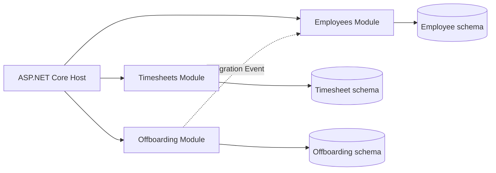
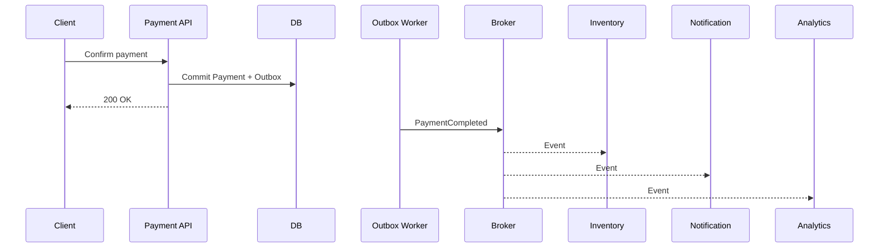
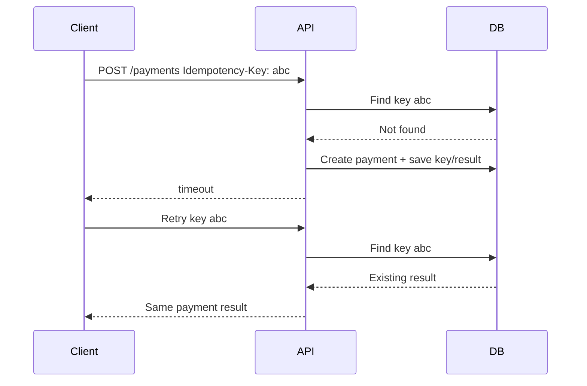
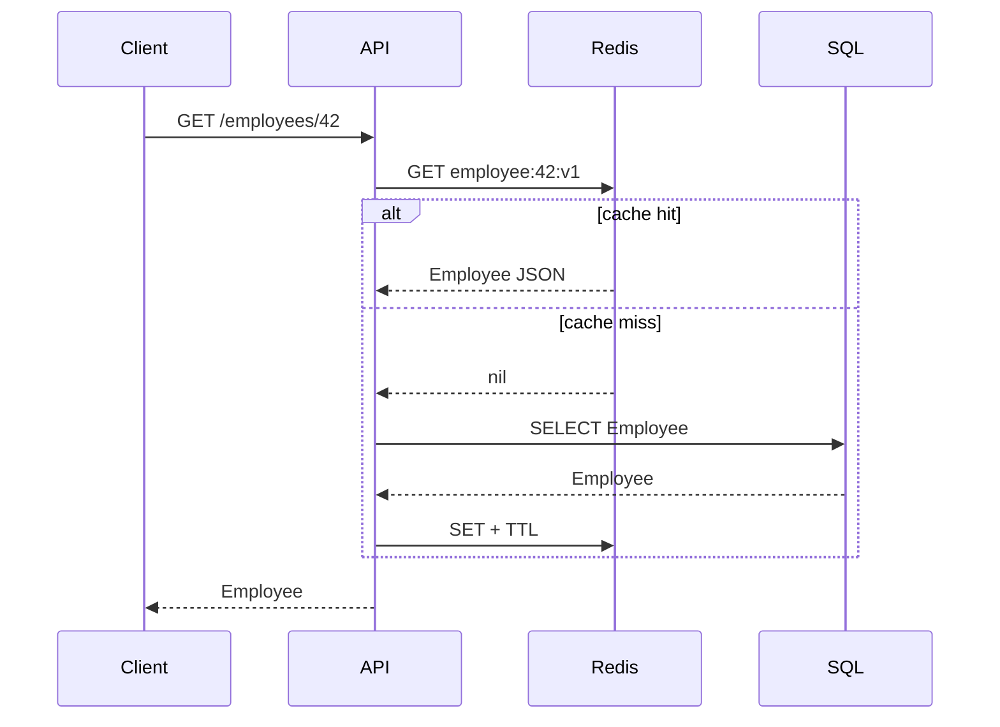
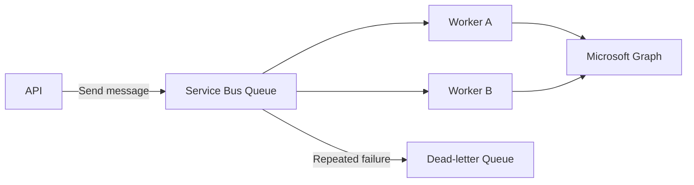
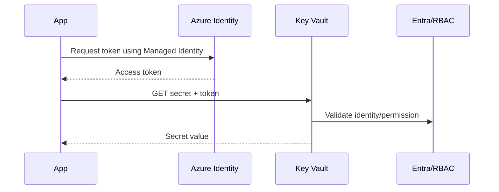
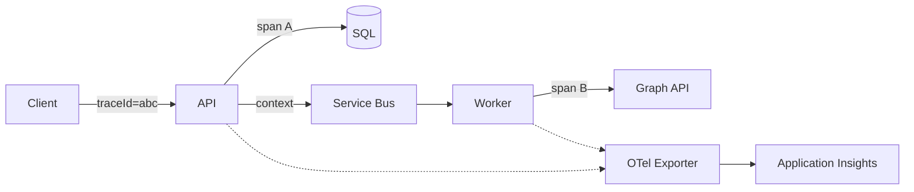
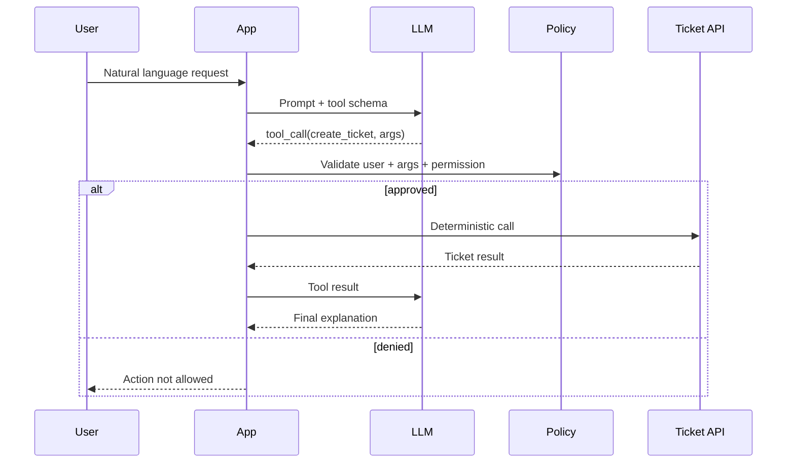
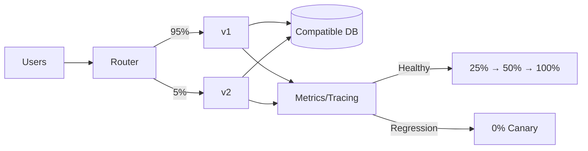

# Daily Knowledge Sharing — 2026-08-18

## Today’s Topics

1. Modular Monolith — chia boundary đúng trước khi nghĩ tới Microservices
2. Event-Driven Architecture — tách side effect bằng event nhưng vẫn kiểm soát consistency
3. Idempotency — chống xử lý trùng trong API và distributed systems
4. Optimistic Concurrency với EF Core — ngăn lost update mà không khóa dài
5. Cache Aside với Redis — tăng tốc read path và xử lý cache failure đúng cách
6. Azure Service Bus — message broker cho background processing đáng tin cậy
7. Managed Identity + Azure Key Vault — loại bỏ secret khỏi application configuration
8. OpenTelemetry và Distributed Tracing — theo dấu request xuyên nhiều service
9. Structured Output + Tool Calling cho LLM — để AI đề xuất, code deterministic kiểm soát hành động
10. Canary Deployment + Feature Flags — giảm blast radius khi release production

---

# 1. Modular Monolith — chia boundary đúng trước khi nghĩ tới Microservices

### 1. What is it?

Modular Monolith vẫn là **một deployable application**, nhưng bên trong được chia thành các module nghiệp vụ có boundary rõ ràng. Điểm quan trọng không phải là tạo nhiều project/folder, mà là giới hạn dependency và ownership của data.

Ví dụ một hệ thống HR có thể có `Employees`, `Timesheets`, `Offboarding`, `Notifications`. `Timesheets` không nên query trực tiếp table nội bộ của `Offboarding`; nó giao tiếp qua public contract hoặc event.

### 2. Why does it exist?

Một monolith không có boundary thường dần thành “big ball of mud”: service gọi chéo nhau, table bị dùng bởi mọi module, thay đổi một business rule kéo theo regression ở nhiều nơi. Microservices giải quyết một số vấn đề boundary nhưng mang thêm network failure, deployment orchestration, distributed tracing và eventual consistency.

Modular Monolith cho phép thiết kế boundary trước mà chưa phải trả chi phí vận hành của distributed system.

### 3. How does it work?



Mỗi module nên sở hữu use case, domain logic và persistence của nó. Host chủ yếu làm composition root: authentication, middleware, DI và route registration.

Dependency nên đi qua contract được chủ động công bố, không qua implementation class hoặc DbSet của module khác.

### 4. Practical example

```csharp
public interface IEmployeeDirectory
{
    Task<EmployeeSummary?> GetAsync(Guid employeeId, CancellationToken ct);
}

internal sealed class EmployeeDirectory(EmployeeDbContext db)
    : IEmployeeDirectory
{
    public Task<EmployeeSummary?> GetAsync(Guid id, CancellationToken ct) =>
        db.Employees
          .Where(x => x.Id == id)
          .Select(x => new EmployeeSummary(x.Id, x.Email, x.Status))
          .SingleOrDefaultAsync(ct);
}
```

`Timesheets` nhận `IEmployeeDirectory`; nó không được inject `EmployeeDbContext`.

### 5. Real production scenario

Khi employee chuyển Inactive, Offboarding lưu configuration và phát `EmployeeDeactivated`. Notifications tạo email; Timesheets khóa submission; Employee module cập nhật trạng thái. Nếu mọi logic nằm trong một controller transaction khổng lồ, một lỗi gửi email có thể làm rollback thay đổi nghiệp vụ chính.

### 6. Common mistakes

- Chia 20 project nhưng tất cả cùng dùng một `DbContext` và gọi implementation chéo nhau.
- Dùng shared library chứa toàn bộ domain model, làm mất ownership.
- Module A update trực tiếp table của module B.
- Tạo abstraction cho mọi class dù không có boundary thực sự.
- Ép mọi giao tiếp thành message asynchronous dù call nội bộ synchronous đơn giản là đủ.

### 7. Trade-offs

**Advantages:** deployment đơn giản, transaction local dễ hơn, debugging dễ, boundary tốt và có đường nâng cấp sang service riêng.

**Costs / Risks:** process vẫn scale cùng nhau; lỗi memory/process có thể ảnh hưởng toàn app; discipline phải được enforce bằng architecture tests/code review thay vì network boundary.

### 8. Junior → Middle → Senior understanding

**Junior:** hiểu module là business boundary, không chỉ folder.

**Middle:** biết thiết kế contract, DI, data ownership và tránh dependency vòng.

**Senior / Technical Lead:** quyết định module boundary theo business capability, đánh giá module nào thực sự cần tách service dựa trên scaling, ownership, deployment và reliability thay vì theo xu hướng.

### 9. Key takeaway

- Modular Monolith là monolith có boundary, không phải microservices đặt chung repo.
- Data ownership quan trọng hơn folder structure.
- Tách service chỉ khi có lý do vận hành hoặc tổ chức đủ mạnh.

---

# 2. Event-Driven Architecture — tách side effect nhưng vẫn kiểm soát consistency

### 1. What is it?

Event-Driven Architecture (EDA) tổ chức một phần hệ thống quanh việc producer phát ra sự kiện đã xảy ra, ví dụ `OrderPaid`, và consumer phản ứng độc lập. Event mô tả **fact trong quá khứ**, không phải lời gọi RPC trá hình.

### 2. Why does it exist?

Nếu `PaymentService` phải gọi trực tiếp Inventory, Email, Analytics và Loyalty thì latency cộng dồn và availability bị coupling: Email down có thể khiến payment request fail. Event cho phép payment hoàn thành transaction cốt lõi rồi downstream xử lý độc lập.

### 3. How does it work?



Để tránh “DB commit thành công nhưng publish message thất bại”, production thường dùng **Transactional Outbox**: business change và outbox row commit trong cùng local transaction; worker publish sau.

### 4. Practical example

```csharp
await using var tx = await db.Database.BeginTransactionAsync(ct);

payment.MarkCompleted();
db.OutboxMessages.Add(new OutboxMessage(
    Guid.NewGuid(),
    "PaymentCompleted",
    JsonSerializer.Serialize(new { payment.Id, payment.OrderId })));

await db.SaveChangesAsync(ct);
await tx.CommitAsync(ct);
```

Consumer vẫn phải idempotent vì broker có thể redeliver.

### 5. Real production scenario

Trong e-commerce, checkout trả kết quả ngay sau khi payment được xác nhận. Email receipt và analytics không nằm trên critical request path. Nếu notification service down 20 phút, message tồn tại trong broker và được xử lý sau thay vì làm payment thất bại.

### 6. Common mistakes

- Publish message trước DB commit.
- Tin rằng message broker đảm bảo “exactly once” cho toàn business flow.
- Event schema chứa toàn bộ entity khiến producer/consumer coupling.
- Không version contract.
- Không có dead-letter queue, retry policy hoặc correlation ID.
- Dùng EDA cho mọi thao tác CRUD đơn giản.

### 7. Trade-offs

**Advantages:** giảm temporal coupling, scale consumer độc lập, hấp thụ traffic spike và tăng resilience.

**Costs / Risks:** eventual consistency, duplicate/out-of-order message, khó trace hơn, cần schema governance và operational tooling.

### 8. Junior → Middle → Senior understanding

**Junior:** phân biệt command với event và hiểu producer/consumer.

**Middle:** implement consumer idempotent, retry, DLQ, outbox và correlation.

**Senior / Technical Lead:** xác định consistency boundary, failure semantics, event contract ownership và quyết định khi synchronous call đơn giản hơn EDA.

### 9. Key takeaway

- Event nói “đã xảy ra”, không nói “hãy làm”.
- At-least-once delivery đòi hỏi consumer idempotent.
- Outbox giải quyết dual-write giữa database và broker.

---

# 3. Idempotency — chống xử lý trùng trong API và distributed systems

### 1. What is it?

Một operation idempotent có thể được gửi lại nhiều lần nhưng business effect cuối cùng tương đương một lần. `GET` tự nhiên thường idempotent; `POST /payments` thì không nếu mỗi retry tạo payment mới.

### 2. Why does it exist?

Distributed system không thể luôn biết request trước thành công hay chưa. Client timeout có thể xảy ra **sau khi server đã commit**. Retry mù có thể tạo hai đơn hàng, charge hai lần hoặc enqueue hai job.

### 3. How does it work?



Key phải gắn với caller + operation và thường lưu request fingerprint để phát hiện cùng key nhưng payload khác.

### 4. Practical example

```csharp
public sealed class IdempotencyRecord
{
    public required string Key { get; init; }
    public required string RequestHash { get; init; }
    public required string ResponseJson { get; set; }
    public DateTimeOffset ExpiresAt { get; init; }
}
```

Database nên có unique constraint, ví dụ:

```sql
CREATE UNIQUE INDEX UX_Idempotency_Client_Key
ON IdempotencyRecords(ClientId, [Key]);
```

Chỉ `if (!exists) insert` trong application code là chưa đủ vì hai request concurrent có thể cùng thấy “not found”.

### 5. Real production scenario

Mobile app gọi API tạo timesheet rồi mất mạng. Người dùng bấm Submit lần nữa. Cùng idempotency key giúp backend trả lại submission cũ thay vì tạo duplicate workflow và gửi hai notification.

### 6. Common mistakes

- Chỉ check key trong Redis nhưng không có atomicity phù hợp với business commit.
- Không unique index.
- Reuse cùng key cho payload khác.
- Lưu key mãi mãi mà không có retention policy.
- Cho retry của failed validation trả một cached success không tương thích.
- Nghĩ idempotency thay thế transaction.

### 7. Trade-offs

**Advantages:** retry an toàn, UX tốt hơn, chống duplicate side effect.

**Costs / Risks:** thêm storage, cleanup, transaction design và semantics cho response đang processing/failed.

### 8. Junior → Middle → Senior understanding

**Junior:** hiểu retry có thể tạo duplicate.

**Middle:** implement key, unique constraint, request hash và response replay.

**Senior / Technical Lead:** xác định idempotency boundary, retention, concurrency semantics và phối hợp với message deduplication/outbox.

### 9. Key takeaway

- Timeout không đồng nghĩa server chưa xử lý.
- Idempotency phải được enforce atomically.
- Business operation có side effect cần retry thì phải nghĩ tới duplicate ngay từ thiết kế.

---

# 4. Optimistic Concurrency với EF Core — ngăn lost update mà không khóa dài

### 1. What is it?

Optimistic Concurrency giả định conflict không xảy ra thường xuyên. Thay vì giữ lock từ lúc đọc đến lúc ghi, application lưu một concurrency token và chỉ update nếu token vẫn giống phiên bản đã đọc.

### 2. Why does it exist?

Hai admin cùng mở Employee A. Admin 1 đổi department; Admin 2 dùng dữ liệu cũ đổi manager. Nếu UPDATE ghi toàn row mà không kiểm tra version, thay đổi của Admin 1 có thể bị ghi đè âm thầm — **lost update**.

### 3. How does it work?

Với SQL Server `rowversion`, EF Core sinh điều kiện tương tự:

```sql
UPDATE Employees
SET ManagerId = @manager
WHERE Id = @id AND RowVersion = @originalRowVersion;
```

Nếu 0 row affected, EF Core ném `DbUpdateConcurrencyException`.

### 4. Practical example

```csharp
public sealed class Employee
{
    public Guid Id { get; set; }
    public string Name { get; set; } = null!;

    [Timestamp]
    public byte[] RowVersion { get; set; } = null!;
}
```

```csharp
try
{
    await db.SaveChangesAsync(ct);
}
catch (DbUpdateConcurrencyException)
{
    return Results.Conflict(new
    {
        code = "employee_changed",
        message = "Employee was modified by another user. Reload and retry."
    });
}
```

API có thể expose version qua DTO/ETag để client gửi lại khi update.

### 5. Real production scenario

Trong employee administration portal, HR và manager cùng sửa một employee. Thay vì “last writer wins” âm thầm, backend trả `409 Conflict`, UI reload current data và cho người dùng quyết định merge.

### 6. Common mistakes

- Catch `DbUpdateConcurrencyException` rồi retry tự động bằng dữ liệu cũ.
- Chỉ thêm `RowVersion` vào entity nhưng không gửi version từ client cho disconnected workflow.
- Trả 500 thay vì conflict có ý nghĩa.
- Dùng pessimistic lock cho form người dùng mở nhiều phút.
- Merge field tự động mà không hiểu business semantics.

### 7. Trade-offs

**Advantages:** không giữ lock dài, throughput tốt khi conflict hiếm.

**Costs / Risks:** application phải xử lý conflict; UX phức tạp hơn; nếu conflict thường xuyên, retry/merge có thể đắt.

### 8. Junior → Middle → Senior understanding

**Junior:** hiểu lost update và version check.

**Middle:** cấu hình EF Core token, map 409, xử lý disconnected client.

**Senior / Technical Lead:** quyết định optimistic vs pessimistic concurrency dựa trên contention, criticality và workflow; thiết kế merge semantics theo domain.

### 9. Key takeaway

- Transaction isolation không tự động giải quyết mọi lost update của long-running user workflow.
- Concurrency conflict là business condition, không nhất thiết là server error.
- Không retry conflict một cách mù quáng.

---

# 5. Cache Aside với Redis — tăng tốc read path và xử lý cache failure đúng cách

### 1. What is it?

Cache Aside là pattern application tự quản lý cache: đọc Redis trước; miss thì đọc database và populate cache. Database vẫn là source of truth.

### 2. Why does it exist?

Một endpoint đọc product/employee reference data hàng nghìn lần nhưng dữ liệu thay đổi ít. Nếu mọi request đều hit SQL, DB chịu load không cần thiết và latency tăng.

### 3. How does it work?



Write thường update database trước rồi invalidate cache. TTL là safety net, không phải chiến lược consistency duy nhất.

### 4. Practical example

```csharp
var key = $"employee:{id}:v1";
var cached = await cache.GetStringAsync(key, ct);
if (cached is not null)
    return JsonSerializer.Deserialize<EmployeeDto>(cached)!;

var employee = await db.Employees
    .AsNoTracking()
    .Where(x => x.Id == id)
    .Select(x => new EmployeeDto(x.Id, x.Name, x.Status))
    .SingleAsync(ct);

await cache.SetStringAsync(
    key,
    JsonSerializer.Serialize(employee),
    new DistributedCacheEntryOptions
    {
        AbsoluteExpirationRelativeToNow = TimeSpan.FromMinutes(5)
    }, ct);

return employee;
```

### 5. Real production scenario

SaaS có endpoint đọc tenant configuration trên hầu hết request. Cache Redis giảm SQL QPS mạnh. Nếu Redis unavailable, API có thể fallback database với timeout ngắn và circuit breaker, nhưng cần tránh hàng nghìn request cùng đổ vào DB gây cascading failure.

### 6. Common mistakes

- Cache dữ liệu nhạy cảm mà key không tách tenant/user.
- TTL quá dài cho dữ liệu cần consistency cao.
- Update DB nhưng quên invalidate.
- Cache null/error vô thời hạn.
- Không chống cache stampede khi hot key expire.
- Redis chậm nhưng timeout dài hơn cả API SLO.

### 7. Trade-offs

**Advantages:** latency thấp, giảm DB load, scale read-heavy workload.

**Costs / Risks:** stale data, invalidation complexity, thêm dependency và memory cost.

### 8. Junior → Middle → Senior understanding

**Junior:** hiểu hit, miss, TTL và source of truth.

**Middle:** implement serialization, invalidation, fallback, metrics hit ratio.

**Senior / Technical Lead:** thiết kế consistency model, stampede protection, failure mode khi Redis down, memory sizing và key/version strategy.

### 9. Key takeaway

- Cache là bản sao tối ưu hóa, không phải source of truth mặc định.
- Invalidation và failure behavior phải được thiết kế trước khi bật cache.
- Đo hit ratio và DB load; đừng cache theo cảm giác.

---

# 6. Azure Service Bus — message broker cho background processing đáng tin cậy

### 1. What is it?

Azure Service Bus là managed message broker hỗ trợ Queue và Topic/Subscription, phù hợp cho enterprise messaging cần retry, dead-letter, lock, duplicate detection, sessions và delivery semantics tốt hơn việc tự dùng database polling đơn giản.

### 2. Why does it exist?

Request HTTP không nên chờ các công việc dài như tạo report, đồng bộ Microsoft 365 hoặc xử lý file. Broker tách producer khỏi consumer và buffer workload khi consumer chậm hoặc tạm unavailable.

### 3. How does it work?



Ở `PeekLock`, consumer nhận message với lock tạm thời. Thành công thì Complete; transient failure có thể Abandon; quá số delivery sẽ vào DLQ.

### 4. Practical example

```csharp
var client = new ServiceBusClient(
    fullyQualifiedNamespace,
    new DefaultAzureCredential());

var sender = client.CreateSender("employee-sync");

await sender.SendMessageAsync(new ServiceBusMessage(
    BinaryData.FromObjectAsJson(new
    {
        EmployeeId = employeeId,
        Operation = "UpdateCalendar"
    }))
{
    MessageId = operationId.ToString(),
    CorrelationId = correlationId
}, ct);
```

Consumer cần idempotent vì message có thể được giao lại.

### 5. Real production scenario

Admin thay đổi lịch sự kiện cho hàng nghìn nhân viên. API ghi thay đổi và enqueue work. Worker scale độc lập, gọi Microsoft Graph với concurrency/rate-limit kiểm soát. Request admin không phải chờ hàng nghìn API calls.

### 6. Common mistakes

- Complete message trước khi business work hoàn tất.
- Retry vô hạn message lỗi dữ liệu permanent.
- Không monitor DLQ.
- Đặt payload lớn thay vì lưu blob và gửi reference.
- Không có idempotency.
- Scale consumer quá mạnh làm downstream API throttling.

### 7. Trade-offs

**Advantages:** decoupling, buffering, managed reliability, retry/DLQ.

**Costs / Risks:** eventual consistency, phí dịch vụ, operational complexity, duplicate và ordering semantics phải hiểu rõ.

### 8. Junior → Middle → Senior understanding

**Junior:** hiểu queue, producer, consumer, DLQ.

**Middle:** cấu hình processor, completion, retry, idempotency, correlation.

**Senior / Technical Lead:** chọn Queue vs Topic, partition/session, throughput tier, backpressure và chiến lược recovery/DLQ replay.

### 9. Key takeaway

- Queue giúp hấp thụ chênh lệch tốc độ producer/consumer.
- Broker không loại bỏ nhu cầu idempotency.
- DLQ phải có monitoring và runbook xử lý.

---

# 7. Managed Identity + Azure Key Vault — loại bỏ secret khỏi application configuration

### 1. What is it?

Managed Identity cấp identity do Azure quản lý cho workload như App Service, Functions hoặc Container Apps. Workload dùng identity đó lấy token Entra ID để truy cập Key Vault/Storage/SQL mà không cần lưu client secret trong code hay environment variable.

### 2. Why does it exist?

Secret trong `appsettings.json`, pipeline variable hoặc environment vẫn phải rotate, có nguy cơ leak qua log/config dump và tạo operational burden. Managed Identity chuyển bài toán từ “giữ credential” sang “cấp quyền cho identity”.

### 3. How does it work?



Production dùng Managed Identity; local development có thể dùng Azure CLI/Visual Studio credential qua `DefaultAzureCredential`.

### 4. Practical example

```csharp
var secretClient = new SecretClient(
    new Uri("https://my-vault.vault.azure.net/"),
    new DefaultAzureCredential());

KeyVaultSecret secret = await secretClient.GetSecretAsync(
    "ThirdPartyApiKey",
    cancellationToken: ct);
```

Với Azure SQL, còn có thể dùng token-based authentication để không cần DB password.

### 5. Real production scenario

ASP.NET Core App Service cần đọc API key của third-party và Blob Storage. App Service Managed Identity được RBAC `Key Vault Secrets User` và `Storage Blob Data Contributor`. Không có connection-string key dài hạn trong deployment configuration.

### 6. Common mistakes

- Cấp `Owner`/`Contributor` thay vì least privilege data role.
- Nhầm control-plane role với data-plane role.
- Dùng Managed Identity nhưng vẫn fallback secret production không kiểm soát.
- Không giới hạn network access của Key Vault.
- Log secret sau khi đọc.
- Không cache hợp lý secret/reference gây gọi Key Vault trên mọi request.

### 7. Trade-offs

**Advantages:** giảm secret sprawl, rotation đơn giản, audit/RBAC rõ hơn.

**Costs / Risks:** phụ thuộc Entra/Azure identity path; local dev cần credential phù hợp; permission/network troubleshooting đôi khi khó hơn connection string.

### 8. Junior → Middle → Senior understanding

**Junior:** hiểu identity khác secret và vì sao không hard-code credential.

**Middle:** cấu hình `DefaultAzureCredential`, RBAC và troubleshoot 401/403.

**Senior / Technical Lead:** thiết kế least privilege, private networking, identity ownership, rotation cho secret bắt buộc còn tồn tại và break-glass strategy.

### 9. Key takeaway

- Ưu tiên identity-based access thay vì long-lived credentials.
- Managed Identity không thay thế authorization; RBAC vẫn phải đúng.
- Security tốt cần cả identity, permission, networking và observability.

---

# 8. OpenTelemetry và Distributed Tracing — theo dấu request xuyên nhiều service

### 1. What is it?

OpenTelemetry (OTel) là bộ standard/API/SDK để tạo và export telemetry như traces, metrics và logs. Distributed trace biểu diễn một request end-to-end bằng trace gồm nhiều span từ API, database, HTTP client, queue consumer...

### 2. Why does it exist?

Log từng service riêng lẻ không đủ khi request đi qua API → Service Bus → Worker → Graph API. Khi latency 8 giây, cần biết 8 giây nằm ở SQL, queue wait, downstream HTTP hay application code.

### 3. How does it work?



Trace context được propagate qua HTTP headers hoặc message metadata. Các span cùng TraceId tạo lại request flow.

### 4. Practical example

```csharp
builder.Services.AddOpenTelemetry()
    .WithTracing(tracing => tracing
        .AddAspNetCoreInstrumentation()
        .AddHttpClientInstrumentation()
        .AddEntityFrameworkCoreInstrumentation()
        .AddSource("EmployeePlatform"));
```

Custom span:

```csharp
using var activity = ActivitySource.StartActivity("SyncEmployeeCalendar");
activity?.SetTag("employee.operation", "calendar-sync");
```

Không gắn email/token/PII tùy tiện vào tags.

### 5. Real production scenario

Một background calendar sync chậm bất thường. Trace cho thấy API enqueue trong 20 ms, queue wait 30 ms nhưng Microsoft Graph call mất 6.5 s và retry thêm 2 s. Team tập trung vào timeout/throttling của integration thay vì tối ưu SQL vô ích.

### 6. Common mistakes

- Log mọi thứ nhưng không propagate correlation/trace context.
- High-cardinality metrics label như `userId`.
- Span chứa PII/token.
- Sampling quá mạnh khiến mất trace lỗi quan trọng.
- Có telemetry nhưng không có dashboard/alert/runbook.
- Instrumentation quá nhiều tạo cost ingestion lớn.

### 7. Trade-offs

**Advantages:** vendor-neutral instrumentation, end-to-end visibility, giảm thời gian incident investigation.

**Costs / Risks:** telemetry volume/cost, sampling complexity, performance overhead nhỏ và yêu cầu data governance.

### 8. Junior → Middle → Senior understanding

**Junior:** phân biệt log, metric và trace.

**Middle:** instrument HTTP/DB/custom spans, propagate context và query trace.

**Senior / Technical Lead:** thiết kế observability standard, sampling, cardinality, retention/cost và liên kết telemetry với SLO.

### 9. Key takeaway

- Logs nói “chuyện gì”; metrics nói “bao nhiêu”; traces nói “request đi qua đâu”.
- Correlation xuyên boundary là nền tảng của distributed troubleshooting.
- Telemetry cũng là production data và phải được quản trị về cost/security.

---

# 9. Structured Output + Tool Calling cho LLM — để AI đề xuất, code deterministic kiểm soát hành động

### 1. What is it?

Structured Output yêu cầu model trả dữ liệu theo schema thay vì prose tự do. Tool Calling cho phép model **đề xuất** gọi một function/tool với arguments có cấu trúc; application mới là thành phần validate permission và thực thi.

Điểm kiến trúc quan trọng: LLM là probabilistic decision component, không nên trực tiếp sở hữu transaction, authorization hoặc business invariant quan trọng.

### 2. Why does it exist?

Parse câu như “hãy tạo ticket priority high cho team A” bằng regex từ output tự do rất dễ vỡ. Đồng thời nếu model có thể tự gọi database/delete API không có guardrail, prompt injection có thể biến nội dung người dùng thành hành động nguy hiểm.

### 3. How does it work?



### 4. Practical example

Một tool contract trong C# có thể được model-independent hóa:

```csharp
public sealed record CreateTicketArgs(
    string Title,
    string Description,
    string Priority,
    string Team);

public async Task<TicketResult> CreateTicketAsync(
    CreateTicketArgs args,
    UserContext user,
    CancellationToken ct)
{
    authorization.EnsureCanCreateTicket(user, args.Team);
    validator.ValidateAndThrow(args);
    return await ticketClient.CreateAsync(args, ct);
}
```

LLM chọn arguments; code kiểm tra authorization, validation, timeout và idempotency.

### 5. Real production scenario

AI assistant cho internal support đọc request “disable account của employee X”. Model có thể nhận diện intent và tạo tool call, nhưng backend phải xác minh người gọi có role phù hợp, employee tồn tại, operation có approval hay không, rồi audit hành động. Không bao giờ coi “model nói được phép” là authorization.

### 6. Common mistakes

- Tin JSON hợp schema đồng nghĩa dữ liệu đúng nghiệp vụ.
- Đưa API key/secret vào prompt.
- Cho tool quá rộng như `execute_sql(query)`.
- Không giới hạn tool theo user permission.
- Retry tool có side effect mà không idempotent.
- Không log tool decision/result để audit.
- Đưa untrusted document vào context rồi để nó override system policy.

### 7. Trade-offs

**Advantages:** integration ổn định hơn prose parsing, dễ validate/test/audit, tách reasoning khỏi execution.

**Costs / Risks:** schema/version management, thêm orchestration, model vẫn có thể chọn sai tool/arguments và token/tool round-trip tăng latency/cost.

### 8. Junior → Middle → Senior understanding

**Junior:** hiểu model output không đáng tin như typed code.

**Middle:** implement schema validation, timeout, retry, tool result handling và error contracts.

**Senior / Technical Lead:** thiết kế permission boundary, human approval, least-capability tools, evaluation, audit và xác định quyết định nào bắt buộc deterministic.

### 9. Key takeaway

- Structured không có nghĩa là trusted.
- LLM có thể đề xuất; application phải authorize và enforce invariant.
- Tool càng mạnh càng cần scope nhỏ, audit và approval rõ ràng.

---

# 10. Canary Deployment + Feature Flags — giảm blast radius khi release production

### 1. What is it?

Canary Deployment đưa version mới tới một phần nhỏ traffic trước khi rollout toàn bộ. Feature Flag tách **deploy code** khỏi **enable behavior**, cho phép bật tính năng theo tenant/user/percentage mà không deploy lại.

Hai kỹ thuật giải quyết hai lớp khác nhau: canary kiểm soát exposure của binary/version; feature flag kiểm soát exposure của behavior.

### 2. Why does it exist?

Test không thể mô phỏng hoàn toàn production traffic, data shape và dependency behavior. Big-bang deployment biến bug hiếm thành incident cho 100% user. Canary giới hạn blast radius và cho telemetry thực tế trước khi mở rộng.

### 3. How does it work?



Database migration phải backward compatible trong thời gian cả v1 và v2 cùng chạy.

### 4. Practical example

Feature flag trong ASP.NET Core:

```csharp
if (await featureManager.IsEnabledAsync("NewTimesheetApproval"))
{
    return await newApprovalFlow.ExecuteAsync(request, ct);
}

return await legacyApprovalFlow.ExecuteAsync(request, ct);
```

Canary gate nên dựa trên metrics như error rate, p95 latency, saturation và business KPI chứ không chỉ “pod healthy”.

### 5. Real production scenario

Team thay đổi timesheet approval engine. Deploy v2 cho 5% traffic. Sau 10 phút, p95 latency tăng từ 300 ms lên 1.8 s do query mới thiếu index. Automated/manual gate dừng rollout và route về v1; chỉ 5% traffic bị ảnh hưởng trong thời gian ngắn.

Nếu schema migration đã DROP column cũ ngay từ đầu thì rollback v1 có thể không còn hoạt động — đây là lý do deployment strategy phải đi cùng migration strategy.

### 6. Common mistakes

- Canary nhưng cả stable/canary dùng migration breaking.
- Chỉ monitor CPU mà không monitor error/latency/business metrics.
- Feature flag tồn tại vĩnh viễn tạo technical debt.
- Flag evaluation fail làm request fail thay vì có safe default.
- Rollout theo percentage nhưng user nhảy giữa behavior cũ/mới khi cần sticky assignment.
- Không test rollback.

### 7. Trade-offs

**Advantages:** giảm blast radius, feedback production sớm, rollback nhanh, release linh hoạt.

**Costs / Risks:** vận hành nhiều version đồng thời, migration phức tạp, telemetry/gating phải tốt, feature flag tăng branch complexity.

### 8. Junior → Middle → Senior understanding

**Junior:** hiểu deploy không nhất thiết đồng nghĩa bật feature cho mọi người.

**Middle:** implement flags, health metrics, backward-compatible migration và rollback.

**Senior / Technical Lead:** thiết kế rollout gates, SLO-based decision, traffic segmentation, database expand/contract migration và quy trình xóa stale flags.

### 9. Key takeaway

- Release an toàn là kiểm soát blast radius, không chỉ “pipeline xanh”.
- Canary cần telemetry đủ tốt để quyết định tiếp tục hay rollback.
- Database compatibility thường là phần khó nhất của zero/low-downtime rollout.
