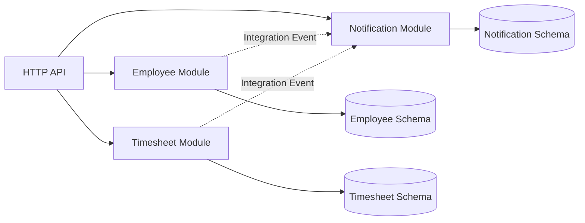
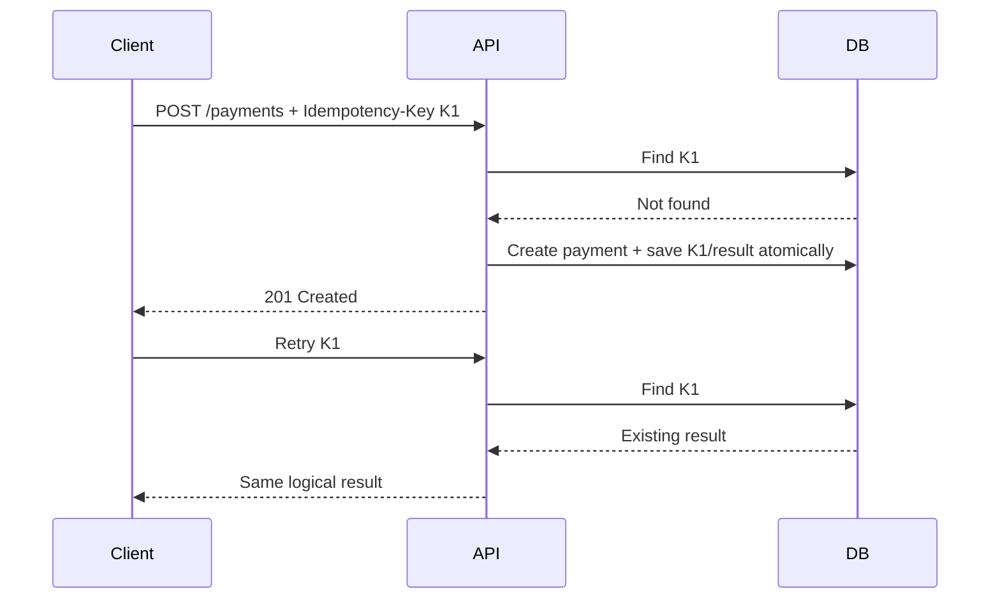
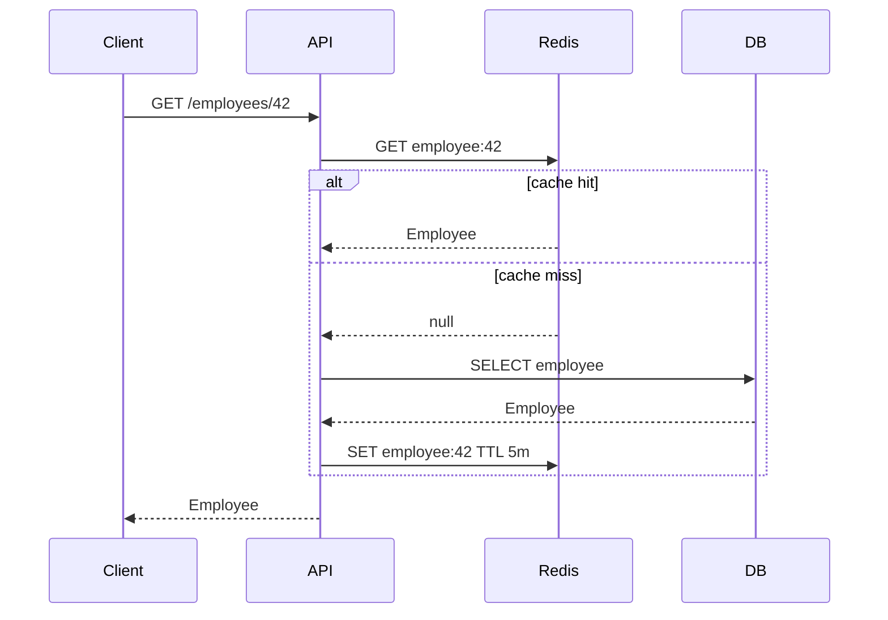
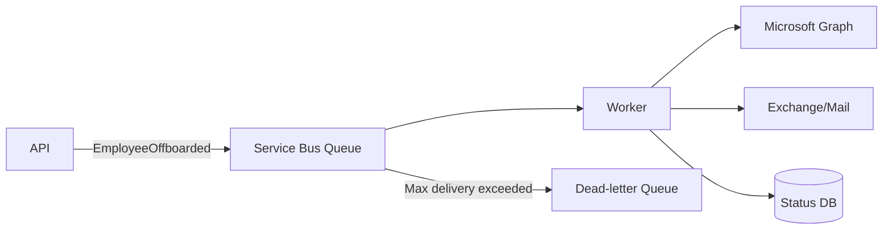
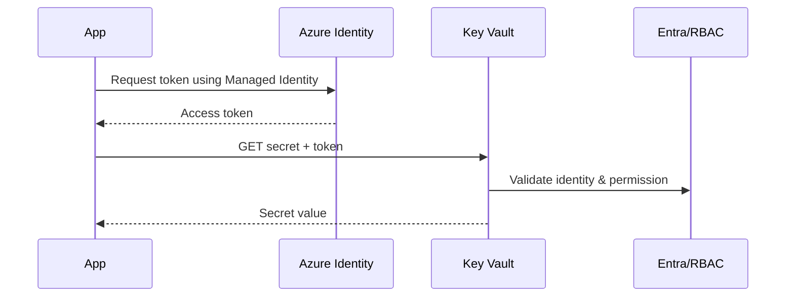
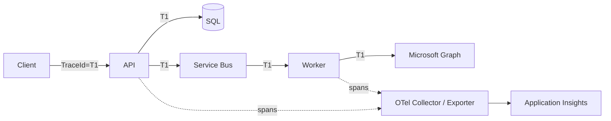
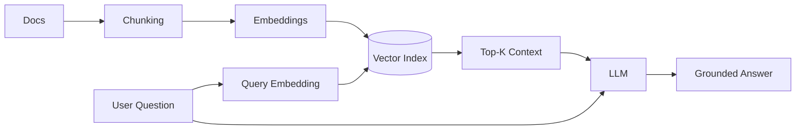
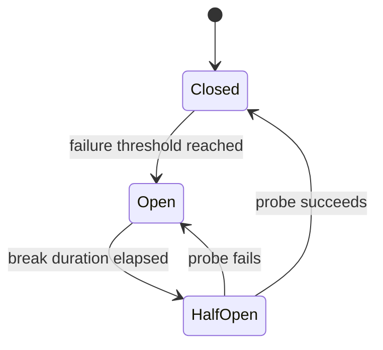

# Daily Knowledge Sharing — 2026-08-18

## Today’s Topics

1. Modular Monolith và ranh giới module
2. Idempotency cho API và background processing
3. Optimistic Concurrency với EF Core
4. Cache-Aside và bài toán cache invalidation
5. Azure Service Bus: queue, retry và dead-letter
6. Managed Identity và Azure Key Vault
7. OpenTelemetry và Distributed Tracing
8. RAG: retrieval, grounding và kiểm soát chất lượng
9. Feature Flags cho release an toàn
10. Circuit Breaker và resilience khi tích hợp third-party

---

# 1. Modular Monolith và ranh giới module

### 1. What is it?

Modular Monolith là một ứng dụng được deploy như một đơn vị nhưng bên trong được chia thành các module nghiệp vụ có ranh giới rõ ràng. Điểm quan trọng không phải là tạo nhiều folder, mà là kiểm soát dependency và ownership của dữ liệu. Ví dụ `Timesheet`, `Employee`, `Notification` có thể nằm chung process nhưng không được tùy tiện truy cập DbSet, service nội bộ hoặc bảng của nhau.

### 2. Why does it exist?

Monolith truyền thống dễ trở thành “big ball of mud”: mọi feature gọi trực tiếp mọi service, dùng chung database model và thay đổi một nơi gây ảnh hưởng nhiều nơi. Microservices giải quyết isolation tốt hơn nhưng thêm network, deployment, observability và consistency complexity. Modular Monolith là điểm cân bằng khi domain đã đủ lớn để cần boundaries nhưng chưa cần operational cost của distributed system.

### 3. How does it work?



Mỗi module sở hữu application logic, domain model và persistence của mình. Giao tiếp đồng bộ đi qua public contract; giao tiếp giảm coupling có thể dùng in-process domain/integration event. Một module không nên query trực tiếp bảng riêng của module khác chỉ vì chúng nằm chung database.

### 4. Practical example

```csharp
public interface IEmployeeModule
{
    Task<EmployeeSummary?> GetSummaryAsync(Guid employeeId, CancellationToken ct);
}

internal sealed class EmployeeModule(AppDbContext db) : IEmployeeModule
{
    public Task<EmployeeSummary?> GetSummaryAsync(Guid employeeId, CancellationToken ct) =>
        db.Employees
          .Where(x => x.Id == employeeId)
          .Select(x => new EmployeeSummary(x.Id, x.DisplayName, x.Status))
          .SingleOrDefaultAsync(ct);
}
```

`Timesheet` phụ thuộc vào contract `IEmployeeModule`, không lấy `EmployeeDbContext` rồi query tùy ý.

### 5. Real production scenario

Trong hệ thống quản lý nhân sự, flow submit timesheet có thể là `API → Timesheet module → kiểm tra employee qua public contract → lưu Timesheet → phát TimesheetSubmitted → Notification module gửi thông báo`. Sau này nếu Notification cần scale độc lập, boundary đã tồn tại nên việc tách thành service ít đau hơn.

### 6. Common mistakes

- Chia project/folder nhưng tất cả module vẫn reference lẫn nhau.
- Một `Shared` project chứa gần như toàn bộ domain model và biến thành dependency dumping ground.
- Module A dùng trực tiếp repository hoặc DbSet của module B.
- Dùng event cho mọi lời gọi dù synchronous call đơn giản hơn.
- Tách module quá nhỏ theo entity thay vì business capability.

### 7. Trade-offs

**Advantages:** deployment đơn giản, transaction local dễ, debugging thuận tiện, boundaries tốt hơn monolith truyền thống.

**Costs / Risks:** boundaries không được runtime/network cưỡng chế; team phải có discipline. Một process vẫn là một failure/scaling unit và database chung có thể khiến developer phá boundary vì tiện.

### 8. Junior → Middle → Senior understanding

**Junior:** hiểu module là business boundary, không chỉ folder.

**Middle:** biết thiết kế public contract, dependency direction, persistence ownership và integration event.

**Senior / Technical Lead:** quyết định module boundaries theo business capability, đánh giá coupling/cohesion, xác định khi nào cần tách microservice và tránh distributed complexity quá sớm.

### 9. Key takeaway

- Boundary quan trọng hơn số lượng project.
- Module phải sở hữu logic và dữ liệu của mình.
- Modular Monolith thường là bước khởi đầu tốt trước khi có lý do thực sự để dùng microservices.

---

# 2. Idempotency cho API và background processing

### 1. What is it?

Một operation idempotent cho phép cùng một yêu cầu được thực hiện nhiều lần nhưng trạng thái nghiệp vụ cuối cùng tương đương thực hiện một lần. Điều này đặc biệt quan trọng với payment, tạo order, webhook và message consumer vì retry là chuyện bình thường trong production.

### 2. Why does it exist?

Client có thể timeout sau khi server đã commit DB. Client không biết request thành công hay chưa nên retry. Nếu `POST /payments` tạo payment mới mỗi lần, cùng một thao tác có thể bị charge hai lần. “Không retry” không phải giải pháp vì network failure luôn tồn tại.

### 3. How does it work?



Idempotency key phải gắn với operation/business scope và thường được lưu cùng result/status. Unique constraint ở database là lớp bảo vệ cuối cùng chống race condition.

### 4. Practical example

```csharp
public async Task<IResult> CreatePayment(
    string idempotencyKey,
    CreatePaymentRequest request,
    PaymentsDbContext db,
    CancellationToken ct)
{
    var existing = await db.IdempotencyRecords
        .SingleOrDefaultAsync(x => x.Key == idempotencyKey, ct);

    if (existing is not null)
        return Results.Json(existing.ResponseBody, statusCode: existing.StatusCode);

    var payment = Payment.Create(request.OrderId, request.Amount);
    db.Payments.Add(payment);
    db.IdempotencyRecords.Add(new(idempotencyKey, 201, payment.Id.ToString()));
    await db.SaveChangesAsync(ct);

    return Results.Created($"/payments/{payment.Id}", payment);
}
```

DB nên có unique index trên `IdempotencyKey` hoặc composite key phù hợp tenant/operation.

### 5. Real production scenario

Mobile app gửi payment, API commit thành công nhưng response mất do network. App retry cùng key. API trả lại kết quả cũ thay vì tạo payment thứ hai. Tương tự, Service Bus consumer có thể nhận lại message; `MessageId` hoặc business key giúp consumer xử lý idempotently.

### 6. Common mistakes

- Chỉ kiểm tra key bằng `SELECT` rồi `INSERT` nhưng không có unique constraint, gây race.
- Reuse một key cho payload khác mà không validate request hash.
- Lưu idempotency record sau side effect bên ngoài, khiến crash giữa hai bước tạo duplicate.
- Giữ key mãi mãi không có retention policy.
- Nhầm idempotency với “request sẽ chỉ đến một lần”.

### 7. Trade-offs

**Advantages:** retry an toàn, giảm duplicate side effects, tăng reliability.

**Costs / Risks:** thêm storage, cleanup, transaction design và xử lý concurrent requests. Với operation đơn giản có natural idempotency như `PUT resource/{id}`, cơ chế riêng có thể không cần.

### 8. Junior → Middle → Senior understanding

**Junior:** hiểu retry có thể tạo duplicate.

**Middle:** triển khai key storage, unique constraint, response replay và expiration.

**Senior / Technical Lead:** thiết kế idempotency boundary xuyên DB/message/external side effects và quyết định semantic “same operation” theo business.

### 9. Key takeaway

- Retry và idempotency phải được thiết kế cùng nhau.
- Unique constraint là guard quan trọng chống race.
- Idempotency là business guarantee, không chỉ HTTP trick.

---

# 3. Optimistic Concurrency với EF Core

### 1. What is it?

Optimistic Concurrency giả định conflict hiếm, nên không khóa record trong toàn bộ thời gian người dùng đọc và sửa. Khi update, hệ thống kiểm tra record có bị thay đổi kể từ lúc đọc hay không. Nếu có, update thất bại và application quyết định retry, merge hoặc báo conflict.

### 2. Why does it exist?

Nếu hai admin cùng mở một employee và lần lượt save, cách update ngây thơ tạo “last write wins”, khiến thay đổi đầu tiên bị ghi đè âm thầm. Pessimistic lock giữ lock lâu lại giảm concurrency và khó dùng cho HTTP request kéo dài nhiều giây/phút.

### 3. How does it work?

Client đọc `Employee + RowVersion`. Khi update, SQL có dạng:

```sql
UPDATE Employees
SET DisplayName = @name
WHERE Id = @id AND RowVersion = @originalRowVersion;
```

Nếu affected rows = 0, EF Core ném `DbUpdateConcurrencyException`.

### 4. Practical example

```csharp
public sealed class Employee
{
    public Guid Id { get; set; }
    public string DisplayName { get; set; } = "";
    [Timestamp]
    public byte[] RowVersion { get; set; } = [];
}

try
{
    await db.SaveChangesAsync(ct);
}
catch (DbUpdateConcurrencyException)
{
    return Results.Conflict(new
    {
        code = "employee_modified",
        message = "Employee was changed by another request. Reload and retry."
    });
}
```

API có thể encode `RowVersion` thành Base64 hoặc dùng ETag/`If-Match` để đưa concurrency contract ra HTTP layer.

### 5. Real production scenario

Trong employee management, HR sửa department trong khi manager sửa display name trên cùng record. Nếu business cho phép merge field độc lập, server có thể load database values và merge. Nếu thay đổi liên quan business invariant, an toàn hơn là trả `409 Conflict` để client reload.

### 6. Common mistakes

- Bắt `DbUpdateConcurrencyException` rồi retry vô hạn với cùng stale state.
- Không đưa concurrency token về client.
- Dùng timestamp thời gian (`UpdatedAt`) có precision không đủ làm token.
- Luôn chọn last-write-wins mà không xem dữ liệu bị mất.
- Conflict xảy ra nhưng trả `500` như lỗi server.

### 7. Trade-offs

**Advantages:** không giữ lock dài, throughput tốt khi conflict hiếm.

**Costs / Risks:** application phải định nghĩa conflict resolution. Nếu contention rất cao, retry liên tục có thể đắt và pessimistic strategy đôi khi phù hợp hơn.

### 8. Junior → Middle → Senior understanding

**Junior:** hiểu lost update và concurrency token.

**Middle:** cấu hình EF Core, xử lý exception và HTTP conflict.

**Senior / Technical Lead:** quyết định merge/reject/retry theo invariant, contention profile và user experience.

### 9. Key takeaway

- Optimistic concurrency phát hiện stale write, không ngăn mọi concurrent access.
- Conflict phải được xử lý theo business semantics.
- Đừng biến concurrency conflict thành generic 500.

---

# 4. Cache-Aside và bài toán cache invalidation

### 1. What is it?

Cache-Aside là pattern trong đó application tự đọc cache trước; cache miss thì đọc database, sau đó ghi dữ liệu vào cache. Database vẫn là source of truth. Redis thường được dùng khi nhiều instance API cần chia sẻ cache.

### 2. Why does it exist?

Một endpoint đọc product/employee metadata hàng nghìn lần nhưng dữ liệu thay đổi ít sẽ tạo load DB không cần thiết. In-memory cache riêng từng instance không đồng nhất và mất khi restart. Distributed cache giảm latency và DB load, nhưng đổi lại xuất hiện consistency problem.

### 3. How does it work?



Khi update DB, application thường invalidate key. TTL là safety net, không nên là chiến lược consistency duy nhất nếu dữ liệu cần tươi.

### 4. Practical example

```csharp
public async Task<EmployeeDto?> GetAsync(Guid id, CancellationToken ct)
{
    var key = $"employee:{id}";
    var cached = await cache.GetStringAsync(key, ct);
    if (cached is not null)
        return JsonSerializer.Deserialize<EmployeeDto>(cached);

    var employee = await db.Employees.AsNoTracking()
        .Where(x => x.Id == id)
        .Select(x => new EmployeeDto(x.Id, x.DisplayName))
        .SingleOrDefaultAsync(ct);

    if (employee is not null)
        await cache.SetStringAsync(key, JsonSerializer.Serialize(employee),
            new DistributedCacheEntryOptions
            {
                AbsoluteExpirationRelativeToNow = TimeSpan.FromMinutes(5)
            }, ct);

    return employee;
}
```

### 5. Real production scenario

Employee profile được đọc bởi portal, timesheet và notification. Sau khi HR đổi tên, transaction DB commit trước rồi cache key bị xóa. Request kế tiếp miss cache và lấy dữ liệu mới. Nếu Redis down, hệ thống nên có degraded mode đọc DB thay vì biến cache thành single point of failure.

### 6. Common mistakes

- Cache dữ liệu authorization nhạy cảm quá lâu.
- Update DB nhưng quên invalidate cache.
- TTL giống nhau cho hàng triệu key gây expiration spike.
- Cache miss đồng thời tạo cache stampede.
- Không đo hit ratio, latency hoặc memory pressure.
- Coi Redis là source of truth cho dữ liệu không được thiết kế như vậy.

### 7. Trade-offs

**Advantages:** giảm latency và DB load, scale read tốt.

**Costs / Risks:** stale data, invalidation complexity, extra infrastructure, serialization overhead và stampede. Cache không miễn phí; cache dữ liệu ít đọc có thể làm hệ thống phức tạp hơn mà không có lợi.

### 8. Junior → Middle → Senior understanding

**Junior:** hiểu hit, miss, TTL và source of truth.

**Middle:** triển khai invalidation, fallback, metrics và tránh stampede cơ bản.

**Senior / Technical Lead:** phân loại consistency requirement, thiết kế key/versioning, capacity, failure behavior và quyết định dữ liệu nào không nên cache.

### 9. Key takeaway

- Cache là optimization, không phải mặc định.
- Invalidation và failure behavior phải được thiết kế trước.
- Đo hit ratio và DB load để chứng minh cache có giá trị.

---

# 5. Azure Service Bus: queue, retry và dead-letter

### 1. What is it?

Azure Service Bus là managed message broker cho asynchronous messaging. Queue tách producer khỏi consumer; producer gửi message và không cần chờ consumer xử lý xong. Service Bus hỗ trợ delivery, lock, retry, dead-letter queue, sessions và duplicate detection tùy cấu hình.

### 2. Why does it exist?

Nếu API gọi trực tiếp email service, Microsoft Graph, PDF generator và audit service trong một request, latency và failure coupling tăng mạnh. Một dependency chậm có thể làm toàn request timeout. Message broker cho phép absorb burst, retry độc lập và scale consumer riêng.

### 3. How does it work?



Với Peek-Lock, consumer nhận message nhưng message chưa bị xóa. Thành công thì complete; lỗi transient thì abandon/retry; lỗi poison hoặc vượt delivery count thì chuyển DLQ.

### 4. Practical example

```csharp
var processor = client.CreateProcessor("offboarding", new ServiceBusProcessorOptions
{
    MaxConcurrentCalls = 8,
    AutoCompleteMessages = false
});

processor.ProcessMessageAsync += async args =>
{
    var command = args.Message.Body.ToObjectFromJson<OffboardEmployee>();
    await handler.HandleAsync(command, args.CancellationToken);
    await args.CompleteMessageAsync(args.Message, args.CancellationToken);
};
```

Handler vẫn phải idempotent vì at-least-once delivery có thể tạo duplicate processing.

### 5. Real production scenario

Admin offboard 5.000 nhân viên. API ghi trạng thái và enqueue command nhanh chóng. Worker xử lý Exchange/Microsoft Graph với concurrency giới hạn. Các lỗi throttling được retry; message có dữ liệu sai được đưa DLQ để operator điều tra thay vì block toàn queue.

### 6. Common mistakes

- Nghĩ queue bảo đảm exactly-once end-to-end.
- Complete message trước khi side effect hoàn tất.
- Retry poison message vô hạn.
- Không monitor DLQ và queue depth.
- `MaxConcurrentCalls` quá cao làm downstream bị throttling.
- Đưa payload chứa secret/PII không cần thiết vào message.

### 7. Trade-offs

**Advantages:** decoupling, burst handling, independent scaling, retry và failure isolation.

**Costs / Risks:** eventual consistency, duplicate handling, observability phức tạp hơn và chi phí broker. Debug flow asynchronous khó hơn synchronous call.

### 8. Junior → Middle → Senior understanding

**Junior:** hiểu producer, queue, consumer và DLQ.

**Middle:** biết lock/complete/retry, idempotent handler và concurrency tuning.

**Senior / Technical Lead:** thiết kế delivery semantics, ordering, backpressure, poison-message policy, SLO và recovery workflow.

### 9. Key takeaway

- Queue tách thời gian sống và failure của producer/consumer.
- At-least-once nghĩa là consumer phải chịu được duplicate.
- DLQ không phải thùng rác; phải có monitoring và recovery process.

---

# 6. Managed Identity và Azure Key Vault

### 1. What is it?

Managed Identity cung cấp identity do Azure quản lý cho resource như App Service, Function hoặc VM. Application dùng identity này để lấy token từ Microsoft Entra ID thay vì lưu client secret. Key Vault lưu secret, certificate và key; RBAC quyết định identity nào được đọc hoặc quản lý chúng.

### 2. Why does it exist?

Hard-code secret trong `appsettings.json`, pipeline variable hoặc environment variable tạo rủi ro leak và rotation. Managed Identity loại bỏ credential dài hạn khỏi application khi truy cập Azure resources hỗ trợ Entra authentication.

### 3. How does it work?



Trong local development, `DefaultAzureCredential` có thể dùng developer identity; khi deploy Azure, cùng code tự dùng Managed Identity.

### 4. Practical example

```csharp
var credential = new DefaultAzureCredential();
var secretClient = new SecretClient(
    new Uri("https://my-vault.vault.azure.net/"),
    credential);

KeyVaultSecret secret = await secretClient.GetSecretAsync("ThirdPartyApiKey");
```

Với Azure SQL/Storage/Service Bus, ưu tiên token-based SDK trực tiếp thay vì lấy password từ Key Vault nếu service hỗ trợ Managed Identity.

### 5. Real production scenario

ASP.NET Core App Service cần đọc Blob Storage và gọi Service Bus. Gán system-assigned identity cho app, cấp `Storage Blob Data Contributor` và `Azure Service Bus Data Sender`. Không cần storage key hay Service Bus connection string trong config. Chỉ third-party API key không hỗ trợ Entra mới cần lưu Key Vault.

### 6. Common mistakes

- Cho identity quyền `Owner` hoặc Key Vault Administrator chỉ để đọc một secret.
- Dùng Key Vault như database và đọc secret ở mọi request.
- Có Managed Identity nhưng vẫn lưu connection string chứa account key.
- Không cấu hình Private Endpoint/firewall khi security requirement cần network isolation.
- Không phân biệt control-plane role và data-plane role.

### 7. Trade-offs

**Advantages:** giảm secret management, rotation dễ hơn, least privilege rõ hơn.

**Costs / Risks:** phụ thuộc Azure identity/RBAC, local debugging cần credential setup, network restriction có thể làm deployment phức tạp. User-assigned identity thêm quản trị nhưng reuse được giữa resources.

### 8. Junior → Middle → Senior understanding

**Junior:** hiểu secret không nên hard-code và identity khác secret.

**Middle:** cấu hình `DefaultAzureCredential`, RBAC, Key Vault và debug 401/403.

**Senior / Technical Lead:** thiết kế least privilege, identity lifecycle, network isolation, secret rotation và chọn system-assigned hay user-assigned identity.

### 9. Key takeaway

- Nếu Azure service hỗ trợ Entra auth, ưu tiên Managed Identity hơn secret.
- Key Vault bảo vệ secret còn lại, không thay thế authorization design.
- Quyền tối thiểu và network boundary quan trọng ngang việc cất secret.

---

# 7. OpenTelemetry và Distributed Tracing

### 1. What is it?

OpenTelemetry là bộ chuẩn/API/SDK để tạo telemetry như traces, metrics và logs theo cách vendor-neutral. Distributed tracing nối các span của một request xuyên qua API, worker, message broker và database bằng trace context.

### 2. Why does it exist?

Trong distributed system, log `500 error` ở API không cho biết 2,4 giây đã mất ở SQL, Service Bus hay Microsoft Graph. Correlation ID thủ công giúp một phần nhưng thiếu timing, parent-child relationship và standardized propagation.

### 3. How does it work?



Một trace gồm nhiều spans. Mỗi span có start/end time, status, attributes và parent. W3C `traceparent` giúp context truyền qua HTTP; messaging instrumentation cần đảm bảo propagation tương ứng.

### 4. Practical example

```csharp
builder.Services.AddOpenTelemetry()
    .WithTracing(tracing => tracing
        .AddAspNetCoreInstrumentation()
        .AddHttpClientInstrumentation()
        .AddEntityFrameworkCoreInstrumentation()
        .AddSource("Employee.Offboarding")
        .AddOtlpExporter());

using var activity = ActivitySource.StartActivity("ResetMailbox");
activity?.SetTag("employee.operation", "offboarding");
```

Không nên tag email, token hoặc PII nếu không thực sự cần.

### 5. Real production scenario

Offboarding API trả chậm. Trace cho thấy API 120 ms, queue wait 15 s, worker 300 ms và Microsoft Graph call 8 s với retry. Team biết bottleneck là downstream/throttling chứ không phải SQL và có thể điều chỉnh concurrency/backoff đúng chỗ.

### 6. Common mistakes

- Log/trace mọi payload và vô tình thu PII/secrets.
- Sampling quá thấp khiến incident hiếm không có trace.
- Sampling 100% ở traffic lớn gây chi phí telemetry cao.
- Tạo custom span nhưng không propagate context qua queue.
- Chỉ có traces mà không có metrics/alerts.

### 7. Trade-offs

**Advantages:** root-cause nhanh, vendor-neutral instrumentation, hiểu latency end-to-end.

**Costs / Risks:** telemetry volume/cost, sampling complexity và data governance. Instrumentation quá chi tiết có thể tạo noise.

### 8. Junior → Middle → Senior understanding

**Junior:** hiểu trace, span và correlation.

**Middle:** instrument HTTP/EF/worker, query trace và tránh sensitive attributes.

**Senior / Technical Lead:** thiết kế sampling, semantic conventions, retention, telemetry budget và correlation giữa traces-metrics-logs-SLO.

### 9. Key takeaway

- Trace trả lời “request đã đi đâu và mất thời gian ở đâu”.
- Propagation quan trọng hơn việc tạo nhiều log.
- Observability phải cân bằng diagnostic value với cost và privacy.

---

# 8. RAG: retrieval, grounding và kiểm soát chất lượng

### 1. What is it?

Retrieval-Augmented Generation (RAG) là kiến trúc lấy thông tin liên quan từ nguồn dữ liệu bên ngoài rồi đưa phần context đó vào LLM để tạo câu trả lời. LLM không tự “biết” database nội bộ; retrieval giúp câu trả lời dựa trên tài liệu có kiểm soát.

### 2. Why does it exist?

Prompt chứa toàn bộ knowledge base không scale theo context window và chi phí. Fine-tuning không phù hợp để cập nhật facts thường xuyên. RAG cho phép thay đổi dữ liệu độc lập với model và cung cấp evidence/citation, nhưng retrieval sai vẫn dẫn đến answer sai.

### 3. How does it work?



Production RAG thường thêm metadata filter, hybrid search, reranking, access-control filtering và evaluation. Retrieval và generation là hai subsystem cần đo riêng.

### 4. Practical example

```csharp
var hits = await knowledgeSearch.SearchAsync(
    query: question,
    tenantId: tenantId,
    top: 5,
    cancellationToken: ct);

var context = string.Join("\n\n", hits.Select(x =>
    $"SOURCE: {x.DocumentId}\n{x.Content}"));

var prompt = $"""
Answer only from the supplied sources. If evidence is insufficient, say so.

Question: {question}

Sources:
{context}
""";
```

Authorization filter phải xảy ra trước khi context được gửi vào model; không dựa vào prompt để bảo vệ tài liệu.

### 5. Real production scenario

AI assistant cho tài liệu kỹ thuật nội bộ: user hỏi cách reset mailbox. Search lọc theo tenant và permission, lấy runbook mới nhất, rerank các đoạn phù hợp, gửi 4 đoạn vào LLM và trả answer kèm source IDs. Nếu retrieval confidence thấp, hệ thống trả “không đủ dữ liệu” thay vì hallucinate.

### 6. Common mistakes

- Chunk theo số ký tự cố định làm mất semantic boundary.
- Chỉ tối ưu prompt trong khi retrieval quality thấp.
- Không filter quyền truy cập trước retrieval/generation.
- Top-K quá lớn làm tăng token và đưa context nhiễu.
- Không version/index lại tài liệu đã thay đổi.
- Đánh giá bằng vài câu hỏi demo thay vì dataset có expected evidence.

### 7. Trade-offs

**Advantages:** knowledge cập nhật được, có grounding, không cần train lại model cho facts.

**Costs / Risks:** thêm vector/search infrastructure, retrieval latency, indexing pipeline, access-control complexity và vẫn có hallucination. Hybrid search/reranking tăng quality nhưng tăng latency/cost.

### 8. Junior → Middle → Senior understanding

**Junior:** hiểu retrieval khác generation và embedding dùng để tìm semantic similarity.

**Middle:** xây ingestion, chunking, metadata filter, top-K, citation và evaluation cơ bản.

**Senior / Technical Lead:** thiết kế ACL, freshness, hybrid retrieval, reranking, cost/latency budget, evaluation metrics và failure policy.

### 9. Key takeaway

- RAG tốt bắt đầu từ retrieval tốt, không phải prompt dài.
- Authorization phải deterministic trước khi context tới LLM.
- Đo retrieval quality và answer quality riêng biệt.

---

# 9. Feature Flags cho release an toàn

### 1. What is it?

Feature Flag tách “deploy code” khỏi “enable behavior”. Code mới có thể đã ở production nhưng chỉ bật cho internal users, một tenant, một phần traffic hoặc sau khi dependency sẵn sàng.

### 2. Why does it exist?

Deploy và release cùng lúc làm blast radius lớn. Nếu feature mới lỗi, rollback binary/database có thể chậm. Feature flag tạo operational control để disable behavior nhanh mà không cần redeploy.

### 3. How does it work?

```text
Request
  |
  v
Feature evaluation ---- OFF ---> Old behavior
  |
  +-------------------- ON ----> New behavior
```

Flag evaluation có thể dựa trên environment, user, tenant hoặc percentage rollout. Quyết định phải ổn định trong một request; config source cần cache/fallback để flag service outage không làm ứng dụng sập.

### 4. Practical example

```csharp
if (await featureManager.IsEnabledAsync("NewOffboardingFlow"))
{
    await newFlow.ExecuteAsync(employeeId, ct);
}
else
{
    await legacyFlow.ExecuteAsync(employeeId, ct);
}
```

Với business-critical path, cần xác định fail-open hay fail-closed nếu flag provider unavailable.

### 5. Real production scenario

Team deploy flow offboarding mới nhưng chỉ bật cho 5% tenant. Metrics theo flag variant cho thấy error rate tăng ở Graph integration; team tắt flag trong vài giây mà không rollback toàn release. Sau khi fix, rollout 5% → 25% → 100%.

### 6. Common mistakes

- Flag tồn tại nhiều năm tạo hai code paths khó bảo trì.
- Dùng flag thay cho authorization.
- Không test cả ON và OFF.
- Đổi database schema theo cách old path không còn chạy được.
- Không ghi owner/expiry date.
- Percentage rollout nhưng không dùng stable hashing, khiến user nhảy nhóm liên tục.

### 7. Trade-offs

**Advantages:** giảm blast radius, progressive rollout, kill switch nhanh.

**Costs / Risks:** tăng state-space khi test, technical debt và dependency vào flag configuration. Nhiều flag tương tác nhau tạo combinatorial complexity.

### 8. Junior → Middle → Senior understanding

**Junior:** hiểu deploy khác release.

**Middle:** triển khai flag, test hai path, telemetry theo variant và cleanup.

**Senior / Technical Lead:** thiết kế rollout policy, schema compatibility, fail-safe behavior, ownership và governance để flag không biến thành permanent architecture.

### 9. Key takeaway

- Feature flag là release control, không phải permission system.
- Mỗi temporary flag cần owner và ngày xóa.
- Progressive rollout chỉ hữu ích khi có metrics để quyết định tiếp tục hay rollback.

---

# 10. Circuit Breaker và resilience khi tích hợp third-party

### 1. What is it?

Circuit Breaker tạm ngừng gọi một dependency đang lỗi liên tục. Nó thường có ba trạng thái: Closed (cho phép call), Open (fail fast) và Half-Open (thử một số call để xem dependency đã hồi phục chưa).

### 2. Why does it exist?

Nếu third-party API down, hàng nghìn request tiếp tục chờ timeout sẽ giữ socket, thread/task, connection và memory, đồng thời tạo retry storm. Retry đơn thuần thậm chí làm sự cố nặng hơn. Circuit Breaker giới hạn damage và cho downstream thời gian hồi phục.

### 3. How does it work?



Circuit Breaker thường kết hợp timeout và retry có backoff/jitter. Thứ tự policy quan trọng: không retry vô hạn bên trong một circuit đang fail.

### 4. Practical example

Với .NET resilience pipeline:

```csharp
builder.Services.AddHttpClient<GraphGateway>()
    .AddStandardResilienceHandler(options =>
    {
        options.AttemptTimeout.Timeout = TimeSpan.FromSeconds(5);
        options.TotalRequestTimeout.Timeout = TimeSpan.FromSeconds(15);
        options.Retry.MaxRetryAttempts = 2;
        options.CircuitBreaker.BreakDuration = TimeSpan.FromSeconds(30);
    });
```

Chỉ retry lỗi transient. `400 Bad Request` do payload sai không nên retry.

### 5. Real production scenario

Notification service gọi provider email. Provider trả 503 trong 10 phút. Timeout giới hạn từng call; retry xử lý lỗi ngắn; circuit mở khi failure rate cao và request mới fail fast hoặc enqueue để xử lý sau. Alert báo dependency degraded. Khi half-open probe thành công, traffic được khôi phục có kiểm soát.

### 6. Common mistakes

- Retry mọi status code, kể cả 400/401/403.
- Retry POST không idempotent và tạo duplicate side effect.
- Circuit breaker global cho nhiều downstream endpoint khác nhau, khiến một lỗi làm chặn tất cả.
- Timeout quá dài nên circuit không giúp giải phóng resource sớm.
- Không có fallback hoặc queue cho operation có thể trì hoãn.
- Không emit metrics về retry/circuit state.

### 7. Trade-offs

**Advantages:** fail fast, giảm cascading failure, bảo vệ cả caller và dependency.

**Costs / Risks:** tuning threshold khó; circuit mở có thể từ chối request mà downstream vừa hồi phục. Fallback có thể trả stale/partial data và che giấu sự cố nếu monitoring kém.

### 8. Junior → Middle → Senior understanding

**Junior:** hiểu timeout, retry và circuit breaker giải quyết các vấn đề khác nhau.

**Middle:** phân loại transient errors, cấu hình backoff/jitter, idempotency và telemetry.

**Senior / Technical Lead:** thiết kế resilience budget, policy ordering, bulkhead/backpressure, degraded mode và SLO cho dependency failure.

### 9. Key takeaway

- Retry không phải thuốc chữa mọi lỗi; retry sai tạo retry storm.
- Circuit Breaker bảo vệ hệ thống bằng fail-fast khi downstream đang unhealthy.
- Resilience tốt cần timeout + selective retry + circuit breaker + observability + idempotency.