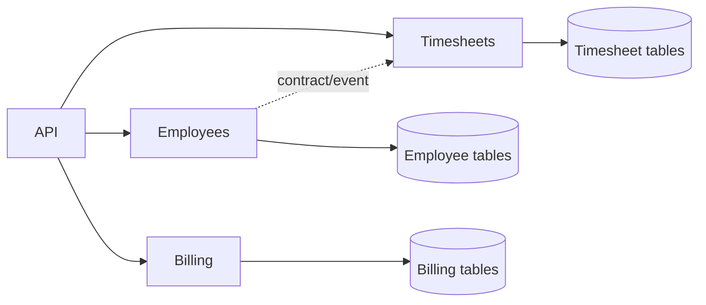
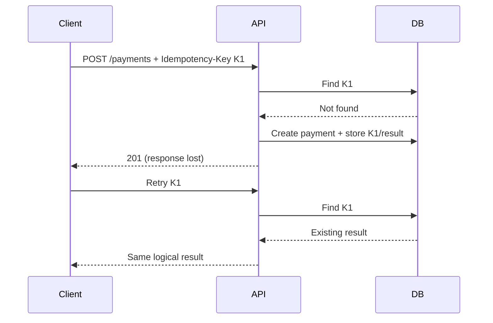
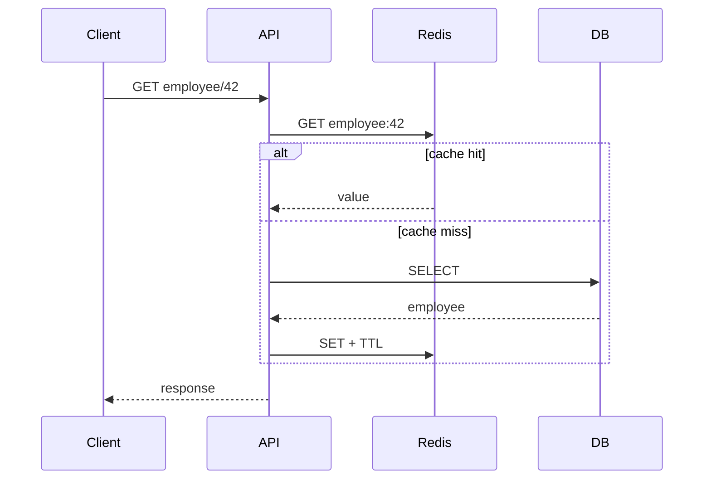
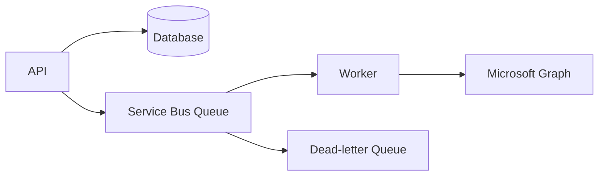
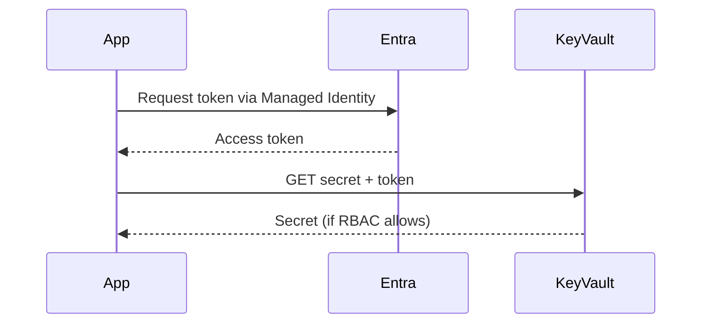
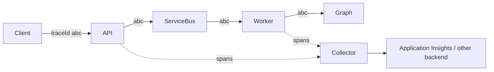
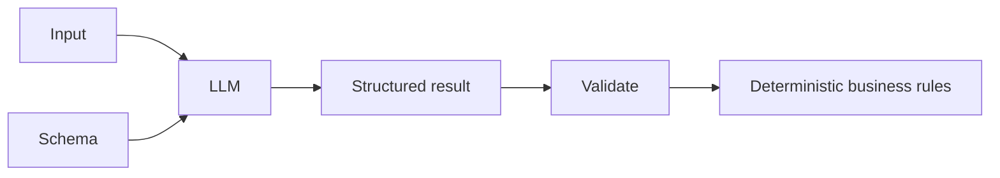
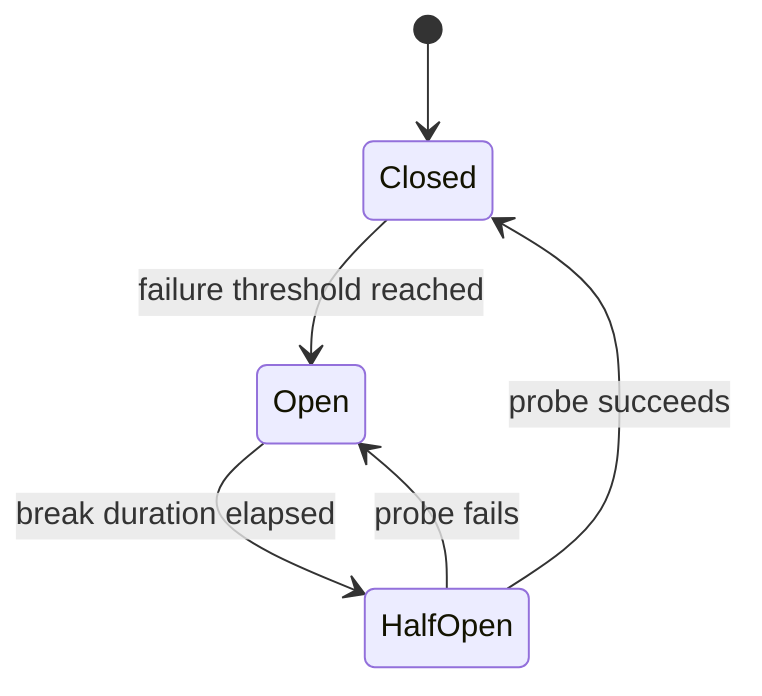

# Daily Knowledge Sharing — 18/08/2026

## Today’s Topics

1. Modular Monolith và ranh giới module
2. Idempotency trong API
3. Optimistic Concurrency với EF Core
4. Cache Aside và cache invalidation
5. Azure Service Bus và xử lý message tin cậy
6. Managed Identity + Azure Key Vault
7. OpenTelemetry và Distributed Tracing
8. Structured Output khi tích hợp LLM
9. Feature Flags trong production release
10. Circuit Breaker và resilience

---

# 1. Modular Monolith và ranh giới module

### 1. What is it?

Modular Monolith vẫn deploy thành một ứng dụng/process, nhưng code và dữ liệu được chia thành các module nghiệp vụ có ranh giới rõ như `Employees`, `Timesheets`, `Billing`. Điểm quan trọng không phải folder đẹp mà là module không tùy tiện truy cập internals của nhau.

### 2. Why does it exist?

Một monolith không có boundary thường dần biến thành “big ball of mud”: service A gọi repository B, bảng của module C bị query trực tiếp, thay đổi một feature kéo theo regression ở nhiều nơi. Microservices giải quyết một phần coupling nhưng thêm network, deployment, observability và consistency complexity. Modular Monolith là bước trung gian thực dụng.

### 3. How does it work?



Mỗi module sở hữu domain logic, application use cases và persistence của mình. Giao tiếp qua public contract, command hoặc domain/integration event thay vì truy cập repository nội bộ của module khác.

### 4. Practical example

```csharp
public interface IEmployeeModule
{
    Task<EmployeeSummary?> GetEmployeeAsync(Guid employeeId,
        CancellationToken ct);
}

// Timesheets chỉ biết contract, không inject EmployeeRepository.
public sealed class CreateTimesheetHandler(IEmployeeModule employees)
{
    public async Task Handle(Guid employeeId, CancellationToken ct)
    {
        var employee = await employees.GetEmployeeAsync(employeeId, ct)
            ?? throw new InvalidOperationException("Employee not found");
    }
}
```

### 5. Real production scenario

Trong hệ thống HR, Employee module quản lý trạng thái nhân viên; Timesheet chỉ cần biết nhân viên có active hay không. Nếu Timesheet query trực tiếp bảng `Employees`, schema Employee trở thành shared contract ngầm. Public module API giúp thay đổi storage mà không phá Timesheet.

### 6. Common mistakes

Tạo nhiều project nhưng dùng chung một `DbContext` rồi query entity xuyên module; shared project chứa toàn bộ domain model; module gọi nhau vòng tròn; dùng event cho mọi thứ dù cần response đồng bộ; chia module theo technical layer thay vì business capability.

### 7. Trade-offs

**Advantages:** deployment đơn giản, transaction local dễ hơn microservices, boundary tốt, dễ tách service sau này. **Costs / Risks:** boundary chỉ được bảo vệ bằng kiến trúc/code convention; một process lỗi có thể ảnh hưởng toàn hệ thống; scale từng module độc lập khó.

### 8. Junior → Middle → Senior understanding

**Junior:** hiểu module là business boundary, không chỉ folder. **Middle:** biết thiết kế public contract và tránh cross-module database access. **Senior / Technical Lead:** quyết định module boundary, ownership dữ liệu, transaction boundary và khi nào một module thực sự cần tách thành service.

### 9. Key takeaway

- Modular Monolith ưu tiên boundary trước distributed deployment.
- Data ownership quan trọng hơn số lượng project.
- Hãy tách microservice khi có lý do vận hành/scaling rõ ràng, không phải vì “kiến trúc hiện đại”.

---

# 2. Idempotency trong API

### 1. What is it?

Một operation idempotent có thể nhận cùng một yêu cầu nhiều lần nhưng business effect chỉ xảy ra một lần. Đây là đặc tính cực kỳ quan trọng với payment, order creation và integration API.

### 2. Why does it exist?

Client có thể timeout sau khi server đã commit. Client không biết request thất bại hay chỉ response bị mất nên retry. Nếu `POST /payments` chạy lại không có bảo vệ, khách hàng có thể bị charge hai lần.

### 3. How does it work?



Key phải được persist cùng business operation hoặc bằng cơ chế đảm bảo không tạo race condition.

### 4. Practical example

```csharp
[HttpPost("payments")]
public async Task<IActionResult> Pay(
    [FromHeader(Name = "Idempotency-Key")] string key,
    PayRequest request)
{
    var existing = await db.IdempotencyRecords
        .SingleOrDefaultAsync(x => x.Key == key);
    if (existing is not null)
        return StatusCode(existing.StatusCode, existing.ResponseJson);

    // Production: transaction + unique index on Key.
    var payment = new Payment(request.OrderId, request.Amount);
    db.Payments.Add(payment);
    db.IdempotencyRecords.Add(new(key, 201, payment.Id.ToString()));
    await db.SaveChangesAsync();
    return Created($"/payments/{payment.Id}", payment);
}
```

### 5. Real production scenario

Mobile app gửi payment, mạng chập chờn và retry ba lần. Unique constraint trên idempotency key bảo đảm chỉ một request thắng; request sau đọc kết quả đã ghi thay vì charge lại payment gateway.

### 6. Common mistakes

Chỉ giữ key trong memory; check-then-insert không có unique constraint; dùng cùng key cho payload khác nhau; lưu key vô hạn; nghĩ HTTP retry tự động là an toàn; chỉ deduplicate request nhưng external side effect đã xảy ra trước transaction.

### 7. Trade-offs

**Advantages:** retry an toàn, giảm duplicate side effects. **Costs / Risks:** thêm storage, cleanup policy, concurrency handling và phải định nghĩa scope/lifetime của key.

### 8. Junior → Middle → Senior understanding

**Junior:** hiểu retry có thể tạo duplicate. **Middle:** implement key, unique index, transaction và payload validation. **Senior / Technical Lead:** thiết kế end-to-end idempotency qua DB, queue và third-party systems, kể cả crash giữa các side effects.

### 9. Key takeaway

- Timeout không đồng nghĩa operation chưa chạy.
- Idempotency phải bảo vệ business effect, không chỉ HTTP request.
- Unique constraint thường là lớp phòng thủ concurrency quan trọng.

---

# 3. Optimistic Concurrency với EF Core

### 1. What is it?

Optimistic concurrency giả định conflict hiếm nên không lock record trong suốt thời gian user chỉnh sửa. Khi update, hệ thống kiểm tra record có thay đổi kể từ lúc đọc hay không.

### 2. Why does it exist?

Hai admin cùng mở Employee. A đổi department, B đổi manager. Nếu B save sau bằng update mù, thay đổi của A có thể bị ghi đè. Giữ database lock từ lúc UI load đến lúc save là không thực tế.

### 3. How does it work?

SQL Server `rowversion` được đọc cùng entity. EF Core sinh update tương tự:

```sql
UPDATE Employees
SET Department = @department
WHERE Id = @id AND RowVersion = @originalVersion;
```

Nếu affected rows = 0, EF Core ném `DbUpdateConcurrencyException`.

### 4. Practical example

```csharp
public class Employee
{
    public Guid Id { get; set; }
    public string Department { get; set; } = null!;
    [Timestamp]
    public byte[] RowVersion { get; set; } = null!;
}

try
{
    await db.SaveChangesAsync(ct);
}
catch (DbUpdateConcurrencyException)
{
    return Results.Conflict(new { message = "Employee was modified." });
}
```

### 5. Real production scenario

Portal HR trả `rowVersion` cho frontend. Khi update, client gửi version cũ. Nếu background sync vừa sửa employee, API trả `409 Conflict`; UI reload dữ liệu mới hoặc cho user merge thay vì silently overwrite.

### 6. Common mistakes

Bắt exception rồi retry update mù; không gửi concurrency token qua API; dùng timestamp thời gian có precision không phù hợp; áp concurrency cho mọi bảng dù không có nguy cơ lost update; trả 500 thay vì conflict có ý nghĩa.

### 7. Trade-offs

**Advantages:** không giữ lock lâu, phù hợp web apps. **Costs / Risks:** application phải xử lý conflict; khi contention cao có thể retry/conflict liên tục.

### 8. Junior → Middle → Senior understanding

**Junior:** hiểu lost update. **Middle:** cấu hình token và xử lý `DbUpdateConcurrencyException`. **Senior / Technical Lead:** quyết định conflict strategy: reject, retry, merge hay domain-specific resolution.

### 9. Key takeaway

- Optimistic concurrency phát hiện lost update, không tự giải quyết conflict.
- `rowversion` rất phù hợp SQL Server.
- Conflict handling là business decision.

---

# 4. Cache Aside và cache invalidation

### 1. What is it?

Cache Aside để application tự đọc cache trước; cache miss thì đọc database rồi populate cache. Database vẫn là source of truth.

### 2. Why does it exist?

Các read-heavy endpoint có thể tạo hàng nghìn query giống nhau. Cache giảm latency và DB load, nhưng dữ liệu cache có thể stale nên invalidation là phần khó nhất.

### 3. How does it work?



Khi write, application update DB rồi xóa/refresh cache tương ứng.

### 4. Practical example

```csharp
var key = $"employee:{id}";
var json = await cache.GetStringAsync(key, ct);
if (json is not null)
    return JsonSerializer.Deserialize<EmployeeDto>(json)!;

var employee = await db.Employees.AsNoTracking()
    .Where(x => x.Id == id)
    .Select(x => new EmployeeDto(x.Id, x.Name))
    .SingleAsync(ct);

await cache.SetStringAsync(key, JsonSerializer.Serialize(employee),
    new DistributedCacheEntryOptions
        { AbsoluteExpirationRelativeToNow = TimeSpan.FromMinutes(5) }, ct);
return employee;
```

### 5. Real production scenario

Employee profile được đọc hàng trăm lần nhưng đổi ít. Redis giảm DB load. Khi HR sửa tên, API commit DB rồi delete `employee:{id}`; request tiếp theo rebuild cache.

### 6. Common mistakes

TTL quá dài; cache PII nhạy cảm không có lý do; cache key thiếu tenant; Redis outage làm API fail dù DB còn khỏe; cache stampede khi key hot hết hạn; invalidation trước DB commit khiến request khác cache lại dữ liệu cũ.

### 7. Trade-offs

**Advantages:** latency thấp, giảm database load. **Costs / Risks:** stale data, invalidation complexity, Redis cost và thêm failure mode.

### 8. Junior → Middle → Senior understanding

**Junior:** hiểu hit/miss/TTL. **Middle:** implement invalidation, serialization và fallback. **Senior / Technical Lead:** xác định consistency tolerance, stampede protection, multi-region strategy và dữ liệu nào tuyệt đối không nên cache.

### 9. Key takeaway

- Cache là bản sao, không phải source of truth.
- TTL là safety net, không thay thế invalidation strategy.
- Thiết kế behavior khi Redis chết trước khi production.

---

# 5. Azure Service Bus và xử lý message tin cậy

### 1. What is it?

Azure Service Bus là managed message broker hỗ trợ queue/topic, lock, retry, dead-letter queue và delivery semantics phù hợp enterprise messaging.

### 2. Why does it exist?

Nếu API gọi trực tiếp Email, Graph, Billing và Audit, latency và availability bị coupling. Một downstream lỗi có thể làm toàn request thất bại. Queue tách producer khỏi consumer.

### 3. How does it work?



Consumer thường nhận message bằng Peek-Lock, xử lý thành công rồi complete; lỗi transient có thể abandon/retry; quá số lần delivery chuyển DLQ.

### 4. Practical example

```csharp
await sender.SendMessageAsync(new ServiceBusMessage(
    BinaryData.FromObjectAsJson(new EmployeeDeactivated(employeeId)))
{
    MessageId = eventId.ToString()
}, ct);
```

Consumer vẫn phải idempotent vì broker có thể redeliver message.

### 5. Real production scenario

Khi employee inactive, API cập nhật DB nhanh rồi publish event. Worker sau đó xử lý mailbox, notification và audit. Microsoft Graph throttling không giữ HTTP request của user trong hàng chục giây.

### 6. Common mistakes

Giả định exactly-once; không monitor DLQ; message quá lớn; retry poison message vô hạn; không set correlation ID; publish event sau DB commit nhưng crash trước send gây mất event — trường hợp này nên cân nhắc Outbox Pattern.

### 7. Trade-offs

**Advantages:** decoupling, buffering, retry và scale consumer. **Costs / Risks:** eventual consistency, duplicate messages, vận hành DLQ, tracing phức tạp và chi phí broker.

### 8. Junior → Middle → Senior understanding

**Junior:** hiểu producer/queue/consumer. **Middle:** biết lock, complete, retry, DLQ và idempotent consumer. **Senior / Technical Lead:** thiết kế delivery guarantees, Outbox, partitioning/session, throughput và failure recovery.

### 9. Key takeaway

- Queue chuyển coupling đồng bộ thành workflow bất đồng bộ.
- At-least-once nghĩa consumer phải chịu được duplicate.
- DLQ phải được monitor và có quy trình replay.

---

# 6. Managed Identity + Azure Key Vault

### 1. What is it?

Managed Identity cung cấp identity do Azure quản lý cho workload; Key Vault lưu secret/key/certificate. Kết hợp hai thứ giúp application truy cập secret mà không cần nhúng client secret vào config.

### 2. Why does it exist?

Secret trong `appsettings.json`, environment variable hay CI/CD variable vẫn có lifecycle: tạo, rotate, leak, expire. Managed Identity loại bỏ credential dài hạn cho authentication giữa Azure resources.

### 3. How does it work?



### 4. Practical example

```csharp
var client = new SecretClient(
    new Uri(configuration["KeyVaultUri"]!),
    new DefaultAzureCredential());

var secret = await client.GetSecretAsync("GraphApiKey", cancellationToken: ct);
```

Local development có thể dùng developer credential; Azure runtime dùng Managed Identity mà code không đổi.

### 5. Real production scenario

App Service cần secret của third-party API. System-assigned identity được cấp role chỉ đọc secret cần thiết trong Key Vault; deployment pipeline không cần copy secret vào app settings.

### 6. Common mistakes

Cấp quyền Key Vault quá rộng; tưởng Managed Identity thay thế được secret của third party; không thiết kế secret rotation; bật firewall/private endpoint nhưng quên network path; log secret; dùng `DefaultAzureCredential` mà không hiểu credential chain.

### 7. Trade-offs

**Advantages:** giảm secret sprawl, rotation credential Azure do platform quản lý. **Costs / Risks:** phụ thuộc Entra/RBAC/network; debugging permission phức tạp hơn; Key Vault call trên hot path có latency nên cần caching hợp lý.

### 8. Junior → Middle → Senior understanding

**Junior:** không hard-code secret. **Middle:** cấu hình identity, RBAC và `DefaultAzureCredential`. **Senior / Technical Lead:** thiết kế least privilege, network isolation, rotation, auditing và failure behavior.

### 9. Key takeaway

- Managed Identity giải quyết “application chứng minh nó là ai”.
- Key Vault giải quyết “secret được lưu/quản lý ở đâu”.
- Authentication tốt vẫn cần authorization theo least privilege.

---

# 7. OpenTelemetry và Distributed Tracing

### 1. What is it?

OpenTelemetry là chuẩn/instrumentation ecosystem cho traces, metrics và logs. Distributed trace nối các span của một request xuyên nhiều service bằng trace context.

### 2. Why does it exist?

Trong distributed system, log `Payment failed` không cho biết request đã đi qua API, queue, worker và external API thế nào. Correlation thủ công dễ thiếu và vendor-specific instrumentation tạo lock-in.

### 3. How does it work?



Mỗi operation tạo span có duration, status và attributes; trace ID liên kết toàn flow.

### 4. Practical example

```csharp
builder.Services.AddOpenTelemetry()
    .WithTracing(t => t
        .AddAspNetCoreInstrumentation()
        .AddHttpClientInstrumentation()
        .AddSource("Employee.Offboarding"));

using var activity = ActivitySource.StartActivity("DisableMailbox");
activity?.SetTag("employee.id", employeeId);
```

Không đưa password/token/PII nhạy cảm vào tags.

### 5. Real production scenario

Offboarding mất 18 giây. Trace cho thấy API chỉ 150 ms, queue wait 3 giây và Graph call 14 giây. Team tối ưu đúng bottleneck thay vì đoán database chậm.

### 6. Common mistakes

Log mọi attribute gây cost/cardinality explosion; không propagate trace context qua message; sampling quá mạnh làm mất incident trace; coi tracing thay thế metrics/logs; ghi PII vào telemetry.

### 7. Trade-offs

**Advantages:** end-to-end visibility, vendor-neutral instrumentation. **Costs / Risks:** telemetry volume/cost, sampling decisions, instrumentation overhead và data governance.

### 8. Junior → Middle → Senior understanding

**Junior:** phân biệt log và trace. **Middle:** instrument HTTP, DB, queue và custom spans. **Senior / Technical Lead:** thiết kế telemetry schema, sampling, retention, correlation và observability cost budget.

### 9. Key takeaway

- Trace trả lời “request đã đi đâu và mất thời gian ở đâu?”.
- Logs + metrics + traces bổ sung nhau.
- Telemetry cũng là production data và cần governance.

---

# 8. Structured Output khi tích hợp LLM

### 1. What is it?

Structured Output yêu cầu model trả dữ liệu theo schema xác định thay vì prose tự do, giúp application xử lý kết quả bằng deterministic code.

### 2. Why does it exist?

Parsing câu trả lời kiểu “Priority is probably high” bằng regex rất mong manh. Application cần contract như `{ priority, reason, action }` để validate, persist hoặc gọi workflow tiếp theo.

### 3. How does it work?



Model nên phân loại/trích xuất phần mang tính ngôn ngữ; code vẫn kiểm tra quyền, tiền, trạng thái và side effects.

### 4. Practical example

```csharp
public sealed record TicketAnalysis(
    string Priority,
    string Summary,
    string[] SuggestedActions);

var result = JsonSerializer.Deserialize<TicketAnalysis>(modelJson)
    ?? throw new InvalidOperationException("Invalid model output");

if (!AllowedPriorities.Contains(result.Priority))
    throw new ValidationException("Unsupported priority");
```

Production nên dùng schema-constrained output của provider khi khả dụng thay vì chỉ prompt “return JSON”.

### 5. Real production scenario

AI đọc ticket support và đề xuất category/priority. Backend validate schema và policy; AI không trực tiếp đóng ticket hoặc hoàn tiền. Action nhạy cảm cần deterministic authorization hoặc human approval.

### 6. Common mistakes

Tin JSON luôn hợp lệ; không version schema; để model tự quyết định authorization; retry vô hạn khi schema fail; gửi dữ liệu nhạy cảm không cần thiết; không log model/version/token usage; coi structured output là đảm bảo factual correctness.

### 7. Trade-offs

**Advantages:** contract ổn định hơn, dễ test và tích hợp workflow. **Costs / Risks:** schema quá cứng có thể giảm flexibility; vẫn cần validation; model output vẫn có thể sai về nội dung dù đúng schema.

### 8. Junior → Middle → Senior understanding

**Junior:** hiểu khác biệt giữa text và typed result. **Middle:** implement schema, validation, timeout/retry. **Senior / Technical Lead:** quyết định boundary giữa probabilistic AI và deterministic code, security, evaluation, fallback và cost.

### 9. Key takeaway

- Đúng JSON không có nghĩa đúng business.
- Model đề xuất; deterministic code kiểm soát invariants và side effects quan trọng.
- Schema là API contract và nên được version/test.

---

# 9. Feature Flags trong production release

### 1. What is it?

Feature Flag tách “deploy code” khỏi “enable behavior”. Code mới có thể nằm trong production nhưng chỉ bật cho nhóm user/tenant nhất định.

### 2. Why does it exist?

Một release lớn kiểu all-or-nothing tăng blast radius. Rollback deployment cũng có thể chậm hoặc nguy hiểm khi database migration đã chạy. Flag cho phép giảm exposure và tắt feature nhanh.

### 3. How does it work?

Request → evaluate flag theo environment/user/tenant → chạy old path hoặc new path. Flag service/config phải có cache và fallback vì nó nằm trên request path.

### 4. Practical example

```csharp
if (await featureManager.IsEnabledAsync("NewTimesheetApproval"))
    return await newFlow.ExecuteAsync(request, ct);

return await legacyFlow.ExecuteAsync(request, ct);
```

Có thể rollout 5% → 25% → 100% và theo dõi error rate/latency mỗi bước.

### 5. Real production scenario

Team deploy approval workflow mới cho một tenant nội bộ trước. Nếu error rate tăng, tắt flag trong vài giây mà không cần redeploy toàn backend.

### 6. Common mistakes

Flag tồn tại mãi; nested flags tạo combinatorial complexity; dùng flag thay authorization; không test cả on/off; xóa old code quá sớm; thay DB schema không backward-compatible rồi tưởng flag có thể rollback mọi thứ.

### 7. Trade-offs

**Advantages:** giảm blast radius, progressive delivery, kill switch nhanh. **Costs / Risks:** tăng branching, test matrix, config dependency và technical debt nếu không cleanup.

### 8. Junior → Middle → Senior understanding

**Junior:** hiểu deploy khác release. **Middle:** implement flag và test hai nhánh. **Senior / Technical Lead:** thiết kế rollout metric, ownership, expiry/cleanup và database compatibility strategy.

### 9. Key takeaway

- Feature flag là release-control mechanism, không phải permission system.
- Mỗi flag cần owner và ngày cleanup.
- Rollout phải gắn với metrics và rollback criteria.

---

# 10. Circuit Breaker và resilience

### 1. What is it?

Circuit Breaker tạm ngừng gọi một dependency đang lỗi liên tục. Nó giống cầu dao điện: thay vì tiếp tục tạo hàng nghìn request chắc chắn thất bại, hệ thống fail fast trong một khoảng thời gian rồi thử phục hồi.

### 2. Why does it exist?

Nếu Microsoft Graph đang timeout 30 giây, mỗi request giữ connection/thread/resource. Retry thiếu kiểm soát còn nhân tải lên dependency đang gặp sự cố, dẫn đến cascading failure.

### 3. How does it work?



`Closed`: call bình thường. `Open`: fail fast. `Half-open`: cho một số probe request để kiểm tra dependency đã hồi phục chưa.

### 4. Practical example

Với .NET resilience pipeline, circuit breaker thường kết hợp timeout và retry có giới hạn. Nguyên tắc quan trọng hơn package cụ thể:

```text
Request
  -> Timeout
  -> Retry transient failures (bounded + jitter)
  -> Circuit Breaker
  -> Dependency
```

Không retry các lỗi deterministic như `400 Bad Request` hoặc `401 Unauthorized`.

### 5. Real production scenario

Graph API bắt đầu trả `503`. Một worker xử lý 10.000 mailbox không nên hammer Graph. Circuit mở, worker fail/defer nhanh; queue giữ backlog; alert được kích hoạt; khi Graph hồi phục, half-open probes kiểm tra trước khi tăng traffic trở lại.

### 6. Common mistakes

Circuit breaker thay cho retry; threshold dùng chung cho dependency có traffic pattern khác nhau; retry quá nhiều tầng (HTTP client + service + job) tạo retry storm; không honor `Retry-After`; không có metrics cho circuit state; fallback trả dữ liệu sai business.

### 7. Trade-offs

**Advantages:** ngăn cascading failure, giảm resource exhaustion, giúp dependency có thời gian hồi phục. **Costs / Risks:** fail-fast có thể từ chối request mà dependency vừa hồi; tuning threshold khó; resilience pipeline làm behavior phức tạp hơn.

### 8. Junior → Middle → Senior understanding

**Junior:** hiểu timeout, retry và circuit breaker giải quyết vấn đề khác nhau. **Middle:** biết classify transient errors, bounded retry, jitter và telemetry. **Senior / Technical Lead:** thiết kế resilience budget, tránh retry amplification, capacity/backpressure, degraded mode và recovery strategy.

### 9. Key takeaway

- Retry chỉ dành cho lỗi có khả năng transient và operation an toàn để retry.
- Circuit Breaker bảo vệ hệ thống khỏi dependency đang thất bại kéo dài.
- Resilience tốt gồm timeout + retry có giới hạn + circuit breaker + observability + backpressure, không phải một policy đơn lẻ.