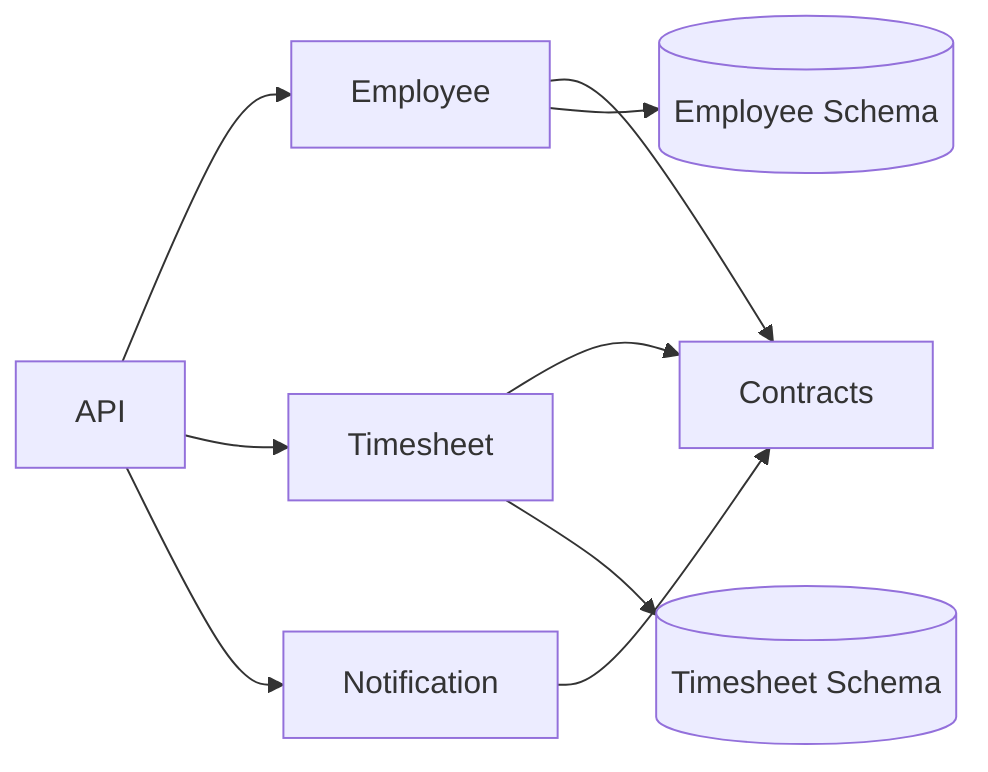
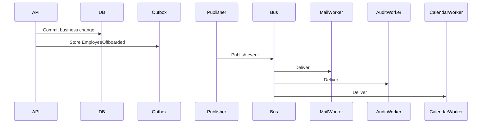
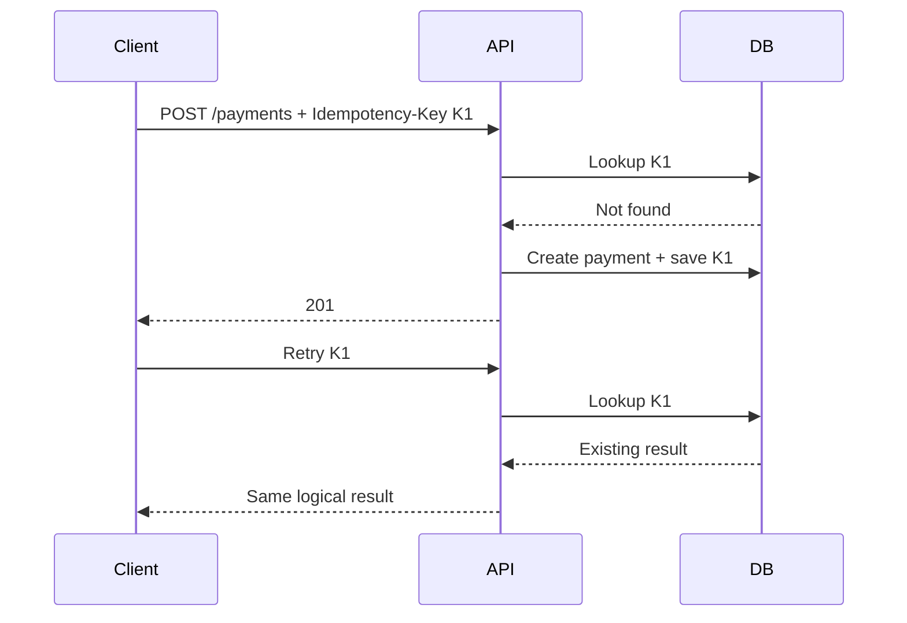
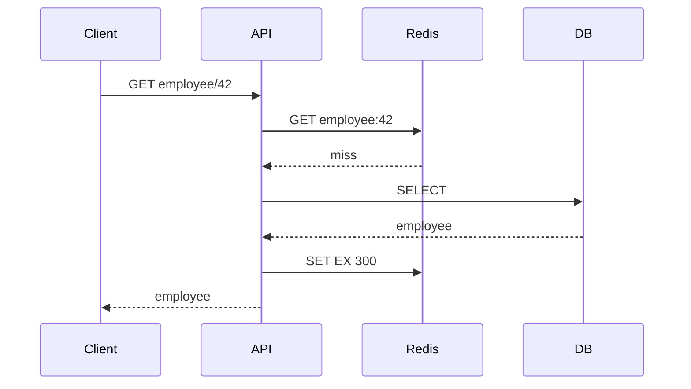
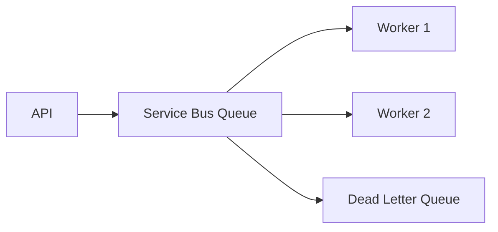
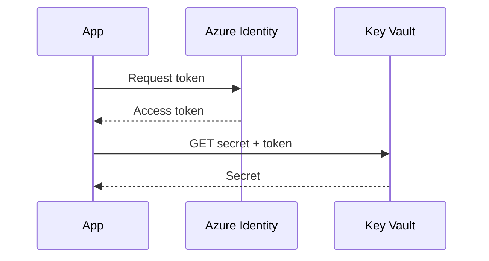
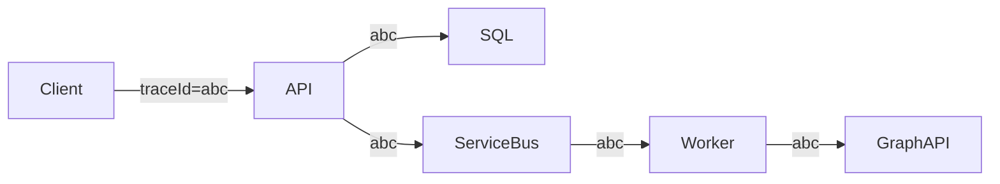
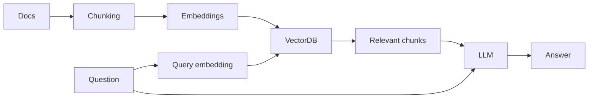
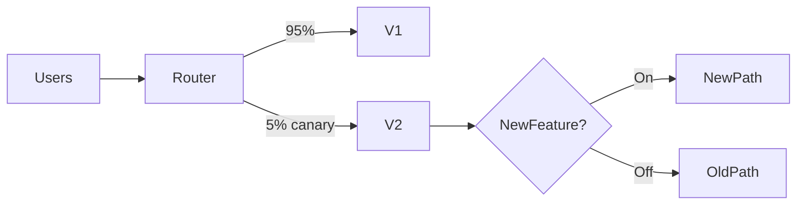

# Daily Knowledge Sharing — 2026-08-18

## Today’s Topics

1. Modular Monolith — chia boundary rõ mà chưa cần Microservices
2. Event-Driven Architecture — tách xử lý bằng event và chấp nhận eventual consistency
3. Idempotency — chống xử lý trùng trong API và background job
4. Optimistic Concurrency — bảo vệ dữ liệu khi nhiều request cùng sửa
5. Cache Aside với Redis — tăng tốc nhưng phải thiết kế failure và invalidation
6. Azure Service Bus — messaging tin cậy cho workload bất đồng bộ
7. Managed Identity + Azure Key Vault — bỏ secret khỏi application configuration
8. OpenTelemetry & Distributed Tracing — lần theo request xuyên nhiều thành phần
9. RAG — grounding LLM bằng dữ liệu riêng thay vì nhồi mọi thứ vào prompt
10. Feature Flags & Canary Deployment — giảm blast radius khi release

---

# 1. Modular Monolith

### 1. What is it?

Modular Monolith vẫn deploy thành **một application**, nhưng code được chia thành các module nghiệp vụ có boundary rõ ràng. Khác với monolith kiểu “mọi thứ gọi mọi thứ”, mỗi module sở hữu use case, domain model và data-access của mình; module khác chỉ đi qua contract công khai.

Điểm quan trọng: đây là **kiến trúc boundary**, không phải cách đặt folder đẹp.

### 2. Why does it exist?

Một monolith nhỏ thường phát triển nhanh, nhưng sau vài năm dễ thành tightly coupled: Order sửa trực tiếp bảng Payment, Notification dùng entity của Employee, service gọi chéo lẫn nhau. Microservices có thể tách boundary nhưng kéo theo network failure, distributed tracing, deployment, eventual consistency và operational cost.

Modular Monolith giữ simplicity của một process nhưng ép hệ thống hình thành boundary đủ tốt để scale codebase và team.

### 3. How does it work?



Module nên giao tiếp bằng command/query contract hoặc domain/integration event thay vì truy cập repository nội bộ của nhau.

### 4. Practical example

```csharp
public interface IEmployeeModule
{
    Task<EmployeeSummary?> GetEmployeeAsync(Guid id, CancellationToken ct);
}

// Timesheet chỉ biết contract, không biết EmployeeDbContext.
public sealed class CreateTimesheetHandler(IEmployeeModule employees)
{
    public async Task Handle(Guid employeeId, CancellationToken ct)
    {
        var employee = await employees.GetEmployeeAsync(employeeId, ct)
            ?? throw new InvalidOperationException("Employee not found");
        // create timesheet...
    }
}
```

### 5. Real production scenario

Một HR SaaS có Employee, Timesheet, Offboarding và Notification. Ban đầu cùng một deployable để vận hành đơn giản. Khi Offboarding tăng tải hoặc cần release độc lập, boundary đã rõ nên có thể extract module đó thành service mà không phải bóc một “big ball of mud”.

### 6. Common mistakes

Tạo project/module nhưng vẫn inject `DbContext` của module khác; dùng chung toàn bộ entity; shared library trở thành nơi chứa business logic; tạo event cho mọi method call dù không có nhu cầu decoupling; chia module theo technical layer thay vì business capability.

### 7. Trade-offs

**Advantages:** deployment đơn giản, transaction local dễ, debug thuận tiện, ít infrastructure hơn Microservices.

**Costs / Risks:** vẫn scale/deploy theo application; boundary chỉ được bảo vệ bằng discipline/tooling; module lớn có thể tiếp tục coupling nếu review kém.

### 8. Junior → Middle → Senior understanding

**Junior:** hiểu module là business boundary, không chỉ folder.

**Middle:** biết thiết kế public contract, dependency direction và tránh cross-module database access.

**Senior / Technical Lead:** quyết định module boundary, ownership, transaction boundary và khi nào một module thực sự đáng extract thành service.

### 9. Key takeaway

- Modular Monolith thường là bước khởi đầu tốt hơn Microservices cho hệ thống chưa cần distributed deployment.
- Boundary tốt quan trọng hơn số project trong solution.
- Thiết kế module sao cho việc tách service sau này là lựa chọn, không phải mục tiêu bắt buộc.

---

# 2. Event-Driven Architecture

### 1. What is it?

Event-Driven Architecture (EDA) để một thành phần phát thông báo rằng **một sự kiện đã xảy ra**, còn consumer tự quyết định phản ứng. Producer không cần biết tất cả consumer.

`EmployeeOffboarded` là fact đã xảy ra; nó khác command như `SendOffboardingEmail`, vốn yêu cầu một hành động cụ thể.

### 2. Why does it exist?

Nếu API phải gọi tuần tự Mail, Audit, Calendar, Notification, một dependency chậm có thể làm cả request thất bại. Coupling cũng tăng vì producer phải biết mọi downstream service.

EDA cho phép tách lifecycle và scale consumer độc lập, đổi lại phải xử lý eventual consistency và duplicate delivery.

### 3. How does it work?



Production thường kết hợp **Transactional Outbox** để tránh tình trạng DB commit thành công nhưng publish message thất bại.

### 4. Practical example

```csharp
public record EmployeeOffboarded(Guid EmployeeId, DateTimeOffset At);

// Trong cùng transaction với business update
context.OutboxMessages.Add(new OutboxMessage
{
    Type = nameof(EmployeeOffboarded),
    Payload = JsonSerializer.Serialize(new EmployeeOffboarded(id, clock.UtcNow))
});
await context.SaveChangesAsync(ct);
```

### 5. Real production scenario

Khi nhân viên nghỉ việc, core service cập nhật trạng thái. Sau đó các consumer độc lập xử lý Exchange Online, revoke permission, audit và notification. Mail service tạm lỗi không được rollback trạng thái nhân viên đã commit.

### 6. Common mistakes

Publish trước khi DB commit; giả định message chỉ đến một lần; event chứa toàn bộ internal entity; không version schema; không có dead-letter handling; dùng EDA cho workflow cần synchronous consistency tuyệt đối.

### 7. Trade-offs

**Advantages:** loose coupling, scale độc lập, hấp thụ traffic burst, resilience tốt hơn.

**Costs / Risks:** eventual consistency, ordering, duplicate, observability và debugging phức tạp hơn.

### 8. Junior → Middle → Senior understanding

**Junior:** phân biệt command và event.

**Middle:** implement consumer idempotent, retry, DLQ và correlation ID.

**Senior / Technical Lead:** quyết định consistency boundary, delivery semantics, event contract/versioning và recovery strategy.

### 9. Key takeaway

- Event là fact, không phải RPC trá hình.
- “At least once” nghĩa là consumer phải chịu được duplicate.
- Outbox thường cần thiết khi business data và event phải cùng tính đúng đắn.

---

# 3. Idempotency

### 1. What is it?

Một operation idempotent có thể được gửi lại nhiều lần nhưng **business effect chỉ xảy ra một lần**. Đây là yêu cầu quan trọng cho payment, order creation, webhook và message consumer.

### 2. Why does it exist?

Distributed system không thể luôn biết request trước đã thất bại hay chỉ response bị mất. Client timeout rồi retry có thể tạo hai payment. “Không retry” cũng không ổn vì transient failure là bình thường.

### 3. How does it work?



Key phải được lưu durable và thường gắn với caller + operation + request hash.

### 4. Practical example

```csharp
public async Task<IResult> CreatePayment(
    string idempotencyKey, CreatePaymentRequest request, CancellationToken ct)
{
    var existing = await db.IdempotencyRecords
        .SingleOrDefaultAsync(x => x.Key == idempotencyKey, ct);
    if (existing is not null)
        return Results.Json(existing.Response, statusCode: 200);

    var payment = Payment.Create(request.Amount);
    db.Payments.Add(payment);
    db.IdempotencyRecords.Add(IdempotencyRecord.From(idempotencyKey, payment));
    await db.SaveChangesAsync(ct);
    return Results.Created($"/payments/{payment.Id}", payment);
}
```

Database cần unique constraint trên idempotency key để chống race condition.

### 5. Real production scenario

Mobile gọi API thanh toán, mạng chập chờn khiến response mất. Retry cùng key phải trả lại payment cũ, không charge lần hai.

### 6. Common mistakes

Chỉ check key bằng `SELECT` nhưng không có unique constraint; lưu key trong memory; cho cùng key đi với payload khác; expiry quá ngắn; nhầm HTTP idempotency với business idempotency.

### 7. Trade-offs

**Advantages:** retry an toàn, giảm duplicate side effect.

**Costs / Risks:** thêm storage, cleanup, concurrency handling và quy tắc retention.

### 8. Junior → Middle → Senior understanding

**Junior:** hiểu retry có thể tạo duplicate.

**Middle:** thiết kế key store, unique constraint và replay response.

**Senior / Technical Lead:** xác định idempotency boundary, retention, conflict semantics và end-to-end behavior qua nhiều service.

### 9. Key takeaway

- Retry và idempotency phải được thiết kế cùng nhau.
- Unique constraint là lớp bảo vệ cuối cùng trước concurrent duplicate.
- Side effect bên ngoài cũng cần idempotency strategy riêng.

---

# 4. Optimistic Concurrency với EF Core

### 1. What is it?

Optimistic Concurrency giả định conflict hiếm nên không giữ lock dài. Khi update, hệ thống kiểm tra dữ liệu có thay đổi kể từ lúc đọc hay không; nếu có thì từ chối update stale.

### 2. Why does it exist?

Hai admin cùng mở Employee. A đổi email, B đổi department từ snapshot cũ. Nếu update mù, B có thể overwrite thay đổi của A — lost update.

### 3. How does it work?

SQL Server thường dùng `rowversion`:

```sql
UPDATE Employees
SET Department = @p0
WHERE Id = @id AND RowVersion = @originalVersion;
```

Nếu affected rows = 0, EF Core ném `DbUpdateConcurrencyException`.

### 4. Practical example

```csharp
public class Employee
{
    public Guid Id { get; set; }
    public string Department { get; set; } = null!;
    [Timestamp]
    public byte[] RowVersion { get; set; } = null!;
}

try
{
    await db.SaveChangesAsync(ct);
}
catch (DbUpdateConcurrencyException)
{
    return Results.Conflict(new { message = "Data was changed by another user." });
}
```

### 5. Real production scenario

Portal HR có nhiều admin. UI gửi `rowVersion` cùng update command. Nếu record đã đổi, API trả 409 để UI reload hoặc hiển thị conflict thay vì silently overwrite.

### 6. Common mistakes

Bắt exception rồi retry cùng stale values; không đưa concurrency token qua DTO; dùng timestamp thời gian có độ chính xác không đủ; áp dụng pessimistic lock cho mọi edit form; trả 500 thay vì business conflict.

### 7. Trade-offs

**Advantages:** không giữ lock dài, throughput tốt khi conflict hiếm.

**Costs / Risks:** caller phải resolve conflict; workload có contention cao có thể retry nhiều.

### 8. Junior → Middle → Senior understanding

**Junior:** hiểu lost update.

**Middle:** implement concurrency token và 409 handling.

**Senior / Technical Lead:** chọn optimistic hay pessimistic dựa trên contention, criticality và UX conflict resolution.

### 9. Key takeaway

- Optimistic concurrency phát hiện stale write chứ không ngăn người khác sửa.
- Conflict là business condition, không nhất thiết là server error.
- Retry mù có thể phá chính cơ chế bảo vệ concurrency.

---

# 5. Cache Aside với Redis

### 1. What is it?

Cache Aside để application tự quản lý cache: đọc cache trước; miss thì đọc DB rồi populate cache. Khi write, thường update DB rồi invalidate cache.

### 2. Why does it exist?

Dữ liệu đọc nhiều nhưng thay đổi ít có thể gây tải DB và latency không cần thiết. Redis đưa dữ liệu nóng gần application hơn, nhưng cache tạo thêm một bản sao dữ liệu nên consistency trở thành vấn đề kiến trúc.

### 3. How does it work?



Khi Redis unavailable, hệ thống nên cân nhắc fallback DB thay vì biến cache thành hard dependency cho dữ liệu vốn có trong DB.

### 4. Practical example

```csharp
var key = $"employee:{id}";
var cached = await cache.GetStringAsync(key, ct);
if (cached is not null)
    return JsonSerializer.Deserialize<EmployeeDto>(cached)!;

var dto = await db.Employees.AsNoTracking()
    .Where(x => x.Id == id)
    .Select(x => new EmployeeDto(x.Id, x.Name))
    .SingleAsync(ct);

await cache.SetStringAsync(key, JsonSerializer.Serialize(dto),
    new DistributedCacheEntryOptions { AbsoluteExpirationRelativeToNow = TimeSpan.FromMinutes(5) }, ct);
return dto;
```

### 5. Real production scenario

Employee profile được đọc bởi nhiều màn hình nhưng thay đổi ít. Cache giảm DB read. Khi HR update profile, API commit DB rồi xóa `employee:{id}` để request tiếp theo rebuild cache.

### 6. Common mistakes

TTL vô hạn; cache dữ liệu nhạy cảm không kiểm soát; key không có tenant/version; cache stampede khi key hot hết hạn; coi Redis là luôn available; invalidate trước DB commit rồi transaction rollback.

### 7. Trade-offs

**Advantages:** latency thấp, giảm DB load, scale read tốt.

**Costs / Risks:** stale data, invalidation complexity, Redis cost, serialization và operational dependency.

### 8. Junior → Middle → Senior understanding

**Junior:** hiểu hit/miss/TTL.

**Middle:** implement invalidation, fallback và key convention.

**Senior / Technical Lead:** xác định consistency tolerance, stampede protection, cache ownership, memory budget và behavior khi Redis outage.

### 9. Key takeaway

- Cache là optimization, không phải nguồn dữ liệu mặc định.
- Invalidation khó hơn `GET/SET`.
- Luôn thiết kế behavior khi Redis chậm hoặc unavailable.

---

# 6. Azure Service Bus

### 1. What is it?

Azure Service Bus là managed enterprise message broker hỗ trợ queue, topic/subscription, dead-letter queue, scheduled delivery, sessions và duplicate detection.

### 2. Why does it exist?

HTTP synchronous không phù hợp với mọi workload. File processing 5 phút hoặc Microsoft 365 integration có thể bị throttling. Queue giúp API nhận request nhanh, buffer workload và worker xử lý theo khả năng.

### 3. How does it work?



Consumer nhận message theo lock; xử lý xong thì complete. Nếu fail, message được redeliver; vượt `MaxDeliveryCount` có thể vào DLQ.

### 4. Practical example

```csharp
var client = new ServiceBusClient(
    "namespace.servicebus.windows.net",
    new DefaultAzureCredential());
var sender = client.CreateSender("offboarding");
await sender.SendMessageAsync(new ServiceBusMessage(
    BinaryData.FromObjectAsJson(new { EmployeeId = id })), ct);
```

Production nên dùng Managed Identity thay connection string khi có thể.

### 5. Real production scenario

API tạo offboarding request rồi enqueue job. Worker gọi Exchange Online/Microsoft Graph. Nếu Graph trả 429, worker retry có backoff mà không giữ HTTP request của user.

### 6. Common mistakes

Không idempotent consumer; retry vô hạn; không monitor DLQ; message quá lớn; dùng queue như database; lock duration không phù hợp job dài; không propagate correlation ID.

### 7. Trade-offs

**Advantages:** decoupling, buffering, managed reliability, scale consumer.

**Costs / Risks:** eventual consistency, duplicate, messaging cost, thêm operational surface.

### 8. Junior → Middle → Senior understanding

**Junior:** hiểu producer/queue/consumer.

**Middle:** xử lý retry, lock, DLQ và idempotency.

**Senior / Technical Lead:** chọn queue/topic/session, throughput tier, partitioning, ordering và failure-recovery strategy.

### 9. Key takeaway

- Queue giúp hấp thụ burst và tách lifecycle.
- Consumer phải giả định message có thể đến lại.
- DLQ phải có dashboard và quy trình xử lý, không phải “thùng rác”.

---

# 7. Managed Identity + Azure Key Vault

### 1. What is it?

Managed Identity cấp identity do Azure quản lý cho workload. Application dùng identity đó để lấy token truy cập Key Vault, Storage, Service Bus, SQL... mà không cần lưu client secret trong config.

### 2. Why does it exist?

Secret trong `appsettings.json`, pipeline variable hoặc environment variable có thể leak và phải rotate. Managed Identity chuyển bài toán từ “giữ mật khẩu an toàn” sang “cấp đúng quyền cho identity”.

### 3. How does it work?



### 4. Practical example

```csharp
var credential = new DefaultAzureCredential();
var client = new SecretClient(
    new Uri("https://my-vault.vault.azure.net/"), credential);
var secret = await client.GetSecretAsync("ThirdPartyApiKey", cancellationToken: ct);
```

Local dev có thể dùng Azure CLI/Visual Studio credential; deployed App Service dùng Managed Identity qua cùng `DefaultAzureCredential` chain.

### 5. Real production scenario

App Service cần đọc third-party API key từ Key Vault và gửi message vào Service Bus. App có managed identity với quyền tối thiểu; không có Service Bus connection string trong deployment settings.

### 6. Common mistakes

Cấp Owner/Contributor thay vì data-plane role tối thiểu; dùng secret dù service hỗ trợ Entra authentication; quên network restriction/private endpoint; log secret; mỗi request lại gọi Key Vault không cache hợp lý.

### 7. Trade-offs

**Advantages:** không rotate credential ứng dụng, giảm secret exposure, audit/RBAC tốt.

**Costs / Risks:** phụ thuộc identity/RBAC/network configuration; local development cần credential chain rõ ràng; Key Vault call có latency/cost.

### 8. Junior → Middle → Senior understanding

**Junior:** hiểu secret không nên hard-code.

**Middle:** cấu hình identity, RBAC và `DefaultAzureCredential`.

**Senior / Technical Lead:** thiết kế least privilege, network isolation, secret lifecycle, cross-subscription/tenant access và break-glass strategy.

### 9. Key takeaway

- Nếu Azure service hỗ trợ identity-based auth, ưu tiên nó hơn shared secret.
- Managed Identity không tự cấp quyền; RBAC vẫn phải đúng.
- Security gồm identity + authorization + networking + audit.

---

# 8. OpenTelemetry & Distributed Tracing

### 1. What is it?

OpenTelemetry là chuẩn/vendor-neutral để instrument **traces, metrics và logs**. Distributed trace nối các span của cùng một request qua API, database, queue và worker.

### 2. Why does it exist?

Log riêng lẻ thường trả lời “service này báo lỗi gì” nhưng khó trả lời “request của user đi qua những đâu và 2.8 giây mất ở đâu”. Khi hệ thống phân tán, correlation trở thành bắt buộc.

### 3. How does it work?



Mỗi operation tạo span; trace context được propagate qua HTTP headers/message properties.

### 4. Practical example

```csharp
builder.Services.AddOpenTelemetry()
    .WithTracing(t => t
        .AddAspNetCoreInstrumentation()
        .AddHttpClientInstrumentation()
        .AddEntityFrameworkCoreInstrumentation()
        .AddOtlpExporter());
```

Custom activity chỉ nên thêm cho business operation có giá trị quan sát.

### 5. Real production scenario

User báo offboarding mất 20 giây. Trace cho thấy API 150 ms, Service Bus chờ 200 ms, worker gọi Graph 18 giây vì throttling/retry. Team điều tra được bottleneck mà không grep log thủ công qua nhiều service.

### 6. Common mistakes

Không propagate trace context qua queue; tag chứa PII; sampling quá thấp làm mất incident hiếm; instrument mọi method gây noise/cost; chỉ có trace mà không có metric/alert.

### 7. Trade-offs

**Advantages:** vendor-neutral, end-to-end visibility, giảm MTTR.

**Costs / Risks:** telemetry volume/cost, sampling complexity, PII risk và instrumentation overhead.

### 8. Junior → Middle → Senior understanding

**Junior:** hiểu trace/span/correlation ID.

**Middle:** instrument HTTP/DB/message và query trace.

**Senior / Technical Lead:** thiết kế telemetry schema, sampling, retention, cost budget, SLO linkage và privacy policy.

### 9. Key takeaway

- Logs nói “điều gì”, metrics nói “bao nhiêu”, traces nói “đi qua đâu”.
- Context propagation quyết định distributed tracing có thực sự distributed hay không.
- Observability phải phục vụ incident investigation, không phải thu thập dữ liệu vô hạn.

---

# 9. RAG — Retrieval-Augmented Generation

### 1. What is it?

RAG cho LLM truy xuất các đoạn dữ liệu liên quan từ nguồn ngoài rồi dùng chúng làm context trước khi sinh câu trả lời. Nó phù hợp khi model cần kiến thức riêng, cập nhật hoặc có nguồn kiểm chứng.

### 2. Why does it exist?

Prompt không thể chứa toàn bộ knowledge base. Fine-tuning cũng không phải cơ chế lý tưởng để cập nhật facts liên tục. RAG tách **knowledge retrieval** khỏi **language generation**.

### 3. How does it work?



Production thường thêm metadata filter, hybrid search, reranking và citation mapping.

### 4. Practical example

```csharp
var chunks = await search.FindRelevantAsync(
    query: "Quy trình offboarding mailbox?",
    topK: 5,
    tenantId: tenantId,
    ct);

var context = string.Join("\n\n", chunks.Select(x => x.Text));
var prompt = $"""
Answer only from the supplied context. If evidence is insufficient, say so.
Context:
{context}
Question: Quy trình offboarding mailbox?
""";
```

### 5. Real production scenario

AI assistant nội bộ trả lời từ runbook, technical design và SOP. Retrieval phải filter theo tenant/ACL trước khi gửi chunk vào LLM; model không được tự quyết định quyền truy cập tài liệu.

### 6. Common mistakes

Chunk quá lớn/nhỏ; chỉ vector search dù keyword quan trọng; không metadata filter; đưa secret/PII vào context; không đánh giá retrieval riêng; tin rằng RAG loại bỏ hallucination; prompt injection từ document.

### 7. Trade-offs

**Advantages:** knowledge cập nhật nhanh, có thể dẫn nguồn, không cần retrain model.

**Costs / Risks:** retrieval quality quyết định answer quality; thêm vector/search infrastructure, latency và token cost; security phức tạp hơn.

### 8. Junior → Middle → Senior understanding

**Junior:** hiểu retrieve trước, generate sau.

**Middle:** implement chunking, embedding, vector/hybrid search và evaluation.

**Senior / Technical Lead:** thiết kế ACL, ingestion freshness, retrieval metrics, prompt-injection defense, cost/latency budget và fallback.

### 9. Key takeaway

- RAG không chỉ là “vector DB + LLM”; retrieval pipeline mới là phần quyết định.
- Authorization phải xảy ra bằng deterministic code trước khi context đến model.
- Đánh giá retrieval và generation riêng để biết lỗi nằm ở đâu.

---

# 10. Feature Flags & Canary Deployment

### 1. What is it?

Feature Flag tách **deploy code** khỏi **enable behavior**. Canary Deployment đưa version mới tới một phần nhỏ traffic/users trước khi mở rộng.

Hai kỹ thuật kết hợp giúp release từng bước thay vì “all users at once”.

### 2. Why does it exist?

Test/staging không mô phỏng hoàn toàn production. Một release có bug performance hoặc compatibility chỉ xuất hiện dưới real traffic. Rollout 100% ngay lập tức làm blast radius tối đa.

### 3. How does it work?



Metrics/error rate được quan sát theo version/cohort. Nếu vượt guardrail, rollback traffic hoặc disable flag.

### 4. Practical example

```csharp
if (await featureManager.IsEnabledAsync("NewOffboardingFlow"))
    return await newFlow.ExecuteAsync(command, ct);

return await oldFlow.ExecuteAsync(command, ct);
```

Flag nên có owner, expiry date và cleanup plan.

### 5. Real production scenario

Team thay logic đồng bộ mailbox. Deploy code mới nhưng chỉ enable cho internal tenant, sau đó 5%, 25%, 50%, 100%. Theo dõi error rate, latency và failed offboarding. Nếu Graph errors tăng, disable flag ngay mà không cần build lại artifact.

### 6. Common mistakes

Flag tồn tại vĩnh viễn; nested flags tạo combinatorial complexity; canary nhưng không có metric guardrail; database migration không backward-compatible; rollout dựa vào “không thấy complaint” thay vì telemetry; dùng flag như authorization.

### 7. Trade-offs

**Advantages:** giảm blast radius, rollback behavior nhanh, progressive validation.

**Costs / Risks:** code path tăng, testing matrix lớn, flag debt và infrastructure complexity.

### 8. Junior → Middle → Senior understanding

**Junior:** hiểu deploy khác release.

**Middle:** implement flag an toàn, test cả on/off và quan sát cohort.

**Senior / Technical Lead:** thiết kế rollout stages, guardrail/SLO, backward-compatible migration, rollback criteria và flag lifecycle governance.

### 9. Key takeaway

- Deploy code không đồng nghĩa phải bật feature ngay.
- Canary chỉ hữu ích khi có metric và tiêu chí rollback rõ.
- Feature flag phải được xóa sau khi rollout ổn định để tránh technical debt.