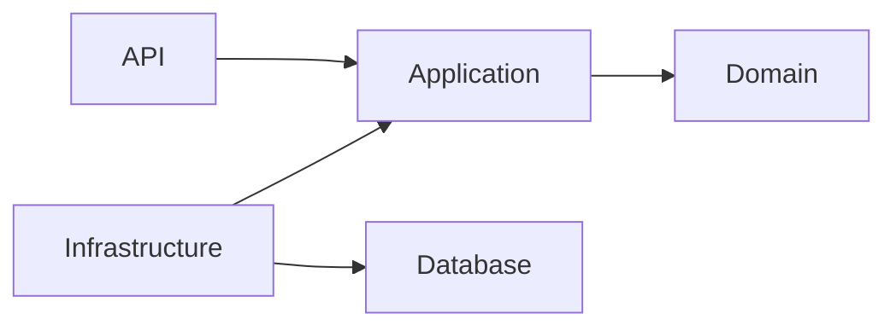
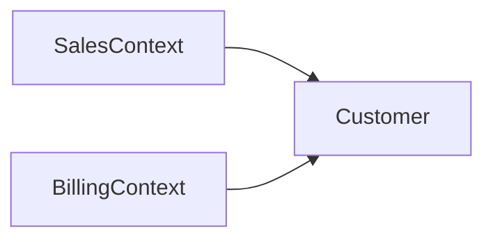
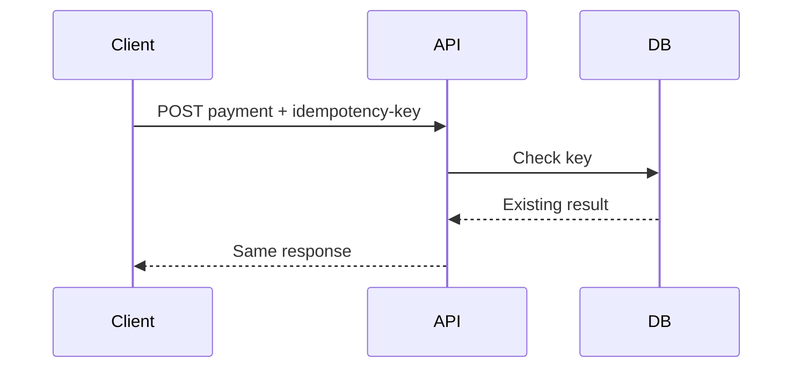
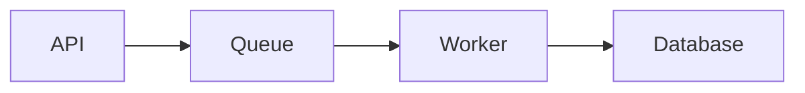
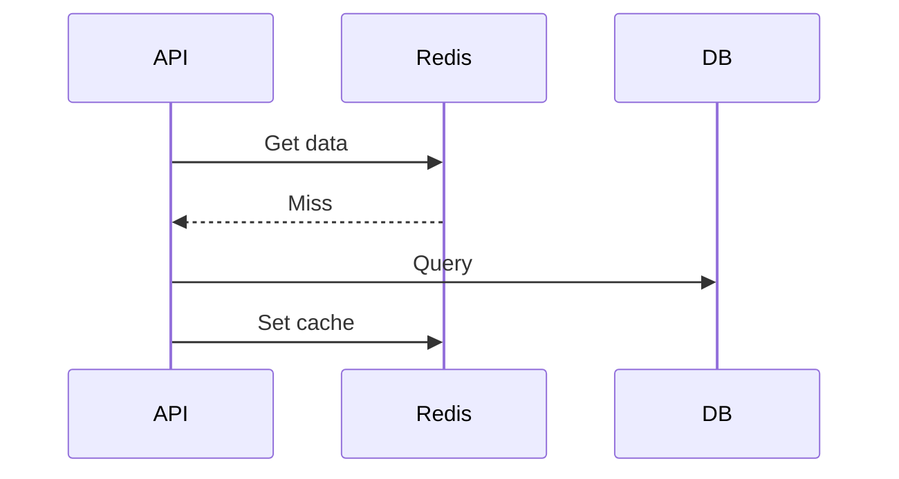
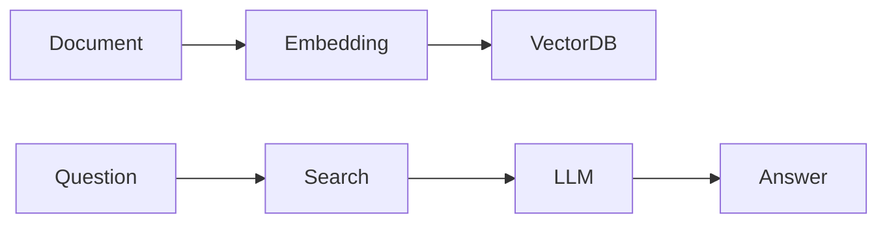
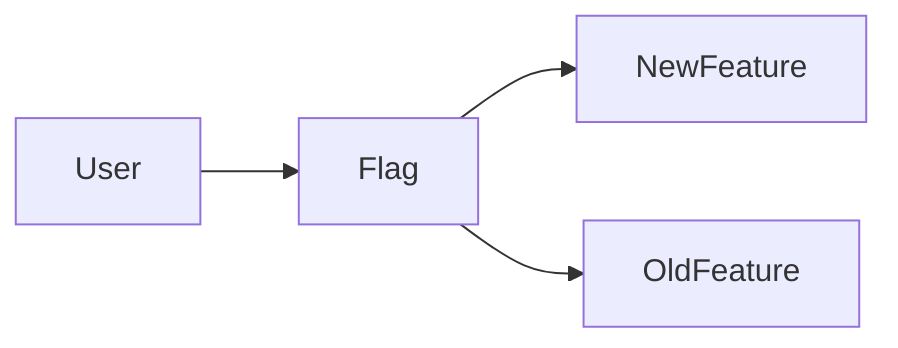

# Daily Knowledge Sharing — 2026-08-18

## Today’s Topics

1. Clean Architecture và ranh giới phụ thuộc
2. Domain-Driven Design: Bounded Context
3. Idempotency trong REST API
4. EF Core Optimistic Concurrency
5. Azure Service Bus và xử lý bất đồng bộ
6. Managed Identity trong Azure
7. Redis Cache Aside Pattern
8. OpenTelemetry và Distributed Tracing
9. RAG Pipeline cho AI Application
10. Feature Flags trong Production Release

---

# 1. Clean Architecture và ranh giới phụ thuộc

### 1. What is it?
Clean Architecture là cách tổ chức hệ thống theo business rule ở trung tâm và các chi tiết kỹ thuật ở bên ngoài. Mục tiêu là giữ Domain không phụ thuộc database, framework hay external service.

### 2. Why does it exist?
Nếu business logic nằm trực tiếp trong Controller hoặc EF Core Entity, hệ thống nhanh chóng bị coupling. Khi đổi database, API framework hoặc tích hợp mới, chi phí thay đổi tăng cao.

### 3. How does it work?



Dependency chỉ đi vào trong. Domain không biết Infrastructure tồn tại.

### 4. Practical example
ASP.NET Core API gọi Application Service, service xử lý use case rồi gọi abstraction repository.

```csharp
public interface IOrderRepository
{
    Task<Order?> GetAsync(Guid id);
}
```

### 5. Real production scenario
Hệ thống SaaS có thể thay SQL Server bằng PostgreSQL mà không thay đổi nghiệp vụ.

### 6. Common mistakes
- Tạo quá nhiều layer nhưng không có boundary thực sự.
- Đưa business logic vào Controller.
- Domain gọi trực tiếp external API.

### 7. Trade-offs
Ưu điểm: dễ test, dễ mở rộng.
Rủi ro: nhiều abstraction, code nhiều hơn.

### 8. Junior → Middle → Senior
Junior hiểu trách nhiệm layer.
Middle thiết kế dependency injection.
Senior quyết định boundary phù hợp với business.

### 9. Key takeaway
Architecture tốt không phải nhiều folder mà là kiểm soát dependency.

---

# 2. Domain-Driven Design: Bounded Context

DDD chia hệ thống lớn thành các vùng business độc lập gọi là Bounded Context.

Vấn đề lớn nhất của hệ thống enterprise là cùng một từ nhưng nhiều ý nghĩa. Ví dụ Customer trong Sales khác Customer trong Billing.



Ví dụ .NET có thể tách module Sales và Payment thành hai domain riêng.

Sai lầm phổ biến là chia theo technical layer thay vì business capability.

Trade-off: nhiều module giúp rõ ràng nhưng cần quản lý integration.

Senior cần biết khi nào nên tách context và khi nào giữ chung.

Key takeaway: boundary nên phản ánh business, không chỉ code structure.

---

# 3. Idempotency trong REST API

Idempotency đảm bảo gọi cùng một request nhiều lần vẫn tạo ra một kết quả an toàn.

Thanh toán là ví dụ điển hình: retry không được tạo hai giao dịch.

Flow:



ASP.NET Core thường lưu key và response trong database hoặc Redis.

Sai lầm: chỉ kiểm tra HTTP status mà không lưu trạng thái xử lý.

Trade-off: tăng storage nhưng giảm lỗi duplicate.

Junior hiểu khái niệm retry. Senior thiết kế distributed consistency.

Key takeaway: Retry chỉ an toàn khi operation có idempotency.

---

# 4. EF Core Optimistic Concurrency

Optimistic concurrency giả định conflict hiếm và kiểm tra version trước khi update.

Ví dụ dùng RowVersion trong SQL Server.

```csharp
public byte[] RowVersion { get; set; }
```

Khi user A và B cùng sửa dữ liệu, hệ thống phát hiện conflict thay vì ghi đè.

Sai lầm: không xử lý DbUpdateConcurrencyException.

Trade-off: hiệu năng tốt hơn lock dài nhưng cần logic merge.

Key takeaway: concurrency phải được thiết kế, không để database tự xử lý.

---

# 5. Azure Service Bus và xử lý bất đồng bộ

Azure Service Bus giúp tách producer và consumer.



Ví dụ gửi email, xử lý file, đồng bộ Microsoft Graph.

Sai lầm: không có retry, dead-letter queue, monitoring.

Trade-off: tăng reliability nhưng dữ liệu có thể eventual consistency.

Key takeaway: message queue giúp hệ thống chịu tải tốt hơn.

---

# 6. Managed Identity trong Azure

Managed Identity cho phép service Azure authenticate mà không lưu secret.

App Service --> Entra ID --> Key Vault

Ví dụ ASP.NET Core đọc secret từ Azure Key Vault.

Sai lầm: vẫn lưu connection string trong appsettings.

Trade-off: bảo mật cao hơn nhưng cần cấu hình Azure RBAC.

Key takeaway: tránh quản lý credential thủ công.

---

# 7. Redis Cache Aside Pattern

Cache Aside là ứng dụng tự quản lý cache.



Phù hợp dữ liệu đọc nhiều như product, configuration.

Không nên cache dữ liệu thay đổi liên tục.

Trade-off: nhanh hơn nhưng cache invalidation khó.

Key takeaway: cache strategy quan trọng hơn việc dùng Redis.

---

# 8. OpenTelemetry và Distributed Tracing

OpenTelemetry chuẩn hóa logs, metrics và traces.

Production flow:

```text
Request ID
 API
  |
 Service A
  |
 Service B
  |
 Database
```

Giúp tìm bottleneck trong microservices.

Sai lầm: chỉ log message mà không có correlation id.

Trade-off: observability tăng nhưng có overhead.

Key takeaway: production cần biết request đi qua đâu.

---

# 9. RAG Pipeline cho AI Application

RAG kết hợp LLM với dữ liệu riêng của doanh nghiệp.

Flow:



Ví dụ chatbot đọc tài liệu nội bộ.

Sai lầm: đưa quá nhiều context làm tăng cost.

Trade-off: chính xác hơn nhưng cần quản lý retrieval.

Key takeaway: AI tốt cần dữ liệu tốt và context phù hợp.

---

# 10. Feature Flags trong Production Release

Feature Flag cho phép bật/tắt tính năng mà không cần deploy lại.

Ví dụ canary release cho nhóm user nhỏ.



Sai lầm: để flag tồn tại vĩnh viễn.

Trade-off: release an toàn hơn nhưng tăng complexity.

Key takeaway: deployment và release là hai khái niệm khác nhau.
