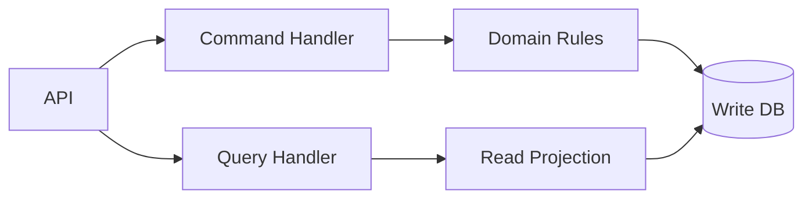
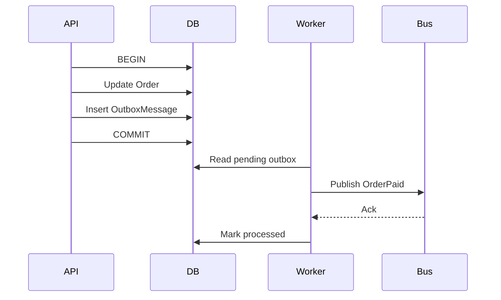
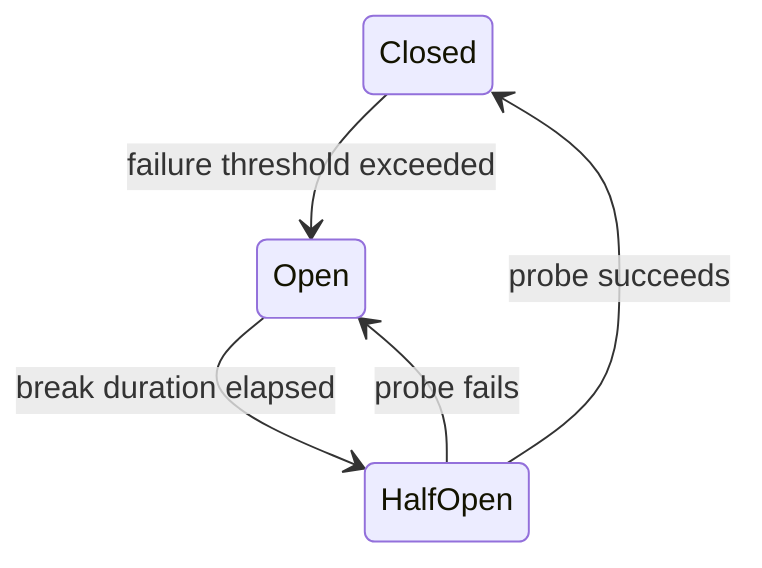
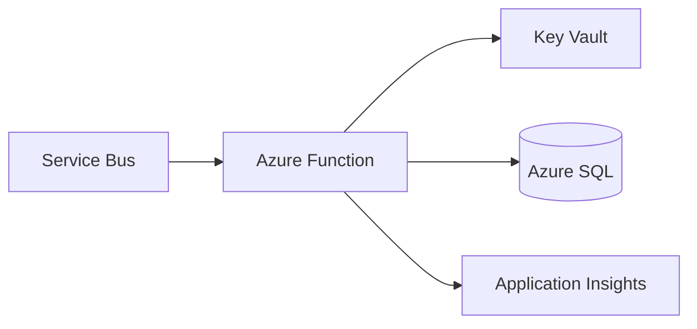
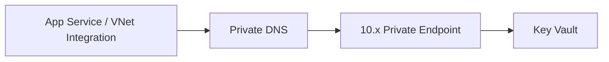
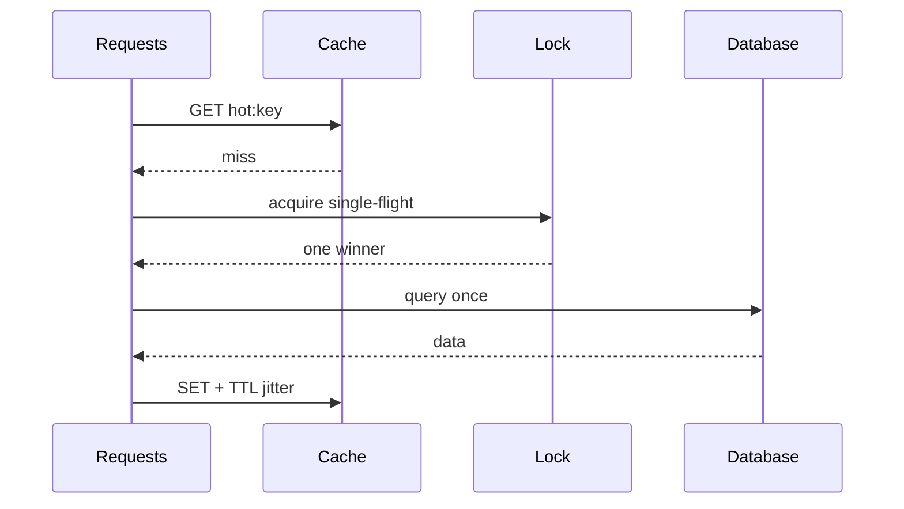
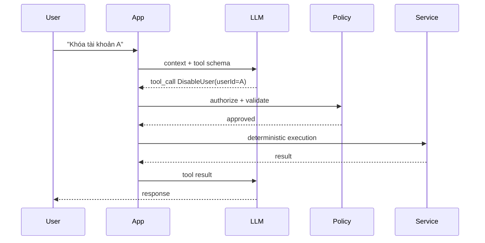
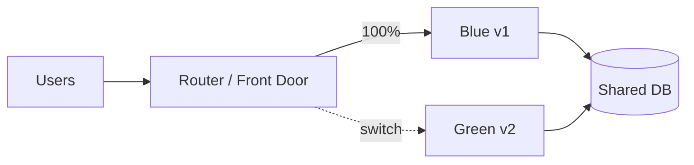

# Daily Knowledge Sharing — 2026-08-18

## Today’s Topics

1. CQRS — tách read/write theo nhu cầu thay vì theo “mốt kiến trúc”
2. Outbox Pattern — publish event mà không đánh đổi tính nhất quán với database
3. Isolation Levels — hiểu anomaly trước khi tăng mức khóa
4. Circuit Breaker — ngừng gọi dependency đang hỏng để hệ thống tự bảo vệ
5. Azure Functions — chọn serverless đúng workload, tránh biến Function thành web server khó vận hành
6. Azure Private Endpoint — đưa PaaS vào đường mạng private mà không nhầm với firewall
7. Cache Stampede — ngăn hàng nghìn request cùng xuyên cache xuống database
8. SLI/SLO/Error Budget — biến “hệ thống phải ổn định” thành mục tiêu đo được
9. Structured Output + Tool Calling — để LLM đề xuất, deterministic code kiểm soát hành động
10. Blue-Green Deployment — release có đường rollback nhanh và hiểu đúng rủi ro database

---

# 1. CQRS — tách read/write theo nhu cầu

### 1. What is it?

CQRS (Command Query Responsibility Segregation) tách operation làm thay đổi state (**Command**) khỏi operation chỉ đọc state (**Query**). Điều quan trọng: CQRS không đồng nghĩa với hai database, event sourcing hay microservices. Một ASP.NET Core application dùng cùng một SQL Server vẫn có thể áp dụng CQRS ở application layer.

### 2. Why does it exist?

Read và write thường tối ưu theo hai hướng khác nhau. Write cần validation, invariant, transaction và concurrency control; read cần projection gọn, join hiệu quả, pagination và đôi khi cache. Ép cả hai đi qua một generic repository/model thường tạo abstraction cồng kềnh.

### 3. How does it work?



Command như `ApproveTimesheet` tải state cần thiết, kiểm tra business rule rồi commit. Query như `GetTimesheetSummary` có thể select thẳng DTO, không cần hydrate toàn bộ aggregate.

### 4. Practical example

```csharp
public sealed record ApproveTimesheet(Guid Id, Guid ApproverId);

public async Task Handle(ApproveTimesheet cmd, CancellationToken ct)
{
    var item = await db.Timesheets.SingleAsync(x => x.Id == cmd.Id, ct);
    item.Approve(cmd.ApproverId, DateTimeOffset.UtcNow);
    await db.SaveChangesAsync(ct);
}

public Task<TimesheetDto?> Get(Guid id, CancellationToken ct) =>
    db.Timesheets.AsNoTracking()
      .Where(x => x.Id == id)
      .Select(x => new TimesheetDto(x.Id, x.Status, x.TotalHours))
      .SingleOrDefaultAsync(ct);
```

### 5. Real production scenario

Trong hệ thống timesheet, màn hình dashboard đọc hàng nghìn bản ghi với projection; approve chỉ sửa một aggregate và cần kiểm tra quyền, trạng thái, row version. Tách hai đường giúp query không bị ép qua domain model chỉ để hiển thị dữ liệu.

### 6. Common mistakes

- Tạo Command/Query/Handler cho mọi CRUD nhỏ khiến code ceremony tăng mạnh.
- Cho query mutate database.
- Dùng CQRS rồi mặc định phải có hai database.
- Đưa business rule vào controller/handler thay vì domain phù hợp.
- Tách read model nhưng không thiết kế consistency lag khi dùng read store riêng.

### 7. Trade-offs

**Advantages:** model đúng mục đích, query dễ tối ưu, write boundary rõ. **Costs / Risks:** nhiều type hơn, tracing khó hơn; nếu tách store sẽ xuất hiện eventual consistency và vận hành phức tạp.

### 8. Junior → Middle → Senior understanding

**Junior:** phân biệt command thay đổi state và query chỉ đọc. **Middle:** thiết kế handler, validation, transaction, projection và test. **Senior / Technical Lead:** quyết định CQRS ở mức nào, khi nào read store riêng đáng chi phí và cách xử lý consistency/failure.

### 9. Key takeaway

- CQRS là separation of responsibility, không phải bắt buộc distributed architecture.
- Chỉ tăng độ phức tạp khi read/write thực sự có nhu cầu khác nhau.
- Query nên tối ưu cho dữ liệu cần trả; command nên bảo vệ invariant.

---

# 2. Outbox Pattern — database commit và event publish đáng tin cậy

### 1. What is it?

Outbox Pattern lưu business change và message cần publish trong **cùng một database transaction**. Một worker sau đó đọc outbox và gửi message tới broker.

### 2. Why does it exist?

Naive flow `SaveChanges()` rồi `Publish()` có cửa sổ lỗi: DB commit thành công nhưng process crash trước publish. Đảo thứ tự cũng nguy hiểm: event đã publish nhưng transaction DB rollback. Distributed transaction thường không khả dụng hoặc quá đắt.

### 3. How does it work?



### 4. Practical example

```csharp
await using var tx = await db.Database.BeginTransactionAsync(ct);
order.MarkPaid();

db.OutboxMessages.Add(new OutboxMessage
{
    Id = Guid.NewGuid(),
    Type = "OrderPaid",
    Payload = JsonSerializer.Serialize(new { order.Id }),
    OccurredAtUtc = DateTimeOffset.UtcNow
});

await db.SaveChangesAsync(ct);
await tx.CommitAsync(ct);
```

Worker phải retry publish và consumer vẫn cần idempotent vì delivery thực tế thường là **at-least-once**.

### 5. Real production scenario

Payment API đánh dấu invoice Paid rồi cần gửi event cho email, accounting và loyalty. Nếu Service Bus tạm unavailable, payment vẫn commit; outbox worker publish lại khi broker hồi phục.

### 6. Common mistakes

- Insert outbox ở transaction khác business update.
- Xóa message ngay khi gửi mà chưa nhận broker acknowledgement.
- Tin rằng Outbox tạo exactly-once end-to-end.
- Không index `ProcessedAt/OccurredAt`, khiến polling ngày càng chậm.
- Không có retention/cleanup khiến bảng outbox phình vô hạn.

### 7. Trade-offs

**Advantages:** loại dual-write gap, chịu broker outage tốt. **Costs / Risks:** thêm worker, polling/CDC, duplicate delivery, cleanup và monitoring backlog.

### 8. Junior → Middle → Senior understanding

**Junior:** hiểu tại sao DB + message broker không phải một atomic operation. **Middle:** implement transaction, worker retry, idempotent consumer. **Senior / Technical Lead:** chọn polling hay CDC, SLA của event lag, partitioning, poison message và disaster recovery.

### 9. Key takeaway

- Outbox giải quyết atomicity của “state change + intent to publish”.
- Consumer vẫn phải idempotent.
- Outbox backlog là production signal cần monitor.

---

# 3. Database Isolation Levels — chọn consistency bằng hiểu anomaly

### 1. What is it?

Isolation level quy định transaction nhìn thấy thay đổi của transaction khác như thế nào. Nó là cân bằng giữa consistency và concurrency, không phải “càng cao càng tốt”.

### 2. Why does it exist?

Nhiều request chạy đồng thời có thể tạo dirty read, non-repeatable read, phantom hoặc lost update. Nếu serialize tất cả thì an toàn nhưng throughput và latency tệ.

### 3. How does it work?

```text
Read Uncommitted -> ít isolation, concurrency cao
Read Committed   -> default phổ biến
Repeatable Read  -> giữ ổn định row đã đọc
Serializable     -> gần như chạy tuần tự theo phạm vi dữ liệu
Snapshot/MVCC    -> đọc version thay vì chặn writer trong nhiều trường hợp
```

SQL Server và PostgreSQL có implementation khác nhau; phải hiểu engine đang dùng thay vì chỉ nhớ tên chuẩn SQL.

### 4. Practical example

Hai request cùng trừ tồn kho. Chỉ transaction chưa đủ nếu cả hai cùng đọc `Quantity = 1` rồi cùng update. Có thể dùng atomic SQL:

```sql
UPDATE Inventory
SET Quantity = Quantity - 1
WHERE ProductId = @id AND Quantity > 0;
```

Sau đó kiểm tra affected rows. Đây thường tốt hơn nâng toàn bộ transaction lên Serializable.

### 5. Real production scenario

Booking system có 1 slot cuối. Request A và B đến gần như cùng lúc. Thiết kế phải đảm bảo chỉ một request thắng bằng unique constraint, atomic update, optimistic concurrency hoặc lock phù hợp.

### 6. Common mistakes

- Nghĩ `BeginTransaction` tự động ngăn lost update.
- Chọn Serializable để “chắc chắn” rồi gặp blocking/deadlock.
- Dùng `NOLOCK` để chữa query chậm và chấp nhận dữ liệu sai mà không biết.
- Không retry transaction khi gặp serialization failure/deadlock.

### 7. Trade-offs

**Advantages của isolation cao:** reasoning consistency dễ hơn. **Costs / Risks:** lock lâu hơn, contention, deadlock hoặc retry nhiều hơn. MVCC giảm read/write blocking nhưng tạo version-storage cost và vẫn có write conflict.

### 8. Junior → Middle → Senior understanding

**Junior:** transaction và isolation là hai khái niệm liên quan nhưng khác nhau. **Middle:** reproduce concurrency bug, chọn optimistic/atomic update và xử lý retry. **Senior / Technical Lead:** chọn invariant cần bảo vệ ở DB, đánh giá contention, engine semantics và workload thực tế.

### 9. Key takeaway

- Bắt đầu từ invariant và anomaly cần ngăn, không bắt đầu từ tên isolation level.
- Constraint/atomic statement thường mạnh và đơn giản hơn lock thủ công.
- Concurrency phải được test bằng concurrent execution thực sự.

---

# 4. Circuit Breaker — ngừng gọi dependency đang hỏng

### 1. What is it?

Circuit Breaker là resilience pattern tạm ngăn request tới dependency đang lỗi liên tục. Nó có ba trạng thái phổ biến: Closed, Open, Half-Open.

### 2. Why does it exist?

Retry vô điều kiện có thể biến outage nhỏ thành cascading failure: request giữ thread/socket lâu hơn, queue tăng, dependency bị dồn thêm traffic.

### 3. How does it work?



### 4. Practical example

Với resilience pipeline trong .NET, policy nên phối hợp timeout, retry và circuit breaker. Retry chỉ dành cho transient failure và operation an toàn/idempotent; breaker bảo vệ hệ thống khi lỗi kéo dài.

```csharp
services.AddHttpClient<PartnerClient>()
    .AddStandardResilienceHandler();
```

Sau đó tune policy theo dependency thay vì giữ default một cách mù quáng.

### 5. Real production scenario

API gọi Microsoft Graph. Graph trả 5xx/timeout kéo dài. Breaker mở, application fail-fast hoặc dùng degraded response thay vì để hàng nghìn request cùng chờ timeout 30 giây.

### 6. Common mistakes

- Circuit breaker dùng chung cho dependency không liên quan.
- Retry POST không idempotent làm tạo dữ liệu trùng.
- Break duration quá dài hoặc threshold quá nhạy.
- Không log state transition nên incident khó giải thích.
- Fallback trả dữ liệu sai thay vì degraded-but-correct.

### 7. Trade-offs

**Advantages:** giảm cascading failure, latency khi dependency chết, bảo vệ resource. **Costs / Risks:** cố ý từ chối một số request dù dependency có thể vừa hồi phục; tuning và observability phức tạp.

### 8. Junior → Middle → Senior understanding

**Junior:** breaker không sửa dependency; nó bảo vệ caller. **Middle:** cấu hình timeout/retry/breaker và phân loại exception/status. **Senior / Technical Lead:** thiết kế failure budget, bulkhead, fallback, dependency-specific policy và recovery behavior.

### 9. Key takeaway

- Timeout trước, retry có chọn lọc, breaker để fail-fast khi lỗi kéo dài.
- Resilience không được biến thành retry storm.
- Theo dõi breaker-open rate như production metric.

---

# 5. Azure Functions — serverless đúng workload

### 1. What is it?

Azure Functions chạy code theo trigger như HTTP, timer, queue, Service Bus hoặc blob event. Nó phù hợp workload event-driven, bursty và tác vụ nhỏ có boundary rõ.

### 2. Why does it exist?

Không phải workload nào cũng cần một web app/container chạy 24/7. Functions giảm phần quản lý host và scale theo event, giúp các integration/background task nhỏ triển khai nhanh.

### 3. How does it work?



Trigger nhận message, runtime scale instances theo plan và backlog. Application code vẫn phải chịu trách nhiệm idempotency, timeout, dependency limits và poison message.

### 4. Practical example

```csharp
[Function("ProcessEmployeeEvent")]
public async Task Run(
    [ServiceBusTrigger("employee-events", Connection = "Bus")]
    ServiceBusReceivedMessage message,
    CancellationToken ct)
{
    var evt = message.Body.ToObjectFromJson<EmployeeChanged>();
    await handler.Handle(evt!, ct);
}
```

Trong production nên dùng Managed Identity khi binding/SDK hỗ trợ thay vì giữ connection secret dài hạn.

### 5. Real production scenario

Employee offboarding phát message; Function xử lý notification hoặc integration không cần nằm trong request path. Nếu burst 10.000 message, platform có thể scale worker, nhưng downstream Exchange/Graph vẫn có rate limit nên cần giới hạn concurrency.

### 6. Common mistakes

- Đưa toàn bộ monolith vào Function chỉ vì “serverless”.
- Không kiểm soát concurrency làm downstream bị throttling.
- Giả định trigger chỉ deliver một lần.
- Không cấu hình DLQ/poison handling.
- Chọn plan theo giá request mà bỏ qua cold start, VNet và execution duration.

### 7. Trade-offs

**Advantages:** event integration nhanh, scale linh hoạt, giảm host management. **Costs / Risks:** cold start/plan behavior, local debugging khó hơn, platform constraints, scale downstream không đồng bộ với Function scale.

### 8. Junior → Middle → Senior understanding

**Junior:** hiểu trigger/binding và stateless execution. **Middle:** idempotency, retries, DI, telemetry, DLQ. **Senior / Technical Lead:** chọn Functions vs App Service/Container Apps/Worker, capacity downstream, networking, cost và recovery.

### 9. Key takeaway

- Functions scale compute; không tự scale database/API bên dưới.
- Event handler phải idempotent.
- Chọn serverless dựa trên workload shape, không dựa trên buzzword.

---

# 6. Azure Private Endpoint — private access cho PaaS

### 1. What is it?

Private Endpoint tạo một network interface có private IP trong VNet để truy cập Azure PaaS như Storage, SQL, Key Vault qua Azure Private Link.

### 2. Why does it exist?

Một service có authentication tốt vẫn có thể exposed qua public endpoint. Với hệ thống yêu cầu network isolation, ta muốn traffic từ workload tới PaaS đi qua private address và có thể tắt public network access.

### 3. How does it work?



DNS là phần cực kỳ quan trọng: hostname public của service phải resolve về private IP từ network cần truy cập.

### 4. Practical example

App Service tích hợp VNet gọi `myvault.vault.azure.net`. Private DNS zone `privatelink.vaultcore.azure.net` được link với VNet; resolution đưa traffic tới private endpoint thay vì public route.

### 5. Real production scenario

Backend xử lý dữ liệu nhân sự cần Azure SQL và Key Vault không public. App Service dùng VNet Integration outbound, Private Endpoint cho SQL/Key Vault, Managed Identity cho authentication. Network privacy và identity security bổ sung nhau.

### 6. Common mistakes

- Tạo Private Endpoint nhưng quên Private DNS.
- Nghĩ Private Endpoint thay thế authentication/authorization.
- Tắt public access trước khi kiểm tra deployment agent/ops path.
- Nhầm App Service VNet Integration (outbound) với Private Endpoint vào App Service (inbound).

### 7. Trade-offs

**Advantages:** giảm public exposure, kiểm soát network path tốt. **Costs / Risks:** DNS/network troubleshooting khó hơn, chi phí endpoint, topology phức tạp và CI/CD cần network access phù hợp.

### 8. Junior → Middle → Senior understanding

**Junior:** private IP không có nghĩa bỏ authentication. **Middle:** cấu hình VNet, DNS zone, connectivity test. **Senior / Technical Lead:** thiết kế hub-spoke DNS, hybrid connectivity, egress, deployment path và operational access.

### 9. Key takeaway

- Private Endpoint là network boundary; Managed Identity/RBAC là identity boundary.
- DNS thường là nguyên nhân chính của lỗi Private Link.
- Thiết kế đường vận hành trước khi khóa public access.

---

# 7. Cache Stampede — khi cache miss trở thành outage

### 1. What is it?

Cache stampede xảy ra khi một key nóng hết hạn và rất nhiều request đồng thời miss cache rồi cùng truy vấn database/API nguồn.

### 2. Why does it exist?

Cache thường giảm 95–99% load. Nhưng nếu 5.000 request/s cùng miss một key, origin đột ngột nhận toàn bộ traffic, có thể timeout và kéo cả hệ thống xuống.

### 3. How does it work?



Các kỹ thuật: single-flight/lock, stale-while-revalidate, refresh-ahead, TTL jitter và request coalescing.

### 4. Practical example

```csharp
var cached = await cache.GetStringAsync(key, ct);
if (cached is not null) return Deserialize(cached);

await gate.WaitAsync(ct);
try
{
    cached = await cache.GetStringAsync(key, ct); // double-check
    if (cached is not null) return Deserialize(cached);

    var value = await repository.LoadAsync(ct);
    await cache.SetStringAsync(key, Serialize(value),
        new() { AbsoluteExpirationRelativeToNow = TimeSpan.FromMinutes(5) }, ct);
    return value;
}
finally { gate.Release(); }
```

Local semaphore chỉ bảo vệ một instance; distributed system cần distributed coordination hoặc cache primitive phù hợp.

### 5. Real production scenario

Homepage SaaS có configuration chung được đọc ở mọi request. Key hết hạn đúng 12:00, 20 instances cùng query DB. TTL jitter và stale-while-revalidate giúp tránh spike đồng bộ.

### 6. Common mistakes

- Mọi key cùng TTL chính xác nên cùng hết hạn.
- Distributed app nhưng dùng process-local lock và tưởng đã giải quyết toàn hệ thống.
- Lock không có timeout/lease.
- Cache error được xử lý bằng retry dồn dập.
- Cache null vô hạn cho dữ liệu có thể sớm xuất hiện.

### 7. Trade-offs

**Advantages của stale/refresh-ahead:** origin ổn định và latency tốt. **Costs / Risks:** dữ liệu có thể cũ, coordination phức tạp, lock contention và thêm failure mode.

### 8. Junior → Middle → Senior understanding

**Junior:** cache miss cũng là load lên origin. **Middle:** double-check, TTL jitter, fallback và metrics. **Senior / Technical Lead:** hot-key analysis, multi-region behavior, consistency tolerance và Redis outage strategy.

### 9. Key takeaway

- Cache phải được thiết kế cho lúc **miss hàng loạt**, không chỉ cache hit.
- TTL jitter là biện pháp rẻ nhưng rất hữu ích.
- Luôn đo hit ratio, origin load và cache latency cùng nhau.

---

# 8. SLI, SLO và Error Budget — reliability có con số

### 1. What is it?

**SLI** là chỉ số reliability thực tế, ví dụ tỷ lệ request thành công dưới 500 ms. **SLO** là mục tiêu cho SLI, ví dụ 99.9% trong 30 ngày. **Error budget** là phần lỗi/chậm được phép còn lại. SLA là cam kết kinh doanh/hợp đồng, không nên nhầm với SLO nội bộ.

### 2. Why does it exist?

“API phải nhanh và ổn định” không giúp team quyết định release hay ưu tiên reliability. SLO tạo ngôn ngữ chung giữa product và engineering.

### 3. How does it work?

```text
SLI: 99.92% successful requests
SLO: >= 99.90% / 30 days
Budget: 0.10% requests có thể vi phạm
Nếu burn rate quá cao -> giảm release risk, tập trung reliability
```

### 4. Practical example

Prometheus/OpenTelemetry/Application Insights có thể tạo metric:

```text
good = HTTP 2xx/3xx AND duration < 500ms
valid = tất cả request thuộc user journey đã định nghĩa
SLI = good / valid
```

Đừng tính health probe hoặc bot traffic nếu chúng không đại diện trải nghiệm người dùng.

### 5. Real production scenario

Timesheet API có SLO 99.9%. Sau release, error-budget burn 14x vì DB timeout. Alert theo burn rate phát hiện vấn đề sớm hơn alert CPU đơn thuần, vì nó đo trực tiếp user impact.

### 6. Common mistakes

- Chọn CPU/memory làm SLI thay vì user-visible outcome.
- Đặt 100% SLO khiến mọi thay đổi trở thành “vi phạm”.
- Alert từng lỗi thay vì burn rate/window.
- SLA, SLO và monitoring threshold dùng lẫn lộn.

### 7. Trade-offs

**Advantages:** ưu tiên reliability có dữ liệu, giảm alert noise, gắn engineering với user impact. **Costs / Risks:** cần telemetry chuẩn, định nghĩa journey và governance; SLO sai tạo incentive sai.

### 8. Junior → Middle → Senior understanding

**Junior:** biết latency/error metric khác SLO. **Middle:** instrument và xây dashboard/alert. **Senior / Technical Lead:** chọn SLI theo critical journey, error-budget policy và cân bằng feature velocity với reliability.

### 9. Key takeaway

- Monitor resource để chẩn đoán; SLI để đo trải nghiệm.
- SLO phải đủ nghiêm để có ý nghĩa nhưng không giả vờ 100% reliability.
- Error budget giúp quyết định khi nào nên ưu tiên ổn định hơn feature.

---

# 9. Structured Output + Tool Calling — LLM đề xuất, code kiểm soát

### 1. What is it?

Structured Output ép model trả dữ liệu theo schema; Tool Calling cho model chọn một operation có typed arguments để application thực thi. Model **không nên trực tiếp sở hữu quyền side effect** nếu hành động có rủi ro.

### 2. Why does it exist?

Parse natural-language bằng regex/string matching rất dễ vỡ. Ngược lại, cho model tự gọi database/payment/email mà không validation tạo security và correctness risk.

### 3. How does it work?



### 4. Practical example

```csharp
public sealed record DisableUserArgs(Guid UserId, string Reason);

public async Task<Result> ExecuteAsync(DisableUserArgs args, ClaimsPrincipal actor)
{
    if (!actor.IsInRole("Admin")) return Result.Forbidden();
    if (string.IsNullOrWhiteSpace(args.Reason)) return Result.Invalid();
    return await userService.DisableAsync(args.UserId, args.Reason);
}
```

LLM chọn intent/arguments; application vẫn kiểm tra authorization, invariant, idempotency và audit.

### 5. Real production scenario

AI assistant cho HR có thể đọc employee profile và đề xuất offboarding action. Với action như disable account, hệ thống yêu cầu human approval rồi deterministic service thực thi; model không giữ credential quản trị.

### 6. Common mistakes

- Tin tool arguments vì “schema đã validate”. Schema không chứng minh user được phép hành động.
- Nhét secret vào prompt/context.
- Tool quá rộng như `ExecuteSql(string sql)`.
- Không chống prompt injection từ document/RAG content.
- Retry tool có side effect mà không có idempotency key.

### 7. Trade-offs

**Advantages:** integration rõ contract, parse ổn định, dễ audit. **Costs / Risks:** schema/versioning, tool orchestration, model vẫn có thể chọn tool sai; cần policy layer và evaluation.

### 8. Junior → Middle → Senior understanding

**Junior:** model output là untrusted input. **Middle:** schema validation, tool dispatcher, timeout/retry, logging. **Senior / Technical Lead:** permission boundary, human approval, threat model, evals, cost/latency và deterministic fallback.

### 9. Key takeaway

- LLM có thể quyết định **đề xuất gì**; code quyết định **có được thực thi không**.
- Tool nhỏ, typed và least-privilege tốt hơn tool “làm mọi thứ”.
- Authorization phải chạy ngoài model.

---

# 10. Blue-Green Deployment — release và rollback có chủ đích

### 1. What is it?

Blue-Green duy trì hai environment tương đương: Blue đang phục vụ production, Green chứa version mới. Sau validation, traffic được switch sang Green; Blue tạm giữ làm rollback target.

### 2. Why does it exist?

In-place deployment có khoảng thời gian binary cũ/mới trộn lẫn, rollback chậm và deployment failure có thể trực tiếp phá production. Blue-Green tách quá trình deploy khỏi traffic switch.

### 3. How does it work?



Điểm khó nhất thường không phải compute mà là **database compatibility**.

### 4. Practical example

Migration nên theo expand/contract:

```text
1. Expand: thêm nullable NewColumn, chưa xóa OldColumn
2. Deploy code tương thích cả schema cũ và mới
3. Backfill dữ liệu
4. Switch traffic
5. Quan sát
6. Contract ở release sau: xóa OldColumn khi chắc chắn không rollback về code cũ
```

### 5. Real production scenario

ASP.NET Core API trên App Service deployment slots. Green slot được deploy, warm-up và smoke test. Swap traffic chỉ sau health validation. Nếu error rate tăng, swap back nhanh — miễn database migration vẫn backward compatible.

### 6. Common mistakes

- Migration rename/drop column ngay trước switch khiến Blue không chạy được.
- Green dùng production DB nhưng chạy destructive startup migration khi warm-up.
- Chỉ test `/health` mà không test critical journey.
- Rollback application nhưng không có strategy cho message schema/cache/session.
- Giữ hai environment nhưng config/secret khác nhau ngoài ý muốn.

### 7. Trade-offs

**Advantages:** downtime thấp, rollback compute nhanh, validation trước cutover. **Costs / Risks:** tốn capacity kép, database vẫn shared risk, stateful component phức tạp, cần automation tốt để tránh configuration drift.

### 8. Junior → Middle → Senior understanding

**Junior:** hiểu deploy Green khác với switch traffic. **Middle:** health check, smoke test, slot config và migration tương thích. **Senior / Technical Lead:** expand/contract DB, rollback boundary, event contract, state/session, capacity và release observability.

### 9. Key takeaway

- Blue-Green chỉ rollback nhanh khi **data contract vẫn backward compatible**.
- Deployment safety là bài toán application + database + messaging, không chỉ web server.
- Switch traffic phải dựa trên validation và telemetry, không chỉ “deploy succeeded”.