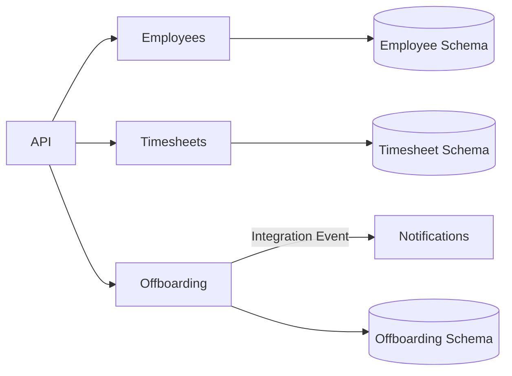
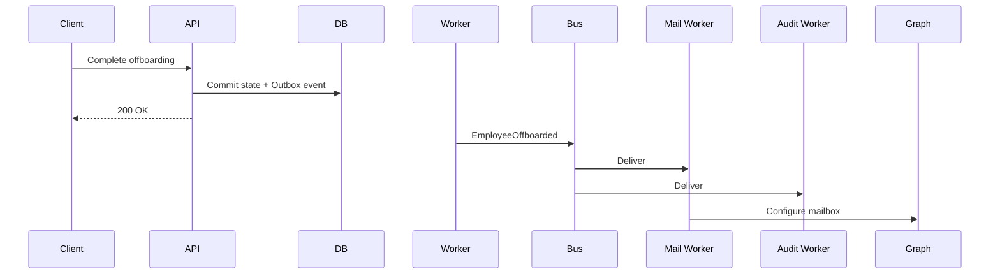
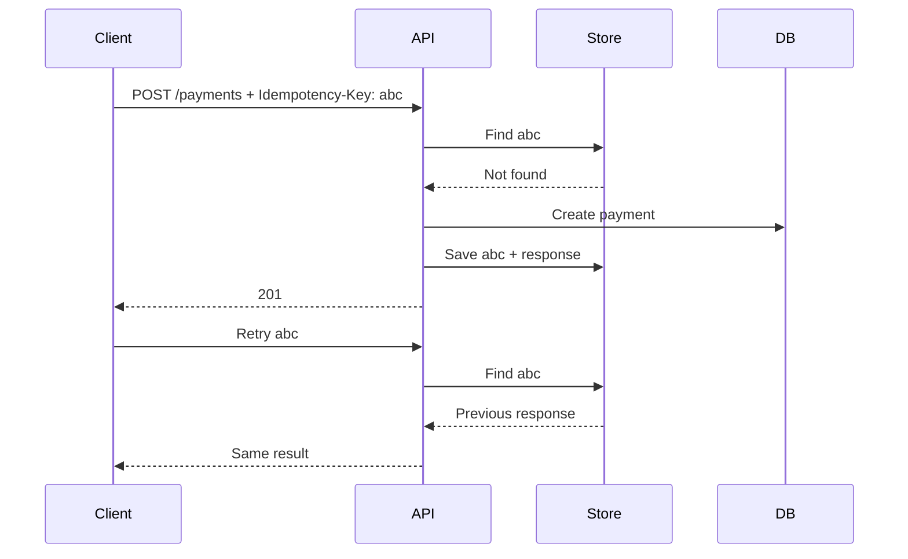
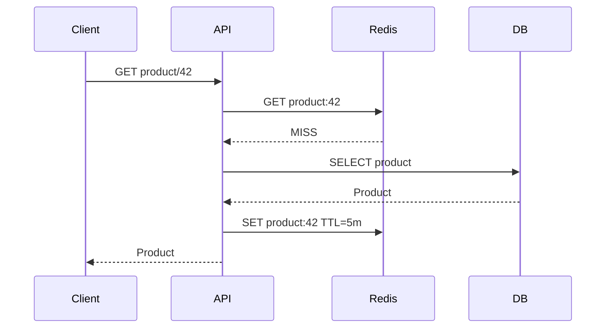
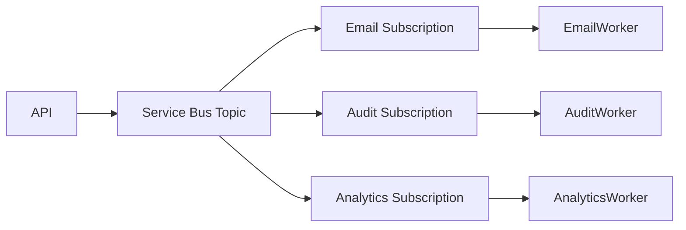
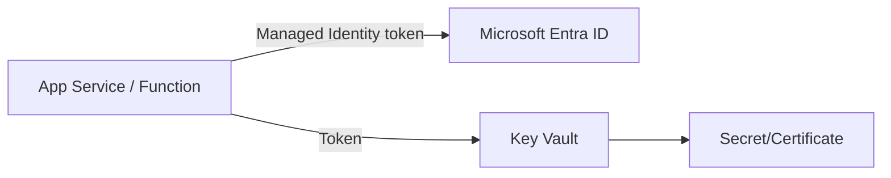
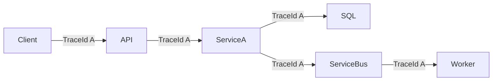
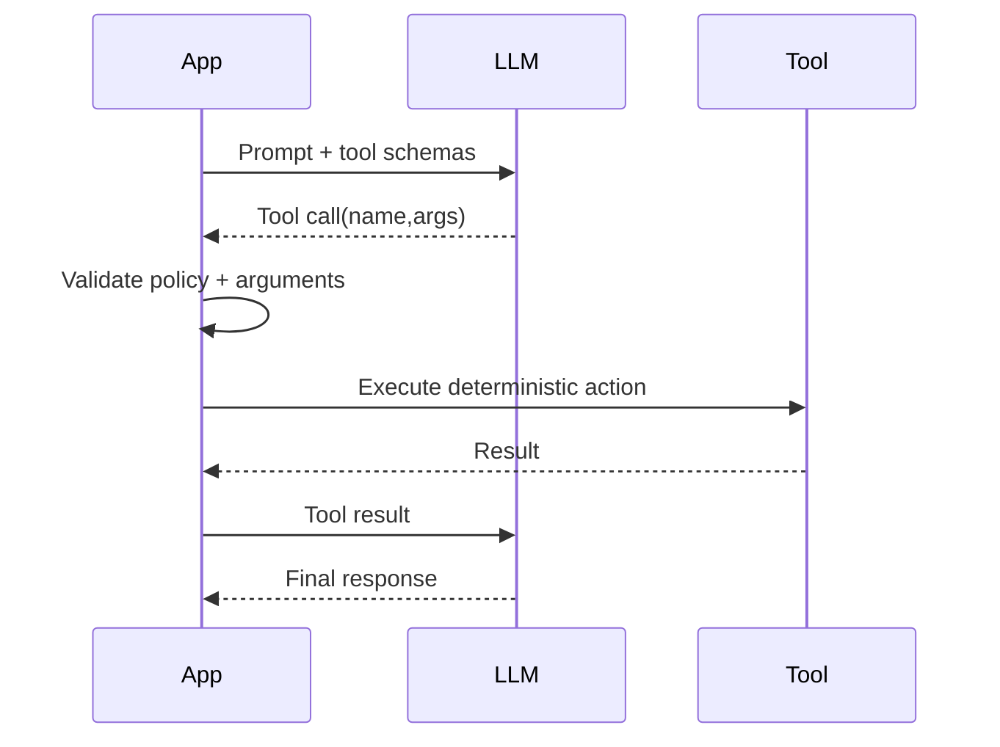
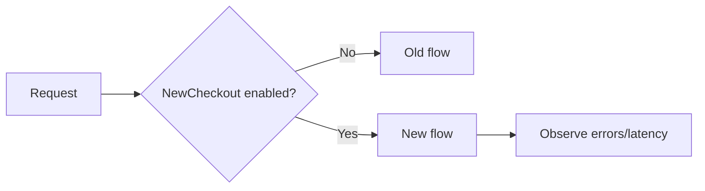

# Daily Knowledge Sharing — 18/08/2026

## Today’s Topics

1. Modular Monolith và ranh giới module
2. Event-Driven Architecture và eventual consistency
3. API Idempotency trong hệ thống phân tán
4. SQL Indexing: composite index và thứ tự cột
5. Redis Cache-Aside và cache invalidation
6. Azure Service Bus: queue, topic và xử lý message an toàn
7. Managed Identity và Azure Key Vault
8. OpenTelemetry và Distributed Tracing
9. LLM Structured Output và Tool Calling
10. Feature Flags và Progressive Delivery

---

# 1. Modular Monolith và ranh giới module

### 1. What is it?

Modular Monolith vẫn là một ứng dụng được deploy như một đơn vị, nhưng code được chia thành các module nghiệp vụ có ranh giới rõ ràng. Điểm quan trọng không phải folder đẹp mà là module không tùy tiện truy cập database, entity hay internal service của module khác.

Ví dụ một hệ thống nhân sự có `Employees`, `Timesheets`, `Offboarding`, `Notifications`. Mỗi module sở hữu use case và dữ liệu của mình, giao tiếp qua public contract hoặc event.

### 2. Why does it exist?

Monolith truyền thống dễ biến thành “big ball of mud”: controller gọi repository bất kỳ, bảng nào cũng được join, thay đổi một feature ảnh hưởng nhiều feature khác. Microservices giải quyết isolation nhưng mang thêm network, deployment, observability và distributed consistency.

Modular Monolith tạo một điểm cân bằng: giữ vận hành đơn giản của monolith nhưng áp dụng boundary đủ mạnh để hệ thống có thể phát triển lâu dài.

### 3. How does it work?



Dependency nên đi qua contract. `Timesheets` không nên lấy `EmployeeDbContext` rồi query trực tiếp bảng employee chỉ vì tiện.

### 4. Practical example

```csharp
public interface IEmployeeDirectory
{
    Task<EmployeeSummary?> GetAsync(Guid employeeId, CancellationToken ct);
}

internal sealed class EmployeeDirectory(EmployeeDbContext db)
    : IEmployeeDirectory
{
    public Task<EmployeeSummary?> GetAsync(Guid id, CancellationToken ct) =>
        db.Employees
          .Where(x => x.Id == id)
          .Select(x => new EmployeeSummary(x.Id, x.Email, x.IsActive))
          .SingleOrDefaultAsync(ct);
}
```

Module khác phụ thuộc vào contract nhỏ thay vì phụ thuộc entity hoặc DbContext nội bộ.

### 5. Real production scenario

Khi employee bị offboard, module Offboarding cập nhật trạng thái của riêng nó rồi phát `EmployeeOffboarded`. Notifications nhận event để gửi mail; Microsoft365Integration xử lý mailbox. Nếu gửi mail lỗi, transaction cập nhật employee không cần rollback chỉ vì SMTP/Graph lỗi.

### 6. Common mistakes

Chỉ chia project/folder nhưng dùng chung toàn bộ entity và DbContext; tạo interface cho mọi class dù không có boundary; module A tham chiếu trực tiếp implementation của module B; dùng synchronous call xuyên module quá nhiều; tách module theo technical layer thay vì business capability.

### 7. Trade-offs

**Advantages:** deployment đơn giản, transaction local dễ hơn microservices, boundary tốt, refactor nhanh.

**Costs / Risks:** process vẫn dùng chung CPU/memory; lỗi nghiêm trọng có thể ảnh hưởng toàn app; team phải có kỷ luật giữ boundary; scale riêng từng module khó hơn microservices.

### 8. Junior → Middle → Senior understanding

**Junior:** hiểu module là business boundary, không chỉ folder.

**Middle:** biết thiết kế contract, dependency direction, integration event và tránh cross-module database access.

**Senior / Technical Lead:** quyết định module boundary, transaction boundary, mức coupling chấp nhận được và thời điểm thật sự cần tách một module thành service độc lập.

### 9. Key takeaway

- Modular Monolith tối ưu cho nhiều hệ thống trước khi cần microservices.
- Boundary quan trọng hơn cấu trúc folder.
- Mỗi module nên sở hữu dữ liệu và contract của mình.

---

# 2. Event-Driven Architecture và eventual consistency

### 1. What is it?

Event-Driven Architecture cho phép component phản ứng với sự kiện đã xảy ra, ví dụ `OrderPaid`, `EmployeeOffboarded`, `FileUploaded`. Producer không cần biết tất cả consumer.

Khi các consumer cập nhật dữ liệu riêng, toàn hệ thống thường không nhất quán ngay lập tức mà đạt trạng thái đúng sau một khoảng thời gian: eventual consistency.

### 2. Why does it exist?

Nếu API phải đồng bộ gọi 5 hệ thống downstream, latency tăng và một dependency lỗi có thể làm cả request thất bại. Event giúp giảm temporal coupling và cho phép consumer xử lý độc lập.

### 3. How does it work?



Producer commit business state và event bằng Outbox Pattern; worker publish event sau đó. Consumer phải idempotent vì broker có thể redeliver.

### 4. Practical example

```csharp
public sealed record EmployeeOffboarded(Guid EmployeeId, DateTimeOffset OccurredAt);

public async Task Handle(EmployeeOffboarded message, CancellationToken ct)
{
    if (await processed.ExistsAsync(message.EmployeeId, ct)) return;

    await mailbox.DisableAsync(message.EmployeeId, ct);
    await processed.MarkAsync(message.EmployeeId, ct);
}
```

### 5. Real production scenario

Payment service xác nhận thanh toán trước. Inventory, invoice và notification cập nhật sau. Trong vài giây, UI có thể thấy payment thành công nhưng invoice chưa xuất hiện. Đây không nhất thiết là bug; UX và API phải thể hiện trạng thái `Processing` phù hợp.

### 6. Common mistakes

Giả định exactly-once delivery; publish event trước khi DB commit; consumer không idempotent; không có DLQ; event chứa quá nhiều internal data; không version schema; dùng event cho luồng cần consistency tức thời.

### 7. Trade-offs

**Advantages:** loose coupling, resilience, scale consumer độc lập, hấp thụ traffic spike.

**Costs / Risks:** debugging khó hơn, duplicate/out-of-order message, eventual consistency, cần observability và reconciliation.

### 8. Junior → Middle → Senior understanding

**Junior:** phân biệt command với event và hiểu consumer có thể chạy sau.

**Middle:** triển khai retry, idempotency, DLQ, Outbox và correlation ID.

**Senior / Technical Lead:** xác định consistency boundary, event ownership, schema evolution, recovery strategy và đánh giá khi asynchronous complexity không đáng giá.

### 9. Key takeaway

- Event nói về điều đã xảy ra.
- At-least-once delivery yêu cầu idempotent consumer.
- Eventual consistency phải được thiết kế cả backend lẫn UX.

---

# 3. API Idempotency trong hệ thống phân tán

### 1. What is it?

Một operation idempotent có thể được gửi nhiều lần nhưng business effect chỉ xảy ra một lần. Đây là thuộc tính cực kỳ quan trọng với payment, order creation, webhook và background processing.

### 2. Why does it exist?

Client timeout không biết server đã xử lý hay chưa. Nếu retry `POST /payments` một cách ngây thơ, khách hàng có thể bị charge hai lần.

### 3. How does it work?



### 4. Practical example

```csharp
app.MapPost("/payments", async (
    HttpRequest request, PaymentCommand command, PaymentDb db) =>
{
    var key = request.Headers["Idempotency-Key"].ToString();
    if (string.IsNullOrWhiteSpace(key)) return Results.BadRequest();

    var existing = await db.Requests.SingleOrDefaultAsync(x => x.Key == key);
    if (existing is not null)
        return Results.Json(existing.Response, statusCode: existing.StatusCode);

    // Business transaction should also protect the key with a unique constraint.
    return Results.Created();
});
```

Database nên có unique index trên idempotency key để chống concurrent duplicate requests.

### 5. Real production scenario

Mobile app gọi API tạo timesheet, mạng chập chờn và SDK retry. Nếu request có idempotency key, backend trả lại kết quả cũ thay vì tạo hai timesheet.

### 6. Common mistakes

Chỉ cache key trong memory; không đặt unique constraint; reuse key cho payload khác; giữ key mãi không TTL; coi GET idempotency và POST idempotency là cùng một vấn đề; retry operation không an toàn.

### 7. Trade-offs

**Advantages:** retry an toàn, giảm duplicate business action.

**Costs / Risks:** cần storage, TTL, concurrency control; response replay và payload validation làm implementation phức tạp hơn.

### 8. Junior → Middle → Senior understanding

**Junior:** hiểu retry có thể tạo duplicate.

**Middle:** triển khai key store, unique constraint và transaction.

**Senior / Technical Lead:** định nghĩa idempotency scope, retention, conflict semantics và end-to-end guarantee qua nhiều service.

### 9. Key takeaway

- Timeout không đồng nghĩa request chưa chạy.
- Idempotency phải bảo vệ business effect, không chỉ HTTP request.
- Unique constraint là lớp bảo vệ concurrency quan trọng.

---

# 4. SQL Indexing: composite index và thứ tự cột

### 1. What is it?

Composite index là index gồm nhiều cột. Thứ tự cột quyết định query nào có thể seek hiệu quả. Index `(TenantId, Status, CreatedAt)` không tương đương `(CreatedAt, Status, TenantId)`.

### 2. Why does it exist?

Khi bảng có hàng triệu row, table scan cho mỗi request gây CPU và I/O lớn. Tuy nhiên “thêm index” không đủ; index phải phù hợp với access pattern.

### 3. How does it work?

B-tree được sắp theo key từ trái sang phải. Query bắt đầu bằng leading columns thường tận dụng index tốt hơn.

```sql
CREATE INDEX IX_Orders_Tenant_Status_CreatedAt
ON Orders(TenantId, Status, CreatedAt DESC)
INCLUDE (TotalAmount, CustomerId);
```

Query phù hợp:

```sql
SELECT TOP 50 Id, TotalAmount, CustomerId, CreatedAt
FROM Orders
WHERE TenantId = @tenantId
  AND Status = @status
ORDER BY CreatedAt DESC;
```

### 4. Practical example

EF Core:

```csharp
modelBuilder.Entity<Order>()
    .HasIndex(x => new { x.TenantId, x.Status, x.CreatedAt });
```

Đừng quyết định index chỉ từ LINQ; kiểm tra actual execution plan, logical reads và row estimates.

### 5. Real production scenario

SaaS có 20 triệu orders. Dashboard lọc theo tenant + status rồi lấy 50 bản ghi mới nhất. Composite index đúng có thể chuyển scan hàng triệu row thành seek + ordered read rất nhỏ.

### 6. Common mistakes

Index mọi column; đặt column ít hữu ích ở đầu; không tính write overhead; `SELECT *`; function lên indexed column; implicit conversion; không kiểm tra statistics và execution plan.

### 7. Trade-offs

**Advantages:** giảm latency và I/O đáng kể.

**Costs / Risks:** tăng storage; INSERT/UPDATE/DELETE đắt hơn; nhiều index gây maintenance và memory pressure.

### 8. Junior → Middle → Senior understanding

**Junior:** biết index tăng tốc read nhưng có chi phí write.

**Middle:** đọc execution plan, thiết kế composite/covering index và phát hiện scan.

**Senior / Technical Lead:** tối ưu theo workload tổng thể, cardinality, write/read ratio, partitioning và operational maintenance.

### 9. Key takeaway

- Thiết kế index từ query pattern, không từ tên column.
- Thứ tự composite key rất quan trọng.
- Đo execution plan và logical reads trước/sau tối ưu.

---

# 5. Redis Cache-Aside và cache invalidation

### 1. What is it?

Cache-Aside để application tự kiểm tra cache trước, cache miss thì đọc database rồi ghi kết quả vào cache. Database vẫn là source of truth.

### 2. Why does it exist?

Dữ liệu đọc nhiều nhưng ít thay đổi có thể tạo tải DB không cần thiết. Redis giảm latency và DB load, nhưng đổi lại xuất hiện bài toán stale data và invalidation.

### 3. How does it work?



Khi update product, thường commit DB trước rồi invalidate cache.

### 4. Practical example

```csharp
var key = $"product:{id}";
var cached = await cache.GetStringAsync(key, ct);
if (cached is not null)
    return JsonSerializer.Deserialize<ProductDto>(cached)!;

var product = await db.Products
    .AsNoTracking()
    .Where(x => x.Id == id)
    .Select(x => new ProductDto(x.Id, x.Name, x.Price))
    .SingleAsync(ct);

await cache.SetStringAsync(key, JsonSerializer.Serialize(product),
    new DistributedCacheEntryOptions
    {
        AbsoluteExpirationRelativeToNow = TimeSpan.FromMinutes(5)
    }, ct);
return product;
```

### 5. Real production scenario

Employee profile được đọc hàng nghìn lần nhưng cập nhật ít. Redis giảm query SQL. Khi HR đổi profile, API xóa `employee:{id}`. Nếu Redis down, hệ thống nên degrade về DB thay vì toàn API chết, nếu tải DB cho phép.

### 6. Common mistakes

TTL quá dài; cache sensitive data không có threat model; cache stampede; dùng wildcard delete trong production; coi Redis là source of truth; không theo dõi hit ratio; retry Redis vô hạn khi outage.

### 7. Trade-offs

**Advantages:** latency thấp, giảm DB load, scale read tốt.

**Costs / Risks:** stale data, memory cost, thêm failure mode, invalidation phức tạp.

### 8. Junior → Middle → Senior understanding

**Junior:** hiểu hit/miss/TTL.

**Middle:** triển khai invalidation, serialization, fallback và chống stampede.

**Senior / Technical Lead:** chọn consistency model, cache topology, failure behavior, capacity và dữ liệu nào tuyệt đối không nên cache.

### 9. Key takeaway

- Cache là optimization, không phải source of truth mặc định.
- Invalidation là phần khó nhất.
- Luôn thiết kế hành vi khi Redis unavailable.

---

# 6. Azure Service Bus: queue, topic và xử lý message an toàn

### 1. What is it?

Azure Service Bus là enterprise message broker. Queue phù hợp competing consumers; Topic + Subscription phù hợp publish/subscribe khi nhiều consumer cần cùng một event.

### 2. Why does it exist?

HTTP synchronous coupling khiến producer phụ thuộc availability và latency của consumer. Broker buffer message, hỗ trợ retry, dead-lettering và scale consumer độc lập.

### 3. How does it work?



Peek-lock mode: consumer nhận lock, xử lý thành công thì complete; lỗi có thể abandon/retry; vượt delivery limit chuyển DLQ.

### 4. Practical example

```csharp
processor.ProcessMessageAsync += async args =>
{
    var message = args.Message.Body.ToObjectFromJson<EmployeeOffboarded>();
    await handler.HandleAsync(message!, args.CancellationToken);
    await args.CompleteMessageAsync(args.Message, args.CancellationToken);
};
```

Trong production cần idempotency và không nên `Complete` trước khi side effect hoàn tất.

### 5. Real production scenario

API nhận file import 100.000 employee, lưu Blob rồi enqueue job. Worker xử lý từng batch. Traffic spike không ép API giữ request hàng phút; queue hấp thụ backlog.

### 6. Common mistakes

Không xử lý duplicate; lock duration ngắn hơn processing time; retry poison message vô hạn; bỏ quên DLQ; message quá lớn; không có correlation ID; dùng queue khi thực tế nhiều consumer đều cần event.

### 7. Trade-offs

**Advantages:** decoupling, buffering, resilience, scalable consumers.

**Costs / Risks:** asynchronous complexity, phí broker, eventual consistency, cần DLQ operations và monitoring.

### 8. Junior → Middle → Senior understanding

**Junior:** phân biệt queue và topic.

**Middle:** xử lý lock, retry, DLQ, idempotency và concurrency.

**Senior / Technical Lead:** thiết kế throughput, partitioning, ordering, failure recovery, message contract và cost.

### 9. Key takeaway

- Broker không loại bỏ failure; nó làm failure có thể quản lý hơn.
- Consumer phải giả định message có thể được giao lại.
- DLQ cần runbook, alert và reprocessing strategy.

---

# 7. Managed Identity và Azure Key Vault

### 1. What is it?

Managed Identity cung cấp identity cho Azure resource mà không cần lưu client secret trong config. Key Vault lưu secret, certificate và key với access control tập trung.

### 2. Why does it exist?

Connection string hoặc client secret trong `appsettings.json`, pipeline variable hay environment variable có thể bị leak và phải rotate thủ công. Managed Identity giảm secret mà application phải sở hữu.

### 3. How does it work?



Azure resource có identity trong Entra ID. App dùng `DefaultAzureCredential`; Azure cấp token và Key Vault kiểm tra RBAC.

### 4. Practical example

```csharp
var client = new SecretClient(
    new Uri(configuration["KeyVaultUri"]!),
    new DefaultAzureCredential());

KeyVaultSecret secret = await client.GetSecretAsync("Graph-Certificate-Thumbprint");
```

Nếu service hỗ trợ Entra authentication trực tiếp, tốt hơn nữa là không lấy secret từ Key Vault mà dùng Managed Identity thẳng tới service.

### 5. Real production scenario

Azure Function đọc Blob và gửi message Service Bus. Thay vì lưu hai connection strings, Function được cấp RBAC `Storage Blob Data Reader` và `Azure Service Bus Data Sender` cho Managed Identity.

### 6. Common mistakes

Cho quyền quá rộng; dùng `DefaultAzureCredential` nhưng production RBAC chưa cấu hình; nhầm control-plane role với data-plane role; firewall/Private Endpoint chặn traffic; vẫn giữ secret cũ không cần thiết.

### 7. Trade-offs

**Advantages:** giảm secret rotation, credential leak và operational burden.

**Costs / Risks:** RBAC/network troubleshooting phức tạp hơn; local development dùng identity khác; cross-tenant scenario cần thiết kế riêng.

### 8. Junior → Middle → Senior understanding

**Junior:** hiểu secret không nên hard-code.

**Middle:** cấu hình identity, RBAC, `DefaultAzureCredential`, Key Vault và troubleshoot 401/403.

**Senior / Technical Lead:** thiết kế least privilege, network isolation, identity lifecycle, audit và break-glass strategy.

### 9. Key takeaway

- Secret tốt nhất là secret application không cần giữ.
- Ưu tiên Managed Identity khi Azure service hỗ trợ Entra authentication.
- RBAC và networking phải được thiết kế cùng nhau.

---

# 8. OpenTelemetry và Distributed Tracing

### 1. What is it?

OpenTelemetry là chuẩn/instrumentation ecosystem cho traces, metrics và logs. Distributed trace nối các span xuyên nhiều service bằng trace context để thấy toàn bộ request path.

### 2. Why does it exist?

Trong distributed system, log `Request failed` của từng service không đủ để biết request đi đâu, chậm ở đâu và dependency nào gây lỗi.

### 3. How does it work?



Mỗi operation tạo span; trace ID chung liên kết chúng. Exporter gửi telemetry tới backend như Application Insights.

### 4. Practical example

```csharp
builder.Services.AddOpenTelemetry()
    .WithTracing(t => t
        .AddAspNetCoreInstrumentation()
        .AddHttpClientInstrumentation()
        .AddEntityFrameworkCoreInstrumentation()
        .AddSource("Offboarding"));
```

Custom span:

```csharp
using var activity = ActivitySource.StartActivity("ConfigureMailbox");
activity?.SetTag("employee.id", employeeId);
```

Không đưa email/token/PII nhạy cảm vào tag tùy tiện.

### 5. Real production scenario

API P95 tăng từ 400 ms lên 4 s. Trace cho thấy API chỉ mất 50 ms, SQL 80 ms nhưng Microsoft Graph call mất 3,7 s. Team tập trung đúng dependency thay vì tối ưu EF Core vô ích.

### 6. Common mistakes

Log nhưng không correlation; cardinality metric quá cao; trace 100% traffic tốn chi phí; ghi PII; mất context qua queue; alert dựa vào từng exception thay vì user impact.

### 7. Trade-offs

**Advantages:** root-cause nhanh, vendor-neutral instrumentation, quan sát end-to-end.

**Costs / Risks:** telemetry cost, sampling có thể bỏ mất trace hiếm, instrumentation và data governance cần quản lý.

### 8. Junior → Middle → Senior understanding

**Junior:** phân biệt log, metric, trace.

**Middle:** instrument HTTP/DB/custom spans, correlation và query trace.

**Senior / Technical Lead:** thiết kế telemetry schema, sampling, SLO-based alerting, retention, cost và privacy.

### 9. Key takeaway

- Logs trả lời “đã xảy ra gì”, metrics “mức độ bao nhiêu”, traces “request đi qua đâu”.
- Correlation xuyên service là nền tảng troubleshooting.
- Telemetry cũng là production data cần cost/security governance.

---

# 9. LLM Structured Output và Tool Calling

### 1. What is it?

Structured Output ép kết quả LLM tuân theo schema để code có thể parse đáng tin cậy hơn. Tool Calling cho phép model chọn một action có schema, còn application mới là thành phần thực thi action đó.

### 2. Why does it exist?

Parsing prose bằng regex rất mong manh. Quan trọng hơn, không nên cho model trực tiếp quyết định và thực thi side effect không kiểm soát như chuyển tiền, xóa dữ liệu hoặc gửi email.

### 3. How does it work?



LLM đề xuất intent/arguments; deterministic code kiểm tra authorization, validation, idempotency và business rule.

### 4. Practical example

```csharp
public sealed record CreateTicketArgs(
    string Title,
    string Severity,
    string Description);

public async Task<TicketResult> CreateTicketAsync(CreateTicketArgs args)
{
    if (!AllowedSeverities.Contains(args.Severity))
        throw new ValidationException("Invalid severity");

    return await ticketService.CreateAsync(args);
}
```

Schema validation phải diễn ra sau model output; “model đã trả JSON” không đồng nghĩa dữ liệu business hợp lệ.

### 5. Real production scenario

AI assistant đọc incident và đề xuất tạo Jira ticket. Model tạo title/severity/description; backend kiểm tra permission và severity; với action nguy hiểm có thể yêu cầu human approval trước khi gọi API.

### 6. Common mistakes

Tin model output tuyệt đối; cho model truyền URL/path tùy ý; không validate tool arguments; retry tool side effect không idempotent; đưa secret vào prompt; không chống prompt injection từ tài liệu RAG.

### 7. Trade-offs

**Advantages:** integration ổn định hơn free text, dễ automate, phân tách reasoning và execution.

**Costs / Risks:** schema evolution, model vẫn có thể chọn tool sai, latency/cost tăng qua nhiều vòng, cần security boundary rõ.

### 8. Junior → Middle → Senior understanding

**Junior:** hiểu LLM output không phải trusted input.

**Middle:** thiết kế schema, validation, timeout, retry và tool dispatcher.

**Senior / Technical Lead:** quyết định autonomy boundary, approval, audit, prompt-injection defense, evaluation và deterministic fallback.

### 9. Key takeaway

- Model nên đề xuất; code kiểm soát side effect.
- Structured không có nghĩa là trusted.
- Tool execution cần cùng tiêu chuẩn security như public API.

---

# 10. Feature Flags và Progressive Delivery

### 1. What is it?

Feature Flag tách việc deploy code khỏi việc release feature. Code mới có thể đã ở production nhưng chỉ bật cho internal users, một tenant hoặc một phần traffic.

### 2. Why does it exist?

Big-bang release làm blast radius lớn. Nếu deploy và release là một hành động duy nhất, rollback thường phải redeploy toàn application.

### 3. How does it work?



Progressive delivery có thể bật 1% → 10% → 50% → 100%, quan sát metrics giữa các bước.

### 4. Practical example

```csharp
if (await featureManager.IsEnabledAsync("NewOffboardingFlow"))
{
    return await newFlow.ExecuteAsync(command, ct);
}

return await legacyFlow.ExecuteAsync(command, ct);
```

Flag có thể target tenant/user, nhưng authorization không được phụ thuộc vào feature flag như một security control.

### 5. Real production scenario

Team thay đổi quy trình offboarding dùng asynchronous Service Bus. Code được deploy nhưng chỉ bật cho tenant nội bộ. Sau khi kiểm tra error rate, queue depth và processing latency, rollout tăng dần. Nếu lỗi, disable flag trong vài giây mà không cần rollback binary.

### 6. Common mistakes

Không xóa flag cũ; nested flags tạo combinatorial complexity; flag thay authorization; không test cả on/off path; rollout mà không có metrics; database migration không backward-compatible nên tắt flag cũng không cứu được.

### 7. Trade-offs

**Advantages:** giảm blast radius, rollback logic nhanh, hỗ trợ canary/A-B/internal testing.

**Costs / Risks:** code path tăng, technical debt, config service trở thành dependency, khó test nhiều tổ hợp.

### 8. Junior → Middle → Senior understanding

**Junior:** hiểu deploy khác release.

**Middle:** triển khai flag, test cả hai path và cleanup flag.

**Senior / Technical Lead:** thiết kế progressive rollout, kill switch, backward-compatible migration, observability, ownership và lifecycle governance.

### 9. Key takeaway

- Feature flag giúp kiểm soát release sau deployment.
- Flag cần owner và ngày cleanup.
- Progressive delivery chỉ an toàn khi gắn với metrics và rollback criteria.