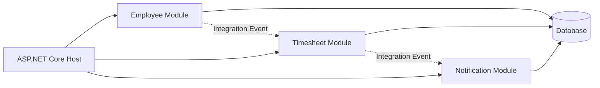
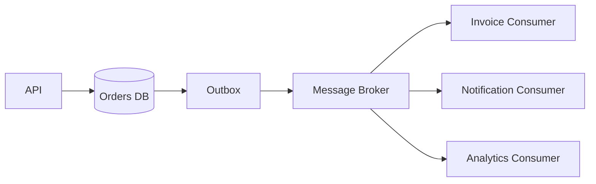
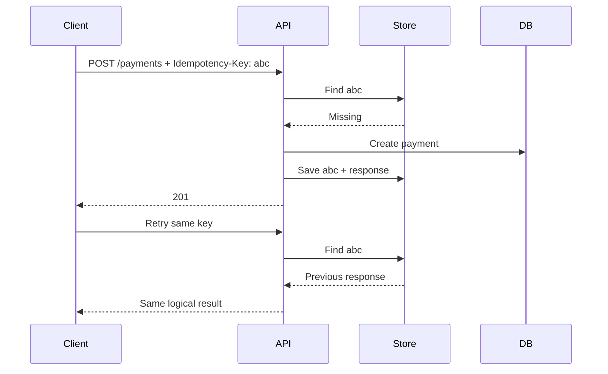
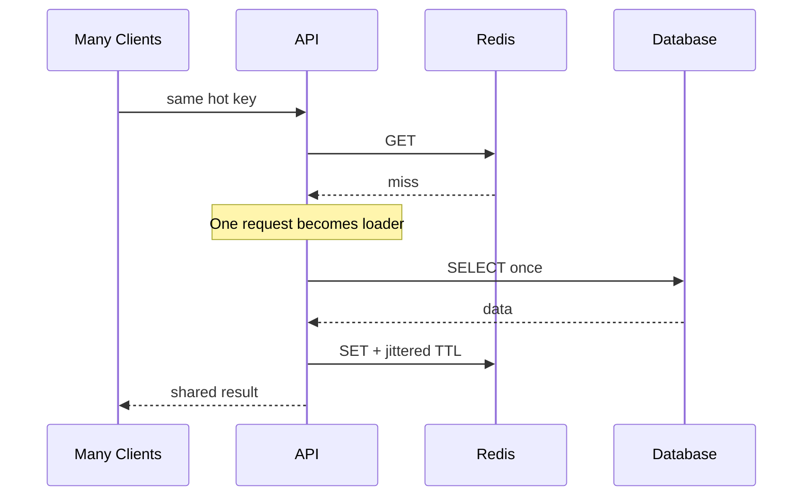
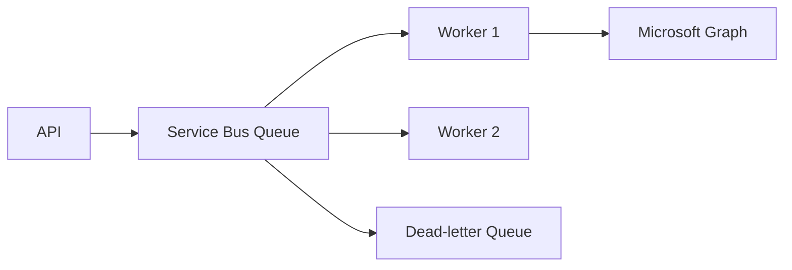
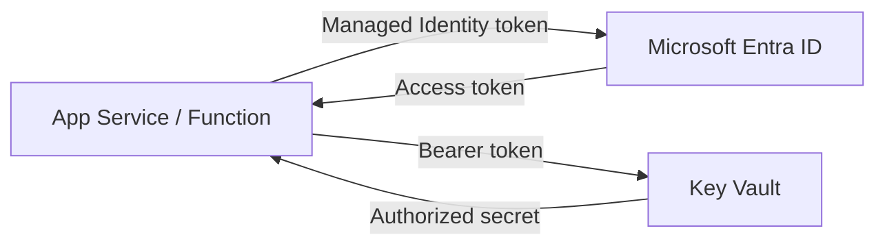
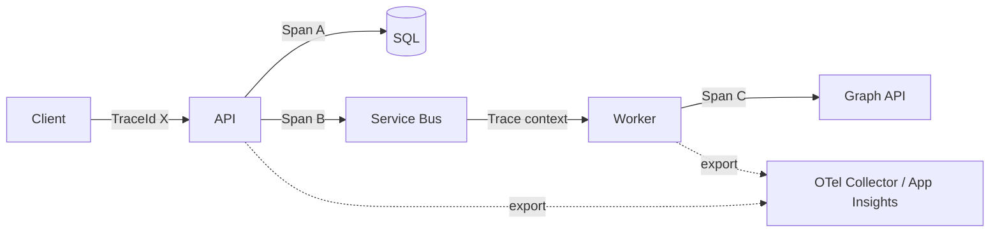
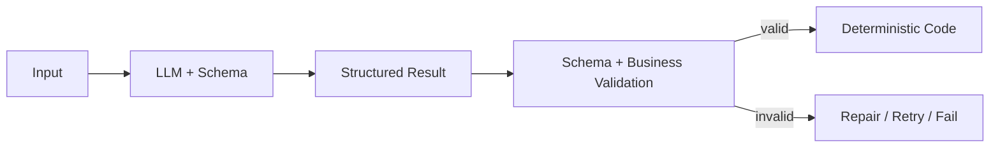
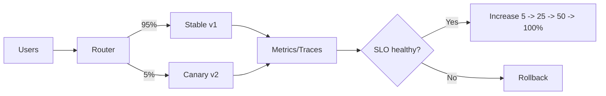

# Daily Knowledge Sharing — 2026-08-18

## Today’s Topics

1. Modular Monolith — chia boundary rõ ràng mà chưa phải trả giá vận hành của microservices.
2. Event-Driven Architecture — tách producer/consumer và xử lý eventual consistency.
3. Idempotency — làm API an toàn trước retry và request trùng.
4. Optimistic Concurrency — chống lost update trong EF Core.
5. Cache Stampede — tránh hàng nghìn request cùng xuyên cache xuống database.
6. Azure Service Bus — messaging tin cậy cho background workflow.
7. Managed Identity + Key Vault — bỏ secret khỏi application configuration.
8. OpenTelemetry Distributed Tracing — theo dấu một request xuyên nhiều thành phần.
9. Structured Output cho LLM — biến phản hồi AI thành contract có thể kiểm soát.
10. Canary Deployment — giảm blast radius khi release production.

---

# 1. Modular Monolith

### 1. What is it?

Modular Monolith vẫn là **một ứng dụng được deploy như một đơn vị**, nhưng bên trong được chia thành các module nghiệp vụ có boundary rõ ràng, ví dụ `Employees`, `Timesheets`, `Notifications`. Điểm quan trọng không phải folder đẹp mà là module này không tùy tiện truy cập database table, entity hay implementation của module khác.

Nó thường là điểm cân bằng tốt khi domain đã đủ lớn để cần separation nhưng chưa có lý do vận hành đủ mạnh để tách microservices.

### 2. Why does it exist?

Một monolith không có boundary dễ biến thành “big ball of mud”: service A gọi repository B, controller C sửa trực tiếp entity D, schema database bị dùng chung khắp nơi. Nhưng tách microservices quá sớm lại sinh network failure, distributed tracing, deployment orchestration và eventual consistency.

Modular Monolith giữ communication nội bộ đơn giản nhưng ép kiến trúc có ranh giới.

### 3. How does it work?



Mỗi module sở hữu application logic, domain model và data access của mình. Cross-module communication đi qua public contract hoặc event thay vì truy cập implementation trực tiếp.

### 4. Practical example

```csharp
public interface IEmployeeModule
{
    Task<EmployeeSummary?> GetEmployeeAsync(Guid employeeId, CancellationToken ct);
}

// Timesheet chỉ biết contract, không inject EmployeeDbContext.
public sealed class CreateTimesheetHandler(IEmployeeModule employees)
{
    public async Task Handle(Guid employeeId, CancellationToken ct)
    {
        var employee = await employees.GetEmployeeAsync(employeeId, ct)
            ?? throw new InvalidOperationException("Employee not found");
        // create timesheet...
    }
}
```

### 5. Real production scenario

Trong hệ thống HR, employee onboarding, timesheet và notification có tốc độ thay đổi khác nhau. Ban đầu chúng có thể chạy chung một ASP.NET Core app để deployment đơn giản. Khi Notification thực sự cần scale độc lập, boundary sẵn có giúp tách module đó thành service với ít thay đổi hơn.

### 6. Common mistakes

- Gọi là module nhưng tất cả cùng dùng một `DbContext` và entity public.
- Tạo dependency vòng: Employee → Timesheet → Employee.
- Dùng event cho mọi method call, khiến code khó debug không cần thiết.
- Tách module theo technical layer (`Repositories`, `Services`) thay vì business capability.

### 7. Trade-offs

**Advantages:** deployment đơn giản, transaction local dễ, latency thấp, refactor dễ hơn microservices.

**Costs / Risks:** vẫn scale/deploy theo toàn app; boundary chỉ được giữ nếu team có discipline; shared database có thể trở thành đường tắt phá kiến trúc.

### 8. Junior → Middle → Senior understanding

**Junior:** hiểu module là business boundary, không chỉ folder.

**Middle:** biết thiết kế contract, dependency direction và integration event giữa module.

**Senior / Technical Lead:** quyết định boundary nào đủ ổn định, khi nào nên giữ monolith và khi nào operational/scaling requirement đủ lớn để extract service.

### 9. Key takeaway

- Modular Monolith ưu tiên **boundary trước distribution**.
- Microservices không phải bước mặc định tiếp theo của mọi hệ thống.
- Nếu boundary trong process còn không giữ được, đưa qua network thường chỉ làm vấn đề khó hơn.

---

# 2. Event-Driven Architecture

### 1. What is it?

Event-Driven Architecture (EDA) tổ chức workflow quanh các sự kiện đã xảy ra như `EmployeeOffboarded`, `PaymentCompleted`. Producer phát event mà không cần biết tất cả consumer.

Event khác command: command mang ý định “hãy làm X”; event mô tả sự thật “X đã xảy ra”.

### 2. Why does it exist?

Nếu một request phải đồng bộ gọi 5 hệ thống downstream, latency và availability của request bị phụ thuộc vào cả 5. EDA cho phép core transaction hoàn thành rồi các side effect được xử lý bất đồng bộ.

### 3. How does it work?



Producer lưu business data và outbox record cùng transaction. Worker publish outbox lên broker. Consumer xử lý event theo kiểu at-least-once nên phải idempotent.

### 4. Practical example

```csharp
public record EmployeeOffboarded(Guid EmployeeId, DateTimeOffset OccurredAt);

// Trong cùng transaction với thay đổi Employee:
db.OutboxMessages.Add(new OutboxMessage
{
    Type = nameof(EmployeeOffboarded),
    Payload = JsonSerializer.Serialize(
        new EmployeeOffboarded(employee.Id, DateTimeOffset.UtcNow))
});
await db.SaveChangesAsync(ct);
```

### 5. Real production scenario

Khi nhân viên nghỉ việc, core HR cập nhật trạng thái. Sau đó consumer riêng thu hồi quyền Microsoft 365, consumer khác gửi email, consumer khác cập nhật reporting. Nếu Exchange Online chậm, transaction HR không nhất thiết phải rollback.

### 6. Common mistakes

- Dual write: commit DB rồi publish broker; crash giữa hai bước làm mất event.
- Nghĩ broker bảo đảm exactly-once end-to-end.
- Consumer không idempotent.
- Event chứa toàn bộ internal entity và biến schema nội bộ thành public contract.
- Không có dead-letter handling hoặc replay strategy.

### 7. Trade-offs

**Advantages:** loose coupling, absorb traffic spikes, scale consumer độc lập, tăng resilience.

**Costs / Risks:** eventual consistency, duplicate/out-of-order message, debugging khó hơn, contract evolution và observability trở thành yêu cầu bắt buộc.

### 8. Junior → Middle → Senior understanding

**Junior:** phân biệt synchronous call, command và event.

**Middle:** triển khai producer/consumer, retry, idempotency, DLQ và Outbox.

**Senior / Technical Lead:** thiết kế consistency boundary, delivery semantics, partition/order strategy và failure recovery.

### 9. Key takeaway

- Event làm giảm coupling nhưng tăng distributed-system complexity.
- At-least-once delivery kéo theo idempotent consumer.
- Outbox giải quyết khoảng trống giữa DB transaction và message publish.

---

# 3. Idempotency trong API

### 1. What is it?

Một operation idempotent có thể nhận cùng một logical request nhiều lần nhưng business effect chỉ xảy ra một lần. Đây là yêu cầu đặc biệt quan trọng với payment, order creation và external integration.

### 2. Why does it exist?

Client timeout không có nghĩa server chưa xử lý. Nếu client retry `POST /payments`, server có thể charge hai lần nếu không nhận biết request trước đó.

### 3. How does it work?



Key cần gắn với request fingerprint để cùng key nhưng payload khác bị từ chối.

### 4. Practical example

```csharp
app.MapPost("/payments", async (
    HttpRequest request, PaymentRequest body, PaymentDb db, CancellationToken ct) =>
{
    var key = request.Headers["Idempotency-Key"].ToString();
    if (string.IsNullOrWhiteSpace(key)) return Results.BadRequest();

    var existing = await db.IdempotencyRecords.FindAsync([key], ct);
    if (existing is not null)
        return Results.Json(existing.ResponseBody, statusCode: existing.StatusCode);

    // Production: unique constraint + transaction are required.
    // create payment and idempotency record atomically...
    return Results.Created();
});
```

### 5. Real production scenario

Mobile app gửi lệnh thanh toán, network rớt ngay sau khi server commit. App retry với cùng key. API trả lại kết quả đã lưu thay vì tạo payment mới.

### 6. Common mistakes

- Chỉ cache key trong memory: scale-out sang instance khác sẽ mất tác dụng.
- Không đặt unique constraint cho key.
- Key tồn tại mãi không có retention policy.
- Retry request với cùng key nhưng payload khác vẫn được chấp nhận.
- Check key và insert business data ở hai transaction riêng.

### 7. Trade-offs

**Advantages:** retry an toàn, giảm duplicate side effect.

**Costs / Risks:** cần storage, cleanup, concurrency handling và định nghĩa rõ scope của key.

### 8. Junior → Middle → Senior understanding

**Junior:** hiểu timeout và retry có thể tạo duplicate.

**Middle:** triển khai key store, unique constraint, transaction và response replay.

**Senior / Technical Lead:** xác định semantic boundary, retention, multi-region consistency và interaction với downstream systems.

### 9. Key takeaway

- Retry và idempotency phải được thiết kế cùng nhau.
- Idempotency là business guarantee, không chỉ HTTP trick.
- Atomicity và unique constraint quan trọng hơn một đoạn `if` kiểm tra key.

---

# 4. Optimistic Concurrency với EF Core

### 1. What is it?

Optimistic Concurrency cho phép nhiều request đọc cùng dữ liệu mà không giữ lock dài; khi update, hệ thống kiểm tra dữ liệu có bị người khác thay đổi kể từ lúc đọc hay không.

### 2. Why does it exist?

Lost update xảy ra khi A và B cùng đọc version 5; A update thành 6, sau đó B dùng dữ liệu cũ ghi đè kết quả của A. Với web request kéo dài hàng giây, giữ pessimistic lock xuyên request thường không thực tế.

### 3. How does it work?

```text
A reads RowVersion=5 ──> A updates WHERE RowVersion=5 ──> success, version=6
B reads RowVersion=5 ──> B updates WHERE RowVersion=5 ──> 0 rows -> conflict
```

EF Core thấy zero rows affected và ném `DbUpdateConcurrencyException`.

### 4. Practical example

```csharp
public sealed class Employee
{
    public Guid Id { get; set; }
    public string Name { get; set; } = "";
    [Timestamp]
    public byte[] RowVersion { get; set; } = [];
}

try
{
    await db.SaveChangesAsync(ct);
}
catch (DbUpdateConcurrencyException)
{
    return Results.Conflict(new { error = "Employee was modified by another request." });
}
```

SQL Server `rowversion` rất phù hợp; PostgreSQL có thể dùng concurrency token phù hợp với chiến lược của ứng dụng.

### 5. Real production scenario

HR và manager cùng sửa hồ sơ nhân viên. Thay vì request đến sau âm thầm ghi đè, API trả `409 Conflict`; UI reload bản mới và yêu cầu người dùng reconcile.

### 6. Common mistakes

- Catch exception rồi tự động retry update bằng dữ liệu cũ, cuối cùng vẫn overwrite người khác.
- Không đưa concurrency token về client khi workflow cần round-trip.
- Dùng optimistic concurrency cho hotspot có conflict cực cao mà không đánh giá chi phí retry.

### 7. Trade-offs

**Advantages:** không giữ lock dài, throughput tốt khi conflict hiếm.

**Costs / Risks:** conflict phải được xử lý ở application/UI; retry có thể phức tạp; không phù hợp mọi workload.

### 8. Junior → Middle → Senior understanding

**Junior:** hiểu lost update.

**Middle:** cấu hình token, bắt exception, trả HTTP conflict và test concurrent request.

**Senior / Technical Lead:** chọn optimistic hay pessimistic theo contention, business semantics và UX conflict resolution.

### 9. Key takeaway

- Optimistic concurrency **phát hiện** conflict; nó không tự quyết định cách merge.
- Retry mù có thể phá mục tiêu chống lost update.
- Concurrency strategy phải phản ánh business semantics.

---

# 5. Cache Stampede và Request Coalescing

### 1. What is it?

Cache stampede xảy ra khi một key phổ biến hết hạn và hàng trăm/hàng nghìn request cùng cache miss, rồi đồng loạt query database hoặc third-party API.

### 2. Why does it exist?

Cache giảm tải trong trạng thái bình thường nhưng expiration đồng thời có thể biến nó thành “traffic amplifier”. Backend vốn chịu 10 query/s có thể đột ngột nhận 2.000 query trong một giây.

### 3. How does it work?



Các kỹ thuật: per-key lock/request coalescing, stale-while-revalidate, TTL jitter, background refresh.

### 4. Practical example

```csharp
private readonly ConcurrentDictionary<string, SemaphoreSlim> _locks = new();

public async Task<Product?> GetAsync(string key, CancellationToken ct)
{
    var cached = await cache.GetStringAsync(key, ct);
    if (cached is not null) return JsonSerializer.Deserialize<Product>(cached);

    var gate = _locks.GetOrAdd(key, _ => new SemaphoreSlim(1, 1));
    await gate.WaitAsync(ct);
    try
    {
        cached = await cache.GetStringAsync(key, ct); // double check
        if (cached is not null) return JsonSerializer.Deserialize<Product>(cached);
        var value = await db.Products.FindAsync([key], ct);
        if (value is not null)
            await cache.SetStringAsync(key, JsonSerializer.Serialize(value),
                new DistributedCacheEntryOptions { AbsoluteExpirationRelativeToNow = TimeSpan.FromMinutes(5) }, ct);
        return value;
    }
    finally { gate.Release(); }
}
```

Local semaphore chỉ coalesce trong một instance; hệ thống multi-instance cần chiến lược phù hợp hơn.

### 5. Real production scenario

Dashboard SaaS có config tenant được đọc ở mọi request. Sau deploy, hàng nghìn key cùng cold cache có thể tạo load spike lên SQL. Warm-up, jitter và request coalescing giảm spike này.

### 6. Common mistakes

- Tất cả key cùng TTL chính xác 5 phút.
- Distributed lock không có timeout/lease.
- Cache failure làm API fail dù database vẫn khỏe.
- Cache dữ liệu nhạy cảm mà key không chứa tenant/user scope.

### 7. Trade-offs

**Advantages:** bảo vệ dependency, giảm latency tail và load spike.

**Costs / Risks:** lock/coalescing tăng complexity; stale data đổi consistency lấy availability; distributed coordination có failure mode riêng.

### 8. Junior → Middle → Senior understanding

**Junior:** hiểu cache hit/miss/TTL.

**Middle:** triển khai double-check, jitter và fallback.

**Senior / Technical Lead:** thiết kế behavior khi Redis down, hot-key strategy, stale tolerance và capacity của origin.

### 9. Key takeaway

- Cache không chỉ cần hit ratio; phải thiết kế **miss behavior**.
- TTL đồng bộ có thể tạo thundering herd.
- Redis outage không nên mặc định trở thành application outage.

---

# 6. Azure Service Bus cho Background Workflow

### 1. What is it?

Azure Service Bus là managed message broker hỗ trợ queue/topic, lock-based delivery, retry, dead-letter queue và nhiều capability dành cho enterprise messaging.

### 2. Why does it exist?

HTTP synchronous không phù hợp khi công việc lâu, cần retry hoặc consumer có thể tạm unavailable. Broker tách thời điểm producer nhận request khỏi thời điểm consumer xử lý.

### 3. How does it work?



Consumer nhận message với lock. Thành công thì complete; lỗi transient có thể abandon/retry; vượt delivery threshold hoặc lỗi không recoverable thì message vào DLQ.

### 4. Practical example

```csharp
var client = new ServiceBusClient(namespaceFqdn, new DefaultAzureCredential());
var sender = client.CreateSender("offboarding");

await sender.SendMessageAsync(new ServiceBusMessage(
    BinaryData.FromObjectAsJson(new { EmployeeId = employeeId }))
{
    MessageId = operationId.ToString()
}, ct);
```

`DefaultAzureCredential` cho phép production dùng Managed Identity thay vì connection string.

### 5. Real production scenario

API offboarding trả response sau khi ghi business state và enqueue công việc. Worker gọi Microsoft Graph/Exchange. Nếu Graph throttling, message được retry mà không bắt user giữ HTTP request mở.

### 6. Common mistakes

- Không idempotent consumer vì nghĩ queue chỉ giao message một lần.
- Retry vô hạn lỗi validation/permanent.
- Không monitor DLQ.
- Message quá lớn hoặc nhét file binary trực tiếp thay vì Blob + reference.
- Lock hết hạn vì handler chạy quá lâu.

### 7. Trade-offs

**Advantages:** decoupling, buffering, reliable delivery, scale consumer độc lập.

**Costs / Risks:** eventual consistency, broker cost, duplicate delivery, DLQ/replay/observability cần vận hành nghiêm túc.

### 8. Junior → Middle → Senior understanding

**Junior:** hiểu queue giúp xử lý bất đồng bộ.

**Middle:** biết complete/abandon/dead-letter, retry và idempotency.

**Senior / Technical Lead:** chọn queue/topic, partition/session/order, throughput tier, failure policy và disaster recovery.

### 9. Key takeaway

- Queue là reliability boundary, không phải nơi “ném việc rồi quên”.
- Consumer phải chịu được duplicate.
- DLQ không có monitoring chỉ là nơi lỗi bị giấu đi.

---

# 7. Managed Identity + Azure Key Vault

### 1. What is it?

Managed Identity cấp identity do Azure quản lý cho workload. Key Vault lưu secret/key/certificate. Kết hợp hai thứ giúp application truy cập secret mà không cần chứa credential để truy cập chính Key Vault.

### 2. Why does it exist?

Connection string, client secret trong `appsettings.json`, pipeline variable hoặc source code dễ bị leak và cần rotation thủ công. “Secret để lấy secret” cũng tạo bootstrap problem.

### 3. How does it work?



RBAC quyết định identity được `get/list` gì. Có thể kết hợp Private Endpoint để hạn chế network exposure.

### 4. Practical example

```csharp
var client = new SecretClient(
    new Uri("https://my-vault.vault.azure.net/"),
    new DefaultAzureCredential());

KeyVaultSecret secret = await client.GetSecretAsync("ThirdPartyApiKey", cancellationToken: ct);
```

Trong local dev, `DefaultAzureCredential` có thể dùng developer identity; trên Azure nó dùng Managed Identity.

### 5. Real production scenario

App Service cần API key của một vendor. App identity chỉ có quyền đọc đúng secret cần thiết. Rotation secret trong Key Vault không yêu cầu đưa credential truy cập vault vào source control.

### 6. Common mistakes

- Cho identity quyền `Key Vault Administrator` khi chỉ cần đọc một số secret.
- Fetch secret từ Key Vault ở mọi request thay vì cache hợp lý.
- Nghĩ Key Vault tự động giải quyết rotation của mọi downstream credential.
- Public network mở rộng không cần thiết.

### 7. Trade-offs

**Advantages:** loại bỏ nhiều static credential, RBAC/audit tốt, rotation dễ hơn.

**Costs / Risks:** dependency runtime vào Entra/Key Vault nếu không cache; RBAC/network setup phức tạp; secret vẫn tồn tại trong process memory khi sử dụng.

### 8. Junior → Middle → Senior understanding

**Junior:** không commit secret và hiểu identity khác secret.

**Middle:** cấu hình Managed Identity, RBAC, `DefaultAzureCredential` và caching.

**Senior / Technical Lead:** thiết kế least privilege, network isolation, rotation, break-glass và dependency failure behavior.

### 9. Key takeaway

- Managed Identity giải quyết credential của workload tới Azure resource.
- Key Vault không thay thế authorization design.
- Least privilege và network boundary quan trọng ngang việc “đã dùng vault”.

---

# 8. OpenTelemetry và Distributed Tracing

### 1. What is it?

Distributed tracing theo một request qua API, database, queue và downstream service bằng trace/span correlation. OpenTelemetry cung cấp chuẩn instrumentation/export độc lập vendor.

### 2. Why does it exist?

Log riêng lẻ trả lời “service này ghi gì”; trace trả lời “request này đã đi qua đâu và chậm/hỏng ở bước nào”. Trong distributed system, timestamp từ nhiều log file thường không đủ để dựng causal chain nhanh.

### 3. How does it work?



Trace gồm nhiều span. Context propagation giữ `TraceId` xuyên HTTP/message boundary.

### 4. Practical example

```csharp
builder.Services.AddOpenTelemetry()
    .WithTracing(t => t
        .AddAspNetCoreInstrumentation()
        .AddHttpClientInstrumentation()
        .AddEntityFrameworkCoreInstrumentation());
```

Custom span nên dùng cho business operation quan trọng, không instrument từng method nhỏ.

### 5. Real production scenario

P95 của offboarding tăng từ 2s lên 12s. Trace cho thấy API chỉ mất 100ms, nhưng 80% latency nằm ở Graph call và retry. Team sửa đúng dependency thay vì tối ưu SQL vô ích.

### 6. Common mistakes

- Log có TraceId nhưng queue message không propagate context.
- Gắn PII/token vào span attributes.
- Sampling quá mạnh làm mất rare error trace.
- Tạo cardinality cực cao trong metric/tag.
- Instrument nhiều nhưng không có dashboard/alert/query workflow.

### 7. Trade-offs

**Advantages:** root-cause nhanh, dependency map rõ, vendor-neutral instrumentation.

**Costs / Risks:** telemetry volume/cost, sampling complexity, privacy và performance overhead.

### 8. Junior → Middle → Senior understanding

**Junior:** phân biệt log, metric, trace.

**Middle:** instrument ASP.NET Core/HttpClient/EF, propagate context và query trace.

**Senior / Technical Lead:** thiết kế sampling, semantic conventions, telemetry budget, PII policy và SLO-driven observability.

### 9. Key takeaway

- Trace cho biết **request cụ thể đi đâu**; metric cho biết **hệ thống đang thế nào**.
- Correlation phải xuyên qua cả async messaging.
- Telemetry chỉ hữu ích khi hỗ trợ quyết định vận hành thực tế.

---

# 9. Structured Output trong LLM Integration

### 1. What is it?

Structured Output yêu cầu model trả dữ liệu theo schema xác định thay vì text tự do, giúp application parse và validate output trước khi dùng.

### 2. Why does it exist?

Regex hoặc “hãy trả JSON” trong prompt không tạo contract đáng tin cậy. Model có thể đổi field, thêm markdown hoặc thiếu property. Production code cần boundary rõ giữa probabilistic model và deterministic application.

### 3. How does it work?



Schema validation chỉ kiểm tra **shape/type**, không bảo đảm business fact đúng. Sau đó vẫn cần business validation và authorization.

### 4. Practical example

```csharp
public sealed record TicketClassification(
    string Category,
    int Priority,
    string[] RequiredActions);

var result = JsonSerializer.Deserialize<TicketClassification>(modelJson)
    ?? throw new InvalidOperationException("Invalid model output");

if (result.Priority is < 1 or > 5)
    throw new ValidationException("Priority out of range");
```

Trong API thực tế, nên dùng structured-output/schema capability của model provider thay vì chỉ prompt “return JSON”.

### 5. Real production scenario

AI đọc support ticket và đề xuất `{category, priority, requiredActions}`. Application validate schema, map category vào enum được phép rồi mới tạo workflow. AI không được tự quyết định quyền truy cập hoặc trực tiếp chạy SQL.

### 6. Common mistakes

- Tin rằng JSON hợp lệ đồng nghĩa nội dung đúng.
- Cho model sinh tên tool/SQL tùy ý rồi thực thi trực tiếp.
- Không version schema.
- Retry vô hạn khi output invalid.
- Đưa secret hoặc dữ liệu vượt nhu cầu vào context.

### 7. Trade-offs

**Advantages:** integration ổn định hơn, dễ test, giảm parser brittle, rõ contract.

**Costs / Risks:** schema quá cứng có thể giảm flexibility; model vẫn có semantic hallucination; validation/retry tăng latency và token cost.

### 8. Junior → Middle → Senior understanding

**Junior:** hiểu model output là untrusted input.

**Middle:** schema validation, business validation, timeout/retry và fallback.

**Senior / Technical Lead:** quyết định boundary giữa AI decision và deterministic control, threat model, evaluation, cost/latency budget và auditability.

### 9. Key takeaway

- Structured output làm output **dễ kiểm soát**, không làm AI trở thành deterministic.
- Validate cả schema lẫn business semantics.
- Quyền thực thi side effect phải nằm trong code/policy, không nằm trong “ý muốn” của model.

---

# 10. Canary Deployment

### 1. What is it?

Canary Deployment đưa version mới tới một phần nhỏ traffic trước, quan sát telemetry rồi tăng dần tỷ lệ nếu hệ thống khỏe.

### 2. Why does it exist?

Test/staging không tái tạo hoàn toàn production traffic, data shape và dependency behavior. Deploy 100% ngay lập tức làm blast radius của bug bằng toàn bộ user base.

### 3. How does it work?



Promotion nên dựa trên measurable gates: error rate, latency, saturation và business KPI.

### 4. Practical example

Pipeline có thể triển khai revision mới ở Azure Container Apps hoặc routing layer phù hợp, chuyển 5% traffic, theo dõi 15 phút rồi promote nếu error-rate delta nằm trong threshold. Feature flag có thể tách “code deployed” khỏi “feature enabled”.

```yaml
# Pseudo pipeline gate
canary:
  traffic: 5
  verify:
    max_error_rate: 1%
    max_p95_ms: 800
  on_failure: rollback
```

### 5. Real production scenario

Một API timesheet thay đổi serialization. Unit/integration test đều pass nhưng một loại client cũ gửi payload hiếm gây 500. Canary 5% phát hiện error spike; rollback chỉ ảnh hưởng nhóm nhỏ thay vì toàn công ty.

### 6. Common mistakes

- Canary nhưng cả v1/v2 cùng dùng migration phá backward compatibility.
- Chỉ nhìn CPU, không nhìn error rate/business KPI.
- Không có automatic hoặc rehearsed rollback.
- 5% traffic quá ít để gặp rare path nhưng promote quá nhanh.
- Session/state khiến traffic split không ổn định.

### 7. Trade-offs

**Advantages:** giảm blast radius, validate bằng production traffic, rollback sớm.

**Costs / Risks:** vận hành hai version, routing/telemetry phức tạp, database compatibility khó, rollout kéo dài hơn.

### 8. Junior → Middle → Senior understanding

**Junior:** hiểu deploy khác release và rollback cần chuẩn bị trước.

**Middle:** cấu hình pipeline, traffic split, health metrics và backward-compatible change.

**Senior / Technical Lead:** xác định promotion gates, observation window, blast-radius budget, schema evolution và incident policy.

### 9. Key takeaway

- Canary chỉ có giá trị khi có telemetry và tiêu chí promote/rollback rõ.
- Database migration phải tương thích với nhiều version chạy song song.
- Mục tiêu không phải deploy chậm hơn mà là **giới hạn rủi ro có kiểm soát**.
