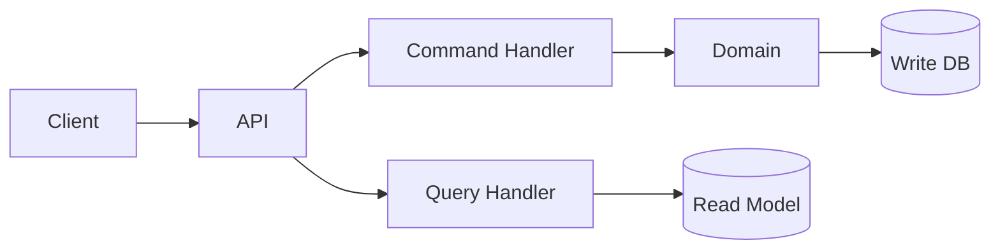
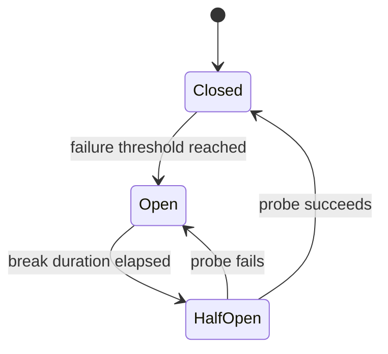
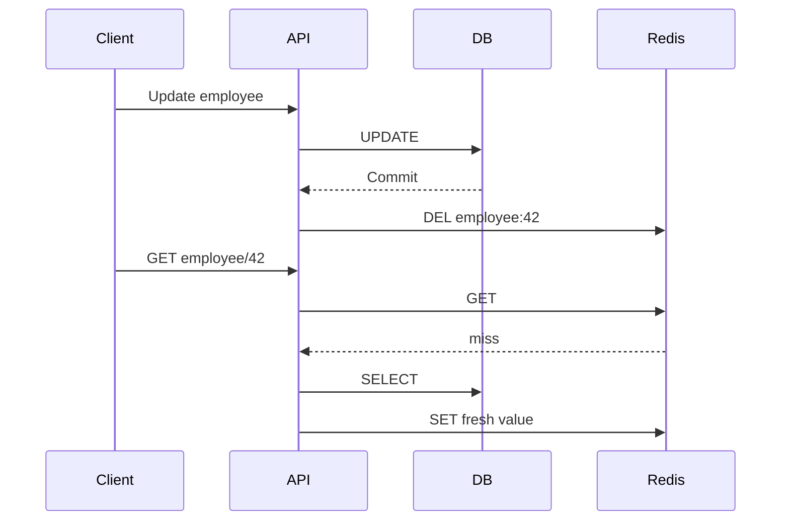
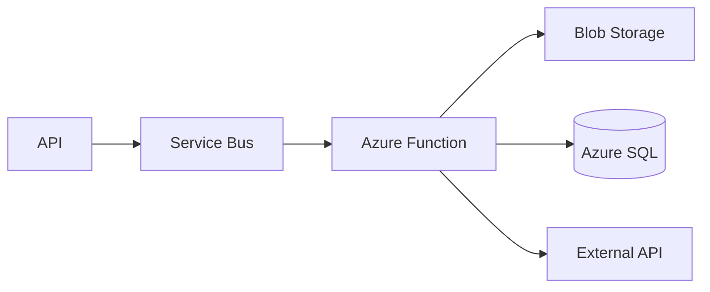
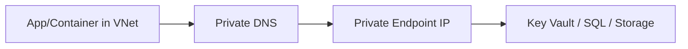
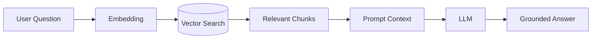
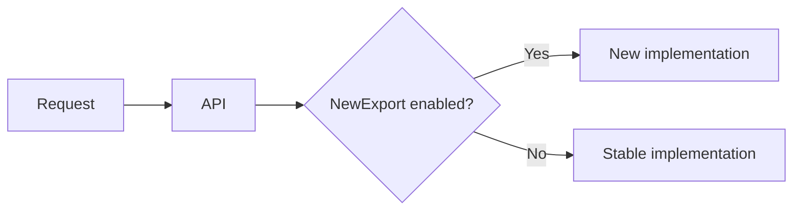

# Daily Knowledge Sharing — 2026-08-18

## Today’s Topics

1. CQRS — tách mô hình đọc/ghi khi nhu cầu hai phía khác nhau.
2. Circuit Breaker — ngăn dependency lỗi kéo sập toàn hệ thống.
3. Transaction Isolation Levels — cân bằng consistency, blocking và throughput.
4. Connection Pooling — tài nguyên ẩn quyết định khả năng chịu tải của API.
5. Cache Invalidation — giữ cache nhanh nhưng không biến dữ liệu thành “đúng lúc, sai lúc”.
6. Azure Functions — event-driven compute và ranh giới với App Service/Worker.
7. Azure Private Endpoint — đưa PaaS vào private network path.
8. SLI, SLO và SLA — biến “hệ thống ổn” thành mục tiêu đo được.
9. RAG — đưa knowledge bên ngoài vào LLM mà không giao quyền quyết định cho model.
10. Feature Flags — tách deployment khỏi release và kiểm soát blast radius.

---

# 1. CQRS — tách Read và Write theo nhu cầu thực tế

### 1. What is it?

CQRS (Command Query Responsibility Segregation) tách thao tác **thay đổi state** (Command) khỏi thao tác **đọc state** (Query). CQRS không đồng nghĩa với microservices, event sourcing hay hai database. Một ứng dụng .NET đơn giản vẫn có thể dùng CQRS trong cùng process và cùng SQL Server.

Command tập trung vào business invariant: “Có được approve timesheet này không?”. Query tập trung vào hình dạng dữ liệu mà UI/API cần: “Trả về timesheet cùng employee name, status và tổng giờ”.

### 2. Why does it exist?

Một model CRUD duy nhất thường bắt đầu đơn giản nhưng dần phải phục vụ hai nhu cầu đối lập. Write cần validation, transaction và domain rule; read cần projection, join, pagination và tốc độ. Ép cả hai đi qua cùng entity/repository thường sinh DTO phức tạp, eager loading dư thừa và business rule rò rỉ.

CQRS cho phép tối ưu hai đường đi độc lập mà không bắt domain model phải phục vụ mọi màn hình.

### 3. How does it work?



Ở mức đơn giản, `Write DB` và `Read Model` có thể vẫn là cùng database. Khi scale lớn hơn, read model có thể được cập nhật bất đồng bộ từ domain/integration events.

### 4. Practical example

```csharp
public sealed record ApproveTimesheet(Guid Id);

public sealed class ApproveTimesheetHandler(AppDbContext db)
{
    public async Task Handle(ApproveTimesheet command, CancellationToken ct)
    {
        var item = await db.Timesheets.SingleAsync(x => x.Id == command.Id, ct);
        item.Approve(); // domain rule nằm ở domain
        await db.SaveChangesAsync(ct);
    }
}

public sealed record TimesheetSummary(Guid Id, string Employee, decimal Hours);

public Task<TimesheetSummary?> GetSummary(Guid id, CancellationToken ct) =>
    db.Timesheets.AsNoTracking()
      .Where(x => x.Id == id)
      .Select(x => new TimesheetSummary(x.Id, x.Employee.Name, x.Entries.Sum(e => e.Hours)))
      .SingleOrDefaultAsync(ct);
```

### 5. Real production scenario

Trong hệ thống timesheet, approve là write flow cần kiểm tra trạng thái, quyền manager và transaction. Dashboard lại đọc hàng nghìn record với aggregation. CQRS cho phép write model giữ domain logic sạch trong khi query dùng projection SQL tối ưu riêng.

### 6. Common mistakes

Biến mỗi CRUD endpoint thành Command/Query chỉ để “đúng pattern”; mặc định tạo hai database; cho query handler load aggregate rồi map trong memory; phát event nhưng không thiết kế consistency; hoặc dùng MediatR rồi gọi đó là CQRS dù read/write vẫn cùng một model và responsibility.

### 7. Trade-offs

**Advantages:** boundary rõ, read dễ tối ưu, write bảo vệ domain tốt hơn, scale độc lập khi cần.

**Costs / Risks:** nhiều type/handler hơn; nếu tách read store sẽ có eventual consistency, synchronization và operational complexity.

### 8. Junior → Middle → Senior understanding

**Junior:** phân biệt Command thay đổi state và Query chỉ đọc.

**Middle:** biết thiết kế handler, validation, transaction và projection hiệu quả.

**Senior / Technical Lead:** quyết định CQRS ở mức nào là đủ; khi nào read store riêng có ROI; thiết kế consistency, event delivery và recovery khi projection lỗi.

### 9. Key takeaway

- CQRS là separation of responsibility, không phải mặc định hai database.
- Chỉ tăng độ phức tạp khi read/write thực sự có nhu cầu khác nhau.
- Read model nên phục vụ consumer; write model nên bảo vệ invariant.

---

# 2. Circuit Breaker — fail fast thay vì retry một dependency đang chết

### 1. What is it?

Circuit Breaker là resilience pattern tạm ngừng gọi một dependency sau khi lỗi vượt ngưỡng. Nó giống cầu dao điện: khi downstream đang hỏng, tiếp tục gửi request chỉ làm tăng timeout, thread/task chờ và áp lực lên hệ thống.

### 2. Why does it exist?

Một API gọi Microsoft Graph hoặc payment provider có thể timeout 10 giây. Nếu 500 request cùng chờ, API của ta cũng cạn connection, tăng latency và cuối cùng lỗi dù phần còn lại vẫn khỏe. Retry mù quáng còn nhân tải lên dependency đang gặp sự cố.

### 3. How does it work?



`Closed` cho request đi qua; `Open` fail fast; `HalfOpen` thử một lượng nhỏ request để kiểm tra recovery.

### 4. Practical example

Với resilience pipeline của .NET, ý tưởng cấu hình là giới hạn retry và circuit breaker theo loại lỗi transient, đồng thời luôn đặt timeout:

```csharp
services.AddHttpClient<GraphClient>(c =>
{
    c.Timeout = TimeSpan.FromSeconds(10);
})
.AddStandardResilienceHandler();
```

Production cần tinh chỉnh policy theo downstream thay vì copy một cấu hình cho mọi API.

### 5. Real production scenario

Employee service gọi Microsoft Graph để cập nhật calendar. Graph bắt đầu trả 503. Circuit mở sau tỷ lệ lỗi đủ cao; request mới nhận lỗi có kiểm soát hoặc được đưa vào queue thay vì giữ HTTP request hàng chục giây. Khi break duration hết, probe kiểm tra Graph trước khi phục hồi traffic.

### 6. Common mistakes

Retry cả lỗi 400/401; retry trước khi có timeout budget; circuit breaker dùng chung cho dependency không liên quan; fallback trả dữ liệu sai nhưng giả vờ thành công; không log state transition; hoặc đặt threshold quá thấp khiến circuit liên tục đóng/mở.

### 7. Trade-offs

**Advantages:** giảm cascading failure, bảo vệ resource, recovery nhanh hơn.

**Costs / Risks:** có thể reject request khi downstream vừa hồi phục; tuning khó; fallback và observability làm hệ thống phức tạp hơn.

### 8. Junior → Middle → Senior understanding

**Junior:** hiểu retry không phải giải pháp cho mọi lỗi.

**Middle:** cấu hình timeout/retry/circuit breaker và phân loại transient error.

**Senior / Technical Lead:** thiết kế end-to-end timeout budget, bulkhead, fallback semantics và SLO khi dependency ngoài quyền kiểm soát.

### 9. Key takeaway

- Timeout giới hạn một call; circuit breaker giới hạn tác động của chuỗi failure.
- Retry phải có backoff/jitter và chỉ áp dụng lỗi transient.
- Fail fast đôi khi đáng tin cậy hơn “cố thêm một lần”.

---

# 3. Transaction Isolation Levels — consistency không miễn phí

### 1. What is it?

Isolation level quy định một transaction được nhìn thấy thay đổi của transaction khác ở mức nào. Nó ảnh hưởng trực tiếp đến dirty read, non-repeatable read, phantom, blocking và concurrency.

### 2. Why does it exist?

Nếu mọi transaction được serialize tuyệt đối, consistency dễ reasoning nhưng throughput thấp. Nếu cho đọc/ghi quá tự do, hệ thống nhanh nhưng có thể đưa ra quyết định dựa trên dữ liệu chưa commit hoặc đã thay đổi giữa transaction.

### 3. How does it work?

Mức phổ biến gồm `Read Committed`, `Repeatable Read`, `Serializable`, và các cơ chế snapshot/MVCC tùy database. SQL Server và PostgreSQL có implementation khác nhau, nên cùng tên isolation không có nghĩa locking behavior hoàn toàn giống nhau.

### 4. Practical example

```csharp
await using var tx = await db.Database.BeginTransactionAsync(
    System.Data.IsolationLevel.Serializable, ct);

var available = await db.Inventory
    .Where(x => x.ProductId == productId)
    .Select(x => x.Quantity)
    .SingleAsync(ct);

if (available < quantity) throw new InvalidOperationException("Insufficient stock");

// update inventory...
await db.SaveChangesAsync(ct);
await tx.CommitAsync(ct);
```

Không nên mặc định dùng `Serializable`; với inventory có thể chọn optimistic concurrency hoặc atomic SQL update hiệu quả hơn.

### 5. Real production scenario

Hai request mua sản phẩm cuối cùng đến cùng lúc. Nếu cả hai cùng đọc quantity=1 rồi cùng update, oversell có thể xảy ra. Giải pháp có thể là lock/isolation cao hơn, row version, hoặc `UPDATE ... WHERE Quantity >= @qty` và kiểm tra affected rows.

### 6. Common mistakes

Giữ transaction trong lúc gọi HTTP; transaction quá dài; nâng isolation để “chắc chắn” mà không đo blocking; hiểu snapshot là không có conflict; hoặc không retry transaction bị serialization failure/deadlock đúng cách.

### 7. Trade-offs

**Advantages của isolation cao:** reasoning consistency dễ hơn.

**Costs / Risks:** lock lâu, deadlock/blocking tăng, throughput giảm. Snapshot giảm read blocking nhưng tăng version-storage cost và vẫn cần xử lý write conflict.

### 8. Junior → Middle → Senior understanding

**Junior:** transaction đảm bảo nhiều thao tác DB thành một đơn vị commit/rollback.

**Middle:** hiểu anomaly, lock và cách EF Core tạo transaction.

**Senior / Technical Lead:** chọn consistency model theo invariant nghiệp vụ, benchmark contention và tránh biến transaction database thành distributed transaction ngoài ý muốn.

### 9. Key takeaway

- Isolation là quyết định business correctness lẫn performance.
- Transaction càng ngắn càng tốt.
- Đừng nâng isolation level trước khi hiểu anomaly cần ngăn chặn.

---

# 4. Connection Pooling — bottleneck trước cả CPU

### 1. What is it?

Connection pooling giữ một tập database connection đã mở để request sau tái sử dụng thay vì thực hiện handshake/authentication mới mỗi lần. `SqlConnection`/Npgsql thường dùng pooling mặc định.

### 2. Why does it exist?

Mở physical DB connection tốn thời gian và tài nguyên server. Nhưng pool cũng hữu hạn: nếu request giữ connection quá lâu, request mới phải chờ dù CPU API còn rất thấp.

### 3. How does it work?

```text
HTTP requests
     │
     ▼
 DbContext / Connection
     │ borrow
     ▼
[ Connection Pool ] ───► Database
     ▲
     │ return on Dispose
```

`Close`/`Dispose` thường trả logical connection về pool chứ không đóng TCP connection ngay.

### 4. Practical example

```csharp
await using var connection = new SqlConnection(connectionString);
await connection.OpenAsync(ct);

await using var command = new SqlCommand(
    "SELECT Id, Name FROM Employees WHERE Id = @id", connection);
command.Parameters.AddWithValue("@id", id);

await using var reader = await command.ExecuteReaderAsync(ct);
```

`await using` đảm bảo connection được trả về pool kể cả khi exception xảy ra.

### 5. Real production scenario

API latency tăng từ 200ms lên 8s trong khi database CPU chỉ 35%. Trace cho thấy request chờ `OpenAsync`: pool đã cạn vì một query report giữ connection 30 giây và traffic tăng đột biến. Fix đúng là tối ưu query/transaction và concurrency, không chỉ tăng pool size.

### 6. Common mistakes

Không dispose connection/DbContext; transaction kéo dài; tăng `Max Pool Size` để che slow query; tạo connection string khác nhau làm phân mảnh pool; hoặc scale app instances khiến tổng số connection vượt giới hạn DB.

### 7. Trade-offs

Pool lớn tăng concurrency nhưng cũng tăng tải database và memory/socket usage. Pool nhỏ bảo vệ DB nhưng tạo queue tại application. Cần sizing theo tổng số instance, workload và capacity database.

### 8. Junior → Middle → Senior understanding

**Junior:** luôn dispose database resource đúng cách.

**Middle:** biết đọc metrics về active/idle/waiting connection và tìm slow query.

**Senior / Technical Lead:** capacity-plan `instances × max pool`, kiểm soát backpressure và tránh connection storm khi autoscale.

### 9. Key takeaway

- Pool exhaustion thường biểu hiện như API chậm chứ không phải “database down”.
- Connection lifetime phải ngắn.
- Tăng pool size không chữa được query chậm.

---

# 5. Cache Invalidation — bài toán consistency của cache

### 1. What is it?

Cache invalidation là chiến lược đảm bảo dữ liệu cache bị xóa/cập nhật khi source of truth thay đổi. Cache nhanh chỉ có giá trị nếu độ stale nằm trong giới hạn nghiệp vụ chấp nhận được.

### 2. Why does it exist?

Cache-aside thường đọc DB khi miss rồi lưu Redis. Nhưng khi DB update, Redis không tự biết. Nếu key tồn tại 30 phút, user có thể thấy dữ liệu cũ 30 phút.

### 3. How does it work?



Ở distributed system, invalidation có thể đi qua event bus để nhiều cache/read model cùng phản ứng.

### 4. Practical example

```csharp
await db.SaveChangesAsync(ct);
await cache.RemoveAsync($"employee:{employee.Id}", ct);
```

Nếu invalidation thất bại sau DB commit, cần chấp nhận TTL ngắn hoặc dùng outbox/event để retry đáng tin cậy.

### 5. Real production scenario

Employee đổi manager. DB đã đúng nhưng Redis còn manager cũ, khiến authorization dựa trên cache cho kết quả sai. Đây là ví dụ dữ liệu không nên cache tùy tiện nếu stale value ảnh hưởng security decision.

### 6. Common mistakes

TTL quá dài; cache authorization-sensitive data không có strategy; delete cache trước DB commit rồi request khác repopulate dữ liệu cũ; wildcard key scan trong production; không version key; coi Redis unavailable là lý do làm API chính thất bại dù DB vẫn khỏe.

### 7. Trade-offs

TTL ngắn tăng freshness nhưng tăng DB load. Explicit invalidation chính xác hơn nhưng thêm coupling/failure path. Event-driven invalidation scale tốt hơn nhưng có eventual consistency.

### 8. Junior → Middle → Senior understanding

**Junior:** cache là bản sao, DB thường là source of truth.

**Middle:** triển khai cache-aside, TTL, invalidation và fallback.

**Senior / Technical Lead:** phân loại dữ liệu theo stale tolerance, thiết kế invalidation failure recovery và chống cache stampede.

### 9. Key takeaway

- Hỏi “stale bao lâu là chấp nhận được?” trước khi cache.
- Update DB và cache không phải atomic transaction mặc định.
- Security/financial state cần consistency nghiêm ngặt hơn catalog/reference data.

---

# 6. Azure Functions — event-driven compute đúng chỗ

### 1. What is it?

Azure Functions là compute model phù hợp với function/event-triggered workload như queue message, timer, HTTP event hoặc blob event. Nó không tự động tốt hơn App Service hay Worker Service; giá trị nằm ở trigger model và khả năng scale theo workload.

### 2. Why does it exist?

Nhiều tác vụ không cần một web server luôn chạy: xử lý file khi upload, consume queue, scheduled cleanup. Functions giảm phần host plumbing và tích hợp trực tiếp với Azure event sources.

### 3. How does it work?



Trigger nhận event, runtime tạo invocation và scale instances theo plan/trigger. Delivery có thể lặp lại, nên handler phải idempotent.

### 4. Practical example

```csharp
[Function("ProcessEmployeeExport")]
public async Task Run(
    [ServiceBusTrigger("employee-export")] string message,
    CancellationToken ct)
{
    var job = JsonSerializer.Deserialize<ExportJob>(message)!;
    await exporter.ProcessAsync(job, ct);
}
```

### 5. Real production scenario

Portal yêu cầu export 200k employee. API tạo job rồi enqueue Service Bus và trả `202 Accepted`. Function xử lý file, lưu Blob Storage và gửi notification. User không phải giữ HTTP connection trong nhiều phút.

### 6. Common mistakes

Cho HTTP Function xử lý task 20 phút; không idempotent; giữ state trong memory; không hiểu retry/dead-letter; gọi dependency không timeout; hoặc chọn Consumption chỉ vì “serverless rẻ” dù workload ổn định 24/7.

### 7. Trade-offs

Functions giảm hosting boilerplate và scale tốt cho burst/event workload. Đổi lại có runtime/plan constraints, cold-start tùy cấu hình, debugging distributed workflow và cost khó đoán với workload rất lớn.

### 8. Junior → Middle → Senior understanding

**Junior:** hiểu trigger/binding và stateless execution.

**Middle:** xử lý retry, idempotency, DLQ, cancellation và observability.

**Senior / Technical Lead:** chọn Functions vs App Service vs Container Apps vs Worker dựa trên execution model, latency, networking, scale và cost.

### 9. Key takeaway

- Functions phù hợp event-driven workload, không phải mặc định cho mọi backend.
- Assume at-least-once delivery và viết idempotent.
- Hosting choice phải dựa trên workload shape.

---

# 7. Azure Private Endpoint — private path tới PaaS

### 1. What is it?

Private Endpoint gán một private IP trong Virtual Network cho Azure PaaS resource như Storage, SQL, Key Vault. Application truy cập resource qua private network path thay vì public endpoint trực tiếp.

### 2. Why does it exist?

Firewall IP allowlist vẫn dùng public network surface và trở nên khó quản lý khi nhiều service/region. Private Endpoint giảm exposure và hỗ trợ kiến trúc network isolation nghiêm ngặt.

### 3. How does it work?



DNS là phần quan trọng: hostname public của service phải resolve thành private IP từ network thích hợp.

### 4. Practical example

Một ASP.NET Core app dùng Key Vault SDK bình thường; code không cần biết private IP. Infrastructure cấu hình Private Endpoint và Private DNS Zone, còn authentication vẫn dùng Managed Identity.

```csharp
var client = new SecretClient(
    new Uri("https://my-vault.vault.azure.net/"),
    new DefaultAzureCredential());
```

### 5. Real production scenario

Backend xử lý dữ liệu nhân sự chạy trong VNet. Azure SQL và Key Vault tắt public network access. DNS resolve hai service về private endpoints; Managed Identity giải quyết identity, Private Endpoint giải quyết network reachability.

### 6. Common mistakes

Tạo endpoint nhưng quên Private DNS; nghĩ private network thay thế authentication; để public access vẫn mở mà không có lý do; không thiết kế DNS cho on-prem/VPN; hoặc dùng quá nhiều endpoints mà không tính cost và operational overhead.

### 7. Trade-offs

**Advantages:** giảm public exposure, network control tốt hơn.

**Costs / Risks:** DNS/network complexity, troubleshooting khó hơn, thêm chi phí endpoint và yêu cầu topology VNet hợp lý.

### 8. Junior → Middle → Senior understanding

**Junior:** phân biệt authentication và network access.

**Middle:** hiểu VNet, private IP, DNS resolution và public access setting.

**Senior / Technical Lead:** thiết kế hub-spoke/DNS, hybrid connectivity, failover và policy ở quy mô nhiều subscription.

### 9. Key takeaway

- Private Endpoint giải quyết network path, không giải quyết identity.
- DNS thường là nguyên nhân đầu tiên khi cấu hình “đúng mà không connect được”.
- Managed Identity + Private Endpoint giải quyết hai lớp security khác nhau.

---

# 8. SLI, SLO và SLA — reliability phải đo được

### 1. What is it?

**SLI** là chỉ số thực tế, ví dụ tỷ lệ request thành công hoặc p95 latency. **SLO** là mục tiêu nội bộ cho SLI, ví dụ 99.9% request thành công trong 30 ngày. **SLA** là cam kết với khách hàng và có thể kèm hậu quả thương mại.

### 2. Why does it exist?

“API phải ổn định” không thể dùng để quyết định release hay ưu tiên reliability work. SLO tạo ngôn ngữ chung giữa engineering và business.

### 3. How does it work?

Ví dụ SLO availability 99.9% trong 30 ngày cho phép error budget khoảng 0.1%. Team theo dõi burn rate: nếu lỗi đang tiêu budget quá nhanh, ưu tiên reliability thay vì feature rollout.

### 4. Practical example

Với API, một SLI hữu ích có thể là:

```text
good requests = HTTP requests completed < 1s and status < 500
valid requests = all eligible HTTP requests
SLI = good requests / valid requests
SLO = SLI >= 99.9% over rolling 30 days
```

Application Insights/OpenTelemetry cung cấp metrics để tính các chỉ số này.

### 5. Real production scenario

Notification API có 99.95% availability nhưng p95 latency tăng lên 12 giây. Nếu chỉ nhìn uptime, hệ thống “healthy”; nếu SLO có latency objective, incident được phát hiện đúng với trải nghiệm user.

### 6. Common mistakes

Dùng CPU làm SLI user-facing; đặt SLO 100%; alert mọi error đơn lẻ; SLA = SLO; đo average latency thay vì percentile; hoặc không loại health-check/internal traffic khỏi denominator.

### 7. Trade-offs

SLO cao hơn yêu cầu redundancy, engineering time và cost lớn hơn. SLO thấp quá làm mất niềm tin. Mục tiêu phải phản ánh user journey và business impact.

### 8. Junior → Middle → Senior understanding

**Junior:** phân biệt logs/metrics với service objective.

**Middle:** xây dashboard, percentile và alert dựa trên SLI.

**Senior / Technical Lead:** thiết kế error budget, burn-rate alerts và dùng SLO để quyết định release/risk/cost.

### 9. Key takeaway

- SLI đo; SLO đặt mục tiêu; SLA cam kết.
- Reliability nên đo theo trải nghiệm người dùng.
- 100% reliability thường là mục tiêu kinh tế không hợp lý.

---

# 9. RAG — grounding LLM bằng dữ liệu của hệ thống

### 1. What is it?

Retrieval-Augmented Generation (RAG) tìm các đoạn dữ liệu liên quan rồi đưa chúng vào context của LLM để model trả lời dựa trên knowledge ngoài model weights. RAG không phải database “thông minh”; retrieval và authorization vẫn phải do deterministic system kiểm soát.

### 2. Why does it exist?

LLM không biết tài liệu nội bộ mới nhất và có thể hallucinate. Fine-tuning không phải cách tốt để cập nhật knowledge thay đổi hàng ngày. RAG cho phép index tài liệu và truy xuất phần liên quan tại runtime.

### 3. How does it work?



Pipeline production còn cần ACL filtering, metadata, reranking, citation và evaluation.

### 4. Practical example

```csharp
var chunks = await search.FindAsync(
    query: question,
    tenantId: currentTenant.Id,
    topK: 5,
    cancellationToken: ct);

var context = string.Join("\n\n", chunks.Select(x => x.Text));
var answer = await llm.AnswerAsync(question, context, ct);
```

`tenantId` phải filter trước/ở retrieval layer; không gửi tài liệu tenant khác cho model rồi yêu cầu model “đừng dùng”.

### 5. Real production scenario

AI assistant trả lời policy nghỉ phép. User hỏi câu tự nhiên; system tìm policy hiện hành theo country/tenant/version, đưa 3 chunk liên quan vào context và trả answer kèm nguồn. Nếu retrieval không tìm đủ evidence, system nên nói không đủ dữ liệu thay vì buộc model đoán.

### 6. Common mistakes

Chunk theo số ký tự mù quáng; vector search không metadata filter; không version document; nhét quá nhiều context; không đánh giá retrieval riêng với generation; để prompt injection trong document điều khiển tool; hoặc log nguyên dữ liệu nhạy cảm.

### 7. Trade-offs

RAG cập nhật knowledge nhanh và traceable hơn fine-tuning cho factual data. Đổi lại có indexing pipeline, retrieval latency, embedding/vector cost và failure mode mới: answer sai vì retrieval sai dù model hoạt động đúng.

### 8. Junior → Middle → Senior understanding

**Junior:** hiểu embedding/search/context/generation là các bước khác nhau.

**Middle:** triển khai chunking, metadata, retrieval, citations và evaluation dataset.

**Senior / Technical Lead:** thiết kế security boundary, freshness, multi-tenant isolation, observability, cost và fallback khi retrieval quality thấp.

### 9. Key takeaway

- RAG quality phụ thuộc retrieval ít nhất ngang model quality.
- Authorization phải deterministic trước khi context vào LLM.
- Không có evidence thì không nên ép model tạo “câu trả lời có vẻ đúng”.

---

# 10. Feature Flags — deployment không đồng nghĩa release

### 1. What is it?

Feature flag là cơ chế bật/tắt behavior tại runtime mà không cần deploy lại binary. Nó tách **deployment** (đưa code lên production) khỏi **release** (cho user sử dụng feature).

### 2. Why does it exist?

Một deployment lớn chứa feature chưa sẵn sàng khiến team phải giữ branch lâu hoặc rollback toàn build nếu feature lỗi. Flag cho phép code tồn tại production nhưng chỉ mở cho internal users, một tenant hoặc tỷ lệ traffic nhỏ.

### 3. How does it work?



Flag evaluation có thể dựa trên environment, user, tenant hoặc rollout percentage.

### 4. Practical example

```csharp
if (await featureManager.IsEnabledAsync("NewTimesheetApproval"))
{
    return await newFlow.ExecuteAsync(request, ct);
}

return await legacyFlow.ExecuteAsync(request, ct);
```

Critical flag nên có default an toàn nếu configuration service unavailable.

### 5. Real production scenario

Team deploy approval workflow mới vào toàn bộ App Service nhưng chỉ bật cho tenant nội bộ. Metrics ổn thì tăng 5% → 25% → 100%. Nếu error rate tăng, tắt flag trong vài giây mà không rollback deployment chứa các fix khác.

### 6. Common mistakes

Flag tồn tại mãi; nested flags tạo combinatorial complexity; dùng flag thay authorization; không test cả on/off path; config propagation quá chậm; hoặc thay schema DB không backward-compatible rồi nghĩ flag có thể rollback mọi thứ.

### 7. Trade-offs

**Advantages:** giảm blast radius, progressive delivery, rollback logic nhanh.

**Costs / Risks:** technical debt, nhiều execution path, testing phức tạp và dependency vào flag service/configuration.

### 8. Junior → Middle → Senior understanding

**Junior:** biết flag là runtime decision, không phải `if (env == prod)` rải rác.

**Middle:** implement targeting, telemetry và test cả hai branches.

**Senior / Technical Lead:** thiết kế lifecycle/owner/expiry, safe default, schema compatibility và kết hợp canary deployment với business rollout.

### 9. Key takeaway

- Deploy code và release feature là hai sự kiện khác nhau.
- Flag cần owner và ngày xóa, nếu không sẽ thành debt.
- Feature flag không thay thế backward-compatible database migration hay authorization.