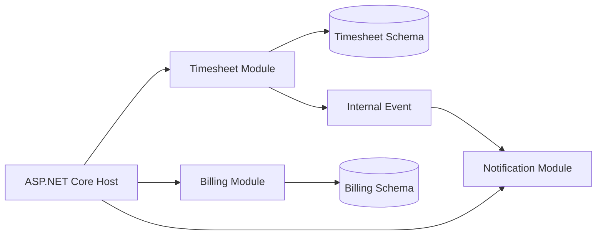
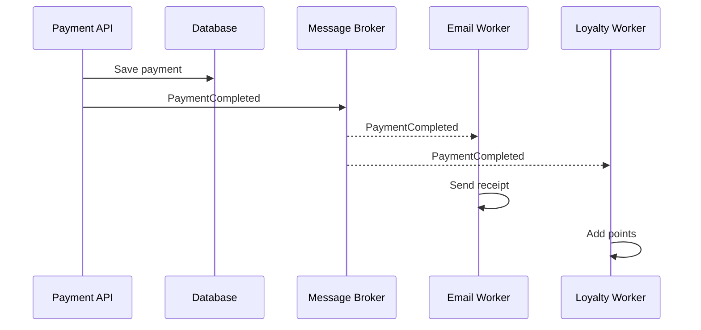
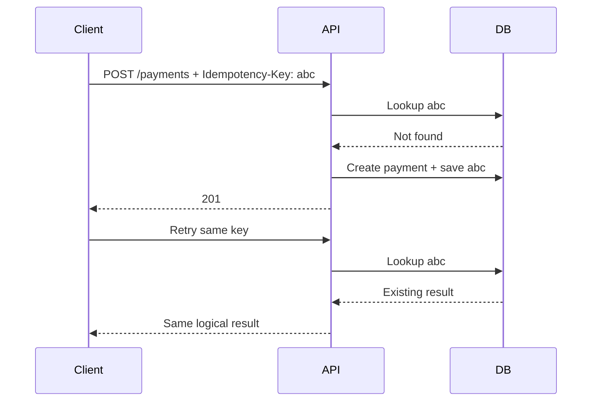
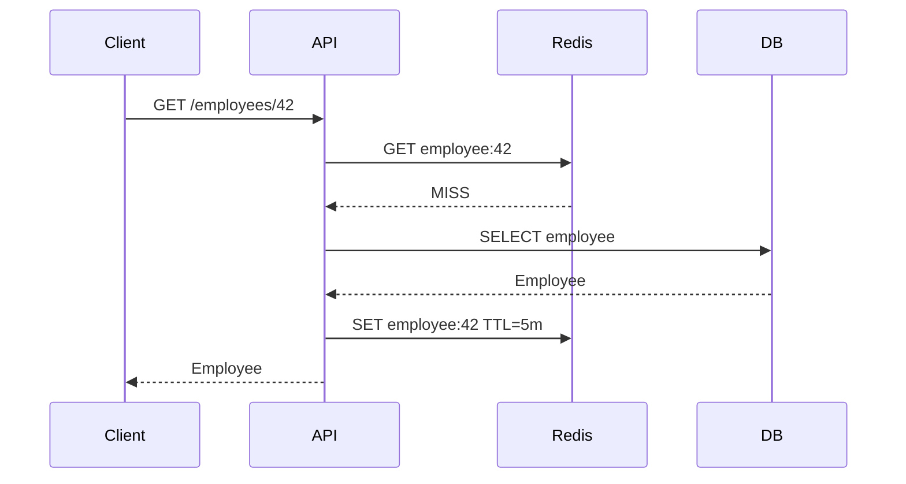
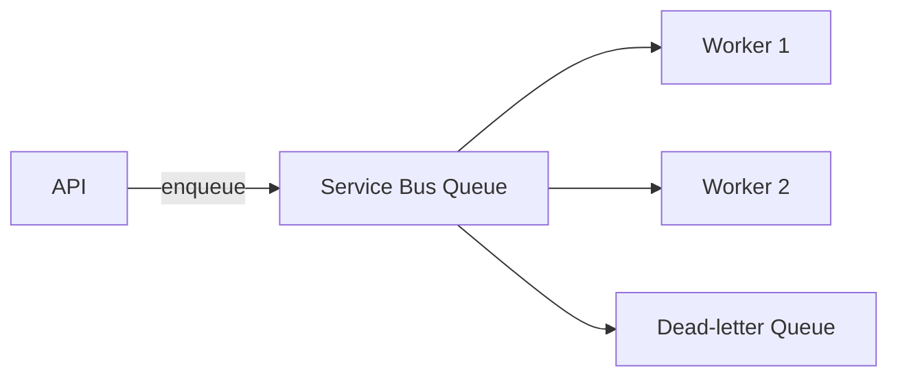
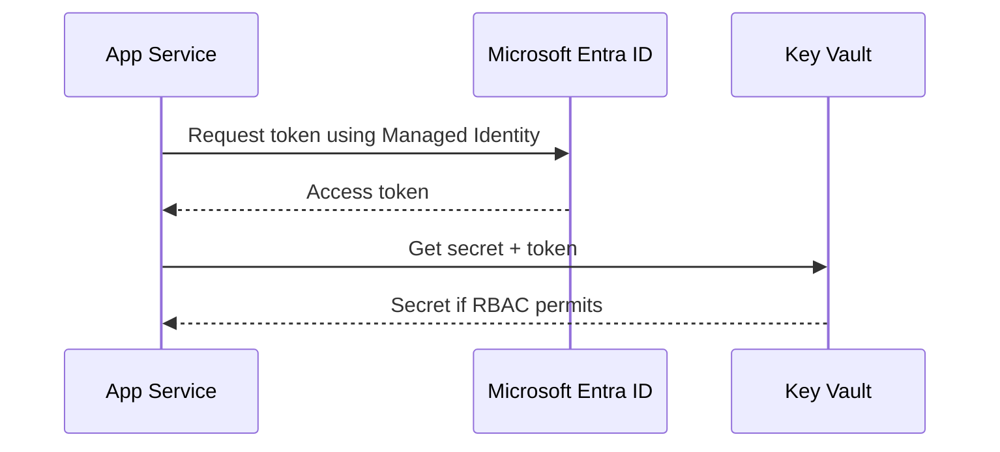
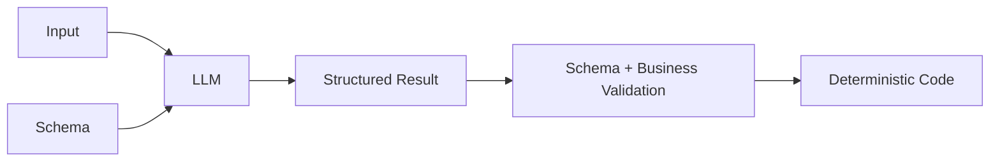
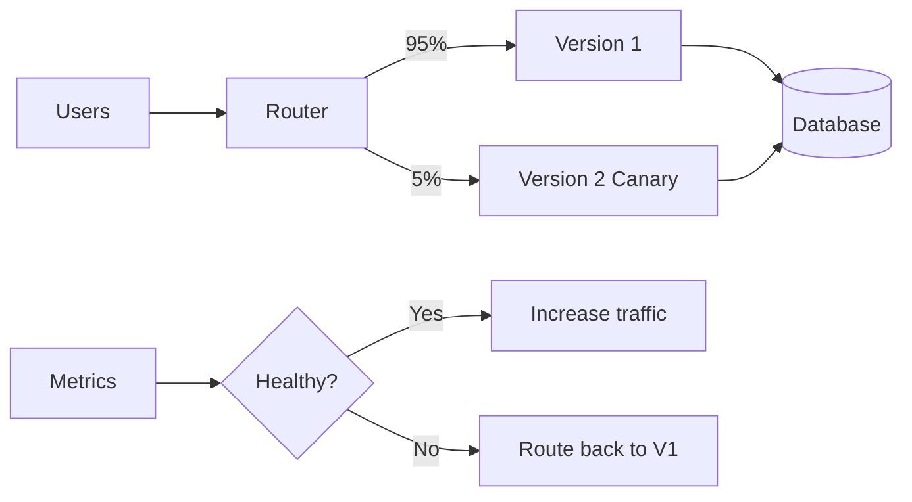

# Daily Knowledge Sharing — 2026-08-19

## Today’s Topics

1. Modular Monolith — chia boundary rõ mà chưa phải trả giá của Microservices
2. Event-Driven Architecture — tách producer/consumer và chấp nhận eventual consistency
3. Idempotency — chống xử lý trùng trong API và background workflow
4. Optimistic Concurrency với EF Core — ngăn lost update mà không khóa dài
5. Cache Aside với Redis — tăng tốc đọc nhưng phải thiết kế invalidation và failure mode
6. Azure Service Bus — messaging tin cậy cho xử lý bất đồng bộ
7. Managed Identity + Azure Key Vault — loại bỏ credential tĩnh khỏi ứng dụng
8. OpenTelemetry + Distributed Tracing — lần theo một request xuyên nhiều thành phần
9. Structured Output cho LLM — biến output xác suất thành contract có thể kiểm soát
10. Canary Deployment + Feature Flags — giảm blast radius khi release

---

# 1. Modular Monolith

### 1. What is it?

Modular Monolith vẫn là **một ứng dụng được deploy như một unit**, nhưng bên trong được chia thành các module nghiệp vụ có boundary rõ ràng. Ví dụ hệ thống SaaS có `Identity`, `Billing`, `Timesheet`, `Notification`; mỗi module sở hữu use case, model và persistence concern của nó thay vì toàn bộ code cùng truy cập một tập service/repository chung.

Điểm quan trọng: đây không phải “monolith có nhiều folder”. Boundary phải được thực thi bằng dependency, API nội bộ và ownership dữ liệu.

### 2. Why does it exist?

Một monolith thiếu boundary thường tiến dần thành “big ball of mud”: `TimesheetService` gọi trực tiếp `EmployeeRepository`, `NotificationRepository`, `BillingService`; thay đổi một module gây regression module khác.

Microservices giải quyết isolation mạnh hơn nhưng mang thêm network failure, deployment orchestration, distributed tracing và eventual consistency. Modular Monolith cho phép lấy phần lớn lợi ích về modularity trước khi cần distribution.

### 3. How does it work?



Module khác không được tùy tiện lấy `DbContext` của Timesheet. Giao tiếp có thể qua application contract hoặc domain/integration event nội bộ.

### 4. Practical example

```csharp
public interface ITimesheetModule
{
    Task<SubmitTimesheetResult> SubmitAsync(
        SubmitTimesheetCommand command,
        CancellationToken ct);
}

internal sealed class TimesheetModule(TimesheetDbContext db)
    : ITimesheetModule
{
    public async Task<SubmitTimesheetResult> SubmitAsync(
        SubmitTimesheetCommand command,
        CancellationToken ct)
    {
        var sheet = Timesheet.Submit(command.EmployeeId, command.Week);
        db.Timesheets.Add(sheet);
        await db.SaveChangesAsync(ct);
        return new(sheet.Id);
    }
}
```

`TimesheetDbContext` để `internal` giúp ngăn module khác phụ thuộc trực tiếp persistence implementation.

### 5. Real production scenario

Trong employee platform, request submit timesheet đi vào Timesheet module. Module validate business rule, lưu dữ liệu và phát `TimesheetSubmitted`. Notification module phản ứng để gửi mail. Billing có thể dùng event để cập nhật billable hours mà không cần Timesheet gọi trực tiếp `BillingService`.

### 6. Common mistakes

- Chỉ chia folder nhưng mọi module dùng chung repository/service.
- Shared project chứa toàn bộ entity và business logic, biến nó thành dependency trung tâm.
- Cho module khác query trực tiếp table của nhau.
- Dùng event cho mọi method call dù synchronous call đơn giản hơn.
- Tách module quá nhỏ theo technical layer thay vì business capability.

### 7. Trade-offs

**Advantages:** deployment đơn giản, transaction local dễ hơn Microservices, boundary tốt, refactor nhanh và có đường tiến hóa sang service riêng.

**Costs / Risks:** isolation runtime yếu hơn Microservices; một process crash ảnh hưởng toàn app; team phải kỷ luật để boundary không bị xuyên thủng; scale thường theo toàn application thay vì từng module.

### 8. Junior → Middle → Senior understanding

**Junior:** hiểu module là business boundary chứ không chỉ folder.

**Middle:** biết enforce dependency, DI registration, persistence ownership và module contract.

**Senior / Technical Lead:** quyết định boundary nào đáng tách, module nào cần synchronous/event communication, khi nào modular monolith đủ và khi nào operational/scaling requirement thực sự biện minh cho Microservices.

### 9. Key takeaway

- Distribution không phải điều kiện để có modularity.
- Boundary tốt quan trọng hơn số lượng project.
- Bắt đầu modular trước; chỉ tách service khi có lý do vận hành rõ ràng.

---

# 2. Event-Driven Architecture

### 1. What is it?

Event-Driven Architecture (EDA) tổ chức hệ thống quanh các sự kiện mô tả **điều đã xảy ra**, ví dụ `OrderPaid`, `EmployeeDeactivated`, `FileUploaded`. Producer phát event mà không cần biết chính xác consumer nào sẽ xử lý.

### 2. Why does it exist?

Nếu payment API phải đồng bộ gọi inventory, email, analytics và loyalty, latency và availability của request phụ thuộc vào tất cả downstream. Một service lỗi có thể làm payment tưởng như thất bại dù tiền đã thu.

EDA giảm temporal coupling: producer hoàn thành transaction chính rồi consumer xử lý công việc liên quan độc lập.

### 3. How does it work?



Trong production, cần xử lý atomicity giữa DB và broker, thường bằng Outbox Pattern.

### 4. Practical example

```csharp
public sealed record EmployeeDeactivated(
    Guid EmployeeId,
    DateTimeOffset OccurredAt);

public async Task HandleAsync(EmployeeDeactivated message, CancellationToken ct)
{
    await graphCalendarCleaner.RemoveFutureEventsAsync(message.EmployeeId, ct);
}
```

Consumer phải chịu được duplicate delivery và retry.

### 5. Real production scenario

Khi employee bị offboard, transaction chính cập nhật trạng thái. Sau đó các consumer độc lập revoke access, xử lý mailbox, gửi notification và ghi audit. User không cần chờ toàn bộ Microsoft 365 operation hoàn tất trong HTTP request.

### 6. Common mistakes

- Nghĩ message broker đảm bảo exactly-once end-to-end.
- Consumer không idempotent.
- Không có dead-letter queue hoặc retry policy.
- Event chứa quá nhiều internal entity detail.
- Không version schema.
- Publish event trước khi database transaction commit.

### 7. Trade-offs

**Advantages:** loose coupling, scale consumer độc lập, hấp thụ traffic burst, resilience tốt hơn.

**Costs / Risks:** eventual consistency, duplicate/out-of-order message, debugging khó hơn, cần tracing và operational tooling.

### 8. Junior → Middle → Senior understanding

**Junior:** phân biệt command “hãy làm X” với event “X đã xảy ra”.

**Middle:** implement consumer, retry, idempotency, DLQ và correlation ID.

**Senior / Technical Lead:** thiết kế event contract, consistency boundary, Outbox/Inbox, ordering requirement và failure recovery.

### 9. Key takeaway

- EDA đổi coupling đồng bộ lấy eventual consistency.
- Assume at-least-once delivery và thiết kế consumer idempotent.
- Messaging không xóa failure; nó chuyển failure sang nơi cần quan sát và phục hồi tốt hơn.

---

# 3. Idempotency trong API và background workflow

### 1. What is it?

Một operation idempotent có thể được gửi lại nhiều lần nhưng **business effect cuối cùng vẫn tương đương một lần xử lý**. Đây là yêu cầu quan trọng với payment, webhook, message consumer và job retry.

### 2. Why does it exist?

Distributed system không thể luôn biết request thất bại trước hay sau khi server commit. Client timeout có thể retry trong khi lần đầu đã tạo payment. Nếu không có idempotency, retry hợp lệ tạo duplicate side effect.

### 3. How does it work?



Key cần unique constraint để hai request concurrent không cùng thắng.

### 4. Practical example

```csharp
public sealed class IdempotencyRecord
{
    public required string Key { get; init; }
    public required string RequestHash { get; init; }
    public required string ResponseJson { get; set; }
}
```

SQL:

```sql
CREATE UNIQUE INDEX UX_Idempotency_Key
ON IdempotencyRecords([Key]);
```

Nên kiểm tra request hash: cùng key nhưng payload khác phải bị reject thay vì trả kết quả cũ một cách im lặng.

### 5. Real production scenario

Payment client gửi `POST /payments`. Network timeout sau commit khiến client retry. API nhận cùng idempotency key và trả payment đã tạo, không charge lần hai. Tương tự, Service Bus redeliver `EmployeeOffboarded` không được revoke/send mail lặp vô hạn.

### 6. Common mistakes

- Chỉ kiểm tra “record có tồn tại” mà không có unique constraint.
- Dùng random key do server tạo sau khi request tới — không giúp client retry.
- Không xác định TTL cho idempotency record.
- Cùng key nhưng payload khác vẫn xử lý.
- Nhầm HTTP idempotency với business idempotency.

### 7. Trade-offs

**Advantages:** retry an toàn, giảm duplicate side effect, cải thiện resilience.

**Costs / Risks:** cần storage, cleanup, concurrency control; response caching có thể tốn dung lượng; scope/key semantics phải rõ.

### 8. Junior → Middle → Senior understanding

**Junior:** hiểu tại sao retry POST có thể nguy hiểm.

**Middle:** biết implement key storage, unique index, transaction và request fingerprint.

**Senior / Technical Lead:** xác định idempotency boundary xuyên service, retention policy và cách phối hợp với Outbox/Inbox.

### 9. Key takeaway

- Retry và idempotency phải được thiết kế cùng nhau.
- Database constraint là hàng phòng thủ concurrency quan trọng.
- “Exactly once” thường được đạt ở business effect bằng deduplication, không phải nhờ network hoàn hảo.

---

# 4. Optimistic Concurrency với EF Core

### 1. What is it?

Optimistic Concurrency cho phép nhiều request đọc cùng record mà không giữ lock lâu, nhưng phát hiện khi một request đang update dữ liệu đã bị request khác thay đổi.

### 2. Why does it exist?

Ví dụ A và B cùng đọc Employee version 5. A đổi department và save. B vẫn giữ snapshot cũ rồi đổi email; nếu update toàn row, B có thể ghi đè thay đổi của A — **lost update**.

### 3. How does it work?

EF Core đưa concurrency token vào `WHERE` của `UPDATE`:

```sql
UPDATE Employees
SET Email = @email
WHERE Id = @id AND RowVersion = @originalVersion;
```

Nếu affected rows = 0, dữ liệu đã thay đổi; EF Core ném `DbUpdateConcurrencyException`.

### 4. Practical example

```csharp
public sealed class Employee
{
    public Guid Id { get; set; }
    public string Email { get; set; } = null!;

    [Timestamp]
    public byte[] RowVersion { get; set; } = null!;
}
```

```csharp
try
{
    await db.SaveChangesAsync(ct);
}
catch (DbUpdateConcurrencyException)
{
    return Results.Conflict(new
    {
        error = "Employee was modified by another request. Reload and retry."
    });
}
```

### 5. Real production scenario

Hai admin cùng sửa employee profile. Thay vì admin thứ hai âm thầm overwrite dữ liệu admin thứ nhất, API trả `409 Conflict`; UI reload version mới và yêu cầu merge/retry.

### 6. Common mistakes

- Catch exception rồi tự động retry bằng dữ liệu cũ, vẫn gây lost intent.
- Không trả version/ETag cho client khi disconnected editing.
- Dùng optimistic concurrency cho resource có contention cực cao mà không đánh giá retry storm.
- Nghĩ transaction mặc định tự giải quyết mọi lost update.

### 7. Trade-offs

**Advantages:** không giữ long-lived lock, throughput tốt khi conflict hiếm.

**Costs / Risks:** conflict phải được resolve; UX phức tạp hơn; workload contention cao có thể retry nhiều.

### 8. Junior → Middle → Senior understanding

**Junior:** hiểu lost update.

**Middle:** cấu hình concurrency token, bắt exception, map `409` và test concurrent update.

**Senior / Technical Lead:** chọn optimistic/pessimistic strategy theo contention, business invariant và transaction topology.

### 9. Key takeaway

- Optimistic concurrency không ngăn conflict; nó **phát hiện** conflict.
- Conflict resolution là business decision.
- Đừng mặc định rằng `SaveChanges()` bảo vệ khỏi lost update.

---

# 5. Cache Aside với Redis

### 1. What is it?

Cache Aside để application chủ động đọc cache trước; cache miss thì query source of truth rồi populate cache. Redis thường nằm giữa API instances và database như distributed cache.

### 2. Why does it exist?

Repeated read vào database làm tăng latency và DB load. In-memory cache nhanh nhưng mỗi app instance có bản riêng. Redis cung cấp shared cache cho nhiều instance.

### 3. How does it work?



Khi update, application thường update DB rồi invalidate cache. Redis down phải được xem xét: với cache thuần túy, hệ thống thường nên degrade về DB thay vì mất availability hoàn toàn.

### 4. Practical example

```csharp
var key = $"employee:{id}";
var cached = await cache.GetStringAsync(key, ct);
if (cached is not null)
    return JsonSerializer.Deserialize<EmployeeDto>(cached)!;

var employee = await db.Employees
    .AsNoTracking()
    .Where(x => x.Id == id)
    .Select(x => new EmployeeDto(x.Id, x.Name, x.Email))
    .SingleAsync(ct);

await cache.SetStringAsync(
    key,
    JsonSerializer.Serialize(employee),
    new DistributedCacheEntryOptions
    {
        AbsoluteExpirationRelativeToNow = TimeSpan.FromMinutes(5)
    }, ct);

return employee;
```

### 5. Real production scenario

Employee directory được đọc hàng nghìn lần nhưng profile đổi ít. Cache giảm DB load đáng kể. Khi HR update employee, service commit DB trước rồi xóa `employee:{id}`; lần đọc kế tiếp refill dữ liệu mới.

### 6. Common mistakes

- TTL quá dài cho dữ liệu cần freshness cao.
- Cache PII/sensitive token mà không xem xét exposure.
- Không xử lý cache stampede khi hot key hết hạn.
- Redis lỗi làm API lỗi dù DB vẫn khỏe.
- Cache object graph lớn và serialization đắt hơn query.

### 7. Trade-offs

**Advantages:** latency thấp, giảm DB load, scale read tốt.

**Costs / Risks:** stale data, invalidation complexity, thêm network hop và infrastructure cost; cache stampede có thể chuyển thành DB incident.

### 8. Junior → Middle → Senior understanding

**Junior:** hiểu hit, miss, TTL.

**Middle:** implement fallback, invalidation, serialization và cache key convention.

**Senior / Technical Lead:** quyết định consistency requirement, stampede protection, hot-key strategy, Redis sizing và behavior khi cache outage.

### 9. Key takeaway

- Cache là optimization, không mặc định là source of truth.
- Invalidation là phần khó nhất của caching.
- Thiết kế cả cache hit, miss, stale và cache-down path.

---

# 6. Azure Service Bus

### 1. What is it?

Azure Service Bus là managed enterprise message broker cung cấp Queue và Topic/Subscription cho asynchronous messaging, với các capability như lock-based processing, retry/redelivery và dead-letter queue.

### 2. Why does it exist?

HTTP synchronous không phù hợp với mọi workflow. File processing 5 phút hoặc Microsoft Graph operation dễ timeout; traffic burst cũng có thể overwhelm downstream. Queue tách tốc độ producer khỏi consumer.

### 3. How does it work?



Consumer nhận message dưới lock, xử lý rồi complete. Nếu thất bại hoặc lock hết hạn, message có thể được redeliver. Sau số lần delivery nhất định, poison message đi vào DLQ.

### 4. Practical example

```csharp
var client = new ServiceBusClient(
    fullyQualifiedNamespace,
    new DefaultAzureCredential());

var sender = client.CreateSender("employee-offboarding");
await sender.SendMessageAsync(
    new ServiceBusMessage(BinaryData.FromObjectAsJson(command))
    {
        MessageId = command.OperationId.ToString()
    }, ct);
```

`MessageId` hữu ích cho correlation/dedup strategy, nhưng consumer vẫn nên idempotent.

### 5. Real production scenario

API nhận request offboarding và ghi trạng thái nhanh. Worker xử lý mailbox/Graph sau. Nếu Microsoft 365 tạm thời throttle, message được retry mà HTTP request ban đầu không phải giữ connection hàng phút.

### 6. Common mistakes

- Không monitor DLQ.
- Lock duration ngắn hơn processing nhưng không renew phù hợp.
- Retry poison message vô hạn.
- Message quá lớn.
- Dựa vào queue để thay thế database transaction mà không dùng Outbox khi cần atomicity.
- Shared connection/client lifecycle không hợp lý.

### 7. Trade-offs

**Advantages:** buffering, decoupling, retry, scale consumer, managed availability.

**Costs / Risks:** eventual consistency, thêm Azure cost, duplicate/out-of-order possibility và operational complexity.

### 8. Junior → Middle → Senior understanding

**Junior:** hiểu queue và consumer.

**Middle:** biết complete/abandon, DLQ, retry, lock, cancellation và idempotency.

**Senior / Technical Lead:** chọn queue/topic, partition/order requirement, Outbox, capacity, backpressure và disaster behavior.

### 9. Key takeaway

- Queue là boundary về thời gian giữa producer và consumer.
- Redelivery là behavior bình thường, không phải edge case.
- DLQ không phải thùng rác; nó cần monitoring và recovery process.

---

# 7. Managed Identity + Azure Key Vault

### 1. What is it?

Managed Identity cấp identity do Azure quản lý cho workload như App Service, Function hoặc VM. Workload dùng identity đó để lấy token từ Microsoft Entra ID thay vì lưu client secret. Key Vault lưu secret/key/certificate cần được quản lý tập trung.

### 2. Why does it exist?

Connection string, client secret trong `appsettings.json`, environment variable hoặc CI secret đều có vòng đời rotation và nguy cơ leak. Managed Identity loại bỏ credential tĩnh trong nhiều service-to-service flow.

### 3. How does it work?



### 4. Practical example

```csharp
var credential = new DefaultAzureCredential();
var secretClient = new SecretClient(
    new Uri("https://my-vault.vault.azure.net/"),
    credential);

KeyVaultSecret secret = await secretClient.GetSecretAsync(
    "ThirdPartyApiKey",
    cancellationToken: ct);
```

Local development có thể dùng developer credential; Azure runtime tự dùng Managed Identity.

### 5. Real production scenario

ASP.NET Core App Service cần đọc third-party API key từ Key Vault và kết nối Azure SQL bằng Entra authentication. App Service identity được cấp quyền tối thiểu. Không còn SQL password/client secret phải copy vào deployment configuration.

### 6. Common mistakes

- Cho identity quyền quá rộng như Key Vault Administrator.
- Nhầm authentication thành authorization: có identity không có nghĩa được truy cập resource.
- Key Vault private endpoint nhưng app không có VNet/DNS path phù hợp.
- Gọi Key Vault cho mọi request thay vì cache secret hợp lý.
- Vẫn log secret sau khi lấy được.

### 7. Trade-offs

**Advantages:** giảm secret sprawl, rotation đơn giản hơn, RBAC/audit tốt.

**Costs / Risks:** phụ thuộc Entra/network, RBAC và private networking phức tạp hơn; third-party secret vẫn phải tồn tại ở đâu đó và cần lifecycle management.

### 8. Junior → Middle → Senior understanding

**Junior:** hiểu vì sao không hard-code secret.

**Middle:** cấu hình Managed Identity, RBAC, `DefaultAzureCredential`, Key Vault và debug 401/403/network.

**Senior / Technical Lead:** thiết kế least privilege, private endpoint/DNS, secret rotation, availability và break-glass strategy.

### 9. Key takeaway

- Ưu tiên identity thay vì credential tĩnh khi Azure service hỗ trợ.
- Authentication và authorization là hai bước khác nhau.
- Secret management gồm cả access, rotation, audit và network boundary.

---

# 8. OpenTelemetry và Distributed Tracing

### 1. What is it?

OpenTelemetry (OTel) là chuẩn/instrumentation ecosystem cho traces, metrics và logs. Distributed tracing gắn các operation trong cùng request bằng trace/span để biết thời gian bị tiêu ở đâu xuyên API, database, HTTP call và worker.

### 2. Why does it exist?

Log `Request failed` trong từng service không đủ khi một user request đi qua API → Service Bus → worker → Graph. Không có correlation, incident investigation biến thành ghép timestamp thủ công.

### 3. How does it work?

```text
Trace: submit-timesheet
├── Span: POST /timesheets       120 ms
│   ├── Span: SQL INSERT          18 ms
│   └── Span: ServiceBus SEND     11 ms
└── Span: notification-worker    840 ms
    └── Span: HTTP Graph         760 ms
```

Trace context được propagate qua HTTP header hoặc message metadata.

### 4. Practical example

```csharp
builder.Services.AddOpenTelemetry()
    .WithTracing(tracing => tracing
        .AddAspNetCoreInstrumentation()
        .AddHttpClientInstrumentation()
        .AddEntityFrameworkCoreInstrumentation());
```

Custom span:

```csharp
using var activity = ActivitySource.StartActivity("ProcessOffboarding");
activity?.SetTag("employee.operation_type", "offboarding");
```

Không đặt email, token hoặc sensitive PII vào tag một cách tùy tiện.

### 5. Real production scenario

P95 của offboarding tăng từ 2 giây lên 12 giây. Trace cho thấy SQL chỉ 40 ms nhưng Microsoft Graph call chiếm 10.8 giây. Team tập trung vào timeout/retry/downstream throttling thay vì “optimize database” theo cảm giác.

### 6. Common mistakes

- Log mọi thứ nhưng không có correlation ID/trace context.
- Cardinality cực cao trong metric/tag.
- Trace 100% traffic ở hệ thống lớn mà không cân nhắc sampling/cost.
- Instrumentation có nhưng không có dashboard/alert/query workflow.
- Ghi sensitive data vào telemetry.

### 7. Trade-offs

**Advantages:** root-cause nhanh hơn, vendor-neutral instrumentation, thấy latency breakdown.

**Costs / Risks:** telemetry volume/cost, sampling làm mất một số trace, instrumentation và semantic convention cần governance.

### 8. Junior → Middle → Senior understanding

**Junior:** phân biệt log, metric, trace.

**Middle:** instrument HTTP/DB/custom span, propagate context và query trace.

**Senior / Technical Lead:** thiết kế sampling, telemetry schema, SLO correlation, retention/cost và privacy controls.

### 9. Key takeaway

- Trace trả lời “request này đã đi đâu và chậm ở span nào?”.
- Observability phải được thiết kế trước incident.
- Telemetry nhiều không đồng nghĩa observability tốt; context và signal quality mới quan trọng.

---

# 9. Structured Output cho LLM

### 1. What is it?

Structured Output yêu cầu model trả dữ liệu theo schema xác định thay vì prose tự do, ví dụ object có `category`, `priority`, `reason`. Nó tạo boundary rõ giữa probabilistic model và deterministic application code.

### 2. Why does it exist?

Parse câu tự nhiên kiểu “Priority: High” bằng regex rất dễ vỡ khi model đổi wording. Application cần contract machine-readable để validate trước khi thực hiện business action.

### 3. How does it work?



Schema validity không đảm bảo semantic correctness. Sau khi parse vẫn phải validate ID tồn tại, permission, range và business invariant.

### 4. Practical example

```csharp
public sealed record TicketClassification(
    string Category,
    string Priority,
    string Reason);

var result = JsonSerializer.Deserialize<TicketClassification>(json)
    ?? throw new InvalidOperationException("Invalid model output");

if (result.Priority is not ("Low" or "Medium" or "High"))
    throw new ValidationException("Unsupported priority");
```

Trong integration thực tế nên dùng structured-output/schema capability của SDK/model thay vì chỉ prompt “return JSON”.

### 5. Real production scenario

AI đọc support ticket và đề xuất `{category, priority, team}`. Backend validate `team` thuộc danh sách cho phép. AI chỉ **đề xuất classification**; deterministic code kiểm tra permission và routing rule trước khi update database.

### 6. Common mistakes

- Tin rằng valid JSON đồng nghĩa kết quả đúng.
- Cho model tự sinh database ID rồi thực thi trực tiếp.
- Không giới hạn enum/range.
- Retry vô hạn khi model output invalid.
- Đưa secret hoặc dữ liệu không cần thiết vào context.
- Cho LLM quyết định security-critical authorization.

### 7. Trade-offs

**Advantages:** parsing ổn định hơn, dễ test, dễ integrate workflow/tool calling.

**Costs / Risks:** schema có thể hạn chế expressiveness; model vẫn hallucinate giá trị hợp schema; versioning contract cần quản lý.

### 8. Junior → Middle → Senior understanding

**Junior:** hiểu prose output khác machine contract.

**Middle:** thiết kế DTO/schema, validation, timeout/retry và failure handling.

**Senior / Technical Lead:** xác định decision boundary giữa AI và deterministic code, evaluation, auditability, cost và security controls.

### 9. Key takeaway

- Structured output giải quyết format reliability, không giải quyết truthfulness.
- Validate semantic/business rule sau model output.
- AI đề xuất; code deterministic nên giữ quyền kiểm soát invariant và authorization.

---

# 10. Canary Deployment + Feature Flags

### 1. What is it?

Canary Deployment đưa version mới tới một phần nhỏ traffic trước khi mở rộng. Feature Flag tách **deploy code** khỏi **enable behavior**, cho phép bật/tắt capability theo user, tenant hoặc percentage mà không redeploy.

### 2. Why does it exist?

Staging không thể tái tạo hoàn toàn production traffic, data shape và dependency behavior. Big-bang release khiến một lỗi mới ảnh hưởng 100% user ngay lập tức.

### 3. How does it work?



Feature flag có thể tiếp tục giữ feature mới tắt dù binary mới đã deploy.

### 4. Practical example

```csharp
if (await featureManager.IsEnabledAsync("NewTimesheetApproval"))
{
    return await newApprovalFlow.ExecuteAsync(request, ct);
}

return await legacyApprovalFlow.ExecuteAsync(request, ct);
```

Rollout cần quan sát error rate, latency và business metric chứ không chỉ CPU.

### 5. Real production scenario

Team deploy approval engine mới. Ban đầu chỉ 5% internal users nhận flow mới. Application Insights cho thấy error rate của cohort tăng từ 0.2% lên 4%. Flag được tắt ngay mà không cần rollback toàn deployment; team giữ code deployed để điều tra.

### 6. Common mistakes

- Database migration không backward-compatible khiến rollback binary không còn tác dụng.
- Canary nhưng không có metric/threshold quyết định.
- Feature flag tồn tại nhiều năm thành technical debt.
- Dùng flag như authorization mechanism.
- Hai version cùng chạy nhưng contract/event schema không compatible.

### 7. Trade-offs

**Advantages:** giảm blast radius, feedback production sớm, rollback behavior nhanh.

**Costs / Risks:** nhiều version/path cùng tồn tại, test matrix tăng, flag cleanup và schema compatibility phức tạp.

### 8. Junior → Middle → Senior understanding

**Junior:** hiểu deploy khác release.

**Middle:** implement flag, telemetry theo cohort và backward-compatible change.

**Senior / Technical Lead:** thiết kế rollout stages, health gate, automatic rollback, database expand/contract migration và operational ownership của flags.

### 9. Key takeaway

- Canary chỉ an toàn khi có observability và rollback criteria.
- Feature flag tách thời điểm deploy khỏi thời điểm release.
- Database/event compatibility thường quyết định rollback có thực sự khả thi hay không.
