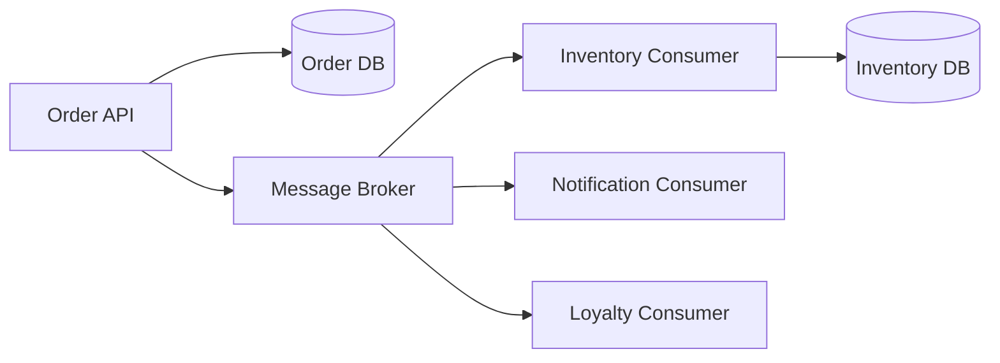
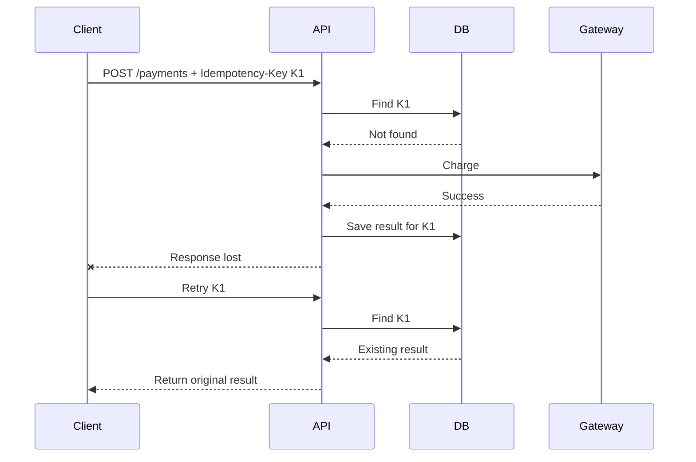
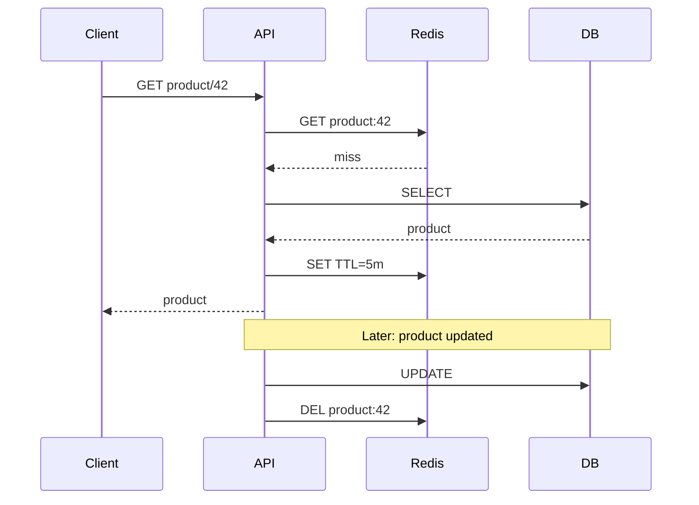
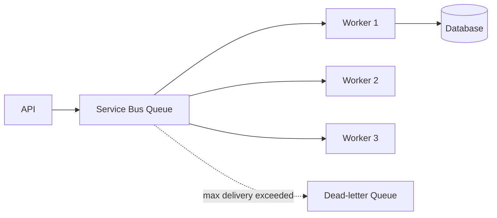
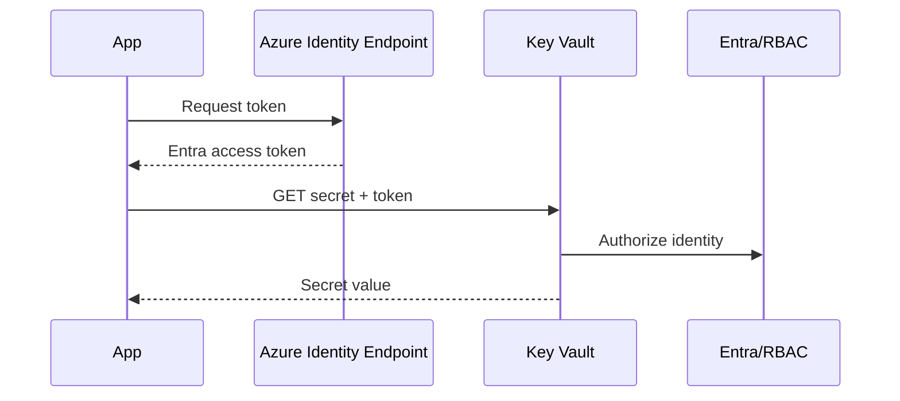
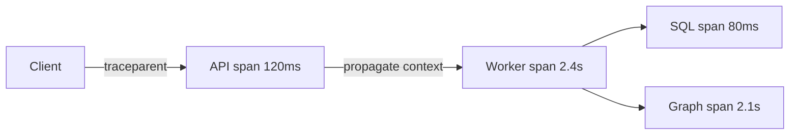
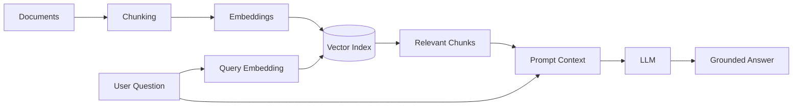
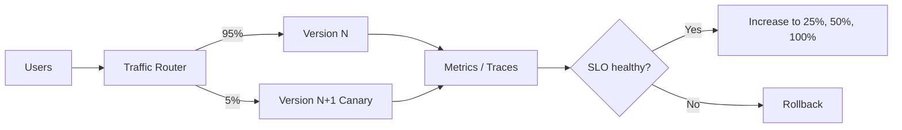

# Daily Knowledge Sharing — 2026-08-19

## Today’s Topics

1. Event-Driven Architecture — tách producer/consumer nhưng phải thiết kế cho duplicate và eventual consistency.
2. Idempotency — biến retry từ rủi ro thành hành vi an toàn.
3. Optimistic Concurrency với EF Core — ngăn lost update mà không khóa dài.
4. Cache Invalidation — phần khó nhất của caching trong production.
5. Azure Service Bus — messaging bền vững, retry, dead-letter và competing consumers.
6. Managed Identity + Azure Key Vault — loại bỏ secret tĩnh khỏi ứng dụng Azure.
7. OpenTelemetry & Distributed Tracing — nối một request xuyên nhiều service.
8. RAG — grounding LLM bằng dữ liệu riêng thay vì nhồi toàn bộ knowledge vào prompt.
9. Circuit Breaker — ngăn dependency lỗi kéo sập toàn hệ thống.
10. Canary Deployment + Feature Flags — giảm blast radius khi release.

---

# 1. Event-Driven Architecture

### 1. What is it?

Event-Driven Architecture (EDA) là cách thiết kế trong đó một thành phần công bố rằng **một sự kiện nghiệp vụ đã xảy ra**, còn các thành phần khác tự quyết định cách phản ứng. Ví dụ `OrderPaid` mô tả một fact đã xảy ra; nó không phải mệnh lệnh trực tiếp kiểu `SendEmailNow`.

Điểm quan trọng ở mức kiến trúc không phải là “dùng message broker”, mà là chuyển coupling từ lời gọi đồng bộ trực tiếp sang contract sự kiện và xử lý bất đồng bộ. Producer không cần biết có bao nhiêu consumer, nhưng đổi lại hệ thống phải chấp nhận eventual consistency, duplicate delivery và observability phức tạp hơn.

### 2. Why does it exist?

Giả sử API thanh toán phải đồng bộ gọi Inventory, Email, Loyalty và Analytics. Một dependency chậm có thể làm request thanh toán chậm; một dependency chết có thể khiến toàn flow thất bại dù payment đã thành công. Khi thêm consumer mới, service thanh toán lại phải sửa.

EDA giải quyết temporal coupling: producer không bắt consumer phải online cùng thời điểm. Broker giữ message để consumer xử lý sau. Nhưng đây không phải “free reliability”; failure được chuyển từ request path sang message-processing path.

### 3. How does it work?



Một flow production thường là:

1. Order service commit thay đổi nghiệp vụ.
2. Event được publish, tốt nhất qua Outbox để tránh DB commit thành công nhưng publish thất bại.
3. Broker lưu message.
4. Consumer nhận message, kiểm tra duplicate, xử lý và acknowledge.
5. Lỗi transient được retry; lỗi poison sau ngưỡng được đưa vào dead-letter queue.

### 4. Practical example

```csharp
public sealed record OrderPaid(Guid OrderId, decimal Amount, DateTimeOffset PaidAt);

public async Task HandleAsync(OrderPaid message, CancellationToken ct)
{
    if (await db.ProcessedMessages.AnyAsync(x => x.Id == message.OrderId, ct))
        return;

    db.LoyaltyTransactions.Add(new LoyaltyTransaction(
        message.OrderId,
        Points: (int)message.Amount));

    db.ProcessedMessages.Add(new ProcessedMessage(message.OrderId));
    await db.SaveChangesAsync(ct);
}
```

Consumer không giả định “message chỉ tới một lần”. Nó chủ động làm idempotent.

### 5. Real production scenario

Trong hệ thống employee offboarding, khi `EmployeeDeactivated` xảy ra, các consumer có thể độc lập revoke application access, chuyển mailbox, dừng timesheet permission và gửi notification. Nếu Exchange Online tạm lỗi, consumer mailbox retry riêng mà không rollback trạng thái nhân sự đã hợp lệ.

### 6. Common mistakes

- Biến mọi method call thành event dù hệ thống nhỏ và cần consistency tức thời.
- Publish event trước khi DB transaction commit.
- Không version event contract.
- Consumer không idempotent.
- Retry vô hạn poison message.
- Dùng event như RPC trá hình và vẫn coupling producer với consumer.
- Không có correlation ID, khiến incident gần như không trace được.

### 7. Trade-offs

**Advantages:** giảm temporal coupling, mở rộng consumer dễ, hấp thụ traffic spike, tăng khả năng cô lập failure.

**Costs / Risks:** eventual consistency, duplicate/out-of-order delivery, khó debug hơn, cần broker và operational tooling, schema evolution trở thành vấn đề kiến trúc.

### 8. Junior → Middle → Senior understanding

**Junior:** phân biệt command với event và hiểu consumer chạy bất đồng bộ.

**Middle:** triển khai handler idempotent, retry, DLQ, correlation và integration test.

**Senior / Technical Lead:** quyết định boundary nào đáng event-driven, consistency model, ordering requirement, Outbox/Inbox, partitioning, replay và chiến lược schema evolution.

### 9. Key takeaway

- EDA giải coupling nhưng tạo distributed-systems problems mới.
- Thiết kế mặc định cho duplicate và failure.
- Event nên diễn tả fact nghiệp vụ đã xảy ra.
- Reliability cần Outbox, idempotency, retry, DLQ và observability đi cùng nhau.

---

# 2. Idempotency trong API và message processing

### 1. What is it?

Một operation idempotent có thể được thực hiện nhiều lần với cùng intent nhưng không tạo thêm side effect ngoài kết quả logic của lần đầu. `GET` thường tự nhiên idempotent; `POST /payments` thì không nếu mỗi retry tạo thêm payment.

Idempotency trong production thường được triển khai bằng một **idempotency key** đại diện cho một business attempt, kết hợp với persistent state để nhận diện request đã xử lý.

### 2. Why does it exist?

Distributed system không thể luôn biết request “thất bại” hay chỉ “response bị mất”. Client timeout sau 5 giây có thể retry trong khi server đã charge tiền thành công. Nếu backend coi retry là request mới, khách hàng bị charge hai lần.

Retry và at-least-once delivery chỉ an toàn khi operation nhận duplicate mà không nhân đôi side effect.

### 3. How does it work?



Key phải có scope, expiry và fingerprint request phù hợp. Cùng key nhưng payload khác nên bị reject thay vì âm thầm trả kết quả cũ.

### 4. Practical example

```csharp
app.MapPost("/payments", async (
    PaymentRequest request,
    HttpRequest http,
    PaymentDbContext db,
    CancellationToken ct) =>
{
    var key = http.Headers["Idempotency-Key"].ToString();
    if (string.IsNullOrWhiteSpace(key))
        return Results.BadRequest("Idempotency-Key is required");

    var existing = await db.IdempotencyRecords
        .SingleOrDefaultAsync(x => x.Key == key, ct);

    if (existing is not null)
        return Results.Json(existing.ResponseJson);

    // Trong production: transaction/unique constraint + payment-provider key.
    var payment = new Payment(request.OrderId, request.Amount);
    db.Payments.Add(payment);
    db.IdempotencyRecords.Add(new(key, payment.Id.ToString()));
    await db.SaveChangesAsync(ct);

    return Results.Ok(new { payment.Id });
});
```

Database nên có unique index trên key để hai request đồng thời không cùng “thắng”.

### 5. Real production scenario

Mobile app gửi submit timesheet khi mạng chập chờn. Người dùng tap lại hoặc HTTP client tự retry. Cùng `submission-id` phải trả cùng submission thay vì tạo hai bản ghi và hai workflow approval.

### 6. Common mistakes

- Lưu key trong memory của một instance khi API scale-out.
- Không đặt unique constraint ở storage.
- Tạo key mới cho mỗi retry phía client.
- Retry non-idempotent operation mà không hiểu side effect.
- Chỉ deduplicate message nhưng side effect external đã xảy ra trước khi checkpoint.

### 7. Trade-offs

**Advantages:** retry an toàn, UX tốt hơn, giảm duplicate transaction.

**Costs / Risks:** thêm storage, cleanup/TTL, race condition, cần định nghĩa scope và semantics của key.

### 8. Junior → Middle → Senior understanding

**Junior:** hiểu retry có thể tạo duplicate.

**Middle:** triển khai key + unique constraint + transaction và test concurrent requests.

**Senior / Technical Lead:** định nghĩa idempotency boundary xuyên DB và external provider, retention, failure window và reconciliation.

### 9. Key takeaway

- Timeout không chứng minh operation chưa chạy.
- Retry đáng tin cậy cần idempotency.
- Deduplication phải bền vững qua nhiều instance.
- Unique constraint là lớp bảo vệ quan trọng trước race condition.

---

# 3. Optimistic Concurrency với EF Core

### 1. What is it?

Optimistic Concurrency giả định conflict hiếm nên không khóa record suốt thời gian người dùng đọc và chỉnh sửa. Khi update, hệ thống kiểm tra record có thay đổi kể từ lúc đọc hay không. Nếu đã đổi, update bị từ chối để application quyết định retry, merge hoặc báo conflict.

### 2. Why does it exist?

Lost update rất dễ xảy ra: A và B cùng đọc Employee version 10. A đổi department và save. B vẫn giữ dữ liệu version 10, đổi phone rồi save toàn entity; nếu không kiểm tra concurrency, B có thể ghi đè department mới của A bằng dữ liệu cũ.

Giữ database lock từ lúc user mở màn hình đến lúc bấm Save là không thực tế. Optimistic concurrency kiểm tra tại thời điểm write.

### 3. How does it work?

```text
Read: Id=42, Version=7
        │
        ├── User A updates -> WHERE Id=42 AND Version=7 -> success -> Version=8
        │
        └── User B updates -> WHERE Id=42 AND Version=7 -> 0 rows -> conflict
```

EF Core nhận biết zero rows affected với concurrency token và ném `DbUpdateConcurrencyException`.

### 4. Practical example

```csharp
public class Employee
{
    public int Id { get; set; }
    public string Name { get; set; } = null!;

    [Timestamp]
    public byte[] RowVersion { get; set; } = null!;
}

try
{
    await db.SaveChangesAsync(ct);
}
catch (DbUpdateConcurrencyException)
{
    return Results.Conflict(new
    {
        code = "employee_changed",
        message = "The employee was modified by another user. Reload and retry."
    });
}
```

Với SQL Server, `[Timestamp]` thường map tới `rowversion`. API nên đưa version cho client, ví dụ qua ETag hoặc DTO field.

### 5. Real production scenario

HR và manager cùng chỉnh hồ sơ employee. Với dữ liệu quan trọng như offboarding configuration, hệ thống không nên silently overwrite. Conflict 409 cho phép UI reload phiên bản mới và yêu cầu user xác nhận thay đổi.

### 6. Common mistakes

- Bắt exception rồi retry vô hạn bằng dữ liệu cũ.
- Không truyền concurrency token từ client về API.
- Update toàn entity bằng DTO stale.
- Dùng pessimistic lock cho form người dùng mở nhiều phút.
- Không xác định field nào có thể merge tự động và field nào phải conflict.

### 7. Trade-offs

**Advantages:** không giữ lock dài, throughput tốt khi conflict hiếm.

**Costs / Risks:** application phải xử lý conflict; conflict cao gây retry và UX phức tạp; merge business data không phải lúc nào tự động được.

### 8. Junior → Middle → Senior understanding

**Junior:** hiểu lost update và concurrency token.

**Middle:** cấu hình EF Core, map 409, implement reload/merge flow.

**Senior / Technical Lead:** chọn optimistic hay pessimistic dựa trên contention, thiết kế aggregate boundary và semantics của conflict.

### 9. Key takeaway

- Concurrency control bảo vệ correctness, không chỉ performance.
- `rowversion` phát hiện stale writes rất hiệu quả trên SQL Server.
- Conflict phải được xử lý ở business/application layer.

---

# 4. Cache Invalidation

### 1. What is it?

Cache invalidation là chiến lược đảm bảo dữ liệu cache không tồn tại sai quá lâu sau khi source of truth thay đổi. Vấn đề không phải chỉ “xóa key”; nó bao gồm ownership, TTL, race condition, multi-instance, partial failure và consistency expectation.

### 2. Why does it exist?

Cache tăng tốc read bằng cách chấp nhận một bản sao dữ liệu. Từ thời điểm có bản sao, hệ thống có hai trạng thái có thể lệch nhau. Nếu product price đổi trong DB nhưng Redis vẫn giữ giá cũ 30 phút, performance tốt nhưng correctness sai.

### 3. How does it work?

Cache-aside phổ biến:



TTL là safety net, không thay thế invalidation khi freshness quan trọng. Với nhiều cache key phụ thuộc một entity, cần chiến lược naming/versioning hoặc event-driven invalidation.

### 4. Practical example

```csharp
public async Task UpdateProductAsync(Product product, CancellationToken ct)
{
    db.Products.Update(product);
    await db.SaveChangesAsync(ct);

    await cache.RemoveAsync($"product:{product.Id}", ct);
}
```

Đoạn trên đơn giản nhưng vẫn có failure window: DB save thành công, Redis delete thất bại. Nếu correctness quan trọng, có thể phát `ProductChanged` qua Outbox để invalidator retry.

### 5. Real production scenario

SaaS lưu permission snapshot trong Redis. Nếu admin revoke quyền nhưng cache 30 phút, user có thể tiếp tục truy cập. Với authorization, stale cache có security impact nên TTL phải ngắn hoặc invalidation đáng tin cậy hơn cache dữ liệu hiển thị thông thường.

### 6. Common mistakes

- Cache dữ liệu mutable lâu nhưng không có invalidation.
- Cache `null` vô hạn.
- Mọi instance dùng local memory cache cho shared mutable state.
- Xóa cache trước DB commit rồi transaction rollback.
- Không chống cache stampede khi key hot hết hạn.
- Coi Redis failure là lý do API phải chết dù DB vẫn phục vụ được.

### 7. Trade-offs

**Advantages:** latency thấp, giảm DB load, hấp thụ read spike.

**Costs / Risks:** stale data, memory cost, invalidation complexity, stampede, operational dependency.

### 8. Junior → Middle → Senior understanding

**Junior:** cache là bản sao, DB thường là source of truth.

**Middle:** implement cache-aside, TTL, invalidation và fallback khi Redis lỗi.

**Senior / Technical Lead:** phân loại freshness requirement, chọn consistency model, chống stampede và thiết kế invalidation xuyên service.

### 9. Key takeaway

- Cache nhanh vì chấp nhận copy; copy tạo consistency problem.
- TTL là giới hạn độ stale, không phải chiến lược duy nhất.
- Security/financial data cần freshness nghiêm hơn.
- Luôn thiết kế hành vi khi cache unavailable.

---

# 5. Azure Service Bus

### 1. What is it?

Azure Service Bus là managed enterprise message broker cung cấp Queue và Topic/Subscription. Nó phù hợp khi cần durable messaging, retry, dead-lettering, scheduling, duplicate detection, sessions/order và decoupling giữa producer/consumer.

### 2. Why does it exist?

HTTP synchronous integration khiến producer phụ thuộc availability và latency của consumer. Tự xây queue trong database có thể hoạt động ở quy mô nhỏ nhưng sớm phải tự xử lý polling, locks, retry, poison message, scale-out và monitoring.

Service Bus cung cấp hạ tầng messaging để application tập trung vào business handler.

### 3. How does it work?



Ở Peek-Lock mode, consumer nhận lock tạm thời. Thành công thì complete message; lỗi thì abandon hoặc lock hết hạn để message được giao lại. Vì vậy handler phải idempotent.

### 4. Practical example

```csharp
var client = new ServiceBusClient(
    fullyQualifiedNamespace,
    new DefaultAzureCredential());

var sender = client.CreateSender("employee-offboarding");

await sender.SendMessageAsync(new ServiceBusMessage(
    BinaryData.FromObjectAsJson(new { EmployeeId = employeeId }))
{
    MessageId = $"offboard:{employeeId}"
}, ct);
```

Production nên dùng Managed Identity thay connection string nếu workload chạy trên Azure.

### 5. Real production scenario

API nhận yêu cầu xử lý file Excel 50.000 dòng. Thay vì giữ HTTP request hàng phút, API upload file vào Blob Storage, enqueue job vào Service Bus và trả `202 Accepted`. Worker scale-out đọc queue, xử lý file và ghi trạng thái tiến độ.

### 6. Common mistakes

- Nghĩ queue đảm bảo exactly-once business processing.
- Handler chạy lâu hơn lock duration nhưng không renew lock.
- Không monitor active/dead-letter count.
- Retry business validation error như transient error.
- Đưa payload cực lớn vào message thay vì lưu Blob và gửi reference.
- Không kiểm soát concurrency khiến downstream DB quá tải.

### 7. Trade-offs

**Advantages:** durable, managed, scale-out consumer, DLQ, topic fan-out.

**Costs / Risks:** thêm latency, eventual consistency, Azure cost, broker dependency, duplicate/out-of-order semantics cần xử lý.

### 8. Junior → Middle → Senior understanding

**Junior:** Queue khác HTTP request như thế nào.

**Middle:** sender/processor, retry, DLQ, lock, cancellation và idempotent handler.

**Senior / Technical Lead:** capacity, SKU, sessions/ordering, partitioning, backpressure, poison-message operations và disaster recovery.

### 9. Key takeaway

- Service Bus tách thời điểm producer và consumer phải hoạt động.
- At-least-once delivery yêu cầu idempotency.
- DLQ là operational workflow, không phải “thùng rác”.
- Queue depth là tín hiệu capacity quan trọng.

---

# 6. Managed Identity + Azure Key Vault

### 1. What is it?

Managed Identity cho Azure workload một identity do Microsoft Entra quản lý, để ứng dụng lấy token mà không lưu client secret. Key Vault lưu secret/key/certificate tập trung và kiểm soát truy cập qua identity/RBAC.

Kết hợp hai cơ chế giúp application nói: “Tôi là workload X, hãy cho tôi đọc secret Y” thay vì “đây là password lâu dài của tôi”.

### 2. Why does it exist?

Connection string và client secret trong `appsettings.json`, environment variable hoặc CI/CD secret vẫn có vòng đời rotation và nguy cơ leak. Secret tĩnh càng được copy nhiều nơi càng khó quản trị.

Managed Identity loại bỏ credential bootstrap cho Azure-hosted workload.

### 3. How does it work?



Application không biết password của identity. Azure platform cung cấp token ngắn hạn.

### 4. Practical example

```csharp
var credential = new DefaultAzureCredential();
var client = new SecretClient(
    new Uri("https://my-vault.vault.azure.net/"),
    credential);

KeyVaultSecret secret = await client.GetSecretAsync("ThirdPartyApiKey", ct);
```

`DefaultAzureCredential` giúp local development dùng developer identity, còn production dùng Managed Identity mà code không đổi.

### 5. Real production scenario

ASP.NET Core App Service cần gọi Microsoft Graph và truy cập Storage. Với Azure resources hỗ trợ Entra authentication, tốt nhất dùng Managed Identity trực tiếp thay vì lấy access key từ Key Vault. Key Vault dành cho credential của dependency chưa hỗ trợ identity, ví dụ third-party API key.

### 6. Common mistakes

- Cho identity quyền quá rộng ở subscription scope.
- Đưa secret vào log khi debug configuration.
- Dùng Key Vault cho mọi config không nhạy cảm.
- Không cache secret hợp lý, gọi Key Vault trên mọi request.
- Có Managed Identity nhưng vẫn giữ connection string key-based cũ.

### 7. Trade-offs

**Advantages:** không secret tĩnh, rotation/token lifecycle do platform quản lý, audit tốt, least privilege rõ.

**Costs / Risks:** phụ thuộc Entra/Azure, RBAC cấu hình phức tạp, local dev cần credential chain, network/private endpoint có thể gây lỗi khó debug.

### 8. Junior → Middle → Senior understanding

**Junior:** phân biệt configuration thường và secret.

**Middle:** cấu hình identity, RBAC, `DefaultAzureCredential`, Key Vault và troubleshoot 401/403.

**Senior / Technical Lead:** thiết kế least privilege, private networking, rotation, break-glass và loại bỏ key-based auth khi service hỗ trợ identity.

### 9. Key takeaway

- Secret tốt nhất là secret ứng dụng không cần sở hữu.
- Managed Identity ưu tiên hơn credential tĩnh cho Azure-to-Azure.
- Key Vault không thay thế least privilege.

---

# 7. OpenTelemetry & Distributed Tracing

### 1. What is it?

OpenTelemetry (OTel) là tập chuẩn và SDK để tạo, thu thập và export telemetry: traces, metrics và logs. Distributed trace biểu diễn hành trình của một request qua nhiều process/service bằng trace ID chung và các span cha-con.

### 2. Why does it exist?

Trong monolith, stack trace và log cùng process thường đủ. Trong distributed system, request có thể đi API → Service Bus → Worker → Graph API → SQL. “API chậm” không cho biết 4 giây nằm ở đâu.

Tracing nối các hop thành một causal chain.

### 3. How does it work?



Mỗi span có start/end, status, attributes và parent context. Context phải được propagate qua HTTP/message headers; nếu mất context, trace bị đứt.

### 4. Practical example

```csharp
builder.Services.AddOpenTelemetry()
    .WithTracing(tracing => tracing
        .AddAspNetCoreInstrumentation()
        .AddHttpClientInstrumentation()
        .AddEntityFrameworkCoreInstrumentation()
        .AddSource("Offboarding.Worker"));

private static readonly ActivitySource ActivitySource =
    new("Offboarding.Worker");

using var activity = ActivitySource.StartActivity("ProcessEmployee");
activity?.SetTag("employee.operation", "offboarding");
```

Không nên gắn PII hoặc token vào span attributes.

### 5. Real production scenario

Incident: endpoint mất 5 giây nhưng SQL chỉ 40 ms. Trace cho thấy Microsoft Graph call mất 4.7 giây và retry hai lần. Team chuyển từ phỏng đoán “DB chậm” sang bằng chứng cụ thể trong vài phút.

### 6. Common mistakes

- Log mọi thứ nhưng không có correlation/trace context.
- Cardinality cao như user ID vô hạn trong metric labels.
- Ghi access token, email hoặc dữ liệu nhạy cảm vào telemetry.
- Sampling quá mạnh làm mất rare failures.
- Instrument nhưng không có dashboard/alert/runbook để dùng dữ liệu.

### 7. Trade-offs

**Advantages:** root-cause nhanh, nhìn latency theo dependency, vendor-neutral instrumentation.

**Costs / Risks:** telemetry volume/cost, sampling complexity, instrumentation overhead, privacy governance.

### 8. Junior → Middle → Senior understanding

**Junior:** logs, metrics, traces trả lời các câu hỏi khác nhau.

**Middle:** instrument HTTP/EF/custom spans, propagate context và query trace.

**Senior / Technical Lead:** sampling strategy, telemetry budget, semantic conventions, SLO correlation và data-governance.

### 9. Key takeaway

- Trace trả lời “request đã đi đâu và chậm ở đâu?”.
- Context propagation là điều kiện để distributed trace có giá trị.
- Telemetry phải hỗ trợ investigation, không phải thu thập vô hạn.

---

# 8. Retrieval-Augmented Generation (RAG)

### 1. What is it?

RAG là pattern trong đó ứng dụng truy xuất các đoạn dữ liệu liên quan từ knowledge source rồi đưa chúng vào context của LLM để model trả lời dựa trên dữ liệu được cung cấp. RAG không “dạy lại model”; nó bổ sung evidence tại inference time.

### 2. Why does it exist?

LLM không tự biết tài liệu nội bộ mới nhất, có thể hallucinate và context window không nên chứa toàn bộ kho tài liệu. Fine-tuning cũng không phải lựa chọn tốt để cập nhật hàng nghìn policy thay đổi thường xuyên.

RAG tách knowledge retrieval khỏi language generation.

### 3. How does it work?



Production RAG thường thêm metadata filtering, hybrid search, reranking, citations và evaluation.

### 4. Practical example

```csharp
var chunks = await search.FindRelevantAsync(
    query: question,
    topK: 5,
    filters: new { Department = "HR" },
    ct);

var context = string.Join("\n\n", chunks.Select(x => x.Text));

var prompt = $"""
Answer only from the supplied context.
If the answer is not present, say that it is unavailable.

Context:
{context}

Question: {question}
""";
```

Deterministic code phải enforce authorization **trước retrieval**, không dựa vào prompt “hãy chỉ xem tài liệu user được phép”.

### 5. Real production scenario

AI assistant trả lời policy nghỉ phép nội bộ. User thuộc Vietnam chỉ được retrieve policy của Vietnam và global policy. Vector search lấy 5 chunk liên quan, LLM tổng hợp câu trả lời và UI hiển thị citation tới source document.

### 6. Common mistakes

- Chunk theo số ký tự cố định làm mất semantic boundary.
- Retrieve tài liệu user không có quyền rồi hy vọng LLM không tiết lộ.
- Chỉ đánh giá “câu trả lời nghe hay” mà không đo retrieval quality.
- Top-K quá lớn làm context nhiễu và tăng token cost.
- Không version/reindex khi source thay đổi.
- Dùng vector search cho exact identifiers mà keyword/filter tốt hơn.

### 7. Trade-offs

**Advantages:** knowledge cập nhật nhanh, grounding, citation, không cần retrain model.

**Costs / Risks:** pipeline indexing/search phức tạp, retrieval miss vẫn gây answer miss, token/cost tăng, security boundary phải được thiết kế kỹ.

### 8. Junior → Middle → Senior understanding

**Junior:** hiểu retrieve trước, generate sau.

**Middle:** chunking, embeddings, vector/hybrid search, metadata filter, citations và evaluation dataset.

**Senior / Technical Lead:** authorization architecture, freshness, multi-tenant isolation, retrieval metrics, latency/cost budget và fallback khi search/LLM lỗi.

### 9. Key takeaway

- RAG quality phụ thuộc retrieval ít nhất ngang model quality.
- Authorization phải nằm trong deterministic retrieval layer.
- Context nhiều hơn không đồng nghĩa tốt hơn.
- Đánh giá retrieval và generation riêng biệt.

---

# 9. Circuit Breaker

### 1. What is it?

Circuit Breaker là resilience pattern tạm ngừng gọi một dependency đang lỗi nặng. Thay vì mỗi request tiếp tục timeout 30 giây, breaker “open” và fail fast trong một khoảng thời gian, sau đó thử một số request để xem dependency đã phục hồi chưa.

### 2. Why does it exist?

Khi dependency chết, retry không kiểm soát làm tình hình tệ hơn: thread/task chờ lâu, socket/connection bị giữ, traffic nhân lên và dependency không có cơ hội hồi phục. Đây là cascading failure.

Circuit breaker bảo vệ cả caller lẫn downstream.

### 3. How does it work?

```text
CLOSED -- failures vượt ngưỡng --> OPEN
  ^                               |
  |                               | sau break duration
  |                               v
  +------ probe thành công ---- HALF-OPEN
                  probe lỗi ------> OPEN
```

Retry xử lý lỗi transient của **một operation**; circuit breaker phản ứng với health pattern của **dependency qua nhiều operations**. Hai pattern bổ trợ nhưng không thay thế nhau.

### 4. Practical example

```csharp
builder.Services.AddHttpClient<PartnerClient>(client =>
{
    client.Timeout = TimeSpan.FromSeconds(5);
})
.AddStandardResilienceHandler();
```

Trong .NET hiện đại, resilience pipeline có thể phối hợp timeout, retry, circuit breaker và rate limiting. Quan trọng hơn syntax là policy: lỗi nào retry, timeout bao lâu, breaker mở khi nào.

### 5. Real production scenario

Notification API gọi provider SMS. Provider bắt đầu trả 503. Nếu 20 API instances mỗi instance retry 3 lần, downstream nhận traffic lớn hơn lúc khỏe. Breaker mở, request SMS được enqueue/defer và API chính tiếp tục phục vụ chức năng khác.

### 6. Common mistakes

- Retry mọi HTTP 4xx.
- Timeout quá dài rồi mới breaker.
- Breaker global cho nhiều dependency độc lập.
- Fallback trả dữ liệu sai nhưng giả vờ thành công.
- Không expose breaker state/metrics.
- Retry non-idempotent operation.

### 7. Trade-offs

**Advantages:** fail fast, giảm resource exhaustion, chống cascading failure, tạo thời gian downstream hồi phục.

**Costs / Risks:** có thể reject request trong lúc dependency vừa hồi phục; tuning khó; fallback có thể tạo stale behavior.

### 8. Junior → Middle → Senior understanding

**Junior:** phân biệt timeout, retry và circuit breaker.

**Middle:** cấu hình resilience pipeline, exception/status filters, logging và test failure.

**Senior / Technical Lead:** đặt reliability budget, bulkhead/backpressure, retry amplification, fallback semantics và dependency-specific policy.

### 9. Key takeaway

- Retry không phải càng nhiều càng tốt.
- Circuit breaker bảo vệ hệ thống khỏi dependency đang unhealthy.
- Timeout phải có trước khi resilience policy thực sự hữu ích.
- Chỉ retry operation an toàn hoặc idempotent.

---

# 10. Canary Deployment + Feature Flags

### 1. What is it?

Canary deployment đưa phiên bản mới tới một tỷ lệ nhỏ traffic trước khi mở rộng. Feature flag tách **deploy code** khỏi **release behavior**: code có thể đã production nhưng capability chỉ bật cho một nhóm user/tenant.

Hai kỹ thuật cùng giảm blast radius nhưng giải hai lớp khác nhau: canary kiểm soát phiên bản runtime; feature flag kiểm soát hành vi chức năng.

### 2. Why does it exist?

Staging không thể tái hiện hoàn toàn production traffic, data distribution và dependency behavior. Big-bang release 100% khiến bug nhỏ có blast radius toàn bộ user.

Mục tiêu là biến release thành quá trình quan sát và tăng dần exposure thay vì một khoảnh khắc “deploy xong là hy vọng”.

### 3. How does it work?



Progression phải dựa trên health criteria như error rate, p95 latency, business conversion và dependency failures, không chỉ “5 phút chưa ai báo lỗi”.

### 4. Practical example

```csharp
if (await featureManager.IsEnabledAsync("NewTimesheetApproval"))
{
    return await newApprovalFlow.ExecuteAsync(command, ct);
}

return await legacyApprovalFlow.ExecuteAsync(command, ct);
```

Flag nên có owner, expiry/removal plan và audit. Permanent flags biến codebase thành tổ hợp nhánh khó test.

### 5. Real production scenario

Team thay đổi approval engine. Deployment mới chỉ nhận 5% traffic nội bộ. Feature flag bật flow mới cho một OpCo thử nghiệm. Dashboard so sánh error rate, processing time và approval completion. Khi metric ổn, traffic và tenant exposure tăng dần. Nếu lỗi, flag off ngay trong khi binary mới vẫn tồn tại để điều tra.

### 6. Common mistakes

- Canary nhưng không có metric/automatic gate.
- Chỉ theo dõi CPU mà bỏ business metric.
- Database migration không backward-compatible nên rollback app không được.
- Feature flag không bao giờ xóa.
- Flag check rải khắp domain tạo hai kiến trúc song song lâu dài.
- Bật 100% ngay sau vài request thành công.

### 7. Trade-offs

**Advantages:** giảm blast radius, rollback nhanh, học từ production traffic thật, release theo tenant/user cohort.

**Costs / Risks:** vận hành nhiều version, test matrix tăng, database compatibility khó, flag debt và routing complexity.

### 8. Junior → Middle → Senior understanding

**Junior:** hiểu deploy khác release và rollback cần được chuẩn bị.

**Middle:** implement flag, telemetry, backward-compatible migration và canary pipeline.

**Senior / Technical Lead:** xác định rollout stages, SLO gates, blast-radius budget, rollback strategy, schema compatibility và flag governance.

### 9. Key takeaway

- Production release nên là quá trình tăng exposure có kiểm soát.
- Canary không có observability chỉ là rollout chậm.
- Feature flag cần lifecycle và ngày xóa.
- Database compatibility thường quyết định rollback có thật sự khả thi hay không.
