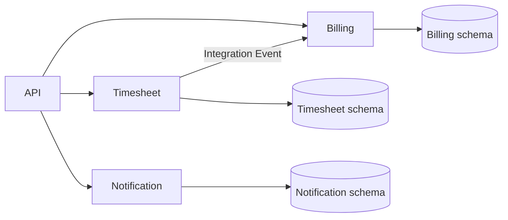
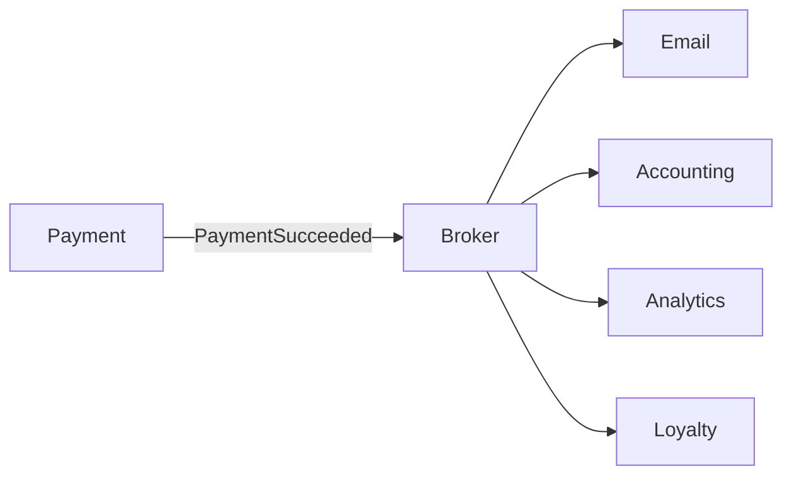
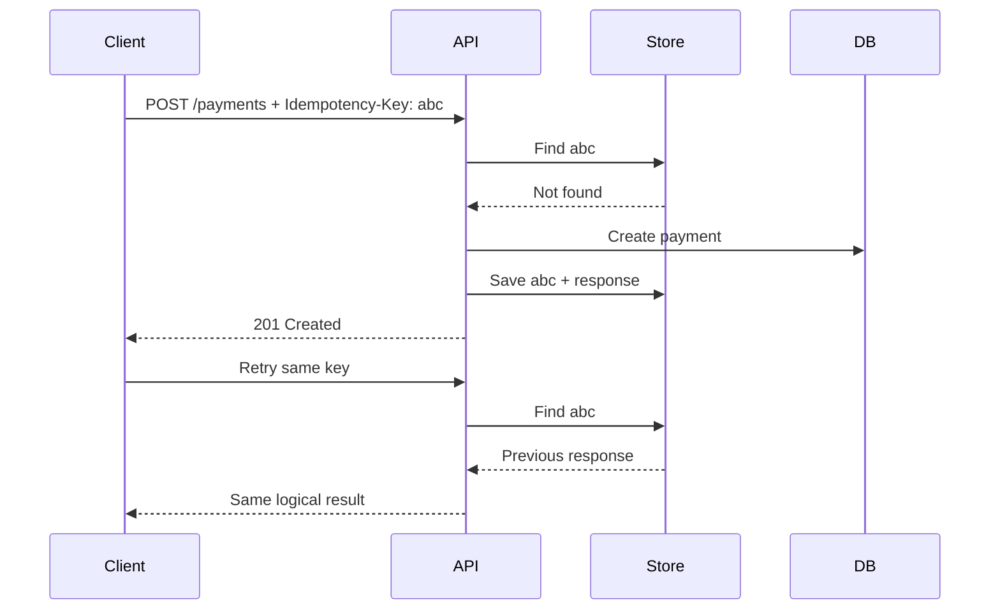
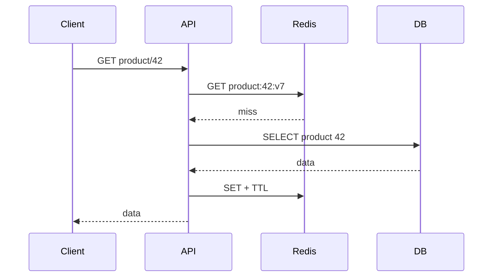
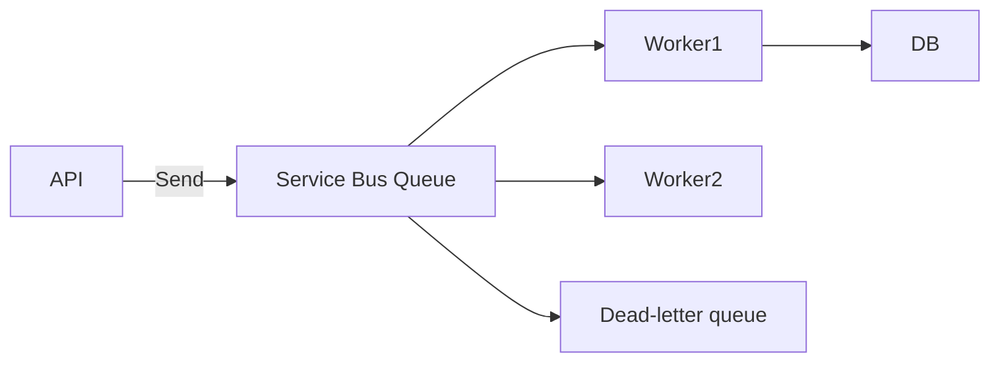
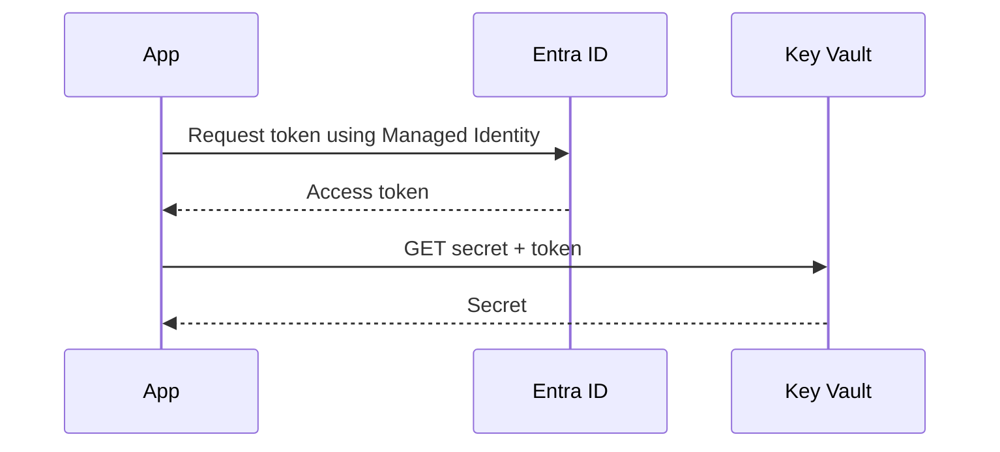
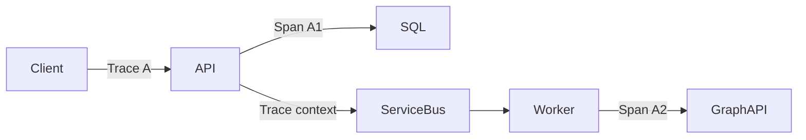
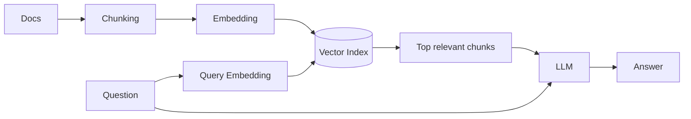
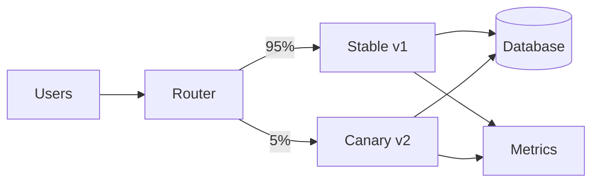

# Daily Knowledge Sharing — 2026-08-19

## Today’s Topics

1. Modular Monolith — chia module đúng boundary mà chưa phải trả giá của microservices
2. Event-Driven Architecture — event, delivery semantics và eventual consistency
3. API Idempotency — chống xử lý trùng trong payment và integration
4. Optimistic Concurrency với EF Core — ngăn lost update
5. Cache Invalidation — versioning, TTL và chiến lược giữ cache nhất quán
6. Azure Service Bus — queue, topic, retry và dead-letter queue
7. Managed Identity + Azure Key Vault — loại bỏ secret khỏi ứng dụng
8. OpenTelemetry & Distributed Tracing — lần theo request xuyên nhiều service
9. RAG — grounding LLM bằng dữ liệu riêng thay vì nhồi prompt
10. Canary Deployment — giảm blast radius khi release production

---

# 1. Modular Monolith

### 1. What is it?

Modular Monolith vẫn là **một deployable application**, nhưng bên trong được chia thành các module nghiệp vụ có boundary rõ ràng. Ví dụ hệ thống SaaS có `Identity`, `Billing`, `Timesheet`, `Notification`. Điểm quan trọng không phải số project hay folder, mà là module nào **sở hữu business rule và dữ liệu nào**, module khác được phép giao tiếp qua contract nào.

Nó khác một monolith “to” ở chỗ dependency được kiểm soát. `Billing` không nên truy cập thẳng bảng nội bộ của `Timesheet` chỉ vì chúng cùng database.

### 2. Why does it exist?

Một codebase nhỏ thường bắt đầu rất đơn giản. Khi lớn lên, mọi service gọi mọi repository, entity bị dùng chung khắp nơi và thay đổi một chức năng gây regression ở nơi không liên quan. Microservices có thể tạo boundary mạnh hơn nhưng kéo theo network failure, deployment, observability và distributed consistency.

Modular Monolith là lựa chọn trung gian: giữ operational simplicity của monolith nhưng thiết kế boundary đủ tốt để hệ thống không biến thành “big ball of mud”.

### 3. How does it work?



Các module có thể cùng process và cùng physical database nhưng nên có ownership rõ. Giao tiếp đồng bộ dùng public contract; giao tiếp không cần phản hồi tức thời có thể dùng in-process/domain event hoặc durable message tùy yêu cầu reliability.

### 4. Practical example

```csharp
public interface ITimesheetModule
{
    Task<ApprovedTimesheetDto?> GetApprovedAsync(
        Guid timesheetId, CancellationToken ct);
}

internal sealed class TimesheetModule : ITimesheetModule
{
    private readonly TimesheetDbContext _db;

    public async Task<ApprovedTimesheetDto?> GetApprovedAsync(
        Guid id, CancellationToken ct) =>
        await _db.Timesheets
            .Where(x => x.Id == id && x.Status == Status.Approved)
            .Select(x => new ApprovedTimesheetDto(x.Id, x.EmployeeId, x.TotalHours))
            .SingleOrDefaultAsync(ct);
}
```

Module khác nhận DTO/contract thay vì tham chiếu trực tiếp aggregate hoặc repository nội bộ.

### 5. Real production scenario

Trong hệ thống timesheet, khi manager approve timesheet, module Timesheet hoàn tất transaction rồi phát `TimesheetApproved`. Billing dùng event này để tính charge. Nếu sau này Billing cần scale hoặc deploy độc lập, boundary đã có sẵn để tách dần thay vì rewrite toàn bộ hệ thống.

### 6. Common mistakes

- Chia 20 project nhưng tất cả cùng tham chiếu một `Shared.Domain` chứa mọi entity.
- Module A query trực tiếp table của module B.
- Dùng event cho mọi method call dù không có lý do bất đồng bộ.
- Tách module theo technical layer (`Controllers`, `Services`) thay vì business capability.
- Dùng Modular Monolith nhưng không có architecture test để ngăn dependency ngược.

### 7. Trade-offs

**Advantages:** deploy đơn giản, transaction local dễ, debugging dễ hơn microservices, boundary tốt cho tăng trưởng.

**Costs / Risks:** boundary chủ yếu được enforce bằng code convention/tooling; một process lỗi có thể ảnh hưởng toàn ứng dụng; không scale từng module độc lập ở infrastructure level.

### 8. Junior → Middle → Senior understanding

**Junior:** hiểu module là business boundary chứ không chỉ folder.

**Middle:** biết thiết kế public contract, internal implementation và tránh cross-module database access.

**Senior / Technical Lead:** quyết định boundary, consistency model và khi nào một module thực sự đáng tách thành service riêng.

### 9. Key takeaway

- Modular Monolith không phải “monolith có nhiều folder”.
- Data ownership quan trọng hơn project structure.
- Đừng chọn microservices chỉ để giải quyết coupling mà boundary trong code còn chưa rõ.

---

# 2. Event-Driven Architecture

### 1. What is it?

Event-Driven Architecture (EDA) tổ chức workflow quanh các **sự kiện đã xảy ra**, ví dụ `OrderPaid`, `EmployeeDeactivated`, `TimesheetApproved`. Producer công bố fact; consumer tự quyết định phản ứng.

Event khác command: `SendInvoice` yêu cầu ai đó làm việc; `InvoiceGenerated` mô tả một fact đã xảy ra.

### 2. Why does it exist?

Nếu API thanh toán phải đồng bộ gọi email, analytics, loyalty và accounting, latency tăng và failure của một downstream service có thể làm toàn request thất bại. Event giúp producer giảm coupling về thời gian và implementation.

### 3. How does it work?



Broker thường cung cấp **at-least-once delivery**, nghĩa là consumer phải giả định message có thể được giao lại. Vì vậy idempotency, retry, dead-letter queue và observability là một phần của thiết kế chứ không phải “phần thêm sau”.

### 4. Practical example

```csharp
public sealed record PaymentSucceeded(
    Guid EventId, Guid PaymentId, decimal Amount, DateTimeOffset OccurredAt);

public async Task Handle(PaymentSucceeded evt, CancellationToken ct)
{
    if (await _processed.ExistsAsync(evt.EventId, ct))
        return;

    await _invoice.CreateForPaymentAsync(evt.PaymentId, ct);
    await _processed.MarkAsync(evt.EventId, ct);
}
```

Trong production, việc đánh dấu processed và side effect cần transaction/Inbox pattern phù hợp để tránh crash ở giữa hai bước.

### 5. Real production scenario

Khi nhân viên bị offboard, HR module phát `EmployeeDeactivated`. Các consumer độc lập xử lý revoke access, mailbox workflow, notification và audit. HR không cần biết chi tiết từng hệ thống downstream.

### 6. Common mistakes

- Tin rằng broker đảm bảo exactly-once end-to-end.
- Event payload phụ thuộc trực tiếp EF entity.
- Không version event schema.
- Retry vô hạn poison message.
- Publish event trước khi DB transaction commit.
- Không có correlation ID nên incident gần như không trace được.

### 7. Trade-offs

**Advantages:** loose coupling, dễ mở rộng consumer, hấp thụ traffic spike, resilience tốt hơn.

**Costs / Risks:** eventual consistency, duplicate/out-of-order message, debugging phức tạp, schema evolution và operational overhead.

### 8. Junior → Middle → Senior understanding

**Junior:** phân biệt event và command, hiểu producer/consumer.

**Middle:** implement idempotent consumer, retry, DLQ và correlation.

**Senior / Technical Lead:** thiết kế consistency boundary, Outbox/Inbox, ordering requirement và event contract lifecycle.

### 9. Key takeaway

- Event là fact đã xảy ra.
- At-least-once delivery => consumer phải idempotent.
- EDA đổi coupling đồng bộ lấy complexity của distributed state.

---

# 3. API Idempotency

### 1. What is it?

Một operation idempotent có thể được gửi lại nhiều lần nhưng **business effect chỉ xảy ra một lần**. Đây là vấn đề quan trọng với `POST /payments`, tạo booking, gửi payout hoặc trigger workflow.

### 2. Why does it exist?

Client timeout không có nghĩa server chưa xử lý. Nếu client retry `POST /payments` và server tạo payment lần hai, người dùng có thể bị charge hai lần. Network là không đáng tin cậy; retry là bình thường, vì vậy API phải thiết kế cho retry an toàn.

### 3. How does it work?



Key nên gắn với caller và operation. Server thường lưu fingerprint của request để phát hiện cùng key nhưng payload khác.

### 4. Practical example

```csharp
public async Task<IResult> CreatePayment(
    HttpRequest request, CreatePaymentCommand command, CancellationToken ct)
{
    var key = request.Headers["Idempotency-Key"].ToString();
    if (string.IsNullOrWhiteSpace(key))
        return Results.BadRequest("Idempotency-Key is required");

    var existing = await _store.GetAsync(key, ct);
    if (existing is not null)
        return Results.Json(existing.Body, statusCode: existing.StatusCode);

    var result = await _payments.CreateAsync(command, ct);
    await _store.SaveAsync(key, result, ct);
    return Results.Created($"/payments/{result.Id}", result);
}
```

Thực tế cần atomicity giữa business write và idempotency record, thường dùng unique constraint hoặc transaction/outbox-like design.

### 5. Real production scenario

Mobile app gọi API tạo payment, request thành công ở server nhưng mất mạng trước khi nhận response. App retry cùng idempotency key. API trả payment cũ thay vì charge lại.

### 6. Common mistakes

- Dùng GUID mới cho mỗi retry ở client.
- Chỉ cache response trong memory nên instance khác không biết key.
- Không đặt unique index cho idempotency key.
- Cùng key nhưng cho phép payload khác.
- Giữ record vĩnh viễn không có retention policy.

### 7. Trade-offs

**Advantages:** retry an toàn, giảm duplicate side effect, API đáng tin cậy hơn.

**Costs / Risks:** thêm storage, cleanup, concurrency handling và semantics cho request đang xử lý dở.

### 8. Junior → Middle → Senior understanding

**Junior:** hiểu GET thường idempotent còn POST không tự động idempotent.

**Middle:** implement key store, unique constraint và replay response.

**Senior / Technical Lead:** xác định scope, retention, atomicity và failure state khi operation đã chạy nhưng response chưa persist.

### 9. Key takeaway

- Timeout không chứng minh operation thất bại.
- Idempotency là business guarantee, không chỉ là HTTP detail.
- Unique constraint/atomicity quan trọng hơn một đoạn `if exists` đơn giản.

---

# 4. Optimistic Concurrency với EF Core

### 1. What is it?

Optimistic Concurrency giả định conflict không xảy ra thường xuyên. Thay vì khóa record trong toàn thời gian người dùng chỉnh sửa, hệ thống kiểm tra xem dữ liệu có thay đổi kể từ lúc đọc hay không khi update.

### 2. Why does it exist?

Hai manager cùng mở employee record. A đổi department, B đổi title dựa trên bản dữ liệu cũ. Nếu update cuối cùng ghi đè toàn record, thay đổi của A có thể bị mất — **lost update**.

### 3. How does it work?

SQL Server `rowversion` thay đổi mỗi khi row được update. EF Core đưa giá trị cũ vào `WHERE`:

```sql
UPDATE Employees
SET Title = @title
WHERE Id = @id AND RowVersion = @originalRowVersion;
```

Nếu affected rows = 0, EF Core ném `DbUpdateConcurrencyException`.

### 4. Practical example

```csharp
public class Employee
{
    public Guid Id { get; set; }
    public string Title { get; set; } = null!;
    [Timestamp]
    public byte[] RowVersion { get; set; } = null!;
}

try
{
    await db.SaveChangesAsync(ct);
}
catch (DbUpdateConcurrencyException)
{
    return Results.Conflict(new
    {
        code = "employee_changed",
        message = "Employee was modified by another user. Reload and retry."
    });
}
```

### 5. Real production scenario

Portal HR hiển thị employee profile cho nhiều admin. API trả `rowVersion` cho client. Khi PATCH, client gửi lại version. Nếu record đã đổi, API trả `409 Conflict` thay vì âm thầm ghi đè.

### 6. Common mistakes

- Catch exception rồi tự retry với dữ liệu cũ, làm mất ý nghĩa concurrency check.
- Không gửi concurrency token qua API.
- Dùng timestamp thời gian có precision không phù hợp thay rowversion.
- Cho rằng transaction mặc định tự giải quyết lost update.

### 7. Trade-offs

**Advantages:** không giữ lock dài, throughput tốt, phù hợp CRUD web.

**Costs / Risks:** conflict phải được resolve; UX phức tạp hơn; không phù hợp khi contention cực cao và invariant cần serialize nghiêm ngặt.

### 8. Junior → Middle → Senior understanding

**Junior:** hiểu lost update.

**Middle:** cấu hình concurrency token và xử lý `409 Conflict`.

**Senior / Technical Lead:** quyết định merge/reload/reject strategy và nhận ra lúc optimistic concurrency không đủ để bảo vệ invariant.

### 9. Key takeaway

- `SaveChanges` thành công không đồng nghĩa update strategy an toàn với concurrent users.
- Concurrency conflict nên được xử lý như một business state có chủ đích.
- Không blind retry stale command.

---

# 5. Cache Invalidation

### 1. What is it?

Cache invalidation là chiến lược đảm bảo dữ liệu cache không tồn tại sai quá lâu sau khi source of truth thay đổi. Đây thường là phần khó nhất của caching.

### 2. Why does it exist?

Cache tăng tốc read nhưng tạo thêm một bản sao dữ liệu. Ngay khi database thay đổi, cache có nguy cơ stale. Nếu không định nghĩa mức stale chấp nhận được, performance optimization có thể biến thành data correctness bug.

### 3. How does it work?



Các chiến lược phổ biến gồm TTL, explicit eviction sau write, versioned keys và event-driven invalidation. Production thường kết hợp nhiều lớp thay vì chỉ một kỹ thuật.

### 4. Practical example

```csharp
public async Task UpdateProductAsync(Product product, CancellationToken ct)
{
    db.Products.Update(product);
    await db.SaveChangesAsync(ct);

    await cache.RemoveAsync($"product:{product.Id}", ct);
}
```

Đoạn trên đơn giản nhưng có failure window: DB commit thành công, Redis remove thất bại. Nếu correctness quan trọng, có thể phát invalidation event qua Outbox.

### 5. Real production scenario

Product price được update. API read cache trong 10 phút. Với catalog có thể chấp nhận stale vài giây; với authorization permission hoặc financial balance thì stale data có thể không chấp nhận được và cache strategy phải khác.

### 6. Common mistakes

- Cache mọi thứ vì “Redis nhanh”.
- TTL quá dài nhưng không có invalidation.
- Xóa cache trước DB commit.
- Cache null/error vô thời hạn.
- Nhiều request cùng miss gây cache stampede.
- Không đo hit ratio và latency thực tế.

### 7. Trade-offs

**Advantages:** giảm DB load, giảm latency, tăng throughput.

**Costs / Risks:** stale data, failure mode mới, memory cost, stampede và complexity consistency.

### 8. Junior → Middle → Senior understanding

**Junior:** hiểu hit, miss, TTL và source of truth.

**Middle:** implement cache-aside, invalidation và chống stampede.

**Senior / Technical Lead:** định nghĩa consistency requirement theo loại dữ liệu và thiết kế failure behavior khi Redis unavailable.

### 9. Key takeaway

- Caching là bài toán consistency trước khi là bài toán speed.
- TTL là safety net, không phải luôn là invalidation strategy đầy đủ.
- Không cache dữ liệu nếu chưa biết stale bao lâu là chấp nhận được.

---

# 6. Azure Service Bus

### 1. What is it?

Azure Service Bus là managed enterprise message broker. Queue phù hợp work distribution; Topic + Subscription phù hợp publish/subscribe. Nó cung cấp lock-based processing, dead-letter queue, scheduled message, duplicate detection và session cho một số ordering scenario.

### 2. Why does it exist?

HTTP synchronous coupling khiến caller phải chờ downstream. Khi downstream chậm hoặc tạm unavailable, toàn chuỗi dễ thất bại. Broker giữ message bền vững để producer và consumer không cần online cùng lúc.

### 3. How does it work?



Consumer nhận message theo Peek-Lock: message bị lock tạm thời; xử lý thành công thì `Complete`; transient failure có thể abandon/retry; quá số delivery hoặc lỗi không thể xử lý thì chuyển DLQ.

### 4. Practical example

```csharp
var client = new ServiceBusClient(
    fullyQualifiedNamespace,
    new DefaultAzureCredential());

var sender = client.CreateSender("mail-jobs");
await sender.SendMessageAsync(new ServiceBusMessage(
    BinaryData.FromObjectAsJson(new { EmployeeId = employeeId }))
{
    MessageId = jobId.ToString(),
    CorrelationId = correlationId
}, ct);
```

Managed Identity nên được ưu tiên thay connection string khi workload chạy trên Azure.

### 5. Real production scenario

API offboarding ghi trạng thái employee rồi enqueue job xử lý Exchange Online. API trả nhanh; worker xử lý Graph/Exchange riêng. Nếu Microsoft 365 throttling, message được retry mà không bắt user giữ HTTP request hàng phút.

### 6. Common mistakes

- Complete message trước khi side effect hoàn tất.
- Retry permanent error như validation failure.
- Không monitor DLQ.
- Message quá lớn hoặc nhét file binary trực tiếp thay Blob reference.
- Giả định global ordering.
- Lock timeout nhỏ hơn processing time nhưng không renew lock.

### 7. Trade-offs

**Advantages:** durable messaging, back-pressure, decoupling, managed operations.

**Costs / Risks:** eventual consistency, message duplication, cost, DLQ operations và thêm observability complexity.

### 8. Junior → Middle → Senior understanding

**Junior:** hiểu queue và consumer.

**Middle:** implement processor, retry, DLQ và idempotency.

**Senior / Technical Lead:** chọn Queue/Topic/Session, capacity, delivery semantics, Outbox và disaster/failure strategy.

### 9. Key takeaway

- Queue không làm duplicate processing tự biến mất.
- DLQ phải có monitoring và remediation process.
- Broker giúp decouple nhưng không thay thế thiết kế consistency.

---

# 7. Managed Identity + Azure Key Vault

### 1. What is it?

Managed Identity cho Azure workload một identity do Azure quản lý để lấy token từ Microsoft Entra ID mà không cần lưu client secret. Key Vault lưu secret, certificate và key tập trung với access control/audit.

### 2. Why does it exist?

Connection string và client secret trong `appsettings.json`, environment variable hoặc pipeline dễ bị leak và cần rotation. Managed Identity loại bỏ credential tĩnh cho service-to-service authentication khi dịch vụ đích hỗ trợ Entra ID.

### 3. How does it work?



Ứng dụng không biết password của identity. Azure platform cung cấp token endpoint cho workload; Entra ID cấp token theo identity; RBAC quyết định identity được phép làm gì.

### 4. Practical example

```csharp
var credential = new DefaultAzureCredential();
var secretClient = new SecretClient(
    new Uri("https://my-vault.vault.azure.net/"), credential);

KeyVaultSecret secret = await secretClient.GetSecretAsync(
    "ThirdPartyApiKey", cancellationToken: ct);
```

Local development có thể dùng developer credential; production tự chuyển sang Managed Identity mà code không cần chứa secret.

### 5. Real production scenario

App Service cần đọc một API key của vendor và truy cập Blob Storage. Blob có thể dùng Managed Identity trực tiếp; API key vendor vẫn cần Key Vault. Như vậy chỉ secret thực sự bắt buộc mới được lưu, còn Azure-to-Azure auth không dùng secret tĩnh.

### 6. Common mistakes

- Cho identity role quá rộng như Owner.
- Dùng Key Vault để “bảo vệ” secret nhưng lại copy secret vào pipeline variable lâu dài.
- Fetch Key Vault mỗi request gây latency/throttling.
- Không thiết kế rotation cho third-party secret.
- Nhầm authentication với network access; Private Endpoint/firewall vẫn là lớp khác.

### 7. Trade-offs

**Advantages:** giảm secret sprawl, rotation identity tự động, audit và RBAC tốt.

**Costs / Risks:** phụ thuộc Entra/Key Vault availability, permission troubleshooting khó hơn, cần cache secret hợp lý.

### 8. Junior → Middle → Senior understanding

**Junior:** không hard-code secret và hiểu identity-based access.

**Middle:** cấu hình Managed Identity, RBAC, `DefaultAzureCredential` và Key Vault.

**Senior / Technical Lead:** thiết kế least privilege, network isolation, rotation, bootstrap và degraded behavior.

### 9. Key takeaway

- Nếu Azure service hỗ trợ Entra auth, ưu tiên Managed Identity hơn secret.
- Key Vault không thay thế least privilege.
- Secret retrieval cần cân bằng freshness và availability.

---

# 8. OpenTelemetry & Distributed Tracing

### 1. What is it?

OpenTelemetry (OTel) là chuẩn/vendor-neutral để instrument **traces, metrics và logs**. Distributed trace nối các span của cùng một request qua API, queue, worker và downstream service bằng trace context.

### 2. Why does it exist?

Log `500 error` chỉ cho biết một service thất bại. Trong distributed system, câu hỏi thực tế là: request nào chậm, chậm ở SQL hay HTTP downstream, message nào được tạo từ request nào, failure bắt đầu ở đâu?

### 3. How does it work?



Mỗi operation tạo span chứa duration, status và attributes. Context (`traceparent`) được propagate qua HTTP/message headers để backend observability ghép chúng thành một trace.

### 4. Practical example

```csharp
builder.Services.AddOpenTelemetry()
    .WithTracing(t => t
        .AddAspNetCoreInstrumentation()
        .AddHttpClientInstrumentation()
        .AddEntityFrameworkCoreInstrumentation()
        .AddSource("Offboarding"));

private static readonly ActivitySource Source = new("Offboarding");

using var activity = Source.StartActivity("ResetMailboxDelegation");
activity?.SetTag("employee.id", employeeId);
```

Không nên đưa password, token hoặc PII nhạy cảm vào tag.

### 5. Real production scenario

Một API offboarding đôi lúc mất 12 giây. Trace cho thấy controller chỉ tốn 40 ms, SQL 30 ms nhưng Microsoft Graph call tốn 11.8 giây và có retry. Team tối ưu đúng dependency thay vì đoán database chậm.

### 6. Common mistakes

- Log/trace mọi payload chứa PII.
- Cardinality cực cao trong metric labels.
- Không propagate trace context qua queue.
- Sampling quá mạnh khiến incident hiếm không còn trace.
- Có telemetry nhưng không có alert/dashboard hữu ích.

### 7. Trade-offs

**Advantages:** vendor-neutral instrumentation, root-cause analysis nhanh, hiểu dependency latency.

**Costs / Risks:** telemetry volume/cost, sampling complexity, storage và privacy concerns.

### 8. Junior → Middle → Senior understanding

**Junior:** phân biệt log, metric và trace.

**Middle:** instrument ASP.NET Core/HttpClient/EF Core và custom Activity.

**Senior / Technical Lead:** thiết kế telemetry schema, sampling, SLO correlation, privacy và cost budget.

### 9. Key takeaway

- Trace trả lời “request đã đi qua đâu và mất thời gian ở đâu?”.
- Correlation phải được propagate xuyên async boundary.
- Observability tốt cần signal có mục đích, không phải thu thập mọi thứ.

---

# 9. RAG (Retrieval-Augmented Generation)

### 1. What is it?

RAG cho LLM truy xuất các đoạn dữ liệu liên quan từ nguồn ngoài rồi đưa chúng vào context trước khi sinh câu trả lời. Model không được “train lại” mỗi khi tài liệu thay đổi; knowledge được lấy tại runtime.

### 2. Why does it exist?

LLM có knowledge cutoff, không biết dữ liệu private và có thể hallucinate. Nhét toàn bộ wiki vào prompt vừa đắt vừa vượt context window. RAG tìm một tập nhỏ tài liệu có khả năng liên quan để grounding câu trả lời.

### 3. How does it work?



Production RAG thường có hybrid search, metadata filter, reranking và citation; vector similarity đơn thuần không phải toàn bộ hệ thống.

### 4. Practical example

```csharp
var hits = await knowledge.SearchAsync(
    query: question,
    topK: 8,
    filters: new() { ["tenantId"] = tenantId },
    ct);

var context = string.Join("\n\n", hits.Select(x =>
    $"SOURCE: {x.Source}\n{x.Text}"));

var prompt = $"""
Answer only from the supplied sources.
If evidence is insufficient, say so.

Sources:
{context}

Question: {question}
""";
```

Deterministic code phải enforce tenant filter; không nên để model tự “nhớ” chỉ truy cập đúng tenant.

### 5. Real production scenario

Một internal assistant trả lời câu hỏi về SOP, architecture docs và incident runbook. Khi tài liệu thay đổi, ingestion pipeline re-index tài liệu; không cần fine-tune model chỉ để cập nhật facts.

### 6. Common mistakes

- Chunk quá lớn hoặc cắt mất semantic boundary.
- Chỉ đánh giá “câu trả lời nghe hay” mà không đo retrieval recall.
- Không enforce ACL trước retrieval.
- Cho prompt injection trong document điều khiển tool/action.
- Không trích source nên user không kiểm chứng được.
- Tăng `topK` vô hạn làm context nhiễu và tăng cost.

### 7. Trade-offs

**Advantages:** cập nhật knowledge nhanh, hỗ trợ private data, có thể cite nguồn, ít tốn hơn nhồi toàn corpus.

**Costs / Risks:** retrieval failure, indexing pipeline, vector/search cost, permission leakage và context injection.

### 8. Junior → Middle → Senior understanding

**Junior:** hiểu embedding/search/context flow.

**Middle:** xây ingestion, chunking, retrieval, metadata filter và evaluation.

**Senior / Technical Lead:** thiết kế ACL, freshness, hybrid retrieval, evaluation set, prompt-injection boundary và cost/latency budget.

### 9. Key takeaway

- RAG tốt bắt đầu từ retrieval tốt, không phải prompt dài hơn.
- Authorization phải được enforce bằng code trước khi context đến model.
- Đánh giá retrieval và generation riêng để biết hệ thống sai ở đâu.

---

# 10. Canary Deployment

### 1. What is it?

Canary Deployment release version mới cho một tỷ lệ traffic nhỏ trước, quan sát health rồi tăng dần. Mục tiêu là giảm **blast radius** nếu version mới có lỗi mà test environment không phát hiện.

### 2. Why does it exist?

Staging không bao giờ hoàn toàn giống production: traffic pattern, data distribution, third-party dependency và scale khác nhau. Deploy 100% ngay lập tức biến một bug thành incident cho toàn bộ user.

### 3. How does it work?



Pipeline deploy canary, route một phần traffic, so sánh error rate/latency/business metrics, sau đó promote hoặc rollback. Database change phải backward compatible vì v1 và v2 có thể chạy đồng thời.

### 4. Practical example

Một release policy có thể là:

```text
5% traffic  -> observe 10 minutes
25% traffic -> observe 15 minutes
50% traffic -> observe 15 minutes
100%        -> complete rollout

Rollback if:
- 5xx > 1%
- p95 latency > baseline + 30%
- payment success rate drops materially
```

Ngưỡng phải dựa trên baseline/SLO thật, không copy máy móc.

### 5. Real production scenario

Version mới của payment API có serializer thay đổi. Unit/integration tests đều pass nhưng với một loại payload hiếm ở production nó trả 500. Canary 5% làm lỗi chỉ ảnh hưởng nhóm nhỏ; alert kích hoạt và pipeline rollback trước khi rollout toàn bộ.

### 6. Common mistakes

- Canary nhưng cả v1/v2 dùng migration breaking cùng lúc.
- Chỉ xem CPU mà không xem error/business metric.
- Không có automated rollback hoặc rollback quá chậm.
- Traffic 5% nhưng không đủ sample để phát hiện lỗi hiếm.
- Stateful session khiến routing không ổn định.

### 7. Trade-offs

**Advantages:** giảm blast radius, validate bằng production traffic, rollback sớm.

**Costs / Risks:** cần routing/observability tốt, hai version chạy song song, database compatibility phức tạp, rollout lâu hơn.

### 8. Junior → Middle → Senior understanding

**Junior:** hiểu canary khác deploy 100% như thế nào.

**Middle:** biết cấu hình health metrics, routing và rollback procedure.

**Senior / Technical Lead:** thiết kế progressive delivery, backward-compatible schema, SLO-based gates và quyết định khi nào canary không phù hợp.

### 9. Key takeaway

- Canary giảm phạm vi ảnh hưởng, không làm bug biến mất.
- Observability là điều kiện tiên quyết của progressive delivery.
- Database/schema phải hỗ trợ hai version cùng tồn tại trong rollout.