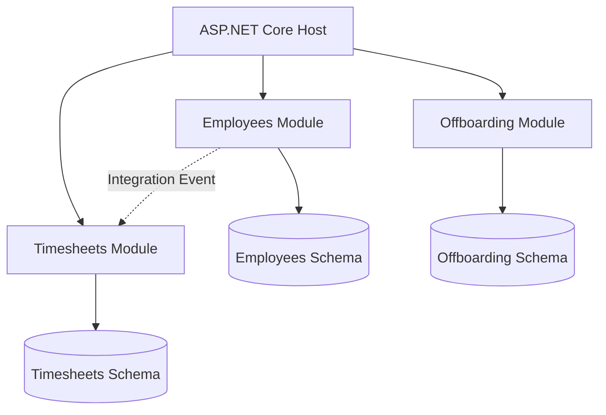
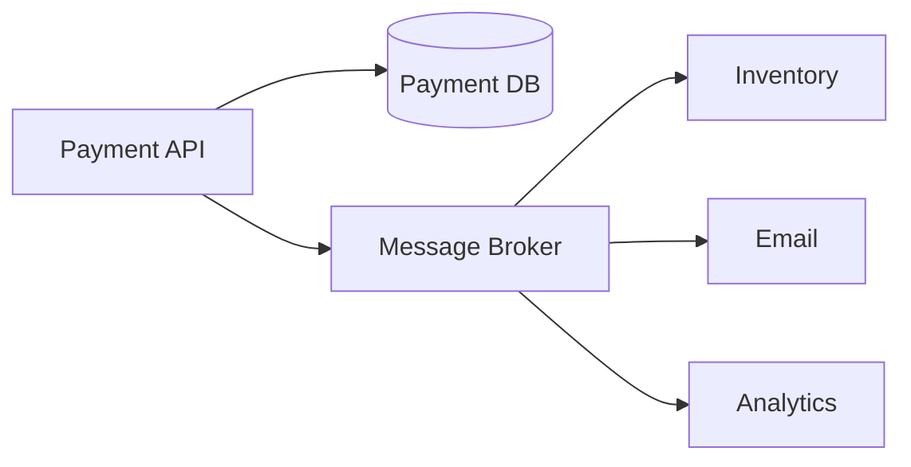
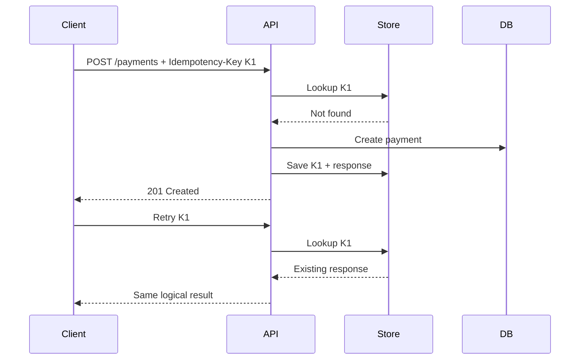
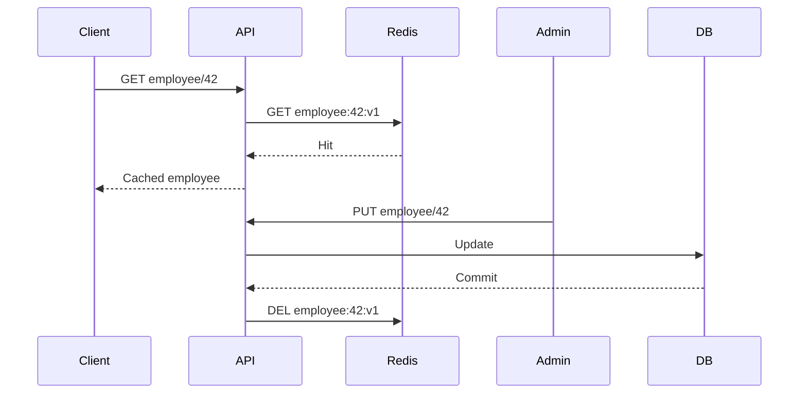
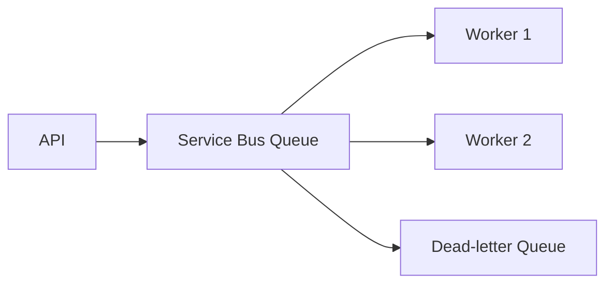
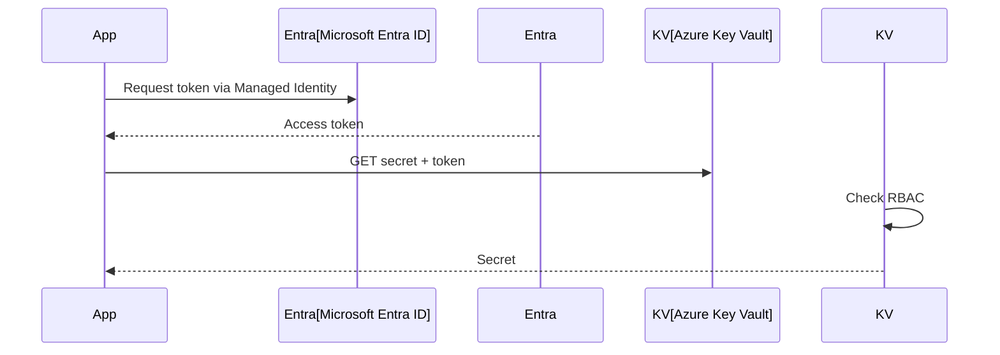
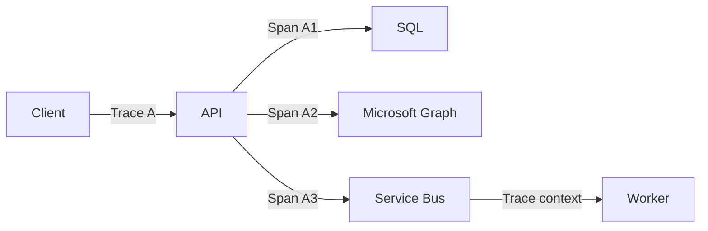
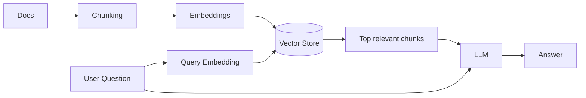
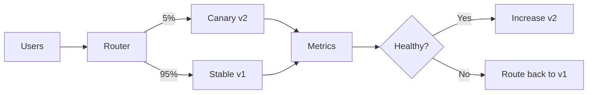

# Daily Knowledge Sharing — 19/08/2026

## Today’s Topics

1. Modular Monolith — chia boundary rõ ràng mà chưa trả giá vận hành của Microservices
2. Event-Driven Architecture — xử lý bất đồng bộ và eventual consistency có kiểm soát
3. Idempotency — chống xử lý trùng trong API và background processing
4. Optimistic Concurrency — bảo vệ dữ liệu khi nhiều request cùng cập nhật
5. Cache Invalidation — giữ cache nhanh nhưng không trả dữ liệu sai quá lâu
6. Azure Service Bus — messaging tin cậy cho workload doanh nghiệp
7. Managed Identity + Azure Key Vault — bỏ secret khỏi source code và configuration
8. OpenTelemetry + Distributed Tracing — lần theo một request qua nhiều thành phần
9. RAG — đưa dữ liệu riêng vào LLM mà không biến model thành database
10. Canary Deployment + Feature Flags — giảm blast radius khi release production

---

# 1. Modular Monolith

### 1. What is it?

Modular Monolith vẫn là **một ứng dụng được deploy như một đơn vị**, nhưng bên trong được chia thành các module nghiệp vụ có boundary rõ ràng. Điểm quan trọng không phải là tạo nhiều folder, mà là ngăn module này tùy tiện truy cập implementation hoặc bảng dữ liệu của module khác.

Ví dụ hệ thống HR có `Employees`, `Timesheets`, `Offboarding`, `Notifications`. Chúng có thể cùng chạy trong một ASP.NET Core process nhưng mỗi module sở hữu application logic, domain model và persistence boundary riêng.

### 2. Why does it exist?

Một monolith không có boundary thường dần trở thành “big ball of mud”: service gọi chéo nhau, entity dùng chung khắp nơi, thay đổi một chức năng làm hỏng chức năng khác. Nhưng tách ngay thành Microservices lại tạo thêm network failure, distributed transaction, deployment, tracing và infrastructure cost.

Modular Monolith giữ operational simplicity của monolith trong khi tạo architectural boundaries đủ tốt để hệ thống phát triển lâu dài.

### 3. How does it work?



Module nên giao tiếp qua contract/application API hoặc event thay vì lấy trực tiếp repository/entity của nhau. Có thể dùng chung physical database nhưng ownership vẫn phải rõ.

### 4. Practical example

```csharp
public interface IEmployeeModule
{
    Task<EmployeeSummary?> GetEmployeeAsync(Guid id, CancellationToken ct);
}

internal sealed class EmployeeModule(AppDbContext db) : IEmployeeModule
{
    public Task<EmployeeSummary?> GetEmployeeAsync(Guid id, CancellationToken ct) =>
        db.Employees
          .Where(x => x.Id == id)
          .Select(x => new EmployeeSummary(x.Id, x.Email, x.Status))
          .SingleOrDefaultAsync(ct);
}
```

`Timesheets` nhận `IEmployeeModule`, không nhận `EmployeeRepository` nội bộ hay sửa trực tiếp bảng `Employees`.

### 5. Real production scenario

Khi employee chuyển Inactive, module `Employees` hoàn tất transaction của mình rồi phát `EmployeeDeactivated`. `Offboarding` xử lý mailbox; `Timesheets` khóa quyền nhập timesheet. Các module vẫn chạy cùng process nên debugging và deployment đơn giản hơn Microservices.

### 6. Common mistakes

- Gọi là module nhưng mọi module dùng chung entity và repository.
- Cho module A query trực tiếp bảng do module B sở hữu.
- Tạo shared project khổng lồ chứa toàn bộ business logic.
- Dùng event cho mọi method call, khiến hệ thống phức tạp không cần thiết.
- Chia module theo technical layer như `Controllers`, `Services`, `Repositories` thay vì business capability.

### 7. Trade-offs

**Advantages:** deployment đơn giản, transaction local dễ, latency thấp, refactor thuận lợi và có đường tiến hóa sang service riêng.

**Costs / Risks:** process vẫn scale như một đơn vị; module lỗi nặng có thể ảnh hưởng toàn app; boundary chỉ có giá trị nếu team thực sự enforce nó.

### 8. Junior → Middle → Senior understanding

**Junior:** hiểu module là business boundary, không chỉ là folder.

**Middle:** biết thiết kế public contract, dependency direction và ngăn cross-module database access.

**Senior / Technical Lead:** quyết định boundary, ownership, transaction strategy và nhận biết module nào thực sự cần tách thành service độc lập.

### 9. Key takeaway

- Modular Monolith thường là điểm khởi đầu an toàn hơn Microservices.
- Boundary và ownership quan trọng hơn cấu trúc folder.
- Tách service khi có lý do vận hành hoặc business rõ ràng, không phải vì “kiến trúc hiện đại”.

---

# 2. Event-Driven Architecture

### 1. What is it?

Event-Driven Architecture (EDA) tổ chức hệ thống quanh các **sự kiện đã xảy ra**, ví dụ `OrderPaid`, `EmployeeDeactivated`, `FileUploaded`. Producer công bố sự kiện mà không cần biết chính xác consumer nào sẽ xử lý.

### 2. Why does it exist?

Nếu API thanh toán phải đồng bộ gọi Inventory, Email, Analytics và Loyalty, latency và coupling tăng mạnh. Chỉ một downstream timeout cũng có thể làm request chính thất bại dù payment đã thành công.

EDA tách critical transaction khỏi các side effect có thể xử lý sau.

### 3. How does it work?



Consumer thường hoạt động theo mô hình **at-least-once delivery**, vì vậy duplicate message là tình huống bình thường và consumer phải idempotent.

### 4. Practical example

```csharp
public sealed record PaymentCompleted(Guid PaymentId, Guid OrderId, decimal Amount);

public async Task Handle(PaymentCompleted message, CancellationToken ct)
{
    if (await db.ProcessedMessages.AnyAsync(x => x.Id == message.PaymentId, ct))
        return;

    await notificationService.SendReceiptAsync(message.OrderId, ct);
    db.ProcessedMessages.Add(new(message.PaymentId));
    await db.SaveChangesAsync(ct);
}
```

Trong hệ thống nghiêm túc, producer nên cân nhắc **Transactional Outbox** để tránh trạng thái DB commit thành công nhưng publish event thất bại.

### 5. Real production scenario

Payment API lưu trạng thái `Paid`. Event được publish. Email consumer tạm downtime 10 phút nhưng broker giữ message; khi service phục hồi, email tiếp tục được gửi. Payment không cần rollback chỉ vì email service lỗi.

### 6. Common mistakes

- Nghĩ message broker tạo exactly-once processing.
- Không thiết kế idempotent consumer.
- Publish event trước khi DB transaction commit.
- Event chứa quá nhiều internal implementation detail.
- Không có DLQ, retry policy hoặc correlation ID.
- Dùng EDA cho flow cần strong consistency tức thời.

### 7. Trade-offs

**Advantages:** loose coupling, resilience, scale consumer độc lập, hấp thụ traffic spike.

**Costs / Risks:** eventual consistency, duplicate/out-of-order event, debugging khó hơn và cần observability tốt.

### 8. Junior → Middle → Senior understanding

**Junior:** phân biệt command “hãy làm X” và event “X đã xảy ra”.

**Middle:** implement producer/consumer, retry, DLQ, idempotency và correlation.

**Senior / Technical Lead:** thiết kế consistency boundary, event contract/versioning, outbox/inbox và failure recovery.

### 9. Key takeaway

- Event giúp giảm temporal coupling, không loại bỏ failure.
- At-least-once nghĩa là duplicate phải được coi là bình thường.
- Eventual consistency phải là quyết định business, không phải tác dụng phụ vô tình.

---

# 3. Idempotency

### 1. What is it?

Một operation idempotent có thể được gửi lại nhiều lần nhưng **business effect chỉ xảy ra một lần**. Đây là thuộc tính cực kỳ quan trọng khi client, gateway hoặc message consumer retry.

### 2. Why does it exist?

Client gửi `POST /payments`, server charge thành công nhưng response bị mất do network timeout. Client không biết kết quả nên retry. Nếu server xử lý request thứ hai như mới, khách hàng bị charge hai lần.

### 3. How does it work?



Key nên gắn với caller và operation; server cần lưu trạng thái xử lý hoặc unique constraint để chống race condition.

### 4. Practical example

```csharp
public sealed class PaymentRequest
{
    public Guid OrderId { get; init; }
    public decimal Amount { get; init; }
}

// Database constraint: UNIQUE(CustomerId, IdempotencyKey)
var existing = await db.PaymentRequests
    .SingleOrDefaultAsync(x => x.CustomerId == customerId &&
                               x.IdempotencyKey == key, ct);
if (existing is not null)
    return Results.Ok(existing.Result);
```

Không nên chỉ `if (!exists) insert` mà thiếu unique constraint, vì hai request đồng thời đều có thể thấy “not exists”.

### 5. Real production scenario

Mobile app gọi API tạo timesheet trong vùng mạng yếu. Request thành công ở server nhưng app timeout và gửi lại. `Idempotency-Key` giúp backend trả kết quả cũ thay vì tạo hai timesheet.

### 6. Common mistakes

- Dùng GUID mới cho mỗi retry ở client.
- Chỉ cache key trong memory của một instance.
- Không kiểm tra cùng key nhưng payload khác nhau.
- Không có atomicity/unique constraint.
- Giữ key vĩnh viễn mà không có retention strategy.

### 7. Trade-offs

**Advantages:** retry an toàn, giảm duplicate business action.

**Costs / Risks:** cần storage, cleanup, concurrency control và định nghĩa scope/lifetime của key.

### 8. Junior → Middle → Senior understanding

**Junior:** hiểu retry có thể tạo duplicate.

**Middle:** implement idempotency store, unique constraint và response replay.

**Senior / Technical Lead:** xác định business identity, retention, cross-service semantics và phối hợp idempotency với outbox/inbox.

### 9. Key takeaway

- Retry và idempotency gần như luôn phải được thiết kế cùng nhau.
- Idempotency là business effect, không chỉ HTTP status.
- Database uniqueness thường là lớp bảo vệ cuối cùng chống race condition.

---

# 4. Optimistic Concurrency

### 1. What is it?

Optimistic Concurrency giả định conflict hiếm xảy ra. Thay vì lock record suốt thời gian người dùng chỉnh sửa, hệ thống lưu một version token và chỉ update nếu dữ liệu chưa bị người khác thay đổi.

### 2. Why does it exist?

Hai admin cùng mở employee. A đổi Department; B đổi Email dựa trên bản dữ liệu cũ. Nếu cả hai `UPDATE` vô điều kiện, request sau có thể ghi đè thay đổi trước — **lost update**.

### 3. How does it work?

```text
Read:  Employee { Id=1, Email=A, Version=7 }
A updates -> WHERE Id=1 AND Version=7 -> Version becomes 8
B updates -> WHERE Id=1 AND Version=7 -> 0 rows affected -> conflict
```

### 4. Practical example

```csharp
public class Employee
{
    public int Id { get; set; }
    public string Email { get; set; } = null!;
    [Timestamp]
    public byte[] RowVersion { get; set; } = null!;
}

try
{
    await db.SaveChangesAsync(ct);
}
catch (DbUpdateConcurrencyException)
{
    return Results.Conflict(new { message = "Employee was modified by another user." });
}
```

Với SQL Server, `rowversion` rất phù hợp. PostgreSQL có thể dùng concurrency token phù hợp với thiết kế ứng dụng.

### 5. Real production scenario

Trong portal HR, manager và HR admin cùng chỉnh employee. Thay vì âm thầm ghi đè, API trả `409 Conflict`; UI reload dữ liệu mới và yêu cầu người dùng reconcile.

### 6. Common mistakes

- Có concurrency token trong entity nhưng client không gửi version đã đọc.
- Catch exception rồi retry update bằng dữ liệu cũ, vô hiệu hóa cơ chế bảo vệ.
- Dùng pessimistic lock cho màn hình người dùng có thể mở hàng phút.
- Không xác định UX khi conflict xảy ra.

### 7. Trade-offs

**Advantages:** không giữ lock dài, throughput tốt khi conflict hiếm.

**Costs / Risks:** caller phải xử lý conflict; nếu contention cao, retry liên tục có thể tệ hơn locking phù hợp.

### 8. Junior → Middle → Senior understanding

**Junior:** hiểu lost update.

**Middle:** cấu hình EF Core concurrency token và trả error contract hợp lý.

**Senior / Technical Lead:** chọn optimistic/pessimistic strategy dựa trên contention, transaction duration và business consequence.

### 9. Key takeaway

- Optimistic concurrency phát hiện conflict, không tự giải quyết business conflict.
- Không được blind retry dữ liệu stale.
- API và UX cần cùng có chiến lược xử lý `409 Conflict`.

---

# 5. Cache Invalidation

### 1. What is it?

Cache invalidation là cơ chế quyết định **khi nào dữ liệu cache không còn đáng tin và phải xóa/cập nhật**. Cache nhanh nhưng một cache trả dữ liệu cũ có thể nguy hiểm hơn query DB chậm.

### 2. Why does it exist?

TTL đơn thuần chỉ giới hạn thời gian stale. Nếu role của user bị revoke nhưng cache authorization còn 30 phút, đó không còn là vấn đề performance mà là security incident.

### 3. How does it work?



Các chiến lược phổ biến: TTL, explicit eviction, versioned keys, event-driven invalidation. Thực tế thường kết hợp nhiều cơ chế.

### 4. Practical example

```csharp
await db.SaveChangesAsync(ct);
await cache.RemoveAsync($"employee:{employee.Id}", ct);
```

Với nhiều aggregate/query cache liên quan, event `EmployeeUpdated` có thể invalidation các key phụ, nhưng cần chấp nhận khoảng eventual consistency.

### 5. Real production scenario

Employee đổi avatar và profile. API cập nhật DB rồi xóa `employee:{id}`. Request kế tiếp cache miss, đọc DB mới và populate lại. Nếu Redis unavailable, API nên cân nhắc fallback DB thay vì biến cache thành single point of failure.

### 6. Common mistakes

- Cache dữ liệu mutable quá lâu.
- Update DB nhưng quên invalidate cache.
- Xóa cache trước DB commit, sau đó transaction rollback.
- Dùng wildcard scan/delete trên Redis production.
- Cache permission/security decision mà không có invalidation nghiêm ngặt.
- Cache stampede khi một hot key hết hạn.

### 7. Trade-offs

**Advantages:** giảm latency và database load.

**Costs / Risks:** stale data, stampede, memory cost và thêm distributed state cần vận hành.

### 8. Junior → Middle → Senior understanding

**Junior:** hiểu hit, miss, TTL.

**Middle:** implement cache-aside, invalidation, fallback và serialization/versioning.

**Senior / Technical Lead:** xác định acceptable staleness, failure mode, hot-key strategy và dữ liệu nào không nên cache.

### 9. Key takeaway

- Hỏi “dữ liệu được phép stale bao lâu?” trước khi chọn TTL.
- Cache là optimization; source of truth vẫn phải rõ.
- Invalidation phải nằm trong thiết kế write path, không phải việc bổ sung sau cùng.

---

# 6. Azure Service Bus

### 1. What is it?

Azure Service Bus là managed enterprise message broker hỗ trợ Queue và Topic/Subscription. Nó phù hợp khi cần durable messaging, retry, dead-lettering và decouple producer/consumer.

### 2. Why does it exist?

Nếu API phải chờ xử lý file, gửi mail hoặc gọi Microsoft Graph trước khi trả response, request dễ timeout và traffic spike có thể đánh sập downstream. Broker đóng vai trò buffer và failure boundary.

### 3. How does it work?



Consumer nhận message theo lock; xử lý thành công thì `Complete`, lỗi tạm thời có thể `Abandon`/retry; vượt delivery count hoặc lỗi không thể xử lý thì message vào DLQ.

### 4. Practical example

```csharp
await sender.SendMessageAsync(new ServiceBusMessage(BinaryData.FromObjectAsJson(
    new EmployeeOffboardingRequested(employeeId)))
{
    MessageId = employeeId.ToString(),
    CorrelationId = correlationId
}, ct);
```

Consumer vẫn phải idempotent dù có `MessageId`.

### 5. Real production scenario

Offboarding API chỉ lưu request và enqueue message. Worker xử lý Exchange Online. Microsoft Graph/Exchange throttling 429 không giữ HTTP request của người dùng; worker retry với backoff. Message lỗi vĩnh viễn vào DLQ để điều tra.

### 6. Common mistakes

- Xem Queue như database lâu dài.
- Không monitor DLQ.
- Retry vô hạn lỗi validation/permanent failure.
- Message quá lớn.
- Không renew lock cho long-running processing.
- Dựa vào message ordering mặc định khi business thực sự yêu cầu ordering.

### 7. Trade-offs

**Advantages:** durable, managed, scale consumer độc lập, hỗ trợ enterprise messaging.

**Costs / Risks:** thêm latency, eventual consistency, operational monitoring và Azure cost.

### 8. Junior → Middle → Senior understanding

**Junior:** hiểu Queue khác synchronous HTTP.

**Middle:** biết processor, completion, retry, DLQ, sessions và correlation.

**Senior / Technical Lead:** thiết kế delivery semantics, partition/order, capacity, poison-message policy và disaster recovery.

### 9. Key takeaway

- Broker hấp thụ failure nhưng không tự làm business operation idempotent.
- DLQ phải có owner và alert.
- Chỉ retry lỗi có khả năng hồi phục.

---

# 7. Managed Identity + Azure Key Vault

### 1. What is it?

Managed Identity cung cấp identity do Azure quản lý cho workload. Key Vault lưu secret/key/certificate. Kết hợp hai thứ cho phép ứng dụng truy cập secret **không cần lưu client secret để lấy secret khác**.

### 2. Why does it exist?

Connection string, API key và certificate nằm trong `appsettings.json`, pipeline variable hoặc source code rất dễ bị leak và khó rotate. Managed Identity chuyển authentication sang identity platform.

### 3. How does it work?



### 4. Practical example

```csharp
var client = new SecretClient(
    new Uri(configuration["KeyVaultUri"]!),
    new DefaultAzureCredential());

KeyVaultSecret secret = await client.GetSecretAsync("ThirdPartyApiKey");
```

`DefaultAzureCredential` giúp local development dùng developer identity, còn Azure dùng Managed Identity.

### 5. Real production scenario

App Service cần truy cập Key Vault và Azure Storage. App Service có system-assigned identity; RBAC chỉ cấp `Key Vault Secrets User` và quyền Storage cần thiết. Không có storage account key trong deployment configuration.

### 6. Common mistakes

- Cấp Contributor/Owner thay vì least privilege.
- Đưa secret lấy từ Key Vault vào log.
- Mỗi request HTTP lại gọi Key Vault mà không cache hợp lý.
- Dùng Managed Identity nhưng network firewall/Private Endpoint chặn đường tới Key Vault.
- Quên rằng third-party API vẫn có thể cần secret; Managed Identity không xóa mọi loại credential.

### 7. Trade-offs

**Advantages:** giảm secret sprawl, rotation dễ hơn, audit và RBAC tốt.

**Costs / Risks:** phụ thuộc Entra/Azure, cần cấu hình identity/network chính xác và có latency khi đọc vault.

### 8. Junior → Middle → Senior understanding

**Junior:** không hard-code secret.

**Middle:** cấu hình Managed Identity, RBAC, `DefaultAzureCredential` và Key Vault.

**Senior / Technical Lead:** thiết kế least privilege, private networking, rotation, break-glass và multi-environment identity model.

### 9. Key takeaway

- Identity tốt hơn static credential khi platform hỗ trợ.
- Key Vault không bù được RBAC quá rộng.
- Security gồm cả identity, network, logging và rotation.

---

# 8. OpenTelemetry + Distributed Tracing

### 1. What is it?

Distributed tracing ghi lại hành trình của một request qua nhiều service/dependency bằng `traceId`, `spanId` và các span có thời gian, status, attributes.

### 2. Why does it exist?

Log của API nói request mất 4 giây nhưng không biết 3.7 giây nằm ở SQL, Redis, Graph API hay Service Bus consumer. Correlation bằng text log thủ công nhanh chóng trở nên khó quản lý.

### 3. How does it work?



W3C Trace Context truyền context qua HTTP headers; instrumentation tạo spans và exporter gửi telemetry tới backend như Application Insights.

### 4. Practical example

```csharp
builder.Services.AddOpenTelemetry()
    .WithTracing(t => t
        .AddAspNetCoreInstrumentation()
        .AddHttpClientInstrumentation()
        .AddEntityFrameworkCoreInstrumentation());
```

Custom activity chỉ nên bổ sung cho business operation quan trọng, tránh tạo hàng triệu span vô nghĩa.

### 5. Real production scenario

Một offboarding job thỉnh thoảng mất 25 giây. Trace cho thấy SQL chỉ 40 ms nhưng Graph call mất 20 giây và retry hai lần vì 429. Team tối ưu đúng chỗ thay vì thêm index không liên quan.

### 6. Common mistakes

- Log mọi thứ nhưng không propagate correlation context.
- Gắn PII/token vào span attributes.
- Sampling quá mạnh làm mất trace hiếm nhưng quan trọng.
- Sampling 100% ở traffic lớn làm tăng cost.
- Chỉ có traces mà không kết hợp metrics và logs.

### 7. Trade-offs

**Advantages:** root-cause nhanh hơn, nhìn thấy dependency latency và distributed flow.

**Costs / Risks:** telemetry volume/cost, instrumentation complexity và privacy concerns.

### 8. Junior → Middle → Senior understanding

**Junior:** hiểu trace/span/correlation.

**Middle:** instrument ASP.NET Core, HttpClient, EF Core và query trace.

**Senior / Technical Lead:** thiết kế sampling, semantic conventions, telemetry governance, SLO correlation và cost control.

### 9. Key takeaway

- Trace trả lời “request đã đi đâu và mất thời gian ở đâu?”.
- Không đưa secret/PII vào telemetry.
- Logs + Metrics + Traces bổ sung cho nhau, không thay thế nhau.

---

# 9. RAG — Retrieval-Augmented Generation

### 1. What is it?

RAG là kiến trúc lấy dữ liệu liên quan từ nguồn bên ngoài rồi đưa phần dữ liệu đó vào context để LLM trả lời. Model không “học lại” tài liệu tại thời điểm query; ứng dụng **retrieve rồi generate**.

### 2. Why does it exist?

LLM không biết tài liệu nội bộ mới nhất và có thể hallucinate. Nhét toàn bộ knowledge base vào prompt vừa đắt vừa vượt context window. RAG chọn phần có khả năng liên quan nhất.

### 3. How does it work?



Production RAG thường thêm metadata filter, hybrid search, reranking, citation và evaluation.

### 4. Practical example

```csharp
var hits = await search.SearchAsync(
    query: question,
    top: 5,
    filter: $"tenantId eq '{tenantId}'",
    cancellationToken: ct);

var context = string.Join("\n\n", hits.Select(x => x.Content));
var prompt = $"Use only the supplied context.\nContext:\n{context}\nQuestion:{question}";
```

Điểm quan trọng hơn syntax SDK là authorization filter: user chỉ được retrieve tài liệu mà họ có quyền xem.

### 5. Real production scenario

AI assistant trả lời policy HR. User hỏi “quy định nghỉ phép hiện tại?”. Search lấy 4 đoạn từ policy version mới nhất, LLM tổng hợp và trả citation. Nếu retrieval không tìm được evidence đủ mạnh, hệ thống nên nói không đủ dữ liệu thay vì bịa.

### 6. Common mistakes

- Nghĩ vector search luôn tìm đúng tài liệu.
- Chunk quá lớn hoặc quá nhỏ.
- Không filter tenant/ACL trước retrieval.
- Đưa untrusted retrieved text vào prompt mà không xét prompt injection.
- Không đánh giá retrieval riêng với generation.
- Dùng RAG cho dữ liệu cần exact deterministic calculation.

### 7. Trade-offs

**Advantages:** cập nhật knowledge không cần retrain, có thể citation, giảm hallucination khi retrieval tốt.

**Costs / Risks:** indexing pipeline, retrieval error, token cost, latency, security và evaluation complexity.

### 8. Junior → Middle → Senior understanding

**Junior:** hiểu retrieve trước, generate sau.

**Middle:** implement chunking, embeddings/search, metadata filter, citations và fallback.

**Senior / Technical Lead:** thiết kế ACL, evaluation dataset, hybrid/reranking strategy, freshness, cost/latency budget và prompt-injection boundary.

### 9. Key takeaway

- RAG tốt hay không phụ thuộc retrieval ít nhất ngang model.
- Authorization phải xảy ra ở retrieval boundary.
- Không có evidence thì deterministic application logic nên ngăn model tự suy diễn.

---

# 10. Canary Deployment + Feature Flags

### 1. What is it?

Canary Deployment đưa version mới tới một phần nhỏ traffic trước khi rollout toàn bộ. Feature Flag tách **deploy code** khỏi **enable behavior**, cho phép bật/tắt chức năng mà không cần build lại.

### 2. Why does it exist?

Test environment không tái hiện hoàn toàn production data, traffic và dependency behavior. Deploy 100% ngay lập tức biến một bug nhỏ thành outage toàn hệ thống.

### 3. How does it work?



Feature flag có thể target theo tenant/user/cohort. Canary nên có automated health criteria: error rate, latency, saturation và business metric.

### 4. Practical example

```csharp
if (await featureManager.IsEnabledAsync("NewTimesheetCalculation"))
    return await newCalculator.CalculateAsync(input, ct);

return await legacyCalculator.CalculateAsync(input, ct);
```

Flag không thay thế backward-compatible database migration. Nếu v2 đã migrate dữ liệu theo cách không rollback được, chuyển traffic về v1 có thể vẫn thất bại.

### 5. Real production scenario

Một thuật toán timesheet mới được deploy nhưng chỉ bật cho tenant nội bộ. Sau đó 5% khách hàng nhận version mới. Dashboard so sánh error rate, p95 latency và số timesheet tính sai. Nếu metric xấu, flag tắt ngay mà không cần redeploy.

### 6. Common mistakes

- Canary nhưng không có metric/threshold để quyết định.
- Chia traffic ngẫu nhiên cho flow cần sticky session/cohort consistency.
- Feature flag tồn tại nhiều năm thành technical debt.
- Dùng flag cho security authorization.
- Database migration không backward compatible.
- Rollback application nhưng quên message/event contract đã thay đổi.

### 7. Trade-offs

**Advantages:** giảm blast radius, rollback nhanh, validate production behavior thực tế.

**Costs / Risks:** chạy nhiều version cùng lúc, compatibility phức tạp, flag debt và observability requirement cao hơn.

### 8. Junior → Middle → Senior understanding

**Junior:** hiểu deploy không nhất thiết đồng nghĩa release cho 100% user.

**Middle:** implement flag, rollout cohort, dashboard và rollback procedure.

**Senior / Technical Lead:** thiết kế progressive delivery, backward compatibility, success criteria, database/event evolution và automated rollback.

### 9. Key takeaway

- Canary không có observability chỉ là rollout chậm.
- Feature flag tách deployment khỏi feature exposure.
- Rollback strategy phải bao gồm database, events và external contracts, không chỉ application binary.