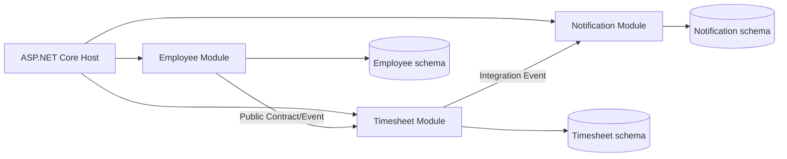
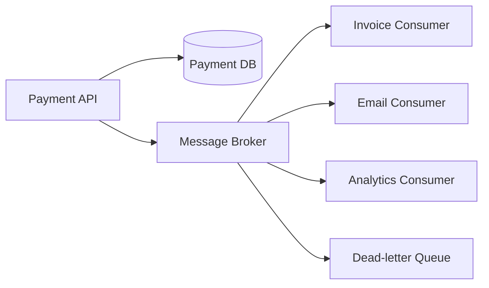
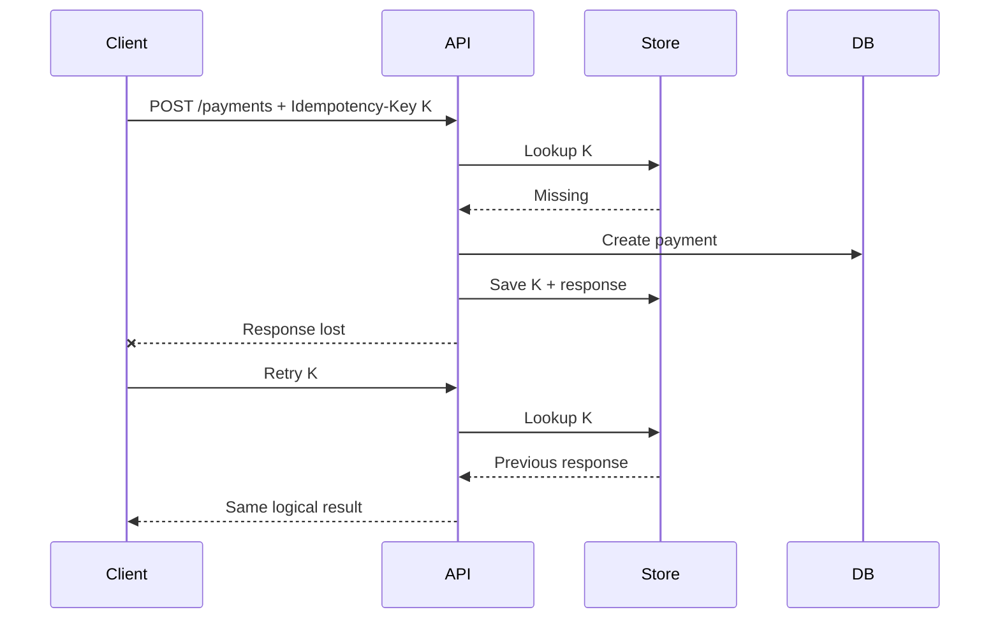
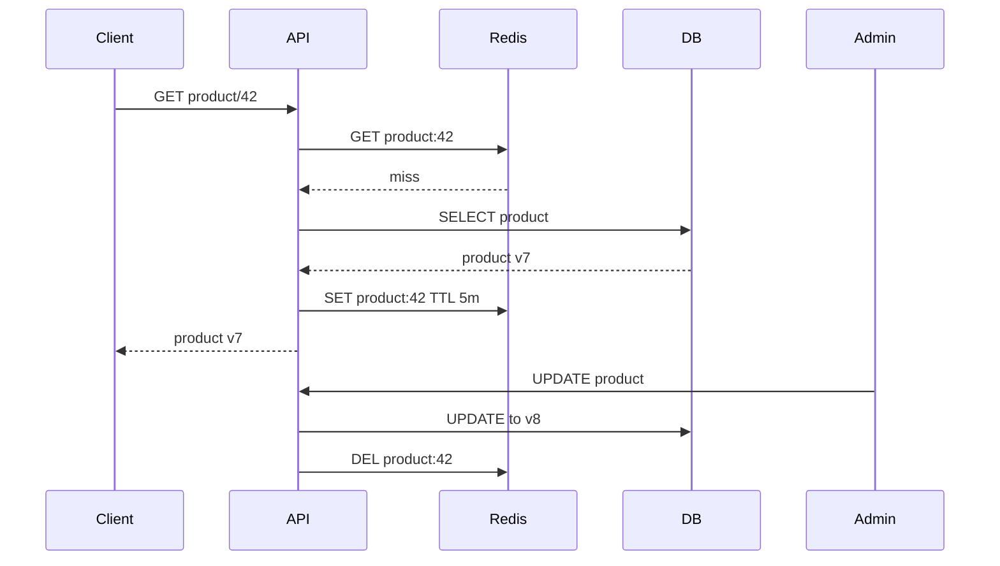
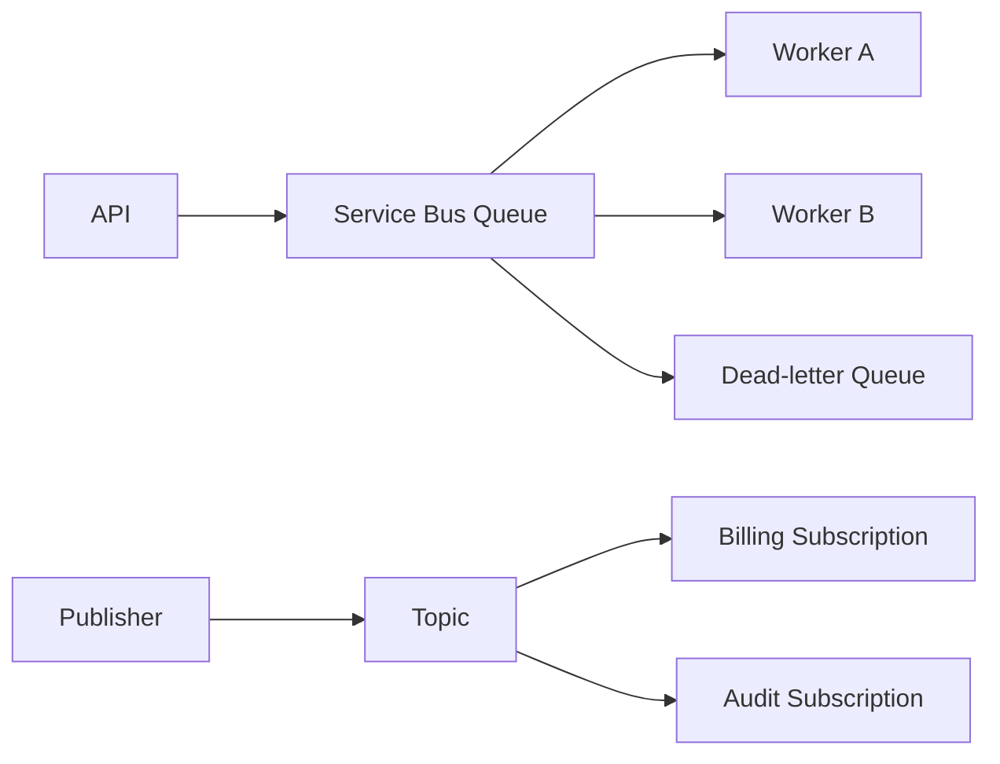
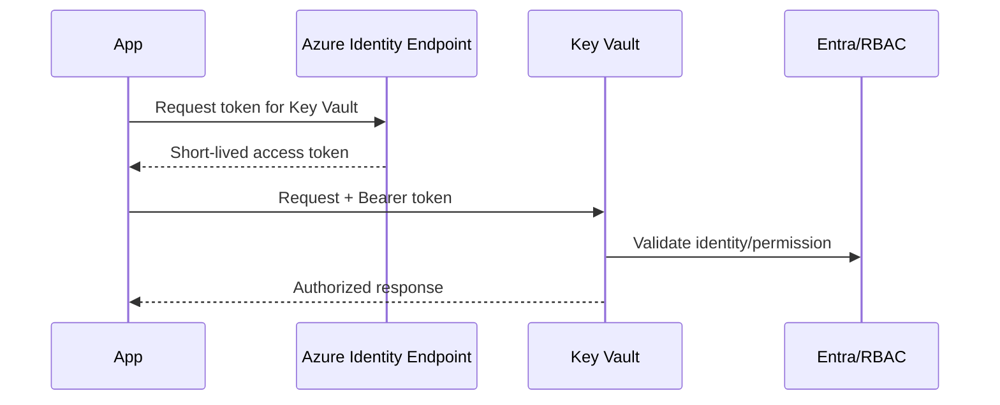
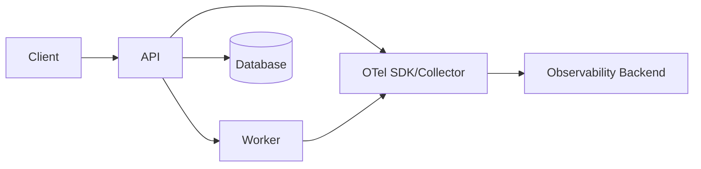
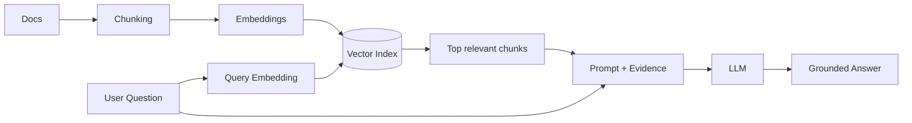
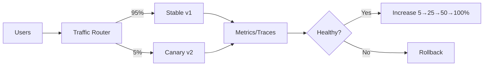

# Daily Knowledge Sharing — 2026-08-19

## Today’s Topics

1. Modular Monolith — chia boundary mà chưa phải trả giá vận hành của Microservices
2. Event-Driven Architecture — event, delivery semantics và eventual consistency
3. API Idempotency — chống xử lý trùng trong các thao tác ghi
4. Database Isolation Levels — cân bằng consistency và concurrency
5. Cache Invalidation — bài toán khó nhất của caching trong production
6. Azure Service Bus — messaging đáng tin cậy cho background/distributed workflows
7. Managed Identity — service-to-service authentication không cần giữ secret
8. OpenTelemetry — nối logs, metrics và traces thành một bức tranh production
9. RAG — grounding LLM bằng dữ liệu riêng và kiểm soát retrieval
10. Canary Deployment — giảm blast radius khi release

---

# 1. Modular Monolith

### 1. What is it?

Modular Monolith vẫn là **một ứng dụng deployable**, nhưng code được chia thành các module có boundary rõ ràng theo business capability, chẳng hạn `Employees`, `Timesheets`, `Notifications`, `Billing`. Điểm quan trọng không phải folder đẹp mà là module không được tùy tiện đọc database table, entity hay internal service của module khác.

Nó thường là bước trưởng thành hợp lý giữa một monolith phụ thuộc chằng chịt và Microservices. Ta giữ transaction/local call đơn giản, đồng thời tạo boundary đủ tốt để một module có thể tách ra sau này nếu thực sự cần.

### 2. Why does it exist?

Monolith ban đầu rất nhanh để phát triển nhưng dễ biến thành "big ball of mud": controller gọi repository bất kỳ, bảng bị join xuyên domain, thay đổi một chức năng làm nhiều phần khác vỡ. Microservices giải quyết một số vấn đề boundary và independent deployment nhưng thêm network failure, distributed tracing, messaging, deployment, eventual consistency và chi phí vận hành.

Modular Monolith giải bài toán: **cần boundary tốt nhưng chưa cần distributed system**.

### 3. How does it work?



Mỗi module sở hữu application logic, domain model và persistence của chính nó. Cross-module interaction đi qua contract rõ ràng: application interface, command/query contract hoặc event. Có thể dùng cùng một SQL Server instance nhưng schema/table ownership vẫn phải rõ.

### 4. Practical example

```csharp
public interface IEmployeeModule
{
    Task<EmployeeSummary?> GetEmployeeAsync(Guid employeeId,
        CancellationToken cancellationToken);
}

internal sealed class EmployeeRepository(EmployeeDbContext db)
{
    public Task<Employee?> FindAsync(Guid id, CancellationToken ct) =>
        db.Employees.SingleOrDefaultAsync(x => x.Id == id, ct);
}
```

`Timesheet` chỉ thấy `IEmployeeModule` hoặc DTO public; nó không inject `EmployeeRepository`.

### 5. Real production scenario

Một hệ thống HR có Employee, Timesheet và Offboarding. Khi nhân viên bị inactive, Employee phát `EmployeeDeactivated`; Timesheet khóa submission mới và Notification gửi thông báo. Ba module vẫn chạy cùng process nên vận hành đơn giản, nhưng dependency business đã rõ ràng.

### 6. Common mistakes

- Chỉ chia project/folder nhưng module vẫn truy cập repository của nhau.
- Dùng một bộ entity EF Core chung cho toàn hệ thống.
- Tạo abstraction cho mọi class khiến code ceremony nặng hơn business logic.
- Dùng in-process event nhưng mặc định nó có durability như message broker.
- Chia module theo technical layer (`Services`, `Repositories`) thay vì business capability.

### 7. Trade-offs

**Advantages:** deployment đơn giản, transaction local dễ, latency thấp, debugging thuận tiện, boundary tốt hơn monolith truyền thống.

**Costs / Risks:** vẫn scale/deploy theo application; boundary chỉ bền khi team kỷ luật; module có workload rất khác nhau khó scale độc lập.

### 8. Junior → Middle → Senior understanding

**Junior:** hiểu module ownership và không bypass public contract.

**Middle:** thiết kế module API, dependency direction, persistence boundary và integration event.

**Senior / Technical Lead:** quyết định khi nào Modular Monolith đủ tốt, khi nào một module thật sự cần tách service; đánh giá coupling, transaction, team ownership và operational cost.

### 9. Key takeaway

- Modular Monolith là kiến trúc boundary, không phải cách đặt folder.
- Đừng chọn Microservices chỉ để ép code có module.
- Database ownership quan trọng không kém code ownership.

---

# 2. Event-Driven Architecture

### 1. What is it?

Event-Driven Architecture (EDA) tổ chức hệ thống quanh việc producer phát ra **sự kiện đã xảy ra**, còn consumer phản ứng độc lập. `OrderPaid`, `EmployeeDeactivated`, `FileUploaded` là event; chúng khác command vì không ra lệnh một consumer cụ thể phải làm gì.

### 2. Why does it exist?

Nếu Payment API phải đồng bộ gọi Invoice, Email, Analytics và Loyalty, request sẽ chậm và availability bị phụ thuộc vào tất cả downstream services. Event giúp producer không cần biết toàn bộ consumer và cho phép xử lý bất đồng bộ.

### 3. How does it work?



Production phải nghĩ tới at-least-once delivery, duplicate, ordering, retry, poison message và eventual consistency. "Publish thành công" cũng phải nhất quán với database write; Outbox Pattern thường được dùng để đóng khoảng trống này.

### 4. Practical example

```csharp
public sealed record PaymentCompleted(
    Guid PaymentId,
    Guid OrderId,
    decimal Amount,
    DateTimeOffset OccurredAt);

public async Task Handle(PaymentCompleted message, CancellationToken ct)
{
    if (await db.ProcessedMessages.AnyAsync(x => x.Id == message.PaymentId, ct))
        return;

    await invoiceService.CreateAsync(message.OrderId, ct);
    db.ProcessedMessages.Add(new(message.PaymentId));
    await db.SaveChangesAsync(ct);
}
```

Consumer có deduplication vì broker có thể giao lại message.

### 5. Real production scenario

Payment được commit trước. Outbox worker publish `PaymentCompleted`. Invoice consumer tạo hóa đơn; Email consumer gửi receipt. Nếu Email tạm down, payment vẫn hoàn tất và message được retry sau.

### 6. Common mistakes

- Nghĩ message chỉ được deliver đúng một lần.
- Publish event trước khi database transaction commit.
- Không version event schema.
- Retry vô hạn poison message.
- Consumer không idempotent.
- Dùng event cho flow cần response đồng bộ tức thời.

### 7. Trade-offs

**Advantages:** loose coupling, independent scaling, hấp thụ traffic spike, tăng resilience.

**Costs / Risks:** eventual consistency, debugging khó hơn, duplicate/order, broker operations và observability phức tạp.

### 8. Junior → Middle → Senior understanding

**Junior:** phân biệt command và event; hiểu producer/consumer.

**Middle:** triển khai retry, DLQ, idempotent consumer và correlation ID.

**Senior / Technical Lead:** thiết kế event boundary, consistency model, schema evolution, ordering guarantee, Outbox/Inbox và failure recovery.

### 9. Key takeaway

- Event giảm temporal coupling nhưng tăng operational complexity.
- At-least-once delivery đồng nghĩa consumer phải chịu duplicate.
- Eventual consistency phải là quyết định thiết kế, không phải bất ngờ production.

---

# 3. API Idempotency

### 1. What is it?

Một operation idempotent cho kết quả business tương đương khi cùng request được gửi lại nhiều lần. Với API ghi như payment/order creation, client gửi `Idempotency-Key`; server nhớ kết quả của lần xử lý đầu và trả lại nó cho retry cùng key.

### 2. Why does it exist?

Network timeout không nói cho client biết server đã xử lý hay chưa. Nếu client retry `POST /payments` một cách ngây thơ, người dùng có thể bị charge hai lần.

### 3. How does it work?



Key cần scope theo caller/operation, lưu request fingerprint để phát hiện cùng key nhưng payload khác, và có retention phù hợp.

### 4. Practical example

```csharp
app.MapPost("/payments", async (
    HttpRequest request, CreatePayment command, PaymentDbContext db) =>
{
    var key = request.Headers["Idempotency-Key"].ToString();
    if (string.IsNullOrWhiteSpace(key)) return Results.BadRequest();

    var previous = await db.IdempotencyRecords.FindAsync(key);
    if (previous is not null)
        return Results.Content(previous.ResponseJson, "application/json");

    // In production: payment + idempotency record share a transaction.
    var payment = new Payment(Guid.NewGuid(), command.Amount);
    db.Payments.Add(payment);
    db.IdempotencyRecords.Add(new(key, JsonSerializer.Serialize(payment)));
    await db.SaveChangesAsync();
    return Results.Ok(payment);
});
```

### 5. Real production scenario

Mobile app gọi tạo booking, server commit nhưng 4G mất trước khi response về. App retry với cùng key. Server trả booking cũ thay vì tạo booking thứ hai.

### 6. Common mistakes

- Chỉ dedupe trong memory nên multi-instance không hiệu quả.
- Key không có unique constraint dẫn tới race condition.
- Cùng key nhưng payload khác vẫn trả response cũ.
- Giữ key mãi mãi gây tăng storage.
- Retry downstream side effect mà không có idempotency riêng.

### 7. Trade-offs

**Advantages:** retry an toàn, UX tốt hơn, giảm duplicate business operations.

**Costs / Risks:** thêm storage, transaction logic, cleanup và concurrency handling.

### 8. Junior → Middle → Senior understanding

**Junior:** hiểu retry có thể tạo duplicate.

**Middle:** triển khai key store, unique constraint, TTL và request fingerprint.

**Senior / Technical Lead:** xác định idempotency boundary xuyên nhiều service, transaction semantics và downstream side effects.

### 9. Key takeaway

- Timeout không đồng nghĩa operation thất bại.
- Idempotency là business correctness, không chỉ HTTP detail.
- Dedupe phải atomic dưới concurrent requests.

---

# 4. Database Isolation Levels

### 1. What is it?

Isolation level quy định transaction nhìn thấy thay đổi concurrent đến mức nào. Nó là cách database cân bằng giữa **tính nhất quán** và **khả năng chạy đồng thời**.

Các mức phổ biến gồm Read Uncommitted, Read Committed, Repeatable Read, Serializable và snapshot/MVCC-based isolation tùy database.

### 2. Why does it exist?

Nếu mọi transaction khóa toàn bộ dữ liệu đến khi xong, consistency mạnh nhưng throughput tệ. Nếu cho đọc/ghi quá tự do, ta gặp dirty read, non-repeatable read, phantom hoặc lost business decision.

### 3. How does it work?

Ví dụ hai transaction cùng kiểm tra số slot còn lại. Ở isolation yếu, cả hai có thể cùng thấy `Remaining = 1` rồi cùng đặt chỗ. Serializable hoặc một atomic update có điều kiện có thể ngăn invariant bị phá.

```text
T1: read remaining = 1 ---- update to 0 ---- commit
T2:      read remaining = 1 ---- update to 0 ---- commit
                 ^ business race
```

### 4. Practical example

Thay vì read-then-write:

```sql
UPDATE EventCapacity
SET Remaining = Remaining - 1
WHERE EventId = @EventId
  AND Remaining > 0;
```

Sau đó kiểm tra affected rows. Đây thường tốt hơn việc tăng isolation cho toàn transaction chỉ để bảo vệ một invariant đơn giản.

Trong EF Core:

```csharp
await using var tx = await db.Database.BeginTransactionAsync(
    IsolationLevel.Serializable, cancellationToken);

// critical read/write sequence
await db.SaveChangesAsync(cancellationToken);
await tx.CommitAsync(cancellationToken);
```

### 5. Real production scenario

Timesheet approval đọc trạng thái `Submitted`, tính dữ liệu và đổi thành `Approved`. Đồng thời user cố withdraw. Nếu không có concurrency strategy, hai workflow có thể tạo trạng thái không hợp lệ.

### 6. Common mistakes

- Tăng lên Serializable để "fix" mọi race condition.
- Transaction giữ mở trong lúc gọi HTTP API.
- Không hiểu database mặc định dùng locking hay row versioning.
- Transaction quá dài gây lock contention/deadlock.
- Nhầm isolation với application-level optimistic concurrency.

### 7. Trade-offs

**Advantages của isolation mạnh:** dễ giữ invariant hơn.

**Costs / Risks:** blocking, deadlock, retry, giảm throughput. Snapshot giảm read blocking nhưng dùng version store và vẫn cần xử lý write conflict.

### 8. Junior → Middle → Senior understanding

**Junior:** hiểu transaction không có nghĩa mọi concurrency problem tự biến mất.

**Middle:** nhận diện dirty/non-repeatable/phantom reads và chọn transaction boundary.

**Senior / Technical Lead:** chọn consistency strategy theo invariant, contention profile và workload; biết khi nào dùng atomic SQL, optimistic concurrency hoặc stronger isolation.

### 9. Key takeaway

- Isolation là trade-off, không phải càng cao càng tốt.
- Giữ transaction ngắn.
- Bảo vệ business invariant bằng primitive nhỏ nhất đủ đúng.

---

# 5. Cache Invalidation

### 1. What is it?

Cache invalidation là chiến lược đảm bảo dữ liệu cache không sống lâu hơn mức business cho phép sau khi source of truth thay đổi. TTL chỉ là một phần; hệ thống còn phải quyết định khi nào delete/update cache và xử lý race condition thế nào.

### 2. Why does it exist?

Cache giúp giảm latency và database load nhưng tạo ra bản sao dữ liệu. Ngay khi có hai bản sao, consistency trở thành vấn đề. Cache sai có thể nguy hiểm hơn cache miss vì hệ thống trả dữ liệu hợp lệ về mặt kỹ thuật nhưng sai business.

### 3. How does it work?



Cache-aside thường dùng: read cache → miss thì DB → populate cache; write DB → invalidate cache.

### 4. Practical example

```csharp
public async Task<ProductDto?> GetAsync(Guid id, CancellationToken ct)
{
    var key = $"product:{id}";
    var cached = await cache.GetStringAsync(key, ct);
    if (cached is not null)
        return JsonSerializer.Deserialize<ProductDto>(cached);

    var product = await db.Products.AsNoTracking()
        .Where(x => x.Id == id)
        .Select(x => new ProductDto(x.Id, x.Name, x.Price))
        .SingleOrDefaultAsync(ct);

    if (product is not null)
        await cache.SetStringAsync(key, JsonSerializer.Serialize(product),
            new DistributedCacheEntryOptions
            { AbsoluteExpirationRelativeToNow = TimeSpan.FromMinutes(5) }, ct);

    return product;
}
```

### 5. Real production scenario

Employee profile được cache 10 phút. Admin đổi department. Nếu authorization dựa vào cached department, stale cache có thể trở thành security issue. Dữ liệu authorization nhạy cảm cần strategy chặt hơn TTL dài.

### 6. Common mistakes

- Cache mọi thứ vì "Redis nhanh".
- TTL quá dài cho dữ liệu thay đổi thường xuyên.
- Không chống cache stampede khi hot key hết hạn.
- Delete cache trước DB commit rồi transaction rollback.
- Không định nghĩa behavior khi Redis unavailable.
- Cache PII/authorization data thiếu kiểm soát.

### 7. Trade-offs

**Advantages:** latency thấp, giảm DB load, hấp thụ read traffic.

**Costs / Risks:** stale data, invalidation complexity, memory cost, dependency mới và stampede.

### 8. Junior → Middle → Senior understanding

**Junior:** hiểu cache không phải source of truth.

**Middle:** triển khai cache-aside, TTL, invalidation, fallback và metrics hit/miss.

**Senior / Technical Lead:** xác định acceptable staleness, stampede protection, distributed invalidation và failure behavior theo loại dữ liệu.

### 9. Key takeaway

- Trước khi cache, hãy định nghĩa dữ liệu được stale bao lâu.
- Cache failure thường nên degrade performance, không làm hỏng correctness.
- Invalidation phải gắn với transaction và business semantics.

---

# 6. Azure Service Bus

### 1. What is it?

Azure Service Bus là managed enterprise message broker cung cấp queues và topics/subscriptions, phù hợp cho reliable asynchronous messaging. Nó khác một HTTP API ở chỗ producer không cần consumer online tại thời điểm gửi.

### 2. Why does it exist?

Background workflow và distributed integration cần buffer, retry, load leveling và decoupling. Nếu API trực tiếp gọi downstream service, spike hoặc outage downstream lan ngược lên caller.

### 3. How does it work?



Consumer nhận message bằng lock, xử lý rồi `Complete`. Nếu fail, message có thể được abandon/re-deliver; vượt delivery count hoặc lỗi không xử lý được thì vào DLQ.

### 4. Practical example

```csharp
await sender.SendMessageAsync(new ServiceBusMessage(
    BinaryData.FromObjectAsJson(new ProcessFile(fileId)))
{
    MessageId = fileId.ToString(),
    CorrelationId = correlationId
});
```

Consumer phải idempotent dù `MessageId`/duplicate detection được cấu hình, vì business side effect vẫn cần phòng vệ.

### 5. Real production scenario

User upload Excel 100 MB. API lưu Blob, enqueue `ProcessFile`, trả `202 Accepted`. Worker đọc file, validate từng batch, lưu kết quả và cập nhật status. Upload request không phải chờ toàn bộ processing.

### 6. Common mistakes

- Dùng queue nhưng worker vẫn giả định message chỉ đến một lần.
- Không monitor DLQ.
- Message chứa payload lớn thay vì lưu Blob và gửi reference.
- Lock duration ngắn hơn processing time mà không renew.
- Retry business validation error vô hạn.
- Không dùng Managed Identity/RBAC khi có thể.

### 7. Trade-offs

**Advantages:** durability, buffering, retries, pub/sub, managed operations.

**Costs / Risks:** eventual consistency, message cost, operational monitoring, duplicate/order semantics và debugging phân tán.

### 8. Junior → Middle → Senior understanding

**Junior:** hiểu queue, producer, consumer và DLQ.

**Middle:** cấu hình retry, lock, concurrency, idempotency và observability.

**Senior / Technical Lead:** chọn queue/topic/session, throughput tier, ordering, partitioning, failure policy và consistency model.

### 9. Key takeaway

- Broker tách availability của producer khỏi consumer.
- DLQ là operational workflow, không phải thùng rác.
- Reliable messaging vẫn cần idempotent business processing.

---

# 7. Managed Identity

### 1. What is it?

Managed Identity cho Azure workload một identity trong Microsoft Entra ID để lấy token truy cập resource mà không cần lưu client secret trong config. Có system-assigned identity gắn với lifecycle resource và user-assigned identity có thể dùng lại cho nhiều resource.

### 2. Why does it exist?

Client secrets phải được tạo, lưu, rotate và có nguy cơ leak qua config, log hoặc pipeline. Managed Identity chuyển credential lifecycle cho Azure và dùng token ngắn hạn.

### 3. How does it work?



Ta cấp RBAC đúng scope cho identity; application dùng Azure Identity SDK để lấy token.

### 4. Practical example

```csharp
var credential = new DefaultAzureCredential();
var client = new SecretClient(
    new Uri("https://my-vault.vault.azure.net/"), credential);

KeyVaultSecret secret = await client.GetSecretAsync("ThirdPartyApiKey");
```

Local development có thể dùng developer identity; trên Azure, credential chain dùng Managed Identity.

### 5. Real production scenario

App Service cần đọc Blob và publish Service Bus. Thay vì hai connection strings có keys, app identity được cấp `Storage Blob Data Reader` và `Azure Service Bus Data Sender` đúng resource cần thiết.

### 6. Common mistakes

- Cấp `Owner`/`Contributor` thay vì data-plane role tối thiểu.
- Nhầm control-plane RBAC với quyền đọc dữ liệu.
- Dùng một user-assigned identity quá rộng cho nhiều workload.
- Không tính propagation delay sau khi gán role.
- Vẫn copy access key vào app dù Managed Identity đã có.

### 7. Trade-offs

**Advantages:** không rotate secret thủ công, token ngắn hạn, audit/RBAC tốt hơn.

**Costs / Risks:** phụ thuộc Azure/Entra, RBAC debugging đôi khi khó, local development khác production và identity design cần governance.

### 8. Junior → Middle → Senior understanding

**Junior:** hiểu identity thay thế stored secret cho Azure-to-Azure authentication.

**Middle:** dùng `DefaultAzureCredential`, RBAC, troubleshoot 401/403.

**Senior / Technical Lead:** thiết kế least privilege, identity isolation, cross-subscription/resource access và secretless architecture.

### 9. Key takeaway

- Secret tốt nhất là secret application không cần giữ.
- Authentication thành công chưa có nghĩa authorization đủ quyền.
- RBAC scope phải nhỏ nhất đáp ứng workload.

---

# 8. OpenTelemetry

### 1. What is it?

OpenTelemetry (OTel) là bộ chuẩn, API, SDK và protocol vendor-neutral để instrument **traces, metrics và logs**. Nó giúp application phát telemetry theo chuẩn chung rồi export sang Application Insights, Grafana/Tempo, Jaeger hoặc backend khác.

### 2. Why does it exist?

Trong distributed system, log riêng lẻ thường không trả lời được request chậm ở API, database hay downstream HTTP call. Vendor-specific instrumentation cũng tạo lock-in. OTel chuẩn hóa context propagation và telemetry pipeline.

### 3. How does it work?



Một trace gồm nhiều spans; `trace_id` nối toàn bộ request path. Metrics cho xu hướng tổng thể; logs cho chi tiết discrete events.

### 4. Practical example

```csharp
builder.Services.AddOpenTelemetry()
    .WithTracing(t => t
        .AddAspNetCoreInstrumentation()
        .AddHttpClientInstrumentation()
        .AddEntityFrameworkCoreInstrumentation())
    .WithMetrics(m => m
        .AddAspNetCoreInstrumentation()
        .AddRuntimeInstrumentation());
```

Custom activity:

```csharp
using var activity = ActivitySource.StartActivity("ProcessTimesheet");
activity?.SetTag("timesheet.id", timesheetId);
```

Không đưa PII hoặc high-cardinality uncontrolled values vào metrics labels.

### 5. Real production scenario

P95 API tăng từ 300 ms lên 2.5 s. Trace cho thấy controller chỉ 20 ms nhưng SQL span 2.1 s. Metrics xác nhận DB latency tăng toàn hệ thống; log theo trace ID chỉ ra query cụ thể. Investigation chuyển từ đoán sang evidence.

### 6. Common mistakes

- Log mọi thứ nhưng không propagate trace context.
- Metric label dùng `userId` tạo cardinality cực lớn.
- Sampling quá mạnh làm mất trace lỗi quan trọng.
- Thu telemetry nhưng không có alert/SLO.
- Ghi token, email hoặc dữ liệu nhạy cảm vào spans.

### 7. Trade-offs

**Advantages:** correlation tốt, vendor-neutral, chuẩn instrumentation rộng.

**Costs / Risks:** telemetry volume/cost, sampling complexity, collector operations và privacy governance.

### 8. Junior → Middle → Senior understanding

**Junior:** phân biệt log, metric, trace.

**Middle:** instrument HTTP/DB/custom spans, propagate context và query trace.

**Senior / Technical Lead:** thiết kế telemetry budget, sampling, cardinality, SLO-driven alerting và data governance.

### 9. Key takeaway

- Logs kể chuyện; metrics cho xu hướng; traces nối request path.
- Telemetry phải phục vụ câu hỏi vận hành cụ thể.
- Cardinality và volume là vấn đề kiến trúc lẫn chi phí.

---

# 9. RAG (Retrieval-Augmented Generation)

### 1. What is it?

RAG là kiến trúc trong đó application **retrieve dữ liệu liên quan trước**, sau đó đưa evidence đó vào context để LLM tạo câu trả lời. Nó không "dạy lại" model; nó cung cấp dữ liệu runtime có thể cập nhật và kiểm soát được.

### 2. Why does it exist?

LLM không biết private company data, knowledge có thể cũ và có thể hallucinate. Nhét toàn bộ document vào prompt lại tốn token, vượt context và làm giảm signal-to-noise ratio.

### 3. How does it work?



Production pipeline thường thêm metadata filter, hybrid search, reranking, citation, authorization filtering và evaluation.

### 4. Practical example

```csharp
var chunks = await knowledgeSearch.SearchAsync(
    question,
    tenantId: currentTenant.Id,
    topK: 8,
    cancellationToken);

var context = string.Join("\n\n", chunks.Select(x =>
    $"SOURCE: {x.Source}\n{x.Text}"));

var prompt = $"""
Answer only from the supplied evidence.
If evidence is insufficient, say so.

Evidence:
{context}

Question: {question}
""";
```

Quan trọng: `tenantId`/ACL phải được enforce ở retrieval layer, không nhờ prompt bảo model tự bỏ qua dữ liệu không được phép.

### 5. Real production scenario

AI assistant nội bộ trả lời policy HR. User hỏi chính sách nghỉ phép. Search chỉ lấy document mà user được quyền xem, rerank top chunks, LLM trả câu trả lời kèm nguồn. Nếu không có evidence đủ mạnh, hệ thống trả "không tìm thấy thông tin" thay vì sáng tác.

### 6. Common mistakes

- Chunk theo số ký tự cố định làm vỡ semantic unit.
- Chỉ tối ưu prompt nhưng retrieval quality kém.
- Không filter ACL trước khi gửi context cho model.
- `topK` quá lớn gây noise và token cost.
- Không có evaluation dataset.
- Tin rằng RAG loại bỏ hoàn toàn hallucination.

### 7. Trade-offs

**Advantages:** dữ liệu cập nhật, citation được, không cần fine-tune cho knowledge retrieval, kiểm soát nguồn tốt hơn.

**Costs / Risks:** indexing pipeline, retrieval latency, embedding/storage cost, stale index, ACL và evaluation complexity.

### 8. Junior → Middle → Senior understanding

**Junior:** hiểu retrieve trước rồi generate.

**Middle:** xây chunking, embedding, vector/hybrid search, metadata filter và citations.

**Senior / Technical Lead:** thiết kế evaluation, tenant isolation, freshness, retrieval strategy, cost/latency budget và fallback khi evidence yếu.

### 9. Key takeaway

- RAG quality bị giới hạn bởi retrieval quality.
- Authorization phải deterministic trước khi context đến LLM.
- "Không đủ evidence" là một output hợp lệ và quan trọng.

---

# 10. Canary Deployment

### 1. What is it?

Canary Deployment phát hành version mới cho một phần nhỏ traffic trước, quan sát health/business metrics rồi tăng dần tỷ lệ nếu an toàn. Mục tiêu là giảm **blast radius** của lỗi mà test/staging không phát hiện.

### 2. Why does it exist?

Không môi trường test nào tái tạo hoàn toàn production traffic, data shape và dependency behavior. Deploy 100% ngay lập tức khiến một regression ảnh hưởng toàn bộ user trước khi team kịp phản ứng.

### 3. How does it work?



Promotion phải dựa trên signal như error rate, latency, saturation và business metric, không chỉ "container đang Running".

### 4. Practical example

Một release pipeline có các gate:

```text
Deploy v2 at 5%
→ observe 15 minutes
→ error_rate < 1%
→ p95_latency < 500 ms
→ payment_success_rate within baseline
→ promote to 25%
→ repeat
```

Feature flags có thể tách **code deployment** khỏi **feature exposure**, rất hữu ích khi database migration hoặc business rollout phức tạp.

### 5. Real production scenario

Version mới của checkout dùng serializer mới. Unit/integration tests pass nhưng với một payload hiếm, v2 trả 500. Canary 5% làm alert tăng error rate; pipeline rollback trước khi 95% traffic còn lại bị ảnh hưởng.

### 6. Common mistakes

- Canary nhưng tất cả instance dùng schema migration không backward-compatible.
- Chỉ monitor CPU/health check, bỏ business KPI.
- Canary traffic không đại diện user thật.
- Không có automated rollback hoặc rollback quá chậm.
- Session affinity khiến phân phối traffic khó hiểu.
- Deploy nhỏ nhưng background consumer mới vẫn xử lý 100% queue.

### 7. Trade-offs

**Advantages:** giảm blast radius, kiểm chứng bằng production traffic, rollback sớm.

**Costs / Risks:** routing/pipeline phức tạp, cần observability tốt, hai version cùng tồn tại và database compatibility khó hơn.

### 8. Junior → Middle → Senior understanding

**Junior:** hiểu deploy khác release và canary không phải test thay thế.

**Middle:** triển khai health metrics, traffic split, rollback và backward-compatible changes.

**Senior / Technical Lead:** thiết kế rollout policy, error budget, database evolution, async worker rollout và automated promotion gates.

### 9. Key takeaway

- Canary giảm phạm vi tác động, không loại bỏ lỗi.
- Không có observability thì canary gần như vô nghĩa.
- Database và background workers phải được đưa vào rollout design, không chỉ HTTP traffic.
