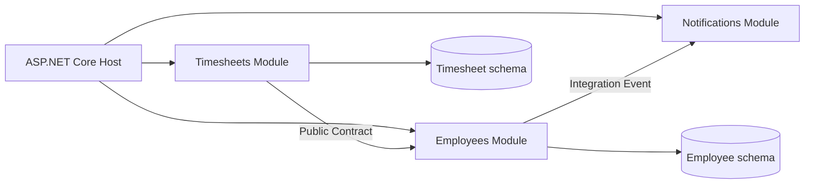
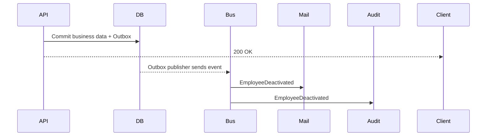
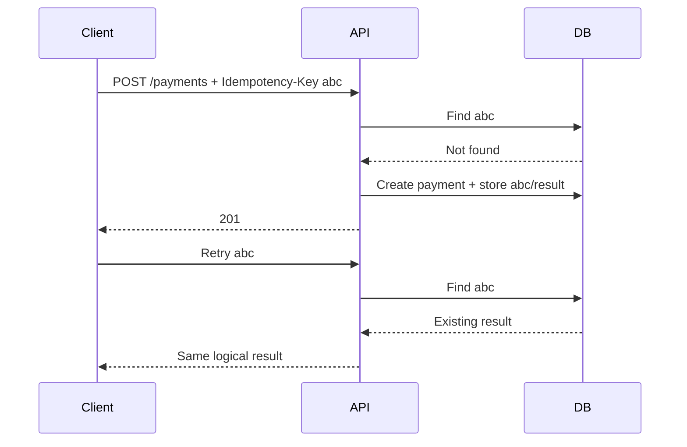
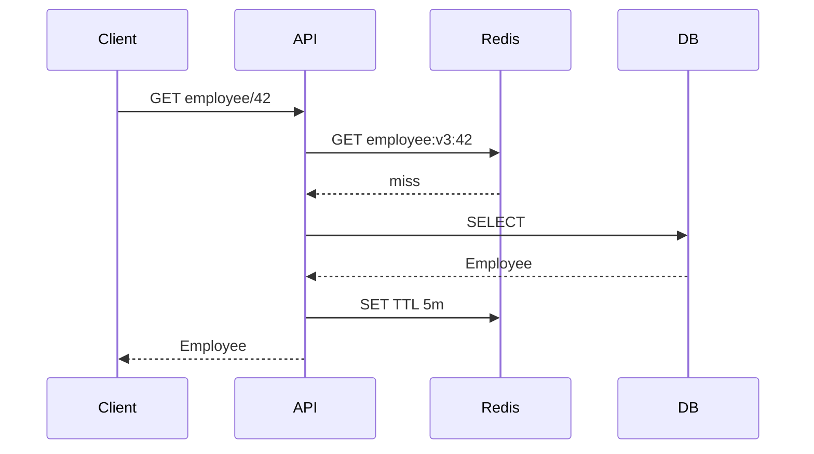
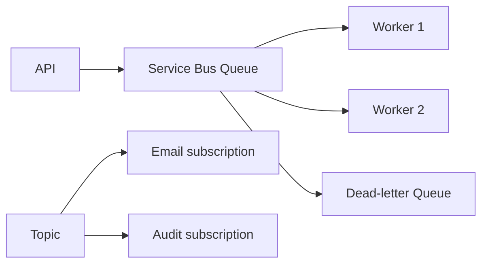
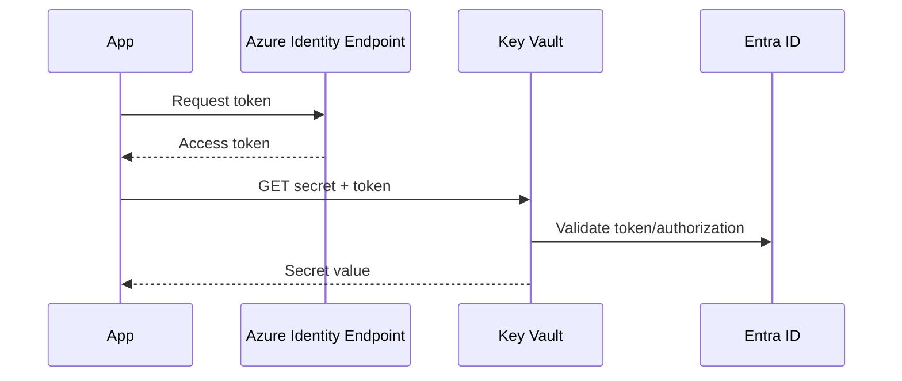
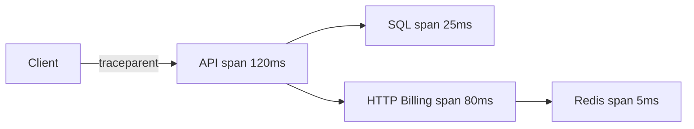
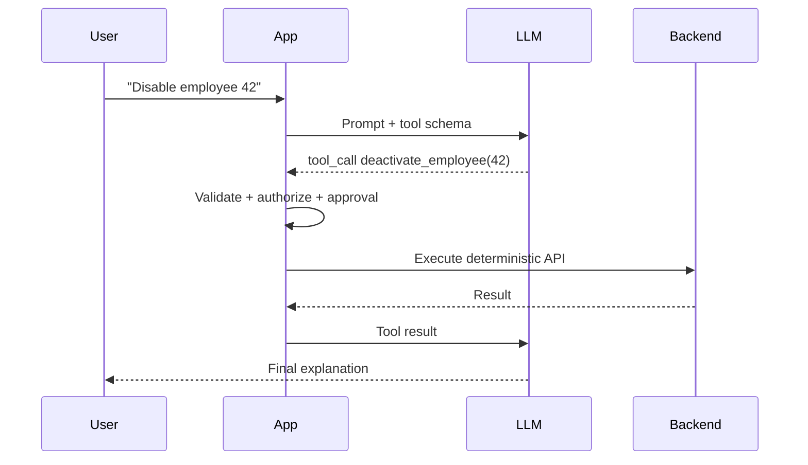
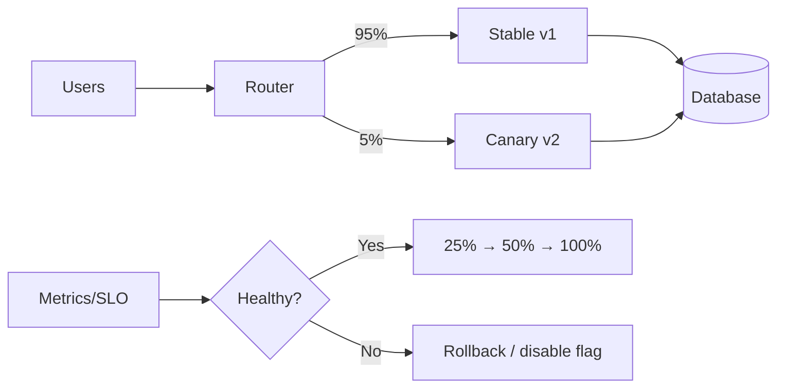

# Daily Knowledge Sharing — 2026-08-19

## Today’s Topics

1. Modular Monolith — chia boundary đúng trước khi nghĩ tới Microservices
2. Event-Driven Architecture — event, delivery semantics và eventual consistency
3. Idempotency — chống xử lý lặp trong API và background processing
4. Optimistic Concurrency với EF Core — phát hiện lost update đúng cách
5. Cache Invalidation — versioning, TTL và chống cache stampede
6. Azure Service Bus — queue, topic, retry và dead-letter trong production
7. Managed Identity + Azure Key Vault — loại bỏ secret khỏi application
8. OpenTelemetry & Distributed Tracing — lần theo request xuyên nhiều service
9. LLM Structured Output + Tool Calling — để AI đề xuất, code quyết định
10. Canary Deployment + Feature Flags — giảm blast radius khi release

---

# 1. Modular Monolith — chia boundary đúng trước khi nghĩ tới Microservices

### 1. What is it?

Modular Monolith vẫn là **một deployable application**, nhưng code và dữ liệu được tổ chức thành các module có boundary rõ ràng như `Employees`, `Timesheets`, `Billing`, `Notifications`. Khác với monolith kiểu “mọi thứ gọi mọi thứ”, mỗi module sở hữu business rules, application use cases và persistence của mình.

Điểm quan trọng không phải folder đẹp mà là **dependency direction và ownership**. Module A không được tùy tiện query bảng hoặc gọi internal class của module B. Giao tiếp nên đi qua public contract, command/query hoặc integration event.

### 2. Why does it exist?

Microservices giải quyết independent deployment và scaling nhưng mang theo network failure, distributed tracing, eventual consistency, deployment orchestration và operational cost. Nhiều hệ thống chưa cần các chi phí đó.

Modular Monolith cho phép xây boundary ngay từ đầu nhưng giữ transaction, debugging và deployment đơn giản. Nếu sau này cần tách service, boundary đã tồn tại về mặt business thay vì phải “cắt” một spaghetti monolith.

### 3. How does it work?



Host xử lý composition root, middleware và routing. Mỗi module tự đăng ký DI, endpoint/use case, domain model và persistence. Cross-module communication phải có contract chủ đích.

### 4. Practical example

```csharp
public interface IEmployeeModule
{
    Task<EmployeeSnapshot?> GetSnapshotAsync(Guid employeeId,
        CancellationToken ct);
}

internal sealed class EmployeeService(AppDbContext db) : IEmployeeModule
{
    public Task<EmployeeSnapshot?> GetSnapshotAsync(Guid id, CancellationToken ct) =>
        db.Employees.Where(x => x.Id == id)
          .Select(x => new EmployeeSnapshot(x.Id, x.Name, x.IsActive))
          .SingleOrDefaultAsync(ct);
}
```

`Timesheets` nhận `IEmployeeModule`; nó không nhận trực tiếp `EmployeeDbContext` hay repository nội bộ của `Employees`.

### 5. Real production scenario

Trong employee-management SaaS, thay đổi trạng thái nhân viên có thể phát event `EmployeeDeactivated`. Notification module gửi mail; Timesheet module khóa submission mới. Nếu Notification lỗi, business transaction của Employee không nên phụ thuộc trực tiếp vào SMTP. Với nhu cầu reliability cao, event có thể được ghi Outbox rồi publish bất đồng bộ.

### 6. Common mistakes

- Chỉ chia folder nhưng các module vẫn reference lẫn nhau.
- Một `Shared` project chứa gần toàn bộ domain và biến thành dependency dump.
- Module A join trực tiếp bảng của B vì “cùng database”.
- Dùng MediatR như phép màu nhưng không định nghĩa ownership.
- Tách module quá nhỏ theo entity thay vì business capability.

### 7. Trade-offs

**Advantages:** deployment đơn giản, local transaction dễ, latency thấp, boundary tốt, chi phí vận hành thấp hơn microservices.

**Costs / Risks:** không independent scale/deploy theo module; process crash ảnh hưởng toàn app; boundary phải được enforce bằng architecture tests/code review; database chung dễ tạo coupling ngầm.

### 8. Junior → Middle → Senior understanding

**Junior:** hiểu module là business boundary, không phải chỉ folder.

**Middle:** biết thiết kế public contract, DI registration, persistence ownership và integration event.

**Senior / Technical Lead:** quyết định module boundary, transaction boundary, khi nào synchronous vs event, cách enforce dependency và tiêu chí thực sự để extract thành service.

### 9. Key takeaway

- Boundary tốt quan trọng hơn số lượng service.
- Modular Monolith thường là điểm khởi đầu an toàn hơn Microservices.
- Không cho database chung trở thành lý do phá ownership.

---

# 2. Event-Driven Architecture — event, delivery semantics và eventual consistency

### 1. What is it?

Event-Driven Architecture (EDA) cho phép producer phát ra sự kiện mô tả **điều đã xảy ra**, còn consumer phản ứng độc lập. `OrderPaid`, `EmployeeDeactivated`, `FileUploaded` là event; chúng khác command như `SendEmail` vì command yêu cầu một hành động cụ thể.

### 2. Why does it exist?

Nếu API gọi tuần tự Notification, Audit, Analytics và Billing, latency và coupling tăng; một downstream lỗi có thể làm toàn request thất bại. Event giúp producer không cần biết tất cả consumer và cho phép xử lý bất đồng bộ.

### 3. How does it work?



Broker thường cung cấp **at-least-once delivery**, vì vậy duplicate là trạng thái bình thường cần thiết kế, không phải edge case.

### 4. Practical example

```csharp
public sealed record EmployeeDeactivated(
    Guid EventId, Guid EmployeeId, DateTimeOffset OccurredAt);

public async Task Handle(EmployeeDeactivated e, CancellationToken ct)
{
    if (await db.ProcessedMessages.AnyAsync(x => x.Id == e.EventId, ct)) return;

    await mailer.QueueDeactivationMail(e.EmployeeId, ct);
    db.ProcessedMessages.Add(new ProcessedMessage(e.EventId));
    await db.SaveChangesAsync(ct);
}
```

Consumer dùng `EventId` để deduplicate.

### 5. Real production scenario

Payment API commit `PaymentSucceeded`, rồi fulfillment, invoice và notification xử lý riêng. Client có thể thấy payment đã thành công trước khi invoice xuất hiện vài giây. UI và business phải chấp nhận trạng thái trung gian này.

### 6. Common mistakes

- Nghĩ message broker đảm bảo exactly-once end-to-end.
- Publish event trước khi database transaction commit.
- Consumer không idempotent.
- Event schema thay đổi breaking mà không version/evolution strategy.
- Dùng event cho mọi internal method call, làm flow khó hiểu.

### 7. Trade-offs

**Advantages:** decoupling, buffering, resilience, independent scaling.

**Costs / Risks:** eventual consistency, duplicate/out-of-order message, tracing khó hơn, schema governance và operational burden.

### 8. Junior → Middle → Senior understanding

**Junior:** phân biệt event và command; hiểu async processing.

**Middle:** implement consumer idempotency, retry, DLQ, correlation ID và Outbox.

**Senior / Technical Lead:** chọn consistency model, partition/order strategy, event ownership, replay policy và đánh giá khi synchronous call đơn giản hơn EDA.

### 9. Key takeaway

- At-least-once nghĩa là duplicate phải được dự kiến.
- Database commit và event publication cần giải quyết dual-write.
- Eventual consistency là business decision, không chỉ technical detail.

---

# 3. Idempotency — chống xử lý lặp trong API và background processing

### 1. What is it?

Một operation idempotent có thể được gửi lại nhiều lần nhưng **business effect chỉ xảy ra một lần** đối với cùng logical request. `GET` tự nhiên idempotent; `POST /payments` thường không và cần idempotency key.

### 2. Why does it exist?

Client timeout không biết server đã commit hay chưa. Retry là cần thiết cho reliability nhưng có thể tạo hai payment, hai order hoặc hai email. Không retry thì transient failure làm giảm reliability; retry mù thì gây duplicate side effect.

### 3. How does it work?



### 4. Practical example

```csharp
app.MapPost("/payments", async (
    HttpRequest request, PaymentRequest input, AppDbContext db, CancellationToken ct) =>
{
    var key = request.Headers["Idempotency-Key"].ToString();
    if (string.IsNullOrWhiteSpace(key)) return Results.BadRequest();

    var existing = await db.IdempotencyRecords.SingleOrDefaultAsync(x => x.Key == key, ct);
    if (existing is not null) return Results.Json(existing.Response, statusCode: existing.StatusCode);

    // Production: unique index + transaction + request hash are required.
    var payment = Payment.Create(input.Amount);
    db.Payments.Add(payment);
    db.IdempotencyRecords.Add(IdempotencyRecord.Success(key, payment.Id));
    await db.SaveChangesAsync(ct);
    return Results.Created($"/payments/{payment.Id}", payment);
});
```

Database cần unique index trên key; nếu cùng key nhưng payload khác, nên reject thay vì trả kết quả cũ im lặng.

### 5. Real production scenario

Mobile app gửi payment, mạng rớt ngay sau server commit. App retry cùng key. API trả payment cũ thay vì charge lần hai. Background consumer cũng áp dụng cùng nguyên tắc với `MessageId`.

### 6. Common mistakes

- Chỉ check-then-insert mà không có unique constraint → race condition.
- Key không gắn request fingerprint.
- Giữ key vô hạn hoặc xóa quá sớm.
- Retry side effect không idempotent như email/webhook.
- Nhầm idempotency với distributed lock.

### 7. Trade-offs

**Advantages:** retry an toàn, giảm duplicate business effect, API đáng tin cậy hơn.

**Costs / Risks:** thêm storage, cleanup, concurrency logic; cần định nghĩa retention và semantic của “same request”.

### 8. Junior → Middle → Senior understanding

**Junior:** hiểu retry có thể duplicate dữ liệu.

**Middle:** triển khai key, unique index, transaction và replay response.

**Senior / Technical Lead:** xác định idempotency boundary, retention, multi-region behavior và interaction với external provider.

### 9. Key takeaway

- Retry và idempotency phải được thiết kế cùng nhau.
- Unique constraint là lớp bảo vệ cuối trước concurrency.
- “Same key, different payload” phải có policy rõ ràng.

---

# 4. Optimistic Concurrency với EF Core — phát hiện lost update đúng cách

### 1. What is it?

Optimistic concurrency giả định conflict hiếm nên không lock row suốt thời gian user chỉnh sửa. Mỗi record có concurrency token; update chỉ thành công nếu token vẫn giống lúc đọc.

### 2. Why does it exist?

Hai admin cùng mở employee. A đổi email, B đổi status. Nếu B save snapshot cũ sau A, thay đổi của A có thể bị ghi đè — **lost update**.

### 3. How does it work?

SQL Server `rowversion` thay đổi mỗi lần row update. EF Core đưa token cũ vào `WHERE`:

```sql
UPDATE Employees
SET Status = @status
WHERE Id = @id AND RowVersion = @originalVersion;
```

0 row affected → EF Core ném `DbUpdateConcurrencyException`.

### 4. Practical example

```csharp
public class Employee
{
    public Guid Id { get; set; }
    public string Status { get; set; } = default!;
    [Timestamp]
    public byte[] RowVersion { get; set; } = default!;
}

try
{
    await db.SaveChangesAsync(ct);
}
catch (DbUpdateConcurrencyException)
{
    return Results.Conflict(new
    {
        code = "employee_changed",
        message = "Employee was modified by another request. Reload and retry."
    });
}
```

API có thể expose token dưới dạng ETag và yêu cầu `If-Match`.

### 5. Real production scenario

Trong timesheet approval, manager và payroll service cùng thay đổi trạng thái. Silent overwrite có thể tạo sai payroll. Conflict nên được phát hiện và business quyết định reload, merge hoặc reject.

### 6. Common mistakes

- Catch exception rồi retry vô hạn với dữ liệu cũ.
- Không gửi token từ client về server.
- Update entity bằng DTO đầy đủ khiến overwrite field không liên quan.
- Dùng pessimistic lock cho form người dùng mở hàng phút.

### 7. Trade-offs

**Advantages:** không giữ lock lâu, throughput tốt khi conflict hiếm.

**Costs / Risks:** client phải xử lý conflict; merge phức tạp; conflict cao có thể tạo nhiều retry.

### 8. Junior → Middle → Senior understanding

**Junior:** hiểu lost update.

**Middle:** cấu hình token, xử lý `DbUpdateConcurrencyException`, thiết kế HTTP 409/ETag.

**Senior / Technical Lead:** chọn optimistic hay pessimistic theo contention, xác định merge semantics và bảo vệ invariants xuyên aggregate.

### 9. Key takeaway

- Concurrency token phát hiện stale write; nó không tự merge dữ liệu.
- Retry chỉ đúng khi business operation có thể tính lại an toàn.
- HTTP ETag là cách tự nhiên đưa optimistic concurrency ra API boundary.

---

# 5. Cache Invalidation — versioning, TTL và chống cache stampede

### 1. What is it?

Cache invalidation là chiến lược đảm bảo cached data không sống sai lâu hơn mức business chấp nhận. Vấn đề không chỉ là `Remove(key)` mà còn gồm TTL, key version, distributed invalidation và stampede protection.

### 2. Why does it exist?

Cache tăng tốc read nhưng tạo bản sao dữ liệu. Database thay đổi mà cache chưa đổi → stale data. Xóa cache đúng lúc khó vì write và cache là hai hệ thống khác nhau.

### 3. How does it work?



Khi write: commit DB trước, sau đó invalidate cache. TTL là safety net. Với schema/result thay đổi lớn, bump `v3` → `v4` thay vì scan xóa hàng triệu key.

### 4. Practical example

```csharp
var key = $"employee:v3:{id}";
var json = await cache.GetStringAsync(key, ct);
if (json is not null)
    return JsonSerializer.Deserialize<EmployeeDto>(json)!;

var dto = await db.Employees.AsNoTracking()
    .Where(x => x.Id == id)
    .Select(x => new EmployeeDto(x.Id, x.Name, x.Status))
    .SingleAsync(ct);

await cache.SetStringAsync(key, JsonSerializer.Serialize(dto),
    new DistributedCacheEntryOptions
    {
        AbsoluteExpirationRelativeToNow = TimeSpan.FromMinutes(5)
    }, ct);
return dto;
```

### 5. Real production scenario

Employee profile được đọc hàng nghìn lần nhưng update ít. Cache-aside phù hợp. Permission hoặc account lockout lại cần freshness cao hơn; TTL 30 phút có thể là security bug.

### 6. Common mistakes

- Cache dữ liệu authorization quá lâu.
- TTL tất cả key cùng thời điểm → synchronized expiry/stampede.
- Không có fallback khi Redis down.
- Cache null quá lâu hoặc không cache null khiến penetration.
- Invalidate trước DB commit; transaction fail nhưng cache đã mất.

### 7. Trade-offs

**Advantages:** giảm DB load và latency.

**Costs / Risks:** stale data, operational dependency, memory cost, stampede. Strong consistency và aggressive caching thường xung đột.

### 8. Junior → Middle → Senior understanding

**Junior:** hit/miss/TTL.

**Middle:** cache-aside, invalidation, serialization, fallback, jitter TTL.

**Senior / Technical Lead:** định nghĩa freshness SLA, stampede protection, multi-region invalidation và quyết định dữ liệu nào tuyệt đối không cache.

### 9. Key takeaway

- Cache là một bản sao dữ liệu có consistency policy.
- TTL là safety net, không phải toàn bộ invalidation strategy.
- Hãy thiết kế behavior khi Redis chậm/down trước khi production gặp sự cố.

---

# 6. Azure Service Bus — queue, topic, retry và dead-letter trong production

### 1. What is it?

Azure Service Bus là managed enterprise message broker. **Queue** phù hợp competing consumers; **Topic + Subscription** phù hợp publish/subscribe khi nhiều consumer cần cùng event.

### 2. Why does it exist?

HTTP synchronous coupling khiến producer phụ thuộc availability và latency của consumer. Broker buffer workload, hỗ trợ retry, dead-letter, duplicate detection, scheduling và lock-based processing.

### 3. How does it work?



Peek-lock mode giao message nhưng chưa xóa. Consumer `Complete` sau thành công; nếu crash, lock hết hạn và message được redeliver.

### 4. Practical example

```csharp
var processor = client.CreateProcessor("mail-jobs", new ServiceBusProcessorOptions
{
    MaxConcurrentCalls = 8,
    AutoCompleteMessages = false
});

processor.ProcessMessageAsync += async args =>
{
    var job = args.Message.Body.ToObjectFromJson<MailJob>();
    await handler.Handle(job, args.CancellationToken);
    await args.CompleteMessageAsync(args.Message, args.CancellationToken);
};
```

Poison message nên dead-letter với reason có ý nghĩa thay vì retry vô hạn.

### 5. Real production scenario

API nhận yêu cầu offboarding, commit DB rồi enqueue công việc cập nhật Microsoft 365. Worker xử lý Graph/Exchange chậm mà không giữ HTTP request. Nếu provider throttling, message retry có backoff; lỗi dữ liệu vĩnh viễn vào DLQ để điều tra.

### 6. Common mistakes

- `Complete` trước khi side effect hoàn tất.
- Không idempotent khi lock expires giữa xử lý.
- Retry business validation error.
- Không monitor DLQ.
- `MaxConcurrentCalls` quá cao làm downstream bị 429.

### 7. Trade-offs

**Advantages:** durable buffering, decoupling, managed reliability, load leveling.

**Costs / Risks:** eventual consistency, duplicate, message cost, operational monitoring và ordering complexity.

### 8. Junior → Middle → Senior understanding

**Junior:** queue vs topic; producer vs consumer.

**Middle:** processor, lock, retry, DLQ, idempotency, correlation ID.

**Senior / Technical Lead:** throughput sizing, partition/session ordering, backpressure, disaster recovery, cost và downstream rate-limit coordination.

### 9. Key takeaway

- Broker không loại bỏ failure; nó biến failure thành thứ có thể buffer và retry.
- Consumer phải idempotent.
- DLQ không phải thùng rác; nó cần alert và remediation process.

---

# 7. Managed Identity + Azure Key Vault — loại bỏ secret khỏi application

### 1. What is it?

Managed Identity cấp identity do Azure quản lý cho App Service, Function, VM hoặc Container Apps. Workload dùng identity đó lấy token Entra ID để truy cập Key Vault/Storage/SQL mà không cần lưu client secret.

### 2. Why does it exist?

Secret trong `appsettings.json`, pipeline variable hoặc environment variable vẫn phải rotate và có thể bị leak. Managed Identity chuyển từ “application giữ credential” sang “platform chứng minh workload identity”.

### 3. How does it work?



### 4. Practical example

```csharp
var credential = new DefaultAzureCredential();
var client = new SecretClient(
    new Uri("https://my-vault.vault.azure.net/"), credential);

KeyVaultSecret secret = await client.GetSecretAsync("Graph-Api-Key");
```

Local development có thể dùng Azure CLI/Visual Studio credential; production tự chuyển sang Managed Identity qua cùng `DefaultAzureCredential` chain.

### 5. Real production scenario

App Service cần Blob Storage và Key Vault. Gán system-assigned identity, cấp RBAC tối thiểu (`Storage Blob Data Contributor`, `Key Vault Secrets User`). Không cần storage key trong deployment config.

### 6. Common mistakes

- Cấp `Owner`/`Contributor` thay vì data-plane role tối thiểu.
- Dùng Key Vault nhưng app vẫn giữ client secret để vào Key Vault.
- Không phân biệt control plane và data plane permissions.
- Bật Private Endpoint nhưng DNS/network chưa đúng.

### 7. Trade-offs

**Advantages:** không quản lý credential, rotation đơn giản, audit tốt, giảm leak risk.

**Costs / Risks:** phụ thuộc Azure identity/network; local debugging cần credential chain; RBAC propagation có độ trễ; cross-cloud/on-prem scenario phức tạp hơn.

### 8. Junior → Middle → Senior understanding

**Junior:** hiểu secret không nên hard-code.

**Middle:** cấu hình identity, RBAC, `DefaultAzureCredential`, Key Vault references.

**Senior / Technical Lead:** least privilege, network isolation, user-assigned vs system-assigned identity, incident/revocation strategy và dependency availability.

### 9. Key takeaway

- Tốt hơn việc bảo vệ secret là **không cần secret**.
- Managed Identity + RBAC nên là default cho Azure service-to-service access.
- Identity, authorization và networking đều phải đúng thì request mới thành công.

---

# 8. OpenTelemetry & Distributed Tracing — lần theo request xuyên nhiều service

### 1. What is it?

OpenTelemetry (OTel) là chuẩn instrumentation/vendor-neutral cho traces, metrics và logs. Distributed trace biểu diễn một request thành trace gồm nhiều span qua API, DB, HTTP call, queue consumer.

### 2. Why does it exist?

Log riêng từng service trả lời “service này ghi gì”, nhưng không dễ trả lời “request 8f2 mất 4.2 giây ở đâu?”. Correlation thủ công dễ thiếu. Trace giữ quan hệ parent-child và timing.

### 3. How does it work?



W3C `traceparent` truyền trace context qua HTTP; messaging cần inject/extract context vào message properties.

### 4. Practical example

```csharp
builder.Services.AddOpenTelemetry()
    .WithTracing(t => t
        .AddAspNetCoreInstrumentation()
        .AddHttpClientInstrumentation()
        .AddEntityFrameworkCoreInstrumentation()
        .AddSource("Company.Timesheets")
        .AddOtlpExporter());

private static readonly ActivitySource Source = new("Company.Timesheets");
using var activity = Source.StartActivity("ApproveTimesheet");
activity?.SetTag("timesheet.id", id);
```

Không tag PII, token hoặc raw request body chỉ để “debug cho tiện”.

### 5. Real production scenario

P95 của approval API tăng từ 300 ms lên 2.5 s. Trace cho thấy SQL chỉ 40 ms nhưng Graph API mất 2 s và retry một lần. Team tránh tối ưu database sai chỗ.

### 6. Common mistakes

- Collect 100% trace ở traffic lớn mà không cân nhắc cost.
- High-cardinality metrics/tag làm backend đắt và khó query.
- Không propagate context qua background job/message.
- Log secret/PII vào span attributes.
- Có telemetry nhưng không có alert/SLO.

### 7. Trade-offs

**Advantages:** root-cause nhanh, vendor-neutral instrumentation, dependency latency rõ.

**Costs / Risks:** telemetry cost, sampling có thể bỏ trace hiếm, instrumentation overhead, governance dữ liệu.

### 8. Junior → Middle → Senior understanding

**Junior:** trace/span/correlation ID.

**Middle:** instrument ASP.NET Core, HttpClient, EF Core, custom span và context propagation.

**Senior / Technical Lead:** sampling strategy, telemetry budget, cardinality, SLO-driven dashboards và privacy policy.

### 9. Key takeaway

- Logs nói “đã xảy ra gì”; traces nói “request đi qua đâu và mất thời gian ở đâu”.
- Propagation quan trọng ngang instrumentation.
- Observability phải phục vụ câu hỏi production cụ thể.

---

# 9. LLM Structured Output + Tool Calling — để AI đề xuất, code quyết định

### 1. What is it?

Structured Output ép model trả dữ liệu theo schema thay vì prose tự do. Tool Calling cho model **đề xuất** gọi function với arguments; application mới là nơi validate, authorize và thực thi tool.

### 2. Why does it exist?

Parse text như `"Action: deactivate user 42"` rất mong manh. Khi AI tham gia workflow có side effect, deterministic code phải kiểm soát schema, permission, idempotency và audit.

### 3. How does it work?



LLM không nên trực tiếp có database credential hay quyền tùy ý thực thi shell.

### 4. Practical example

```csharp
public sealed record DeactivateEmployeeArgs(Guid EmployeeId, string Reason);

public async Task<ToolResult> ExecuteAsync(
    DeactivateEmployeeArgs args, ClaimsPrincipal user, CancellationToken ct)
{
    if (!user.IsInRole("HRAdmin"))
        return ToolResult.Denied("Insufficient permission");

    if (string.IsNullOrWhiteSpace(args.Reason))
        return ToolResult.Invalid("Reason is required");

    return await employeeService.DeactivateAsync(args.EmployeeId, args.Reason, ct);
}
```

Schema validation là lớp đầu; business authorization vẫn phải nằm trong deterministic backend.

### 5. Real production scenario

AI assistant đọc ticket offboarding và đề xuất `deactivate_employee`, `set_auto_reply`, `revoke_sessions`. Human xác nhận plan. Backend thực thi từng step với permission, audit ID và idempotency key. Nếu model bị prompt injection từ nội dung ticket, nó vẫn không vượt qua authorization boundary.

### 6. Common mistakes

- Tin tool arguments vì “model đã validate”.
- Cho model quyền tool quá rộng.
- Retry tool có side effect mà không idempotent.
- Đưa secret vào prompt/context.
- Không lưu tool-call audit và latency/token metrics.
- Cho AI quyết định invariant tài chính/security thay deterministic code.

### 7. Trade-offs

**Advantages:** integration đáng tin hơn prose parsing, workflow linh hoạt, dễ audit và validate.

**Costs / Risks:** schema/version complexity, model vẫn có thể chọn sai tool, latency/cost tăng, prompt injection và permission design bắt buộc.

### 8. Junior → Middle → Senior understanding

**Junior:** AI output không mặc định đáng tin; schema giúp parse an toàn.

**Middle:** implement schema validation, tool dispatcher, timeout, cancellation, retry và audit.

**Senior / Technical Lead:** thiết kế trust boundary, approval policy, least-privilege tool set, evaluation, cost budget và failure recovery.

### 9. Key takeaway

- AI có thể **đề xuất hành động**; deterministic code phải kiểm soát việc thực thi.
- Structured output giải quyết format, không giải quyết truth hay authorization.
- Tool side effect cần cùng tiêu chuẩn security/idempotency như public API.

---

# 10. Canary Deployment + Feature Flags — giảm blast radius khi release

### 1. What is it?

Canary Deployment đưa version mới tới một phần nhỏ traffic trước khi rollout toàn bộ. Feature Flag tách **code deployment** khỏi **feature release**, cho phép bật/tắt capability mà không redeploy.

### 2. Why does it exist?

Test không mô phỏng hoàn hảo production traffic, data shape và dependency behavior. Big-bang release đưa bug tới 100% user ngay lập tức. Canary giới hạn blast radius; flag cho phép kill-switch nhanh.

### 3. How does it work?



Promotion phải dựa vào error rate, latency và business metrics, không chỉ “pod vẫn Running”.

### 4. Practical example

```csharp
if (await featureManager.IsEnabledAsync("NewApprovalEngine"))
    return await newEngine.ApproveAsync(command, ct);

return await legacyEngine.ApproveAsync(command, ct);
```

Flag có thể target internal users hoặc tenant cụ thể trước. Database migration phải backward-compatible để cả v1 và v2 chạy đồng thời.

### 5. Real production scenario

Timesheet API rollout approval engine mới cho 5% tenant. Dashboard so sánh error rate, P95 và số approval thất bại. Khi dependency timeout tăng, team tắt flag ngay, không cần chờ build/deploy cũ.

### 6. Common mistakes

- Canary 5% nhưng không có metric để quyết định promote.
- Migration drop/rename column ngay khiến old version chết.
- Flag tồn tại nhiều năm tạo combinatorial complexity.
- Rollback app nhưng schema/data đã thay đổi không backward-compatible.
- Chỉ monitor technical metrics, bỏ business correctness.

### 7. Trade-offs

**Advantages:** blast radius nhỏ, rollback/kill-switch nhanh, release có kiểm chứng.

**Costs / Risks:** vận hành hai behavior cùng lúc, flag debt, routing/telemetry phức tạp, database compatibility khó hơn.

### 8. Junior → Middle → Senior understanding

**Junior:** hiểu deploy khác release và flag không phải `if` vĩnh viễn.

**Middle:** implement flag, targeted rollout, telemetry và cleanup.

**Senior / Technical Lead:** định nghĩa promotion gates, rollback strategy, backward-compatible migration, SLO threshold và blast-radius policy.

### 9. Key takeaway

- Canary không có observability chỉ là rollout chậm.
- Feature Flag cần owner, expiry date và cleanup plan.
- Database compatibility thường quyết định rollback có thật sự khả thi hay không.
