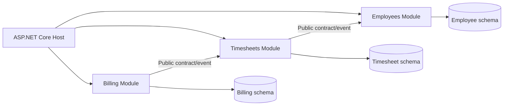
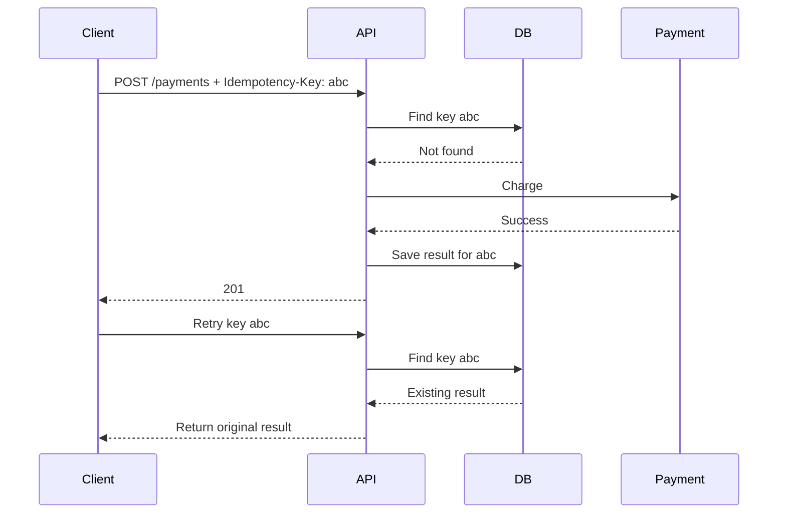
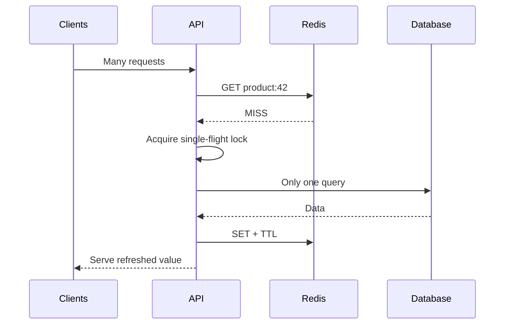
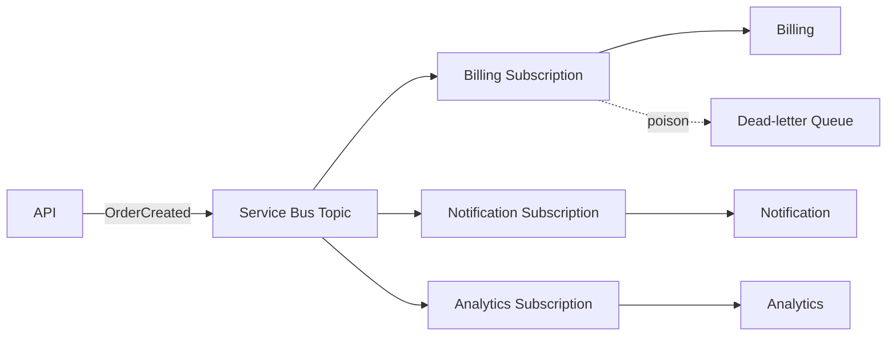
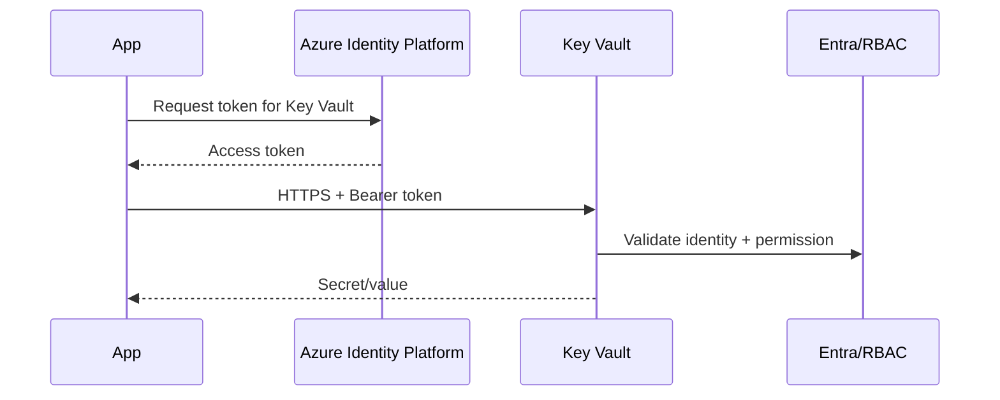
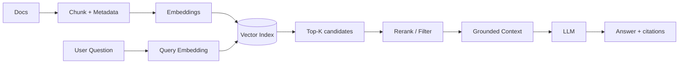
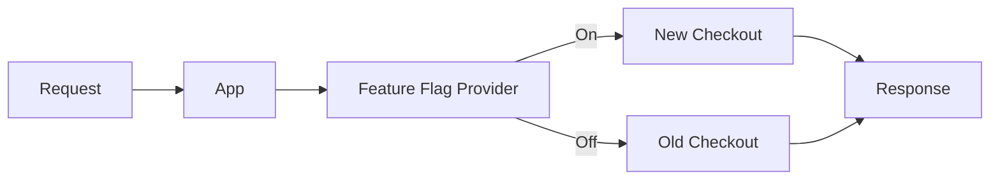
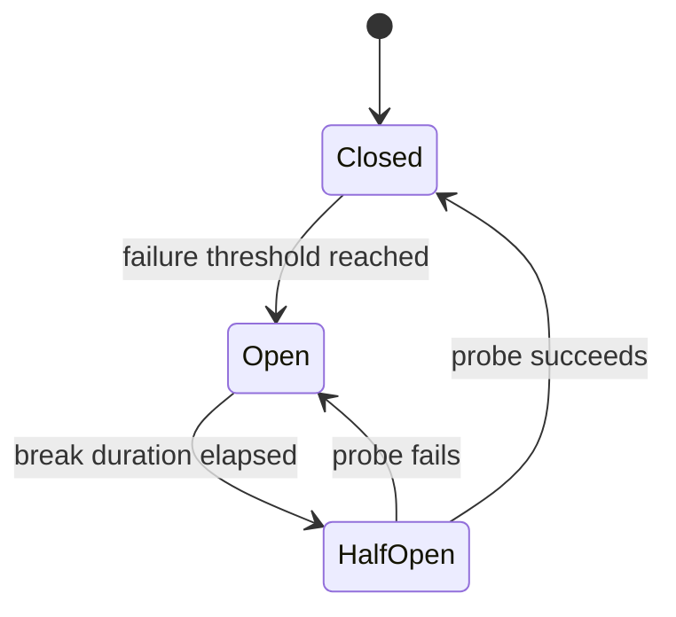

# Daily Knowledge Sharing — 2026-08-19

## Today’s Topics

1. Modular Monolith — module boundary và dependency direction
2. Idempotency — chống xử lý trùng trong API và background processing
3. Optimistic Concurrency với EF Core
4. Cache Stampede và chiến lược chống thundering herd
5. Azure Service Bus — queue, topic, retry và dead-letter
6. Azure Managed Identity — loại bỏ secret trong service-to-service authentication
7. OpenTelemetry và Distributed Tracing
8. RAG — thiết kế retrieval pipeline thay vì chỉ “nhét tài liệu vào prompt”
9. Feature Flags — tách deployment khỏi release
10. Circuit Breaker — ngăn cascading failure trong distributed system

---

# 1. Modular Monolith — module boundary và dependency direction

### 1. What is it?

Modular Monolith vẫn là **một ứng dụng được deploy như một đơn vị**, nhưng code được chia thành các module nghiệp vụ có boundary rõ ràng. Điểm quan trọng không phải folder đẹp mà là module này không được tùy tiện đọc database table, gọi internal class hay sửa state của module khác.

Ví dụ hệ thống SaaS có `Employees`, `Timesheets`, `Billing`, `Notifications`. Chúng chạy trong cùng process nhưng mỗi module sở hữu model, use case và persistence của mình.

### 2. Why does it exist?

Một monolith không có boundary thường tiến hóa thành “big ball of mud”: bất kỳ service nào cũng inject bất kỳ repository nào, transaction trải qua nhiều feature và thay đổi một chức năng gây side effect ở nơi khác. Microservices giải quyết một số vấn đề boundary nhưng đổi lại network failure, eventual consistency, deployment complexity và observability cost.

Modular Monolith giữ operational simplicity của monolith nhưng áp dụng tư duy boundary của distributed architecture.

### 3. How does it work?



Mỗi module expose một contract nhỏ. Dependency đi qua contract đó, không xuyên thẳng vào implementation. Có thể dùng cùng SQL Server nhưng schema/table ownership vẫn phải rõ.

### 4. Practical example

```csharp
public interface IEmployeeModule
{
    Task<EmployeeSnapshot?> GetSnapshotAsync(Guid employeeId,
        CancellationToken ct);
}

internal sealed class EmployeeModule : IEmployeeModule
{
    // Internal implementation không bị module khác truy cập trực tiếp.
}
```

`Timesheets` chỉ biết `IEmployeeModule` hoặc consume integration/domain event phù hợp, thay vì inject `EmployeeRepository`.

### 5. Real production scenario

Khi nhân viên bị deactivate, Employee module commit state của nó rồi publish `EmployeeDeactivated`. Timesheet module xử lý event để khóa submission; Notification module gửi thông báo. Không cần một transaction khổng lồ update ba module cùng lúc.

### 6. Common mistakes

- Chia folder thành module nhưng tất cả vẫn dùng chung entity/repository.
- Shared project trở thành nơi chứa toàn bộ domain model.
- Cho module A query trực tiếp table của module B.
- Dùng event cho mọi lời gọi dù một synchronous contract đơn giản đủ tốt.
- Tách microservice quá sớm chỉ vì đã có module boundary.

### 7. Trade-offs

**Advantages:** deployment đơn giản, transaction local dễ hơn microservices, refactor nhanh, boundary chuẩn bị tốt cho việc tách service sau này.

**Costs / Risks:** boundary chỉ được bảo vệ bằng discipline/tooling; một process crash ảnh hưởng toàn hệ thống; scale theo module khó hơn microservices.

### 8. Junior → Middle → Senior understanding

**Junior:** hiểu module là boundary nghiệp vụ, không chỉ namespace.

**Middle:** biết thiết kế public contract, internal implementation và tránh cross-module database access.

**Senior / Technical Lead:** quyết định module boundary, consistency model, dependency rule và khi nào một module thực sự cần tách thành service độc lập.

### 9. Key takeaway

- Modular Monolith tối ưu cho **strong boundaries + simple operations**.
- Ownership của data quan trọng hơn cấu trúc folder.
- Thiết kế boundary tốt trước khi nghĩ đến microservices.

---

# 2. Idempotency — chống xử lý trùng trong API và background processing

### 1. What is it?

Một operation idempotent có thể được gửi lại nhiều lần nhưng **business effect chỉ xảy ra một lần**. Đây là yêu cầu rất thực tế vì client timeout, load balancer retry, message redelivery và worker crash đều có thể tạo duplicate request.

### 2. Why does it exist?

Giả sử `POST /payments` đã charge thành công nhưng response bị mất. Client thấy timeout và retry. Nếu server chỉ chạy lại logic, khách hàng có thể bị charge hai lần.

“Client đừng retry” không phải giải pháp vì distributed systems luôn có failure mà client không thể biết request trước đã commit hay chưa.

### 3. How does it work?



Key phải được persist cùng trạng thái đủ lâu và thường cần unique constraint để hai request concurrent không cùng thắng.

### 4. Practical example

```csharp
public sealed class IdempotencyRecord
{
    public string Key { get; init; } = null!;
    public string ResponseJson { get; set; } = null!;
    public DateTime ExpiresAtUtc { get; set; }
}

// Database migration
// CREATE UNIQUE INDEX UX_Idempotency_Key ON IdempotencyRecords([Key]);
```

Trong production nên gắn key với operation/user/tenant và hash request payload để phát hiện cùng key nhưng payload khác.

### 5. Real production scenario

Background worker consume `InvoicePaid`. Broker có thể redeliver sau khi handler xử lý xong nhưng chưa ACK. Handler lưu `MessageId` đã xử lý; lần sau nhận lại thì skip side effect gửi voucher hoặc tạo ledger entry lần hai.

### 6. Common mistakes

- Chỉ giữ key trong memory nên restart là mất.
- Không có unique constraint nên race condition vẫn tạo duplicate.
- Coi mọi HTTP POST là không thể idempotent.
- Retry payment nhưng không truyền idempotency key xuống payment provider.
- Lưu “đã xử lý” trước khi business transaction thực sự commit.

### 7. Trade-offs

**Advantages:** retry an toàn, giảm duplicate side effect, tăng reliability.

**Costs / Risks:** cần storage, cleanup/TTL, transaction design và định nghĩa chính xác phạm vi của “same operation”.

### 8. Junior → Middle → Senior understanding

**Junior:** hiểu retry có thể tạo duplicate.

**Middle:** implement key store, unique constraint, payload validation và replay response.

**Senior / Technical Lead:** thiết kế end-to-end idempotency qua API, DB, broker và third-party provider; hiểu exactly-once thường là business illusion được xây từ at-least-once + deduplication.

### 9. Key takeaway

- Timeout không có nghĩa operation thất bại.
- Idempotency phải dựa vào durable state, không chỉ memory.
- Unique constraint là lớp bảo vệ quan trọng trước concurrency.

---

# 3. Optimistic Concurrency với EF Core

### 1. What is it?

Optimistic Concurrency giả định conflict hiếm nên không lock record trong suốt thời gian user chỉnh sửa. Khi update, hệ thống kiểm tra record có thay đổi kể từ lúc đọc hay không.

### 2. Why does it exist?

Hai admin cùng mở Employee A. Admin 1 đổi department; Admin 2 đổi title dựa trên bản dữ liệu cũ. Nếu `UPDATE ... WHERE Id = @id` đơn thuần, update sau có thể silently overwrite thay đổi trước — lost update.

### 3. How does it work?

SQL Server `rowversion` thay đổi mỗi lần row được update. EF Core đưa token vào điều kiện `WHERE`:

```sql
UPDATE Employees
SET Title = @title
WHERE Id = @id AND RowVersion = @originalRowVersion;
```

Nếu affected rows = 0, EF Core biết dữ liệu đã bị thay đổi và throw `DbUpdateConcurrencyException`.

### 4. Practical example

```csharp
public class Employee
{
    public Guid Id { get; set; }
    public string Title { get; set; } = null!;

    [Timestamp]
    public byte[] RowVersion { get; set; } = null!;
}

try
{
    await db.SaveChangesAsync(ct);
}
catch (DbUpdateConcurrencyException)
{
    return Results.Conflict(new
    {
        code = "employee_modified",
        message = "Employee was changed by another request. Reload and retry."
    });
}
```

### 5. Real production scenario

Trong employee portal, HR và manager có thể chỉnh cùng profile. API trả `RowVersion` cho client; client gửi lại khi update. Conflict được trả `409 Conflict` thay vì silently ghi đè.

### 6. Common mistakes

- Catch exception rồi retry update mù quáng, vẫn overwrite dữ liệu mới.
- Không đưa concurrency token qua API boundary.
- Dùng pessimistic lock cho màn hình user có thể mở hàng phút.
- Cho rằng transaction mặc định tự ngăn lost update trong mọi workflow.

### 7. Trade-offs

**Advantages:** không giữ lock lâu, throughput tốt khi conflict hiếm.

**Costs / Risks:** client/UX phải xử lý conflict; workflow conflict cao có thể retry nhiều; merge field-level phức tạp.

### 8. Junior → Middle → Senior understanding

**Junior:** hiểu lost update và concurrency token.

**Middle:** implement `rowversion`, 409 response và conflict handling.

**Senior / Technical Lead:** quyết định optimistic vs pessimistic, merge strategy, API contract và domain operation nào phải serialize.

### 9. Key takeaway

- Optimistic concurrency phát hiện conflict thay vì ngăn conflict.
- Không được biến concurrency exception thành automatic blind retry.
- Conflict là business/API concern, không chỉ EF Core concern.

---

# 4. Cache Stampede — chống thundering herd

### 1. What is it?

Cache stampede xảy ra khi một key phổ biến hết hạn và hàng trăm request cùng thấy cache miss, sau đó cùng đập xuống database hoặc downstream API.

### 2. Why does it exist?

Cache giúp giảm tải khi hit. Nhưng tại đúng thời điểm expiration, nó có thể biến 1 query DB thành 1.000 query đồng thời. DB chậm → request giữ connection lâu → pool cạn → toàn API suy giảm.

### 3. How does it work?



Các kỹ thuật: single-flight/request coalescing, distributed lock, stale-while-revalidate, TTL jitter và proactive refresh.

### 4. Practical example

```csharp
private readonly SemaphoreSlim _gate = new(1, 1);

public async Task<ProductDto?> GetAsync(Guid id, CancellationToken ct)
{
    var key = $"product:{id}";
    var cached = await cache.GetStringAsync(key, ct);
    if (cached is not null) return JsonSerializer.Deserialize<ProductDto>(cached);

    await _gate.WaitAsync(ct);
    try
    {
        cached = await cache.GetStringAsync(key, ct); // double check
        if (cached is not null) return JsonSerializer.Deserialize<ProductDto>(cached);

        var value = await db.Products.AsNoTracking()
            .Where(x => x.Id == id)
            .Select(x => new ProductDto(x.Id, x.Name))
            .SingleOrDefaultAsync(ct);

        if (value is not null)
            await cache.SetStringAsync(key, JsonSerializer.Serialize(value), ct);
        return value;
    }
    finally { _gate.Release(); }
}
```

Trong multi-instance cần distributed coordination hoặc cache library hỗ trợ hybrid/single-flight semantics; `SemaphoreSlim` chỉ bảo vệ một process.

### 5. Real production scenario

Homepage SaaS có configuration chung được đọc hàng nghìn lần/phút. TTL 5 phút khiến tất cả instance miss gần cùng lúc. Thêm TTL jitter và stale-while-revalidate giữ DB ổn định khi refresh.

### 6. Common mistakes

- Tất cả key cùng TTL chính xác → expire đồng loạt.
- Distributed app nhưng dùng local lock và tưởng đã giải quyết.
- Lock không timeout → cache refresh lỗi kéo request treo.
- Cache null vô thời hạn.
- Khi Redis down, toàn traffic lập tức fallback DB không có load shedding.

### 7. Trade-offs

**Advantages:** bảo vệ database, giảm latency spike.

**Costs / Risks:** locking và stale data làm logic phức tạp; distributed lock có failure mode riêng.

### 8. Junior → Middle → Senior understanding

**Junior:** hiểu cache miss không phải lúc nào cũng rẻ.

**Middle:** implement double-check, jitter, stale fallback và timeout.

**Senior / Technical Lead:** thiết kế degradation khi Redis/DB lỗi, capacity budget, hot-key strategy và observability cho hit/miss/refresh latency.

### 9. Key takeaway

- Cache có thể tạo load spike thay vì giảm load.
- TTL jitter + request coalescing là hai kỹ thuật rất thực dụng.
- Luôn thiết kế behavior khi cache unavailable.

---

# 5. Azure Service Bus — queue, topic, retry và dead-letter

### 1. What is it?

Azure Service Bus là managed message broker cho asynchronous messaging. Queue phù hợp point-to-point; Topic + Subscription phù hợp publish/subscribe.

### 2. Why does it exist?

Nếu API gọi đồng bộ Email, Billing, Audit, Analytics trong một request, latency và availability bị ràng buộc bởi tất cả downstream. Broker tách producer khỏi consumer về thời gian và availability.

### 3. How does it work?



Message được lock trong lúc xử lý. Thành công → complete. Transient failure → abandon/retry. Quá `MaxDeliveryCount` hoặc lỗi không thể xử lý → DLQ.

### 4. Practical example

```csharp
await using var client = new ServiceBusClient(
    fullyQualifiedNamespace,
    new DefaultAzureCredential());

var sender = client.CreateSender("employee-events");
await sender.SendMessageAsync(new ServiceBusMessage(BinaryData.FromObjectAsJson(
    new { EmployeeId = id, Event = "Deactivated" }))
{
    MessageId = eventId.ToString()
}, ct);
```

Consumer vẫn phải idempotent vì message delivery không đồng nghĩa exactly-once business processing.

### 5. Real production scenario

Offboarding employee commit DB trước, sau đó event kích hoạt Exchange Online cleanup, notification và audit. Exchange API outage không làm request deactivate employee phải chờ 30 giây.

### 6. Common mistakes

- Không monitor DLQ.
- Retry permanent error như validation failure.
- Message chứa payload quá lớn thay vì reference tới Blob Storage.
- Assume FIFO toàn cục.
- Không có idempotency/deduplication.
- Publish event trước khi DB transaction commit mà không dùng Outbox.

### 7. Trade-offs

**Advantages:** decoupling, buffering, independent scaling, retry/DLQ.

**Costs / Risks:** eventual consistency, duplicate delivery, tracing khó hơn, broker cost và operational complexity.

### 8. Junior → Middle → Senior understanding

**Junior:** phân biệt queue và pub/sub.

**Middle:** xử lý complete/abandon/dead-letter, retry và idempotency.

**Senior / Technical Lead:** thiết kế delivery semantics, Outbox, partition/session ordering, DLQ operations, capacity và failure recovery.

### 9. Key takeaway

- Broker tách availability của producer khỏi consumer.
- DLQ phải có owner, alert và recovery procedure.
- Messaging không loại bỏ consistency problem; nó làm consistency model explicit hơn.

---

# 6. Azure Managed Identity — loại bỏ secret khỏi service-to-service authentication

### 1. What is it?

Managed Identity cho Azure resource một identity trong Microsoft Entra ID mà không cần developer lưu client secret/certificate trong application configuration.

### 2. Why does it exist?

Secret trong `appsettings.json`, pipeline variable hoặc Key Vault vẫn cần rotation và có nguy cơ leak. Với Managed Identity, Azure quản lý credential nền; application chỉ xin token cho target resource.

### 3. How does it work?



System-assigned identity sống cùng resource. User-assigned identity là resource riêng, có thể gắn cho nhiều workload.

### 4. Practical example

```csharp
var credential = new DefaultAzureCredential();
var client = new SecretClient(
    new Uri("https://my-vault.vault.azure.net/"),
    credential);

KeyVaultSecret secret = await client.GetSecretAsync("GraphConfig");
```

Local development có thể dùng Azure CLI/Visual Studio credential; production tự chuyển sang Managed Identity thông qua `DefaultAzureCredential`.

### 5. Real production scenario

Azure App Service cần đọc Blob Storage và Service Bus. Thay vì hai connection string có key, cấp RBAC `Storage Blob Data Reader` và `Azure Service Bus Data Sender` cho identity của App Service.

### 6. Common mistakes

- Cấp role quá rộng ở subscription scope.
- Nhầm management-plane role với data-plane role.
- Vẫn giữ fallback secret lâu dài “cho chắc”.
- Không tính propagation delay sau khi assign role.
- Không phân biệt identity giữa environment dev/staging/prod.

### 7. Trade-offs

**Advantages:** không quản lý secret, rotation tự động, RBAC/audit tốt.

**Costs / Risks:** phụ thuộc Azure identity infrastructure; local debugging khác production; RBAC design cần discipline.

### 8. Junior → Middle → Senior understanding

**Junior:** hiểu token-based identity tốt hơn hard-coded credential.

**Middle:** cấu hình `DefaultAzureCredential`, RBAC và troubleshoot 401/403.

**Senior / Technical Lead:** thiết kế least privilege, identity isolation, private networking và break-glass strategy.

### 9. Key takeaway

- Nếu Azure service hỗ trợ Entra authentication, ưu tiên identity thay vì shared key.
- Managed Identity giải quyết credential management, không tự giải quyết authorization.
- Scope RBAC càng nhỏ càng tốt.

---

# 7. OpenTelemetry và Distributed Tracing

### 1. What is it?

OpenTelemetry (OTel) là chuẩn instrumentation cho traces, metrics và logs. Distributed trace nối các span từ nhiều service thành một request journey duy nhất.

### 2. Why does it exist?

Log `500 error` trong Service C không trả lời được request bắt đầu từ đâu, mất thời gian ở đâu, dependency nào gây lỗi. Trong distributed system, correlation ID thủ công thường không đủ để biểu diễn parent/child timing.

### 3. How does it work?

```text
Trace 8f2...
└─ API POST /orders           820 ms
   ├─ SQL INSERT               35 ms
   ├─ HTTP Inventory          640 ms
   │  └─ Redis GET            590 ms  <-- bottleneck
   └─ ServiceBus SEND          18 ms
```

Trace context (`traceparent`) được propagate qua HTTP/message headers. Mỗi operation tạo span chứa duration, status và attributes.

### 4. Practical example

```csharp
builder.Services.AddOpenTelemetry()
    .WithTracing(t => t
        .AddAspNetCoreInstrumentation()
        .AddHttpClientInstrumentation()
        .AddEntityFrameworkCoreInstrumentation()
        .AddSource("Timesheet.Application"));

private static readonly ActivitySource Source =
    new("Timesheet.Application");

using var activity = Source.StartActivity("ApproveTimesheet");
activity?.SetTag("timesheet.id", timesheetId);
```

Không đưa password, token, raw prompt chứa PII hoặc high-cardinality data vô tag tùy tiện.

### 5. Real production scenario

P95 API tăng từ 400 ms lên 2.8 s. Metrics cho biết latency tăng; trace cho thấy 80% thời gian nằm ở Microsoft Graph call; logs của cùng trace giải thích Graph trả throttling 429.

### 6. Common mistakes

- Log/trace mọi payload → PII và chi phí ingestion tăng.
- Không propagate context qua queue.
- Sampling quá mạnh khiến incident trace biến mất.
- Dùng user ID/order ID làm metric label high-cardinality.
- Có telemetry nhưng không có dashboard/alert/actionable query.

### 7. Trade-offs

**Advantages:** vendor-neutral instrumentation, end-to-end latency breakdown, correlation mạnh.

**Costs / Risks:** telemetry volume, storage cost, sampling complexity, data governance.

### 8. Junior → Middle → Senior understanding

**Junior:** phân biệt log, metric, trace.

**Middle:** instrument HTTP/DB/custom spans và trace một request xuyên service.

**Senior / Technical Lead:** quyết định sampling, semantic conventions, cardinality budget, retention và SLO-driven observability.

### 9. Key takeaway

- Metrics nói **có vấn đề**, traces nói **vấn đề nằm ở đâu**, logs thường giải thích **tại sao**.
- Correlation phải được propagate xuyên HTTP và messaging.
- Observability cũng có cost budget.

---

# 8. RAG — thiết kế retrieval pipeline thay vì chỉ “nhét tài liệu vào prompt”

### 1. What is it?

Retrieval-Augmented Generation (RAG) lấy dữ liệu liên quan từ knowledge source rồi đưa context đó cho LLM trước khi sinh câu trả lời. LLM không tự “học” tài liệu khi bạn upload; retrieval quyết định phần nào của tài liệu được đưa vào context.

### 2. Why does it exist?

Model có knowledge cutoff, không biết dữ liệu private và có thể hallucinate. Gửi toàn bộ kho tài liệu vào prompt vừa đắt vừa vượt context window và làm giảm signal-to-noise.

### 3. How does it work?



Chất lượng phụ thuộc chunking, metadata filtering, retrieval, reranking và evaluation — không chỉ model.

### 4. Practical example

```csharp
public async Task<IReadOnlyList<SearchHit>> RetrieveAsync(
    string question, string tenantId, CancellationToken ct)
{
    var embedding = await embeddings.CreateAsync(question, ct);
    return await vectorStore.SearchAsync(
        embedding,
        topK: 8,
        filter: x => x.TenantId == tenantId,
        cancellationToken: ct);
}
```

Sau retrieval, deterministic code nên enforce tenant filter và authorization; không để model tự quyết định user được đọc document nào.

### 5. Real production scenario

AI assistant trả lời chính sách HR. Query “maternity leave” được filter theo country, company và document version; top chunks được rerank; response chỉ được phép cite tài liệu active. Nếu retrieval confidence thấp, hệ thống trả “không đủ dữ liệu” thay vì đoán.

### 6. Common mistakes

- Chunk theo số ký tự cố định làm vỡ semantic section.
- Không lưu metadata/version/source.
- Vector similarity được coi là authorization.
- Không đánh giá retrieval riêng với generation.
- Top-K quá lớn khiến prompt nhiễu và token cost cao.
- Không chống prompt injection nằm trong retrieved documents.

### 7. Trade-offs

**Advantages:** knowledge cập nhật, có grounding/citation, không cần fine-tune cho factual corpus.

**Costs / Risks:** thêm indexing pipeline, vector storage, retrieval latency, security boundary và evaluation complexity.

### 8. Junior → Middle → Senior understanding

**Junior:** hiểu embedding → retrieve → context → generate.

**Middle:** xây chunking/indexing/search, metadata filter, citations và evaluation dataset.

**Senior / Technical Lead:** thiết kế ACL, freshness, hybrid search/reranking, cost/latency budget, injection defense và failure policy.

### 9. Key takeaway

- RAG là **retrieval system có LLM ở cuối**, không phải một prompt trick.
- Authorization phải deterministic trước khi context tới model.
- Đánh giá retrieval và generation như hai subsystem riêng.

---

# 9. Feature Flags — tách deployment khỏi release

### 1. What is it?

Feature Flag cho phép code đã deploy nhưng behavior được bật/tắt theo configuration, user segment, tenant hoặc percentage rollout.

### 2. Why does it exist?

Nếu deployment đồng nghĩa release, mỗi thay đổi business đều phụ thuộc pipeline và rollback binary. Với feature flag, team có thể deploy code trước, bật cho internal users rồi rollout dần.

### 3. How does it work?



Flag evaluation nên nhanh, có cache và có default behavior khi provider unavailable.

### 4. Practical example

```csharp
if (await featureManager.IsEnabledAsync("NewApprovalFlow"))
{
    return await newApprovalService.ApproveAsync(request, ct);
}

return await legacyApprovalService.ApproveAsync(request, ct);
```

Flag cần owner, expiry date và cleanup plan. Sau rollout ổn định, xóa cả flag lẫn legacy branch.

### 5. Real production scenario

Một timesheet approval engine mới được deploy cho toàn hệ thống nhưng chỉ enable tenant nội bộ. Sau khi metrics ổn, rollout 5% → 25% → 100%. Nếu error rate tăng, disable flag trong vài giây mà không cần redeploy.

### 6. Common mistakes

- Flag tồn tại nhiều năm tạo combinatorial complexity.
- Dùng flag thay authorization.
- Không test cả ON và OFF path.
- Provider outage làm request fail.
- Flag name không có owner/meaning rõ.
- Database migration không backward-compatible dù app feature đã được flag.

### 7. Trade-offs

**Advantages:** giảm release risk, progressive rollout, kill switch nhanh.

**Costs / Risks:** code branch tăng, test matrix lớn, stale flags trở thành technical debt.

### 8. Junior → Middle → Senior understanding

**Junior:** hiểu deployment khác release.

**Middle:** implement flag evaluation, fallback và test hai path.

**Senior / Technical Lead:** thiết kế lifecycle, rollout metric, compatibility giữa app/schema và governance để tránh flag debt.

### 9. Key takeaway

- Feature flag là temporary control plane, không nên trở thành permanent architecture.
- Mọi flag cần owner và ngày xóa.
- Rollout phải gắn với metrics, không chỉ percentage.

---

# 10. Circuit Breaker — ngăn cascading failure trong distributed system

### 1. What is it?

Circuit Breaker ngừng tạm thời các call tới dependency đang lỗi thay vì tiếp tục gửi request chắc chắn thất bại. Nó thường có ba trạng thái: Closed, Open, Half-Open.

### 2. Why does it exist?

Giả sử Graph API đang timeout 30 giây. Nếu mọi request vẫn gọi Graph, ASP.NET Core giữ socket/task, connection pool tăng áp lực và upstream request timeout. Một dependency lỗi có thể kéo toàn hệ thống xuống — cascading failure.

### 3. How does it work?



Closed cho call đi qua. Khi failure vượt threshold → Open và fail fast. Sau cooldown → Half-Open cho một số probe. Nếu dependency hồi phục → Closed.

### 4. Practical example

Với resilience pipeline của .NET:

```csharp
builder.Services.AddHttpClient<GraphGateway>()
    .AddStandardResilienceHandler(options =>
    {
        options.AttemptTimeout.Timeout = TimeSpan.FromSeconds(5);
        options.CircuitBreaker.SamplingDuration = TimeSpan.FromSeconds(30);
        options.CircuitBreaker.BreakDuration = TimeSpan.FromSeconds(20);
    });
```

Circuit breaker nên kết hợp timeout; nếu mỗi attempt không có deadline hợp lý, breaker phản ứng quá chậm.

### 5. Real production scenario

Employee API gọi Microsoft Graph để lấy calendar metadata. Graph bắt đầu trả 503. Sau threshold, circuit mở và API chuyển sang cached metadata hoặc trả degraded response nhanh thay vì để hàng nghìn request treo.

### 6. Common mistakes

- Retry 5 lần trước breaker → nhân tải lên dependency đang chết.
- Một breaker chung cho nhiều host/tenant không liên quan.
- Break duration quá dài hoặc threshold quá nhạy.
- Không có fallback/degraded behavior.
- Alert mỗi lần breaker open nhưng không aggregate, gây alert storm.
- Retry non-idempotent operation không kiểm soát.

### 7. Trade-offs

**Advantages:** fail fast, bảo vệ resource, giảm cascading failure, tạo thời gian cho dependency hồi phục.

**Costs / Risks:** cố ý từ chối một số request dù dependency có thể vừa hồi phục; tuning sai gây false-open; state theo instance có thể khác nhau.

### 8. Junior → Middle → Senior understanding

**Junior:** hiểu retry và circuit breaker giải quyết hai vấn đề khác nhau.

**Middle:** cấu hình timeout, retry, breaker và fallback; biết quan sát trạng thái breaker.

**Senior / Technical Lead:** thiết kế resilience budget, bulkhead/load shedding, dependency-specific policy, idempotency và degraded-mode UX.

### 9. Key takeaway

- Retry hỏi: “có nên thử lại?”; circuit breaker hỏi: “có nên gọi dependency này lúc này không?”.
- Timeout phải tồn tại trước khi resilience policy có ý nghĩa.
- Mục tiêu là bảo vệ toàn hệ thống, không phải cố làm mọi request thành công bằng mọi giá.
