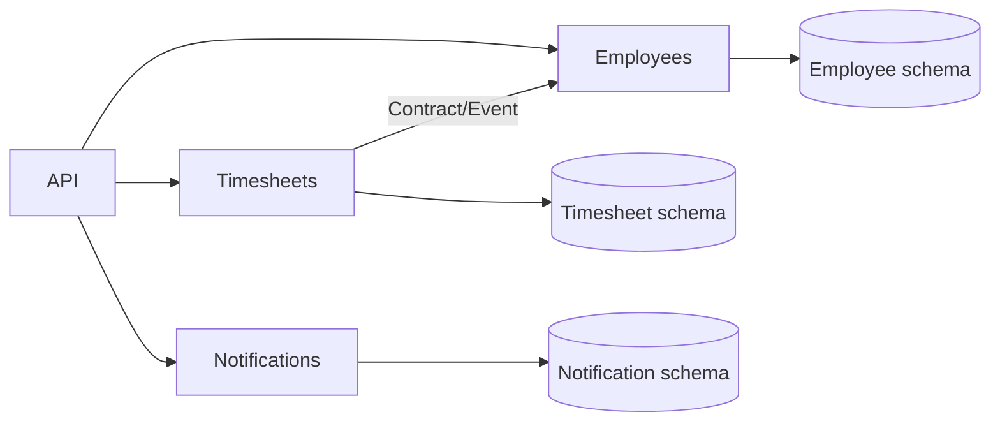
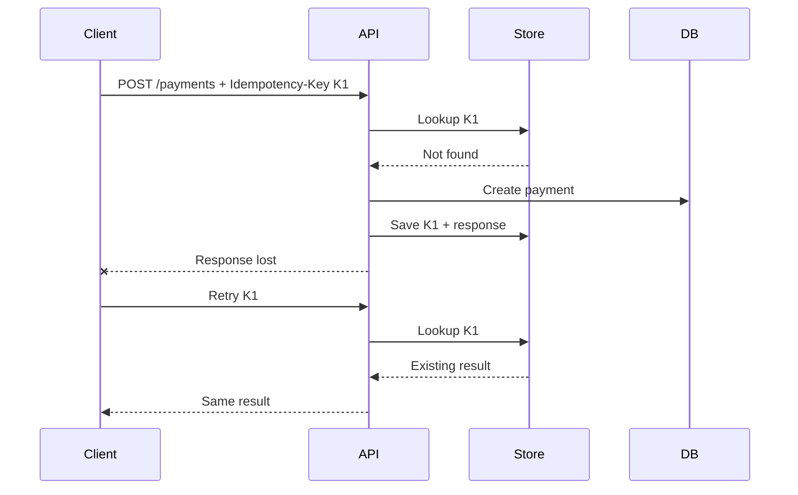
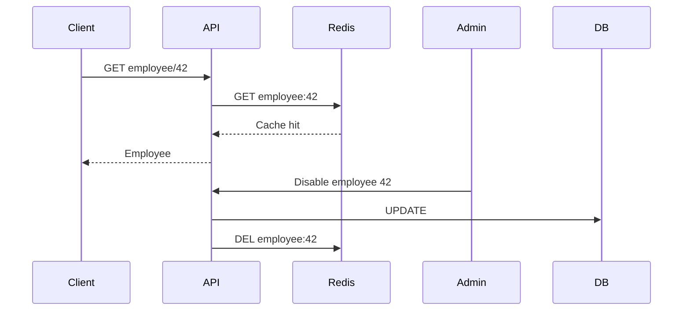
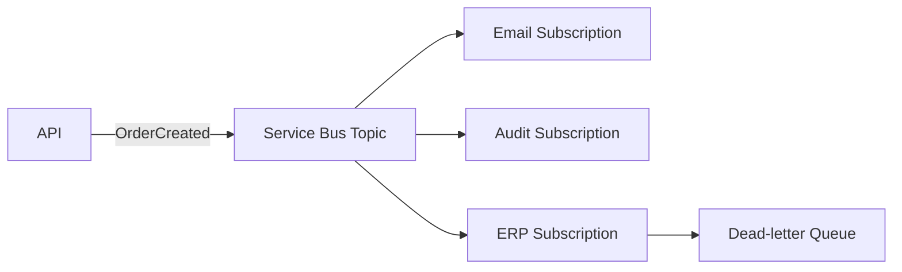
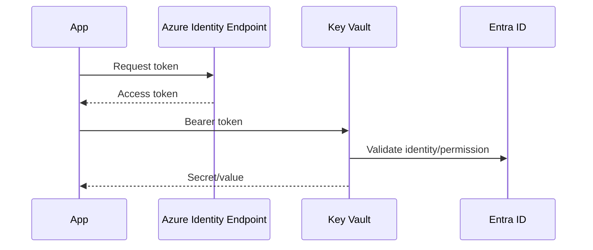
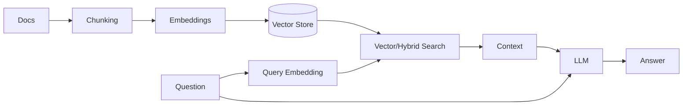
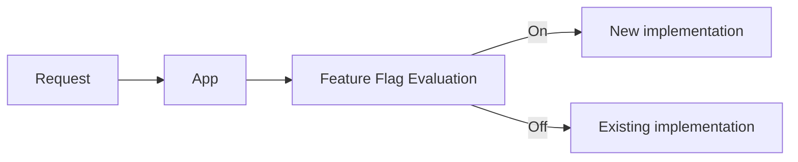

# Daily Knowledge Sharing — 2026-08-19

## Today’s Topics

1. Modular Monolith — chia boundary đúng trước khi nghĩ đến Microservices
2. Idempotency — chống xử lý trùng trong API và distributed systems
3. EF Core Optimistic Concurrency — bảo vệ dữ liệu khi nhiều request cùng cập nhật
4. Cache Invalidation — phần khó nhất của caching trong production
5. Azure Service Bus — tách producer/consumer bằng messaging đáng tin cậy
6. Managed Identity — loại bỏ secret khi service Azure gọi service Azure
7. OpenTelemetry & Distributed Tracing — lần theo một request xuyên nhiều thành phần
8. RAG — đưa knowledge riêng vào LLM mà không nhồi toàn bộ dữ liệu vào prompt
9. Circuit Breaker — ngăn dependency lỗi kéo sập cả hệ thống
10. Feature Flags — tách deployment khỏi release

---

# 1. Modular Monolith — chia boundary đúng trước khi nghĩ đến Microservices

### 1. What is it?

Modular Monolith vẫn là **một ứng dụng deployable**, nhưng code được chia thành các module có boundary rõ ràng theo business capability, ví dụ `Employees`, `Timesheets`, `Billing`, `Notifications`.

Điểm quan trọng không phải folder đẹp mà là **module ownership và dependency**. Module A không nên tùy tiện truy cập DbSet, entity hay internal service của module B. Giao tiếp nên đi qua contract rõ ràng.

### 2. Why does it exist?

Một monolith không có boundary thường dần trở thành “big ball of mud”: controller gọi repository bất kỳ, bảng bị dùng chéo, business rule nằm rải rác. Khi muốn tách service, không ai biết đâu là boundary thực sự.

Microservices giải quyết isolation tốt hơn nhưng mang thêm network failure, deployment, tracing, message consistency và operational cost. Modular Monolith giữ simplicity của một deployment trong khi ép team thiết kế boundary sớm.

### 3. How does it work?



Mỗi module thường có application/domain/infrastructure riêng. Có thể dùng cùng database server nhưng ownership của table/schema phải rõ.

### 4. Practical example

```csharp
public interface IEmployeeDirectory
{
    Task<EmployeeSummary?> GetAsync(Guid employeeId, CancellationToken ct);
}

internal sealed class EmployeeDirectory(EmployeeDbContext db)
    : IEmployeeDirectory
{
    public Task<EmployeeSummary?> GetAsync(Guid id, CancellationToken ct) =>
        db.Employees
          .Where(x => x.Id == id)
          .Select(x => new EmployeeSummary(x.Id, x.Name, x.IsActive))
          .SingleOrDefaultAsync(ct);
}
```

Timesheet module phụ thuộc vào contract `IEmployeeDirectory`, không lấy trực tiếp `EmployeeDbContext`.

### 5. Real production scenario

Trong hệ thống HR, request tạo timesheet đi vào Timesheet module. Module chỉ cần biết employee có active không. Nó gọi contract của Employee module thay vì query bảng `Employees`. Sau này nếu Employee được tách thành service, contract có thể đổi implementation mà business code Timesheet ít bị ảnh hưởng.

### 6. Common mistakes

- Chỉ chia folder nhưng mọi module vẫn truy cập database của nhau.
- Tạo shared project chứa gần như toàn bộ domain model.
- Dùng event cho mọi thứ dù synchronous call đơn giản hơn.
- Tách module theo technical layer (`Controllers`, `Repositories`) thay vì business capability.
- Thiết kế như microservices nhưng vẫn gánh complexity mà không có lợi ích deployment isolation.

### 7. Trade-offs

**Advantages:** deployment đơn giản, transaction local dễ, debugging thuận tiện, boundary tốt hơn monolith truyền thống.

**Costs / Risks:** isolation không mạnh bằng process riêng; developer vẫn có thể phá boundary nếu architecture test/code review không kiểm soát; scale thường theo toàn application thay vì từng module.

### 8. Junior → Middle → Senior understanding

**Junior:** hiểu module là business boundary, không chỉ là folder.

**Middle:** biết thiết kế contract, dependency direction và tránh cross-module database access.

**Senior / Technical Lead:** quyết định boundary, ownership dữ liệu, synchronous vs event communication và khi nào một module thực sự đáng tách thành microservice.

### 9. Key takeaway

- Tách boundary trước, tách process sau.
- Module phải sở hữu dữ liệu và contract của mình.
- Modular Monolith thường là điểm khởi đầu an toàn hơn Microservices.

---

# 2. Idempotency — chống xử lý trùng trong API và distributed systems

### 1. What is it?

Một operation idempotent có thể được gửi lại nhiều lần nhưng **business effect chỉ xảy ra một lần**. Đây là yêu cầu rất quan trọng với payment, order, webhook và background processing.

### 2. Why does it exist?

Network không đảm bảo client luôn biết request trước thành công hay thất bại. API có thể đã tạo payment nhưng response bị mất; client timeout rồi retry. Nếu server xử lý lần hai như request mới, người dùng có thể bị charge hai lần.

### 3. How does it work?



Idempotency key cần scope, expiration và atomicity phù hợp. Chỉ cache response mà không bảo vệ concurrent duplicate vẫn có race condition.

### 4. Practical example

```csharp
public sealed class IdempotencyRecord
{
    public required string Key { get; init; }
    public required string Operation { get; init; }
    public string? ResponseJson { get; set; }
}
```

Database nên có unique constraint:

```sql
CREATE UNIQUE INDEX UX_Idempotency_Operation_Key
ON IdempotencyRecords(Operation, [Key]);
```

Unique constraint mới là lớp bảo vệ cuối cùng trước concurrent requests.

### 5. Real production scenario

Mobile app gửi `POST /orders` trên mạng chập chờn. Request đầu tạo order nhưng client timeout. Lần retry dùng cùng key; server trả lại order cũ thay vì tạo order thứ hai.

### 6. Common mistakes

- Generate key ở server cho từng retry nên mất ý nghĩa.
- Không đặt unique constraint.
- Coi mọi `POST` là không thể idempotent.
- Giữ key vô hạn khiến storage phình to.
- Reuse cùng key cho payload khác mà không kiểm tra request fingerprint.

### 7. Trade-offs

**Advantages:** retry an toàn, giảm duplicate side effect, tăng reliability.

**Costs / Risks:** thêm storage, cleanup policy, concurrency handling và semantics phức tạp hơn.

### 8. Junior → Middle → Senior understanding

**Junior:** hiểu retry có thể tạo duplicate.

**Middle:** implement idempotency key, unique constraint và response replay.

**Senior / Technical Lead:** thiết kế scope/TTL, atomic transaction, behavior khi payload khác nhau và chiến lược idempotency xuyên nhiều service.

### 9. Key takeaway

- Retry và idempotency phải được thiết kế cùng nhau.
- Database uniqueness thường là safety net quan trọng.
- “Request chạy lại được” không đồng nghĩa “business effect chạy lại được”.

---

# 3. EF Core Optimistic Concurrency — tránh lost update

### 1. What is it?

Optimistic Concurrency giả định conflict không xảy ra thường xuyên, nên không lock record trong suốt thời gian người dùng chỉnh sửa. Khi update, hệ thống kiểm tra record có thay đổi kể từ lúc đọc hay không.

### 2. Why does it exist?

Hai admin cùng mở Employee A. Admin 1 đổi department, Admin 2 đổi title. Nếu cả hai update toàn entity mà không kiểm tra version, request đến sau có thể ghi đè thay đổi của request trước — **lost update**.

### 3. How does it work?

SQL Server `rowversion` thay đổi mỗi khi row được update. EF Core đưa version cũ vào `WHERE`.

```sql
UPDATE Employees
SET Title = @title
WHERE Id = @id AND RowVersion = @originalVersion;
```

Nếu affected rows = 0, EF Core phát hiện conflict và ném `DbUpdateConcurrencyException`.

### 4. Practical example

```csharp
public class Employee
{
    public Guid Id { get; set; }
    public string Title { get; set; } = "";

    [Timestamp]
    public byte[] RowVersion { get; set; } = [];
}
```

```csharp
try
{
    await db.SaveChangesAsync(ct);
}
catch (DbUpdateConcurrencyException)
{
    return Results.Conflict(new
    {
        message = "Employee was modified by another request. Reload and retry."
    });
}
```

### 5. Real production scenario

Portal HR gửi version hiện tại cùng command update. Nếu record đã được workflow khác thay đổi, API trả `409 Conflict`. UI reload dữ liệu và cho người dùng quyết định merge thay vì âm thầm overwrite.

### 6. Common mistakes

- Catch exception rồi retry update mù quáng, vẫn ghi đè dữ liệu mới.
- Không đưa concurrency token từ client trở lại API.
- Dùng pessimistic lock cho form người dùng mở nhiều phút.
- Update detached entity toàn bộ fields dù client chỉ sửa một field.

### 7. Trade-offs

**Advantages:** không giữ lock dài, scale tốt cho conflict hiếm.

**Costs / Risks:** application phải có conflict-resolution strategy; UX phức tạp hơn; conflict cao có thể gây nhiều retry.

### 8. Junior → Middle → Senior understanding

**Junior:** hiểu lost update và version checking.

**Middle:** cấu hình EF Core concurrency token và xử lý `409`.

**Senior / Technical Lead:** chọn optimistic/pessimistic strategy, thiết kế merge semantics và phân biệt technical retry với business conflict.

### 9. Key takeaway

- Concurrency conflict là business situation, không chỉ exception kỹ thuật.
- Không retry mù quáng `DbUpdateConcurrencyException`.
- Version token giúp phát hiện dữ liệu đã thay đổi sau khi đọc.

---

# 4. Cache Invalidation — giữ cache nhanh nhưng không sai

### 1. What is it?

Cache invalidation là chiến lược làm cho dữ liệu cache hết hiệu lực khi source of truth thay đổi. Cache nhanh nhưng stale data có thể nguy hiểm hơn database chậm.

### 2. Why does it exist?

TTL đơn thuần tạo cửa sổ inconsistency. Nếu employee bị disable nhưng cache quyền truy cập còn 30 phút, hệ thống có thể tiếp tục authorize sai.

### 3. How does it work?



Các strategy thường gặp: TTL, explicit eviction, versioned key, event-driven invalidation. Production thường kết hợp nhiều cơ chế thay vì tin vào một cơ chế duy nhất.

### 4. Practical example

```csharp
await db.SaveChangesAsync(ct);
await cache.RemoveAsync($"employee:{employee.Id}", ct);
```

Với distributed system, có thể publish `EmployeeChanged` để nhiều consumer xóa local/distributed cache tương ứng.

### 5. Real production scenario

Employee profile được đọc hàng nghìn lần nhưng cập nhật ít. Cache-aside giảm tải DB. Khi HR sửa employee, API commit DB trước rồi invalidate cache. Nếu invalidation thất bại, TTL ngắn đóng vai trò safety net.

### 6. Common mistakes

- Xóa cache trước DB commit; transaction rollback nhưng cache đã mất hoặc bị repopulate bằng dữ liệu cũ.
- TTL quá dài cho security-sensitive data.
- Không xử lý cache stampede khi key hot hết hạn.
- Cache entity EF trực tiếp thay vì DTO ổn định.
- Coi Redis outage là lý do để API ngừng hoàn toàn dù DB vẫn khỏe.

### 7. Trade-offs

**Advantages:** latency thấp, giảm DB load.

**Costs / Risks:** stale data, thêm failure mode, memory cost, invalidation complexity.

### 8. Junior → Middle → Senior understanding

**Junior:** hiểu hit, miss, TTL.

**Middle:** implement cache-aside, invalidation và fallback.

**Senior / Technical Lead:** xác định consistency requirement từng loại dữ liệu, chống stampede, thiết kế invalidation xuyên instance/service và behavior khi Redis unavailable.

### 9. Key takeaway

- Cache là bản sao; source of truth phải rõ.
- TTL là safety net, không phải lúc nào cũng là invalidation strategy đầy đủ.
- Không cache dữ liệu nhạy cảm với consistency mà chưa xác định stale-data tolerance.

---

# 5. Azure Service Bus — messaging đáng tin cậy giữa các thành phần

### 1. What is it?

Azure Service Bus là managed message broker hỗ trợ Queue và Topic/Subscription, phù hợp khi producer không cần consumer xử lý ngay trong cùng HTTP request.

### 2. Why does it exist?

Nếu API gọi trực tiếp email service, audit service và ERP, latency và availability bị phụ thuộc vào tất cả downstream. Một dependency chậm có thể kéo request chính timeout.

### 3. How does it work?



Message được broker giữ đến khi consumer complete. Failure có thể retry; vượt ngưỡng thì vào DLQ để điều tra/reprocess.

### 4. Practical example

```csharp
var client = new ServiceBusClient(namespaceFqdn, new DefaultAzureCredential());
var sender = client.CreateSender("employee-events");

await sender.SendMessageAsync(new ServiceBusMessage(
    BinaryData.FromObjectAsJson(new EmployeeDisabled(employeeId))), ct);
```

### 5. Real production scenario

Khi employee offboard, API commit trạng thái employee rồi phát event. Consumer A xử lý Exchange Online, consumer B revoke application access, consumer C gửi notification. Một consumer lỗi không cần rollback toàn request HR.

### 6. Common mistakes

- Nghĩ broker đảm bảo exactly-once business processing.
- Consumer không idempotent.
- Không monitor DLQ.
- Message chứa quá nhiều dữ liệu nhạy cảm.
- Giữ processing lock quá lâu hoặc không hiểu lock renewal.
- Publish event trước DB commit gây phantom event.

### 7. Trade-offs

**Advantages:** decoupling, buffering, retry, independent consumers.

**Costs / Risks:** eventual consistency, duplicate delivery, monitoring và debugging khó hơn synchronous call; thêm Azure cost.

### 8. Junior → Middle → Senior understanding

**Junior:** phân biệt Queue và Topic.

**Middle:** implement producer/consumer, retry, DLQ và idempotency.

**Senior / Technical Lead:** thiết kế delivery semantics, outbox, ordering/session, poison-message handling, capacity và operational ownership.

### 9. Key takeaway

- Broker giải coupling về thời gian, không tự giải business consistency.
- Consumer phải giả định message có thể đến lại.
- DLQ không phải thùng rác; phải có monitoring và recovery process.

---

# 6. Managed Identity — authentication service-to-service không cần secret

### 1. What is it?

Managed Identity cho phép Azure resource có identity trong Microsoft Entra ID và lấy token mà application không phải lưu client secret/certificate thủ công.

### 2. Why does it exist?

Secret trong config, pipeline hoặc environment có vòng đời, rotation và leak risk. Khi hàng chục service dùng secret riêng, vận hành trở nên khó kiểm soát.

### 3. How does it work?



Azure quản lý credential nền; application chỉ yêu cầu token cho target resource.

### 4. Practical example

```csharp
var credential = new DefaultAzureCredential();
var client = new SecretClient(
    new Uri("https://my-vault.vault.azure.net/"),
    credential);

var secret = await client.GetSecretAsync("ExternalApiKey");
```

Local dev có thể dùng Azure CLI/Visual Studio identity; production tự chuyển sang Managed Identity.

### 5. Real production scenario

App Service cần đọc Key Vault và ghi Blob Storage. Thay vì hai connection strings chứa secrets, identity của App Service được cấp RBAC đúng phạm vi.

### 6. Common mistakes

- Cấp quyền quá rộng như Owner/Contributor.
- Nhầm authentication với authorization: có identity không có nghĩa tự động có quyền.
- Hard-code credential fallback trong production.
- Không phân biệt system-assigned và user-assigned identity.
- Private Endpoint cấu hình sai rồi tưởng authentication lỗi.

### 7. Trade-offs

**Advantages:** giảm secret management, rotation tự động, RBAC/audit rõ.

**Costs / Risks:** phụ thuộc Azure identity infrastructure; local debugging khác production; IAM/network misconfiguration có thể khó chẩn đoán.

### 8. Junior → Middle → Senior understanding

**Junior:** hiểu identity thay thế credential tĩnh.

**Middle:** cấu hình RBAC và dùng `DefaultAzureCredential`.

**Senior / Technical Lead:** thiết kế least privilege, user/system-assigned strategy, network boundary, deployment bootstrap và incident recovery.

### 9. Key takeaway

- Trên Azure, ưu tiên identity hơn secret khi service hỗ trợ Entra authentication.
- Authentication và authorization là hai bước khác nhau.
- Least privilege vẫn bắt buộc dù không còn client secret.

---

# 7. OpenTelemetry & Distributed Tracing — lần theo request xuyên hệ thống

### 1. What is it?

OpenTelemetry là chuẩn/vendor-neutral để instrument traces, metrics và logs. Distributed trace biểu diễn hành trình của một request qua API, database, HTTP dependency, queue và worker bằng trace/span IDs.

### 2. Why does it exist?

Log riêng từng service trả lời “service này đã làm gì”, nhưng khó trả lời “request của user này chậm ở đâu xuyên 5 services?”. Correlation thủ công dễ thiếu hoặc không đồng nhất.

### 3. How does it work?

```text
Trace: checkout-abc
├─ API span                 820 ms
│  ├─ SQL span              35 ms
│  └─ Payment HTTP span    710 ms
└─ Publish message span     12 ms
```

Trace context được propagate qua HTTP headers hoặc message metadata. Backend như Application Insights/Jaeger/Tempo ghép spans thành một trace.

### 4. Practical example

```csharp
builder.Services.AddOpenTelemetry()
    .WithTracing(t => t
        .AddAspNetCoreInstrumentation()
        .AddHttpClientInstrumentation()
        .AddEntityFrameworkCoreInstrumentation()
        .AddOtlpExporter());
```

Custom span chỉ nên dùng cho operation có business/diagnostic value.

### 5. Real production scenario

P95 API tăng từ 400 ms lên 2.5 s. Trace cho thấy SQL chỉ 40 ms nhưng Microsoft Graph dependency mất 2 s. Team tập trung timeout/retry Graph thay vì tối ưu database sai chỗ.

### 6. Common mistakes

- Log mọi thứ nhưng không propagate trace context.
- Sampling quá thấp khiến incident hiếm không có trace.
- Gắn PII/token vào span attributes.
- Tạo quá nhiều high-cardinality attributes gây cost lớn.
- Instrument nhưng không có dashboard/alert/query thực tế.

### 7. Trade-offs

**Advantages:** root-cause nhanh, vendor-neutral instrumentation, correlation xuyên service.

**Costs / Risks:** telemetry volume/cost, sampling complexity, privacy và instrumentation overhead.

### 8. Junior → Middle → Senior understanding

**Junior:** hiểu trace, span và correlation ID.

**Middle:** instrument ASP.NET Core, HTTP, EF Core và đọc trace waterfall.

**Senior / Technical Lead:** thiết kế sampling, cardinality, retention, telemetry governance và SLO-driven observability.

### 9. Key takeaway

- Logs nói chuyện gì xảy ra; traces cho thấy nó xảy ra ở đâu trong request flow.
- Telemetry phải phục vụ câu hỏi vận hành cụ thể.
- Không đưa secrets/PII vào telemetry.

---

# 8. RAG — đưa knowledge riêng vào LLM có kiểm soát

### 1. What is it?

Retrieval-Augmented Generation (RAG) lấy tài liệu liên quan từ knowledge source rồi đưa các đoạn phù hợp vào context của LLM trước khi sinh câu trả lời.

### 2. Why does it exist?

Model không biết dữ liệu nội bộ mới nhất và không nên được nhồi toàn bộ wiki vào mỗi prompt. RAG giúp chọn một lượng context nhỏ, liên quan và có thể truy vết nguồn.

### 3. How does it work?



Production RAG thường dùng hybrid retrieval, metadata filters và reranking chứ không chỉ cosine similarity.

### 4. Practical example

```csharp
var results = await search.SearchAsync(
    query: "How do we reset expired forwarding?",
    topK: 5,
    filters: new() { ["department"] = "IT" },
    cancellationToken: ct);

var context = string.Join("\n\n", results.Select(x => x.Content));
var prompt = $"Answer only from the supplied context.\nContext:\n{context}";
```

Deterministic code vẫn phải kiểm soát authorization và source filtering trước khi context được gửi cho model.

### 5. Real production scenario

Internal support assistant tìm SOP, runbook và API docs. User chỉ được retrieve tài liệu thuộc tenant/role của họ. LLM tổng hợp câu trả lời và trả citations về document chunks.

### 6. Common mistakes

- Vector search không có authorization filter gây data leakage.
- Chunk quá lớn hoặc quá nhỏ.
- Dùng top-K cố định cho mọi query.
- Tin rằng RAG loại bỏ hallucination hoàn toàn.
- Không evaluate retrieval riêng với generation.
- Đưa retrieved content vào system-level authority, tạo prompt-injection risk.

### 7. Trade-offs

**Advantages:** knowledge cập nhật, citations, không cần fine-tune cho dữ liệu thay đổi thường xuyên.

**Costs / Risks:** indexing pipeline, retrieval quality, latency, token cost, permission model và prompt injection.

### 8. Junior → Middle → Senior understanding

**Junior:** hiểu retrieve → context → generate.

**Middle:** xây chunking, embeddings, vector/hybrid search và citations.

**Senior / Technical Lead:** thiết kế authorization, evaluation dataset, freshness, reranking, cost/latency budget và security boundary giữa untrusted content với model/tool layer.

### 9. Key takeaway

- RAG quality phụ thuộc retrieval ít nhất ngang generation.
- Authorization phải xảy ra trước khi tài liệu trở thành model context.
- Đo retrieval và answer quality riêng biệt.

---

# 9. Circuit Breaker — ngăn dependency lỗi tạo cascading failure

### 1. What is it?

Circuit Breaker tạm ngừng gọi một dependency đang lỗi liên tục. Nó có ba trạng thái phổ biến: Closed, Open và Half-Open.

### 2. Why does it exist?

Nếu downstream timeout 30 giây và upstream vẫn tiếp tục gửi hàng nghìn request, thread/socket/connection bị giữ, queue tăng và service khỏe ban đầu cũng có thể sập. Retry không kiểm soát còn làm dependency đang yếu chịu tải lớn hơn.

### 3. How does it work?

```text
Closed -- failures exceed threshold --> Open
Open   -- break duration elapsed ----> Half-Open
Half-Open -- probe succeeds ---------> Closed
Half-Open -- probe fails ------------> Open
```

Circuit breaker nên đi cùng timeout, retry có giới hạn và fallback phù hợp.

### 4. Practical example

```csharp
builder.Services.AddHttpClient<PartnerClient>()
    .AddStandardResilienceHandler(options =>
    {
        options.AttemptTimeout.Timeout = TimeSpan.FromSeconds(3);
        options.TotalRequestTimeout.Timeout = TimeSpan.FromSeconds(10);
    });
```

Trong production nên dùng .NET resilience pipeline/Polly và cấu hình circuit breaker dựa trên failure ratio/window phù hợp với dependency.

### 5. Real production scenario

Microsoft Graph gặp lỗi tạm thời. API chính vẫn phải phục vụ các chức năng không phụ thuộc Graph. Circuit mở để fail fast các operation Graph thay vì để toàn request pool bị giữ bởi timeout dài.

### 6. Common mistakes

- Retry trước mọi lỗi, kể cả `400` hoặc business validation.
- Timeout dài hơn SLA của API.
- Circuit breaker dùng chung cho dependency không liên quan.
- Fallback trả dữ liệu sai nhưng che giấu outage.
- Không expose breaker state/metrics cho monitoring.

### 7. Trade-offs

**Advantages:** fail fast, bảo vệ resource, giảm cascading failure, cho downstream thời gian phục hồi.

**Costs / Risks:** request có thể bị reject dù dependency vừa hồi phục; tuning sai threshold gây false open; behavior phức tạp hơn.

### 8. Junior → Middle → Senior understanding

**Junior:** hiểu timeout, retry và breaker khác nhau.

**Middle:** cấu hình resilience policy theo loại lỗi và dependency.

**Senior / Technical Lead:** xác định latency budget, retry amplification, bulkhead/circuit scope, fallback semantics và observability.

### 9. Key takeaway

- Retry làm tăng tải; circuit breaker chủ động giảm tải.
- Fail fast đôi khi đáng tin cậy hơn chờ timeout.
- Resilience phải thiết kế theo dependency và business semantics.

---

# 10. Feature Flags — tách deployment khỏi release

### 1. What is it?

Feature Flag cho phép code đã deploy nhưng feature có thể bật/tắt độc lập theo environment, user group, tenant hoặc percentage rollout.

### 2. Why does it exist?

Nếu deployment đồng nghĩa release, mỗi feature mới đều phải “all or nothing”. Khi bug xuất hiện, team có thể buộc rollback toàn build dù phần còn lại vẫn tốt.

### 3. How does it work?



Flag provider có thể là config, database hoặc managed configuration service. Evaluation cần nhanh và có safe default.

### 4. Practical example

```csharp
if (await featureManager.IsEnabledAsync("NewTimesheetApproval"))
{
    return await newFlow.ExecuteAsync(command, ct);
}

return await oldFlow.ExecuteAsync(command, ct);
```

Với rollout theo tenant, flag context phải chứa tenant/user attributes nhưng tránh đưa PII không cần thiết.

### 5. Real production scenario

Team deploy approval flow mới cho toàn production nhưng chỉ bật cho internal tenant. Sau khi metrics ổn định, rollout 10% → 50% → 100%. Nếu error rate tăng, tắt flag trong vài giây mà không cần redeploy.

### 6. Common mistakes

- Không xóa flag sau khi rollout hoàn tất → technical debt.
- Dùng flag như authorization mechanism.
- Flag lồng nhau tạo số lượng execution paths bùng nổ.
- Không test cả On và Off.
- Default behavior khi flag provider unavailable không rõ ràng.

### 7. Trade-offs

**Advantages:** giảm release risk, progressive rollout, kill switch nhanh.

**Costs / Risks:** code branching, test matrix lớn, stale flags và config dependency.

### 8. Junior → Middle → Senior understanding

**Junior:** hiểu deployment khác release.

**Middle:** implement flag, test hai nhánh và cleanup sau rollout.

**Senior / Technical Lead:** định nghĩa flag lifecycle, ownership, safe defaults, rollout metrics, kill-switch policy và governance để tránh flag debt.

### 9. Key takeaway

- Feature flag là công cụ release control, không phải permission system.
- Mỗi flag cần owner và ngày cleanup.
- Progressive rollout chỉ có giá trị khi đi kèm metrics và rollback criteria.