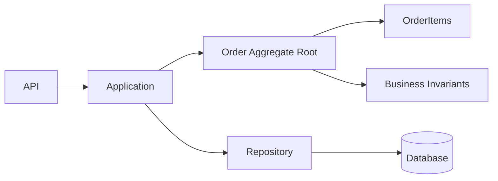
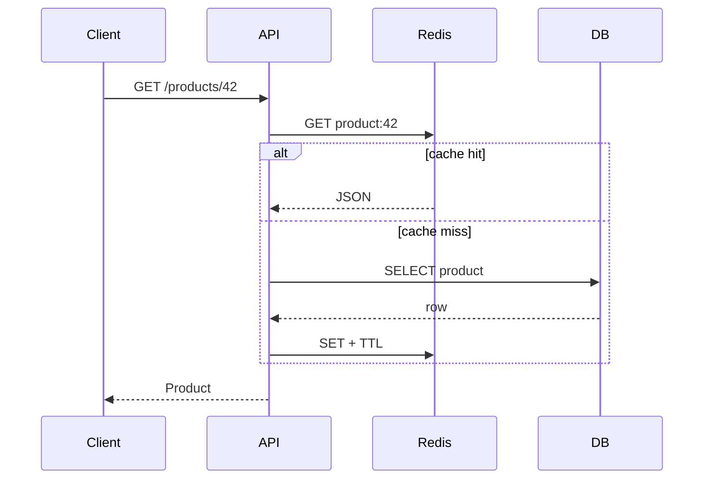
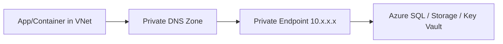
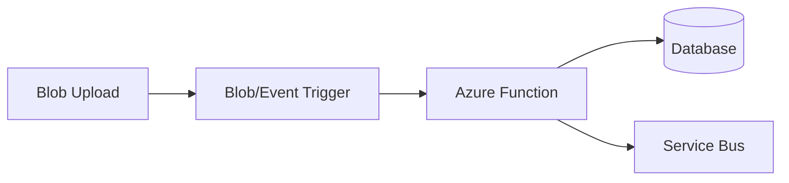
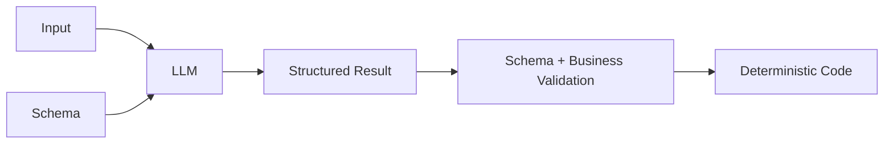
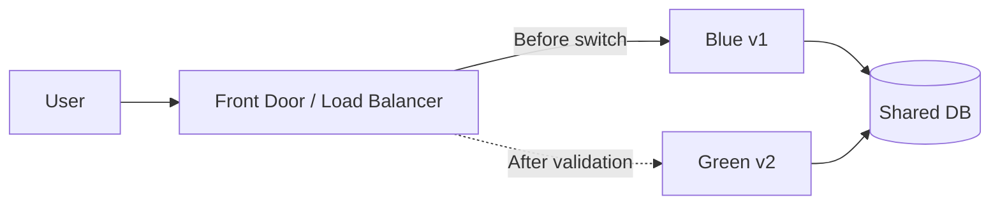

# Daily Knowledge Sharing — 2026-08-19

## Today’s Topics

1. Domain-Driven Design Aggregate — đặt transaction boundary theo business invariant
2. API Versioning — tiến hóa contract mà không phá client đang chạy
3. SQL Isolation Levels — cân bằng consistency, locking và throughput
4. Redis Cache-Aside — tăng tốc read path nhưng vẫn thiết kế được failure mode
5. Azure Private Endpoint — đưa PaaS access vào private network boundary
6. Azure Functions — event-driven compute và cách chọn đúng workload
7. SLI, SLO, SLA — biến “hệ thống ổn” thành mục tiêu đo được
8. Structured Output cho LLM — biến AI response thành contract có thể kiểm soát
9. Retry với Exponential Backoff + Jitter — phục hồi transient failure mà không tạo retry storm
10. Blue-Green Deployment — giảm rủi ro release bằng hai production environment

---

# 1. Domain-Driven Design Aggregate — đặt transaction boundary theo business invariant

### 1. What is it?

Trong DDD, Aggregate là một cụm entity/value object được xem như **một consistency boundary**. Bên ngoài chỉ thay đổi aggregate thông qua **Aggregate Root**. Ví dụ `Order` là root, còn `OrderItem` thuộc aggregate; code bên ngoài không nên sửa `OrderItem` độc lập rồi bỏ qua rule của `Order`.

Aggregate không phải “gom tất cả bảng liên quan vào một object graph”. Nó trả lời câu hỏi quan trọng hơn: **những dữ liệu nào bắt buộc phải nhất quán trong cùng một transaction?**

### 2. Why does it exist?

Nếu business rule nằm rải ở controller, service và repository, rất dễ tạo trạng thái không hợp lệ. Ví dụ đơn hàng đã `Paid` nhưng một request khác vẫn xóa item. Aggregate gom invariant về một nơi để mọi mutation đi qua rule chung.

### 3. How does it work?



Application load `Order`, gọi behavior như `AddItem()` hoặc `Confirm()`, aggregate tự kiểm tra invariant, sau đó repository persist toàn aggregate trong một transaction.

### 4. Practical example

```csharp
public sealed class Order
{
    private readonly List<OrderItem> _items = [];
    public IReadOnlyCollection<OrderItem> Items => _items;
    public OrderStatus Status { get; private set; }

    public void AddItem(Guid productId, int quantity)
    {
        if (Status != OrderStatus.Draft)
            throw new InvalidOperationException("Only draft orders can be changed.");
        if (quantity <= 0) throw new ArgumentOutOfRangeException(nameof(quantity));
        _items.Add(new OrderItem(productId, quantity));
    }
}
```

Rule nằm trong domain thay vì yêu cầu mọi controller nhớ kiểm tra `Status`.

### 5. Real production scenario

Trong hệ thống timesheet, `Timesheet` có các `TimesheetEntry`. Khi submit, tổng giờ, trạng thái approval và entry phải tuân thủ invariant. Nếu entry được sửa trực tiếp sau submit, dữ liệu approval trở nên vô nghĩa. Aggregate boundary ngăn mutation sai đường.

### 6. Common mistakes

- Aggregate quá lớn, load hàng nghìn child rows cho mỗi command.
- Dùng aggregate như DTO chứa toàn bộ quan hệ database.
- Cho repository riêng cho mọi child entity.
- Đặt rule quan trọng ở controller thay vì domain.
- Cố đảm bảo strong consistency giữa nhiều aggregate bằng một transaction khổng lồ.

### 7. Trade-offs

**Advantages:** invariant tập trung, transaction boundary rõ, domain dễ reasoning và test.

**Costs / Risks:** aggregate lớn gây contention/performance kém; aggregate nhỏ hơn thường cần eventual consistency giữa các boundary.

### 8. Junior → Middle → Senior understanding

**Junior:** hiểu Aggregate Root là cổng mutation và business rule phải bảo vệ state.

**Middle:** thiết kế repository/EF Core mapping mà không làm rò internal entity; test invariant và concurrency.

**Senior / Technical Lead:** chọn boundary dựa trên consistency requirement, contention và business ownership; biết khi nào dùng domain event để đồng bộ aggregate khác.

### 9. Key takeaway

- Aggregate là consistency boundary, không phải folder pattern.
- Một transaction thường nên thay đổi một aggregate.
- Boundary tốt xuất phát từ business invariant.

---

# 2. API Versioning — tiến hóa contract mà không phá client đang chạy

### 1. What is it?

API Versioning là chiến lược cho phép contract API thay đổi trong khi client cũ vẫn tiếp tục hoạt động. Version có thể nằm trong URL (`/api/v2/orders`), header hoặc media type.

### 2. Why does it exist?

API là contract. Đổi tên field, thay semantics hoặc xóa property có thể khiến mobile app, partner integration hoặc frontend cũ lỗi ngay. Deploy server và client thường không đồng thời nên “chỉ sửa cả hai” không đủ trong production.

### 3. How does it work?

```text
Mobile v1 ──> /api/v1/orders ──> V1 contract
Web v2    ──> /api/v2/orders ──> V2 contract
                              └─> Shared application/domain logic
```

Không phải mọi thay đổi đều cần version mới. Thêm optional field thường backward-compatible; đổi meaning hoặc remove field thường là breaking change.

### 4. Practical example

```csharp
[ApiController]
[Route("api/v1/orders")]
public class OrdersV1Controller : ControllerBase { }

[ApiController]
[Route("api/v2/orders")]
public class OrdersV2Controller : ControllerBase { }
```

Nên giữ versioning ở contract/presentation; tránh clone toàn bộ business logic cho mỗi version.

### 5. Real production scenario

Mobile app v1 dùng `customerName`; phiên bản mới muốn object `customer`. Backend giữ v1 adapter, v2 trả model mới, cả hai gọi cùng use case. Khi adoption v1 xuống ngưỡng cho phép, team deprecate có telemetry và deadline rõ.

### 6. Common mistakes

- Version mới cho mọi thay đổi nhỏ.
- Copy-paste toàn controller/service/domain thành V2.
- Không đo traffic version cũ nên không biết khi nào xóa.
- Breaking change âm thầm mà vẫn giữ version number.
- Không có deprecation policy.

### 7. Trade-offs

**Advantages:** backward compatibility và rollout độc lập.

**Costs / Risks:** nhiều contract phải test/support; mapping tăng; version tồn tại quá lâu tạo maintenance debt.

### 8. Junior → Middle → Senior understanding

**Junior:** phân biệt breaking và non-breaking change.

**Middle:** triển khai versioned DTO/controller, contract test và deprecation headers.

**Senior / Technical Lead:** thiết kế compatibility policy, migration window, telemetry và ownership với consumer bên ngoài.

### 9. Key takeaway

- Version API vì contract thay đổi, không phải vì code refactor.
- Tách versioned contract khỏi core business logic.
- Deprecation phải đo được và có kế hoạch kết thúc.

---

# 3. SQL Isolation Levels — cân bằng consistency, locking và throughput

### 1. What is it?

Isolation level quyết định transaction nhìn thấy thay đổi của transaction khác như thế nào. Nó kiểm soát các anomaly như dirty read, non-repeatable read và phantom read.

### 2. Why does it exist?

Nếu serialize mọi transaction tuyệt đối, consistency cao nhưng concurrency giảm. Nếu cho mọi transaction đọc tự do, throughput tốt hơn nhưng có thể đọc state không ổn định. Database cần nhiều mức isolation để chọn theo workload.

### 3. How does it work?

Ví dụ hai transaction cùng xử lý inventory:

```text
T1: read stock = 1
T2: read stock = 1
T1: update stock = 0
T2: update stock = 0  <-- business conflict nếu không kiểm soát
```

SQL Server có locking isolation và row-versioning như `READ_COMMITTED_SNAPSHOT`; PostgreSQL dùng MVCC mạnh. Isolation không tự động giải quyết mọi lost update; application vẫn có thể cần optimistic concurrency.

### 4. Practical example

```csharp
await using var tx = await db.Database.BeginTransactionAsync(
    System.Data.IsolationLevel.Serializable);

var account = await db.Accounts.SingleAsync(x => x.Id == accountId);
if (account.Balance < amount) throw new InvalidOperationException();
account.Balance -= amount;
await db.SaveChangesAsync();
await tx.CommitAsync();
```

`Serializable` phù hợp cho critical invariant nhưng không nên mặc định cho mọi endpoint.

### 5. Real production scenario

Trong booking, hai người cùng giữ ghế cuối. Nếu logic `SELECT available` rồi `UPDATE` không có concurrency strategy, cả hai có thể tin rằng mình thành công. Có thể dùng unique constraint, atomic update, row version hoặc isolation cao tùy model.

### 6. Common mistakes

- Dùng `NOLOCK` để “fix performance” rồi chấp nhận dirty/inconsistent reads mà không hiểu hậu quả.
- Transaction mở xuyên network call.
- Chọn `Serializable` toàn hệ thống.
- Nghĩ transaction level cao thay thế unique constraint.
- Không retry transaction bị deadlock/serialization failure đúng cách.

### 7. Trade-offs

**Advantages:** isolation cao giúp reasoning consistency dễ hơn.

**Costs / Risks:** lock lâu, blocking, deadlock hoặc serialization retry; isolation thấp tăng concurrency nhưng application phải chấp nhận/giải quyết anomaly.

### 8. Junior → Middle → Senior understanding

**Junior:** hiểu transaction không chỉ là commit/rollback mà còn có isolation.

**Middle:** đọc execution/locking behavior, xử lý concurrency exception và giữ transaction ngắn.

**Senior / Technical Lead:** chọn isolation theo invariant, workload, engine và latency SLO thay vì theo thói quen.

### 9. Key takeaway

- Isolation là trade-off consistency vs concurrency.
- Transaction càng ngắn càng tốt.
- Constraint và concurrency control vẫn quan trọng dù isolation cao.

---

# 4. Redis Cache-Aside — tăng tốc read path nhưng vẫn thiết kế được failure mode

### 1. What is it?

Cache-Aside là pattern application tự kiểm tra cache trước; miss thì đọc database rồi ghi kết quả vào cache. Redis thường đóng vai trò distributed cache cho nhiều API instance.

### 2. Why does it exist?

Một dữ liệu đọc lặp lại hàng nghìn lần nhưng thay đổi ít không nên luôn đánh database. Cache giảm latency và database load, nhưng tạo thêm bài toán stale data, invalidation và dependency failure.

### 3. How does it work?



### 4. Practical example

```csharp
var key = $"product:{id}";
var cached = await cache.GetStringAsync(key, ct);
if (cached is not null)
    return JsonSerializer.Deserialize<ProductDto>(cached)!;

var product = await db.Products.AsNoTracking()
    .Where(x => x.Id == id)
    .Select(x => new ProductDto(x.Id, x.Name, x.Price))
    .SingleAsync(ct);

await cache.SetStringAsync(key, JsonSerializer.Serialize(product),
    new DistributedCacheEntryOptions { AbsoluteExpirationRelativeToNow = TimeSpan.FromMinutes(5) }, ct);
return product;
```

### 5. Real production scenario

Catalog e-commerce có 50 API instances. Local memory cache tạo 50 bản khác nhau; Redis cho shared cache. Khi giá thay đổi, command update DB rồi invalidate `product:{id}`. Nếu Redis down, API nên cân nhắc fallback DB với protection để tránh database stampede.

### 6. Common mistakes

- TTL vô hạn.
- Cache dữ liệu permission-sensitive bằng key thiếu user/tenant dimension.
- Redis lỗi thì endpoint lỗi dù database vẫn khỏe.
- Cache miss đồng loạt làm DB quá tải.
- Serialize object graph lớn và tốn CPU/network hơn query gốc.

### 7. Trade-offs

**Advantages:** latency thấp, giảm DB load, scale read tốt.

**Costs / Risks:** stale data, invalidation complexity, thêm network dependency và memory cost.

### 8. Junior → Middle → Senior understanding

**Junior:** hiểu hit, miss, TTL.

**Middle:** thiết kế key, serialization, invalidation, fallback và metrics hit ratio.

**Senior / Technical Lead:** quyết định data nào đáng cache, acceptable staleness, stampede protection và behavior khi Redis outage.

### 9. Key takeaway

- Cache là optimization, database vẫn là source of truth trong cache-aside.
- TTL và invalidation là phần của correctness.
- Luôn thiết kế cache failure path.

---

# 5. Azure Private Endpoint — đưa PaaS access vào private network boundary

### 1. What is it?

Azure Private Endpoint tạo một private IP trong Virtual Network để truy cập PaaS resource như Storage, SQL, Key Vault qua Azure Private Link thay vì public endpoint.

### 2. Why does it exist?

Firewall public-IP allowlist vẫn để service có public network surface. Với workload nhạy cảm, yêu cầu thường là traffic backend→database/storage không đi qua public endpoint và chỉ workload trong network được phép resolve/connect.

### 3. How does it work?



DNS là phần cực kỳ quan trọng: hostname public của service phải resolve thành private IP từ network phù hợp.

### 4. Practical example

Một ASP.NET Core app trong VNet gọi Azure SQL bằng connection string hostname bình thường. Private DNS zone map hostname sang private endpoint; application code không cần hard-code IP.

```csharp
builder.Services.AddDbContext<AppDbContext>(o =>
    o.UseSqlServer(builder.Configuration.GetConnectionString("Sql")));
```

Network security nằm ngoài code.

### 5. Real production scenario

Employee system lưu tài liệu HR trong Blob Storage. Public network access của storage bị disable; App Service VNet Integration đi tới Storage Private Endpoint. Managed Identity xử lý identity, Private Endpoint xử lý network path: hai lớp giải quyết hai vấn đề khác nhau.

### 6. Common mistakes

- Tạo Private Endpoint nhưng quên Private DNS.
- Nghĩ Private Endpoint thay thế authorization.
- Disable public access trước khi xác nhận build agent/ops path.
- Không thiết kế connectivity cho on-prem/VPN.
- Dùng quá nhiều endpoint mà không tính DNS/network operational cost.

### 7. Trade-offs

**Advantages:** giảm public attack surface, network isolation rõ.

**Costs / Risks:** DNS phức tạp, debugging khó hơn, chi phí endpoint/network và dependency vào VNet design.

### 8. Junior → Middle → Senior understanding

**Junior:** phân biệt network access với identity/permission.

**Middle:** hiểu VNet integration, private DNS và cách troubleshoot name resolution/connectivity.

**Senior / Technical Lead:** thiết kế hub-spoke, hybrid connectivity, failover DNS, security boundary và cost.

### 9. Key takeaway

- Private Endpoint là private network path, không phải authentication.
- DNS là một phần cốt lõi của thiết kế.
- Kết hợp Managed Identity + Private Endpoint cho defense in depth.

---

# 6. Azure Functions — event-driven compute và cách chọn đúng workload

### 1. What is it?

Azure Functions chạy code theo trigger như HTTP, timer, Service Bus hoặc Blob event. Nó phù hợp với event-driven workload và background processing có execution boundary rõ.

### 2. Why does it exist?

Nhiều tác vụ không cần một web server chạy liên tục: xử lý file upload, consume queue, scheduled cleanup. Function giảm boilerplate hosting và có thể scale theo event load.

### 3. How does it work?



Runtime quản lý trigger polling/binding và instance scaling. Nhưng “serverless” không có nghĩa không có resource limit, cold start hay concurrency behavior.

### 4. Practical example

```csharp
public class ProcessInvoice
{
    [Function("ProcessInvoice")]
    public async Task Run(
        [ServiceBusTrigger("invoices", Connection = "ServiceBus")] string message)
    {
        await processor.ProcessAsync(message);
    }
}
```

Business logic nên nằm trong service testable thay vì nhồi vào function entry point.

### 5. Real production scenario

Microsoft 365 integration nhận request tạo hàng nghìn calendar operations. API validate và enqueue; Function consume queue theo concurrency giới hạn để tránh Graph throttling. Failed message cuối cùng đi dead-letter queue để điều tra.

### 6. Common mistakes

- Chạy task rất dài mà không hiểu hosting timeout/plan.
- Không idempotent khi message có thể redeliver.
- Scale consumer quá nhanh làm downstream bị throttle.
- Không xử lý poison/dead-letter message.
- Đưa toàn business logic vào trigger method.

### 7. Trade-offs

**Advantages:** event integration tốt, scale linh hoạt, ít hosting boilerplate.

**Costs / Risks:** cold start/scale behavior, debugging distributed flow, plan-specific limits và cost khó đoán với burst workload.

### 8. Junior → Middle → Senior understanding

**Junior:** hiểu trigger và function execution.

**Middle:** xử lý retries, idempotency, DI, configuration, dead-letter và observability.

**Senior / Technical Lead:** chọn Functions vs App Service/Container Apps/Worker dựa trên workload duration, scale, networking, cost và operational model.

### 9. Key takeaway

- Functions phù hợp event-driven workload, không phải mặc định cho mọi backend.
- Consumer phải idempotent.
- Scale của bạn phải tôn trọng capacity của downstream.

---

# 7. SLI, SLO, SLA — biến “hệ thống ổn” thành mục tiêu đo được

### 1. What is it?

**SLI** là chỉ số đo reliability, ví dụ tỷ lệ request thành công hoặc p95 latency. **SLO** là mục tiêu nội bộ cho SLI, ví dụ 99.9% successful requests trong 30 ngày. **SLA** là cam kết với khách hàng, thường kèm hậu quả thương mại.

### 2. Why does it exist?

Nếu team chỉ nói “API phải nhanh và ổn”, không ai biết mức nào đủ tốt. Reliability tuyệt đối cũng quá đắt. SLO giúp cân bằng feature velocity và reliability bằng con số cụ thể.

### 3. How does it work?

```text
Telemetry -> SLI -> compare with SLO -> Error Budget -> Engineering decision
```

SLO 99.9% availability cho phép error budget khoảng 0.1%. Khi burn rate tăng mạnh, team ưu tiên reliability thay vì tiếp tục release rủi ro.

### 4. Practical example

Một API có SLI:

```text
good requests = HTTP 2xx/3xx completed < 500ms
valid requests = all requests excluding client-cancelled traffic
SLI = good / valid
SLO = 99.5% over rolling 30 days
```

Application Insights/Azure Monitor có thể tạo query và alert theo burn rate.

### 5. Real production scenario

Timesheet API thỉnh thoảng timeout vào cuối tháng. Average latency vẫn đẹp nhưng p99 tăng mạnh. SLI theo percentile và successful-request ratio phản ánh trải nghiệm thực tốt hơn average CPU hoặc “server up”.

### 6. Common mistakes

- SLA = SLO = 100%.
- Chọn metric hạ tầng không phản ánh user experience.
- Alert mọi spike nhỏ thay vì error-budget burn.
- Không định nghĩa denominator/exclusion rõ.
- Có dashboard nhưng không dùng SLO để ra quyết định.

### 7. Trade-offs

**Advantages:** reliability có ngôn ngữ chung, alert có ý nghĩa, hỗ trợ ưu tiên engineering.

**Costs / Risks:** cần telemetry chuẩn và governance; SLO sai có thể tối ưu nhầm thứ.

### 8. Junior → Middle → Senior understanding

**Junior:** phân biệt metric và mục tiêu.

**Middle:** instrument endpoint, tạo dashboard và alert theo SLI.

**Senior / Technical Lead:** chọn user-centric SLO, error budget policy và trade-off giữa reliability/cost/delivery speed.

### 9. Key takeaway

- SLI đo; SLO đặt mục tiêu; SLA cam kết.
- SLO nên phản ánh trải nghiệm người dùng.
- Error budget biến reliability thành decision framework.

---

# 8. Structured Output cho LLM — biến AI response thành contract có thể kiểm soát

### 1. What is it?

Structured Output yêu cầu LLM trả dữ liệu theo schema xác định thay vì prose tự do, ví dụ object có `category`, `confidence`, `reason`. Mục tiêu là để deterministic code có thể parse, validate và quyết định bước tiếp theo.

### 2. Why does it exist?

Parsing câu chữ kiểu “hãy trả JSON” bằng regex rất mong manh. LLM có thể thêm markdown, đổi field hoặc trả type sai. Production integration cần contract giống API hơn là text tùy hứng.

### 3. How does it work?



Schema validation chỉ đảm bảo **shape**, không đảm bảo factual correctness. Business code vẫn phải kiểm tra giá trị và authorization.

### 4. Practical example

```csharp
public sealed record TicketClassification(
    string Category,
    double Confidence,
    string Reason);

var result = JsonSerializer.Deserialize<TicketClassification>(json)
             ?? throw new InvalidOperationException("Invalid model output");

if (result.Confidence < 0.8)
    return EscalateToHuman();
```

Trong API hiện đại nên dùng native structured-output/schema capability của provider thay vì chỉ prompt “return JSON”.

### 5. Real production scenario

AI phân loại support ticket thành `Billing`, `Technical`, `Account`. Model đề xuất category; deterministic code kiểm tra category nằm trong allow-list và confidence threshold. AI **không tự gọi thao tác hoàn tiền** chỉ vì output nói `Refund=true`.

### 6. Common mistakes

- Tin schema-valid nghĩa là nội dung đúng.
- Cho model quyết định authorization.
- Không version schema.
- Retry vô hạn khi validation fail.
- Log toàn prompt/output chứa PII.

### 7. Trade-offs

**Advantages:** parse ổn định, dễ test, dễ orchestration và telemetry.

**Costs / Risks:** schema quá cứng giảm flexibility; model vẫn có semantic errors; cần validation và fallback.

### 8. Junior → Middle → Senior understanding

**Junior:** hiểu AI output phải được coi là untrusted input.

**Middle:** implement schema, validation, retry/fallback và typed mapping.

**Senior / Technical Lead:** xác định boundary AI-vs-deterministic code, schema evolution, evaluation, security và cost/latency policy.

### 9. Key takeaway

- Structured output tạo contract, không tạo truth.
- Validate cả schema lẫn business semantics.
- Authorization và irreversible actions phải do deterministic control bảo vệ.

---

# 9. Retry với Exponential Backoff + Jitter — phục hồi transient failure mà không tạo retry storm

### 1. What is it?

Retry xử lý lỗi tạm thời bằng cách thử lại. Exponential backoff tăng thời gian chờ qua mỗi lần; jitter thêm ngẫu nhiên để nhiều client không retry cùng lúc.

### 2. Why does it exist?

Network timeout, HTTP 429 hoặc 503 có thể tự phục hồi. Nhưng retry ngay lập tức từ hàng nghìn request làm dependency đang yếu bị đánh mạnh hơn — retry storm.

### 3. How does it work?

```text
Attempt 1 -> fail
wait ~1s + jitter
Attempt 2 -> fail
wait ~2s + jitter
Attempt 3 -> fail
wait ~4s + jitter
Stop / fallback / DLQ
```

Retry chỉ phù hợp transient errors và operation idempotent hoặc có idempotency protection.

### 4. Practical example

```csharp
builder.Services.AddHttpClient<PartnerClient>()
    .AddStandardResilienceHandler(options =>
    {
        options.Retry.MaxRetryAttempts = 3;
        options.Retry.UseJitter = true;
        options.AttemptTimeout.Timeout = TimeSpan.FromSeconds(5);
    });
```

Policy cụ thể phải theo semantics của downstream và `Retry-After` khi service cung cấp.

### 5. Real production scenario

Microsoft Graph trả `429 Too Many Requests`. Client đọc `Retry-After`, trì hoãn và retry có giới hạn. Nếu hàng nghìn job cùng bị throttle, concurrency limiter + queue thường quan trọng hơn việc tăng số retry.

### 6. Common mistakes

- Retry HTTP 400/401 như transient error.
- Retry POST tạo payment mà không idempotency key.
- Retry ở nhiều layer: SDK 3 lần × service 3 lần × job 3 lần tạo 27 attempts.
- Timeout mỗi attempt quá dài khiến total latency vượt request budget.
- Không có jitter.

### 7. Trade-offs

**Advantages:** tăng reliability trước lỗi ngắn hạn.

**Costs / Risks:** tăng latency/load; che giấu dependency outage; duplicate side effects nếu operation không idempotent.

### 8. Junior → Middle → Senior understanding

**Junior:** biết không phải exception nào cũng retry.

**Middle:** phân loại transient error, cấu hình timeout/backoff/jitter và telemetry.

**Senior / Technical Lead:** thiết kế retry budget xuyên các layer, idempotency, circuit breaker, queue và downstream capacity.

### 9. Key takeaway

- Retry là load multiplier.
- Backoff + jitter giúp tránh synchronized retries.
- Retry phải đi cùng timeout, idempotency và stop condition.

---

# 10. Blue-Green Deployment — giảm rủi ro release bằng hai production environment

### 1. What is it?

Blue-Green Deployment duy trì hai environment tương đương: một đang phục vụ traffic (Blue), một chứa version mới (Green). Sau khi verify Green, traffic được switch sang Green; Blue có thể giữ lại để rollback nhanh.

### 2. Why does it exist?

In-place deployment thay binary ngay trên production khiến rollback chậm và có thể tạo mixed state. Blue-Green tách **deployment** khỏi **traffic switch**, cho phép test version mới trước khi user dùng.

### 3. How does it work?



Database là điểm khó: nếu v2 migration phá compatibility, rollback application sang v1 vẫn có thể thất bại. Vì vậy schema change nên theo expand-and-contract.

### 4. Practical example

Với Azure App Service Deployment Slots, production slot chạy v1, staging slot chạy v2. Team warm up, health-check staging rồi swap slot. Configuration nào là slot-specific phải được đánh dấu đúng.

```text
Deploy v2 -> staging
Run smoke tests
Warm caches
Check health/metrics
Swap staging <-> production
Observe
Rollback swap nếu cần
```

### 5. Real production scenario

SaaS release billing API mới. Green được deploy và chạy synthetic tests. Sau swap, error rate tăng từ 0.1% lên 4%; team swap lại Blue trong vài phút. Nếu migration trước đó đã drop cột v1 cần, rollback sẽ không cứu được — đây là lý do database compatibility phải nằm trong release design.

### 6. Common mistakes

- Nghĩ rollback app đồng nghĩa rollback database.
- Hai environment dùng config/secret khác nhau ngoài ý muốn.
- Không warm up Green nên switch xong latency spike.
- Background worker ở cả Blue và Green cùng xử lý job.
- Không có automated health gate.

### 7. Trade-offs

**Advantages:** downtime thấp, rollback nhanh, test gần production.

**Costs / Risks:** cần capacity cho hai environment; stateful component/database phức tạp; traffic switch không giải quyết data migration.

### 8. Junior → Middle → Senior understanding

**Junior:** hiểu deploy version mới trước rồi mới chuyển traffic.

**Middle:** triển khai health check, slot config, smoke test và rollback procedure.

**Senior / Technical Lead:** thiết kế backward-compatible DB migration, background processing ownership, capacity/cost và automated release gates.

### 9. Key takeaway

- Blue-Green giảm application deployment risk, không tự giải quyết database risk.
- Database migration nên backward-compatible.
- Rollback phải được thiết kế và diễn tập trước incident.