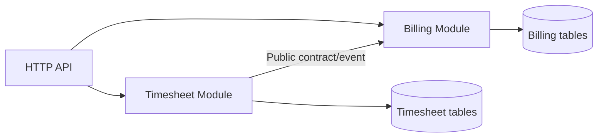
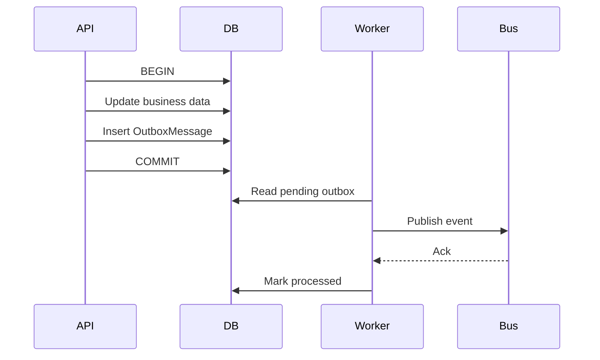
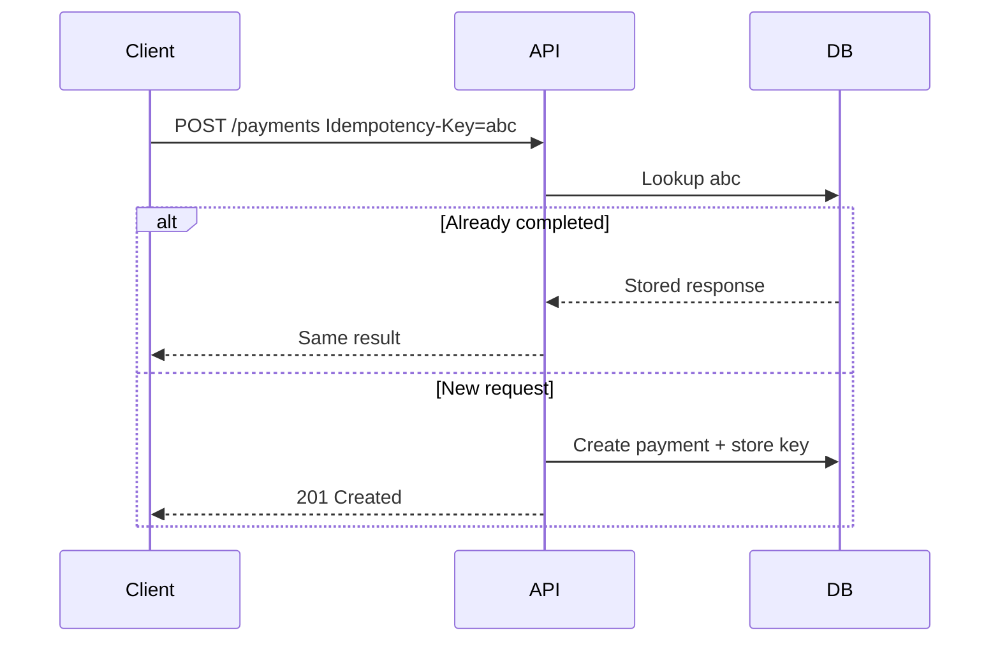
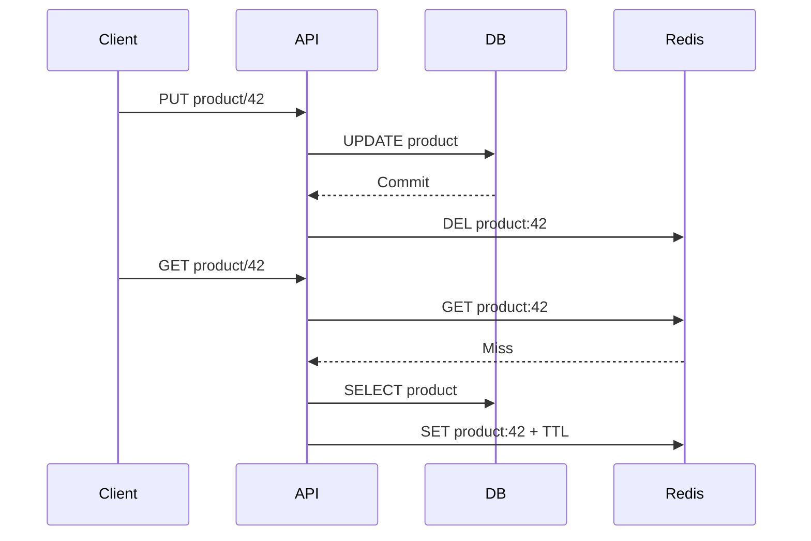
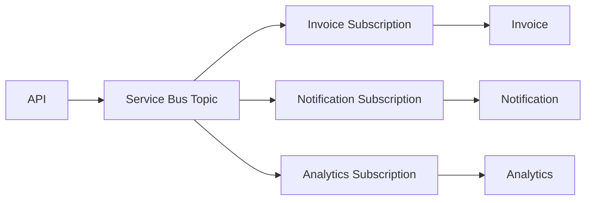
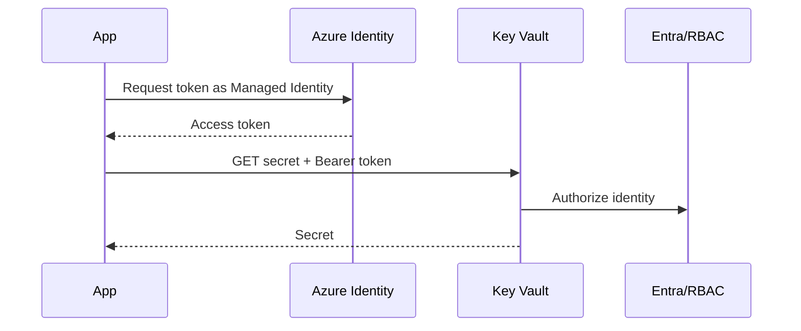
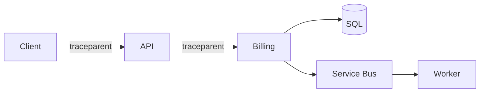
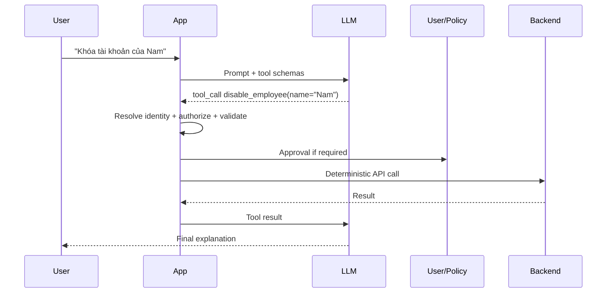
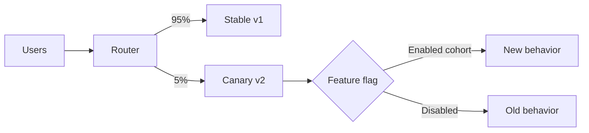

# Daily Knowledge Sharing — 2026-08-19

## Today’s Topics

1. Modular Monolith — module boundary và transaction boundary
2. Event-Driven Architecture — delivery semantics và Outbox Pattern
3. Idempotency — chống xử lý trùng ở API và consumer
4. Optimistic Concurrency — phát hiện lost update với EF Core
5. Cache Invalidation — consistency giữa database và Redis
6. Azure Service Bus — queue, topic, retry và dead-letter
7. Managed Identity + Azure Key Vault — bỏ secrets khỏi ứng dụng
8. OpenTelemetry Distributed Tracing — lần theo request xuyên service
9. AI Tool Calling — ranh giới giữa quyết định của LLM và deterministic code
10. Canary Deployment + Feature Flags — giảm blast radius khi release

---

# 1. Modular Monolith — module boundary và transaction boundary

### 1. What is it?

Modular Monolith vẫn là **một deployable application**, nhưng code và dữ liệu được chia thành các module nghiệp vụ có boundary rõ ràng. Điểm quan trọng không phải là tạo nhiều folder, mà là ngăn module này tùy tiện đọc bảng, gọi class nội bộ hoặc sửa state của module khác.

Ví dụ hệ thống SaaS có `Identity`, `Billing`, `Timesheet`, `Notification`. Chúng chạy cùng process nhưng mỗi module sở hữu use case, domain model và persistence của mình.

### 2. Why does it exist?

Monolith truyền thống thường xuống cấp thành “big ball of mud”: service A gọi repository B, controller C join trực tiếp bảng của ba domain. Sau vài năm, thay đổi một feature kéo theo regression ở nơi không liên quan.

Microservices giải quyết isolation nhưng thêm network failure, distributed tracing, eventual consistency, deployment orchestration và chi phí vận hành. Modular Monolith giữ operational simplicity của monolith nhưng áp dụng logical boundaries đủ mạnh để có thể tách service sau này nếu thật sự cần.

### 3. How does it work?



Một module nên expose một public API nhỏ: command/query contract hoặc integration event. Internal entity, DbContext và repository không được module khác tham chiếu trực tiếp.

Transaction thường kết thúc trong boundary của một module. Nếu một business flow thay đổi nhiều module, hãy cân nhắc orchestration + event thay vì mở một transaction khổng lồ xuyên mọi module.

### 4. Practical example

```csharp
public interface IBillingModule
{
    Task<InvoiceDto> CreateInvoiceAsync(
        CreateInvoiceCommand command,
        CancellationToken ct);
}

// Timesheet chỉ phụ thuộc public contract, không dùng BillingDbContext.
await billingModule.CreateInvoiceAsync(
    new CreateInvoiceCommand(employeeId, month), ct);
```

Một cách mạnh hơn là Timesheet phát `TimesheetApproved` và Billing xử lý event đó.

### 5. Real production scenario

Khi manager approve timesheet, Timesheet commit trạng thái `Approved`. Sau đó event được phát để Billing tạo invoice và Notification gửi email. Nếu Billing lỗi, timesheet vẫn không bị rollback vô lý; phần downstream có thể retry.

### 6. Common mistakes

- Tạo project/module riêng nhưng cùng dùng một `AppDbContext` và truy cập mọi `DbSet`.
- Public hóa entity nội bộ khiến coupling quay trở lại.
- Mỗi module tự dựng framework abstraction phức tạp không cần thiết.
- Ép mọi giao tiếp nội bộ thành message broker dù tất cả vẫn cùng process.
- Transaction xuyên nhiều module khiến boundary chỉ tồn tại trên sơ đồ.

### 7. Trade-offs

**Advantages:** deploy đơn giản, transaction cục bộ dễ quản lý, debugging thuận tiện, boundary tốt hơn monolith hỗn loạn.

**Costs / Risks:** isolation không mạnh bằng process riêng; team phải có discipline; scale từng module độc lập khó hơn microservices.

### 8. Junior → Middle → Senior understanding

**Junior:** hiểu module là business boundary chứ không chỉ folder.

**Middle:** biết thiết kế public contract, dependency direction và ngăn cross-module data access.

**Senior / Technical Lead:** quyết định transaction boundary, sync vs async communication, mức isolation dữ liệu và tiêu chí khi nào một module đáng tách thành service.

### 9. Key takeaway

- Modular Monolith tối ưu cho **boundary trước, distribution sau**.
- Module phải sở hữu dữ liệu và behavior của nó.
- Đừng dùng microservices chỉ để sửa một monolith thiếu kỷ luật.

---

# 2. Event-Driven Architecture — delivery semantics và Outbox Pattern

### 1. What is it?

Event-Driven Architecture (EDA) cho phép component phản ứng với sự kiện đã xảy ra, ví dụ `OrderPaid`, `EmployeeDeactivated`, `InvoiceCreated`. Producer không cần biết toàn bộ consumer.

Trong production, vấn đề khó không phải `PublishAsync()`, mà là đảm bảo **database state và event không lệch nhau** khi process crash.

### 2. Why does it exist?

Nếu API update database rồi publish message bằng hai thao tác độc lập, có hai failure window:

1. DB commit thành công, publish thất bại → dữ liệu đổi nhưng không có event.
2. Publish trước, DB rollback → consumer nhận một sự kiện về state chưa từng tồn tại.

Distributed transaction giữa database và broker thường đắt, phức tạp hoặc không khả dụng. Transactional Outbox giải bài toán bằng local database transaction.

### 3. How does it work?



Broker phổ biến cung cấp **at-least-once delivery**, vì vậy cùng event có thể tới consumer nhiều lần. Consumer phải idempotent.

### 4. Practical example

```csharp
await using var tx = await db.Database.BeginTransactionAsync(ct);

order.MarkPaid();
db.OutboxMessages.Add(new OutboxMessage
{
    Id = Guid.NewGuid(),
    Type = "OrderPaid",
    Payload = JsonSerializer.Serialize(new { order.Id })
});

await db.SaveChangesAsync(ct);
await tx.CommitAsync(ct);
```

Background worker lấy các row chưa xử lý, publish rồi đánh dấu `ProcessedAt`.

### 5. Real production scenario

Payment API xác nhận thanh toán. Trong cùng transaction, nó update `Payment.Status=Succeeded` và ghi Outbox. Worker phát `PaymentSucceeded`; Invoice, Notification và Loyalty xử lý độc lập. Broker tạm outage 15 phút không làm mất event vì outbox vẫn nằm trong DB.

### 6. Common mistakes

- Tin rằng broker sẽ “exactly once” cho toàn bộ business operation.
- Xóa outbox ngay khi gửi mà không có retention/audit strategy.
- Không có unique event ID nên consumer không deduplicate được.
- Worker không lock/claim batch đúng cách, nhiều instance cùng publish.
- Payload event phụ thuộc trực tiếp schema entity nội bộ.

### 7. Trade-offs

**Advantages:** tránh dual-write inconsistency; resilient với broker outage; audit được event pending.

**Costs / Risks:** thêm outbox table, polling/CDC, cleanup, duplicate delivery và eventual consistency.

### 8. Junior → Middle → Senior understanding

**Junior:** phân biệt command với event và hiểu consumer có thể chạy sau producer.

**Middle:** implement outbox worker, retry, deduplication và dead-letter handling.

**Senior / Technical Lead:** thiết kế delivery semantics, ordering, partition key, schema evolution, replay và consistency expectation cho business.

### 9. Key takeaway

- “Publish sau SaveChanges” không tự động reliable.
- Outbox biến distributed dual-write thành local transaction + asynchronous delivery.
- At-least-once đồng nghĩa consumer phải chịu được duplicate.

---

# 3. Idempotency — chống xử lý trùng ở API và consumer

### 1. What is it?

Một operation idempotent có thể nhận cùng logical request nhiều lần nhưng **business effect chỉ xảy ra một lần**. Đây là yêu cầu quan trọng với payment, webhook, queue consumer và API mà client có retry.

### 2. Why does it exist?

Network timeout không cho client biết server đã xử lý hay chưa. Client retry là hành vi đúng về reliability nhưng có thể tạo hai payment, hai invoice hoặc gửi email hai lần.

“Không retry” không giải quyết được vì message broker, load balancer hoặc SDK cũng có thể redeliver.

### 3. How does it work?



Idempotency key cần gắn với caller và request semantics. Database unique constraint là lớp bảo vệ cuối cùng trước race condition.

### 4. Practical example

```sql
CREATE UNIQUE INDEX UX_Idempotency_Client_Key
ON IdempotencyRecords(ClientId, IdempotencyKey);
```

```csharp
if (await db.IdempotencyRecords
    .SingleOrDefaultAsync(x => x.ClientId == clientId &&
                               x.Key == key, ct) is { } existing)
{
    return Results.Json(existing.ResponseJson,
        statusCode: existing.StatusCode);
}
```

Trong implementation thật, record và business mutation nên nằm trong transaction phù hợp.

### 5. Real production scenario

Mobile app gọi tạo payment, server commit nhưng response bị mất. App retry sau 5 giây với cùng key. API trả lại payment cũ thay vì charge lần hai.

### 6. Common mistakes

- Dùng random key mới cho mỗi retry.
- Chỉ check `AnyAsync()` rồi insert, tạo race giữa hai request đồng thời.
- Không kiểm tra cùng key nhưng payload khác nhau.
- Giữ key vĩnh viễn gây storage growth.
- Nhầm HTTP method idempotent với business workflow idempotent.

### 7. Trade-offs

**Advantages:** retry an toàn, giảm duplicate side effect, tăng reliability.

**Costs / Risks:** storage, retention, concurrency control và response replay phức tạp hơn.

### 8. Junior → Middle → Senior understanding

**Junior:** hiểu retry có thể tạo duplicate.

**Middle:** implement key storage, unique constraint, transaction và replay response.

**Senior / Technical Lead:** định nghĩa idempotency scope, TTL, conflict semantics, cross-region behavior và cách phối hợp với outbox/consumer deduplication.

### 9. Key takeaway

- Reliability thường tạo duplicate; idempotency biến duplicate thành an toàn.
- Check bằng code chưa đủ — cần database constraint khi có concurrency.
- Key phải đại diện cho cùng một logical operation.

---

# 4. Optimistic Concurrency — phát hiện lost update với EF Core

### 1. What is it?

Optimistic concurrency giả định conflict hiếm, nên không giữ lock dài. Khi update, application kiểm tra row có còn ở version mà mình đã đọc hay không.

Nếu người khác đã sửa trước, update ảnh hưởng 0 row và EF Core ném `DbUpdateConcurrencyException`.

### 2. Why does it exist?

Hai user cùng đọc Employee version 5. A đổi department, B đổi manager. Nếu cả hai update toàn row mà không kiểm tra version, B có thể ghi đè thay đổi của A — **lost update**.

Pessimistic locking tránh được nhưng giữ lock lâu, giảm throughput và không phù hợp workflow người dùng kéo dài vài phút.

### 3. How does it work?

SQL Server `rowversion` thay đổi mỗi lần row được update.

```sql
UPDATE Employees
SET ManagerId = @manager
WHERE Id = @id AND RowVersion = @originalVersion;
```

Nếu affected rows = 0, state đã thay đổi kể từ lần đọc.

### 4. Practical example

```csharp
public class Employee
{
    public Guid Id { get; set; }
    public string Name { get; set; } = null!;

    [Timestamp]
    public byte[] RowVersion { get; set; } = null!;
}

try
{
    await db.SaveChangesAsync(ct);
}
catch (DbUpdateConcurrencyException)
{
    return Results.Conflict(new
    {
        message = "Employee was modified by another user. Reload and retry."
    });
}
```

### 5. Real production scenario

HR Portal mở employee profile. Trong lúc HR A sửa manager, HR B sửa trạng thái offboarding. Thay vì silently overwrite, API trả `409 Conflict`; UI reload state mới và yêu cầu user quyết định lại.

### 6. Common mistakes

- Catch exception rồi tự retry cùng giá trị cũ, vô tình ghi đè thay đổi mới.
- Không đưa concurrency token qua API round-trip.
- Dùng timestamp thời gian ứng dụng thay cho version đáng tin cậy.
- Apply optimistic concurrency cho counter cực nóng mà conflict xảy ra liên tục.

### 7. Trade-offs

**Advantages:** không giữ long-lived lock, throughput tốt khi conflict hiếm.

**Costs / Risks:** application phải xử lý merge/retry; UX phức tạp hơn; conflict cao làm nhiều retry.

### 8. Junior → Middle → Senior understanding

**Junior:** hiểu lost update và `409 Conflict`.

**Middle:** cấu hình EF concurrency token và xử lý `DbUpdateConcurrencyException` đúng business rule.

**Senior / Technical Lead:** chọn optimistic vs pessimistic theo contention, thiết kế merge policy và đảm bảo API contract truyền version rõ ràng.

### 9. Key takeaway

- Optimistic concurrency **phát hiện** conflict, không tự quyết định cách resolve.
- Retry mù có thể phá ý nghĩa concurrency control.
- Chọn strategy dựa trên contention và business semantics.

---

# 5. Cache Invalidation — consistency giữa database và Redis

### 1. What is it?

Cache invalidation là chiến lược giữ dữ liệu cache không trở thành một bản sao lỗi thời quá lâu so với source of truth. Với Cache Aside, database thường là source of truth còn Redis chỉ tăng tốc read.

### 2. Why does it exist?

Cache giúp giảm latency và database load, nhưng tạo thêm một copy của dữ liệu. Nếu update DB mà quên xóa cache, API có thể trả dữ liệu cũ hàng phút hoặc hàng giờ.

TTL đơn thuần giới hạn thời gian stale nhưng không đảm bảo read-after-write consistency.

### 3. How does it work?



Thường **update DB trước, invalidate cache sau**. Nhưng vẫn tồn tại failure window nếu DB commit xong mà Redis delete thất bại. Với yêu cầu consistency cao hơn, có thể phát invalidation event bằng outbox.

### 4. Practical example

```csharp
await db.SaveChangesAsync(ct);

try
{
    await cache.RemoveAsync($"employee:{employee.Id}", ct);
}
catch (RedisConnectionException ex)
{
    logger.LogWarning(ex,
        "Cache invalidation failed for employee {EmployeeId}", employee.Id);
}
```

Không rollback business transaction chỉ vì cache đang outage; thay vào đó cần TTL/fallback hoặc reliable invalidation event tùy yêu cầu.

### 5. Real production scenario

Employee profile được cache 10 phút. Admin deactivate employee. Nếu cache không invalidated, authorization-related read có thể vẫn thấy trạng thái Active. Với dữ liệu security-sensitive, tốt hơn là không cache decision quan trọng hoặc dùng TTL cực ngắn + reliable invalidation.

### 6. Common mistakes

- Cache dữ liệu authorization quá lâu.
- Dùng wildcard key deletion trên production Redis.
- Không thêm jitter vào TTL, gây cache stampede đồng loạt.
- Redis outage làm toàn API fail dù DB vẫn khỏe.
- Cache object quá lớn hoặc cache query có cardinality rất cao.

### 7. Trade-offs

**Advantages:** latency thấp, giảm DB load, hấp thụ read burst.

**Costs / Risks:** stale data, invalidation complexity, memory cost, stampede và thêm dependency.

### 8. Junior → Middle → Senior understanding

**Junior:** hiểu hit, miss, TTL và source of truth.

**Middle:** implement Cache Aside, invalidation, fallback và metrics hit ratio.

**Senior / Technical Lead:** phân loại consistency requirement, thiết kế invalidation event, stampede protection, capacity và behavior khi Redis unavailable.

### 9. Key takeaway

- Cache là một consistency problem trước khi là performance feature.
- Không phải dữ liệu nào cũng đáng cache.
- Luôn thiết kế đường đi khi Redis down và khi invalidation thất bại.

---

# 6. Azure Service Bus — queue, topic, retry và dead-letter

### 1. What is it?

Azure Service Bus là managed message broker cho enterprise messaging. `Queue` phù hợp point-to-point; `Topic + Subscription` phù hợp publish/subscribe khi nhiều consumer độc lập cần cùng event.

### 2. Why does it exist?

Gọi HTTP trực tiếp giữa service khiến availability bị nối chuỗi: Notification down có thể làm Payment request chậm hoặc fail. Broker tách producer khỏi thời điểm consumer xử lý và hấp thụ burst.

### 3. How does it work?



Với Peek-Lock, consumer nhận message nhưng message chưa bị xóa. Xử lý thành công → `Complete`; lỗi transient → `Abandon`/retry; poison message vượt delivery count → DLQ.

### 4. Practical example

```csharp
var options = new ServiceBusProcessorOptions
{
    AutoCompleteMessages = false,
    MaxConcurrentCalls = 8
};

processor.ProcessMessageAsync += async args =>
{
    var evt = args.Message.Body.ToObjectFromJson<OrderPaid>();
    await handler.HandleAsync(evt, args.CancellationToken);
    await args.CompleteMessageAsync(args.Message);
};
```

### 5. Real production scenario

Hệ thống import 50.000 employee records. API ghi metadata và enqueue từng batch. Worker scale-out xử lý file; message lỗi dữ liệu đi DLQ thay vì chặn toàn queue. Operations có dashboard để inspect/replay DLQ sau khi sửa nguyên nhân.

### 6. Common mistakes

- Coi queue như database lâu dài.
- Không idempotent consumer.
- Retry poison message hàng nghìn lần.
- Set lock duration không phù hợp job dài và không renew lock.
- Không monitor active message count, age và DLQ.
- Nhét payload rất lớn thay vì dùng Claim Check: blob + message chứa URI/ID.

### 7. Trade-offs

**Advantages:** decoupling, buffering, retries, DLQ, managed availability.

**Costs / Risks:** eventual consistency, duplicate, ordering complexity, broker cost và observability khó hơn HTTP sync.

### 8. Junior → Middle → Senior understanding

**Junior:** hiểu queue khác topic và Complete khác Abandon.

**Middle:** cấu hình processor, retry, DLQ, concurrency và idempotency.

**Senior / Technical Lead:** chọn topology, session/ordering, throughput, partitioning, backpressure, disaster recovery và message contract evolution.

### 9. Key takeaway

- Broker không loại bỏ failure; nó biến failure thành thứ có thể trì hoãn và xử lý có kiểm soát.
- DLQ phải có operational process, không phải “thùng rác”.
- Consumer idempotency là requirement, không phải optimization.

---

# 7. Managed Identity + Azure Key Vault — bỏ secrets khỏi ứng dụng

### 1. What is it?

Managed Identity cung cấp identity do Azure quản lý cho workload. Application có thể xin token từ Microsoft Entra ID để gọi Key Vault, Storage, Service Bus hoặc resource hỗ trợ Entra authentication mà không lưu client secret trong config.

Key Vault quản lý secrets, keys và certificates với access control, audit và rotation tốt hơn appsettings.

### 2. Why does it exist?

Secret trong source code, pipeline variable hoặc environment variable vẫn có thể bị leak. Secret còn có expiry và rotation burden. Managed Identity chuyển bài toán từ “application giữ credential” sang “platform chứng minh workload identity”.

### 3. How does it work?



### 4. Practical example

```csharp
var credential = new DefaultAzureCredential();
var client = new SecretClient(
    new Uri("https://my-vault.vault.azure.net/"),
    credential);

KeyVaultSecret secret = await client.GetSecretAsync("ThirdPartyApiKey");
```

`DefaultAzureCredential` cho local development dùng developer identity; trên Azure nó có thể dùng Managed Identity.

### 5. Real production scenario

ASP.NET Core trên App Service cần gọi Service Bus và Blob Storage. Thay vì lưu connection string, App Service Managed Identity được cấp RBAC `Azure Service Bus Data Sender` và `Storage Blob Data Contributor`. Chỉ third-party API key thực sự cần secret mới nằm trong Key Vault.

### 6. Common mistakes

- Cho Managed Identity role quá rộng ở subscription scope.
- Nghĩ rằng đưa mọi config vào Key Vault là tốt; non-secret config không cần thiết.
- Fetch secret từ Key Vault mỗi request gây latency/throttling.
- Không thiết kế secret rotation cho SDK/client cache.
- Dùng access policy/RBAC lẫn lộn mà team không hiểu permission model.

### 7. Trade-offs

**Advantages:** giảm secret sprawl, rotation đơn giản hơn, RBAC/audit tốt.

**Costs / Risks:** phụ thuộc Entra/Azure runtime, permission debugging khó hơn local config, Key Vault access có latency và quota.

### 8. Junior → Middle → Senior understanding

**Junior:** phân biệt secret với config và hiểu credential không nên commit.

**Middle:** dùng `DefaultAzureCredential`, RBAC và Key Vault SDK.

**Senior / Technical Lead:** thiết kế least privilege, identity per workload, network restriction/private endpoint, rotation, break-glass và audit strategy.

### 9. Key takeaway

- Secret tốt nhất là secret application không cần giữ.
- Managed Identity nên ưu tiên cho Azure-to-Azure authentication.
- Key Vault không thay thế authorization design và least privilege.

---

# 8. OpenTelemetry Distributed Tracing — lần theo request xuyên service

### 1. What is it?

Distributed tracing theo dõi một request qua nhiều process/service bằng `TraceId`, trong đó mỗi operation tạo một `Span`. OpenTelemetry (OTel) cung cấp chuẩn instrumentation/export độc lập vendor cho traces, metrics và logs.

### 2. Why does it exist?

Trong distributed system, log của API nói request mất 4 giây nhưng không cho biết 3.7 giây nằm ở SQL, HTTP downstream hay queue consumer. Correlation ID thủ công giúp một phần nhưng thiếu parent-child timing và semantic attributes chuẩn.

### 3. How does it work?



W3C Trace Context truyền `traceparent` qua HTTP. Instrumentation tạo spans tự động cho ASP.NET Core, HttpClient, SQL client; custom span bổ sung business operation quan trọng.

### 4. Practical example

```csharp
builder.Services.AddOpenTelemetry()
    .WithTracing(t => t
        .AddAspNetCoreInstrumentation()
        .AddHttpClientInstrumentation()
        .AddSqlClientInstrumentation());
```

Custom activity:

```csharp
using var activity = ActivitySource.StartActivity("GenerateInvoice");
activity?.SetTag("invoice.customer_tier", customerTier);
await invoiceService.GenerateAsync(ct);
```

Không đưa password, token hoặc PII nhạy cảm vào tags.

### 5. Real production scenario

P95 của `/checkout` tăng từ 600 ms lên 3 s. Trace cho thấy API chỉ dùng 80 ms, nhưng span tới inventory service mất 2.4 s; inventory trace tiếp tục chỉ ra SQL query scan 1.9 s. Team sửa đúng bottleneck thay vì “scale API lên”.

### 6. Common mistakes

- Log mọi thứ nhưng không propagate trace context.
- Sampling quá thấp khiến incident hiếm biến mất.
- Sampling 100% ở traffic lớn gây cost khổng lồ.
- High-cardinality attributes như raw URL/user ID làm telemetry đắt.
- Instrumentation nhưng không có dashboard/alert/query practice.

### 7. Trade-offs

**Advantages:** nhìn end-to-end latency, dependency graph, correlation mạnh.

**Costs / Risks:** telemetry volume, sampling bias, storage cost, privacy và instrumentation overhead.

### 8. Junior → Middle → Senior understanding

**Junior:** hiểu trace, span, TraceId và correlation.

**Middle:** cấu hình instrumentation, propagation, custom span và query trace.

**Senior / Technical Lead:** thiết kế sampling, telemetry budget, semantic conventions, PII policy, SLO linkage và observability strategy xuyên hệ thống.

### 9. Key takeaway

- Logs trả lời “đã xảy ra gì”; traces rất mạnh để trả lời “thời gian đã đi đâu”.
- Instrument trước khi incident xảy ra.
- Telemetry cũng là dữ liệu production: phải quản lý cost, cardinality và privacy.

---

# 9. AI Tool Calling — ranh giới giữa LLM và deterministic code

### 1. What is it?

Tool calling cho phép LLM chọn một action có schema định nghĩa trước, ví dụ `get_order`, `search_document`, `create_ticket`. Model không trực tiếp thực thi quyền lực; application nhận tool call, validate, authorize, execute rồi đưa result lại model.

### 2. Why does it exist?

LLM giỏi hiểu ngôn ngữ và chọn intent nhưng không đáng tin cho những việc cần tính đúng tuyệt đối, permission hoặc side effect. Nếu cho model tự “giả lập” database/API, nó có thể hallucinate. Nếu cho model quyền gọi mọi action không kiểm soát, prompt injection có thể trở thành security incident.

### 3. How does it work?



LLM đề xuất; code quyết định action có hợp lệ, caller có quyền và có cần human approval hay không.

### 4. Practical example

```csharp
public sealed record DisableEmployeeArgs(Guid EmployeeId);

public async Task<ToolResult> ExecuteAsync(
    DisableEmployeeArgs args,
    ClaimsPrincipal user,
    CancellationToken ct)
{
    if (!user.IsInRole("HRAdmin"))
        return ToolResult.Forbidden();

    var employee = await db.Employees.FindAsync([args.EmployeeId], ct);
    if (employee is null) return ToolResult.NotFound();

    employee.Disable();
    await db.SaveChangesAsync(ct);
    return ToolResult.Success(new { employee.Id, employee.Status });
}
```

Model không được truyền SQL, role hay raw authorization decision vào executor.

### 5. Real production scenario

AI assistant nội bộ đọc Microsoft 365 data và hỗ trợ offboarding. Nó có thể tự search employee và giải thích policy, nhưng thao tác disable account/forward mailbox là privileged side effect: backend xác minh identity, scope, policy và có thể yêu cầu approval trước khi chạy.

### 6. Common mistakes

- Tin tool arguments của model như trusted input.
- Expose tool quá tổng quát như `execute_sql` hoặc `http_request(any_url)`.
- Đưa secret vào model context.
- Retry tool có side effect mà không có idempotency.
- Không log tool name, arguments đã redacted, latency, outcome và approval.
- Cho content từ RAG/web tự động trở thành instruction có quyền cao.

### 7. Trade-offs

**Advantages:** kết hợp natural-language reasoning với deterministic systems; mở rộng capability rõ ràng qua schema.

**Costs / Risks:** prompt injection, tool misuse, latency nhiều vòng, token cost, authorization complexity.

### 8. Junior → Middle → Senior understanding

**Junior:** hiểu model chọn tool nhưng application mới thực thi.

**Middle:** thiết kế schema, validation, timeout, retry, structured result và error handling.

**Senior / Technical Lead:** thiết kế trust boundary, permission model, approval, idempotency, audit, evaluation và containment khi model quyết định sai.

### 9. Key takeaway

- LLM nên quyết định **ý định**, deterministic code kiểm soát **quyền và side effect**.
- Tool arguments luôn là untrusted input.
- Privileged tools cần least privilege, audit và thường cần approval.

---

# 10. Canary Deployment + Feature Flags — giảm blast radius khi release

### 1. What is it?

Canary deployment đưa version mới tới một phần nhỏ traffic trước khi rollout toàn bộ. Feature flag tách **code deployment** khỏi **feature release**: code có thể đã production nhưng feature chỉ bật cho một cohort.

Hai kỹ thuật bổ trợ nhau nhưng giải hai bài toán khác nhau.

### 2. Why does it exist?

Test/staging không mô phỏng hoàn toàn production traffic, data distribution và dependency behavior. Big-bang deployment khiến bug mới ảnh hưởng 100% user ngay lập tức.

Rollback binary cũng chưa đủ nếu vấn đề nằm ở một feature có migration hoặc external side effect.

### 3. How does it work?



Rollout nên dựa trên health signal: error rate, latency, saturation và business metric; không chỉ “chờ 10 phút không ai báo lỗi”.

### 4. Practical example

```csharp
if (await featureManager.IsEnabledAsync("NewInvoiceEngine"))
{
    return await newEngine.GenerateAsync(request, ct);
}

return await legacyEngine.GenerateAsync(request, ct);
```

Pipeline có thể triển khai 5% traffic, quan sát P95/error rate rồi tăng 25% → 50% → 100%.

### 5. Real production scenario

Team thay invoice calculation engine. Version mới deploy tới 5% instances nhưng flag chỉ bật cho tenant nội bộ. Sau khi metrics ổn, mở 5% khách hàng, rồi 25%. Nếu mismatch amount tăng, flag tắt trong vài giây mà không cần build lại artifact.

### 6. Common mistakes

- Feature flag tồn tại vĩnh viễn thành technical debt.
- Canary nhưng cả old/new cùng dùng destructive schema migration không backward-compatible.
- Chỉ monitor CPU, bỏ qua business KPI như payment decline rate.
- Cohort không sticky khiến cùng user lúc vào v1, lúc vào v2.
- Rollback application nhưng database migration không rollback được.

### 7. Trade-offs

**Advantages:** blast radius nhỏ, feedback production sớm, rollback/kill switch nhanh.

**Costs / Risks:** hai behavior cùng tồn tại, test matrix tăng, routing/telemetry phức tạp, flag debt.

### 8. Junior → Middle → Senior understanding

**Junior:** phân biệt deploy code và release feature.

**Middle:** implement flag an toàn, telemetry theo version/cohort và backward-compatible change.

**Senior / Technical Lead:** định nghĩa rollout gates, automatic rollback, migration strategy, blast-radius budget, flag lifecycle và business guardrail.

### 9. Key takeaway

- Release an toàn là bài toán kiểm soát blast radius, không chỉ chạy test pass.
- Canary cần metrics và rollback criteria định trước.
- Feature flag phải có owner, expiry date và cleanup plan.