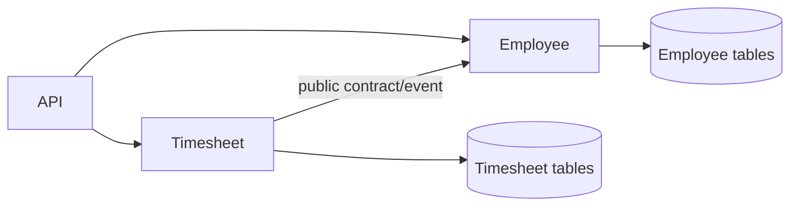
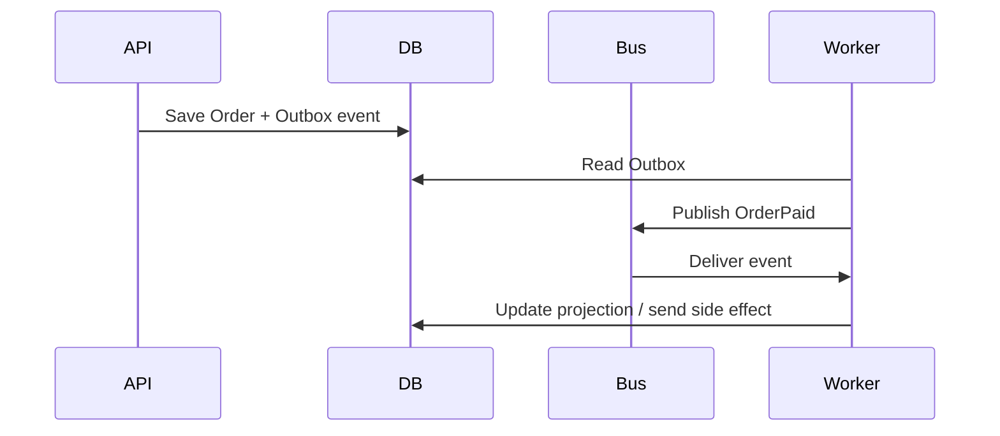
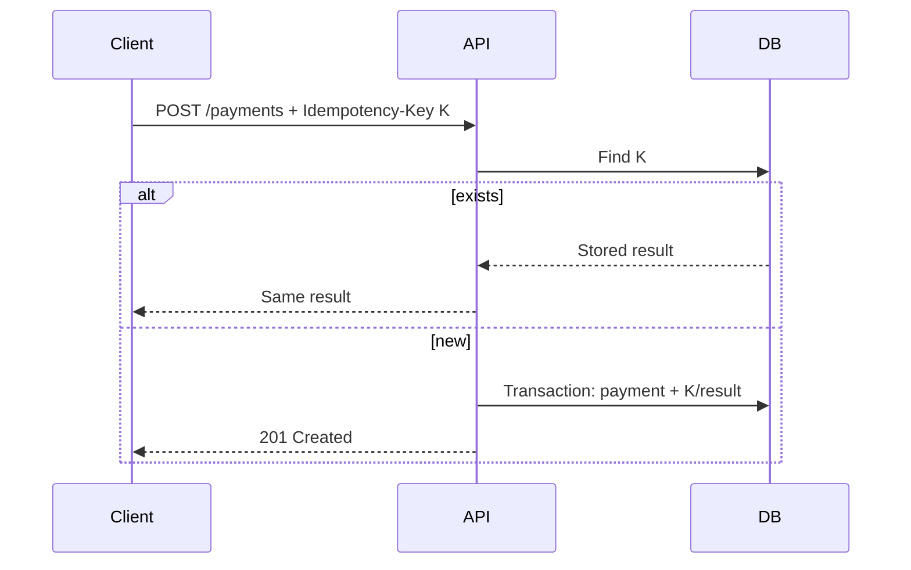
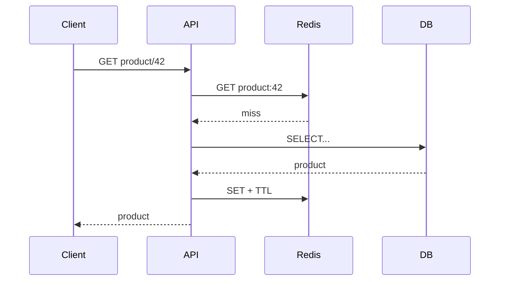
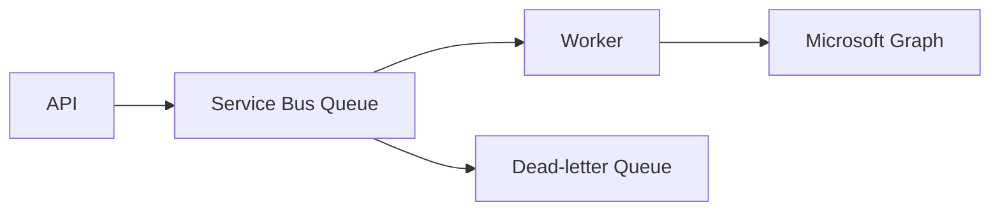
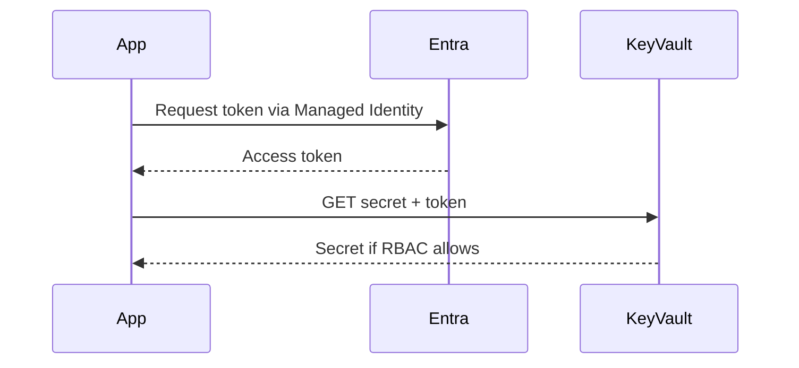
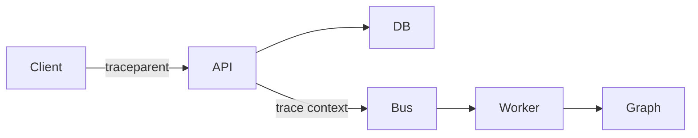
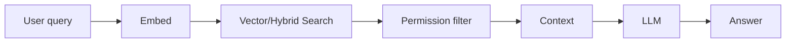
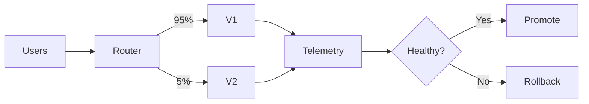

# Daily Knowledge Sharing — 2026-08-19

## Today’s Topics

1. Modular Monolith và ranh giới module
2. Event-Driven Architecture và eventual consistency
3. Idempotency cho API ghi dữ liệu
4. Optimistic Concurrency với EF Core
5. Cache Aside và cache invalidation
6. Azure Service Bus: queue, retry và dead-letter
7. Managed Identity + Azure Key Vault
8. OpenTelemetry và distributed tracing
9. RAG: retrieval, grounding và security boundary
10. Canary Deployment và rollback dựa trên telemetry

---

# 1. Modular Monolith và ranh giới module

### 1. What is it?
Modular Monolith vẫn deploy thành một application/process chính, nhưng code và dữ liệu được chia thành các module nghiệp vụ có boundary rõ ràng. Điểm quan trọng không phải folder đẹp mà là module A không tùy tiện đọc DbContext, entity nội bộ hay service implementation của module B.

### 2. Why does it exist?
Monolith thông thường dễ biến thành “big ball of mud”: thay đổi Payroll vô tình phá Timesheet, mọi service gọi chéo nhau, database trở thành API chung. Microservices giải quyết một phần coupling nhưng thêm network, deployment, observability và consistency complexity. Modular Monolith giữ operational simplicity nhưng buộc kiến trúc có boundary.

### 3. How does it work?

Mỗi module sở hữu use cases, domain model và persistence của nó. Giao tiếp qua public contract, application interface hoặc domain/integration event thay vì truy cập implementation trực tiếp.

### 4. Practical example
```csharp
public interface IEmployeeDirectory
{
    Task<EmployeeSummary?> GetAsync(Guid employeeId, CancellationToken ct);
}

// Timesheet chỉ phụ thuộc contract, không inject EmployeeDbContext.
public sealed class SubmitTimesheetHandler(IEmployeeDirectory employees)
{
    public async Task Handle(Guid employeeId, CancellationToken ct)
    {
        var employee = await employees.GetAsync(employeeId, ct)
            ?? throw new InvalidOperationException("Employee not found");
        // business flow...
    }
}
```

### 5. Real production scenario
Hệ thống HR có Employee, Timesheet, Leave và Offboarding. Offboarding cần biết employee nhưng không được update trực tiếp bảng Employee. Module phát command/event qua contract; owner của dữ liệu tự thực hiện invariant của mình.

### 6. Common mistakes
Tách project nhưng dùng chung entity/DbContext; public toàn bộ implementation; tạo abstraction cho mọi class; transaction xuyên nhiều module mà không xác định boundary; coi module như folder thay vì ownership.

### 7. Trade-offs
**Advantages:** deploy đơn giản, transaction local dễ, refactor nhanh hơn microservices. **Costs / Risks:** boundary chỉ được bảo vệ bằng design/test; một process lỗi có thể ảnh hưởng toàn hệ thống; scale từng module độc lập khó hơn.

### 8. Junior → Middle → Senior understanding
**Junior:** hiểu module sở hữu responsibility/data. **Middle:** thiết kế contract, dependency direction và integration test boundary. **Senior / Technical Lead:** quyết định module boundary, transaction boundary và khi nào module đủ độc lập để tách thành service.

### 9. Key takeaway
- Modular Monolith là kiến trúc boundary, không phải cấu trúc folder.
- Data ownership quan trọng hơn số lượng project.
- Chỉ tách microservice khi operational benefit đáng giá complexity.

---

# 2. Event-Driven Architecture và eventual consistency

### 1. What is it?
Event-Driven Architecture cho phép component phản ứng với sự kiện đã xảy ra, ví dụ `OrderPaid`, thay vì producer gọi đồng bộ từng consumer. Khi mỗi consumer cập nhật data store riêng, toàn hệ thống thường đạt consistency sau một khoảng thời gian thay vì tức thì.

### 2. Why does it exist?
Chuỗi HTTP đồng bộ tạo temporal coupling: Notification lỗi có thể làm Payment thất bại dù tiền đã thu. Event giúp producer hoàn thành transaction của mình và consumer xử lý độc lập.

### 3. How does it work?

Outbox giải quyết khoảng trống giữa DB commit và publish message. Consumer cần idempotent vì broker có thể redeliver.

### 4. Practical example
```csharp
await using var tx = await db.Database.BeginTransactionAsync(ct);
order.MarkPaid();
db.OutboxMessages.Add(OutboxMessage.From(new OrderPaid(order.Id)));
await db.SaveChangesAsync(ct);
await tx.CommitAsync(ct);
```

### 5. Real production scenario
Payment xác nhận thành công; Inventory reserve hàng, Notification gửi email và Analytics cập nhật dashboard độc lập. Dashboard có thể chậm vài giây nhưng payment truth vẫn nằm ở service sở hữu payment.

### 6. Common mistakes
Publish trước DB commit; giả định exactly-once; event chứa toàn bộ entity nhạy cảm; không version schema; retry vô hạn poison message; không monitor consumer lag.

### 7. Trade-offs
**Advantages:** loose coupling, resilience, throughput. **Costs / Risks:** eventual consistency, duplicate/out-of-order events, debugging phức tạp và cần observability tốt.

### 8. Junior → Middle → Senior understanding
**Junior:** event là fact đã xảy ra. **Middle:** triển khai outbox, idempotent consumer, retry/DLQ. **Senior:** chọn consistency boundary, ordering strategy, schema evolution và recovery model.

### 9. Key takeaway
- Event không loại bỏ consistency problem; nó làm boundary rõ hơn.
- Assume at-least-once delivery.
- Outbox + idempotent consumer là cặp kỹ thuật nền tảng.

---

# 3. Idempotency cho API ghi dữ liệu

### 1. What is it?
Một operation idempotent có thể được gửi lặp lại với cùng logical request mà không tạo thêm side effect. `POST /payments` tự nhiên không idempotent, nhưng có thể được thiết kế idempotent bằng key.

### 2. Why does it exist?
Client timeout không biết server đã commit hay chưa. Nếu retry mù, một payment hoặc order có thể được tạo hai lần.

### 3. How does it work?

Key phải có unique constraint và gắn với request fingerprint để tránh cùng key nhưng payload khác.

### 4. Practical example
```sql
CREATE UNIQUE INDEX UX_Idempotency_Key
ON ApiIdempotency(IdempotencyKey);
```
```csharp
if (await db.ApiIdempotency.FindAsync([key], ct) is { } cached)
    return Results.Json(cached.ResponseBody, statusCode: cached.StatusCode);
```

### 5. Real production scenario
Mobile gọi tạo expense, mạng chập chờn và SDK retry. Server dùng key do client sinh; request thứ hai trả lại expense đã tạo thay vì insert mới.

### 6. Common mistakes
Chỉ check rồi insert mà không có unique constraint; lưu key sau side effect; key không có expiry; cùng key chấp nhận payload khác; coi retry là idempotency.

### 7. Trade-offs
**Advantages:** retry an toàn, UX tốt. **Costs / Risks:** thêm storage, cleanup, transaction logic và semantics cho concurrent requests.

### 8. Junior → Middle → Senior understanding
**Junior:** hiểu duplicate request. **Middle:** implement key + unique index + transaction. **Senior:** định nghĩa idempotency scope, TTL, concurrency và cross-service side effects.

### 9. Key takeaway
- Idempotency là business guarantee, không chỉ HTTP detail.
- Database uniqueness là lớp bảo vệ cuối.
- Retry chỉ an toàn khi operation semantics cho phép.

---

# 4. Optimistic Concurrency với EF Core

### 1. What is it?
Optimistic concurrency giả định conflict hiếm; không giữ lock suốt thời gian user chỉnh sửa. Khi update, hệ thống kiểm tra version đọc trước đó còn đúng hay không.

### 2. Why does it exist?
Hai admin cùng mở employee. A đổi department, B đổi title trên snapshot cũ. Nếu update không kiểm tra version, B có thể ghi đè thay đổi của A.

### 3. How does it work?
SQL Server `rowversion` được đưa vào `WHERE` của UPDATE. Nếu affected rows = 0, EF Core ném `DbUpdateConcurrencyException`.

### 4. Practical example
```csharp
public class Employee
{
    public Guid Id { get; set; }
    public string Title { get; set; } = "";
    [Timestamp]
    public byte[] Version { get; set; } = [];
}
```
EF tạo logic tương đương:
```sql
UPDATE Employees SET Title=@title
WHERE Id=@id AND Version=@originalVersion;
```

### 5. Real production scenario
Portal HR cho nhiều admin chỉnh employee. API trả version cho frontend; PUT gửi version cũ. Conflict trả `409 Conflict` để client reload/merge thay vì silent overwrite.

### 6. Common mistakes
Bắt exception rồi retry với entity cũ; không expose version cho disconnected client; dùng timestamp thời gian có precision không phù hợp; xử lý mọi conflict bằng last-write-wins.

### 7. Trade-offs
**Advantages:** ít lock, phù hợp web workload. **Costs / Risks:** client phải xử lý conflict; workload conflict cao có thể retry nhiều.

### 8. Junior → Middle → Senior understanding
**Junior:** hiểu lost update. **Middle:** cấu hình concurrency token và 409 handling. **Senior:** chọn merge/reject/retry policy theo invariant nghiệp vụ.

### 9. Key takeaway
- Optimistic concurrency phát hiện lost update, không tự merge dữ liệu.
- Conflict là business case cần policy rõ.
- Không retry concurrency exception một cách mù quáng.

---

# 5. Cache Aside và cache invalidation

### 1. What is it?
Cache Aside để application tự đọc cache trước; miss thì đọc database và populate cache. Database vẫn là source of truth.

### 2. Why does it exist?
Dữ liệu đọc nhiều như product catalog hoặc configuration gây tải DB và tăng latency nếu mọi request đều query database.

### 3. How does it work?

Write thường update DB trước rồi invalidate cache. TTL là safety net, không thay thế invalidation strategy.

### 4. Practical example
```csharp
var key = $"product:{id}";
var cached = await cache.GetStringAsync(key, ct);
if (cached is not null) return JsonSerializer.Deserialize<ProductDto>(cached)!;
var dto = await db.Products.AsNoTracking().Where(x => x.Id == id)
    .Select(x => new ProductDto(x.Id, x.Name)).SingleAsync(ct);
await cache.SetStringAsync(key, JsonSerializer.Serialize(dto),
    new DistributedCacheEntryOptions { AbsoluteExpirationRelativeToNow = TimeSpan.FromMinutes(5) }, ct);
return dto;
```

### 5. Real production scenario
Catalog có 20 API instances. In-memory cache khiến mỗi instance có state khác nhau; Redis cho shared cache. Khi product update, service invalidate key và có TTL phòng trường hợp invalidation event thất bại.

### 6. Common mistakes
Cache dữ liệu permission-sensitive bằng key thiếu user/tenant; TTL quá dài; cache null vô hạn; cache stampede khi hot key hết hạn; Redis down làm API fail thay vì fallback hợp lý.

### 7. Trade-offs
**Advantages:** giảm latency/DB load. **Costs / Risks:** stale data, thêm dependency và memory cost; consistency phức tạp hơn.

### 8. Junior → Middle → Senior understanding
**Junior:** hit/miss/TTL. **Middle:** key design, serialization, invalidation, fallback. **Senior:** stampede protection, consistency SLA, multi-region và capacity planning.

### 9. Key takeaway
- Cache là bản sao có thể stale.
- Key design và invalidation quan trọng hơn lệnh GET/SET.
- Đo hit ratio và DB load trước/sau khi cache.

---

# 6. Azure Service Bus: queue, retry và dead-letter

### 1. What is it?
Azure Service Bus là managed message broker cho queue và publish/subscribe. Nó giúp tách producer khỏi consumer và hỗ trợ lock, retry, dead-letter, sessions và duplicate detection.

### 2. Why does it exist?
Nếu API xử lý email, file và Microsoft Graph đồng bộ, request dễ timeout và downstream outage lan ngược về user.

### 3. How does it work?

Consumer nhận message bằng peek-lock, hoàn thành thì `Complete`; lỗi transient thì abandon/retry; vượt delivery count hoặc lỗi permanent thì DLQ.

### 4. Practical example
```csharp
await sender.SendMessageAsync(new ServiceBusMessage(BinaryData.FromObjectAsJson(job))
{
    MessageId = job.Id.ToString()
}, ct);
```
Consumer chỉ complete sau khi side effect thành công và nên lưu processed MessageId nếu operation không tự idempotent.

### 5. Real production scenario
Offboarding API enqueue yêu cầu cập nhật mailbox. Worker gọi Microsoft Graph/Exchange. Throttling 429 được retry có backoff; invalid mailbox đi DLQ để điều tra thay vì retry vô hạn.

### 6. Common mistakes
Retry mọi exception; không monitor DLQ; message quá lớn; giữ lock quá lâu; assume ordering mặc định; connection string hard-code; consumer không idempotent.

### 7. Trade-offs
**Advantages:** decoupling, buffering, resilience. **Costs / Risks:** eventual completion, broker cost, duplicate/out-of-order và operational monitoring.

### 8. Junior → Middle → Senior understanding
**Junior:** queue tách producer/consumer. **Middle:** implement processor, retry, DLQ. **Senior:** throughput, sessions/order, idempotency, lock duration, autoscale và failure recovery.

### 9. Key takeaway
- Queue hấp thụ spike nhưng không sửa business logic lỗi.
- DLQ phải có owner và alert.
- Consumer luôn thiết kế cho redelivery.

---

# 7. Managed Identity + Azure Key Vault

### 1. What is it?
Managed Identity cấp identity cho Azure workload để authenticate tới Azure resources mà không cần lưu client secret. Key Vault lưu secret/key/certificate và kiểm soát access bằng identity.

### 2. Why does it exist?
Secret trong `appsettings.json`, pipeline variable hoặc environment vẫn phải rotate và có nguy cơ leak. Managed Identity loại bỏ credential mà application phải sở hữu.

### 3. How does it work?


### 4. Practical example
```csharp
var client = new SecretClient(
    new Uri(configuration["KeyVaultUri"]!),
    new DefaultAzureCredential());
var secret = await client.GetSecretAsync("ThirdPartyApiKey");
```
`DefaultAzureCredential` dùng developer credential local và Managed Identity khi chạy Azure.

### 5. Real production scenario
App Service cần đọc third-party API key và Blob Storage. Với Blob, ưu tiên token Managed Identity trực tiếp; chỉ dùng Key Vault cho secret của hệ thống không hỗ trợ Entra authentication.

### 6. Common mistakes
Cho identity quyền quá rộng; dùng Key Vault như database và gọi mỗi request; không cache secret hợp lý; bật private endpoint nhưng DNS/network sai; vẫn lưu secret bootstrap không cần thiết.

### 7. Trade-offs
**Advantages:** giảm secret management, rotation và leak risk. **Costs / Risks:** phụ thuộc IAM/network; troubleshooting RBAC phức tạp; Key Vault call có latency/cost.

### 8. Junior → Middle → Senior understanding
**Junior:** phân biệt secret và identity. **Middle:** cấu hình RBAC, SDK và local dev. **Senior:** least privilege, private networking, rotation, break-glass và audit strategy.

### 9. Key takeaway
- Nếu resource hỗ trợ Entra auth, ưu tiên identity thay vì secret.
- Key Vault không thay thế authorization design.
- Least privilege và audit là bắt buộc.

---

# 8. OpenTelemetry và distributed tracing

### 1. What is it?
OpenTelemetry chuẩn hóa cách application tạo traces, metrics và logs. Distributed trace nối một request xuyên API, database, queue và downstream service bằng trace/span context.

### 2. Why does it exist?
Log riêng lẻ trả lời “service này ghi gì”, nhưng incident distributed cần biết request nào chậm ở hop nào. Correlation thủ công dễ mất khi qua HTTP hoặc message broker.

### 3. How does it work?

Mỗi operation tạo span; exporter gửi telemetry tới backend như Application Insights. TraceId nối toàn bộ flow.

### 4. Practical example
```csharp
builder.Services.AddOpenTelemetry()
    .WithTracing(t => t
        .AddAspNetCoreInstrumentation()
        .AddHttpClientInstrumentation()
        .AddEntityFrameworkCoreInstrumentation());
```
Custom span chỉ nên thêm cho business operation có giá trị, không instrument mọi method.

### 5. Real production scenario
API trả 8 giây. Trace cho thấy API code 80 ms, SQL 120 ms nhưng Graph call 7.5 giây. Team tập trung timeout/retry/downstream thay vì tối ưu LINQ vô ích.

### 6. Common mistakes
Log PII vào span; sampling quá mạnh làm mất rare failure; cardinality cao; không propagate context qua queue; thu telemetry nhưng không có dashboard/alert.

### 7. Trade-offs
**Advantages:** root-cause nhanh, vendor-neutral instrumentation. **Costs / Risks:** storage/cost, sampling complexity và instrumentation overhead.

### 8. Junior → Middle → Senior understanding
**Junior:** trace/span/TraceId. **Middle:** instrumentation và correlation. **Senior:** sampling, cardinality, SLO-driven telemetry, privacy và cost governance.

### 9. Key takeaway
- Trace trả lời “thời gian đã đi đâu”.
- Metrics phát hiện, traces định vị, logs giải thích chi tiết.
- Telemetry phải phục vụ investigation cụ thể.

---

# 9. RAG: retrieval, grounding và security boundary

### 1. What is it?
Retrieval-Augmented Generation tìm các đoạn dữ liệu liên quan từ nguồn bên ngoài rồi đưa chúng vào context cho LLM. Model không “học lại” tài liệu; nó nhận evidence tại thời điểm request.

### 2. Why does it exist?
LLM có knowledge cutoff, không biết tài liệu private và có thể hallucinate. RAG đưa evidence mới/riêng vào prompt mà không cần fine-tune cho từng thay đổi tài liệu.

### 3. How does it work?

Production RAG thường cần chunking, metadata, hybrid retrieval, reranking, ACL filter và citation/evaluation.

### 4. Practical example
```csharp
var docs = await search.SearchAsync(query, tenantId, userPermissions, ct);
var context = string.Join("\n---\n", docs.Select(d => d.Text));
var prompt = $"Answer only from the evidence.\nEvidence:\n{context}\nQuestion:{query}";
```
Authorization phải xảy ra trong retrieval layer; không nên đưa tài liệu trái quyền vào context rồi yêu cầu model “đừng tiết lộ”.

### 5. Real production scenario
AI assistant nội bộ trả lời policy HR. Search filter theo tenant/department, retrieve policy mới nhất, model tạo câu trả lời kèm nguồn. Nếu retrieval confidence thấp, hệ thống trả “không đủ dữ liệu” thay vì đoán.

### 6. Common mistakes
Vector search = RAG hoàn chỉnh; chunk cố định không xét cấu trúc; không filter permission; prompt injection trong document; không version index; đánh giá model mà bỏ qua retrieval quality.

### 7. Trade-offs
**Advantages:** knowledge cập nhật, có grounding, dễ thay đổi corpus. **Costs / Risks:** retrieval latency/cost, stale index, security leakage và context token cost.

### 8. Junior → Middle → Senior understanding
**Junior:** retrieval cung cấp evidence cho model. **Middle:** chunk/embed/search/filter và structured response. **Senior:** ACL architecture, evaluation dataset, hybrid/reranking, injection defense, freshness và cost/latency budget.

### 9. Key takeaway
- RAG quality bị giới hạn bởi retrieval quality.
- Authorization phải deterministic trước LLM.
- “Không đủ evidence” là kết quả hợp lệ.

---

# 10. Canary Deployment và rollback dựa trên telemetry

### 1. What is it?
Canary Deployment đưa version mới tới một phần nhỏ traffic trước, quan sát telemetry rồi tăng dần tỷ lệ nếu an toàn.

### 2. Why does it exist?
Test không mô phỏng hoàn toàn production traffic/data. Deploy 100% khiến bug ảnh hưởng toàn bộ user ngay lập tức.

### 3. How does it work?

Promotion nên dựa trên error rate, latency, business KPI và saturation thay vì chỉ “pod healthy”.

### 4. Practical example
Pipeline có thể deploy V2 ở 5%, chờ observation window rồi kiểm tra SLO:
```text
V2 error rate < 1%
p95 latency < 500 ms
payment success rate không giảm đáng kể
=> promote 25% -> 50% -> 100%
```
Database migration phải backward-compatible để V1 và V2 chạy song song.

### 5. Real production scenario
Release API timesheet mới. 5% traffic vào V2. Technical metrics bình thường nhưng business metric “submit success” giảm 8%; pipeline dừng promotion và rollback trước khi toàn bộ nhân viên bị ảnh hưởng.

### 6. Common mistakes
Canary nhưng không có success criteria; observation quá ngắn; migration destructive trước rollout; traffic sample không đại diện; rollback app nhưng schema không rollback được; chỉ monitor CPU.

### 7. Trade-offs
**Advantages:** giảm blast radius, kiểm chứng bằng production evidence. **Costs / Risks:** routing/pipeline phức tạp, cần telemetry tốt và compatibility giữa versions.

### 8. Junior → Middle → Senior understanding
**Junior:** hiểu rollout từng phần. **Middle:** cấu hình deployment, health/metrics và rollback. **Senior:** chọn guardrail, observation window, migration strategy, automated promotion và risk budget.

### 9. Key takeaway
- Canary không có telemetry chỉ là rollout chậm.
- Business KPI quan trọng ngang technical metrics.
- Schema compatibility quyết định khả năng rollback an toàn.
