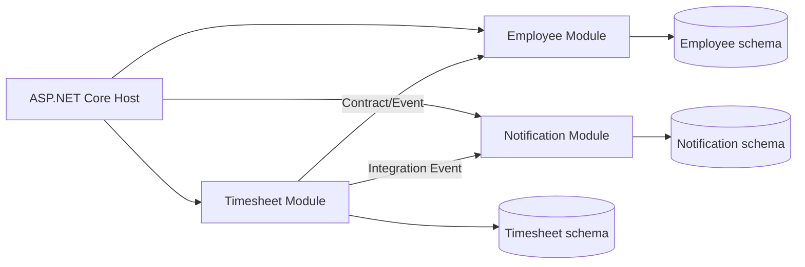
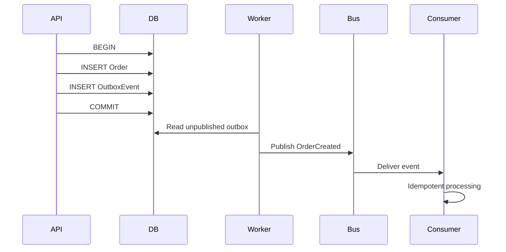
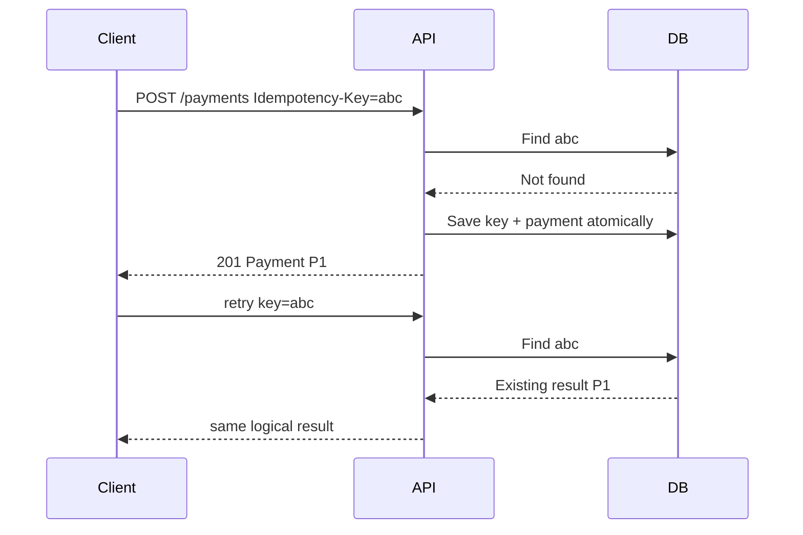
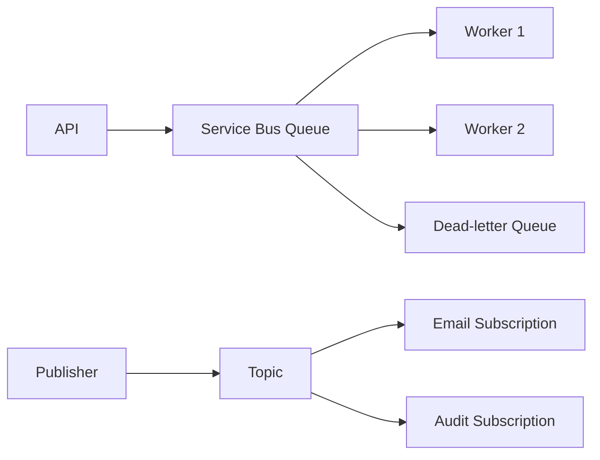
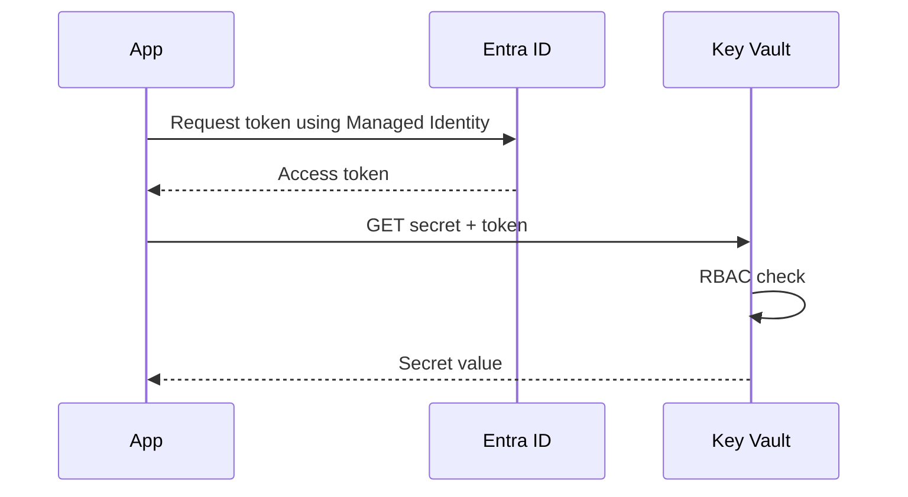
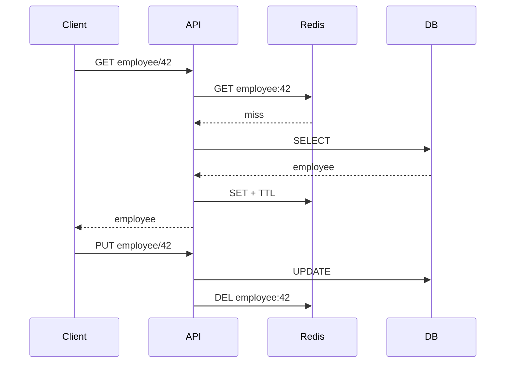
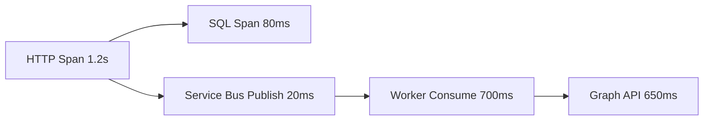
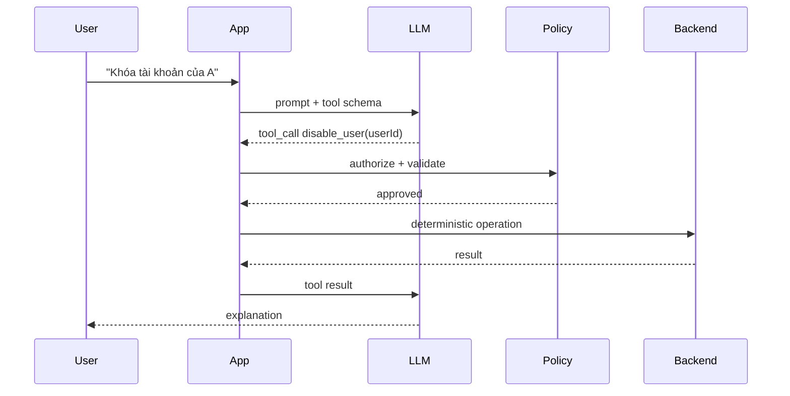
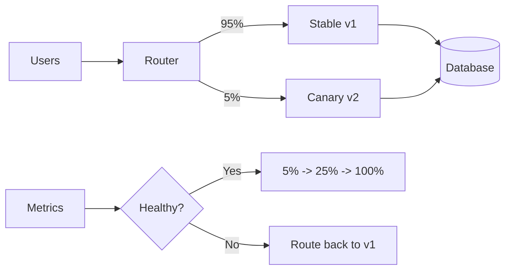

# Daily Knowledge Sharing — 2026-08-19

## Today’s Topics

1. Modular Monolith — ranh giới module và giao dịch nội bộ
2. Event-Driven Architecture — eventual consistency và Outbox Pattern
3. API Idempotency — chống xử lý trùng trong API ghi dữ liệu
4. EF Core Optimistic Concurrency — xử lý lost update đúng cách
5. Azure Service Bus — queue, topic, retry và dead-letter
6. Azure Managed Identity + Key Vault — bỏ secret khỏi ứng dụng
7. Cache Invalidation — thiết kế cache đúng khi dữ liệu thay đổi
8. OpenTelemetry Distributed Tracing — lần theo request xuyên nhiều thành phần
9. LLM Structured Output + Tool Calling — phân chia AI và deterministic code
10. Canary Deployment + Feature Flags — giảm blast radius khi release

---

# 1. Modular Monolith — ranh giới module và giao dịch nội bộ

### 1. What is it?

Modular Monolith vẫn là **một deployable application**, nhưng bên trong được chia thành các module có ranh giới nghiệp vụ rõ ràng như `Identity`, `Timesheet`, `Billing`, `Notification`. Điểm quan trọng không phải số project hay folder mà là **quyền sở hữu dữ liệu, dependency direction và cách module giao tiếp**.

Một module tốt có API nội bộ rõ ràng và không cho module khác tùy tiện truy cập bảng, entity hoặc implementation của nó.

### 2. Why does it exist?

Monolith truyền thống thường xuống cấp vì mọi service gọi mọi repository, entity dùng chung khắp nơi và một thay đổi nhỏ lan qua toàn hệ thống. Microservices giải quyết coupling bằng process/network boundary nhưng mang thêm deployment, observability, messaging và consistency complexity.

Modular Monolith là điểm cân bằng: giữ operational simplicity của monolith nhưng tạo architectural boundaries đủ mạnh để hệ thống lớn lên có kiểm soát.

### 3. How does it work?



Mỗi module sở hữu application logic và persistence của chính nó. Nếu Timesheet cần thông tin Employee, nó gọi public contract của Employee thay vì inject trực tiếp `EmployeeDbContext`.

### 4. Practical example

```csharp
public interface IEmployeeDirectory
{
    Task<EmployeeSummary?> GetAsync(Guid employeeId, CancellationToken ct);
}

internal sealed class EmployeeDirectory(EmployeeDbContext db)
    : IEmployeeDirectory
{
    public Task<EmployeeSummary?> GetAsync(Guid id, CancellationToken ct) =>
        db.Employees
          .Where(x => x.Id == id)
          .Select(x => new EmployeeSummary(x.Id, x.Name, x.IsActive))
          .SingleOrDefaultAsync(ct);
}
```

Timesheet chỉ biết `IEmployeeDirectory` và DTO contract; entity `Employee` vẫn thuộc Employee module.

### 5. Real production scenario

Trong hệ thống employee management, request submit timesheet đi vào Timesheet module. Module kiểm tra employee qua contract, lưu Timesheet, rồi phát `TimesheetSubmitted`. Notification module xử lý event để gửi mail. Nếu sau này Notification tách thành service riêng, contract/event đã tồn tại nên migration dễ hơn nhiều so với việc tháo một tangled monolith.

### 6. Common mistakes

- Chia nhiều project nhưng tất cả cùng dùng một `DbContext` và entity.
- Module A query trực tiếp table của module B.
- Tạo `Shared` project chứa gần toàn bộ domain model.
- Dùng MediatR như cách né dependency nhưng handler vẫn truy cập chéo dữ liệu.
- Tách module quá nhỏ theo technical layer thay vì business capability.

### 7. Trade-offs

**Advantages:** deployment đơn giản, transaction nội bộ dễ, debugging thuận tiện, boundary tốt hơn monolith truyền thống.

**Costs / Risks:** boundary chỉ được enforcement bằng code/convention; team thiếu kỷ luật có thể phá ranh giới. Một process vẫn có shared failure domain và scale chung.

### 8. Junior → Middle → Senior understanding

**Junior:** hiểu module không đồng nghĩa folder và biết không truy cập dữ liệu module khác tùy tiện.

**Middle:** thiết kế public contract, module DI registration, schema ownership và integration event.

**Senior / Technical Lead:** quyết định boundary theo business capability, đánh giá coupling/cohesion và biết module nào thực sự đáng tách thành service.

### 9. Key takeaway

- Modular Monolith là architecture boundary, không phải folder convention.
- Data ownership quan trọng hơn số project.
- Tách service chỉ khi có lý do vận hành hoặc tổ chức đủ mạnh.

---

# 2. Event-Driven Architecture — eventual consistency và Outbox Pattern

### 1. What is it?

Event-Driven Architecture cho phép component phản ứng với sự kiện đã xảy ra, ví dụ `OrderPaid`, `EmployeeDeactivated`, `TimesheetSubmitted`. Producer không cần biết tất cả consumer.

Trong distributed system, event thường dẫn đến **eventual consistency**: các phần của hệ thống không cập nhật đồng thời nhưng hội tụ về trạng thái đúng sau một khoảng thời gian.

### 2. Why does it exist?

Nếu API phải đồng bộ gọi Notification, Reporting, Audit và CRM trước khi trả response, latency và coupling tăng mạnh. Một dependency lỗi có thể làm toàn request thất bại.

Messaging tách lifecycle của producer và consumer, nhưng tạo bài toán mới: làm sao đảm bảo DB commit và message publish không lệch nhau?

### 3. How does it work?



Outbox ghi business data và event vào **cùng local transaction**. Worker publish event sau commit. Điều này tránh trường hợp DB thành công nhưng publish thất bại.

### 4. Practical example

```csharp
await using var tx = await db.Database.BeginTransactionAsync(ct);

var order = Order.Create(request.CustomerId);
db.Orders.Add(order);

db.OutboxMessages.Add(new OutboxMessage
{
    Id = Guid.NewGuid(),
    Type = "OrderCreated",
    Payload = JsonSerializer.Serialize(new { order.Id }),
    CreatedAtUtc = DateTime.UtcNow
});

await db.SaveChangesAsync(ct);
await tx.CommitAsync(ct);
```

Publisher riêng đọc `OutboxMessages` chưa publish và gửi lên message broker.

### 5. Real production scenario

Payment service xác nhận thanh toán và commit `Payment=Succeeded` cùng event. Inventory, Email và Accounting xử lý event độc lập. Email chậm không làm payment API chậm. Nếu broker tạm unavailable, Outbox worker retry sau.

### 6. Common mistakes

- `SaveChangesAsync()` xong mới publish trực tiếp và tin rằng hai thao tác là atomic.
- Giả định message chỉ được deliver đúng một lần.
- Consumer không idempotent.
- Event payload phụ thuộc entity serialization.
- Không có DLQ, replay hoặc monitoring backlog.

### 7. Trade-offs

**Advantages:** loose coupling, resilience, throughput và extensibility tốt.

**Costs / Risks:** eventual consistency, duplicate delivery, ordering, schema evolution, debugging và observability phức tạp hơn synchronous flow.

### 8. Junior → Middle → Senior understanding

**Junior:** phân biệt command và event; hiểu event là việc đã xảy ra.

**Middle:** implement consumer idempotency, retry, Outbox và DLQ handling.

**Senior / Technical Lead:** thiết kế consistency boundary, event contract/versioning, ordering guarantee và recovery strategy.

### 9. Key takeaway

- Event-driven không loại bỏ consistency problem; nó thay đổi cách xử lý consistency.
- Outbox giải quyết dual-write giữa DB và broker.
- Consumer phải giả định duplicate có thể xảy ra.

---

# 3. API Idempotency — chống xử lý trùng trong API ghi dữ liệu

### 1. What is it?

Một operation idempotent cho phép cùng một logical request được gửi nhiều lần nhưng side effect chỉ xảy ra như mong muốn một lần. Đây là đặc tính cực kỳ quan trọng với payment, booking, provisioning và integration API.

### 2. Why does it exist?

Client timeout không chứng minh server chưa xử lý. Nếu client retry `POST /payments`, server có thể charge hai lần. Network failure tạo trạng thái mơ hồ: response mất nhưng side effect đã commit.

### 3. How does it work?



Key phải gắn với caller và request semantics. Server nên lưu request hash/result/status trong transaction phù hợp.

### 4. Practical example

```csharp
public sealed class IdempotencyRecord
{
    public required string Key { get; init; }
    public required string RequestHash { get; init; }
    public required string ResponseJson { get; set; }
}
```

SQL cần unique constraint:

```sql
CREATE UNIQUE INDEX UX_Idempotency_Key
ON IdempotencyRecords(ClientId, [Key]);
```

Unique index là lớp bảo vệ cuối cùng khi hai request cùng đến đồng thời.

### 5. Real production scenario

Mobile app gọi API tạo order, mạng 4G timeout và retry. Cả hai request dùng cùng key. Request đầu tạo order; request sau nhận lại order đó thay vì tạo order thứ hai.

### 6. Common mistakes

- Chỉ kiểm tra `if exists` rồi insert mà không có unique constraint.
- Dùng random key mới cho mỗi retry.
- Cùng key nhưng request body khác mà server vẫn trả kết quả cũ.
- Lưu idempotency record sau business transaction.
- Giữ key vô thời hạn mà không có retention policy.

### 7. Trade-offs

**Advantages:** retry an toàn và UX tốt hơn trong unreliable network.

**Costs / Risks:** thêm storage, transaction logic, cleanup và concurrency handling. Không phải endpoint nào cũng cần cơ chế này.

### 8. Junior → Middle → Senior understanding

**Junior:** hiểu retry có thể tạo duplicate side effect.

**Middle:** implement key storage, unique constraint và request fingerprint.

**Senior / Technical Lead:** xác định idempotency scope, retention, atomic boundary và behavior khi request cùng key nhưng payload khác.

### 9. Key takeaway

- Timeout không có nghĩa operation thất bại.
- Idempotency phải được bảo vệ ở persistence/concurrency layer.
- Retry policy và idempotency phải được thiết kế cùng nhau.

---

# 4. EF Core Optimistic Concurrency — xử lý lost update đúng cách

### 1. What is it?

Optimistic concurrency cho phép nhiều request đọc cùng record nhưng phát hiện khi một request đang update dữ liệu đã bị request khác thay đổi. Nó phù hợp khi conflict tương đối hiếm.

### 2. Why does it exist?

Hai admin cùng mở Employee. A đổi department, B đổi status. Nếu B save entity cũ sau A, B có thể vô tình ghi đè thay đổi của A — **lost update**.

### 3. How does it work?

SQL Server `rowversion` thay đổi mỗi lần row update. EF Core đưa token vào điều kiện `UPDATE`:

```sql
UPDATE Employees
SET Status = @status
WHERE Id = @id AND RowVersion = @originalVersion;
```

Nếu affected rows = 0, EF Core ném `DbUpdateConcurrencyException`.

### 4. Practical example

```csharp
public class Employee
{
    public Guid Id { get; set; }
    public string Status { get; set; } = null!;

    [Timestamp]
    public byte[] RowVersion { get; set; } = null!;
}

try
{
    await db.SaveChangesAsync(ct);
}
catch (DbUpdateConcurrencyException)
{
    return Results.Conflict(new
    {
        message = "Employee was modified by another request. Reload and retry."
    });
}
```

API có thể expose version qua DTO/ETag thay vì che giấu conflict.

### 5. Real production scenario

Portal HR cho nhiều admin chỉnh employee. Thay vì silently overwrite, API trả `409 Conflict`; UI reload latest state và cho người dùng quyết định merge.

### 6. Common mistakes

- Catch exception rồi tự động retry với entity cũ, thực chất vẫn overwrite.
- Không gửi concurrency token từ client cho disconnected update.
- Dùng pessimistic lock cho form người dùng mở hàng phút.
- Cho rằng EF tracking tự ngăn lost update.

### 7. Trade-offs

**Advantages:** không giữ DB lock dài; scale tốt khi conflict hiếm.

**Costs / Risks:** application phải xử lý conflict; UX merge có thể phức tạp. Với high-contention counter, optimistic retry có thể rất tốn kém.

### 8. Junior → Middle → Senior understanding

**Junior:** hiểu hai request có thể update cùng record.

**Middle:** cấu hình concurrency token và xử lý `DbUpdateConcurrencyException`.

**Senior / Technical Lead:** quyết định conflict policy: reject, merge, client-wins hay server-wins dựa trên business semantics.

### 9. Key takeaway

- Concurrency conflict là business condition, không chỉ technical exception.
- Đừng tự động retry nếu chưa xác định merge semantics.
- `rowversion` + `409 Conflict` là baseline tốt cho nhiều CRUD system.

---

# 5. Azure Service Bus — queue, topic, retry và dead-letter

### 1. What is it?

Azure Service Bus là managed enterprise message broker. Queue phù hợp point-to-point competing consumers; Topic/Subscription phù hợp publish-subscribe khi nhiều consumer cần cùng event.

### 2. Why does it exist?

Synchronous HTTP chain khiến producer phụ thuộc availability và latency của consumer. Service Bus tạo durable buffer giữa hai bên, hỗ trợ retry, lock, dead-letter và routing.

### 3. How does it work?



Với Peek-Lock, consumer nhận message nhưng message chưa bị xóa. Xử lý thành công thì `Complete`; lỗi transient có thể `Abandon`; poison message cuối cùng vào DLQ.

### 4. Practical example

```csharp
var processor = client.CreateProcessor("emails");

processor.ProcessMessageAsync += async args =>
{
    var command = args.Message.Body.ToObjectFromJson<SendEmail>();
    await sender.SendAsync(command, args.CancellationToken);
    await args.CompleteMessageAsync(args.Message);
};

processor.ProcessErrorAsync += args =>
{
    logger.LogError(args.Exception, "Service Bus processing failed");
    return Task.CompletedTask;
};
```

### 5. Real production scenario

Offboarding API enqueue `DeactivateMailbox`. Worker gọi Exchange Online. Nếu Exchange throttling, message retry thay vì giữ HTTP request mở. Poison message sau nhiều lần thất bại vào DLQ để operator điều tra.

### 6. Common mistakes

- Retry vô hạn mà không phân loại transient/permanent failure.
- Không monitor DLQ.
- Message handler không idempotent.
- Lock duration ngắn hơn processing nhưng không renew.
- Đưa payload quá lớn thay vì lưu blob và gửi reference.

### 7. Trade-offs

**Advantages:** durable buffering, decoupling, burst absorption, managed operations.

**Costs / Risks:** eventual consistency, duplicate processing, broker cost và thêm operational surface.

### 8. Junior → Middle → Senior understanding

**Junior:** biết Queue khác Topic và hiểu Complete/Retry/DLQ.

**Middle:** cấu hình processor, concurrency, retry, idempotency và telemetry.

**Senior / Technical Lead:** thiết kế topology, ordering/session, throughput, poison-message recovery và disaster strategy.

### 9. Key takeaway

- Queue không biến processing thành exactly-once.
- DLQ là production workflow, không phải thùng rác.
- Message handler phải chịu được retry và duplicate.

---

# 6. Azure Managed Identity + Key Vault — bỏ secret khỏi ứng dụng

### 1. What is it?

Managed Identity cung cấp identity do Azure quản lý cho workload. Key Vault lưu secret/key/certificate. Kết hợp hai thứ cho phép app truy cập tài nguyên mà không hard-code client secret.

### 2. Why does it exist?

Secret trong `appsettings.json`, pipeline variable hoặc environment vẫn phải rotate, bảo vệ và phân phối. Secret càng được copy nhiều nơi thì blast radius càng lớn.

### 3. How does it work?



Trong production, Azure workload lấy token từ platform identity endpoint. Local development có thể dùng developer credential qua `DefaultAzureCredential`.

### 4. Practical example

```csharp
var credential = new DefaultAzureCredential();
var client = new SecretClient(
    new Uri("https://my-vault.vault.azure.net/"),
    credential);

KeyVaultSecret secret = await client.GetSecretAsync("Graph-Certificate-Password");
```

Tốt hơn nữa: nếu downstream resource hỗ trợ Entra authentication trực tiếp, app nên dùng Managed Identity thẳng tới resource và **không cần secret trong Key Vault**.

### 5. Real production scenario

Azure Function cần đọc Blob Storage và Key Vault. Function có system-assigned identity; RBAC chỉ cấp `Storage Blob Data Reader` và quyền đọc secret cần thiết. Không có storage account key trong config.

### 6. Common mistakes

- Cho identity role `Owner` vì “cho nhanh”.
- Dùng Key Vault để lưu password trong khi resource đã hỗ trợ Managed Identity.
- Public network mở rộng không cần thiết.
- Không cache secret hợp lý khiến mỗi request gọi Key Vault.
- Không audit access và rotation.

### 7. Trade-offs

**Advantages:** giảm secret management, rotation và credential leakage.

**Costs / Risks:** phụ thuộc Entra/RBAC, local-vs-cloud credential behavior cần hiểu rõ; network/private endpoint có thể làm deployment phức tạp hơn.

### 8. Junior → Middle → Senior understanding

**Junior:** không commit secret và hiểu identity khác secret.

**Middle:** cấu hình `DefaultAzureCredential`, RBAC và Key Vault integration.

**Senior / Technical Lead:** thiết kế least privilege, identity topology, network isolation, rotation và break-glass strategy.

### 9. Key takeaway

- Ưu tiên identity-based access trước secret-based access.
- Key Vault bảo vệ secret; Managed Identity giúp loại bỏ nhiều secret hoàn toàn.
- Least privilege vẫn bắt buộc.

---

# 7. Cache Invalidation — thiết kế cache đúng khi dữ liệu thay đổi

### 1. What is it?

Cache invalidation là chiến lược đảm bảo cached data không tồn tại sai quá lâu sau khi source of truth thay đổi. Đây thường là phần khó hơn việc “thêm Redis”.

### 2. Why does it exist?

Cache tăng performance bằng cách phục vụ bản sao. Nhưng ngay khi DB thay đổi, ta có hai state. Nếu không có consistency strategy, người dùng thấy dữ liệu cũ hoặc business logic chạy trên stale state.

### 3. How does it work?

Cache-aside phổ biến:



Có thể kết hợp TTL, explicit invalidation và event-driven invalidation giữa nhiều service.

### 4. Practical example

```csharp
public async Task UpdateEmployeeAsync(Employee employee, CancellationToken ct)
{
    db.Employees.Update(employee);
    await db.SaveChangesAsync(ct);

    await cache.RemoveAsync($"employee:{employee.Id}", ct);
}
```

Với critical consistency, cần cân nhắc race giữa DB update và cache delete, hoặc dùng versioned keys/event invalidation.

### 5. Real production scenario

Employee profile được đọc hàng nghìn lần nhưng update hiếm. Cache TTL 10 phút giảm DB load; update endpoint chủ động invalidate. Nếu Redis down, API fallback DB thay vì làm toàn hệ thống unavailable.

### 6. Common mistakes

- Cache dữ liệu authorization quá lâu.
- Không có TTL.
- Invalidate một key nhưng quên list/search cache liên quan.
- Cache null quá lâu.
- Redis outage biến thành API outage vì không có fallback.
- Cache stampede khi key hot hết hạn đồng thời.

### 7. Trade-offs

**Advantages:** latency thấp và giảm database load.

**Costs / Risks:** stale data, complexity, memory cost và failure mode mới. Strong consistency thường làm caching khó hoặc ít lợi hơn.

### 8. Junior → Middle → Senior understanding

**Junior:** hiểu cache là bản sao, DB thường là source of truth.

**Middle:** implement cache-aside, TTL, invalidation và fallback.

**Senior / Technical Lead:** chọn consistency model, xử lý stampede, multi-region invalidation và đánh giá dữ liệu nào không nên cache.

### 9. Key takeaway

- Trước khi cache, hãy định nghĩa acceptable staleness.
- TTL là safety net, không phải toàn bộ invalidation strategy.
- Cache failure không nên mặc định trở thành application failure.

---

# 8. OpenTelemetry Distributed Tracing — lần theo request xuyên nhiều thành phần

### 1. What is it?

Distributed tracing biểu diễn một request bằng trace gồm nhiều span. OpenTelemetry cung cấp chuẩn và SDK vendor-neutral để thu thập traces, metrics và logs correlation.

### 2. Why does it exist?

Trong hệ thống API → Service Bus → Worker → Graph API → Database, log riêng lẻ khó trả lời “request này chậm ở đâu?”. Correlation ID thủ công giúp một phần nhưng thiếu timing hierarchy và standardized context propagation.

### 3. How does it work?



Trace context được truyền qua HTTP headers hoặc message metadata. Backend như Application Insights/Jaeger hiển thị dependency tree và duration.

### 4. Practical example

```csharp
builder.Services.AddOpenTelemetry()
    .WithTracing(t => t
        .AddAspNetCoreInstrumentation()
        .AddHttpClientInstrumentation()
        .AddEntityFrameworkCoreInstrumentation()
        .AddOtlpExporter());
```

Custom span:

```csharp
using var activity = MyActivitySource.StartActivity("ProcessOffboarding");
activity?.SetTag("employee.id", employeeId);
```

Không đưa PII hoặc secret tùy tiện vào tags.

### 5. Real production scenario

Incident: API p95 tăng từ 400ms lên 3s. Trace cho thấy SQL vẫn 70ms nhưng Microsoft Graph span 2.4s. Team tập trung timeout/retry/throttling của integration thay vì tối ưu DB sai chỗ.

### 6. Common mistakes

- Trace mọi thứ 100% ở traffic lớn mà không tính telemetry cost.
- Không propagate context qua message queue.
- Tag chứa token, email hoặc dữ liệu nhạy cảm.
- Có traces nhưng không correlate logs.
- Alert theo từng exception thay vì SLO/user impact.

### 7. Trade-offs

**Advantages:** root-cause nhanh, dependency latency rõ, vendor-neutral instrumentation.

**Costs / Risks:** telemetry volume/cost, sampling và instrumentation overhead; trace sai context tạo dữ liệu gây hiểu nhầm.

### 8. Junior → Middle → Senior understanding

**Junior:** hiểu trace/span và correlation.

**Middle:** instrument HTTP, DB, queue và custom operations; biết đọc waterfall.

**Senior / Technical Lead:** thiết kế sampling, telemetry governance, cardinality và observability dựa trên SLO.

### 9. Key takeaway

- Logs nói “điều gì”; traces rất mạnh trong việc chỉ “nó xảy ra ở đâu trong request flow”.
- Context propagation là nền tảng của distributed tracing.
- Telemetry phải được thiết kế cả về privacy lẫn cost.

---

# 9. LLM Structured Output + Tool Calling — phân chia AI và deterministic code

### 1. What is it?

Structured Output buộc model trả dữ liệu theo schema thay vì prose tự do. Tool Calling cho phép model **đề xuất** gọi một capability có schema; application thực thi tool và trả result lại cho model.

Điểm kiến trúc quan trọng: model nên xử lý interpretation/reasoning phù hợp, còn authorization, validation, transaction và irreversible side effect phải do deterministic code kiểm soát.

### 2. Why does it exist?

Parsing text kiểu “hãy trả JSON” rất dễ vỡ. Đồng thời cho LLM tự tạo SQL, URL hoặc command rồi execute trực tiếp là rủi ro security và correctness.

### 3. How does it work?



LLM không sở hữu quyền. Application là policy enforcement point.

### 4. Practical example

```csharp
public sealed record DisableUserArgs(Guid UserId, string Reason);

public async Task<ToolResult> DisableUserAsync(
    DisableUserArgs args,
    ClaimsPrincipal actor,
    CancellationToken ct)
{
    if (!actor.IsInRole("Admin"))
        return ToolResult.Forbidden();

    if (string.IsNullOrWhiteSpace(args.Reason))
        return ToolResult.Invalid("Reason is required");

    return await accountService.DisableAsync(args.UserId, args.Reason, ct);
}
```

Schema validation và authorization vẫn chạy dù model “rất chắc chắn”.

### 5. Real production scenario

AI assistant cho HR đọc request tự nhiên và đề xuất action. Với thao tác read-only có thể execute tự động. Với `disable account`, `delete mailbox`, `send email`, hệ thống yêu cầu human approval và audit log trước execution.

### 6. Common mistakes

- Tin tool arguments vì chúng đến từ model.
- Cho model chọn authorization scope.
- Tool quá mạnh như `ExecuteSql(string sql)` hoặc `RunShell(string command)`.
- Retry side-effecting tool mà không idempotency.
- Log toàn prompt chứa PII/secret.
- Không giới hạn tool call count, token hoặc timeout.

### 7. Trade-offs

**Advantages:** integration ổn định hơn free-form text, mở rộng workflow AI và dễ validate.

**Costs / Risks:** schema/versioning, tool security, latency, model cost và nondeterministic planning vẫn tồn tại.

### 8. Junior → Middle → Senior understanding

**Junior:** hiểu model output không phải trusted input.

**Middle:** implement schema validation, tool registry, timeout và error handling.

**Senior / Technical Lead:** thiết kế trust boundary, approval policy, least-privilege tools, auditability, evaluation và cost controls.

### 9. Key takeaway

- LLM quyết định “đề xuất gì”; code quyết định “có được phép và thực thi thế nào”.
- Tool arguments phải được validate như external input.
- Side effect cần authorization, idempotency và audit.

---

# 10. Canary Deployment + Feature Flags — giảm blast radius khi release

### 1. What is it?

Canary Deployment đưa version mới tới một phần nhỏ traffic trước khi mở rộng. Feature Flag tách **code deployment** khỏi **feature release**, cho phép bật/tắt behavior mà không redeploy.

### 2. Why does it exist?

Test environment không tái hiện hoàn toàn production traffic, data và integration. Big-bang release khiến một bug ảnh hưởng 100% người dùng ngay lập tức.

### 3. How does it work?



Feature flag có thể target tenant/user/cohort. Canary nên có automated health criteria như error rate, latency và business KPI.

### 4. Practical example

```csharp
if (await featureManager.IsEnabledAsync("NewTimesheetApproval"))
{
    return await newFlow.HandleAsync(request, ct);
}

return await legacyFlow.HandleAsync(request, ct);
```

Database migration phải backward-compatible trong thời gian v1 và v2 cùng chạy. Ví dụ: add nullable column trước, deploy code đọc cả hai version, backfill, rồi mới enforce constraint ở release sau.

### 5. Real production scenario

SaaS triển khai approval engine mới cho 5% tenant. Dashboard theo dõi `5xx`, p95 latency và tỷ lệ approval failure. Khi failure vượt threshold, traffic quay về v1 và flag bị tắt mà không cần rollback database ngay lập tức.

### 6. Common mistakes

- Canary nhưng cả v1/v2 dùng migration breaking.
- Chỉ nhìn CPU thay vì user-facing metrics.
- Feature flag tồn tại nhiều năm thành permanent branching logic.
- Rollback code nhưng database schema không backward-compatible.
- Không test cả flag ON và OFF.

### 7. Trade-offs

**Advantages:** blast radius nhỏ, rollback nhanh, release có dữ liệu thực tế.

**Costs / Risks:** phải vận hành song song nhiều behavior/version, test matrix lớn hơn, flag debt và migration complexity.

### 8. Junior → Middle → Senior understanding

**Junior:** phân biệt deploy code với release feature.

**Middle:** implement flag, telemetry và backward-compatible changes.

**Senior / Technical Lead:** thiết kế rollout criteria, automated rollback, database expand-contract migration và flag lifecycle governance.

### 9. Key takeaway

- Canary chỉ an toàn khi có telemetry và rollback path.
- Feature Flag không thay thế source control; flag cần owner và expiry.
- Database compatibility thường là phần khó nhất của zero/low-downtime release.
