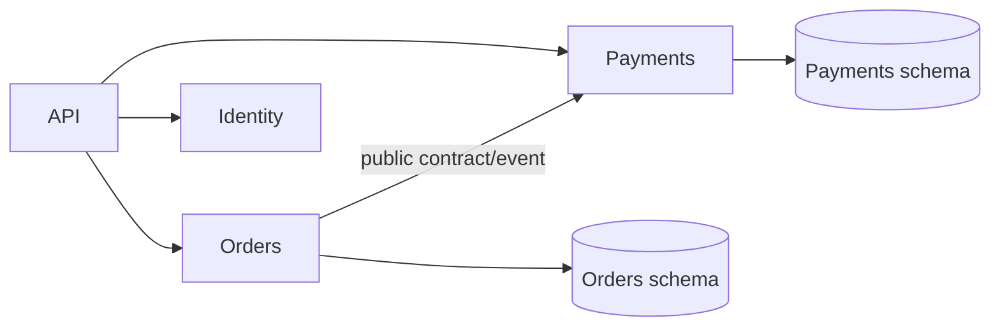
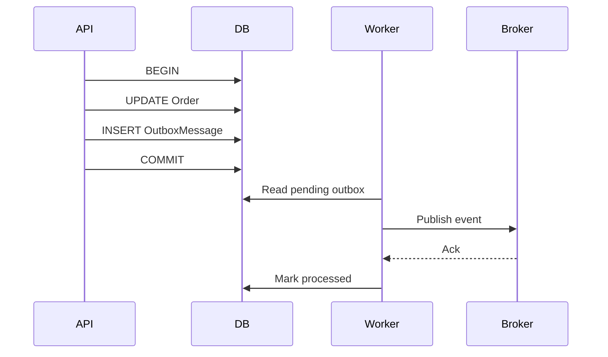
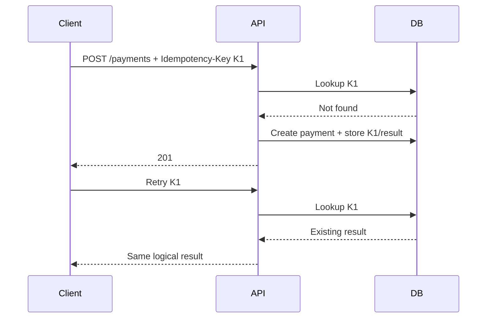
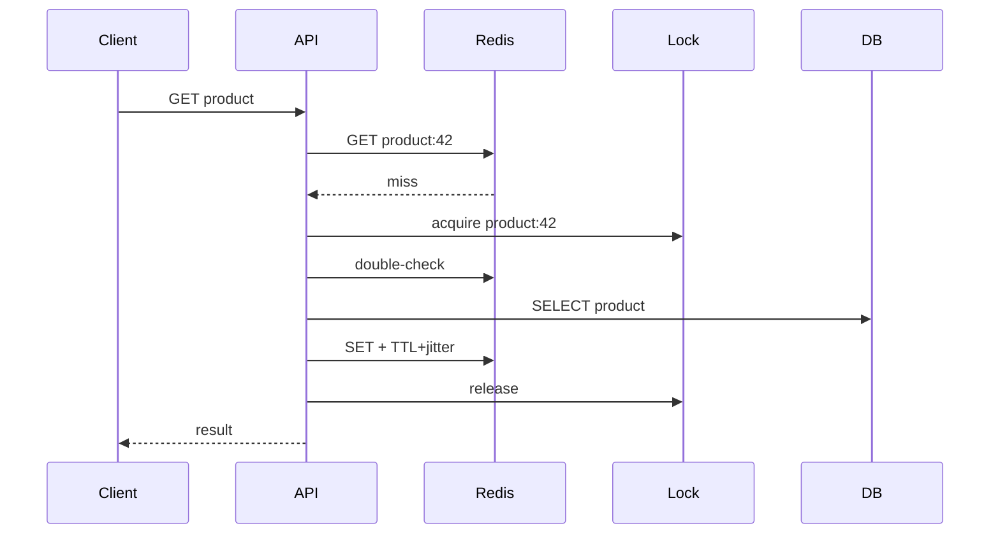
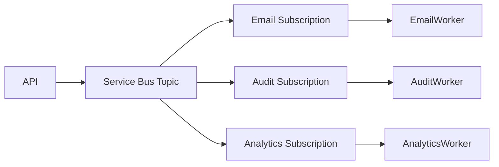
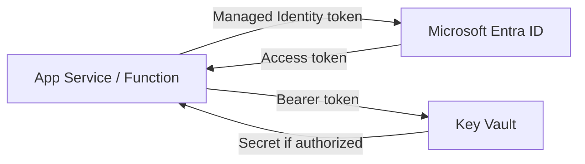
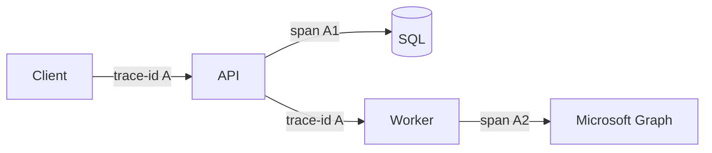
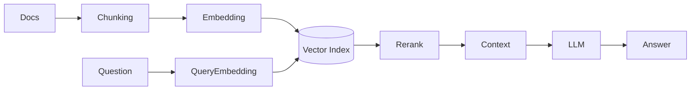
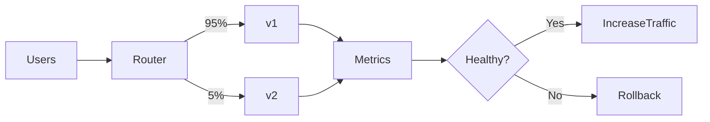

# Daily Knowledge Sharing — 2026-08-19

## Today’s Topics

1. Modular Monolith và ranh giới module
2. Event-Driven Architecture và transactional outbox
3. Idempotency cho API ghi dữ liệu
4. Optimistic Concurrency với EF Core
5. Cache Aside và chống cache stampede
6. Azure Service Bus: queue, topic và xử lý message an toàn
7. Managed Identity + Azure Key Vault
8. OpenTelemetry và distributed tracing
9. RAG: retrieval, grounding và kiểm soát chất lượng
10. Canary Deployment và Feature Flags

---

# 1. Modular Monolith và ranh giới module

### 1. What is it?

Modular Monolith vẫn là một ứng dụng deploy như một đơn vị, nhưng code được chia thành các module nghiệp vụ có boundary rõ ràng. Điểm quan trọng không phải folder đẹp mà là module không tùy tiện đọc bảng, entity hoặc service nội bộ của module khác.

Một module thường sở hữu use case, domain model, persistence và public contract của chính nó. Ví dụ `Orders` không nên truy cập trực tiếp `PaymentsDbContext`; nó giao tiếp qua contract hoặc event.

### 2. Why does it exist?

Monolith truyền thống dễ biến thành “big ball of mud”: mọi service gọi nhau, database dùng chung vô kỷ luật, thay đổi một chức năng gây regression nơi khác. Microservices giải coupling ở deployment level nhưng thêm network, eventual consistency, observability và operational cost.

Modular Monolith là điểm cân bằng: giữ deployment đơn giản nhưng ép kiến trúc có boundary đủ tốt để sau này tách service nếu thực sự cần.

### 3. How does it work?



Dependency nên đi qua public contract. Module có thể cùng process và thậm chí cùng database server, nhưng ownership dữ liệu vẫn phải rõ.

### 4. Practical example

```csharp
public interface IPaymentGateway
{
    Task<PaymentResult> AuthorizeAsync(
        Guid orderId, decimal amount, CancellationToken ct);
}

public sealed class CheckoutService(IPaymentGateway payments)
{
    public Task<PaymentResult> CheckoutAsync(Order order, CancellationToken ct)
        => payments.AuthorizeAsync(order.Id, order.Total, ct);
}
```

`Orders` biết contract, không biết bảng hoặc implementation nội bộ của `Payments`.

### 5. Real production scenario

Trong SaaS quản lý nhân sự, các module Employee, Timesheet, Leave và Notification chạy chung ASP.NET Core application. Leave phát `LeaveApproved`; Timesheet và Notification phản ứng theo contract thay vì query chéo bảng của Leave. Khi Notification cần scale riêng, boundary đã đủ sạch để tách dần.

### 6. Common mistakes

- Chỉ chia project/folder nhưng vẫn query chéo database.
- Tạo `Shared` project chứa gần như toàn bộ domain model.
- Mọi module dùng chung một repository generic.
- Dùng event cho cả những lời gọi cần kết quả đồng bộ.
- Tách module quá nhỏ theo technical layer thay vì business capability.

### 7. Trade-offs

**Advantages:** deployment đơn giản, transaction local dễ hơn microservices, refactor và test boundary tốt hơn monolith hỗn loạn.

**Costs / Risks:** cần discipline; process vẫn là shared failure domain; scale độc lập từng module không trực tiếp; boundary sai sẽ tạo coupling ẩn.

### 8. Junior → Middle → Senior understanding

**Junior:** hiểu module là boundary nghiệp vụ chứ không chỉ folder.

**Middle:** biết thiết kế public contract, dependency direction và ngăn query chéo ownership.

**Senior / Technical Lead:** quyết định granularity module, transaction boundary, communication style và tiêu chí thực sự để tách thành service.

### 9. Key takeaway

- Modular Monolith tối ưu cho boundary trước khi tối ưu deployment.
- Data ownership quan trọng hơn số lượng project.
- Microservices không sửa được boundary nghiệp vụ thiết kế sai.

---

# 2. Event-Driven Architecture và Transactional Outbox

### 1. What is it?

Event-Driven Architecture cho phép component phản ứng với sự kiện đã xảy ra, ví dụ `OrderPaid`. Transactional Outbox giải bài toán nguy hiểm: database commit thành công nhưng publish message thất bại.

### 2. Why does it exist?

Đoạn code kiểu `SaveChangesAsync(); PublishAsync();` có hai side effect độc lập. Process có thể crash giữa hai lệnh. Khi đó Order đã Paid nhưng downstream không bao giờ nhận event.

### 3. How does it work?



Business change và outbox record nằm trong cùng local transaction. Worker publish sau. Consumer vẫn phải idempotent vì broker/outbox có thể redeliver.

### 4. Practical example

```csharp
await using var tx = await db.Database.BeginTransactionAsync(ct);
order.MarkPaid();

db.OutboxMessages.Add(new OutboxMessage
{
    Id = Guid.NewGuid(),
    Type = "OrderPaid",
    Payload = JsonSerializer.Serialize(new { order.Id }),
    OccurredAtUtc = DateTime.UtcNow
});

await db.SaveChangesAsync(ct);
await tx.CommitAsync(ct);
```

### 5. Real production scenario

Payment API ghi `PaymentSucceeded` và outbox trong một transaction. Worker publish lên Azure Service Bus. Invoice, Email và Loyalty xử lý độc lập. Nếu Service Bus downtime, outbox giữ event để retry thay vì mất dữ liệu.

### 6. Common mistakes

- Xóa outbox trước khi broker ack.
- Không có index cho pending messages.
- Không cleanup/archive outbox.
- Tin rằng outbox tạo exactly-once delivery.
- Consumer không deduplicate.

### 7. Trade-offs

**Advantages:** loại bỏ dual-write gap, tăng khả năng recovery, decouple producer khỏi broker availability.

**Costs / Risks:** eventual consistency, duplicate delivery, worker/cleanup/monitoring phức tạp hơn.

### 8. Junior → Middle → Senior understanding

**Junior:** hiểu event là “fact đã xảy ra”.

**Middle:** implement outbox, retry, deduplication và worker.

**Senior / Technical Lead:** thiết kế delivery semantics, ordering, retention, schema evolution và recovery khi backlog tăng mạnh.

### 9. Key takeaway

- Database + broker không phải một atomic transaction mặc định.
- Outbox bảo vệ atomicity của business state và intent-to-publish.
- Consumer idempotency vẫn bắt buộc.

---

# 3. Idempotency cho API ghi dữ liệu

### 1. What is it?

Một operation idempotent có thể được gửi lặp lại nhưng không tạo thêm business effect ngoài lần đầu. Đây là yêu cầu quan trọng cho payment, booking và các API mà client có thể retry.

### 2. Why does it exist?

Client timeout không biết server đã commit hay chưa. Nếu retry `POST /payments` một cách ngây thơ, server có thể charge hai lần.

### 3. How does it work?



Key cần unique constraint. Với cùng key nhưng payload khác, nên reject thay vì âm thầm trả kết quả cũ.

### 4. Practical example

```csharp
var existing = await db.IdempotencyRecords
    .SingleOrDefaultAsync(x => x.Key == key, ct);
if (existing is not null)
    return Results.Content(existing.ResponseJson, "application/json");

// Production: create business record + idempotency record in one transaction.
```

Database unique index là lớp bảo vệ cuối cùng trước concurrent duplicate requests.

### 5. Real production scenario

Mobile app gửi timesheet approval qua mạng yếu. Request server commit nhưng response mất. App retry cùng key. API trả kết quả lần đầu thay vì approve hoặc gửi notification lần hai.

### 6. Common mistakes

- Chỉ giữ key trong memory của một instance.
- Check rồi insert nhưng không có unique constraint.
- Không hash/validate payload.
- Retention quá ngắn.
- Dùng retry cho operation không idempotent mà không có protection.

### 7. Trade-offs

**Advantages:** retry an toàn, UX ổn định hơn, giảm duplicate side effects.

**Costs / Risks:** cần storage, TTL, concurrency control và định nghĩa semantics rõ.

### 8. Junior → Middle → Senior understanding

**Junior:** phân biệt HTTP retry với business idempotency.

**Middle:** implement key store, transaction và unique constraint.

**Senior / Technical Lead:** quyết định scope key, retention, payload fingerprint, cross-region behavior và reconciliation.

### 9. Key takeaway

- Timeout không đồng nghĩa request thất bại.
- Idempotency phải bảo vệ business effect, không chỉ HTTP response.
- Unique constraint thường quan trọng hơn một `if` trong code.

---

# 4. Optimistic Concurrency với EF Core

### 1. What is it?

Optimistic Concurrency giả định conflict hiếm nên không khóa record suốt thời gian user chỉnh sửa. Khi update, hệ thống kiểm tra version mà client đã đọc còn hiện hành hay không.

### 2. Why does it exist?

Hai admin cùng đọc Employee version 5. A đổi Department, B đổi Manager. Nếu update cuối ghi đè toàn record, thay đổi của A có thể bị mất mà không ai biết.

### 3. How does it work?

SQL logic tương đương:

```sql
UPDATE Employees
SET ManagerId = @manager, RowVersion = @newVersion
WHERE Id = @id AND RowVersion = @originalVersion;
```

Nếu affected rows = 0, dữ liệu đã thay đổi và EF Core ném `DbUpdateConcurrencyException`.

### 4. Practical example

```csharp
public class Employee
{
    public int Id { get; set; }
    public string Name { get; set; } = null!;
    [Timestamp]
    public byte[] RowVersion { get; set; } = null!;
}

try
{
    await db.SaveChangesAsync(ct);
}
catch (DbUpdateConcurrencyException)
{
    return Results.Conflict(new { message = "Data was changed by another user." });
}
```

### 5. Real production scenario

Portal HR cho nhiều admin chỉnh cùng employee. API trả version cho UI. Update gửi lại version. Conflict trả `409 Conflict`, UI tải dữ liệu mới và yêu cầu user merge thay vì silent overwrite.

### 6. Common mistakes

- Catch exception rồi retry update mù quáng.
- Không trả concurrency token ra client.
- Dùng timestamp thời gian với precision không phù hợp thay cho version token.
- Overwrite toàn entity từ DTO.

### 7. Trade-offs

**Advantages:** không giữ long-lived lock, throughput tốt khi conflict hiếm.

**Costs / Risks:** client phải xử lý conflict; logic merge có thể khó; workload conflict cao sẽ retry nhiều.

### 8. Junior → Middle → Senior understanding

**Junior:** hiểu lost update.

**Middle:** cấu hình token, xử lý `DbUpdateConcurrencyException` và HTTP 409.

**Senior / Technical Lead:** quyết định conflict policy: reject, merge, retry hay domain-specific resolution.

### 9. Key takeaway

- Optimistic concurrency phát hiện lost update thay vì khóa mọi thứ.
- Conflict là business scenario, không chỉ exception kỹ thuật.
- Không auto-retry nếu retry có thể ghi đè quyết định của người khác.

---

# 5. Cache Aside và chống Cache Stampede

### 1. What is it?

Cache Aside để application tự đọc cache trước, cache miss thì đọc database và populate cache. Cache stampede xảy ra khi key hot hết hạn và hàng trăm request cùng đánh database.

### 2. Why does it exist?

Caching giảm latency và DB load, nhưng TTL đồng loạt có thể biến cache thành “traffic amplifier” đúng lúc key hết hạn.

### 3. How does it work?



Các kỹ thuật: per-key lock/single-flight, TTL jitter, stale-while-revalidate và negative caching có kiểm soát.

### 4. Practical example

```csharp
var value = await cache.GetStringAsync(key, ct);
if (value is not null)
    return JsonSerializer.Deserialize<ProductDto>(value)!;

var product = await db.Products.AsNoTracking()
    .Where(x => x.Id == id)
    .Select(x => new ProductDto(x.Id, x.Name, x.Price))
    .SingleAsync(ct);

await cache.SetStringAsync(key, JsonSerializer.Serialize(product),
    new DistributedCacheEntryOptions
    {
        AbsoluteExpirationRelativeToNow = TimeSpan.FromMinutes(5)
    }, ct);
return product;
```

Production nên bổ sung single-flight/distributed lock và TTL jitter cho hot keys.

### 5. Real production scenario

Catalog API có product hot nhận 5.000 RPS. Nếu cache hết hạn đúng phút, DB connection pool có thể cạn. Single-flight khiến chỉ một request rebuild cache, các request khác chờ hoặc dùng stale value.

### 6. Common mistakes

- TTL giống nhau cho hàng nghìn key.
- Cache object cực lớn.
- Cache dữ liệu authorization nhạy cảm sai scope.
- Redis lỗi thì toàn API lỗi thay vì degrade có kiểm soát.
- Invalidate thiếu sau write.

### 7. Trade-offs

**Advantages:** latency thấp, giảm DB load.

**Costs / Risks:** stale data, invalidation phức tạp, Redis trở thành dependency và thêm failure mode.

### 8. Junior → Middle → Senior understanding

**Junior:** hiểu hit/miss/TTL.

**Middle:** implement invalidation, fallback và stampede protection.

**Senior / Technical Lead:** chọn consistency model, cache topology, memory budget, hot-key strategy và degradation behavior.

### 9. Key takeaway

- Cache hit ratio cao chưa đủ; phải quan sát behavior lúc expiry.
- TTL jitter và single-flight rất hữu ích cho hot data.
- Thiết kế trước điều gì xảy ra khi Redis unavailable.

---

# 6. Azure Service Bus: Queue, Topic và xử lý message an toàn

### 1. What is it?

Azure Service Bus là managed message broker. Queue phù hợp competing consumers; Topic + Subscription phù hợp publish/subscribe khi nhiều consumer cần cùng một event.

### 2. Why does it exist?

Gọi HTTP đồng bộ xuyên nhiều hệ thống làm latency cộng dồn và failure lan truyền. Broker buffer workload và tách lifecycle producer/consumer.

### 3. How does it work?



Peek-lock cho consumer thời gian xử lý rồi `Complete`; lỗi tạm thời có thể abandon/retry; poison message cuối cùng vào dead-letter queue.

### 4. Practical example

```csharp
processor.ProcessMessageAsync += async args =>
{
    var evt = args.Message.Body.ToObjectFromJson<EmployeeChanged>();
    await handler.HandleAsync(evt, args.CancellationToken);
    await args.CompleteMessageAsync(args.Message, args.CancellationToken);
};
```

Handler phải idempotent vì redelivery là behavior bình thường.

### 5. Real production scenario

Employee offboarding publish event. Mailbox worker, permission worker và audit worker dùng subscription riêng. Exchange Online chậm không block request HR và không chặn audit consumer.

### 6. Common mistakes

- Dùng queue khi thực ra nhiều consumer đều cần event.
- Complete message trước khi side effect hoàn tất.
- Không monitor DLQ.
- Giả định global ordering.
- Retry poison message vô hạn.

### 7. Trade-offs

**Advantages:** buffering, decoupling, retry/DLQ, managed operations.

**Costs / Risks:** eventual consistency, duplicate delivery, message schema/versioning, broker cost và operational complexity.

### 8. Junior → Middle → Senior understanding

**Junior:** hiểu queue khác topic.

**Middle:** implement processor, lock, retry, DLQ và idempotency.

**Senior / Technical Lead:** chọn partition/order/session, capacity, failure policy, schema evolution và disaster recovery.

### 9. Key takeaway

- Broker giảm temporal coupling, không loại bỏ failure.
- At-least-once processing đòi hỏi idempotent consumer.
- DLQ phải có alert và quy trình xử lý.

---

# 7. Managed Identity + Azure Key Vault

### 1. What is it?

Managed Identity cho Azure workload có identity do platform quản lý, tránh lưu client secret. Key Vault lưu secrets, keys và certificates với access control/audit tập trung.

### 2. Why does it exist?

Connection string hoặc client secret trong config, CI variables hay source code dễ leak và phải rotate thủ công.

### 3. How does it work?



App không giữ credential dài hạn; Azure cấp token ngắn hạn cho identity.

### 4. Practical example

```csharp
var client = new SecretClient(
    new Uri(configuration["KeyVaultUri"]!),
    new DefaultAzureCredential());

KeyVaultSecret secret = await client.GetSecretAsync("Graph-Certificate-Password");
```

`DefaultAzureCredential` hỗ trợ local developer identity và Managed Identity trên Azure.

### 5. Real production scenario

ASP.NET Core App Service cần truy cập Key Vault và Blob Storage. System-assigned identity được cấp đúng RBAC role; deployment không mang storage key hoặc Key Vault secret trong pipeline.

### 6. Common mistakes

- Cấp Contributor thay vì quyền tối thiểu.
- Dùng Managed Identity nhưng vẫn copy secret về appsettings.
- Không phân biệt system-assigned và user-assigned identity.
- Public Key Vault endpoint mở rộng không cần thiết.
- Không cache secret hợp lý, gọi Key Vault cho từng request.

### 7. Trade-offs

**Advantages:** giảm secret management, token rotation do platform xử lý, audit/RBAC tốt.

**Costs / Risks:** phụ thuộc Azure identity/network; local development cần credential path khác; RBAC propagation và network rules có thể gây lỗi khó debug.

### 8. Junior → Middle → Senior understanding

**Junior:** hiểu secret không nên nằm trong source.

**Middle:** cấu hình identity, RBAC, `DefaultAzureCredential` và debug 401/403.

**Senior / Technical Lead:** thiết kế least privilege, private networking, rotation, multi-environment identity và break-glass strategy.

### 9. Key takeaway

- Ưu tiên identity thay cho static credential.
- Authentication thành công chưa có nghĩa authorization đủ quyền.
- Security tốt cần kết hợp identity, RBAC, network và audit.

---

# 8. OpenTelemetry và Distributed Tracing

### 1. What is it?

OpenTelemetry là chuẩn instrumentation cho traces, metrics và logs. Distributed trace nối các span xuyên API, database, broker và downstream service bằng trace context.

### 2. Why does it exist?

Log riêng lẻ nói “service B timeout” nhưng không trả lời request nào bắt đầu ở đâu, mất thời gian ở hop nào và dependency nào gây chain reaction.

### 3. How does it work?



Trace gồm nhiều span. Mỗi span có duration, status, attributes và parent relationship.

### 4. Practical example

```csharp
builder.Services.AddOpenTelemetry()
    .WithTracing(t => t
        .AddAspNetCoreInstrumentation()
        .AddHttpClientInstrumentation()
        .AddEntityFrameworkCoreInstrumentation()
        .AddOtlpExporter());
```

Custom activity nên bổ sung business-relevant attributes nhưng tránh PII và secrets.

### 5. Real production scenario

API offboarding mất 8 giây. Trace cho thấy API 120 ms, SQL 40 ms nhưng Microsoft Graph call 7.6 giây. Team tập trung timeout/retry Graph thay vì tối ưu database sai chỗ.

### 6. Common mistakes

- Log mọi payload chứa PII/token.
- Sampling quá mạnh khiến incident hiếm biến mất.
- Không propagate context qua message broker.
- Cardinality cao như user ID trong metric labels.
- Có telemetry nhưng không có alert/SLO.

### 7. Trade-offs

**Advantages:** vendor-neutral instrumentation, root-cause nhanh, nhìn end-to-end latency.

**Costs / Risks:** telemetry volume/cost, sampling complexity, instrumentation overhead và privacy concerns.

### 8. Junior → Middle → Senior understanding

**Junior:** phân biệt log, metric và trace.

**Middle:** instrument ASP.NET Core, HTTP, EF Core và propagate context.

**Senior / Technical Lead:** thiết kế sampling, retention, semantic conventions, PII policy, SLO-driven alerts và cost controls.

### 9. Key takeaway

- Trace trả lời “request đã đi qua đâu và chậm ở đâu”.
- Observability phải phục vụ câu hỏi production cụ thể.
- Telemetry không được biến thành nguồn leak dữ liệu.

---

# 9. RAG: Retrieval, Grounding và kiểm soát chất lượng

### 1. What is it?

Retrieval-Augmented Generation (RAG) lấy dữ liệu liên quan từ nguồn bên ngoài rồi đưa vào context để LLM trả lời dựa trên knowledge được truy xuất. RAG không phải “vector DB + prompt” đơn giản; chất lượng phụ thuộc ingestion, chunking, retrieval, ranking, context construction và evaluation.

### 2. Why does it exist?

LLM không biết dữ liệu private hoặc thay đổi sau training, và có thể hallucinate. Nhét toàn bộ tài liệu vào prompt lại tốn token, chậm và làm giảm signal-to-noise.

### 3. How does it work?



Production thường kết hợp metadata filtering, hybrid search và reranking thay vì chỉ cosine similarity.

### 4. Practical example

```csharp
var chunks = await search.SearchAsync(
    query: question,
    top: 8,
    filter: "tenantId eq 'contoso'");

var context = string.Join("\n\n", chunks.Select(x => x.Content));
var prompt = $"Answer only from the supplied context.\nContext:\n{context}\nQuestion:{question}";
```

Deterministic code phải enforce tenant filter; không giao quyền quyết định tenant access cho LLM.

### 5. Real production scenario

Internal HR assistant trả lời policy. Search bắt buộc filter theo tenant/region và chỉ lấy policy đang effective. Response kèm source IDs. Nếu retrieval score thấp, hệ thống trả “không đủ dữ liệu” thay vì để model đoán.

### 6. Common mistakes

- Chunk theo số ký tự mà phá semantic boundary.
- Không filter tenant trước retrieval.
- Đánh giá chatbot bằng cảm giác.
- Top-K quá lớn làm context nhiễu.
- Cho retrieved document chứa prompt injection điều khiển tool.

### 7. Trade-offs

**Advantages:** knowledge cập nhật, source grounding, không cần fine-tune cho mỗi thay đổi tài liệu.

**Costs / Risks:** retrieval miss, indexing latency, token/search cost, security boundary và evaluation phức tạp.

### 8. Junior → Middle → Senior understanding

**Junior:** hiểu embedding/retrieval/context ở mức flow.

**Middle:** xây ingestion, metadata filter, hybrid retrieval và citation pipeline.

**Senior / Technical Lead:** thiết kế authorization boundary, eval dataset, retrieval metrics, freshness SLA, prompt-injection defense và cost/latency budget.

### 9. Key takeaway

- RAG tốt bắt đầu từ retrieval tốt, không phải prompt dài hơn.
- Authorization phải deterministic trước khi context tới model.
- Đo retrieval quality riêng với answer quality.

---

# 10. Canary Deployment và Feature Flags

### 1. What is it?

Canary Deployment đưa phiên bản mới tới một phần nhỏ traffic trước khi mở rộng. Feature Flag tách “deploy code” khỏi “enable behavior”, cho phép bật chức năng theo user, tenant hoặc percentage.

### 2. Why does it exist?

Staging không tái tạo hoàn toàn production traffic, data và dependency behavior. Big-bang deployment khiến một regression ảnh hưởng toàn bộ user ngay lập tức.

### 3. How does it work?



Promotion phải dựa trên guardrails: error rate, latency, saturation và business metrics, không chỉ “pod còn chạy”.

### 4. Practical example

```csharp
if (await featureManager.IsEnabledAsync("NewApprovalFlow"))
    return await newFlow.ExecuteAsync(command, ct);

return await oldFlow.ExecuteAsync(command, ct);
```

Flag nên có owner, expiry date và cleanup plan để tránh permanent branching.

### 5. Real production scenario

Timesheet service deploy approval engine mới. Trước tiên enable cho internal tenant, sau đó 5%, 25%, 50%, 100%. Nếu `approval_failure_rate` tăng, disable flag hoặc route traffic về stable version mà không chờ build mới.

### 6. Common mistakes

- Canary nhưng stable và canary dùng migration không backward-compatible.
- Chỉ monitor CPU, bỏ qua business failure.
- Flag tồn tại nhiều năm.
- Dùng flag cho security authorization.
- Rollback binary nhưng database schema không rollback được.

### 7. Trade-offs

**Advantages:** giảm blast radius, thu evidence production sớm, rollback nhanh.

**Costs / Risks:** chạy nhiều version đồng thời, observability/routing phức tạp, database compatibility và flag debt.

### 8. Junior → Middle → Senior understanding

**Junior:** hiểu deploy khác release.

**Middle:** implement flag, telemetry và backward-compatible changes.

**Senior / Technical Lead:** định nghĩa promotion gates, rollback strategy, schema evolution, cohort selection và acceptable blast radius.

### 9. Key takeaway

- Canary chỉ hữu ích nếu có metric quyết định promote/rollback.
- Feature Flag tách deployment khỏi business release.
- Database compatibility thường là phần khó nhất của rollback thực tế.
